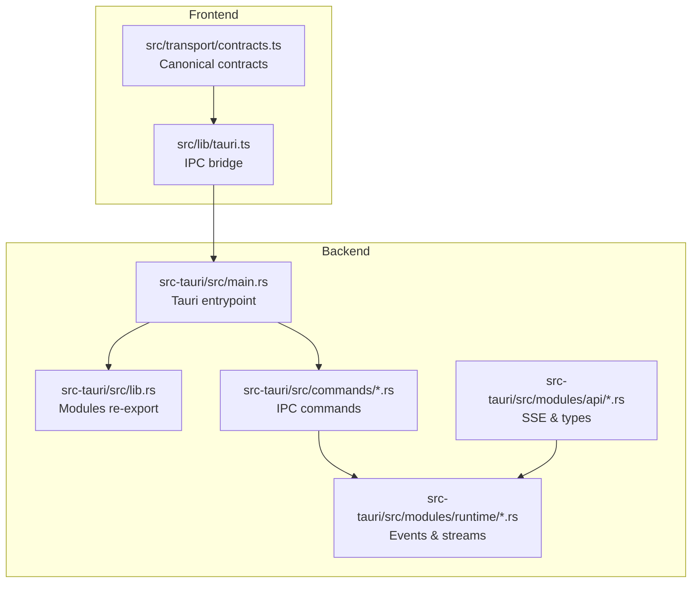
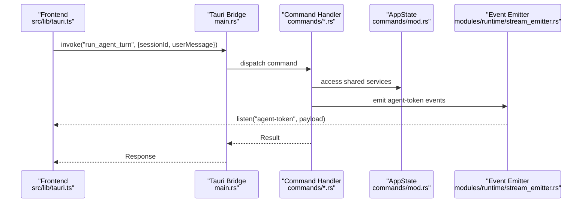
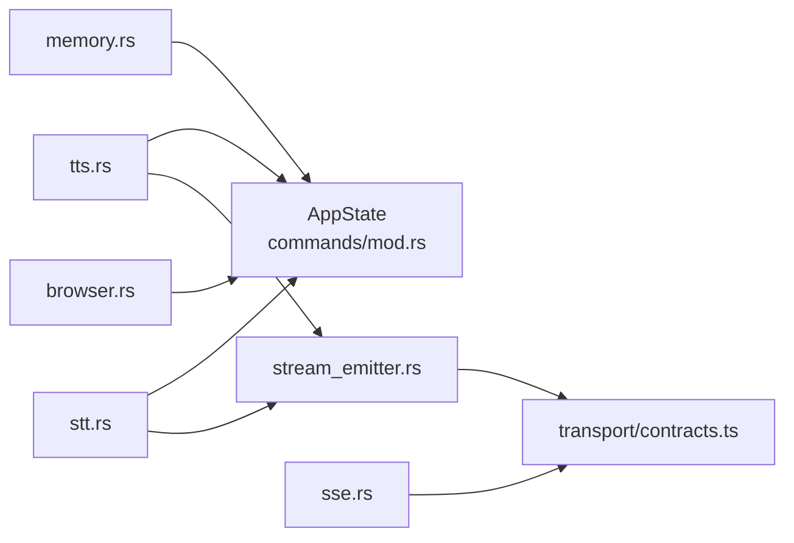

# API Reference

<cite>
**Referenced Files in This Document**
- [main.rs](file://src-tauri/src/main.rs)
- [lib.rs](file://src-tauri/src/lib.rs)
- [commands/mod.rs](file://src-tauri/src/commands/mod.rs)
- [commands/memory.rs](file://src-tauri/src/commands/memory.rs)
- [commands/tts.rs](file://src-tauri/src/commands/tts.rs)
- [commands/browser.rs](file://src-tauri/src/commands/browser.rs)
- [commands/stt.rs](file://src-tauri/src/commands/stt.rs)
- [modules/runtime/stream_emitter.rs](file://src-tauri/src/modules/runtime/stream_emitter.rs)
- [modules/api/sse.rs](file://src-tauri/src/modules/api/sse.rs)
- [modules/api/types.rs](file://src-tauri/src/modules/api/types.rs)
- [src/lib/tauri.ts](file://src/lib/tauri.ts)
- [src/transport/contracts.ts](file://src/transport/contracts.ts)
</cite>

## Table of Contents
1. [Introduction](#introduction)
2. [Project Structure](#project-structure)
3. [Core Components](#core-components)
4. [Architecture Overview](#architecture-overview)
5. [Detailed Component Analysis](#detailed-component-analysis)
6. [Dependency Analysis](#dependency-analysis)
7. [Performance Considerations](#performance-considerations)
8. [Troubleshooting Guide](#troubleshooting-guide)
9. [Conclusion](#conclusion)
10. [Appendices](#appendices)

## Introduction
This document describes the If2Ai Tauri command interface and internal APIs. It covers:
- Tauri IPC commands for memory operations, tool execution, browser control, and speech processing
- WebSocket/SSE parsing for streaming responses
- Event types and payloads for real-time state updates
- Command execution flow, parameter validation, and response processing
- Practical usage examples from both frontend and backend perspectives
- Authentication, rate limiting, and security considerations
- Migration and backwards compatibility guidance

## Project Structure
If2Ai integrates a Rust backend (Tauri) with a TypeScript frontend. The backend exposes IPC commands and events; the frontend consumes them via a thin transport bridge and canonical contracts.

**Diagram sources**
- [main.rs:1-800](file://src-tauri/src/main.rs#L1-800)
- [lib.rs:1-23](file://src-tauri/src/lib.rs#L1-23)
- [commands/mod.rs:1-418](file://src-tauri/src/commands/mod.rs#L1-418)
- [modules/runtime/stream_emitter.rs:1-318](file://src-tauri/src/modules/runtime/stream_emitter.rs#L1-318)
- [modules/api/sse.rs:1-282](file://src-tauri/src/modules/api/sse.rs#L1-282)

**Section sources**
- [main.rs:1-800](file://src-tauri/src/main.rs#L1-800)
- [lib.rs:1-23](file://src-tauri/src/lib.rs#L1-23)

## Core Components
- Tauri IPC commands: Implemented in Rust under src-tauri/src/commands/*.rs and exposed via tauri::Builder in main.rs.
- Runtime event emitter: Centralizes agent-token and memory_after_turn events for the frontend.
- SSE parser: Parses server-sent events for streaming responses.
- Transport contracts: Canonical TypeScript DTOs mirrored from Rust structs.

Key responsibilities:
- Memory commands: recall, export, promote/demote, compile, and summary listing
- Speech commands: TTS health/status, synthesis, streaming, warmup, voice management
- Browser commands: session listing, takeover/release, profile management, settings
- STT commands: model status, settings, transcription, model download progress
- Events: agent-token, permission-request, memory_after_turn, memory_event, tts:* and stt:* events

**Section sources**
- [commands/mod.rs:1-418](file://src-tauri/src/commands/mod.rs#L1-418)
- [modules/runtime/stream_emitter.rs:1-318](file://src-tauri/src/modules/runtime/stream_emitter.rs#L1-318)
- [modules/api/sse.rs:1-282](file://src-tauri/src/modules/api/sse.rs#L1-282)

## Architecture Overview
The backend initializes AppState with shared services (memory, tools, sessions, learning, harness, etc.) and registers IPC commands. Commands operate on AppState and may emit Tauri events to the frontend. Streaming responses are delivered via Tauri events (agent-token) or SSE parsing for external providers.

**Diagram sources**
- [main.rs:784-800](file://src-tauri/src/main.rs#L784-800)
- [commands/mod.rs:28-252](file://src-tauri/src/commands/mod.rs#L28-252)
- [modules/runtime/stream_emitter.rs:212-277](file://src-tauri/src/modules/runtime/stream_emitter.rs#L212-277)

## Detailed Component Analysis

### Memory Commands
Purpose: Manage memory entries, promotions, exports, and compiled memory snapshots.

- memory_recall(query, category?, limit?, scope_kind?, session_id?, project_id?)
  - Parameters: query string, optional category, limit, optional scope selection
  - Returns: Array of MemoryEntryDto
  - Behavior: Scoped recall when scope_kind/session_id/project_id provided; otherwise legacy unscoped recall
- memory_delete(key)
  - Parameters: key string
  - Returns: Unit
- memory_export(category?, scope_kind?, session_id?, project_id?)
  - Parameters: optional category and scope
  - Returns: Array of MemoryEntryDto
- memory_purge(category)
  - Parameters: category string
  - Returns: Unit
- memory_clear_all()
  - Returns: Removed row count
  - Emits: memory_cleared audit event
- memory_promotion_candidates()
  - Returns: Promotion recommendations
- memory_promote(key, target_scope_kind, project_id?)
  - Validates target scope and project_id when required
  - Emits: memory_promoted audit event
- memory_demote(key, target_scope_kind, session_id?, project_id?)
  - Validates upward demotion and session/project requirements
  - Emits: memory_demoted audit event
- memory_compile_now(scope)
  - Triggers compile pipeline (today, week, longterm, facts) and assembly
  - Returns: CompileReport
- memory_compiled_read(scope)
  - Reads compiled *.md snapshots
  - Returns: CompiledMemoryDto
- memory_compiled_clear(scope)
  - Clears compiled cache and fingerprints
- memory_summaries_list(scope, limit?, since_days?)
  - Lists session summaries within a time window

Data models and scopes:
- MemoryEntryDto: key, content, category, timestamps, importance, access_count, trust_score, optional scope tags
- MemoryScopeKind: global, project, session
- CompileReport: per-stage results and assembled flag
- CompiledSection: content, last_compiled_at, char count
- CompiledMemoryDto: assembled memory.md and per-section content
- SessionSummaryDto: per-session rolling/compact summaries

Validation and error handling:
- Missing identifiers degrade gracefully to global fallback
- Errors mapped to string messages
- Promotion/Demotion validates tier transitions and required identifiers

**Section sources**
- [commands/memory.rs:134-758](file://src-tauri/src/commands/memory.rs#L134-758)

### Speech Commands (TTS)
Purpose: Health, warmup, synthesis, streaming, and voice management.

- tts_health()
  - Returns: TtsHealthResponse (status, warmup_state, progress, provider_state, queue_depth)
- tts_warmup_status()
  - Returns: WarmupStatusResponse (state, progress, message, error?)
- tts_start_warmup()
  - Triggers async warmup
- tts_synthesize(text, demo_id?, voice_id?, prompt_audio_path?, params)
  - Returns: SynthesisResponse (audio_base64, sample_rate, duration_seconds, voice, text_chunks)
- tts_stream_start(text, demo_id?, voice_id?, prompt_audio_path?, params)
  - Returns: StreamStartResponse (stream_id, sample_rate, channels)
- tts_stream_status(stream_id)
  - Returns: JSON snapshot of job state
- tts_stream_result(stream_id)
  - Blocks until done or failed, returns final state
- tts_stream_close(stream_id)
  - Cancels or closes a stream
- tts_demo_audio(demo_id)
  - Returns: DemoAudioResponse (audio_base64, content_type)
- tts_list_voices(), tts_list_voice_assets(), tts_voice_audio(), tts_cached_voice_preview(), tts_warm_voice_preview()
- tts_upload_user_voice(), tts_delete_user_voice(), tts_rename_user_voice(), tts_preview_voice()
- tts_delete_user_voice(), tts_set_default_tts_profile(), tts_save_settings(), tts_get_settings()

Events:
- tts:stream-chunk (PCM16LE base64 chunks)
- tts:stream-end (completion/failure)

Provider lifecycle:
- ProviderState: NotLoaded, Loading, Loaded, Failed, Evicted
- ProviderHandle: lazy load, idle eviction, queue depth tracking

Rate limiting and concurrency:
- Queue depth tracked per provider
- Warmup ensures readiness before synthesis

**Section sources**
- [commands/tts.rs:406-800](file://src-tauri/src/commands/tts.rs#L406-800)
- [modules/runtime/stream_emitter.rs:190-211](file://src-tauri/src/modules/runtime/stream_emitter.rs#L190-211)

### Speech Commands (STT)
Purpose: OpenFlow/SenseVoice speech-to-text, model status, and download progress.

- stt_model_status()
  - Returns: SttModelStatus (openflow_ready, openflow_model_dir)
- stt_get_settings()
  - Returns: SttSettingsDto (provider: "openflow")
- stt_save_settings(request)
  - Saves current settings
- stt_transcribe({audio_bytes_base64, language?, sample_rate?, provider_override?})
  - Returns: SttTranscribeResponse (text, language, elapsed_seconds, provider)
- stt_download_openflow_model({preset?, force?})
  - Emits: stt:openflow-download-progress events during download

**Section sources**
- [commands/stt.rs:1-222](file://src-tauri/src/commands/stt.rs#L1-222)

### Browser Control Commands
Purpose: Manage browser sessions, profiles, settings, and takeover.

- get_browser_sessions()
  - Returns: Vec<BrowserStatusEntry>
- close_browser_session(session_id)
- get_chrome_status()
  - Returns: ChromeStatusPayload (found, path?)
- request_browser_status(session_id)
- list_browser_profiles()
  - Returns: Vec<ProfileEntry>
- clear_browser_profile(session_id)
  - Requires session to be closed first
- get_browser_settings()
  - Returns: BrowserSettings
- set_browser_settings(settings)
- request_browser_takeover(session_id)
  - Returns: NavigateResult
- get_browser_action_log(session_id)
  - Returns: Vec<ActionLogEntry>
- release_browser_takeover(session_id, back_to_headless?)

**Section sources**
- [commands/browser.rs:1-224](file://src-tauri/src/commands/browser.rs#L1-224)

### Agent Streaming and Events
Purpose: Emit canonical agent-token events and memory_after_turn envelopes.

- AgentStreamEmitter
  - Emits: text_delta, thinking_delta, thinking_start, stream_complete, stream_error
  - Also supports generic emit_event for non-agent-token events
- Event names:
  - AGENT_TOKEN_EVENT: "agent-token"
  - PERMISSION_REQUEST_EVENT: "permission-request"
  - MEMORY_EVENT: "memory_event"
  - MEMORY_AFTER_TURN_EVENT: "memory_after_turn"

Frontend consumption:
- src/lib/tauri.ts provides listenToAgentTokenStream, listenToStream, listenToPermissionRequests
- Transport contracts define StreamTokenPayload, PermissionRequestPayload, MemoryEventPayload, MemoryAfterTurnPayload

**Section sources**
- [modules/runtime/stream_emitter.rs:60-277](file://src-tauri/src/modules/runtime/stream_emitter.rs#L60-277)
- [src/lib/tauri.ts:240-292](file://src/lib/tauri.ts#L240-292)
- [src/transport/contracts.ts:338-387](file://src/transport/contracts.ts#L338-387)

### SSE Parsing for Streaming Responses
Purpose: Parse server-sent events from external providers.

- SseParser: buffers chunks, splits frames by \n\n or \r\n\r\n, ignores ping and [DONE]
- parse_frame: extracts event and data lines, deserializes to StreamEvent variants
- Supported events: MessageStart, MessageDelta, ContentBlockStart, ContentBlockDelta, ContentBlockStop, MessageStop

**Section sources**
- [modules/api/sse.rs:1-282](file://src-tauri/src/modules/api/sse.rs#L1-282)
- [modules/api/types.rs:260-270](file://src-tauri/src/modules/api/types.rs#L260-270)

### Command Execution Flow and Validation
Typical flow:
1. Frontend invokes a Tauri command via src/lib/tauri.ts
2. Tauri main.rs registers handlers and routes to commands/*.rs
3. Command reads AppState, validates inputs, executes logic, and emits events
4. Frontend listens to events and updates UI

Validation patterns:
- Optional scope parameters degrade to global fallback
- Required identifiers validated before promotion/demotion
- Errors returned as string messages
- Provider warmup and readiness checks for TTS/STT

**Section sources**
- [main.rs:784-800](file://src-tauri/src/main.rs#L784-800)
- [commands/memory.rs:143-181](file://src-tauri/src/commands/memory.rs#L143-181)
- [commands/tts.rs:467-516](file://src-tauri/src/commands/tts.rs#L467-516)
- [commands/stt.rs:130-160](file://src-tauri/src/commands/stt.rs#L130-160)

### Practical Usage Examples

Frontend (TypeScript):
- Start a streaming agent turn and listen to tokens:
  - runAgentTurn(sessionId, userMessage)
  - startAgentStream(sessionId, userMessage)
  - listenToAgentTokenStream(handler)
- Memory operations:
  - memory_recall(query, undefined, 50, "project", sessionId, projectId)
  - memory_promote(key, "global", projectId)
  - memory_compiled_read("all")
- TTS:
  - tts_health()
  - tts_stream_start(text, undefined, voiceId, undefined, generationParams)
  - listen("tts:stream-chunk", handler)
  - tts_stream_close(streamId)
- STT:
  - stt_model_status()
  - stt_transcribe({audio_bytes_base64, language, sample_rate})
  - listen("stt:openflow-download-progress", handler)
- Browser:
  - request_browser_status(sessionId)
  - request_browser_takeover(sessionId)
  - release_browser_takeover(sessionId, true)

Backend (Rust):
- Add a memory entry with PII scrubbing and audit emission
- Promote/demote entries with scope validation
- Emit agent-token events for streaming UI updates
- Parse SSE frames for provider streams

**Section sources**
- [src/lib/tauri.ts:202-292](file://src/lib/tauri.ts#L202-292)
- [src/lib/tauri.ts:367-406](file://src/lib/tauri.ts#L367-406)
- [src/lib/tauri.ts:563-588](file://src/lib/tauri.ts#L563-588)
- [src/lib/tauri.ts:748-773](file://src/lib/tauri.ts#L748-773)
- [src/lib/tauri.ts:787-798](file://src/lib/tauri.ts#L787-798)

## Dependency Analysis
- AppState aggregates shared services (memory, tools, sessions, learning, harness, etc.) and is injected into commands
- Commands depend on AppState and may emit runtime events
- SSE parser is used for external provider streams
- Frontend depends on canonical contracts for type safety

**Diagram sources**
- [commands/mod.rs:28-252](file://src-tauri/src/commands/mod.rs#L28-252)
- [commands/memory.rs:134-758](file://src-tauri/src/commands/memory.rs#L134-758)
- [commands/tts.rs:406-800](file://src-tauri/src/commands/tts.rs#L406-800)
- [commands/stt.rs:1-222](file://src-tauri/src/commands/stt.rs#L1-222)
- [commands/browser.rs:1-224](file://src-tauri/src/commands/browser.rs#L1-224)
- [modules/runtime/stream_emitter.rs:212-277](file://src-tauri/src/modules/runtime/stream_emitter.rs#L212-277)
- [modules/api/sse.rs:1-282](file://src-tauri/src/modules/api/sse.rs#L1-282)
- [src/transport/contracts.ts:338-387](file://src/transport/contracts.ts#L338-387)

**Section sources**
- [commands/mod.rs:28-252](file://src-tauri/src/commands/mod.rs#L28-252)

## Performance Considerations
- Memory operations:
  - Scoped recall/export reduce database scans
  - Compile pipeline caches fingerprints to avoid redundant LLM calls
- TTS:
  - Lazy provider load and idle eviction reduce memory footprint
  - Queue depth tracks concurrency and backpressure
- STT:
  - Model readiness check prevents expensive warmup on every call
- SSE parsing:
  - Chunked buffering and frame splitting minimize allocations

[No sources needed since this section provides general guidance]

## Troubleshooting Guide
Common issues and resolutions:
- TTS provider not ready:
  - Call tts_health() to check warmup_state and provider_state
  - Invoke tts_start_warmup() and poll tts_warmup_status()
- TTS streaming stalls:
  - Verify tts:stream-chunk events are received; ensure stream_id matches
  - Use tts_stream_status() and tts_stream_result() to diagnose
- STT model missing:
  - Check stt_model_status(); download via stt_download_openflow_model()
  - Listen to stt:openflow-download-progress for progress
- Browser takeover conflicts:
  - Ensure session is closed before clear_browser_profile()
  - Use request_browser_takeover() and release_browser_takeover() appropriately
- Memory scope errors:
  - Provide required identifiers (project_id/session_id) for promotion/demotion
  - Use memory_summaries_list() to verify scope visibility

**Section sources**
- [commands/tts.rs:406-455](file://src-tauri/src/commands/tts.rs#L406-455)
- [commands/stt.rs:130-160](file://src-tauri/src/commands/stt.rs#L130-160)
- [commands/browser.rs:105-121](file://src-tauri/src/commands/browser.rs#L105-121)
- [commands/memory.rs:298-347](file://src-tauri/src/commands/memory.rs#L298-347)

## Conclusion
If2Ai’s Tauri interface provides a robust, event-driven API for memory, speech, browser, and agent interactions. The canonical contracts and centralized event emitter ensure consistent frontend integration. Use the provided commands and events to build responsive, secure, and efficient workflows.

[No sources needed since this section summarizes without analyzing specific files]

## Appendices

### Authentication, Rate Limiting, and Security
- Authentication: Commands are invoked via Tauri IPC; capability permissions are defined in capabilities JSON. Use appropriate permissions for sensitive operations.
- Rate limiting:
  - TTS provider queue depth indicates concurrent requests and waiting tasks
  - JobRunner enforces retry budgets and limits for background memory jobs
- Security:
  - ThreatScanner scans and redacts PII on memory writes; emits memory_pii_redacted audit events
  - Permission prompts gate tool execution; respond_permission is used to approve/deny

**Section sources**
- [commands/memory.rs:36-51](file://src-tauri/src/commands/memory.rs#L36-51)
- [commands/tts.rs:286-301](file://src-tauri/src/commands/tts.rs#L286-301)
- [modules/runtime/stream_emitter.rs:212-277](file://src-tauri/src/modules/runtime/stream_emitter.rs#L212-277)

### Migration and Backwards Compatibility
- Contract versioning:
  - CONTRACTS_SCHEMA_VERSION in TypeScript mirrors backend schema markers
  - MemoryAfterTurnPayload carries traceVersion for governance trace compatibility
- Event names:
  - AGENT_TOKEN_EVENT, PERMISSION_REQUEST_EVENT, MEMORY_EVENT, MEMORY_AFTER_TURN_EVENT are centralized
- Payload shapes:
  - Legacy snake_case payloads remain for agent-token, permission-request, and memory_event channels
  - New canonical camelCase contracts live in transport layer for runtime-projection pipeline
- Recommendations:
  - Prefer listening to canonical events and payloads
  - Maintain compatibility by handling optional fields and ignoring unknown ones
  - Use schema version checks for major contract changes

**Section sources**
- [src/transport/contracts.ts:26-73](file://src/transport/contracts.ts#L26-73)
- [src/transport/contracts.ts:389-481](file://src/transport/contracts.ts#L389-481)
- [modules/runtime/stream_emitter.rs:60-96](file://src-tauri/src/modules/runtime/stream_emitter.rs#L60-96)