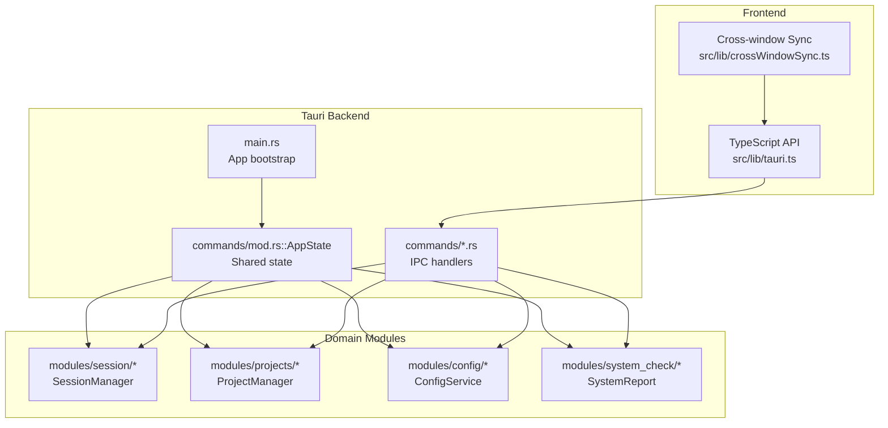
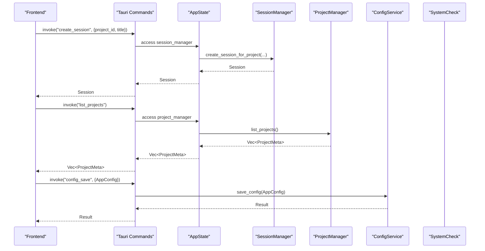
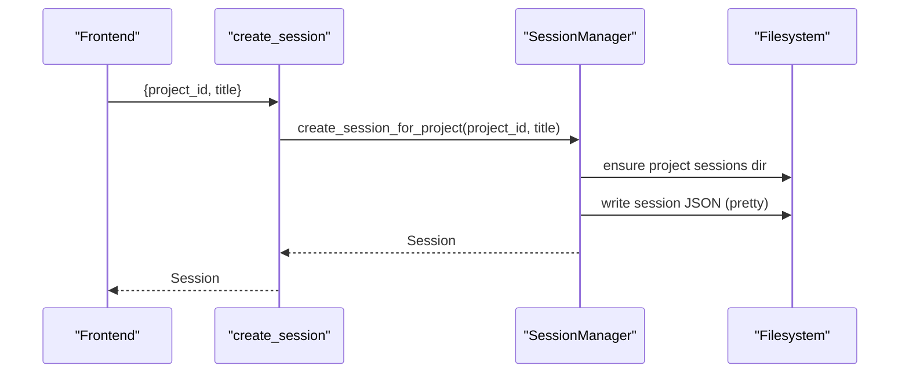
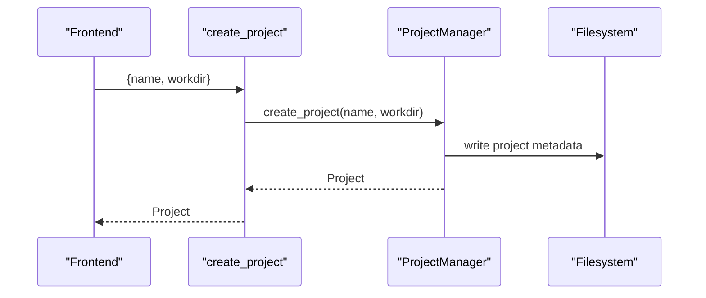
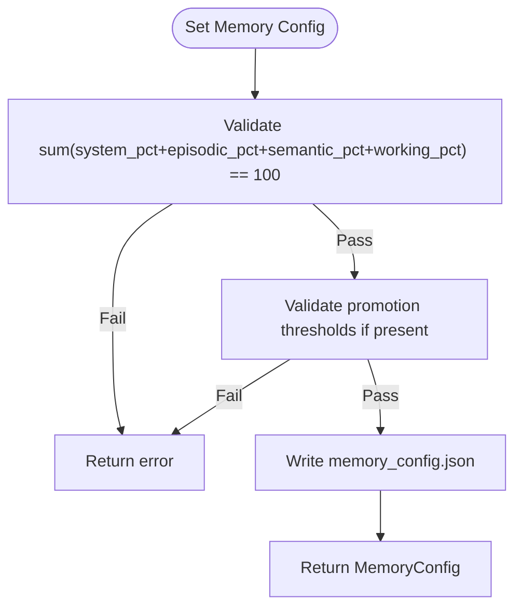
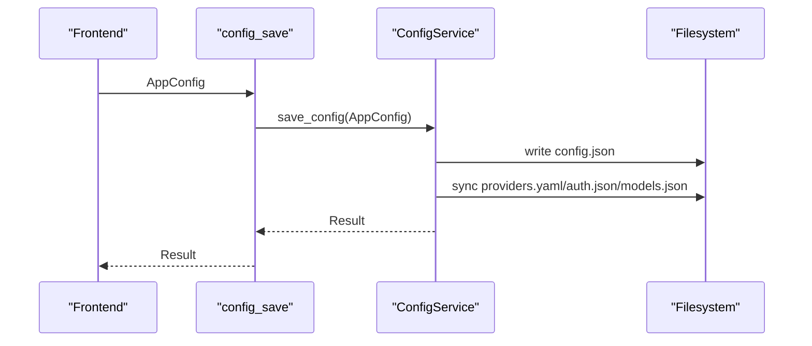
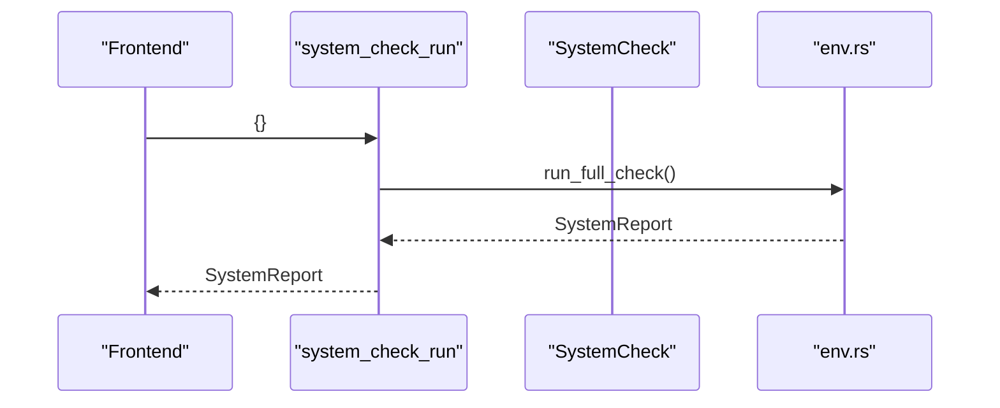
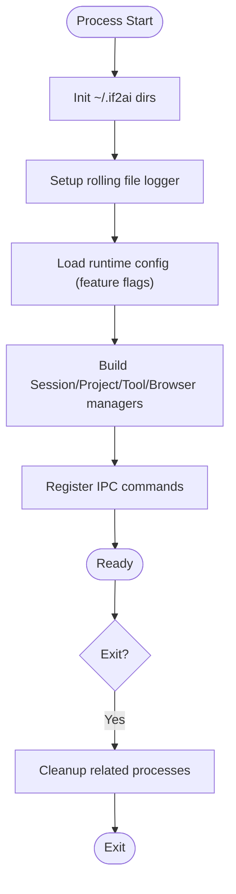
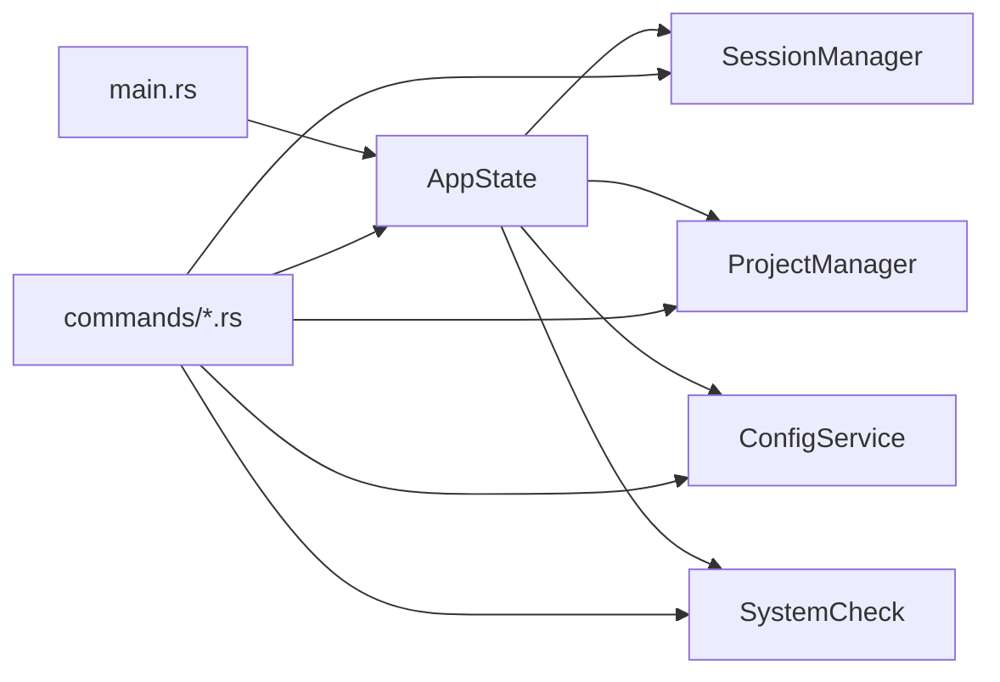

# Application Management API

<cite>
**Referenced Files in This Document**
- [main.rs](file://src-tauri/src/main.rs)
- [commands/mod.rs](file://src-tauri/src/commands/mod.rs)
- [commands/session.rs](file://src-tauri/src/commands/session.rs)
- [modules/session/manager.rs](file://src-tauri/src/modules/session/manager.rs)
- [commands/project.rs](file://src-tauri/src/commands/project.rs)
- [modules/projects/manager.rs](file://src-tauri/src/modules/projects/manager.rs)
- [commands/settings.rs](file://src-tauri/src/commands/settings.rs)
- [commands/config.rs](file://src-tauri/src/commands/config.rs)
- [modules/config/service.rs](file://src-tauri/src/modules/config/service.rs)
- [commands/system_check.rs](file://src-tauri/src/commands/system_check.rs)
- [modules/system_check/types.rs](file://src-tauri/src/modules/system_check/types.rs)
- [modules/system_check/env.rs](file://src-tauri/src/modules/system_check/env.rs)
- [src/lib/tauri.ts](file://src/lib/tauri.ts)
- [src/lib/crossWindowSync.ts](file://src/lib/crossWindowSync.ts)
</cite>

## Table of Contents
1. [Introduction](#introduction)
2. [Project Structure](#project-structure)
3. [Core Components](#core-components)
4. [Architecture Overview](#architecture-overview)
5. [Detailed Component Analysis](#detailed-component-analysis)
6. [Dependency Analysis](#dependency-analysis)
7. [Performance Considerations](#performance-considerations)
8. [Troubleshooting Guide](#troubleshooting-guide)
9. [Conclusion](#conclusion)
10. [Appendices](#appendices)

## Introduction
This document describes the Application Management API for If2Ai, focusing on session management, project handling, settings configuration, and system configuration. It defines endpoints, parameter schemas, and operational semantics for managing application state, persistence, and lifecycle. It also covers multi-session handling, project-based isolation, configuration inheritance, state synchronization, diagnostics, and maintenance operations.

## Project Structure
The If2Ai backend exposes IPC commands via Tauri. The main entry initializes AppState, which aggregates managers and services for sessions, projects, memory/learning infrastructure, configuration, and system checks. Frontend bindings are provided in TypeScript for invoking these commands.

**Diagram sources**
- [main.rs:406-800](file://src-tauri/src/main.rs#L406-L800)
- [commands/mod.rs:29-252](file://src-tauri/src/commands/mod.rs#L29-L252)
- [commands/session.rs:1-101](file://src-tauri/src/commands/session.rs#L1-L101)
- [modules/session/manager.rs:264-725](file://src-tauri/src/modules/session/manager.rs#L264-L725)
- [commands/project.rs:1-107](file://src-tauri/src/commands/project.rs#L1-L107)
- [modules/projects/manager.rs:122-157](file://src-tauri/src/modules/projects/manager.rs#L122-L157)
- [commands/config.rs:1-51](file://src-tauri/src/commands/config.rs#L1-L51)
- [modules/config/service.rs:30-109](file://src-tauri/src/modules/config/service.rs#L30-L109)
- [commands/system_check.rs:1-108](file://src-tauri/src/commands/system_check.rs#L1-L108)
- [modules/system_check/types.rs:1-44](file://src-tauri/src/modules/system_check/types.rs#L1-L44)

**Section sources**
- [main.rs:406-800](file://src-tauri/src/main.rs#L406-L800)
- [commands/mod.rs:29-252](file://src-tauri/src/commands/mod.rs#L29-L252)

## Core Components
- Session Management: Create, list, rename, pin/unpin, and delete sessions; supports legacy and project-scoped sessions.
- Project Management: Create, list, get, rename, and delete projects; project-scoped session storage.
- Settings and Memory Configuration: Persist and validate memory budget and recall policies; export trajectories.
- System Configuration: Load/save onboarding config; validate; reset onboarding; system checks and embedded model management.
- Application State: Central AppState holds managers and shared services; lifecycle hooks for startup and cleanup.

**Section sources**
- [commands/session.rs:1-101](file://src-tauri/src/commands/session.rs#L1-L101)
- [modules/session/manager.rs:264-725](file://src-tauri/src/modules/session/manager.rs#L264-L725)
- [commands/project.rs:1-107](file://src-tauri/src/commands/project.rs#L1-L107)
- [modules/projects/manager.rs:122-157](file://src-tauri/src/modules/projects/manager.rs#L122-L157)
- [commands/settings.rs:114-191](file://src-tauri/src/commands/settings.rs#L114-L191)
- [commands/config.rs:1-51](file://src-tauri/src/commands/config.rs#L1-L51)
- [modules/config/service.rs:30-109](file://src-tauri/src/modules/config/service.rs#L30-L109)
- [commands/system_check.rs:18-43](file://src-tauri/src/commands/system_check.rs#L18-L43)

## Architecture Overview
The backend initializes AppState with managers and services, registers IPC commands, and exposes them to the frontend. Commands operate on domain managers and services, persisting state to disk and coordinating with shared infrastructure.

**Diagram sources**
- [commands/session.rs:14-34](file://src-tauri/src/commands/session.rs#L14-L34)
- [modules/session/manager.rs:360-395](file://src-tauri/src/modules/session/manager.rs#L360-L395)
- [commands/project.rs:62-70](file://src-tauri/src/commands/project.rs#L62-L70)
- [modules/projects/manager.rs:149-157](file://src-tauri/src/modules/projects/manager.rs#L149-L157)
- [commands/config.rs:20-27](file://src-tauri/src/commands/config.rs#L20-L27)
- [modules/config/service.rs:91-109](file://src-tauri/src/modules/config/service.rs#L91-L109)

## Detailed Component Analysis

### Session Management API
Endpoints:
- create_session(project_id, title) -> Session
- list_sessions() -> Vec<SessionMeta>
- list_project_sessions(project_id) -> Vec<SessionMeta>
- delete_session(id) -> void
- rename_session(id, title) -> SessionMeta
- set_session_pinned(id, pinned) -> Session

Parameter schemas:
- create_session: project_id (string, optional), title (string, required)
- list_project_sessions: project_id (string, required)
- delete_session: id (string, required)
- rename_session: id (string, required), title (string, required)
- set_session_pinned: id (string, required), pinned (boolean, required)

Behavior:
- Legacy sessions use a flat sessions directory; project-scoped sessions use a nested directory under projects/<id>/sessions/.
- Listing sorts pinned sessions first, then by last update time (newest first).
- Renaming enforces non-empty titles; pinning persists with updated timestamps.

**Diagram sources**
- [commands/session.rs:14-34](file://src-tauri/src/commands/session.rs#L14-L34)
- [modules/session/manager.rs:360-395](file://src-tauri/src/modules/session/manager.rs#L360-L395)

**Section sources**
- [commands/session.rs:10-101](file://src-tauri/src/commands/session.rs#L10-L101)
- [modules/session/manager.rs:264-725](file://src-tauri/src/modules/session/manager.rs#L264-L725)

### Project Management API
Endpoints:
- create_project(name, workdir) -> Project
- list_projects() -> Vec<ProjectMeta>
- get_project(id) -> Project
- rename_project(id, new_name) -> Project
- delete_project(id) -> void

Parameter schemas:
- create_project: name (string, required), workdir (string, required)
- rename_project: id (string, required), new_name (string, required)
- delete_project: id (string, required)

Behavior:
- Projects are stored in ~/.if2ai/projects/<id>/ with metadata and session isolation.
- Deleting a project removes all contained sessions.

**Diagram sources**
- [commands/project.rs:40-59](file://src-tauri/src/commands/project.rs#L40-L59)
- [modules/projects/manager.rs:122-157](file://src-tauri/src/modules/projects/manager.rs#L122-L157)

**Section sources**
- [commands/project.rs:1-107](file://src-tauri/src/commands/project.rs#L1-L107)
- [modules/projects/manager.rs:122-157](file://src-tauri/src/modules/projects/manager.rs#L122-L157)

### Settings and Memory Configuration API
Endpoints:
- get_memory_config() -> MemoryConfig
- set_memory_config(MemoryConfigInput) -> MemoryConfig
- export_trajectories() -> string

Parameter schemas:
- MemoryConfigInput:
  - total_tokens: integer
  - system_pct: integer (0-100)
  - episodic_pct: integer (0-100)
  - semantic_pct: integer (0-100)
  - working_pct: integer (0-100)
  - control_plane_v1_enabled: boolean (optional)
  - recall_mode: enum "lexical"|"hybrid" (optional)
  - policy_enforce_mode: enum "shadow"|"enforce" (optional)
  - promotion: PromotionThresholds (optional)

Validation:
- Percentages must sum to 100.
- Promotion thresholds validated before persisting.

Behavior:
- Writes to ~/.if2ai/memory_config.json.
- Trajectory export copies .jsonl files to ~/.if2ai/trajectories/export/.

**Diagram sources**
- [commands/settings.rs:150-191](file://src-tauri/src/commands/settings.rs#L150-L191)

**Section sources**
- [commands/settings.rs:114-191](file://src-tauri/src/commands/settings.rs#L114-L191)

### System Configuration API
Endpoints:
- config_load() -> AppConfig
- config_save(AppConfig) -> void
- config_validate() -> string[]
- config_reset_onboarding() -> void

Parameter schemas:
- AppConfig: see module-level types (provider/model/channel configuration, routing, onboarding state).

Behavior:
- Dual-write: maintains ~/.if2ai/config.json and synchronizes Layer 2 files (providers.yaml, auth.json, models.json).
- Validation returns a list of issues; reset deletes onboarding and runtime config files.

**Diagram sources**
- [commands/config.rs:20-27](file://src-tauri/src/commands/config.rs#L20-L27)
- [modules/config/service.rs:91-109](file://src-tauri/src/modules/config/service.rs#L91-L109)

**Section sources**
- [commands/config.rs:1-51](file://src-tauri/src/commands/config.rs#L1-L51)
- [modules/config/service.rs:30-109](file://src-tauri/src/modules/config/service.rs#L30-L109)

### System Health and Diagnostics API
Endpoints:
- system_check_run() -> SystemReport
- embedded_model_download() -> void
- embedded_model_progress() -> number (0..1)
- get_model_config() -> ModelConfig
- set_model_config(ModelConfig) -> ModelConfig

Parameter schemas:
- ModelConfig:
  - embedded_model_name: string
  - hf_mirror_url: string (optional)

Behavior:
- System report includes CPU, GPU, memory, and embedded model status.
- Model config persisted to ~/.if2ai/model_config.json.

**Diagram sources**
- [commands/system_check.rs:18-25](file://src-tauri/src/commands/system_check.rs#L18-L25)
- [modules/system_check/env.rs:216-251](file://src-tauri/src/modules/system_check/env.rs#L216-L251)

**Section sources**
- [commands/system_check.rs:1-108](file://src-tauri/src/commands/system_check.rs#L1-L108)
- [modules/system_check/types.rs:1-44](file://src-tauri/src/modules/system_check/types.rs#L1-L44)
- [modules/system_check/env.rs:216-251](file://src-tauri/src/modules/system_check/env.rs#L216-L251)

### Application Lifecycle Management
Startup:
- Initializes directories, logging, and AppState.
- Constructs memory/learning infrastructure, tool registry, browser registry, and project/session managers.
- Registers IPC commands and manages cleanup hooks.

Shutdown:
- Cleanup hook runs OS-level process cleanup before exit.

**Diagram sources**
- [main.rs:406-800](file://src-tauri/src/main.rs#L406-L800)

**Section sources**
- [main.rs:406-800](file://src-tauri/src/main.rs#L406-L800)

### Multi-session Handling and Project Isolation
- Sessions are isolated by project_id; legacy sessions use a flat directory, project-scoped sessions use nested directories.
- Listing and restoration scan appropriate paths; deletion attempts legacy first, then project-scoped locations.
- Per-session memory toggles and timestamps are persisted with each session.

**Section sources**
- [modules/session/manager.rs:264-725](file://src-tauri/src/modules/session/manager.rs#L264-L725)

### Configuration Inheritance Patterns
- Onboarding config (config.json) is the primary source; Layer 2 files (providers.yaml, auth.json, models.json) are synchronized.
- Validation ensures completeness; reset clears onboarding and runtime files independently.

**Section sources**
- [modules/config/service.rs:30-109](file://src-tauri/src/modules/config/service.rs#L30-L109)

### State Synchronization and Cross-window Updates
- Frontend uses Tauri events to broadcast changes across windows (e.g., settings updates).
- Channels include cross:agent-voice-changed, cross:tts-settings-changed, cross:onboarding-reset, etc.

**Section sources**
- [src/lib/crossWindowSync.ts:1-111](file://src/lib/crossWindowSync.ts#L1-L111)

### Backup and Restore Operations
- Trajectory export: Copies .jsonl files to ~/.if2ai/trajectories/export/.
- Configuration reset: Deletes onboarding and runtime config files; preserves memory_config.json and trajectories.

**Section sources**
- [commands/settings.rs:193-221](file://src-tauri/src/commands/settings.rs#L193-L221)
- [modules/config/service.rs:289-312](file://src-tauri/src/modules/config/service.rs#L289-L312)

### Maintenance Operations
- System checks: CPU/GPU/memory detection and embedded model status.
- Model download: Background download with progress polling.
- Onboarding reset: Clears state.json and runtime config files.

**Section sources**
- [commands/system_check.rs:18-43](file://src-tauri/src/commands/system_check.rs#L18-L43)
- [modules/config/service.rs:289-312](file://src-tauri/src/modules/config/service.rs#L289-L312)

## Dependency Analysis
The backend composes AppState with managers and services. Commands depend on AppState to access managers and services. Persistence is file-based for sessions, projects, memory config, and trajectories.

**Diagram sources**
- [main.rs:406-800](file://src-tauri/src/main.rs#L406-L800)
- [commands/mod.rs:29-252](file://src-tauri/src/commands/mod.rs#L29-L252)

**Section sources**
- [commands/mod.rs:29-252](file://src-tauri/src/commands/mod.rs#L29-L252)

## Performance Considerations
- File I/O is synchronous in many operations; consider batching writes and avoiding frequent disk access for high-frequency updates.
- Memory budget validation occurs on the hot path; keep validation logic lightweight.
- System checks and model downloads are asynchronous; use progress endpoints to avoid blocking.

## Troubleshooting Guide
Common issues and resolutions:
- Session not found: Verify session id and project scoping; legacy sessions vs project-scoped paths.
- Invalid data errors: Check JSON schema compliance for sessions and projects.
- Memory config validation failures: Ensure percentages sum to 100 and promotion thresholds are valid.
- Configuration save conflicts: Only one write operation is permitted concurrently; avoid parallel saves.
- System check failures: Review CPU/GPU/memory detection logs and model download progress.

**Section sources**
- [modules/session/manager.rs:16-44](file://src-tauri/src/modules/session/manager.rs#L16-L44)
- [commands/settings.rs:150-191](file://src-tauri/src/commands/settings.rs#L150-L191)
- [modules/config/service.rs:91-109](file://src-tauri/src/modules/config/service.rs#L91-L109)
- [modules/system_check/env.rs:216-251](file://src-tauri/src/modules/system_check/env.rs#L216-L251)

## Conclusion
The If2Ai Application Management API provides robust IPC endpoints for session and project lifecycle management, settings and configuration persistence, and system health diagnostics. The design emphasizes clear separation of concerns, file-based persistence, and cross-window synchronization for a cohesive user experience.

## Appendices

### Endpoint Reference Summary
- Session
  - create_session(project_id?, title) -> Session
  - list_sessions() -> SessionMeta[]
  - list_project_sessions(project_id) -> SessionMeta[]
  - delete_session(id) -> void
  - rename_session(id, title) -> SessionMeta
  - set_session_pinned(id, pinned) -> Session
- Project
  - create_project(name, workdir) -> Project
  - list_projects() -> ProjectMeta[]
  - get_project(id) -> Project
  - rename_project(id, new_name) -> Project
  - delete_project(id) -> void
- Settings
  - get_memory_config() -> MemoryConfig
  - set_memory_config(MemoryConfigInput) -> MemoryConfig
  - export_trajectories() -> string
- Configuration
  - config_load() -> AppConfig
  - config_save(AppConfig) -> void
  - config_validate() -> string[]
  - config_reset_onboarding() -> void
- System Check
  - system_check_run() -> SystemReport
  - embedded_model_download() -> void
  - embedded_model_progress() -> number
  - get_model_config() -> ModelConfig
  - set_model_config(ModelConfig) -> ModelConfig

**Section sources**
- [commands/session.rs:10-101](file://src-tauri/src/commands/session.rs#L10-L101)
- [commands/project.rs:1-107](file://src-tauri/src/commands/project.rs#L1-L107)
- [commands/settings.rs:114-191](file://src-tauri/src/commands/settings.rs#L114-L191)
- [commands/config.rs:1-51](file://src-tauri/src/commands/config.rs#L1-L51)
- [commands/system_check.rs:18-43](file://src-tauri/src/commands/system_check.rs#L18-L43)