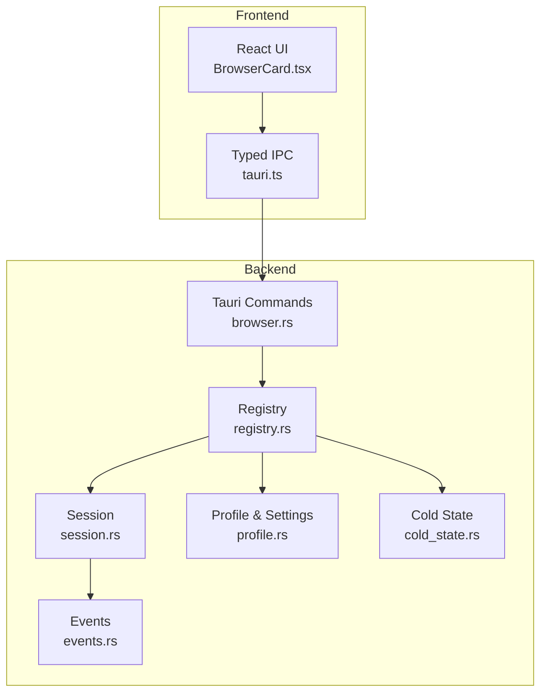
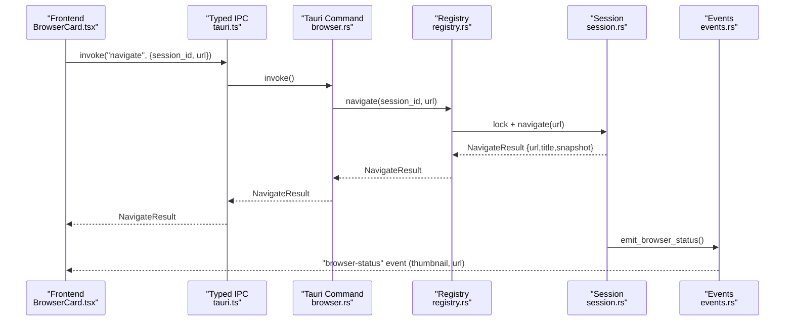
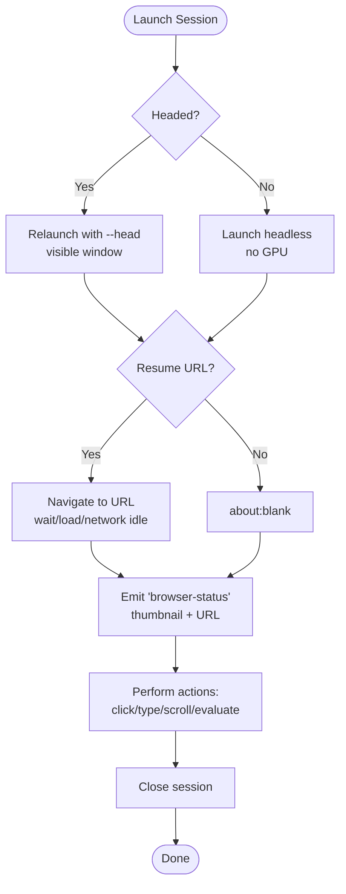
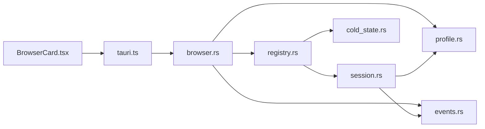

# Browser Control API

<cite>
**Referenced Files in This Document**
- [browser.rs](file://src-tauri/src/commands/browser.rs)
- [mod.rs](file://src-tauri/src/modules/browser/mod.rs)
- [session.rs](file://src-tauri/src/modules/browser/session.rs)
- [registry.rs](file://src-tauri/src/modules/browser/registry.rs)
- [profile.rs](file://src-tauri/src/modules/browser/profile.rs)
- [events.rs](file://src-tauri/src/modules/browser/events.rs)
- [cold_state.rs](file://src-tauri/src/modules/browser/cold_state.rs)
- [BrowserCard.tsx](file://src/components/browser/BrowserCard.tsx)
- [tauri.ts](file://src/lib/tauri.ts)
</cite>

## Table of Contents
1. [Introduction](#introduction)
2. [Project Structure](#project-structure)
3. [Core Components](#core-components)
4. [Architecture Overview](#architecture-overview)
5. [Detailed Component Analysis](#detailed-component-analysis)
6. [Dependency Analysis](#dependency-analysis)
7. [Performance Considerations](#performance-considerations)
8. [Troubleshooting Guide](#troubleshooting-guide)
9. [Conclusion](#conclusion)
10. [Appendices](#appendices)

## Introduction
This document describes the Browser Control API used by If2Ai’s browser automation system. It covers session lifecycle, navigation, automation actions, inspection, multi-tab management, profile and cookie handling, security and sandboxing, and debugging techniques. The API is exposed via Tauri commands and events, with a frontend BrowserCard that displays live browser status and allows user takeover.

## Project Structure
The browser control system is implemented in Rust (Tauri backend) and TypeScript/React (frontend). Key modules:
- Backend commands and modules under src-tauri/src/commands and src-tauri/src/modules/browser
- Frontend BrowserCard component and typed IPC wrappers under src/components and src/lib

**Diagram sources**
- [browser.rs:1-224](file://src-tauri/src/commands/browser.rs#L1-L224)
- [registry.rs:1-634](file://src-tauri/src/modules/browser/registry.rs#L1-L634)
- [session.rs:1-800](file://src-tauri/src/modules/browser/session.rs#L1-L800)
- [profile.rs:1-693](file://src-tauri/src/modules/browser/profile.rs#L1-L693)
- [events.rs:1-83](file://src-tauri/src/modules/browser/events.rs#L1-L83)
- [cold_state.rs:1-215](file://src-tauri/src/modules/browser/cold_state.rs#L1-L215)
- [BrowserCard.tsx:1-280](file://src/components/browser/BrowserCard.tsx#L1-L280)
- [tauri.ts:1179-1200](file://src/lib/tauri.ts#L1179-L1200)

**Section sources**
- [mod.rs:1-40](file://src-tauri/src/modules/browser/mod.rs#L1-L40)
- [browser.rs:1-224](file://src-tauri/src/commands/browser.rs#L1-L224)

## Core Components
- BrowserRegistry: Manages per-session BrowserSession instances, handles lifecycle, and emits status events.
- BrowserSession: Wraps a chromiumoxide Browser/Page, executes actions (navigate, click, type, scroll, evaluate), captures screenshots/thumbnails, and maintains logs.
- Profile and Settings: Controls where Chromium user-data-dir lives and persists browser preferences.
- Events: Emits “browser-status” events with live thumbnail and URL.
- Cold State: Persists last visited URL per session for auto-resume.

**Section sources**
- [registry.rs:44-75](file://src-tauri/src/modules/browser/registry.rs#L44-L75)
- [session.rs:262-308](file://src-tauri/src/modules/browser/session.rs#L262-L308)
- [profile.rs:56-169](file://src-tauri/src/modules/browser/profile.rs#L56-L169)
- [events.rs:19-36](file://src-tauri/src/modules/browser/events.rs#L19-L36)
- [cold_state.rs:25-36](file://src-tauri/src/modules/browser/cold_state.rs#L25-L36)

## Architecture Overview
End-to-end flow for a typical automation action:
1. Frontend invokes a Tauri command via typed IPC.
2. Backend command resolves session via BrowserRegistry and delegates to BrowserSession.
3. BrowserSession performs the action (e.g., navigate, click) and updates state.
4. Events module emits a “browser-status” event with thumbnail and URL.
5. Frontend BrowserCard listens and updates UI.

**Diagram sources**
- [browser.rs:40-85](file://src-tauri/src/commands/browser.rs#L40-L85)
- [registry.rs:241-261](file://src-tauri/src/modules/browser/registry.rs#L241-L261)
- [session.rs:616-656](file://src-tauri/src/modules/browser/session.rs#L616-L656)
- [events.rs:51-82](file://src-tauri/src/modules/browser/events.rs#L51-L82)
- [BrowserCard.tsx:76-112](file://src/components/browser/BrowserCard.tsx#L76-L112)

## Detailed Component Analysis

### Tauri Commands (Browser Control)
- get_browser_sessions: Lists active sessions and their status.
- close_browser_session: Gracefully closes a session.
- get_chrome_status: Reports presence and path of Chrome/Chromium binary.
- request_browser_status: Forces emission of a “browser-status” event for a session.
- list_browser_profiles: Lists persistent profile directories.
- clear_browser_profile: Deletes a persistent profile (requires session closed).
- get_browser_settings / set_browser_settings: Reads/writes browser.toml settings.
- request_browser_takeover: Relaunches session in headed mode for user takeover.
- release_browser_takeover: Releases takeover and optionally relaunches headless.
- get_browser_action_log: Returns live action log for a session.

Notes:
- All commands accept a session_id string except where noted.
- Errors are returned as strings; consumers should handle them.

**Section sources**
- [browser.rs:40-224](file://src-tauri/src/commands/browser.rs#L40-L224)

### Session Lifecycle and Navigation
- Launch: BrowserRegistry.launch/lunch_with_mode creates a BrowserSession bound to a profile.
- Navigate: BrowserSession.goto(url), waits for navigation, captures snapshot, logs action.
- Close: BrowserRegistry.close removes session and clears cold-state record.

**Diagram sources**
- [registry.rs:174-194](file://src-tauri/src/modules/browser/registry.rs#L174-L194)
- [session.rs:324-497](file://src-tauri/src/modules/browser/session.rs#L324-L497)
- [events.rs:51-82](file://src-tauri/src/modules/browser/events.rs#L51-L82)

**Section sources**
- [registry.rs:166-237](file://src-tauri/src/modules/browser/registry.rs#L166-L237)
- [session.rs:324-497](file://src-tauri/src/modules/browser/session.rs#L324-L497)

### Automation Actions
Supported actions via BrowserRegistry delegation:
- navigate(url): Returns NavigateResult with url, title, AXTree snapshot.
- snapshot(): Returns current AXTree snapshot text.
- screenshot(): Full-page JPEG (base64).
- thumbnail(): Small JPEG thumbnail (base64).
- click(ref): Click element identified by data-if2ai-ref.
- type_text(text, ref?, enter?): Types text into focused element; optionally press Enter.
- scroll(direction, pages): Scrolls the page.
- select_option(ref, value): Selects option in a select element.
- press_key(key): Sends named key event.
- wait(timeout_ms, state): Waits for DOMContentLoaded/load/network idle.
- evaluate(expression): Evaluates JavaScript and returns serialized result.

Post-action behavior:
- Delays and opportunistic navigation waits improve reliability for SPA transitions.
- Snapshots are captured after actions for LLM context.

**Section sources**
- [registry.rs:241-345](file://src-tauri/src/modules/browser/registry.rs#L241-L345)
- [session.rs:616-800](file://src-tauri/src/modules/browser/session.rs#L616-L800)

### Multi-Tab Management
- list_tabs(): Returns TabInfo for each open tab (index, URL, title, active, target_id).
- switch_tab(idx): Makes the specified tab active.
- close_tab(idx): Closes the specified tab; returns remaining tab count.

Constraints:
- Max tracked tabs capped to prevent resource exhaustion.

**Section sources**
- [registry.rs:347-368](file://src-tauri/src/modules/browser/registry.rs#L347-L368)
- [session.rs:57-80](file://src-tauri/src/modules/browser/session.rs#L57-L80)

### Inspection and Observability
- Downloads ledger: Tracks initiated downloads with state, sizes, and saved paths.
- Console events: Captures warnings/errors from page console.
- Network errors: Records HTTP 400+ responses.
- Action log: Per-session log of actions with timestamps and outcomes.

**Section sources**
- [session.rs:86-176](file://src-tauri/src/modules/browser/session.rs#L86-L176)
- [registry.rs:370-420](file://src-tauri/src/modules/browser/registry.rs#L370-L420)

### Profile Management and Cookie Handling
- Modes:
  - PerSessionPersistent: Isolated profile per session; cookies persist.
  - Shared: Single shared profile; cookies shared across sessions.
  - Ephemeral: Temporary profile; wiped on drop.
- Resolution order: IF2AI_BROWSER_PROFILE_MODE env > browser.toml > default.
- Listing and clearing profiles supported; clear requires session closed.

**Section sources**
- [profile.rs:56-169](file://src-tauri/src/modules/browser/profile.rs#L56-L169)
- [profile.rs:324-401](file://src-tauri/src/modules/browser/profile.rs#L324-L401)

### Security, Sandboxing, and Stealth
- no_sandbox() and disable-setuid-sandbox flags are set to avoid OS-level conflicts.
- disable-dev-shm-usage mitigates Linux resource issues.
- disable-blink-features=AutomationControlled and exclude-switches=enable-automation reduce automation flags.
- Stealth mode patches navigator.webdriver and fakes browser attributes.
- Headed mode positions window separately to avoid overlap.

**Section sources**
- [session.rs:356-395](file://src-tauri/src/modules/browser/session.rs#L356-L395)
- [session.rs:460-477](file://src-tauri/src/modules/browser/session.rs#L460-L477)

### Frontend Integration
- BrowserCard listens to “browser-status” events and renders:
  - Live thumbnail (base64 JPEG)
  - Running/idle/takeover badges
  - Hostname of current URL
  - Controls: open viewer, takeover/release, emergency stop
- Typed IPC wrappers in tauri.ts expose commands and event subscriptions.

**Section sources**
- [BrowserCard.tsx:58-280](file://src/components/browser/BrowserCard.tsx#L58-L280)
- [tauri.ts:1179-1200](file://src/lib/tauri.ts#L1179-L1200)

## Dependency Analysis

**Diagram sources**
- [browser.rs:15-26](file://src-tauri/src/commands/browser.rs#L15-L26)
- [registry.rs:20-26](file://src-tauri/src/modules/browser/registry.rs#L20-L26)
- [session.rs:44-47](file://src-tauri/src/modules/browser/session.rs#L44-L47)
- [profile.rs:39-43](file://src-tauri/src/modules/browser/profile.rs#L39-L43)
- [events.rs:12-18](file://src-tauri/src/modules/browser/events.rs#L12-L18)
- [cold_state.rs:17-21](file://src-tauri/src/modules/browser/cold_state.rs#L17-L21)
- [BrowserCard.tsx:20-31](file://src/components/browser/BrowserCard.tsx#L20-L31)
- [tauri.ts:1179-1200](file://src/lib/tauri.ts#L1179-L1200)

**Section sources**
- [mod.rs:23-39](file://src-tauri/src/modules/browser/mod.rs#L23-L39)

## Performance Considerations
- Headless vs. headed:
  - Headless disables GPU to avoid initialization crashes on CI/macOS/Linux.
  - Headed enables GPU rendering for accurate page visuals.
- Post-action delays:
  - Configured delays after click/type/scroll/key improve reliability for SPA navigation.
- Thumbnail capture:
  - Smaller quality for thumbnails reduces payload size for frequent events.
- Resource caps:
  - Max tracked tabs and downloads prevent runaway memory growth.
- Stealth and sandbox flags:
  - Reduce detection signals and OS-level conflicts.

[No sources needed since this section provides general guidance]

## Troubleshooting Guide
Common issues and remedies:
- Chrome not found:
  - Use get_chrome_status to detect missing binaries; UI can warn users.
- Session cannot be closed while profile is in use:
  - clear_browser_profile refuses deletion if session is running; close first.
- Takeover failures:
  - request_browser_takeover sets takeover flag; on failure it rolls back.
- No thumbnail in “browser-status”:
  - Thumbnail capture is best-effort; event still emits with None.
- Action log not updating:
  - Use get_browser_action_log to read live logs; take_action_log clears after retrieval.

**Section sources**
- [browser.rs:62-85](file://src-tauri/src/commands/browser.rs#L62-L85)
- [browser.rs:115-121](file://src-tauri/src/commands/browser.rs#L115-L121)
- [browser.rs:172-183](file://src-tauri/src/commands/browser.rs#L172-L183)
- [events.rs:59-70](file://src-tauri/src/modules/browser/events.rs#L59-L70)
- [registry.rs:580-587](file://src-tauri/src/modules/browser/registry.rs#L580-L587)

## Conclusion
The Browser Control API provides a robust, multi-session browser automation layer with strong observability, profile isolation, and user takeover capabilities. Its Tauri-backed design integrates tightly with the frontend for live monitoring and manual intervention, while backend safeguards ensure stability and security across diverse environments.

[No sources needed since this section summarizes without analyzing specific files]

## Appendices

### API Reference

- get_browser_sessions
  - Purpose: List active sessions and their status.
  - Params: None.
  - Returns: Array of BrowserSessionEntry.

- close_browser_session
  - Purpose: Close a session by session_id.
  - Params: session_id (string).
  - Returns: Empty on success.

- get_chrome_status
  - Purpose: Detect Chrome/Chromium binary availability.
  - Params: None.
  - Returns: ChromeStatusPayload { found: boolean, path: string|null }.

- request_browser_status
  - Purpose: Force emit of “browser-status” event for a session.
  - Params: session_id (string).
  - Returns: Empty on success.

- list_browser_profiles
  - Purpose: Enumerate persistent profile directories.
  - Params: None.
  - Returns: Array of ProfileEntry.

- clear_browser_profile
  - Purpose: Delete a persistent profile directory.
  - Params: session_id (string).
  - Returns: Empty on success; error if session still running.

- get_browser_settings
  - Purpose: Read persisted browser settings.
  - Params: None.
  - Returns: BrowserSettings.

- set_browser_settings
  - Purpose: Write browser settings to disk.
  - Params: settings: BrowserSettings.
  - Returns: Empty on success.

- request_browser_takeover
  - Purpose: Relaunch session in headed mode for user takeover.
  - Params: session_id (string).
  - Returns: NavigateResult of post-relaunch navigation.

- get_browser_action_log
  - Purpose: Read live action log for a session.
  - Params: session_id (string).
  - Returns: Array of ActionLogEntry.

- release_browser_takeover
  - Purpose: Release takeover and optionally relaunch headless.
  - Params: session_id (string), back_to_headless (boolean).
  - Returns: Empty on success.

- navigate
  - Purpose: Navigate to a URL and return AXTree snapshot.
  - Params: session_id (string), url (string).
  - Returns: NavigateResult { url, title, snapshot }.

- snapshot
  - Purpose: Return current AXTree snapshot text.
  - Params: session_id (string).
  - Returns: String.

- screenshot
  - Purpose: Capture full-page JPEG (base64).
  - Params: session_id (string).
  - Returns: Base64 string.

- thumbnail
  - Purpose: Capture small JPEG thumbnail (base64).
  - Params: session_id (string).
  - Returns: Base64 string or null.

- click
  - Purpose: Click element by data-if2ai-ref.
  - Params: session_id (string), ref (number).
  - Returns: AXTree snapshot text.

- type_text
  - Purpose: Type text into element; optionally press Enter.
  - Params: session_id (string), text (string), ref? (number), press_enter? (boolean).
  - Returns: AXTree snapshot text.

- scroll
  - Purpose: Scroll page up/down.
  - Params: session_id (string), direction ("up"|"down"), pages (number).
  - Returns: AXTree snapshot text.

- select_option
  - Purpose: Select option in a select element.
  - Params: session_id (string), ref (number), value (string).
  - Returns: AXTree snapshot text.

- press_key
  - Purpose: Dispatch named key event.
  - Params: session_id (string), key (string).
  - Returns: AXTree snapshot text.

- wait
  - Purpose: Wait for DOMContentLoaded/load/network idle.
  - Params: session_id (string), timeout_ms (number), state ("domcontentloaded"|"load"|"networkidle").
  - Returns: AXTree snapshot text.

- evaluate
  - Purpose: Evaluate JavaScript expression.
  - Params: session_id (string), expression (string).
  - Returns: Serialized result string.

- list_tabs
  - Purpose: List open tabs metadata.
  - Params: session_id (string).
  - Returns: Array of TabInfo.

- switch_tab
  - Purpose: Switch active tab.
  - Params: session_id (string), idx (number).
  - Returns: AXTree snapshot text.

- close_tab
  - Purpose: Close a tab.
  - Params: session_id (string), idx (number).
  - Returns: Remaining tab count.

- list_downloads
  - Purpose: List recent downloads.
  - Params: session_id (string).
  - Returns: Array of DownloadEntry.

- list_console_events
  - Purpose: List recent console warnings/errors.
  - Params: session_id (string).
  - Returns: Array of ConsoleEvent.

- list_network_errors
  - Purpose: List recent HTTP 400+ responses.
  - Params: session_id (string).
  - Returns: Array of NetworkErrorEvent.

- take_action_log
  - Purpose: Return and clear action log.
  - Params: session_id (string).
  - Returns: Array of ActionLogEntry.

- restore_cold_state
  - Purpose: Auto-resume session from last URL.
  - Params: session_id (string).
  - Returns: Boolean indicating if restore occurred.

**Section sources**
- [browser.rs:40-224](file://src-tauri/src/commands/browser.rs#L40-L224)
- [registry.rs:241-587](file://src-tauri/src/modules/browser/registry.rs#L241-L587)
- [session.rs:57-800](file://src-tauri/src/modules/browser/session.rs#L57-L800)

### Parameter and Schema Definitions

- ChromeStatusPayload
  - found: boolean
  - path: string|null

- BrowserSessionEntry
  - session_id: string
  - running: boolean
  - url: string|null

- NavigateResult
  - url: string
  - title: string
  - snapshot: string

- ActionLogEntry
  - ts: ISO-8601 datetime
  - action: string
  - params: JSON object
  - result: string
  - url: string|null

- TabInfo
  - idx: number
  - url: string
  - title: string
  - active: boolean
  - target_id: string

- DownloadEntry
  - guid: string
  - url: string
  - suggested_filename: string
  - state: "in_progress"|"completed"|"canceled"
  - received_bytes: number
  - total_bytes: number
  - saved_path: string
  - started_at: ISO-8601

- ConsoleEvent
  - level: "warning"|"error"
  - source: string
  - text: string
  - ts: ISO-8601
  - url: string|null

- NetworkErrorEvent
  - url: string
  - status: number
  - status_text: string
  - mime_type: string
  - ts: ISO-8601

- BrowserSettings
  - profile_mode: "per_session_persistent"|"shared"|"ephemeral"
  - max_profile_disk_mb: number
  - max_total_disk_mb: number
  - env_override: "per_session_persistent"|"shared"|"ephemeral"|null
  - active_mode: "per_session_persistent"|"shared"|"ephemeral"

- ProfileEntry
  - session_id: string
  - path: string
  - size_bytes: number
  - last_used: ISO-8601|null

**Section sources**
- [browser.rs:28-35](file://src-tauri/src/commands/browser.rs#L28-L35)
- [registry.rs:28-38](file://src-tauri/src/modules/browser/registry.rs#L28-L38)
- [session.rs:236-260](file://src-tauri/src/modules/browser/session.rs#L236-L260)
- [session.rs:57-75](file://src-tauri/src/modules/browser/session.rs#L57-L75)
- [session.rs:99-126](file://src-tauri/src/modules/browser/session.rs#L99-L126)
- [session.rs:147-172](file://src-tauri/src/modules/browser/session.rs#L147-L172)
- [session.rs:164-172](file://src-tauri/src/modules/browser/session.rs#L164-L172)
- [profile.rs:207-224](file://src-tauri/src/modules/browser/profile.rs#L207-L224)
- [profile.rs:325-338](file://src-tauri/src/modules/browser/profile.rs#L325-L338)

### Example Scenarios

- Form filling and submission
  - Steps: type_text(ref, text, enter=true), wait(networkidle), snapshot().
  - Notes: Post-type delays and Enter key improve reliability.

- Data extraction
  - Steps: navigate(url), snapshot(), evaluate(expression).
  - Notes: Use evaluate for targeted JS queries; combine with snapshot for context.

- Multi-tab management
  - Steps: list_tabs(), switch_tab(idx), close_tab(idx).
  - Notes: Max tracked tabs prevents resource exhaustion.

- User takeover
  - Steps: request_browser_takeover(session_id) → user interacts → release_browser_takeover(session_id, back_to_headless=true).
  - Notes: During takeover, AI tool calls pause to avoid interference.

**Section sources**
- [session.rs:728-787](file://src-tauri/src/modules/browser/session.rs#L728-L787)
- [session.rs:347-395](file://src-tauri/src/modules/browser/session.rs#L347-L395)
- [browser.rs:169-183](file://src-tauri/src/commands/browser.rs#L169-L183)
- [browser.rs:205-223](file://src-tauri/src/commands/browser.rs#L205-L223)