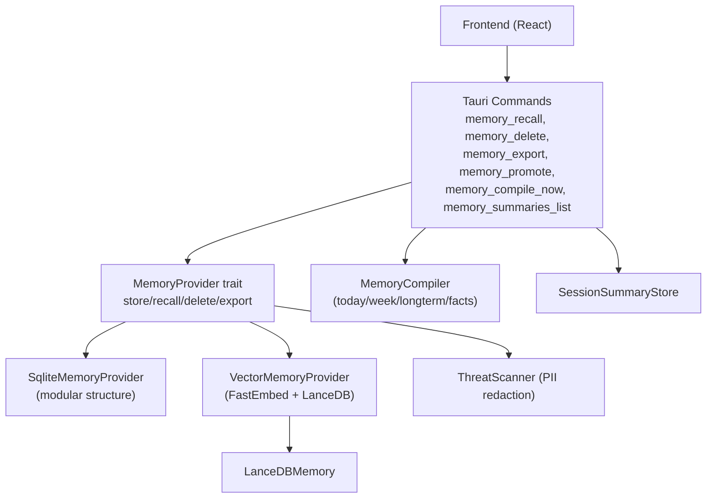
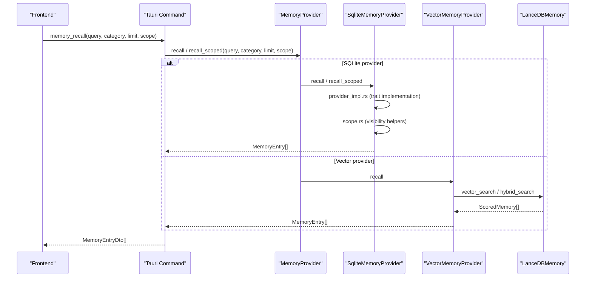
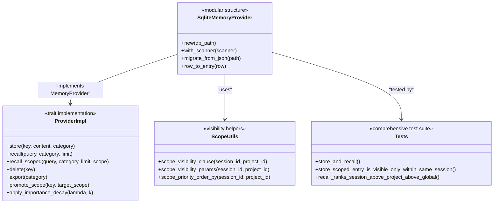
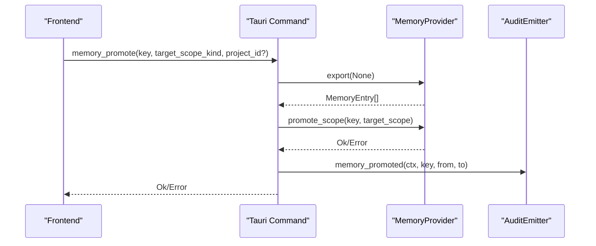
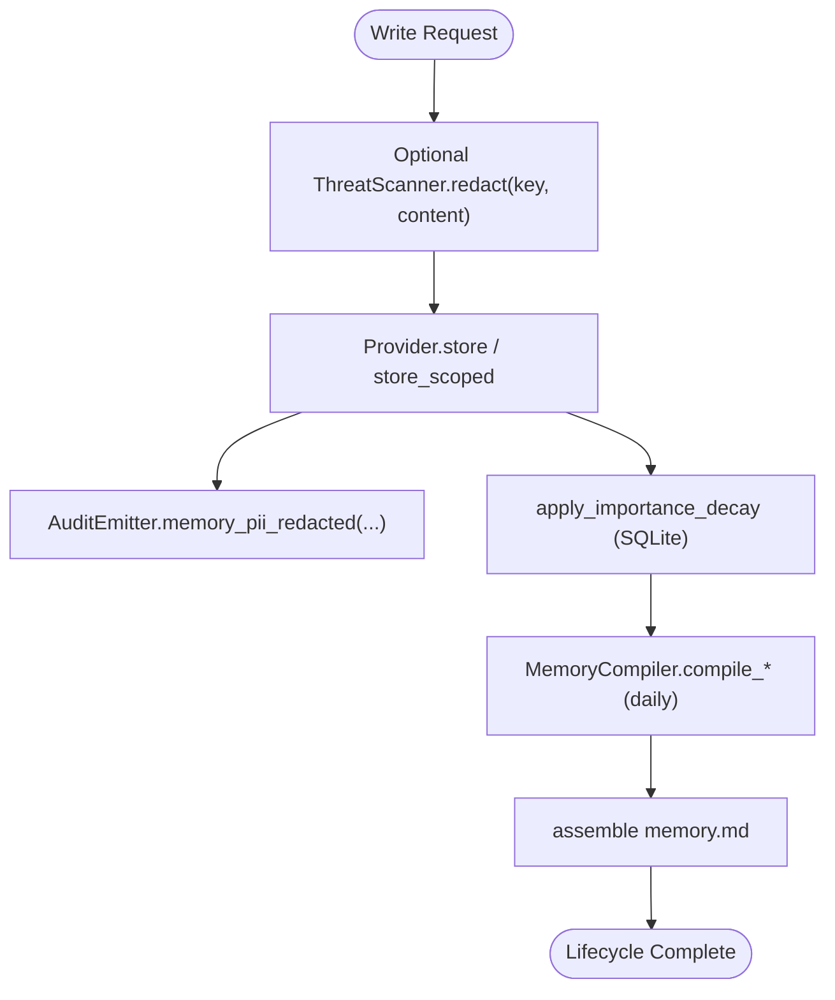
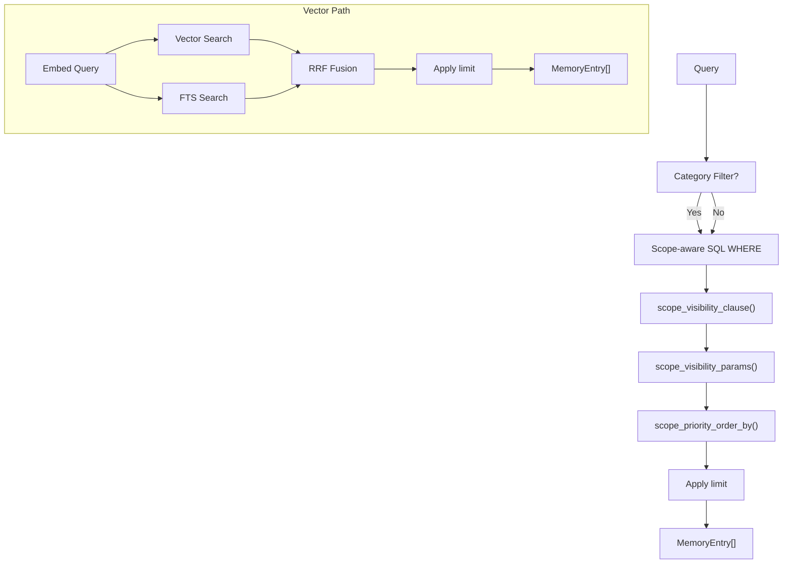
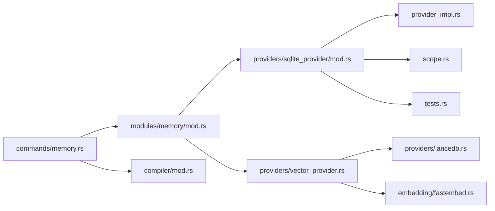

# Memory API

<cite>
**Referenced Files in This Document**
- [memory.rs](file://src-tauri/src/commands/memory.rs)
- [mod.rs](file://src-tauri/src/modules/memory/mod.rs)
- [sqlite_provider/mod.rs](file://src-tauri/src/modules/memory/providers/sqlite_provider/mod.rs)
- [sqlite_provider/provider_impl.rs](file://src-tauri/src/modules/memory/providers/sqlite_provider/provider_impl.rs)
- [sqlite_provider/scope.rs](file://src-tauri/src/modules/memory/providers/sqlite_provider/scope.rs)
- [sqlite_provider/tests.rs](file://src-tauri/src/modules/memory/providers/sqlite_provider/tests.rs)
- [vector_provider.rs](file://src-tauri/src/modules/memory/providers/vector_provider.rs)
- [lancedb.rs](file://src-tauri/src/modules/memory/providers/lancedb.rs)
- [fastembed.rs](file://src-tauri/src/modules/memory/embedding/fastembed.rs)
- [mod.rs](file://src-tauri/src/modules/memory/compiler/mod.rs)
- [tauri.ts](file://src/lib/tauri.ts)
</cite>

## Update Summary
**Changes Made**
- Updated SQLite provider implementation details to reflect new modular structure with separate files for provider implementation, scope utilities, and tests
- Added comprehensive documentation for the new SQLite provider modular architecture
- Updated file references and implementation details while maintaining API compatibility
- Enhanced SQLite provider documentation with new modular structure details

## Table of Contents
1. [Introduction](#introduction)
2. [Project Structure](#project-structure)
3. [Core Components](#core-components)
4. [Architecture Overview](#architecture-overview)
5. [Detailed Component Analysis](#detailed-component-analysis)
6. [Dependency Analysis](#dependency-analysis)
7. [Performance Considerations](#performance-considerations)
8. [Troubleshooting Guide](#troubleshooting-guide)
9. [Conclusion](#conclusion)
10. [Appendices](#appendices)

## Introduction
This document describes the Memory API used by If2Ai's memory management system. It covers all memory-related commands for storage, retrieval, search, and deletion, along with the memory lifecycle from creation to archival. It explains provider abstractions, dual-write strategy, security scanning, automatic summarization, and performance optimization techniques for large-scale operations.

## Project Structure
The Memory API is exposed via Tauri commands and implemented by pluggable providers. The core flow:
- Frontend invokes Tauri commands.
- Commands delegate to the MemoryProvider trait.
- Providers implement storage and recall (SQLite, vector/LanceDB, or hybrid).
- Optional security scanning and summarization pipelines operate alongside.

**Updated** The SQLite provider has been modularized into separate files for better organization and maintainability while preserving API compatibility.

**Diagram sources**
- [memory.rs:143-209](file://src-tauri/src/commands/memory.rs#L143-L209)
- [mod.rs:204-380](file://src-tauri/src/modules/memory/mod.rs#L204-L380)
- [sqlite_provider/mod.rs:24-38](file://src-tauri/src/modules/memory/providers/sqlite_provider/mod.rs#L24-L38)
- [vector_provider.rs:107-117](file://src-tauri/src/modules/memory/providers/vector_provider.rs#L107-L117)
- [lancedb.rs:112-145](file://src-tauri/src/modules/memory/providers/lancedb.rs#L112-L145)
- [mod.rs:113-150](file://src-tauri/src/modules/memory/compiler/mod.rs#L113-L150)

**Section sources**
- [memory.rs:1-800](file://src-tauri/src/commands/memory.rs#L1-L800)
- [mod.rs:1-517](file://src-tauri/src/modules/memory/mod.rs#L1-L517)

## Core Components
- MemoryProvider trait: Defines store, recall, delete, purge, export, scoped operations, and lifecycle hooks (promotion/demotion, importance decay).
- SqliteMemoryProvider: Persistent, scope-aware provider with three-tier visibility rules and SQL-backed recall, now organized in modular structure.
- VectorMemoryProvider: Vector-backed provider with FastEmbed and LanceDB, supporting hybrid search and optional SQLite dual-write.
- ThreatScanner: Optional PII/redaction layer applied at persistence boundaries.
- MemoryCompiler: Orchestrates daily compilation of summaries into structured memory artifacts.
- Tauri commands: Expose memory operations to the frontend with scope filtering and audit integration.

**Updated** The SQLite provider implementation has been split into multiple modules for better organization:
- `sqlite_provider/mod.rs`: Main provider definition and initialization
- `sqlite_provider/provider_impl.rs`: MemoryProvider trait implementation
- `sqlite_provider/scope.rs`: Scope-aware query helpers
- `sqlite_provider/tests.rs`: Comprehensive test suite

**Section sources**
- [mod.rs:204-380](file://src-tauri/src/modules/memory/mod.rs#L204-L380)
- [sqlite_provider/mod.rs:24-38](file://src-tauri/src/modules/memory/providers/sqlite_provider/mod.rs#L24-L38)
- [sqlite_provider/provider_impl.rs:18-595](file://src-tauri/src/modules/memory/providers/sqlite_provider/provider_impl.rs#L18-L595)
- [sqlite_provider/scope.rs:1-111](file://src-tauri/src/modules/memory/providers/sqlite_provider/scope.rs#L1-L111)
- [vector_provider.rs:107-117](file://src-tauri/src/modules/memory/providers/vector_provider.rs#L107-L117)
- [lancedb.rs:112-145](file://src-tauri/src/modules/memory/providers/lancedb.rs#L112-L145)
- [mod.rs:113-150](file://src-tauri/src/modules/memory/compiler/mod.rs#L113-L150)

## Architecture Overview
The Memory API centers on the MemoryProvider abstraction. Tauri commands route to provider methods, optionally applying security scanning and scope filtering. VectorMemoryProvider can dual-write to SQLite to preserve metadata and enable importance decay.

**Updated** The SQLite provider now uses a modular architecture with separated concerns for better maintainability and testability.

**Diagram sources**
- [memory.rs:143-171](file://src-tauri/src/commands/memory.rs#L143-L171)
- [sqlite_provider/provider_impl.rs:111-232](file://src-tauri/src/modules/memory/providers/sqlite_provider/provider_impl.rs#L111-L232)
- [vector_provider.rs:378-390](file://src-tauri/src/modules/memory/providers/vector_provider.rs#L378-L390)
- [lancedb.rs:167-202](file://src-tauri/src/modules/memory/providers/lancedb.rs#L167-L202)

## Detailed Component Analysis

### MemoryProvider Trait and Implementations
- Methods:
  - store, recall, delete, purge_category, export, clear_all (bulk delete).
  - store_scoped, recall_scoped, export_scoped with three-tier visibility.
  - promote_scope, demote_scope for scope transitions.
  - apply_importance_decay for metadata-driven decay.
- SQLite provider (modular structure):
  - Main provider definition in `sqlite_provider/mod.rs`
  - Trait implementation in `sqlite_provider/provider_impl.rs`
  - Scope utilities in `sqlite_provider/scope.rs`
  - Comprehensive test coverage in `sqlite_provider/tests.rs`
  - Adds scope columns (session_id, project_id) with partial indexes.
  - Enforces scope visibility via SQL WHERE clauses and tiered ORDER BY.
  - Supports dual-write for vector provider integration.
- Vector provider:
  - Dual-write: SQLite first (authoritative), LanceDB async.
  - Hybrid search: vector + FTS with reciprocal rank fusion (RRF).
  - Optional IVF-PQ index creation for large-scale ANN acceleration.

**Updated** SQLite provider modularization details:

**Diagram sources**
- [sqlite_provider/mod.rs:24-38](file://src-tauri/src/modules/memory/providers/sqlite_provider/mod.rs#L24-L38)
- [sqlite_provider/provider_impl.rs:18-595](file://src-tauri/src/modules/memory/providers/sqlite_provider/provider_impl.rs#L18-L595)
- [sqlite_provider/scope.rs:15-100](file://src-tauri/src/modules/memory/providers/sqlite_provider/scope.rs#L15-L100)
- [sqlite_provider/tests.rs:4-644](file://src-tauri/src/modules/memory/providers/sqlite_provider/tests.rs#L4-L644)

**Section sources**
- [mod.rs:204-380](file://src-tauri/src/modules/memory/mod.rs#L204-L380)
- [sqlite_provider/mod.rs:24-38](file://src-tauri/src/modules/memory/providers/sqlite_provider/mod.rs#L24-L38)
- [sqlite_provider/provider_impl.rs:18-595](file://src-tauri/src/modules/memory/providers/sqlite_provider/provider_impl.rs#L18-L595)
- [sqlite_provider/scope.rs:15-100](file://src-tauri/src/modules/memory/providers/sqlite_provider/scope.rs#L15-L100)
- [sqlite_provider/tests.rs:4-644](file://src-tauri/src/modules/memory/providers/sqlite_provider/tests.rs#L4-L644)
- [vector_provider.rs:107-117](file://src-tauri/src/modules/memory/providers/vector_provider.rs#L107-L117)
- [lancedb.rs:112-145](file://src-tauri/src/modules/memory/providers/lancedb.rs#L112-L145)

### Tauri Commands and DTOs
- memory_recall(query, category?, limit?, scope_kind?, session_id?, project_id?)
  - Returns MemoryEntryDto[].
  - Supports scoped recall via MemoryExecutionScope.
- memory_delete(key)
  - Deletes by key.
- memory_export(category?, scope_kind?, session_id?, project_id?)
  - Returns MemoryEntryDto[].
  - Scoped export path when scope is provided.
- memory_purge(category)
  - Purges all entries in a category.
- memory_clear_all()
  - Wipes all entries; emits memory_cleared audit.
- memory_promotion_candidates()
  - Returns promotion recommendations (non-destructive).
- memory_promote(key, target_scope_kind, project_id?)
  - Promotes an entry to project/global scope; emits memory_promoted.
- memory_demote(key, target_scope_kind, session_id?, project_id?)
  - Narrows visibility; emits memory_demoted.
- memory_compile_now(scope)
  - Executes today/week/longterm/facts pipelines; returns CompileReport.
- memory_compiled_read(scope)
  - Reads compiled *.md snapshots; returns CompiledMemoryDto.
- memory_compiled_clear(scope)
  - Clears compiled cache for scope.
- memory_summaries_list(scope, limit?, since_days?)
  - Lists session summaries; returns SessionSummaryDto[].

**Diagram sources**
- [memory.rs:299-347](file://src-tauri/src/commands/memory.rs#L299-L347)

**Section sources**
- [memory.rs:143-248](file://src-tauri/src/commands/memory.rs#L143-L248)
- [memory.rs:284-347](file://src-tauri/src/commands/memory.rs#L284-L347)
- [memory.rs:571-627](file://src-tauri/src/commands/memory.rs#L571-L627)
- [memory.rs:732-758](file://src-tauri/src/commands/memory.rs#L732-L758)

### Memory Lifecycle and Security Scanning
- Creation and storage:
  - Frontend calls memory_store-like flows (via tools/commands) that route to MemoryProvider.store or store_scoped.
  - Optional ThreatScanner runs at persistence boundary to redact PII; audit event emitted on matches.
- Automatic summarization:
  - MemoryCompiler orchestrates daily compilation of summaries into structured artifacts (today/week/longterm/facts), then assembles memory.md.
- Archival and scope promotion:
  - Promotion/demotion moves entries across tiers (session → project → global) with audit events.
- Security scanning:
  - Applied at provider level for both SQLite and Vector providers to ensure sensitive content is redacted before persistence.

**Diagram sources**
- [sqlite_provider/provider_impl.rs:56-109](file://src-tauri/src/modules/memory/providers/sqlite_provider/provider_impl.rs#L56-L109)
- [vector_provider.rs:503-576](file://src-tauri/src/modules/memory/providers/vector_provider.rs#L503-L576)
- [mod.rs:113-150](file://src-tauri/src/modules/memory/compiler/mod.rs#L113-L150)

**Section sources**
- [sqlite_provider/provider_impl.rs:56-109](file://src-tauri/src/modules/memory/providers/sqlite_provider/provider_impl.rs#L56-L109)
- [vector_provider.rs:503-576](file://src-tauri/src/modules/memory/providers/vector_provider.rs#L503-L576)
- [mod.rs:113-150](file://src-tauri/src/modules/memory/compiler/mod.rs#L113-L150)

### Search Patterns and Hierarchical Organization
- Lexical search (SQLite):
  - Full-text content/key matching with category and limit filters.
  - Scope-aware ranking: session > project > global, then importance/access_count/recency.
- Vector similarity (Vector provider):
  - Embed query via FastEmbed; vector search with optional category filter.
  - Hybrid search: combine vector and FTS results via RRF fusion.
- Hierarchical organization:
  - Three-tier scope: session, project, global.
  - Visibility rules enforced at SQL layer for SQLite; delegated to SQLite mirror for Vector provider.

**Updated** SQLite provider scope utilities:

**Diagram sources**
- [sqlite_provider/provider_impl.rs:111-232](file://src-tauri/src/modules/memory/providers/sqlite_provider/provider_impl.rs#L111-L232)
- [sqlite_provider/scope.rs:15-100](file://src-tauri/src/modules/memory/providers/sqlite_provider/scope.rs#L15-L100)
- [vector_provider.rs:242-275](file://src-tauri/src/modules/memory/providers/vector_provider.rs#L242-L275)
- [lancedb.rs:167-239](file://src-tauri/src/modules/memory/providers/lancedb.rs#L167-L239)

**Section sources**
- [sqlite_provider/provider_impl.rs:111-232](file://src-tauri/src/modules/memory/providers/sqlite_provider/provider_impl.rs#L111-L232)
- [sqlite_provider/scope.rs:15-100](file://src-tauri/src/modules/memory/providers/sqlite_provider/scope.rs#L15-L100)
- [vector_provider.rs:242-275](file://src-tauri/src/modules/memory/providers/vector_provider.rs#L242-L275)
- [lancedb.rs:167-239](file://src-tauri/src/modules/memory/providers/lancedb.rs#L167-L239)

### Batch Operations and Compilation
- Batch deletion:
  - memory_clear_all() deletes all entries; returns count removed; emits memory_cleared.
  - memory_purge(category) removes all entries in a category.
- Compilation:
  - memory_compile_now(scope) runs today/week/longterm/facts stages and returns CompileReport.
  - memory_compiled_read(scope) snapshots compiled *.md files.
  - memory_compiled_clear(scope) clears compiled cache and fingerprints.

**Section sources**
- [memory.rs:211-248](file://src-tauri/src/commands/memory.rs#L211-L248)
- [memory.rs:571-627](file://src-tauri/src/commands/memory.rs#L571-L627)
- [mod.rs:113-150](file://src-tauri/src/modules/memory/compiler/mod.rs#L113-L150)

## Dependency Analysis
- Tauri commands depend on MemoryProvider implementations.
- VectorMemoryProvider depends on FastEmbed and LanceDB; optionally on SQLite for dual-write.
- ThreatScanner is injected into providers to redact sensitive content before persistence.
- MemoryCompiler depends on SessionSummaryStore and UtilityLlm for daily compilation.

**Updated** SQLite provider dependency structure:

**Diagram sources**
- [memory.rs:1-800](file://src-tauri/src/commands/memory.rs#L1-L800)
- [mod.rs:1-517](file://src-tauri/src/modules/memory/mod.rs#L1-L517)
- [sqlite_provider/mod.rs:1-269](file://src-tauri/src/modules/memory/providers/sqlite_provider/mod.rs#L1-L269)
- [sqlite_provider/provider_impl.rs:1-595](file://src-tauri/src/modules/memory/providers/sqlite_provider/provider_impl.rs#L1-L595)
- [sqlite_provider/scope.rs:1-111](file://src-tauri/src/modules/memory/providers/sqlite_provider/scope.rs#L1-L111)
- [sqlite_provider/tests.rs:1-644](file://src-tauri/src/modules/memory/providers/sqlite_provider/tests.rs#L1-L644)
- [vector_provider.rs:1-767](file://src-tauri/src/modules/memory/providers/vector_provider.rs#L1-L767)
- [lancedb.rs:1-559](file://src-tauri/src/modules/memory/providers/lancedb.rs#L1-L559)
- [fastembed.rs:1-158](file://src-tauri/src/modules/memory/embedding/fastembed.rs#L1-L158)
- [mod.rs:1-412](file://src-tauri/src/modules/memory/compiler/mod.rs#L1-L412)

**Section sources**
- [memory.rs:1-800](file://src-tauri/src/commands/memory.rs#L1-L800)
- [mod.rs:1-517](file://src-tauri/src/modules/memory/mod.rs#L1-L517)

## Performance Considerations
- Vector search acceleration:
  - IVF-PQ index creation guarded by minimum row counts; soft-fail to brute-force scan if training fails.
  - Hybrid search uses parallel vector and FTS queries with RRF fusion to balance precision and recall.
- SQLite scope filtering:
  - Partial indexes on session_id and project_id reduce index size and improve recall performance.
  - Tiered ORDER BY ensures relevant entries surface first.
- Dual-write strategy:
  - Vector provider writes to SQLite first (authoritative), then asynchronously mirrors to LanceDB.
  - Enables importance decay and durable metadata while maintaining vector search performance.
- Compilation caching:
  - Fingerprint-based caching avoids unnecessary LLM invocations; compiled artifacts are assembled synchronously.
- **Updated** SQLite provider modularization benefits:
  - Separated concerns improve maintainability and testability.
  - Each module has a single responsibility (implementation, scope utilities, tests).
  - Better code organization for large-scale development.

## Troubleshooting Guide
- Key not found:
  - Errors raised when attempting to delete or promote a non-existent key.
- Scope validation:
  - Demote requests must move to a lower tier; invalid targets are rejected.
- Vector dimension mismatch:
  - Embedding dimension must match LanceDB expectation (384).
- Index creation failures:
  - IVF-PQ index build is best-effort; provider falls back to brute-force scan if training fails.
- Audit and diagnostics:
  - Memory commands emit audit events (e.g., memory_cleared, memory_promoted) for observability.
- **Updated** SQLite provider specific issues:
  - Migration failures: Check `migrate_from_json` logs for detailed error information.
  - Scope visibility issues: Verify `scope_visibility_clause` and `scope_visibility_params` are correctly constructed.
  - Performance degradation: Ensure partial indexes are properly created and utilized.

**Section sources**
- [mod.rs:145-162](file://src-tauri/src/modules/memory/mod.rs#L145-L162)
- [sqlite_provider/provider_impl.rs:646-666](file://src-tauri/src/modules/memory/providers/sqlite_provider/provider_impl.rs#L646-L666)
- [vector_provider.rs:620-648](file://src-tauri/src/modules/memory/providers/vector_provider.rs#L620-L648)
- [lancedb.rs:283-342](file://src-tauri/src/modules/memory/providers/lancedb.rs#L283-L342)
- [memory.rs:240-247](file://src-tauri/src/commands/memory.rs#L240-L247)

## Conclusion
The Memory API provides a robust, extensible foundation for storing, recalling, and managing long-term memory across sessions. Its provider abstraction supports both traditional SQL-based and vector-based retrieval, with optional dual-write and security scanning. The lifecycle includes automatic summarization, hierarchical scope management, and performance optimizations suitable for large-scale deployments.

**Updated** The new modular structure of the SQLite provider enhances maintainability and testability while preserving full API compatibility, making the system more robust for future enhancements.

## Appendices

### API Reference: Memory Commands
- memory_recall(query, category?, limit?, scope_kind?, session_id?, project_id?)
  - Returns: MemoryEntryDto[]
- memory_delete(key)
  - Returns: void
- memory_export(category?, scope_kind?, session_id?, project_id?)
  - Returns: MemoryEntryDto[]
- memory_purge(category)
  - Returns: void
- memory_clear_all()
  - Returns: number of removed rows
- memory_promotion_candidates()
  - Returns: MemoryPromotionCandidateDto[]
- memory_promote(key, target_scope_kind, project_id?)
  - Returns: void
- memory_demote(key, target_scope_kind, session_id?, project_id?)
  - Returns: void
- memory_compile_now(scope)
  - Returns: CompileReport
- memory_compiled_read(scope)
  - Returns: CompiledMemoryDto
- memory_compiled_clear(scope)
  - Returns: void
- memory_summaries_list(scope, limit?, since_days?)
  - Returns: SessionSummaryDto[]

**Section sources**
- [memory.rs:143-248](file://src-tauri/src/commands/memory.rs#L143-L248)
- [memory.rs:284-347](file://src-tauri/src/commands/memory.rs#L284-L347)
- [memory.rs:571-627](file://src-tauri/src/commands/memory.rs#L571-L627)
- [memory.rs:732-758](file://src-tauri/src/commands/memory.rs#L732-L758)

### Frontend Types and Utilities
- MemoryRecallMode: lexical | hybrid
- MemoryPolicyEnforceMode: shadow | enforce
- memoryExport(args: { category?, scope? }): MemoryEntryDto[]
- memoryDelete(key: string): void
- Promotion candidate DTO: MemoryPromotionCandidateDto

**Section sources**
- [tauri.ts:1050-1059](file://src/lib/tauri.ts#L1050-L1059)
- [tauri.ts:1488-1503](file://src/lib/tauri.ts#L1488-L1503)
- [tauri.ts:1524-1528](file://src/lib/tauri.ts#L1524-L1528)

### SQLite Provider Modular Structure Details
**Updated** The SQLite provider is now organized into separate modules:

- **sqlite_provider/mod.rs**: Contains the main SqliteMemoryProvider struct definition, initialization logic, and schema management
- **sqlite_provider/provider_impl.rs**: Implements the MemoryProvider trait methods for SQLite operations
- **sqlite_provider/scope.rs**: Provides scope-aware query construction utilities
- **sqlite_provider/tests.rs**: Comprehensive test suite covering all provider functionality

Each module serves a specific purpose while maintaining tight coupling for optimal performance and maintainability.

**Section sources**
- [sqlite_provider/mod.rs:1-269](file://src-tauri/src/modules/memory/providers/sqlite_provider/mod.rs#L1-L269)
- [sqlite_provider/provider_impl.rs:1-595](file://src-tauri/src/modules/memory/providers/sqlite_provider/provider_impl.rs#L1-L595)
- [sqlite_provider/scope.rs:1-111](file://src-tauri/src/modules/memory/providers/sqlite_provider/scope.rs#L1-L111)
- [sqlite_provider/tests.rs:1-644](file://src-tauri/src/modules/memory/providers/sqlite_provider/tests.rs#L1-L644)