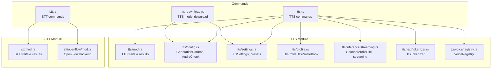
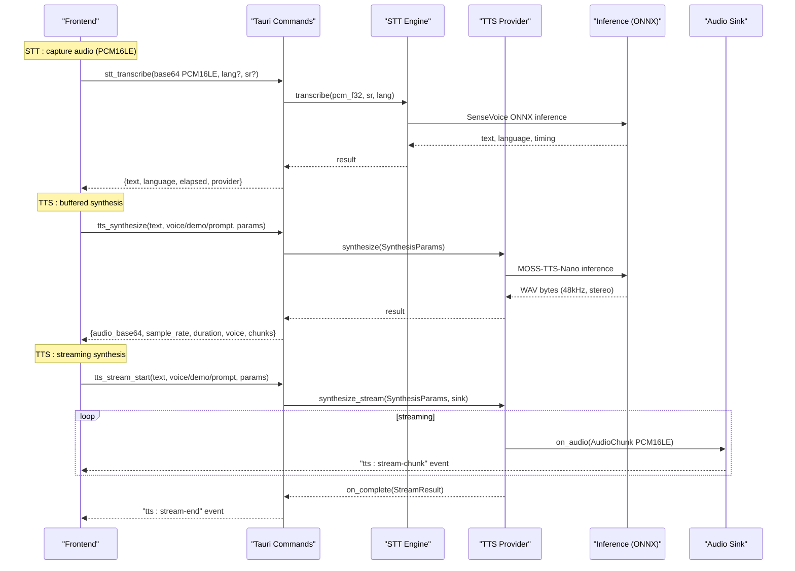
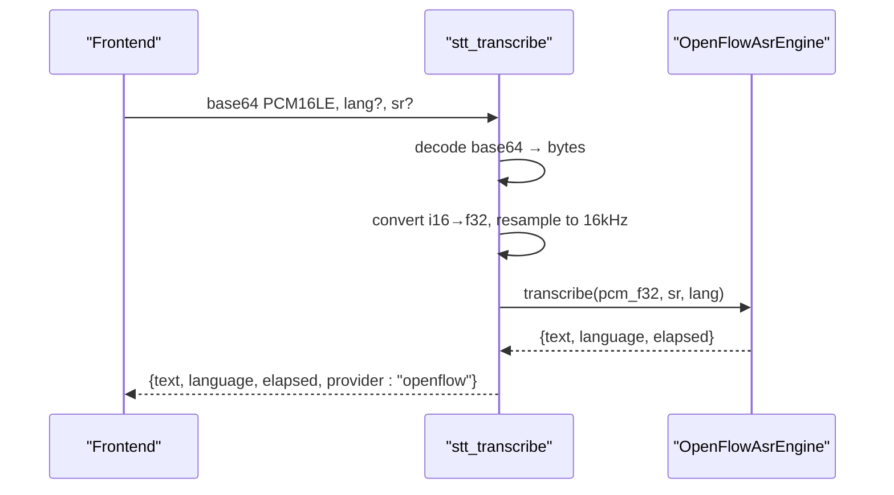
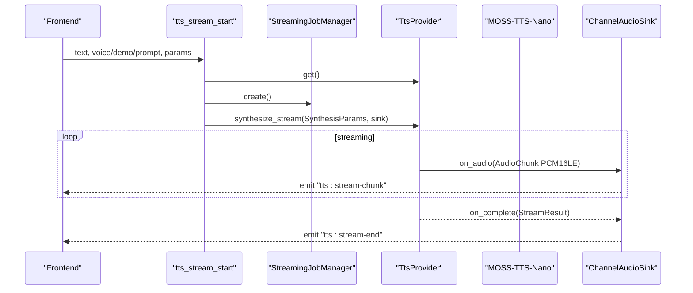
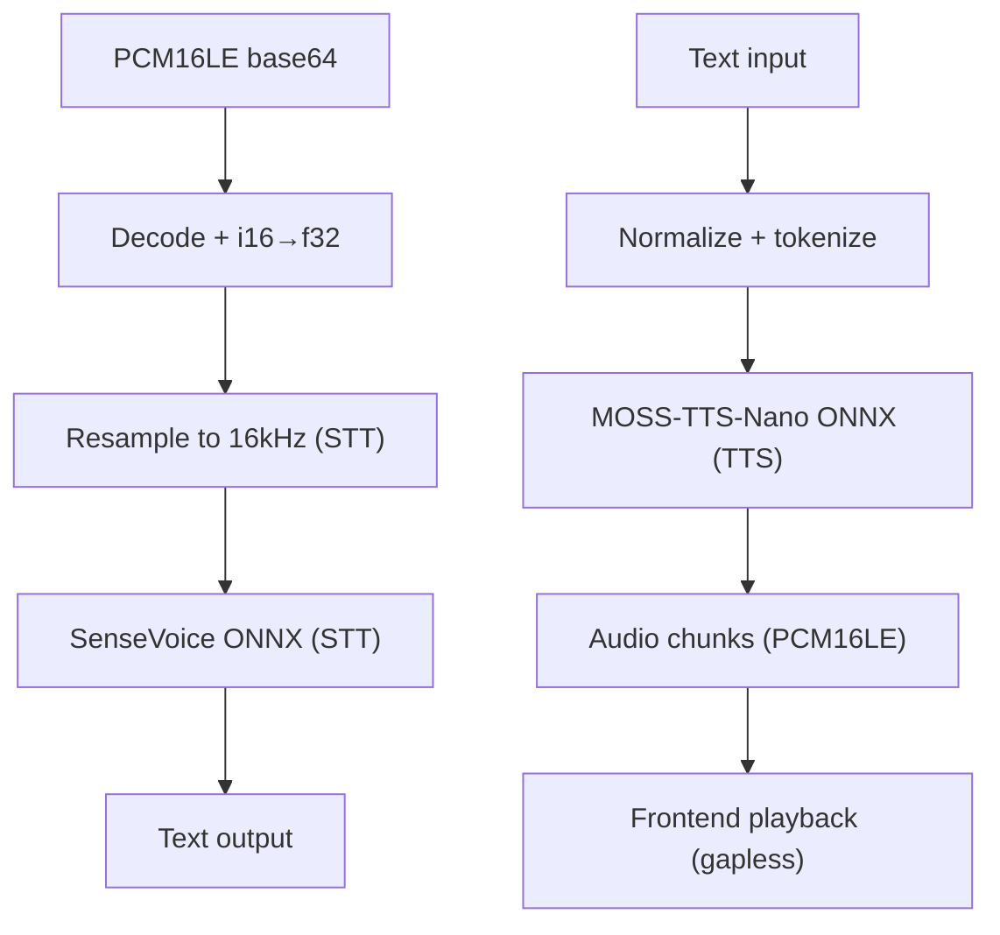
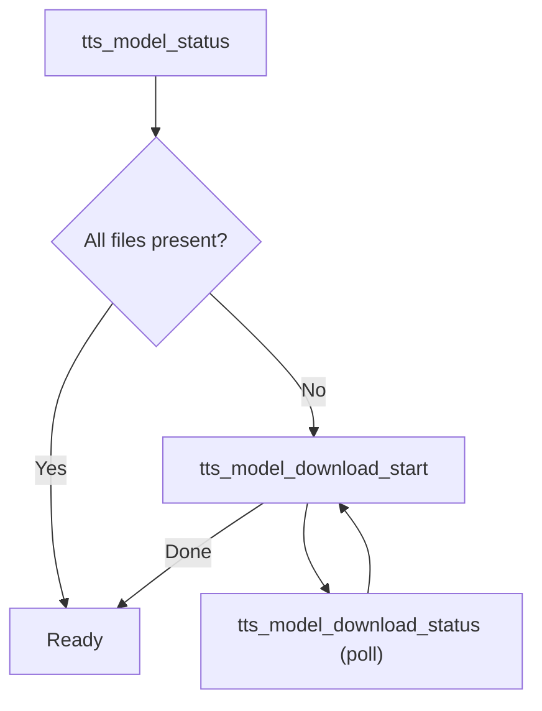
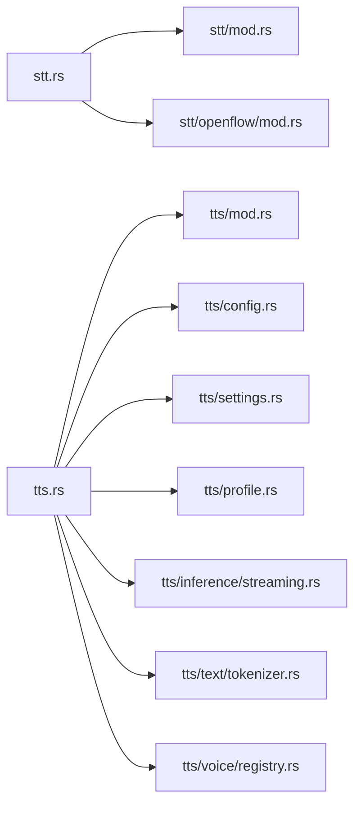

# Speech Processing API

<cite>
**Referenced Files in This Document**
- [stt.rs](file://src-tauri/src/commands/stt.rs)
- [tts.rs](file://src-tauri/src/commands/tts.rs)
- [tts_download.rs](file://src-tauri/src/commands/tts_download.rs)
- [mod.rs (STT)](file://src-tauri/src/modules/stt/mod.rs)
- [mod.rs (TTS)](file://src-tauri/src/modules/tts/mod.rs)
- [openflow/mod.rs](file://src-tauri/src/modules/stt/openflow/mod.rs)
- [config.rs (TTS)](file://src-tauri/src/modules/tts/config.rs)
- [settings.rs (TTS)](file://src-tauri/src/modules/tts/settings.rs)
- [profile.rs (TTS)](file://src-tauri/src/modules/tts/profile.rs)
- [streaming.rs (TTS inference)](file://src-tauri/src/modules/tts/inference/streaming.rs)
- [tokenizer.rs (TTS text)](file://src-tauri/src/modules/tts/text/tokenizer.rs)
- [registry.rs (TTS voice)](file://src-tauri/src/modules/tts/voice/registry.rs)
</cite>

## Table of Contents
1. [Introduction](#introduction)
2. [Project Structure](#project-structure)
3. [Core Components](#core-components)
4. [Architecture Overview](#architecture-overview)
5. [Detailed Component Analysis](#detailed-component-analysis)
6. [Dependency Analysis](#dependency-analysis)
7. [Performance Considerations](#performance-considerations)
8. [Troubleshooting Guide](#troubleshooting-guide)
9. [Conclusion](#conclusion)
10. [Appendices](#appendices)

## Introduction
This document describes the speech processing APIs for If2Ai’s STT (speech-to-text) and TTS (text-to-speech) systems. It covers:
- STT endpoints for audio streaming and offline transcription
- TTS endpoints for buffered synthesis and real-time streaming
- Audio pipeline stages: preprocessing, inference, and postprocessing
- Parameter schemas for audio configuration, voice selection, text processing, and streaming
- Voice management, download workflows, and offline processing
- Examples of voice customization, audio format conversion, and latency optimization
- Troubleshooting for audio devices and performance tuning

## Project Structure
The speech processing system is implemented in the Tauri backend under src-tauri, organized into:
- Commands: Tauri command handlers for STT and TTS
- Modules: STT and TTS engines, configuration, inference, text processing, voice registry, and audio utilities
- Frontend integration: Tauri events and streaming payloads consumed by the web frontend

**Diagram sources**
- [stt.rs:1-222](file://src-tauri/src/commands/stt.rs#L1-L222)
- [tts.rs:1-800](file://src-tauri/src/commands/tts.rs#L1-L800)
- [tts_download.rs:1-481](file://src-tauri/src/commands/tts_download.rs#L1-L481)
- [mod.rs (STT):1-40](file://src-tauri/src/modules/stt/mod.rs#L1-L40)
- [openflow/mod.rs:1-24](file://src-tauri/src/modules/stt/openflow/mod.rs#L1-L24)
- [mod.rs (TTS):1-209](file://src-tauri/src/modules/tts/mod.rs#L1-L209)
- [config.rs (TTS):1-169](file://src-tauri/src/modules/tts/config.rs#L1-L169)
- [settings.rs (TTS):1-405](file://src-tauri/src/modules/tts/settings.rs#L1-L405)
- [profile.rs (TTS):1-536](file://src-tauri/src/modules/tts/profile.rs#L1-L536)
- [streaming.rs (TTS inference):1-196](file://src-tauri/src/modules/tts/inference/streaming.rs#L1-L196)
- [tokenizer.rs (TTS text):1-199](file://src-tauri/src/modules/tts/text/tokenizer.rs#L1-L199)
- [registry.rs (TTS voice):1-308](file://src-tauri/src/modules/tts/voice/registry.rs#L1-L308)

**Section sources**
- [stt.rs:1-222](file://src-tauri/src/commands/stt.rs#L1-L222)
- [tts.rs:1-800](file://src-tauri/src/commands/tts.rs#L1-L800)
- [tts_download.rs:1-481](file://src-tauri/src/commands/tts_download.rs#L1-L481)
- [mod.rs (STT):1-40](file://src-tauri/src/modules/stt/mod.rs#L1-L40)
- [mod.rs (TTS):1-209](file://src-tauri/src/modules/tts/mod.rs#L1-L209)

## Core Components
- STT (OpenFlow/SenseVoice):
  - Endpoint: stt_transcribe
  - Input: PCM16LE base64, optional language and sample rate
  - Output: recognized text, detected language, elapsed seconds, provider
  - Model download: stt_download_openflow_model with progress events
  - Status: stt_model_status
- TTS (MOSS-TTS-Nano):
  - Health: tts_health (provider lifecycle + queue depth)
  - Warmup: tts_start_warmup, tts_warmup_status
  - Buffered synthesis: tts_synthesize (returns WAV base64)
  - Streaming synthesis: tts_stream_start, tts_stream_status, tts_stream_result, tts_stream_close
  - Voices: tts_list_voices, tts_demo_audio, tts_split_text
  - Model download: tts_model_status, tts_model_download_start, tts_model_download_status

**Section sources**
- [stt.rs:112-160](file://src-tauri/src/commands/stt.rs#L112-L160)
- [stt.rs:182-221](file://src-tauri/src/commands/stt.rs#L182-L221)
- [tts.rs:409-429](file://src-tauri/src/commands/tts.rs#L409-L429)
- [tts.rs:447-455](file://src-tauri/src/commands/tts.rs#L447-L455)
- [tts.rs:467-516](file://src-tauri/src/commands/tts.rs#L467-L516)
- [tts.rs:529-585](file://src-tauri/src/commands/tts.rs#L529-L585)
- [tts.rs:711-726](file://src-tauri/src/commands/tts.rs#L711-L726)
- [tts.rs:728-767](file://src-tauri/src/commands/tts.rs#L728-L767)
- [tts.rs:769-800](file://src-tauri/src/commands/tts.rs#L769-L800)
- [tts_download.rs:176-218](file://src-tauri/src/commands/tts_download.rs#L176-L218)
- [tts_download.rs:242-261](file://src-tauri/src/commands/tts_download.rs#L242-L261)
- [tts_download.rs:264-277](file://src-tauri/src/commands/tts_download.rs#L264-L277)

## Architecture Overview
The speech processing pipeline connects frontend audio capture to backend inference and playback.

**Diagram sources**
- [stt.rs:130-160](file://src-tauri/src/commands/stt.rs#L130-L160)
- [tts.rs:467-516](file://src-tauri/src/commands/tts.rs#L467-L516)
- [tts.rs:591-709](file://src-tauri/src/commands/tts.rs#L591-L709)
- [streaming.rs (TTS inference):35-74](file://src-tauri/src/modules/tts/inference/streaming.rs#L35-L74)

## Detailed Component Analysis

### STT API: Speech Recognition
- Endpoint: stt_transcribe
  - Request:
    - audio_bytes_base64: PCM16LE base64
    - language: optional string
    - sample_rate: optional u32
    - provider_override: reserved (ignored)
  - Response:
    - text: recognized transcript
    - language: detected language
    - elapsed_seconds: inference time
    - provider: "openflow"
  - Behavior:
    - Decodes base64 to bytes, converts to f32 samples, resamples to 16 kHz internally, runs SenseVoice ONNX inference, returns result.
- Endpoint: stt_model_status
  - Returns readiness and expected model directory for SenseVoice.
- Endpoint: stt_download_openflow_model
  - Starts model download with preset selection ("quantized" or "fp16") and force overwrite option.
  - Emits progress events: "stt:openflow-download-progress".

**Diagram sources**
- [stt.rs:130-160](file://src-tauri/src/commands/stt.rs#L130-L160)
- [mod.rs (STT):31-40](file://src-tauri/src/modules/stt/mod.rs#L31-L40)
- [openflow/mod.rs:1-24](file://src-tauri/src/modules/stt/openflow/mod.rs#L1-L24)

**Section sources**
- [stt.rs:112-160](file://src-tauri/src/commands/stt.rs#L112-L160)
- [stt.rs:54-61](file://src-tauri/src/commands/stt.rs#L54-L61)
- [stt.rs:182-221](file://src-tauri/src/commands/stt.rs#L182-L221)
- [mod.rs (STT):1-40](file://src-tauri/src/modules/stt/mod.rs#L1-L40)
- [openflow/mod.rs:1-24](file://src-tauri/src/modules/stt/openflow/mod.rs#L1-L24)

### TTS API: Voice Synthesis and Streaming
- Health and warmup
  - tts_health: returns provider lifecycle state, warmup state, progress, queue depth.
  - tts_start_warmup: primes models asynchronously.
  - tts_warmup_status: polls warmup progress.
- Buffered synthesis
  - tts_synthesize: returns complete WAV as base64 with metadata.
  - Voice selection precedence: voice_id > demo_id > prompt_audio_path.
- Streaming synthesis
  - tts_stream_start: creates a job, returns stream_id and output specs.
  - tts_stream_status: returns job snapshot.
  - tts_stream_result: blocks until completion.
  - tts_stream_close: cancels a stream.
  - Events: "tts:stream-chunk" (PCM16LE base64), "tts:stream-end".
- Voices and demos
  - tts_list_voices: lists available voice names.
  - tts_demo_audio: returns demo audio base64 and content-type.
  - tts_split_text: splits text for voice clone mode.
- Model downloads
  - tts_model_status: checks presence of required model files.
  - tts_model_download_start/status: background download with progress.

**Diagram sources**
- [tts.rs:529-585](file://src-tauri/src/commands/tts.rs#L529-L585)
- [tts.rs:591-709](file://src-tauri/src/commands/tts.rs#L591-L709)
- [streaming.rs (TTS inference):35-74](file://src-tauri/src/modules/tts/inference/streaming.rs#L35-L74)

**Section sources**
- [tts.rs:409-429](file://src-tauri/src/commands/tts.rs#L409-L429)
- [tts.rs:447-455](file://src-tauri/src/commands/tts.rs#L447-L455)
- [tts.rs:467-516](file://src-tauri/src/commands/tts.rs#L467-L516)
- [tts.rs:529-585](file://src-tauri/src/commands/tts.rs#L529-L585)
- [tts.rs:711-726](file://src-tauri/src/commands/tts.rs#L711-L726)
- [tts.rs:728-767](file://src-tauri/src/commands/tts.rs#L728-L767)
- [tts.rs:769-800](file://src-tauri/src/commands/tts.rs#L769-L800)
- [streaming.rs (TTS inference):1-196](file://src-tauri/src/modules/tts/inference/streaming.rs#L1-L196)

### Audio Pipeline Details
- STT preprocessing and inference:
  - PCM16LE base64 decoded and converted to f32 samples.
  - SenseVoice (OpenFlow) performs internal resampling to 16 kHz and ONNX inference.
- TTS preprocessing and inference:
  - Text normalization and tokenization via HuggingFace tokenizers (tokenizer.json).
  - MOSS-TTS-Nano ONNX inference with configurable generation parameters.
  - Streaming audio delivered as PCM16LE chunks with lead time and emitted duration metrics.
- Postprocessing:
  - TTS profiles apply text postprocessing (soften punctuation, trailing dots) and combine with user settings.

**Diagram sources**
- [stt.rs:130-160](file://src-tauri/src/commands/stt.rs#L130-L160)
- [mod.rs (STT):31-40](file://src-tauri/src/modules/stt/mod.rs#L31-L40)
- [tokenizer.rs (TTS text):48-141](file://src-tauri/src/modules/tts/text/tokenizer.rs#L48-L141)
- [streaming.rs (TTS inference):115-118](file://src-tauri/src/modules/tts/inference/streaming.rs#L115-L118)

**Section sources**
- [stt.rs:130-160](file://src-tauri/src/commands/stt.rs#L130-L160)
- [mod.rs (STT):31-40](file://src-tauri/src/modules/stt/mod.rs#L31-L40)
- [tokenizer.rs (TTS text):48-141](file://src-tauri/src/modules/tts/text/tokenizer.rs#L48-L141)
- [streaming.rs (TTS inference):115-118](file://src-tauri/src/modules/tts/inference/streaming.rs#L115-L118)

### Voice Management and Download Workflows
- Voice registry:
  - Scans builtin, bundled, and user-uploaded voices; supports preview audio detection and sidecar metadata.
- Download workflow:
  - tts_model_status checks presence of required files.
  - tts_model_download_start initiates background download; tts_model_download_status polls progress.
  - Progress tracked per file and total bytes.

**Diagram sources**
- [tts_download.rs:176-218](file://src-tauri/src/commands/tts_download.rs#L176-L218)
- [tts_download.rs:242-261](file://src-tauri/src/commands/tts_download.rs#L242-L261)
- [tts_download.rs:264-277](file://src-tauri/src/commands/tts_download.rs#L264-L277)

**Section sources**
- [registry.rs (TTS voice):77-144](file://src-tauri/src/modules/tts/voice/registry.rs#L77-L144)
- [tts_download.rs:176-218](file://src-tauri/src/commands/tts_download.rs#L176-L218)
- [tts_download.rs:242-261](file://src-tauri/src/commands/tts_download.rs#L242-L261)
- [tts_download.rs:264-277](file://src-tauri/src/commands/tts_download.rs#L264-L277)

## Dependency Analysis
- STT depends on OpenFlow/SenseVoice ONNX modules for preprocessing, inference, and decoding.
- TTS depends on:
  - TtsProvider abstraction (implementation planned)
  - GenerationParams and AudioChunk for synthesis
  - TtsSettings and TtsProfile for user preferences and profiles
  - TtsTokenizer for text normalization and tokenization
  - VoiceRegistry for voice discovery and selection
  - Streaming channel for real-time audio delivery

**Diagram sources**
- [stt.rs:1-222](file://src-tauri/src/commands/stt.rs#L1-L222)
- [tts.rs:1-800](file://src-tauri/src/commands/tts.rs#L1-L800)
- [mod.rs (STT):1-40](file://src-tauri/src/modules/stt/mod.rs#L1-L40)
- [openflow/mod.rs:1-24](file://src-tauri/src/modules/stt/openflow/mod.rs#L1-L24)
- [mod.rs (TTS):1-209](file://src-tauri/src/modules/tts/mod.rs#L1-L209)
- [config.rs (TTS):1-169](file://src-tauri/src/modules/tts/config.rs#L1-L169)
- [settings.rs (TTS):1-405](file://src-tauri/src/modules/tts/settings.rs#L1-L405)
- [profile.rs (TTS):1-536](file://src-tauri/src/modules/tts/profile.rs#L1-L536)
- [streaming.rs (TTS inference):1-196](file://src-tauri/src/modules/tts/inference/streaming.rs#L1-L196)
- [tokenizer.rs (TTS text):1-199](file://src-tauri/src/modules/tts/text/tokenizer.rs#L1-L199)
- [registry.rs (TTS voice):1-308](file://src-tauri/src/modules/tts/voice/registry.rs#L1-L308)

**Section sources**
- [mod.rs (STT):1-40](file://src-tauri/src/modules/stt/mod.rs#L1-L40)
- [mod.rs (TTS):1-209](file://src-tauri/src/modules/tts/mod.rs#L1-L209)

## Performance Considerations
- First-load latency:
  - TTS provider is lazily loaded and evicted after inactivity; warmup reduces first-synthe time.
- Streaming:
  - Channel capacity of 32 chunks balances latency and stability; lead seconds help maintain gapless playback.
- Quality vs latency:
  - TtsQualityPreset maps to sampler parameters; lower temperature/top_p/top_k can improve stability at the cost of variability.
  - max_new_frames controls chunk size; smaller frames reduce first-byte latency but may truncate long sentences.
- Audio format:
  - TTS output is 48 kHz, stereo PCM; frontend adjusts playback rate for perceived speed.
- Offline processing:
  - STT requires SenseVoice model; TTS requires MOSS-TTS-Nano and audio tokenizer models cached locally.

[No sources needed since this section provides general guidance]

## Troubleshooting Guide
- STT model not found:
  - Ensure SenseVoice model is downloaded; use stt_model_status and stt_download_openflow_model.
- TTS provider not loaded:
  - Call tts_start_warmup and check tts_health; monitor provider lifecycle state.
- Streaming stalls or gaps:
  - Verify "tts:stream-chunk" events are received; ensure "tts:stream-end" is observed before starting next stream.
- Download failures:
  - Check tts_model_download_status for errors; retry tts_model_download_start.
- Audio device issues:
  - Confirm microphone permissions and device availability; validate sample rates and formats.
- Latency optimization:
  - Reduce max_new_frames; adjust TtsSettings playback_rate; ensure warmup is complete.

**Section sources**
- [stt.rs:54-61](file://src-tauri/src/commands/stt.rs#L54-L61)
- [stt.rs:182-221](file://src-tauri/src/commands/stt.rs#L182-L221)
- [tts.rs:409-429](file://src-tauri/src/commands/tts.rs#L409-L429)
- [tts.rs:447-455](file://src-tauri/src/commands/tts.rs#L447-L455)
- [tts.rs:591-709](file://src-tauri/src/commands/tts.rs#L591-L709)
- [tts_download.rs:264-277](file://src-tauri/src/commands/tts_download.rs#L264-L277)

## Conclusion
If2Ai’s speech processing system provides a streamlined STT and TTS stack:
- STT: OpenFlow/SenseVoice for accurate offline transcription with simple PCM16LE input.
- TTS: MOSS-TTS-Nano with flexible voice selection, buffered and streaming outputs, and robust voice management.
- The APIs expose clear parameter schemas, lifecycle states, and events for reliable integration and optimization.

[No sources needed since this section summarizes without analyzing specific files]

## Appendices

### API Definitions

- STT
  - stt_model_status
    - Method: GET
    - Response: { openflow_ready: boolean, openflow_model_dir: string }
  - stt_transcribe
    - Method: POST
    - Body: { audio_bytes_base64: string, language?: string, sample_rate?: number, provider_override?: string }
    - Response: { text: string, language: string, elapsed_seconds: number, provider: "openflow" }
  - stt_download_openflow_model
    - Method: POST
    - Body: { preset?: "quantized"|"fp16", force?: boolean }
    - Response: string (model directory)
    - Events: "stt:openflow-download-progress" { file: string, downloaded: number, total?: number, percent: number }

- TTS
  - tts_health
    - Method: GET
    - Response: { status: "ready"|"failed"|"initializing", warmup_state: string, warmup_progress: number, message: string, provider_state: enum, queue_depth: number }
  - tts_warmup_status
    - Method: GET
    - Response: { state: string, progress: number, message: string, error?: string }
  - tts_start_warmup
    - Method: POST
  - tts_synthesize
    - Method: POST
    - Body: { text: string, demo_id?: string, voice_id?: string, prompt_audio_path?: string, params: GenerationParams }
    - Response: { audio_base64: string, sample_rate: number, duration_seconds: number, voice: string, text_chunks: string[] }
  - tts_stream_start
    - Method: POST
    - Body: { text: string, demo_id?: string, voice_id?: string, prompt_audio_path?: string, params: GenerationParams }
    - Response: { stream_id: string, sample_rate: number, channels: number }
  - tts_stream_status
    - Method: GET
    - Response: Job snapshot JSON
  - tts_stream_result
    - Method: GET
    - Response: Final job snapshot JSON
  - tts_stream_close
    - Method: POST
    - Response: Closed job snapshot JSON
  - tts_demo_audio
    - Method: GET
    - Response: { audio_base64: string, content_type: "audio/wav"|"audio/mpeg" }
  - tts_list_voices
    - Method: GET
    - Response: string[]
  - tts_split_text
    - Method: POST
    - Body: { text: string, max_tokens: number }
    - Response: string[]

- TTS Model Download
  - tts_model_status
    - Method: GET
    - Response: { ready: boolean, tts_files: FileInfo[], tokenizer_files: FileInfo[], total_bytes: number, missing_bytes: number, cache_dir: string }
  - tts_model_download_start
    - Method: POST
  - tts_model_download_status
    - Method: GET
    - Response: { is_downloading: boolean, percent: number, downloaded_bytes: number, total_bytes: number, current_file: string, error?: string }

**Section sources**
- [stt.rs:54-61](file://src-tauri/src/commands/stt.rs#L54-L61)
- [stt.rs:130-160](file://src-tauri/src/commands/stt.rs#L130-L160)
- [stt.rs:182-221](file://src-tauri/src/commands/stt.rs#L182-L221)
- [tts.rs:409-429](file://src-tauri/src/commands/tts.rs#L409-L429)
- [tts.rs:431-445](file://src-tauri/src/commands/tts.rs#L431-L445)
- [tts.rs:447-455](file://src-tauri/src/commands/tts.rs#L447-L455)
- [tts.rs:467-516](file://src-tauri/src/commands/tts.rs#L467-L516)
- [tts.rs:529-585](file://src-tauri/src/commands/tts.rs#L529-L585)
- [tts.rs:711-726](file://src-tauri/src/commands/tts.rs#L711-L726)
- [tts.rs:728-767](file://src-tauri/src/commands/tts.rs#L728-L767)
- [tts.rs:769-800](file://src-tauri/src/commands/tts.rs#L769-L800)
- [tts_download.rs:176-218](file://src-tauri/src/commands/tts_download.rs#L176-L218)
- [tts_download.rs:242-261](file://src-tauri/src/commands/tts_download.rs#L242-L261)
- [tts_download.rs:264-277](file://src-tauri/src/commands/tts_download.rs#L264-L277)

### Parameter Schemas

- GenerationParams (TTS)
  - Fields: max_new_frames, voice_clone_max_text_tokens, tts_max_batch_size, codec_max_batch_size, do_sample, text_temperature, text_top_p, text_top_k, audio_temperature, audio_top_p, audio_top_k, audio_repetition_penalty, seed?, enable_robust_normalization
  - Defaults: see config.rs

- AudioChunk (TTS streaming)
  - Fields: pcm_data (PCM16LE bytes), sample_rate (Hz), channels, chunk_index, is_pause, emitted_audio_seconds, lead_seconds

- ProviderState (TTS)
  - Enum variants: NotLoaded, Loading, Loaded { elapsed_seconds }, Failed { error }, Evicted { elapsed_seconds }

- ModelFileInfo (TTS download)
  - Fields: name, size (bytes), present

**Section sources**
- [config.rs (TTS):58-109](file://src-tauri/src/modules/tts/config.rs#L58-L109)
- [config.rs (TTS):115-131](file://src-tauri/src/modules/tts/config.rs#L115-L131)
- [tts.rs:198-223](file://src-tauri/src/commands/tts.rs#L198-L223)
- [tts_download.rs:17-24](file://src-tauri/src/commands/tts_download.rs#L17-L24)

### Examples

- Voice customization
  - Use voice_id to select a builtin or bundled voice; use demo_id for quick preview; use prompt_audio_path for voice cloning.
  - Combine with TtsSettings and TtsProfile for consistent behavior across sessions.

- Audio format conversion
  - STT input: PCM16LE base64; TTS output: 48 kHz, stereo PCM (WAV) base64.
  - Streaming: PCM16LE base64 chunks forwarded via "tts:stream-chunk" event.

- Real-time streaming
  - Start stream with tts_stream_start; consume "tts:stream-chunk" events; wait for "tts:stream-end" before starting the next sentence.

**Section sources**
- [tts.rs:39-60](file://src-tauri/src/commands/tts.rs#L39-L60)
- [tts.rs:591-709](file://src-tauri/src/commands/tts.rs#L591-L709)
- [streaming.rs (TTS inference):115-118](file://src-tauri/src/modules/tts/inference/streaming.rs#L115-L118)