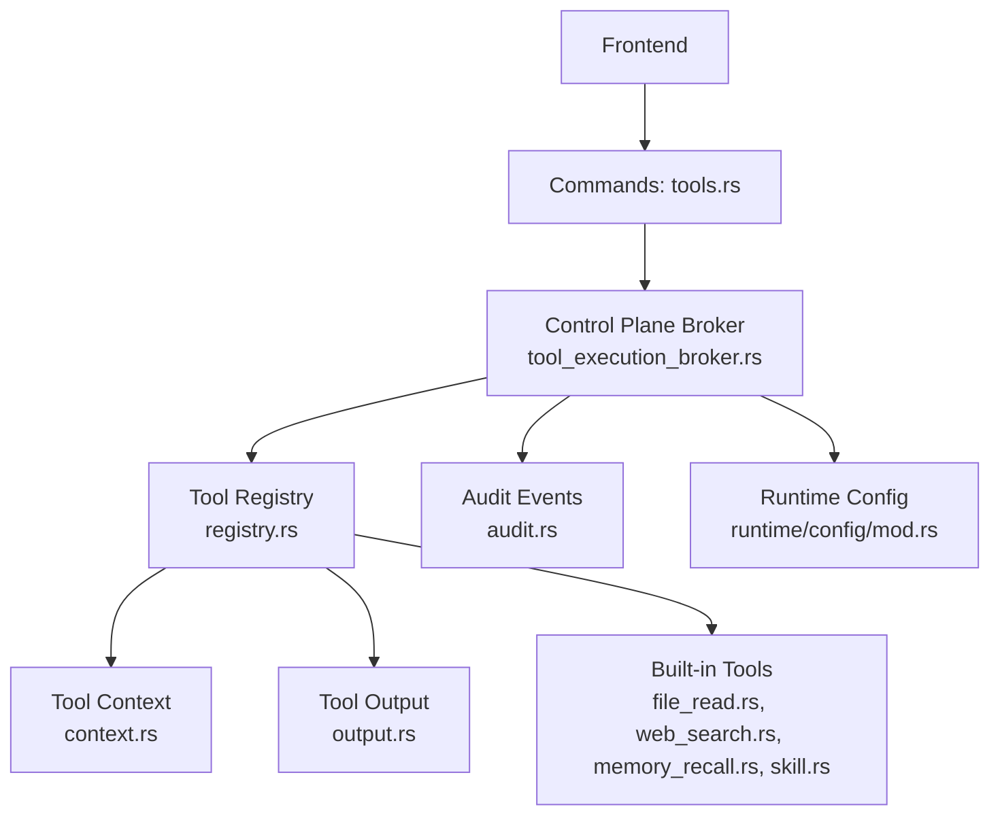
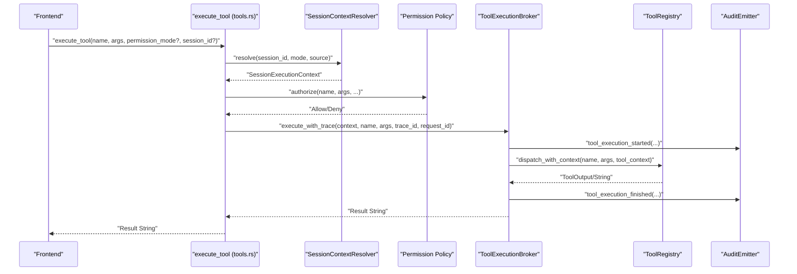
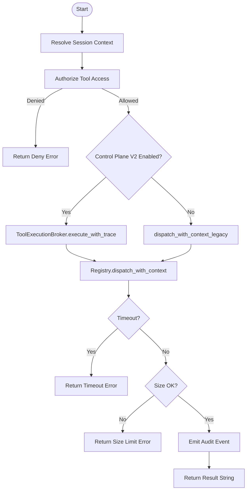
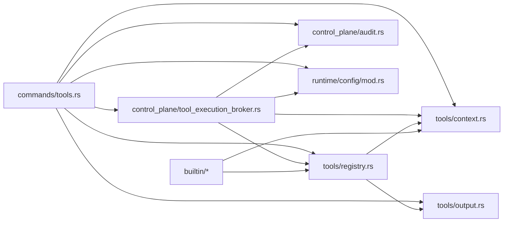

# Tool Execution API

<cite>
**Referenced Files in This Document**
- [tools.rs](file://src-tauri/src/commands/tools.rs)
- [tool_execution_broker.rs](file://src-tauri/src/modules/control_plane/tool_execution_broker.rs)
- [tool_executor.rs](file://src-tauri/src/modules/application/tool_executor.rs)
- [registry.rs](file://src-tauri/src/modules/tools/registry.rs)
- [context.rs](file://src-tauri/src/modules/tools/context.rs)
- [output.rs](file://src-tauri/src/modules/tools/output.rs)
- [mod.rs](file://src-tauri/src/modules/tools/mod.rs)
- [file_read.rs](file://src-tauri/src/modules/tools/builtin/file_read.rs)
- [web_search.rs](file://src-tauri/src/modules/tools/builtin/web_search.rs)
- [memory_recall.rs](file://src-tauri/src/modules/tools/builtin/memory_recall.rs)
- [skill.rs](file://src-tauri/src/modules/tools/builtin/skill.rs)
- [audit.rs](file://src-tauri/src/modules/control_plane/audit.rs)
- [mod.rs](file://src-tauri/src/modules/runtime/config/mod.rs)
</cite>

## Table of Contents
1. [Introduction](#introduction)
2. [Project Structure](#project-structure)
3. [Core Components](#core-components)
4. [Architecture Overview](#architecture-overview)
5. [Detailed Component Analysis](#detailed-component-analysis)
6. [Dependency Analysis](#dependency-analysis)
7. [Performance Considerations](#performance-considerations)
8. [Troubleshooting Guide](#troubleshooting-guide)
9. [Conclusion](#conclusion)
10. [Appendices](#appendices)

## Introduction
This document describes the tool execution system for If2Ai, focusing on the APIs and runtime that power tool registration, invocation, and management. It covers:
- Tool command endpoints for frontend integration
- Tool execution pipeline: context preparation, permission enforcement, dispatch, and result processing
- Built-in tools and custom skill integration
- Security policies, resource limits, timeouts, and boundary enforcement
- Discovery and dynamic loading of tools and skills
- Troubleshooting and performance optimization

## Project Structure
The tool system spans Rust modules under the Tauri application:
- Commands expose tool endpoints to the frontend
- Control plane brokers orchestrate execution with auditing and policy
- Registry manages tool metadata, handlers, and execution constraints
- Context and output modules define execution scope and result shapes
- Built-in tools implement common capabilities
- Skills provide extensible, dynamically loaded custom tooling

**Diagram sources**
- [tools.rs:127-257](file://src-tauri/src/commands/tools.rs#L127-L257)
- [tool_execution_broker.rs:109-265](file://src-tauri/src/modules/control_plane/tool_execution_broker.rs#L109-L265)
- [registry.rs:353-584](file://src-tauri/src/modules/tools/registry.rs#L353-L584)
- [context.rs:9-109](file://src-tauri/src/modules/tools/context.rs#L9-L109)
- [output.rs:22-327](file://src-tauri/src/modules/tools/output.rs#L22-L327)
- [file_read.rs:15-98](file://src-tauri/src/modules/tools/builtin/file_read.rs#L15-L98)
- [web_search.rs:22-638](file://src-tauri/src/modules/tools/builtin/web_search.rs#L22-L638)
- [memory_recall.rs:14-103](file://src-tauri/src/modules/tools/builtin/memory_recall.rs#L14-L103)
- [skill.rs:105-221](file://src-tauri/src/modules/tools/builtin/skill.rs#L105-L221)
- [audit.rs:1-47](file://src-tauri/src/modules/control_plane/audit.rs#L1-L47)
- [mod.rs:387-433](file://src-tauri/src/modules/runtime/config/mod.rs#L387-L433)

**Section sources**
- [tools.rs:1-358](file://src-tauri/src/commands/tools.rs#L1-L358)
- [tool_execution_broker.rs:1-358](file://src-tauri/src/modules/control_plane/tool_execution_broker.rs#L1-L358)
- [registry.rs:1-800](file://src-tauri/src/modules/tools/registry.rs#L1-L800)
- [context.rs:1-109](file://src-tauri/src/modules/tools/context.rs#L1-L109)
- [output.rs:1-327](file://src-tauri/src/modules/tools/output.rs#L1-L327)
- [mod.rs:1-173](file://src-tauri/src/modules/tools/mod.rs#L1-L173)

## Core Components
- Tool commands: direct frontend invocation and tool discovery
- Tool registry: registration, validation, dispatch, and constraints
- Execution broker: session-aware execution, policy enforcement, auditing
- Tool context: workdir, permission mode, and scoping
- Tool output: multimodal result representation
- Built-in tools: file I/O, web search, memory recall, skills
- Runtime config: control-plane flags and boundary enforcement

Key responsibilities:
- Frontend invokes tools via Tauri commands
- Commands resolve session context, apply permission policy, and dispatch to the registry or broker
- Registry validates and executes tools with timeouts and size limits
- Broker enforces boundary and sandbox policies, emits audit events
- Results are returned as unified strings or multimodal outputs

**Section sources**
- [tools.rs:127-308](file://src-tauri/src/commands/tools.rs#L127-L308)
- [registry.rs:473-584](file://src-tauri/src/modules/tools/registry.rs#L473-L584)
- [tool_execution_broker.rs:109-265](file://src-tauri/src/modules/control_plane/tool_execution_broker.rs#L109-L265)
- [context.rs:9-109](file://src-tauri/src/modules/tools/context.rs#L9-L109)
- [output.rs:22-327](file://src-tauri/src/modules/tools/output.rs#L22-L327)

## Architecture Overview
The tool execution pipeline integrates frontend commands, permission checks, session context resolution, and execution with auditing.

**Diagram sources**
- [tools.rs:127-257](file://src-tauri/src/commands/tools.rs#L127-L257)
- [tool_execution_broker.rs:146-265](file://src-tauri/src/modules/control_plane/tool_execution_broker.rs#L146-L265)
- [registry.rs:496-555](file://src-tauri/src/modules/tools/registry.rs#L496-L555)
- [audit.rs:1-47](file://src-tauri/src/modules/control_plane/audit.rs#L1-L47)

## Detailed Component Analysis

### Tool Command Endpoints
- execute_tool: direct tool invocation with JSON args, optional session binding, permission policy, and control-plane routing
- list_tools: returns OpenAI-format tool definitions
- get_tool_definitions: returns filtered tool definitions
- list_toolsets: lists available toolsets

Parameters and behavior:
- execute_tool:
  - name: tool identifier
  - args: JSON string representing tool arguments
  - permission_mode: optional policy mode override
  - session_id: optional session binding for context and safety
- list_tools/get_tool_definitions: return tool metadata compatible with function calling
- list_toolsets: enumerates tool categories

Result processing:
- execute_tool returns a flattened string result
- list_tools returns a list of ToolDefinition with name, description, and input_schema
- get_tool_definitions returns OpenAI function definitions

**Section sources**
- [tools.rs:127-308](file://src-tauri/src/commands/tools.rs#L127-L308)

### Tool Registration and Management
- register_builtin_tools: registers all built-in tools into the registry at startup
- ToolEntry: defines tool metadata, handler(s), timeouts, and size limits
- ToolRegistry: manages registration, lookup, validation, and dispatch with timeouts and size enforcement

Key constraints:
- Timeout per tool via timeout_secs
- Output size enforcement via max_result_size or per-modality caps
- High-risk tools require explicit session context unless overridden

**Section sources**
- [mod.rs:26-173](file://src-tauri/src/modules/tools/mod.rs#L26-L173)
- [registry.rs:185-351](file://src-tauri/src/modules/tools/registry.rs#L185-L351)
- [registry.rs:473-584](file://src-tauri/src/modules/tools/registry.rs#L473-L584)

### Execution Pipeline
- Context preparation:
  - SessionContextResolver resolves session-scoped workdir and permission mode
  - ToolContext encapsulates workdir, permission mode, and optional session/project scopes
- Permission enforcement:
  - Permission policy authorizes tool invocation before dispatch
  - High-risk tools require explicit session context unless allowed by environment flag
- Dispatch and execution:
  - Control plane v2: ToolExecutionBroker orchestrates with auditing and boundary checks
  - Legacy fallback: direct dispatch_with_context_legacy
- Result processing:
  - Registry returns ToolOutput (multimodal) or String
  - Broker collapses to String for compatibility

**Diagram sources**
- [tools.rs:156-257](file://src-tauri/src/commands/tools.rs#L156-L257)
- [tool_execution_broker.rs:146-265](file://src-tauri/src/modules/control_plane/tool_execution_broker.rs#L146-L265)
- [registry.rs:496-555](file://src-tauri/src/modules/tools/registry.rs#L496-L555)

**Section sources**
- [tools.rs:127-257](file://src-tauri/src/commands/tools.rs#L127-L257)
- [tool_execution_broker.rs:109-265](file://src-tauri/src/modules/control_plane/tool_execution_broker.rs#L109-L265)
- [registry.rs:473-584](file://src-tauri/src/modules/tools/registry.rs#L473-L584)

### Built-in Tools and Usage Patterns
- File operations:
  - read_file: safe file reading with workdir boundary checks, size limits, and denylisted paths
  - write_file/edit_file: similar boundary and safety controls
- Web search:
  - web_search: provider prioritization with fallbacks, rate-limited, and size-limited results
- Memory:
  - memory_recall: scoped recall with session/project awareness
- Skills:
  - skill: dynamic discovery and loading of custom skills with governance and manifest validation

Usage examples (described):
- Reading a file within workdir bounds and respecting limits
- Searching the web with a query and optional result count
- Recalling memories scoped to the current session
- Loading a skill by name from project/user/builtin/quarantine roots

**Section sources**
- [file_read.rs:15-166](file://src-tauri/src/modules/tools/builtin/file_read.rs#L15-L166)
- [web_search.rs:22-638](file://src-tauri/src/modules/tools/builtin/web_search.rs#L22-L638)
- [memory_recall.rs:14-103](file://src-tauri/src/modules/tools/builtin/memory_recall.rs#L14-L103)
- [skill.rs:105-280](file://src-tauri/src/modules/tools/builtin/skill.rs#L105-L280)

### Security Policies, Resource Limits, and Timeouts
- Permission policy:
  - Authorization decision recorded via AuditEmitter
  - High-risk tools require explicit session context unless explicitly allowed
- Boundary enforcement:
  - Strict mode blocks shell tools when sandbox disabled
  - Shadow mode logs boundary violations without failing execution
- Resource limits:
  - Per-tool timeout via timeout_secs
  - Output size enforced via max_result_size or per-modality caps
- Environment overrides:
  - IF2AI_CONTROL_PLANE_V2_ENABLED
  - IF2AI_BOUNDARY_ENFORCE_MODE
  - IF2AI_SANDBOX_STRICT_MODE

**Section sources**
- [tools.rs:176-232](file://src-tauri/src/commands/tools.rs#L176-L232)
- [tool_execution_broker.rs:309-357](file://src-tauri/src/modules/control_plane/tool_execution_broker.rs#L309-L357)
- [registry.rs:310-351](file://src-tauri/src/modules/tools/registry.rs#L310-L351)
- [mod.rs:387-433](file://src-tauri/src/modules/runtime/config/mod.rs#L387-L433)

### Tool Discovery, Dynamic Loading, and Plugin Architecture
- Built-in tool registration:
  - register_builtin_tools wires all built-in tools into the registry
- Skills discovery:
  - resolve_skill_path searches workspace/user/builtin/quarantine roots
  - Manifest validation and review gating
  - Fallback review status for trusted bundled skills
- Plugin and extension points:
  - Runtime config exposes plugin enable maps and discovery roots
  - Skills hub and marketplace integration points

**Section sources**
- [mod.rs:26-173](file://src-tauri/src/modules/tools/mod.rs#L26-L173)
- [skill.rs:224-280](file://src-tauri/src/modules/tools/builtin/skill.rs#L224-L280)
- [skill.rs:677-793](file://src-tauri/src/modules/tools/builtin/skill.rs#L677-L793)
- [mod.rs:399-403](file://src-tauri/src/modules/runtime/config/mod.rs#L399-L403)

## Dependency Analysis
The tool system exhibits layered dependencies:
- Commands depend on control plane resolvers and the registry
- Broker depends on registry and runtime config
- Registry depends on context and output models
- Built-in tools depend on registry entry types and context
- Audit and runtime config provide cross-cutting concerns

**Diagram sources**
- [tools.rs:1-358](file://src-tauri/src/commands/tools.rs#L1-L358)
- [tool_execution_broker.rs:1-358](file://src-tauri/src/modules/control_plane/tool_execution_broker.rs#L1-L358)
- [registry.rs:1-800](file://src-tauri/src/modules/tools/registry.rs#L1-L800)
- [context.rs:1-109](file://src-tauri/src/modules/tools/context.rs#L1-L109)
- [output.rs:1-327](file://src-tauri/src/modules/tools/output.rs#L1-L327)
- [audit.rs:1-47](file://src-tauri/src/modules/control_plane/audit.rs#L1-L47)
- [mod.rs:387-433](file://src-tauri/src/modules/runtime/config/mod.rs#L387-L433)

**Section sources**
- [tools.rs:1-358](file://src-tauri/src/commands/tools.rs#L1-L358)
- [tool_execution_broker.rs:1-358](file://src-tauri/src/modules/control_plane/tool_execution_broker.rs#L1-L358)
- [registry.rs:1-800](file://src-tauri/src/modules/tools/registry.rs#L1-L800)

## Performance Considerations
- Prefer control-plane v2 for consistent auditing and policy enforcement
- Tune tool-specific timeouts and output limits to balance responsiveness and completeness
- Use session-scoped contexts to avoid cross-session overhead and contention
- Monitor boundary enforcement mode; shadow mode reduces failures but may mask issues
- For web search, configure preferred providers to reduce latency and improve quality

[No sources needed since this section provides general guidance]

## Troubleshooting Guide
Common issues and resolutions:
- Permission denied:
  - Verify permission_mode and session_id; high-risk tools require explicit context
- Tool not found or disabled:
  - Confirm tool name and availability in registry; check toolset filters
- Timeout:
  - Increase tool timeout or optimize tool logic; inspect network or I/O bottlenecks
- Output too large:
  - Reduce result size or adjust per-modality limits
- Boundary violation in shadow mode:
  - Adjust workdir or permissions; note that shadow mode preserves original errors semantically
- Skill blocked by review gate:
  - Review and approve skills from quarantine or ensure manifest validity

**Section sources**
- [tools.rs:176-198](file://src-tauri/src/commands/tools.rs#L176-L198)
- [tool_execution_broker.rs:216-234](file://src-tauri/src/modules/control_plane/tool_execution_broker.rs#L216-L234)
- [registry.rs:147-183](file://src-tauri/src/modules/tools/registry.rs#L147-L183)
- [skill.rs:282-307](file://src-tauri/src/modules/tools/builtin/skill.rs#L282-L307)

## Conclusion
The If2Ai tool execution system provides a secure, auditable, and extensible framework for invoking tools and skills. It balances safety with flexibility through session-scoped contexts, permission policies, boundary enforcement, and runtime-configurable control planes. Built-in tools cover common operations, while the skills mechanism enables dynamic, governed extensions.

[No sources needed since this section summarizes without analyzing specific files]

## Appendices

### API Reference: Tool Commands
- execute_tool
  - Method: POST (via Tauri command)
  - Parameters:
    - name: string
    - args: JSON string
    - permission_mode: optional string
    - session_id: optional string
  - Returns: string result
  - Notes: Applies permission policy; binds context via session_id when required
- list_tools
  - Method: GET
  - Parameters: none
  - Returns: array of ToolDefinition
- get_tool_definitions
  - Method: GET
  - Parameters: allowed: optional array of strings
  - Returns: array of OpenAI function definitions
- list_toolsets
  - Method: GET
  - Parameters: none
  - Returns: array of ToolSet

**Section sources**
- [tools.rs:127-308](file://src-tauri/src/commands/tools.rs#L127-L308)

### Parameter Schemas: Tool Invocation
- execute_tool.args: JSON string; parsed into serde_json::Value before dispatch
- Tool definitions: OpenAI function schema with name, description, and parameters

**Section sources**
- [tools.rs:139-140](file://src-tauri/src/commands/tools.rs#L139-L140)
- [tools.rs:262-302](file://src-tauri/src/commands/tools.rs#L262-L302)

### Result Processing
- execute_tool returns a flattened string
- Registry supports multimodal ToolOutput; broker collapses to string for compatibility

**Section sources**
- [tool_execution_broker.rs:208-212](file://src-tauri/src/modules/control_plane/tool_execution_broker.rs#L208-L212)
- [output.rs:196-224](file://src-tauri/src/modules/tools/output.rs#L196-L224)

### Built-in Tool Examples
- read_file: path, offset, limit; boundary checks and denylisted paths
- web_search: query, max_results; provider prioritization and fallbacks
- memory_recall: query, category, limit; scoped to session/project
- skill: skill name; discovery across roots with governance

**Section sources**
- [file_read.rs:68-98](file://src-tauri/src/modules/tools/builtin/file_read.rs#L68-L98)
- [web_search.rs:496-638](file://src-tauri/src/modules/tools/builtin/web_search.rs#L496-L638)
- [memory_recall.rs:73-103](file://src-tauri/src/modules/tools/builtin/memory_recall.rs#L73-L103)
- [skill.rs:108-221](file://src-tauri/src/modules/tools/builtin/skill.rs#L108-L221)