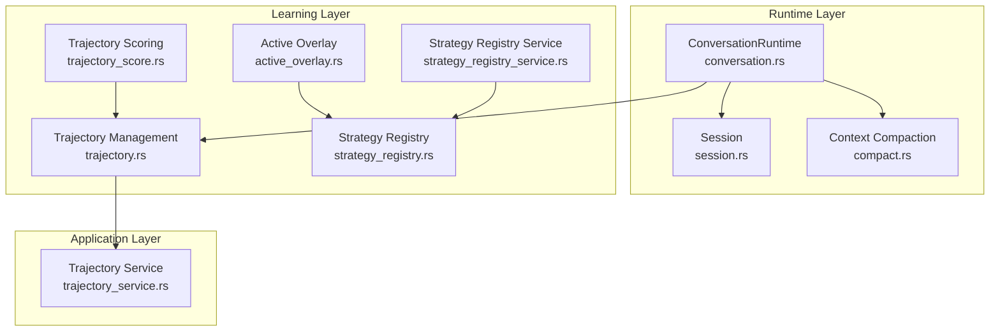
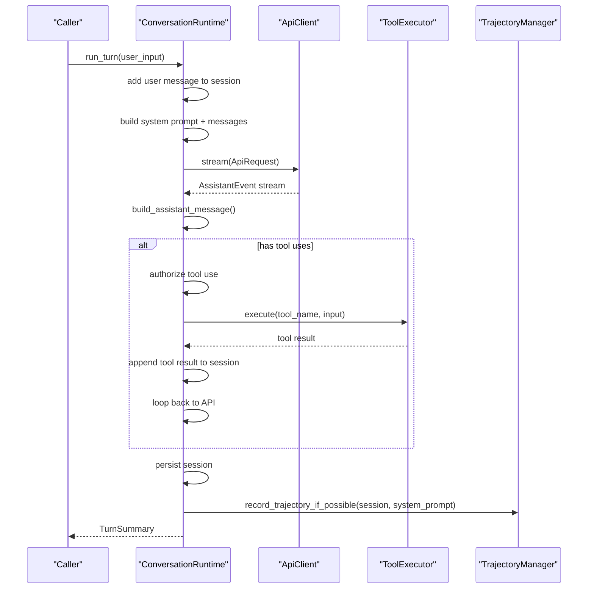
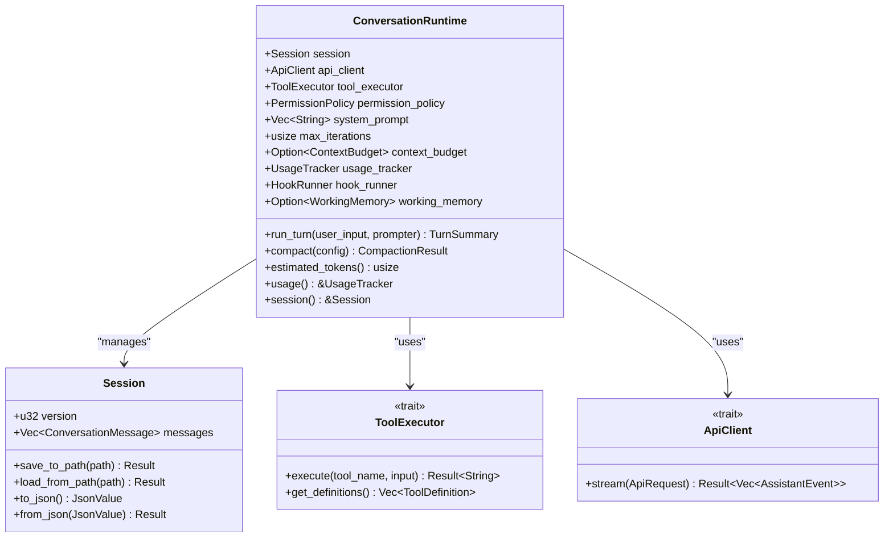
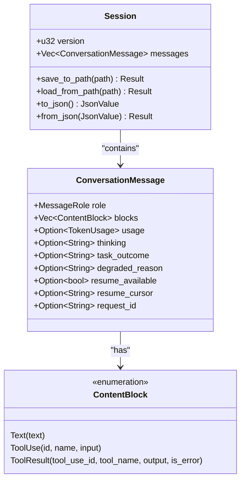
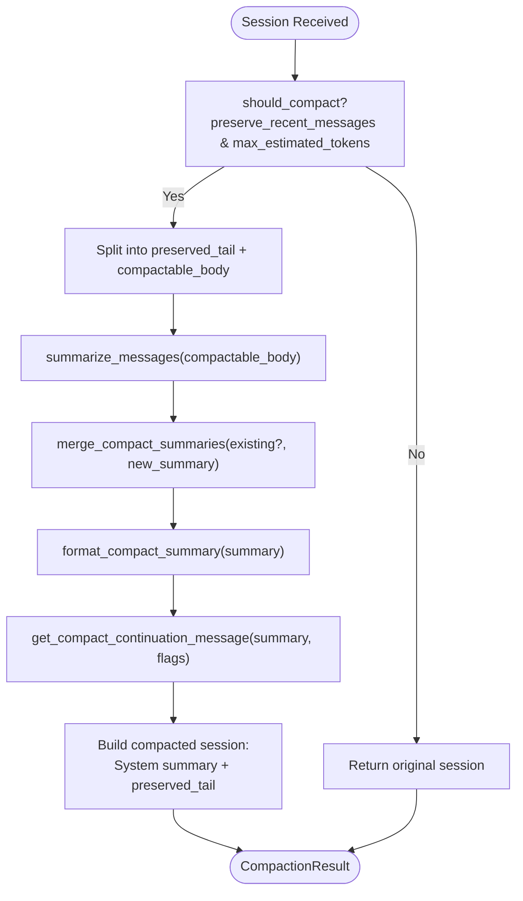
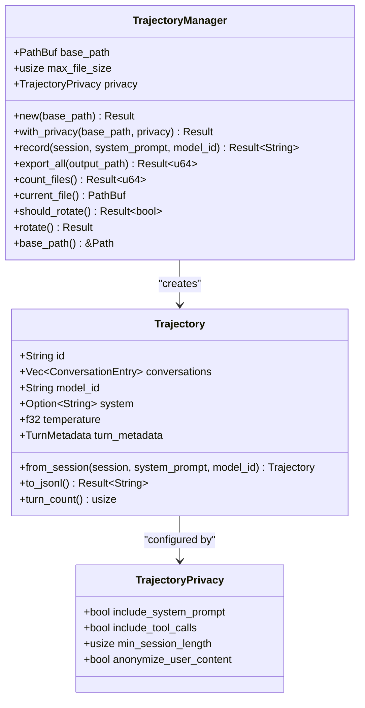
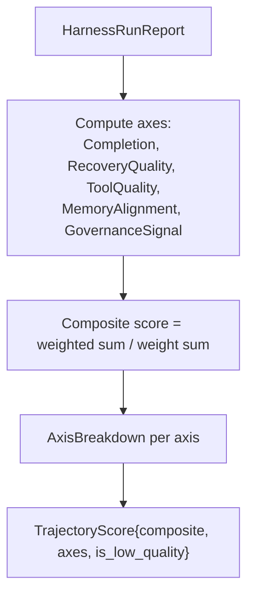
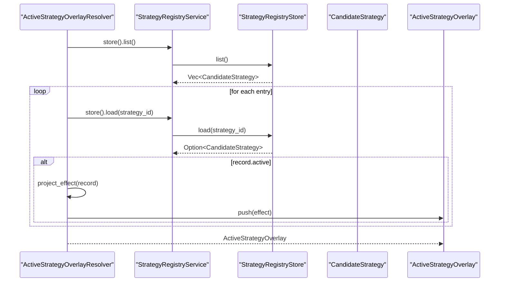
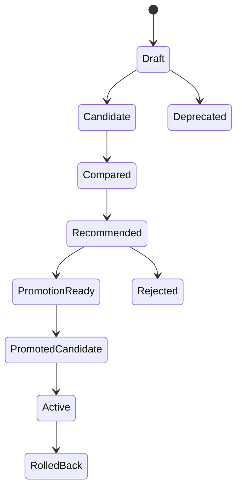
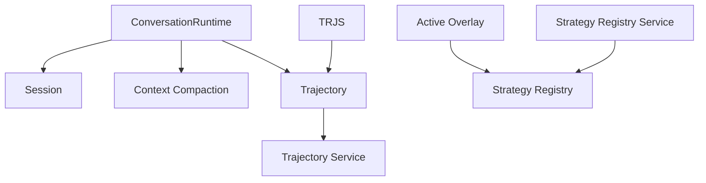

# Agent Loop Implementation

<cite>
**Referenced Files in This Document**
- [agent-loop.md](file://docs/design-docs/agent-loop.md)
- [conversation.rs](file://src-tauri/src/modules/runtime/conversation.rs)
- [session.rs](file://src-tauri/src/modules/runtime/session.rs)
- [compact.rs](file://src-tauri/src/modules/runtime/compact.rs)
- [trajectory.rs](file://src-tauri/src/modules/learning/trajectory.rs)
- [trajectory_service.rs](file://src-tauri/src/modules/application/trajectory_service.rs)
- [trajectory_score.rs](file://src-tauri/src/modules/learning/trajectory_score.rs)
- [active_overlay.rs](file://src-tauri/src/modules/learning/active_overlay.rs)
- [strategy_registry.rs](file://src-tauri/src/modules/learning/strategy_registry.rs)
- [strategy_registry_service.rs](file://src-tauri/src/modules/learning/strategy_registry_service.rs)
</cite>

## Table of Contents
1. [Introduction](#introduction)
2. [Project Structure](#project-structure)
3. [Core Components](#core-components)
4. [Architecture Overview](#architecture-overview)
5. [Detailed Component Analysis](#detailed-component-analysis)
6. [Dependency Analysis](#dependency-analysis)
7. [Performance Considerations](#performance-considerations)
8. [Troubleshooting Guide](#troubleshooting-guide)
9. [Conclusion](#conclusion)

## Introduction
This document provides comprehensive technical documentation for the agent loop implementation in the if2Ai system. It covers the core agent loop architecture, execution flow, and state management, with detailed explanations of trajectory management (creation, compression, and privacy controls), the active overlay system for strategy selection and execution, and practical examples of workflows, state transitions, and error handling mechanisms. Performance optimization, memory management, and debugging capabilities are addressed within the agent loop context.

## Project Structure
The agent loop implementation spans several modules:
- Runtime: conversation orchestration, session management, context compaction
- Learning: trajectory capture and scoring, active strategy overlay
- Application: trajectory persistence and export
- Strategy registry: governance and rollout of active strategies

**Diagram sources**
- [conversation.rs:182-547](file://src-tauri/src/modules/runtime/conversation.rs#L182-L547)
- [session.rs:62-154](file://src-tauri/src/modules/runtime/session.rs#L62-L154)
- [compact.rs:130-178](file://src-tauri/src/modules/runtime/compact.rs#L130-L178)
- [trajectory.rs:169-357](file://src-tauri/src/modules/learning/trajectory.rs#L169-L357)
- [trajectory_service.rs:23-57](file://src-tauri/src/modules/application/trajectory_service.rs#L23-L57)
- [trajectory_score.rs:129-146](file://src-tauri/src/modules/learning/trajectory_score.rs#L129-L146)
- [active_overlay.rs:102-153](file://src-tauri/src/modules/learning/active_overlay.rs#L102-L153)
- [strategy_registry.rs:558-705](file://src-tauri/src/modules/learning/strategy_registry.rs#L558-L705)
- [strategy_registry_service.rs:106-122](file://src-tauri/src/modules/learning/strategy_registry_service.rs#L106-L122)

**Section sources**
- [agent-loop.md:1-445](file://docs/design-docs/agent-loop.md#L1-L445)

## Core Components
This section documents the primary building blocks of the agent loop and supporting systems.

- ConversationRuntime: orchestrates a single turn of the agent loop, manages session state, handles tool execution, and integrates with the active overlay and trajectory recording.
- Session: maintains conversation history with structured message blocks and supports serialization/deserialization.
- Context Compaction: reduces token usage by summarizing older messages while preserving recent context.
- Trajectory Management: captures conversation sessions as ShareGPT JSONL for future RL training with privacy controls.
- Active Overlay: resolves active strategies and projects them into runtime overlays for prompt augmentation.
- Strategy Registry: governs candidate strategies, their rollout states, and definitions.

**Section sources**
- [conversation.rs:182-547](file://src-tauri/src/modules/runtime/conversation.rs#L182-L547)
- [session.rs:42-154](file://src-tauri/src/modules/runtime/session.rs#L42-L154)
- [compact.rs:22-178](file://src-tauri/src/modules/runtime/compact.rs#L22-L178)
- [trajectory.rs:169-357](file://src-tauri/src/modules/learning/trajectory.rs#L169-L357)
- [active_overlay.rs:102-153](file://src-tauri/src/modules/learning/active_overlay.rs#L102-L153)
- [strategy_registry.rs:558-705](file://src-tauri/src/modules/learning/strategy_registry.rs#L558-L705)

## Architecture Overview
The agent loop follows a deterministic turn-based process:
1. Add user message to session
2. Build system prompt and assemble messages for the LLM request
3. Stream assistant events from the API client
4. Parse assistant message and tool uses
5. If tool uses exist, authorize and execute tools, append results
6. Repeat until no tool uses remain
7. Persist session and optionally record trajectory

**Diagram sources**
- [conversation.rs:358-515](file://src-tauri/src/modules/runtime/conversation.rs#L358-L515)
- [trajectory_service.rs:23-57](file://src-tauri/src/modules/application/trajectory_service.rs#L23-L57)

**Section sources**
- [agent-loop.md:46-61](file://docs/design-docs/agent-loop.md#L46-L61)
- [conversation.rs:358-515](file://src-tauri/src/modules/runtime/conversation.rs#L358-L515)

## Detailed Component Analysis

### ConversationRuntime: Core Agent Loop
ConversationRuntime encapsulates the agent loop logic, managing:
- Session lifecycle and persistence
- Tool execution with permission checks
- Streaming assistant events and content assembly
- Working memory filtering for reduced context
- Turn hooks for memory subsystem integration
- Usage tracking and budget enforcement

Key behaviors:
- Iteration limit enforcement prevents runaway loops
- Context budget validation ensures token usage remains within configured limits
- Working memory restricts the messages sent to the LLM while preserving full history
- Pre/post tool hooks integrate with memory subsystems
- Usage tracker accumulates token usage across turns

**Diagram sources**
- [conversation.rs:182-262](file://src-tauri/src/modules/runtime/conversation.rs#L182-L262)
- [session.rs:62-154](file://src-tauri/src/modules/runtime/session.rs#L62-L154)

**Section sources**
- [conversation.rs:182-547](file://src-tauri/src/modules/runtime/conversation.rs#L182-L547)
- [session.rs:42-154](file://src-tauri/src/modules/runtime/session.rs#L42-L154)

### Session Management
Session maintains conversation history with structured content blocks:
- Message roles: System, User, Assistant, Tool
- Content blocks: Text, ToolUse, ToolResult
- Optional metadata: thinking, task outcomes, degradation reasons, resume flags
- JSON serialization/deserialization with versioning

**Diagram sources**
- [session.rs:42-370](file://src-tauri/src/modules/runtime/session.rs#L42-L370)

**Section sources**
- [session.rs:42-154](file://src-tauri/src/modules/runtime/session.rs#L42-L154)

### Context Compaction
Context compaction reduces token usage by summarizing older messages while preserving recent context and tool usage patterns. It provides:
- Configurable preservation of recent messages
- Token budget enforcement
- Summary formatting and continuation messaging
- Persistence of compaction summaries for memory subsystems

**Diagram sources**
- [compact.rs:69-178](file://src-tauri/src/modules/runtime/compact.rs#L69-L178)

**Section sources**
- [compact.rs:22-178](file://src-tauri/src/modules/runtime/compact.rs#L22-L178)

### Trajectory Management
Trajectory management captures conversation sessions as ShareGPT JSONL for future RL training:
- Conversion from Session to Trajectory with ShareGPT format
- Privacy controls: include/exclude system prompts, tool calls, anonymization, minimum session length
- Rotation and export of trajectory files
- Compression for training efficiency

**Diagram sources**
- [trajectory.rs:21-123](file://src-tauri/src/modules/learning/trajectory.rs#L21-L123)
- [trajectory.rs:169-357](file://src-tauri/src/modules/learning/trajectory.rs#L169-L357)
- [trajectory.rs:125-147](file://src-tauri/src/modules/learning/trajectory.rs#L125-L147)

**Section sources**
- [trajectory.rs:169-357](file://src-tauri/src/modules/learning/trajectory.rs#L169-L357)

### Trajectory Scoring
Trajectory scoring evaluates harness run reports across five governance-aligned axes:
- Completion: task outcome and last-turn success
- Recovery quality: turn success rate
- Tool quality: tool failure/misuse density
- Memory alignment: memory acceptance/rejection ratios
- Governance signal: blocking failures and severity

**Diagram sources**
- [trajectory_score.rs:129-146](file://src-tauri/src/modules/learning/trajectory_score.rs#L129-L146)

**Section sources**
- [trajectory_score.rs:129-146](file://src-tauri/src/modules/learning/trajectory_score.rs#L129-L146)

### Active Overlay System
The active overlay system resolves currently active strategies and projects them into runtime overlays:
- Reads active strategies from the strategy registry
- Projects strategy definitions into ActiveStrategyEffect
- Aggregates effects into ActiveStrategyOverlay
- Renders prompt overlay text for runtime consumption

**Diagram sources**
- [active_overlay.rs:118-152](file://src-tauri/src/modules/learning/active_overlay.rs#L118-L152)
- [strategy_registry_service.rs:106-122](file://src-tauri/src/modules/learning/strategy_registry_service.rs#L106-L122)

**Section sources**
- [active_overlay.rs:102-153](file://src-tauri/src/modules/learning/active_overlay.rs#L102-L153)
- [strategy_registry.rs:558-705](file://src-tauri/src/modules/learning/strategy_registry.rs#L558-L705)
- [strategy_registry_service.rs:106-122](file://src-tauri/src/modules/learning/strategy_registry_service.rs#L106-L122)

### Practical Workflows and State Transitions

#### Agent Loop Workflow
- Single turn execution: user input → assistant response → optional tool use → tool execution → loop until completion
- Multi-turn conversation: repeated turns with session persistence
- Context compaction: triggered when token budget exceeded or configured thresholds met
- Trajectory recording: optional capture of session for RL training with privacy controls

#### State Transitions
- Strategy rollout states: Draft → Candidate → Compared → Recommended → PromotionReady/PromotionBlocked/PromotedCandidate → Active → RolledBack → Rejected/Deprecated
- Active overlay resolution: reads active strategies and projects runtime effects

**Diagram sources**
- [strategy_registry.rs:128-194](file://src-tauri/src/modules/learning/strategy_registry.rs#L128-L194)

**Section sources**
- [strategy_registry.rs:128-194](file://src-tauri/src/modules/learning/strategy_registry.rs#L128-L194)

### Error Handling Mechanisms
The agent loop implements robust error handling:
- RuntimeError variants for API errors, tool errors, permission denials, session errors, configuration errors, and iteration limits
- Graceful degradation when streaming ends without proper termination markers
- Hook feedback merging preserves tool execution results while incorporating pre/post hook messages
- Context compaction persistence with warnings on summary store failures

**Section sources**
- [conversation.rs:118-173](file://src-tauri/src/modules/runtime/conversation.rs#L118-L173)
- [conversation.rs:549-611](file://src-tauri/src/modules/runtime/conversation.rs#L549-L611)

## Dependency Analysis
The agent loop integrates multiple subsystems with clear separation of concerns:
- Runtime depends on session management, context compaction, and tool execution
- Trajectory management depends on session serialization and file I/O
- Active overlay depends on strategy registry and strategy definitions
- Application layer coordinates trajectory persistence and export

**Diagram sources**
- [conversation.rs:182-547](file://src-tauri/src/modules/runtime/conversation.rs#L182-L547)
- [trajectory_service.rs:23-57](file://src-tauri/src/modules/application/trajectory_service.rs#L23-L57)
- [active_overlay.rs:102-153](file://src-tauri/src/modules/learning/active_overlay.rs#L102-L153)
- [strategy_registry.rs:558-705](file://src-tauri/src/modules/learning/strategy_registry.rs#L558-L705)

**Section sources**
- [conversation.rs:182-547](file://src-tauri/src/modules/runtime/conversation.rs#L182-L547)
- [trajectory_service.rs:23-57](file://src-tauri/src/modules/application/trajectory_service.rs#L23-L57)
- [active_overlay.rs:102-153](file://src-tauri/src/modules/learning/active_overlay.rs#L102-L153)
- [strategy_registry.rs:558-705](file://src-tauri/src/modules/learning/strategy_registry.rs#L558-L705)

## Performance Considerations
- Token budget tracking: enforce per-slot budgets (System/Episodic/Semantic/Working) to prevent excessive context
- Working memory: limit messages sent to LLM while preserving full history
- Context compaction: reduce token usage by summarizing older messages
- Trajectory compression: filter low-quality trajectories and truncate long sequences
- Usage tracking: accumulate token usage across turns for observability

[No sources needed since this section provides general guidance]

## Troubleshooting Guide
Common issues and resolutions:
- Exceeded max iterations: adjust ConversationRuntime::with_max_iterations or investigate infinite tool loop
- Context budget exceeded: enable compaction or reduce working memory window
- Permission denials: configure PermissionPolicy and optional PermissionPrompter for tool approvals
- Trajectory recording failures: check TrajectoryManager configuration and file permissions
- Active overlay resolution errors: verify strategy registry availability and active strategy definitions

**Section sources**
- [conversation.rs:371-391](file://src-tauri/src/modules/runtime/conversation.rs#L371-L391)
- [trajectory_service.rs:23-57](file://src-tauri/src/modules/application/trajectory_service.rs#L23-L57)
- [active_overlay.rs:118-152](file://src-tauri/src/modules/learning/active_overlay.rs#L118-L152)

## Conclusion
The agent loop implementation provides a robust, extensible framework for conversational AI interactions. Its modular design separates concerns between runtime orchestration, session management, context control, trajectory capture, and strategy governance. The system emphasizes safety through permission policies, privacy via trajectory controls, and reliability through comprehensive error handling and debugging hooks. Future enhancements can focus on concurrency, advanced context compression, provider failover, and prompt caching as outlined in the design documentation.