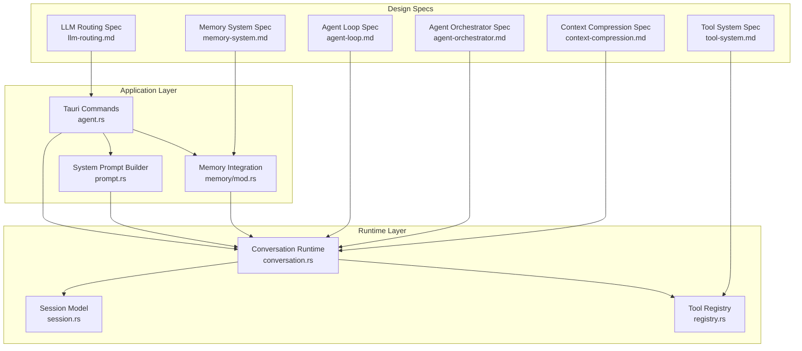
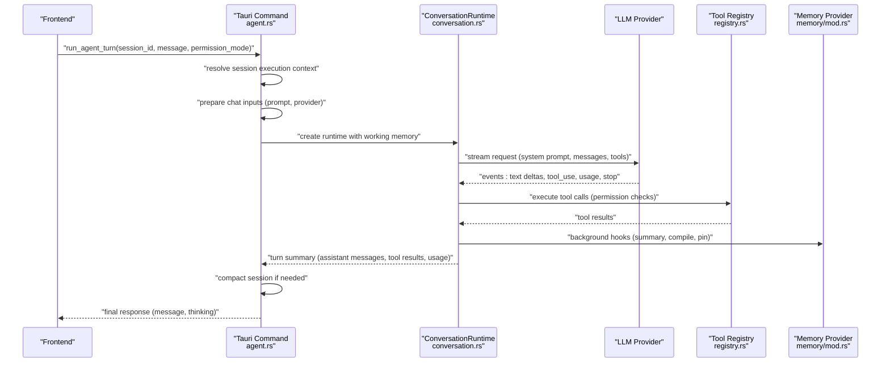
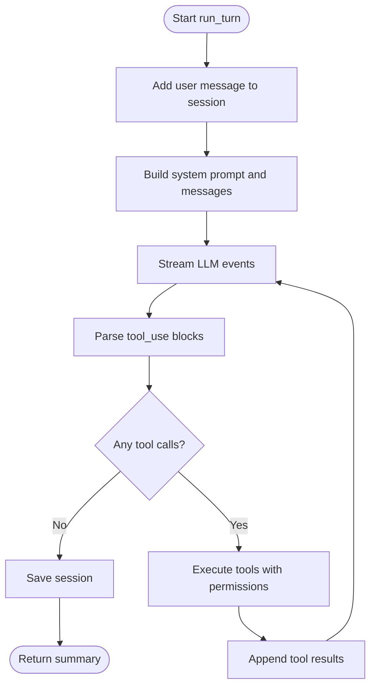
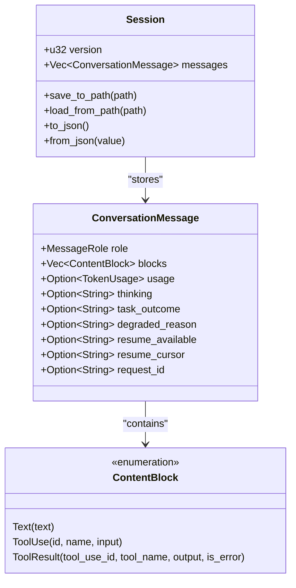
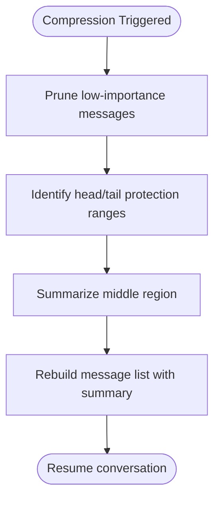
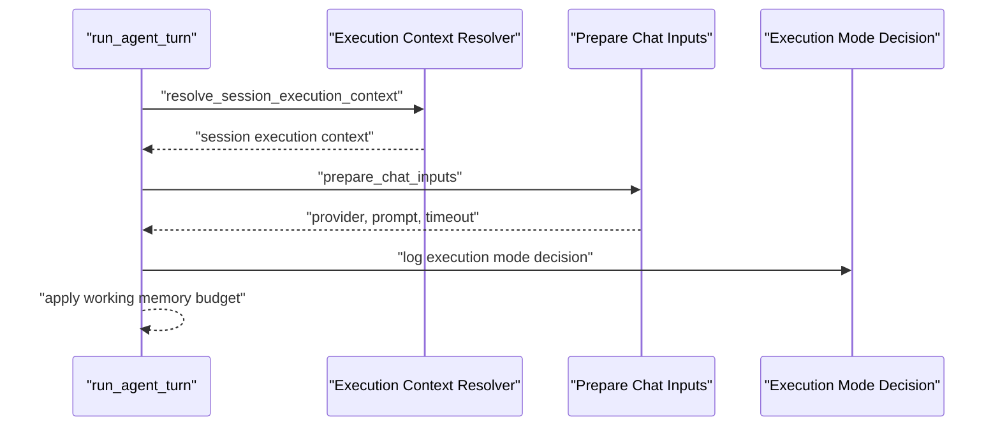
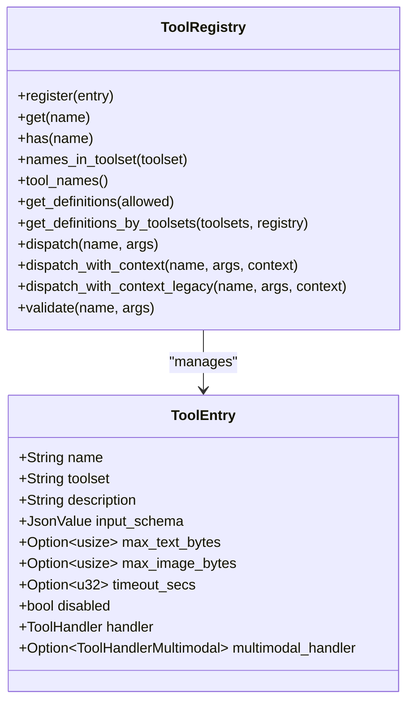
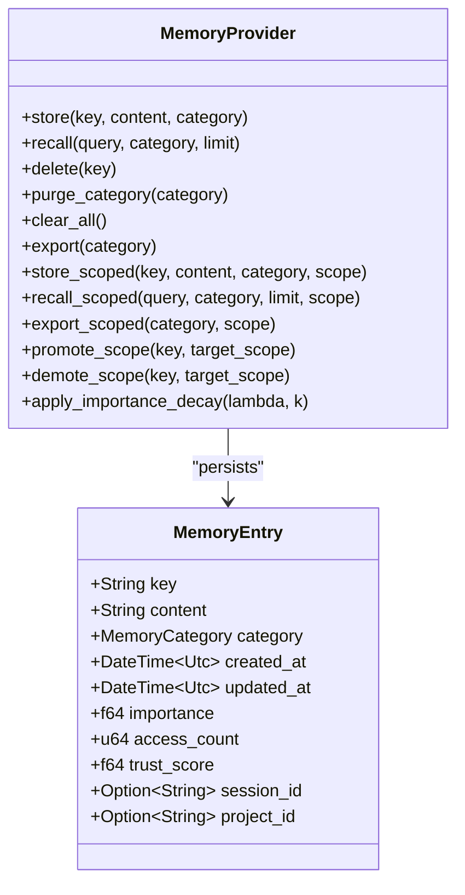
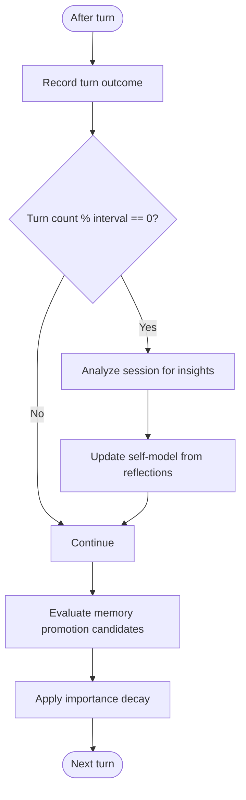
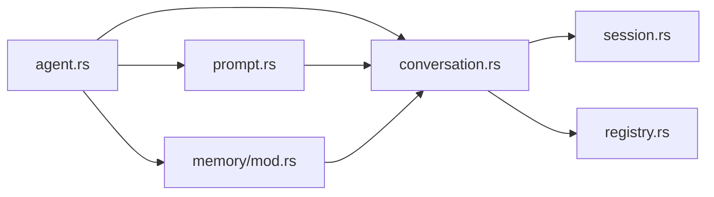

# Agent Orchestration

<cite>
**Referenced Files in This Document**
- [DESIGN.md](file://DESIGN.md)
- [agent-loop.md](file://docs/design-docs/agent-loop.md)
- [agent-orchestrator.md](file://docs/design-docs/agent-orchestrator.md)
- [context-compression.md](file://docs/design-docs/context-compression.md)
- [memory-system.md](file://docs/design-docs/memory-system.md)
- [tool-activation.md](file://docs/design-docs/tool-activation.md)
- [tool-system.md](file://docs/design-docs/tool-system.md)
- [llm-routing.md](file://docs/design-docs/llm-routing.md)
- [conversation.rs](file://src-tauri/src/modules/runtime/conversation.rs)
- [session.rs](file://src-tauri/src/modules/runtime/session.rs)
- [registry.rs](file://src-tauri/src/modules/tools/registry.rs)
- [agent.rs](file://src-tauri/src/commands/agent.rs)
- [prompt.rs](file://src-tauri/src/modules/runtime/prompt.rs)
- [mod.rs](file://src-tauri/src/modules/memory/mod.rs)
</cite>

## Table of Contents
1. [Introduction](#introduction)
2. [Project Structure](#project-structure)
3. [Core Components](#core-components)
4. [Architecture Overview](#architecture-overview)
5. [Detailed Component Analysis](#detailed-component-analysis)
6. [Dependency Analysis](#dependency-analysis)
7. [Performance Considerations](#performance-considerations)
8. [Troubleshooting Guide](#troubleshooting-guide)
9. [Conclusion](#conclusion)
10. [Appendices](#appendices)

## Introduction
This document explains If2Ai’s intelligent agent orchestration framework with a focus on the agent loop, conversation management, context compression, execution mode routing, request intelligence processing, trajectory planning, and self-learning. It synthesizes design documents and code to provide a practical guide for building, operating, and extending autonomous agent behavior across conversational, tool-execution, and memory-driven workflows.

## Project Structure
The agent orchestration spans multiple layers:
- Runtime: agent loop, conversation state, tool execution, and streaming events
- Application: Tauri commands, provider resolution, memory integration, and learning
- Design: agent loop, orchestrator, context compression, memory, tool system, and LLM routing

**Diagram sources**
- [agent.rs:160-722](file://src-tauri/src/commands/agent.rs#L160-L722)
- [conversation.rs:182-547](file://src-tauri/src/modules/runtime/conversation.rs#L182-L547)
- [prompt.rs:355-570](file://src-tauri/src/modules/runtime/prompt.rs#L355-L570)
- [registry.rs:354-584](file://src-tauri/src/modules/tools/registry.rs#L354-L584)
- [session.rs:62-161](file://src-tauri/src/modules/runtime/session.rs#L62-L161)
- [agent-loop.md:1-445](file://docs/design-docs/agent-loop.md#L1-L445)
- [agent-orchestrator.md:1-391](file://docs/design-docs/agent-orchestrator.md#L1-L391)
- [context-compression.md:1-449](file://docs/design-docs/context-compression.md#L1-L449)
- [tool-system.md:1-444](file://docs/design-docs/tool-system.md#L1-L444)
- [llm-routing.md:1-462](file://docs/design-docs/llm-routing.md#L1-L462)
- [memory-system.md:1-945](file://docs/design-docs/memory-system.md#L1-L945)

**Section sources**
- [DESIGN.md:1-406](file://DESIGN.md#L1-L406)
- [agent-loop.md:1-445](file://docs/design-docs/agent-loop.md#L1-L445)
- [agent-orchestrator.md:1-391](file://docs/design-docs/agent-orchestrator.md#L1-L391)
- [context-compression.md:1-449](file://docs/design-docs/context-compression.md#L1-L449)
- [memory-system.md:1-945](file://docs/design-docs/memory-system.md#L1-L945)
- [tool-activation.md:1-800](file://docs/design-docs/tool-activation.md#L1-L800)
- [tool-system.md:1-444](file://docs/design-docs/tool-system.md#L1-L444)
- [llm-routing.md:1-462](file://docs/design-docs/llm-routing.md#L1-L462)
- [conversation.rs:1-800](file://src-tauri/src/modules/runtime/conversation.rs#L1-L800)
- [session.rs:1-560](file://src-tauri/src/modules/runtime/session.rs#L1-L560)
- [registry.rs:1-851](file://src-tauri/src/modules/tools/registry.rs#L1-L851)
- [agent.rs:1-800](file://src-tauri/src/commands/agent.rs#L1-L800)
- [prompt.rs:1-800](file://src-tauri/src/modules/runtime/prompt.rs#L1-L800)
- [mod.rs:1-517](file://src-tauri/src/modules/memory/mod.rs#L1-L517)

## Core Components
- Conversation Runtime: orchestrates a single turn, manages messages, streams LLM events, executes tools, and tracks usage
- Session Model: typed message and content-block structures with JSON serialization
- Tool Registry: dynamic registration, validation, and dispatch with timeouts and size caps
- System Prompt Builder: constructs a structured, per-turn system prompt with environment, project, memory, and skills context
- Memory Integration: scoped persistence, recall, and promotion across session/project/global scopes
- LLM Routing: provider detection, selection, fallback, and rate-limiting
- Context Compression: pruning, protection, and summarization to maintain bounded context

**Section sources**
- [conversation.rs:182-547](file://src-tauri/src/modules/runtime/conversation.rs#L182-L547)
- [session.rs:42-370](file://src-tauri/src/modules/runtime/session.rs#L42-L370)
- [registry.rs:354-584](file://src-tauri/src/modules/tools/registry.rs#L354-L584)
- [prompt.rs:355-570](file://src-tauri/src/modules/runtime/prompt.rs#L355-L570)
- [mod.rs:96-380](file://src-tauri/src/modules/memory/mod.rs#L96-L380)
- [llm-routing.md:34-202](file://docs/design-docs/llm-routing.md#L34-L202)
- [context-compression.md:60-158](file://docs/design-docs/context-compression.md#L60-L158)

## Architecture Overview
The runtime integrates tightly with application commands and memory systems. The agent loop is initiated by a Tauri command, which resolves provider and permission context, prepares the prompt, and invokes the ConversationRuntime. The runtime streams assistant events, parses tool calls, executes tools, and updates the session. Memory and learning modules participate asynchronously around the loop.

**Diagram sources**
- [agent.rs:160-722](file://src-tauri/src/commands/agent.rs#L160-L722)
- [conversation.rs:358-515](file://src-tauri/src/modules/runtime/conversation.rs#L358-L515)
- [registry.rs:486-540](file://src-tauri/src/modules/tools/registry.rs#L486-L540)
- [mod.rs:204-380](file://src-tauri/src/modules/memory/mod.rs#L204-L380)

**Section sources**
- [agent.rs:160-722](file://src-tauri/src/commands/agent.rs#L160-L722)
- [conversation.rs:358-515](file://src-tauri/src/modules/runtime/conversation.rs#L358-L515)
- [registry.rs:486-540](file://src-tauri/src/modules/tools/registry.rs#L486-L540)
- [mod.rs:204-380](file://src-tauri/src/modules/memory/mod.rs#L204-L380)

## Detailed Component Analysis

### Agent Loop Implementation
The agent loop encapsulates a single turn of conversation:
- Adds user message to session
- Builds system prompt and message list
- Streams LLM events and builds assistant message
- Parses tool-use blocks and executes tools with permission checks
- Updates session and triggers memory hooks
- Returns summary with assistant messages, tool results, iteration count, and usage

**Diagram sources**
- [conversation.rs:358-515](file://src-tauri/src/modules/runtime/conversation.rs#L358-L515)

**Section sources**
- [conversation.rs:358-515](file://src-tauri/src/modules/runtime/conversation.rs#L358-L515)
- [agent-loop.md:138-221](file://docs/design-docs/agent-loop.md#L138-L221)

### Conversation Management
The session model defines roles, content blocks, and JSON serialization. The runtime maintains a typed conversation history with usage tracking and optional thinking content.

**Diagram sources**
- [session.rs:42-370](file://src-tauri/src/modules/runtime/session.rs#L42-L370)

**Section sources**
- [session.rs:42-370](file://src-tauri/src/modules/runtime/session.rs#L42-L370)

### Context Compression Strategies
Context compression trims long histories to maintain model window budgets:
- Prune low-importance messages
- Protect head and tail for grounding
- Summarize middle region with an LLM
- Track compression statistics and effectiveness

**Diagram sources**
- [context-compression.md:111-156](file://docs/design-docs/context-compression.md#L111-L156)

**Section sources**
- [context-compression.md:60-158](file://docs/design-docs/context-compression.md#L60-L158)

### Execution Mode Routing and Request Intelligence
The application layer resolves provider and execution mode decisions per turn:
- Resolves session execution context (workdir, project, permission mode)
- Prepares chat inputs (prompt plan, provider, request timeout)
- Emits advisory execution mode decision for observability
- Applies working memory budget and logs integrity checks

**Diagram sources**
- [agent.rs:120-273](file://src-tauri/src/commands/agent.rs#L120-L273)

**Section sources**
- [agent.rs:120-273](file://src-tauri/src/commands/agent.rs#L120-L273)

### Tool Execution Coordination
The tool system supports dynamic registration, validation, timeouts, and multimodal outputs:
- ToolEntry with input schema, timeouts, and handler variants
- Dispatch with shared or session-scoped contexts
- Size caps enforced per modality
- Tool definitions exported for LLM consumption

**Diagram sources**
- [registry.rs:203-351](file://src-tauri/src/modules/tools/registry.rs#L203-L351)

**Section sources**
- [registry.rs:354-584](file://src-tauri/src/modules/tools/registry.rs#L354-L584)
- [tool-system.md:185-235](file://docs/design-docs/tool-system.md#L185-L235)
- [tool-activation.md:175-274](file://docs/design-docs/tool-activation.md#L175-L274)

### Memory Integration and Context Preservation
Memory operates with three-tier scoping (session/project/global) and supports:
- Scoped storage/recall with visibility rules
- Export and promotion/demotion across scopes
- Importance decay and pinned items
- Memory injection into system prompts

**Diagram sources**
- [mod.rs:204-380](file://src-tauri/src/modules/memory/mod.rs#L204-L380)

**Section sources**
- [mod.rs:96-380](file://src-tauri/src/modules/memory/mod.rs#L96-L380)
- [memory-system.md:107-183](file://docs/design-docs/memory-system.md#L107-L183)

### Self-Learning, Failure Analysis, and Continuous Improvement
Learning and reflection integrate with the agent loop:
- Records turn outcomes and periodically analyzes sessions
- Updates self-model with learned patterns
- Triggers reflection at intervals and logs insights
- Surfaces memory promotion candidates and applies importance decay

**Diagram sources**
- [agent.rs:491-531](file://src-tauri/src/commands/agent.rs#L491-L531)

**Section sources**
- [agent.rs:491-531](file://src-tauri/src/commands/agent.rs#L491-L531)

### Practical Examples and Decision Patterns
- Conversation pattern: user message → assistant response with tool-use → tool execution → tool result → next assistant turn
- Tool selection: system prompt includes tool definitions; LLM chooses tools based on schema and availability
- Memory context: memory injection sections appended dynamically per turn
- Provider fallback: routing selects primary and falls back on recoverable errors

**Section sources**
- [agent-loop.md:46-61](file://docs/design-docs/agent-loop.md#L46-L61)
- [prompt.rs:496-538](file://src-tauri/src/modules/runtime/prompt.rs#L496-L538)
- [llm-routing.md:135-202](file://docs/design-docs/llm-routing.md#L135-L202)

## Dependency Analysis
The runtime depends on the session model, tool registry, and memory provider. Application commands coordinate provider resolution, prompt preparation, and learning modules.

**Diagram sources**
- [agent.rs:160-722](file://src-tauri/src/commands/agent.rs#L160-L722)
- [conversation.rs:182-547](file://src-tauri/src/modules/runtime/conversation.rs#L182-L547)
- [prompt.rs:355-570](file://src-tauri/src/modules/runtime/prompt.rs#L355-L570)
- [registry.rs:354-584](file://src-tauri/src/modules/tools/registry.rs#L354-L584)
- [session.rs:62-161](file://src-tauri/src/modules/runtime/session.rs#L62-L161)
- [mod.rs:204-380](file://src-tauri/src/modules/memory/mod.rs#L204-L380)

**Section sources**
- [agent.rs:160-722](file://src-tauri/src/commands/agent.rs#L160-L722)
- [conversation.rs:182-547](file://src-tauri/src/modules/runtime/conversation.rs#L182-L547)
- [prompt.rs:355-570](file://src-tauri/src/modules/runtime/prompt.rs#L355-L570)
- [registry.rs:354-584](file://src-tauri/src/modules/tools/registry.rs#L354-L584)
- [session.rs:62-161](file://src-tauri/src/modules/runtime/session.rs#L62-L161)
- [mod.rs:204-380](file://src-tauri/src/modules/memory/mod.rs#L204-L380)

## Performance Considerations
- Streaming LLM responses reduces perceived latency and enables progressive UI updates
- Working memory sliding window constrains tokens sent per request
- Tool timeouts prevent runaway executions
- Context compression reduces token usage and improves throughput
- Memory importance decay and promotion reduce storage overhead

[No sources needed since this section provides general guidance]

## Troubleshooting Guide
Common issues and remedies:
- API errors: friendly messages differentiate DNS, timeouts, auth, rate limits, and service errors
- Permission denied: adjust permission mode or approve tool usage
- Session errors: verify session persistence and budget thresholds
- Tool errors: check tool availability, timeouts, and output size caps
- Prompt integrity: snapshot verification detects unexpected prompt modifications

**Section sources**
- [agent.rs:664-721](file://src-tauri/src/commands/agent.rs#L664-L721)

## Conclusion
If2Ai’s agent orchestration combines a robust runtime loop, structured conversation management, adaptive context compression, flexible tool execution, and integrated memory and learning. The design emphasizes observability, safety, and extensibility, enabling autonomous behavior while maintaining control and reliability.

[No sources needed since this section summarizes without analyzing specific files]

## Appendices

### Customization and Extension Guidelines
- Extend tools: define ToolEntry with input schema and handler; register via ToolRegistry
- Customize prompts: use SystemPromptBuilder to inject environment, project, memory, and skills context
- Integrate providers: add provider configs and leverage routing for fallback and rate limiting
- Tune memory: configure scope visibility, promotion thresholds, and decay parameters
- Optimize loops: adjust working memory budgets, iteration limits, and compaction thresholds

**Section sources**
- [tool-system.md:370-444](file://docs/design-docs/tool-system.md#L370-L444)
- [prompt.rs:355-570](file://src-tauri/src/modules/runtime/prompt.rs#L355-L570)
- [llm-routing.md:34-202](file://docs/design-docs/llm-routing.md#L34-L202)
- [memory-system.md:622-772](file://docs/design-docs/memory-system.md#L622-L772)
- [context-compression.md:397-443](file://docs/design-docs/context-compression.md#L397-L443)