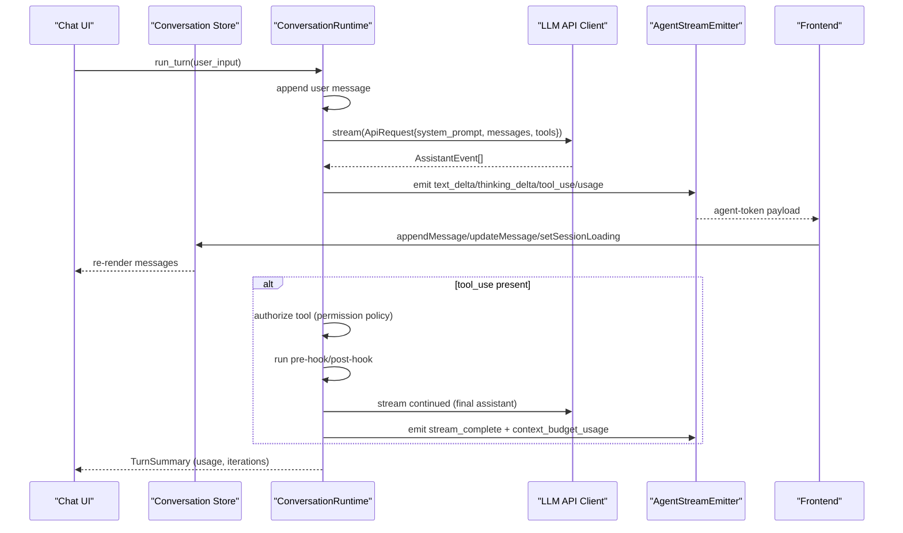
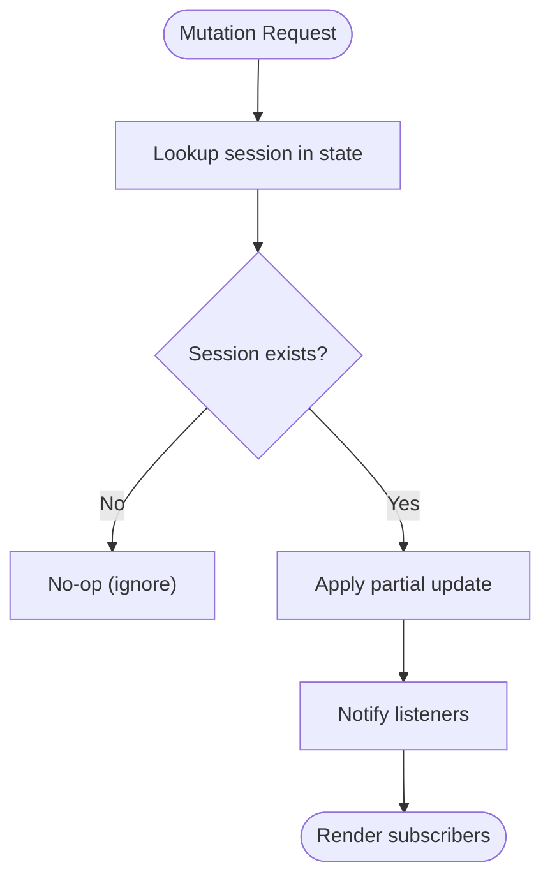
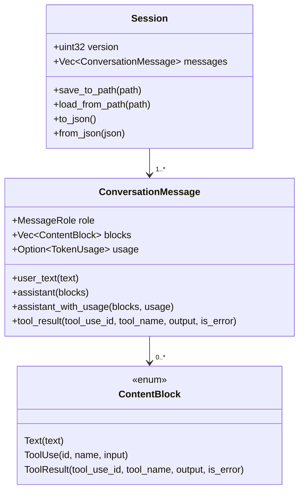
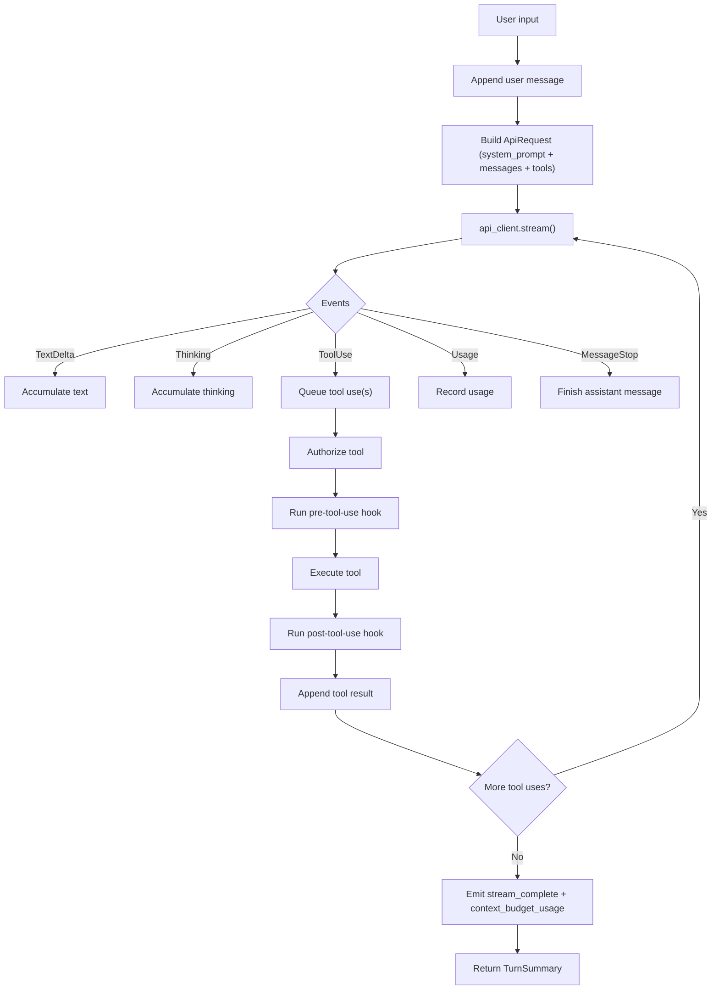
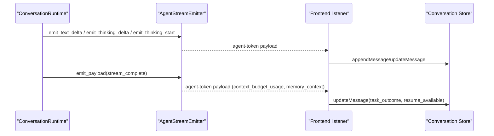
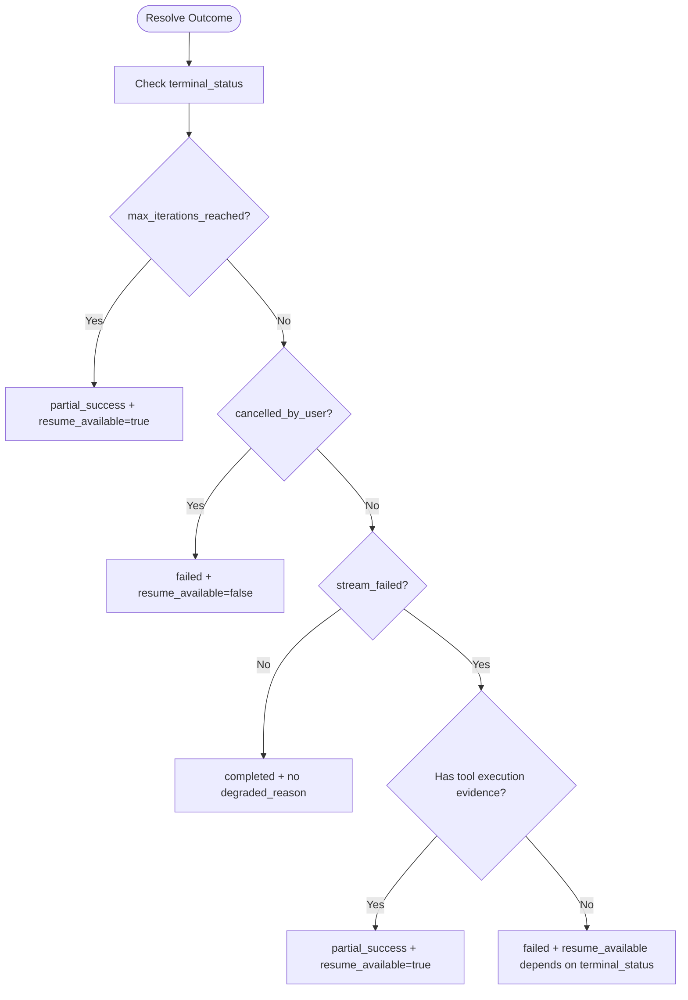
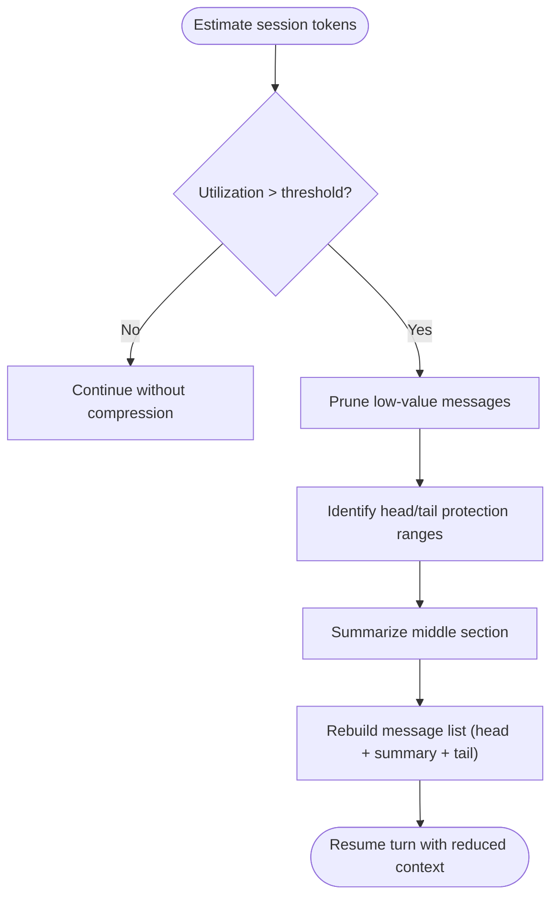
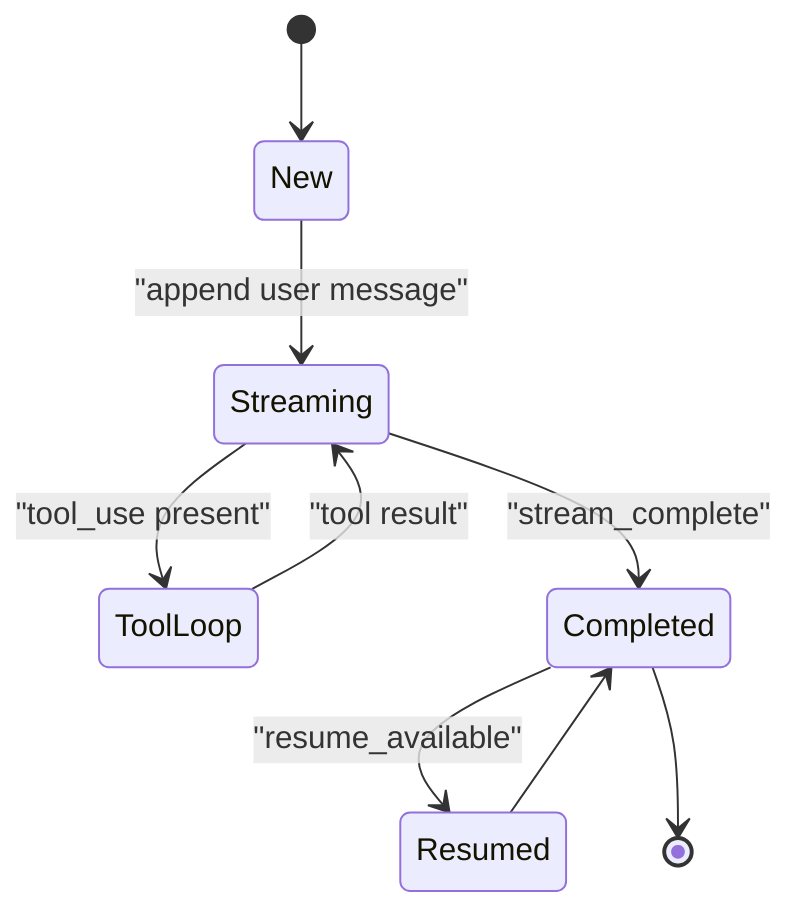
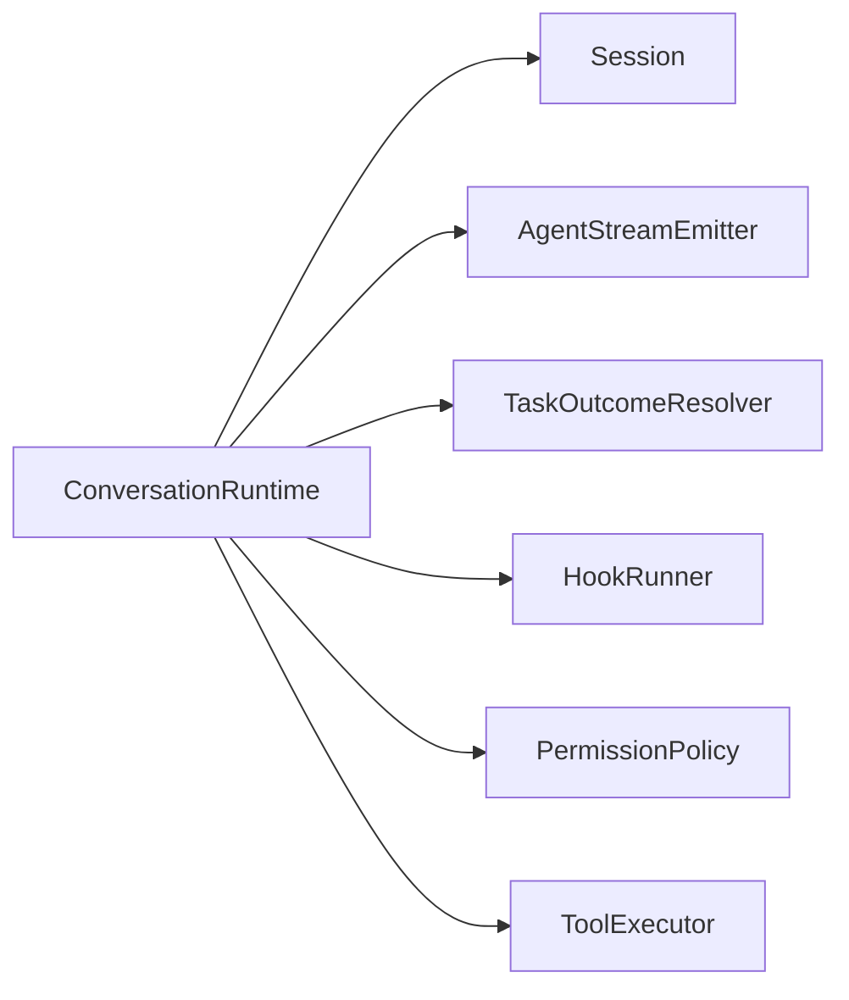

# Conversation Management

<cite>
**Referenced Files in This Document**
- [conversation-slice.ts](file://src/stores/conversation-slice.ts)
- [types.ts](file://src/modules/chat/types.ts)
- [ChatMessage.tsx](file://src/components/chat/ChatMessage.tsx)
- [ChatWorkspace.tsx](file://src/modules/chat/components/ChatWorkspace.tsx)
- [conversation.rs](file://rust/crates/runtime/src/conversation.rs)
- [conversation.rs](file://src-tauri/src/modules/runtime/conversation.rs)
- [session.rs](file://rust/crates/runtime/src/session.rs)
- [stream_emitter.rs](file://src-tauri/src/modules/runtime/stream_emitter.rs)
- [stream_outcome.rs](file://src-tauri/src/commands/stream_outcome.rs)
- [context-compression.md](file://docs/design-docs/context-compression.md)
</cite>

## Table of Contents
1. [Introduction](#introduction)
2. [Project Structure](#project-structure)
3. [Core Components](#core-components)
4. [Architecture Overview](#architecture-overview)
5. [Detailed Component Analysis](#detailed-component-analysis)
6. [Dependency Analysis](#dependency-analysis)
7. [Performance Considerations](#performance-considerations)
8. [Troubleshooting Guide](#troubleshooting-guide)
9. [Conclusion](#conclusion)

## Introduction
This document explains conversation management within the agent orchestration system. It covers the turn-based conversation flow, message handling, streaming response delivery, real-time updates, context preservation, context compression strategies, memory integration, and lifecycle management. It also provides examples of conversation patterns, multi-turn dialogues, and debugging guidance, along with performance considerations for long conversations.

## Project Structure
The conversation system spans three layers:
- Frontend store and UI: React store for per-session state, message types, and chat UI composition.
- Runtime engine: Rust-based conversation runtime that drives turns, manages permissions, tool execution, and streaming.
- Streaming boundary: Canonical event emission and payload shape for real-time updates.

```mermaid
graph TB
subgraph "Frontend"
Store["conversation-slice.ts<br/>Per-session state store"]
Types["types.ts<br/>Message and session types"]
UI["ChatWorkspace.tsx<br/>Chat UI container"]
Msg["ChatMessage.tsx<br/>Message renderer"]
end
subgraph "Runtime"
RT["conversation.rs (Rust)<br/>ConversationRuntime"]
Sess["session.rs<br/>Session and Message types"]
Stream["stream_emitter.rs<br/>Agent stream emitter"]
Outcome["stream_outcome.rs<br/>Task outcome resolver"]
end
Store <- --> Types
UI --> Store
Msg --> Types
UI --> RT
RT --> Sess
RT --> Stream
Stream --> UI
RT --> Outcome
```

**Diagram sources**
- [conversation-slice.ts:1-248](file://src/stores/conversation-slice.ts#L1-L248)
- [types.ts:1-147](file://src/modules/chat/types.ts#L1-L147)
- [ChatWorkspace.tsx:92-401](file://src/modules/chat/components/ChatWorkspace.tsx#L92-L401)
- [ChatMessage.tsx:1-69](file://src/components/chat/ChatMessage.tsx#L1-L69)
- [conversation.rs:182-547](file://src-tauri/src/modules/runtime/conversation.rs#L182-L547)
- [session.rs:47-140](file://rust/crates/runtime/src/session.rs#L47-L140)
- [stream_emitter.rs:60-188](file://src-tauri/src/modules/runtime/stream_emitter.rs#L60-L188)
- [stream_outcome.rs:1-154](file://src-tauri/src/commands/stream_outcome.rs#L1-L154)

**Section sources**
- [conversation-slice.ts:1-248](file://src/stores/conversation-slice.ts#L1-L248)
- [types.ts:1-147](file://src/modules/chat/types.ts#L1-L147)
- [ChatWorkspace.tsx:92-401](file://src/modules/chat/components/ChatWorkspace.tsx#L92-L401)
- [ChatMessage.tsx:1-69](file://src/components/chat/ChatMessage.tsx#L1-L69)
- [conversation.rs:182-547](file://src-tauri/src/modules/runtime/conversation.rs#L182-L547)
- [session.rs:47-140](file://rust/crates/runtime/src/session.rs#L47-L140)
- [stream_emitter.rs:60-188](file://src-tauri/src/modules/runtime/stream_emitter.rs#L60-L188)
- [stream_outcome.rs:1-154](file://src-tauri/src/commands/stream_outcome.rs#L1-L154)

## Core Components
- Conversation store: Manages per-session conversation state, loading flags, todos, title stages, and stream abort handles. Exposes mutation functions for React and external handlers.
- Message and session types: Define the structure of messages (roles, content blocks, tool calls/results), and sessions (ordered message history).
- Conversation runtime: Orchestrates a turn (user → assistant → optional tool loop), enforces permissions, tracks usage, and supports working memory and context budgets.
- Stream emitter: Defines canonical event names and payload shape for real-time updates, including text deltas, thinking deltas, tool events, and final turn signals.
- Task outcome resolver: Aggregates execution and conversation truths to derive user-visible outcomes and resumability.

**Section sources**
- [conversation-slice.ts:19-31](file://src/stores/conversation-slice.ts#L19-L31)
- [types.ts:21-82](file://src/modules/chat/types.ts#L21-L82)
- [conversation.rs:182-547](file://src-tauri/src/modules/runtime/conversation.rs#L182-L547)
- [stream_emitter.rs:60-188](file://src-tauri/src/modules/runtime/stream_emitter.rs#L60-L188)
- [stream_outcome.rs:1-154](file://src-tauri/src/commands/stream_outcome.rs#L1-L154)

## Architecture Overview
The runtime executes a turn by appending the user’s input, querying the LLM with a prepared message list, collecting assistant events, and optionally executing tools. Events are emitted through the stream emitter to the frontend, which updates the conversation store and UI in real time. After each turn, optional memory hooks and outcome resolution finalize the session state.



**Diagram sources**
- [conversation.rs:355-515](file://src-tauri/src/modules/runtime/conversation.rs#L355-L515)
- [stream_emitter.rs:190-277](file://src-tauri/src/modules/runtime/stream_emitter.rs#L190-L277)
- [conversation-slice.ts:75-125](file://src/stores/conversation-slice.ts#L75-L125)

## Detailed Component Analysis

### Conversation Store (Frontend)
The store encapsulates per-session state and exposes pure functions to mutate state and subscribe to changes. It centralizes:
- Conversation map by session ID
- Loading flags per session
- Todo lists per session
- Title stage tracking (placeholder → provisional → locked)
- Stream abort handle IDs
- Mutation helpers: setConversation, appendMessage, updateMessage, clearMessages, removeSession, setSessionLoading, setSessionTodos, initTitleState, setTitleStage, incrementAutoRenameCount, setStreamAbortHandle, clearStreamAbortHandle



**Diagram sources**
- [conversation-slice.ts:75-125](file://src/stores/conversation-slice.ts#L75-L125)

**Section sources**
- [conversation-slice.ts:19-31](file://src/stores/conversation-slice.ts#L19-L31)
- [conversation-slice.ts:69-92](file://src/stores/conversation-slice.ts#L69-L92)
- [conversation-slice.ts:98-111](file://src/stores/conversation-slice.ts#L98-L111)
- [conversation-slice.ts:116-125](file://src/stores/conversation-slice.ts#L116-L125)
- [conversation-slice.ts:161-163](file://src/stores/conversation-slice.ts#L161-L163)
- [conversation-slice.ts:168-170](file://src/stores/conversation-slice.ts#L168-L170)
- [conversation-slice.ts:175-183](file://src/stores/conversation-slice.ts#L175-L183)
- [conversation-slice.ts:186-197](file://src/stores/conversation-slice.ts#L186-L197)
- [conversation-slice.ts:200-214](file://src/stores/conversation-slice.ts#L200-L214)
- [conversation-slice.ts:219-228](file://src/stores/conversation-slice.ts#L219-L228)

### Message and Session Model
The session model defines roles and content blocks, enabling structured assistant responses with text and tool use/result segments. Messages carry optional usage metrics and tool-call metadata.



**Diagram sources**
- [session.rs:47-140](file://rust/crates/runtime/src/session.rs#L47-L140)
- [session.rs:148-194](file://rust/crates/runtime/src/session.rs#L148-L194)
- [session.rs:255-329](file://rust/crates/runtime/src/session.rs#L255-L329)

**Section sources**
- [session.rs:11-18](file://rust/crates/runtime/src/session.rs#L11-L18)
- [session.rs:20-37](file://rust/crates/runtime/src/session.rs#L20-L37)
- [session.rs:39-44](file://rust/crates/runtime/src/session.rs#L39-L44)
- [session.rs:47-50](file://rust/crates/runtime/src/session.rs#L47-L50)
- [session.rs:148-194](file://rust/crates/runtime/src/session.rs#L148-L194)
- [session.rs:255-329](file://rust/crates/runtime/src/session.rs#L255-L329)

### Conversation Runtime (Rust)
The runtime coordinates a turn:
- Appends user message
- Streams assistant events (text deltas, tool use, thinking, usage)
- Builds assistant message from events
- Executes tools with permission checks and hook integration
- Tracks usage and supports working memory and context budgets
- Emits final “stream complete” with context budget usage



**Diagram sources**
- [conversation.rs:355-515](file://src-tauri/src/modules/runtime/conversation.rs#L355-L515)
- [conversation.rs:549-611](file://src-tauri/src/modules/runtime/conversation.rs#L549-L611)

**Section sources**
- [conversation.rs:182-208](file://src-tauri/src/modules/runtime/conversation.rs#L182-L208)
- [conversation.rs:355-515](file://src-tauri/src/modules/runtime/conversation.rs#L355-L515)
- [conversation.rs:549-611](file://src-tauri/src/modules/runtime/conversation.rs#L549-L611)

### Streaming Response System and Real-Time Updates
The stream emitter defines canonical event names and a unified payload shape. The frontend listens to the “agent-token” channel and updates the conversation store accordingly. The payload includes:
- Event type (text_delta, thinking_delta, thinking_start, stream_complete)
- Text and thinking content
- Tool call metadata and results
- Task outcome, degraded reason, and resume availability
- Context budget usage and memory context for the turn



**Diagram sources**
- [stream_emitter.rs:60-188](file://src-tauri/src/modules/runtime/stream_emitter.rs#L60-L188)
- [stream_emitter.rs:190-277](file://src-tauri/src/modules/runtime/stream_emitter.rs#L190-L277)

**Section sources**
- [stream_emitter.rs:60-188](file://src-tauri/src/modules/runtime/stream_emitter.rs#L60-L188)
- [stream_emitter.rs:190-277](file://src-tauri/src/modules/runtime/stream_emitter.rs#L190-L277)

### Task Outcome Resolution
After streaming completes, the outcome resolver derives:
- Task outcome: completed, partial_success, failed
- Degraded reason: contextual details
- Resume availability: whether the session can be resumed



**Diagram sources**
- [stream_outcome.rs:26-86](file://src-tauri/src/commands/stream_outcome.rs#L26-L86)

**Section sources**
- [stream_outcome.rs:1-154](file://src-tauri/src/commands/stream_outcome.rs#L1-L154)

### Context Compression Strategies
Long conversations require context compression to fit within model limits. The design documents describe:
- Context window manager with thresholds and reserved tokens
- Compression pipeline: prune low-value messages, protect head/tail, summarize middle section, and rebuild
- Double-layer memory: session context and optional persistent memory



**Diagram sources**
- [context-compression.md:1-395](file://docs/design-docs/context-compression.md#L1-L395)

**Section sources**
- [context-compression.md:1-395](file://docs/design-docs/context-compression.md#L1-L395)

### Conversation Lifecycle Management
- Creation: New session initializes with empty messages and metadata.
- Turns: Append user message, stream assistant response, execute tools, update usage.
- Completion: Emit final payload with context budget usage and memory context; resolve task outcome.
- Persistence: Sessions serialize to JSON with versioning and usage tracking.
- Cleanup: Remove session state and associated metadata when a session ends.



**Diagram sources**
- [session.rs:83-140](file://rust/crates/runtime/src/session.rs#L83-L140)
- [conversation.rs:355-515](file://src-tauri/src/modules/runtime/conversation.rs#L355-L515)
- [stream_outcome.rs:26-86](file://src-tauri/src/commands/stream_outcome.rs#L26-L86)

**Section sources**
- [session.rs:83-140](file://rust/crates/runtime/src/session.rs#L83-L140)
- [conversation.rs:355-515](file://src-tauri/src/modules/runtime/conversation.rs#L355-L515)
- [stream_outcome.rs:26-86](file://src-tauri/src/commands/stream_outcome.rs#L26-L86)

### Examples of Conversation Patterns and Multi-Turn Dialogues
- User-to-tool-to-result loop: The runtime streams assistant text, detects tool_use, authorizes and executes tools, then continues streaming with final assistant content.
- Thinking and usage: Assistant thinking is captured and emitted separately; usage metrics are recorded and surfaced.
- Outcome variants: Terminal statuses like max_iterations reached or cancelled_by_user yield partial_success or failed outcomes with resumability hints.

**Section sources**
- [conversation.rs:549-611](file://src-tauri/src/modules/runtime/conversation.rs#L549-L611)
- [stream_outcome.rs:26-86](file://src-tauri/src/commands/stream_outcome.rs#L26-L86)

### Conversation Debugging
- Inspect message roles and content blocks to verify assistant message construction.
- Verify tool execution outcomes and hook feedback presence.
- Confirm context budget usage and memory context inclusion on stream completion.
- Validate task outcome and resume availability derived from execution and conversation truths.

**Section sources**
- [session.rs:148-194](file://rust/crates/runtime/src/session.rs#L148-L194)
- [stream_emitter.rs:104-156](file://src-tauri/src/modules/runtime/stream_emitter.rs#L104-L156)
- [stream_outcome.rs:26-86](file://src-tauri/src/commands/stream_outcome.rs#L26-L86)

## Dependency Analysis
The runtime depends on:
- Session model for message history and usage
- Stream emitter for canonical event emission
- Outcome resolver for user-visible results
- Optional working memory and context budget for token management



**Diagram sources**
- [conversation.rs:182-547](file://src-tauri/src/modules/runtime/conversation.rs#L182-L547)
- [session.rs:47-140](file://rust/crates/runtime/src/session.rs#L47-L140)
- [stream_emitter.rs:60-188](file://src-tauri/src/modules/runtime/stream_emitter.rs#L60-L188)
- [stream_outcome.rs:1-154](file://src-tauri/src/commands/stream_outcome.rs#L1-L154)

**Section sources**
- [conversation.rs:182-547](file://src-tauri/src/modules/runtime/conversation.rs#L182-L547)
- [session.rs:47-140](file://rust/crates/runtime/src/session.rs#L47-L140)
- [stream_emitter.rs:60-188](file://src-tauri/src/modules/runtime/stream_emitter.rs#L60-L188)
- [stream_outcome.rs:1-154](file://src-tauri/src/commands/stream_outcome.rs#L1-L154)

## Performance Considerations
- Token budget enforcement: The runtime validates total estimated tokens against configured context budgets and errors out early to prevent overflows.
- Working memory: Sliding window filtering reduces the request size to recent turns while preserving full history.
- Compression: For long sessions, apply pruning, protection, and summarization to maintain context within limits.
- Streaming efficiency: Emit deltas and usage incrementally to minimize UI thrash and enable responsive updates.
- Outcome resolution: Derive resumability and degraded reasons to avoid unnecessary retries and improve user experience.

[No sources needed since this section provides general guidance]

## Troubleshooting Guide
- Empty or malformed assistant message: The runtime requires a MessageStop event and at least one content block; otherwise it returns an API error.
- Permission denials: Tool execution yields error results with the reason; verify policy and prompter behavior.
- Iteration limits: Exceeding max iterations triggers a specific runtime error; adjust limits or reduce context.
- Stream emission failures: Non-fatal failures are logged; ensure the frontend listens to the correct channel and payload shape.

**Section sources**
- [conversation.rs:549-611](file://src-tauri/src/modules/runtime/conversation.rs#L549-L611)
- [conversation.rs:118-173](file://src-tauri/src/modules/runtime/conversation.rs#L118-L173)
- [stream_emitter.rs:268-277](file://src-tauri/src/modules/runtime/stream_emitter.rs#L268-L277)

## Conclusion
The conversation management system integrates a robust Rust runtime with a frontend store and streaming boundary to support turn-based dialogues, real-time updates, and long-session scalability. By combining context budgets, working memory, and compression strategies, it maintains performance and usability. Outcome resolution and comprehensive event payloads provide clear diagnostics and resumability for extended interactions.