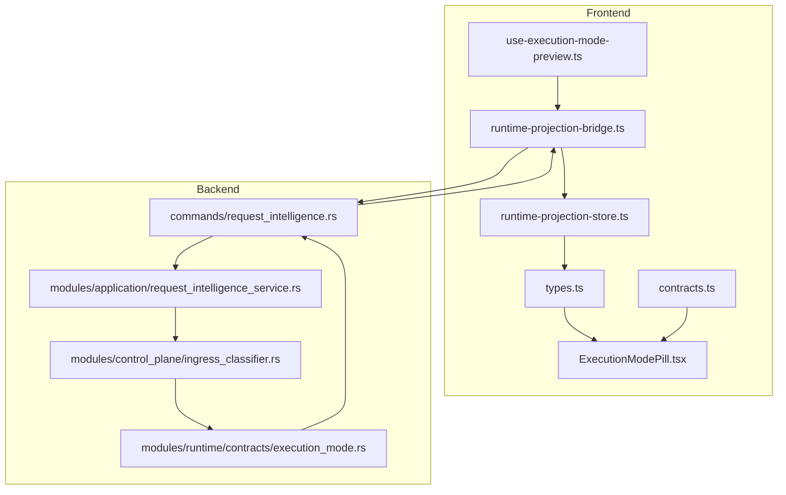
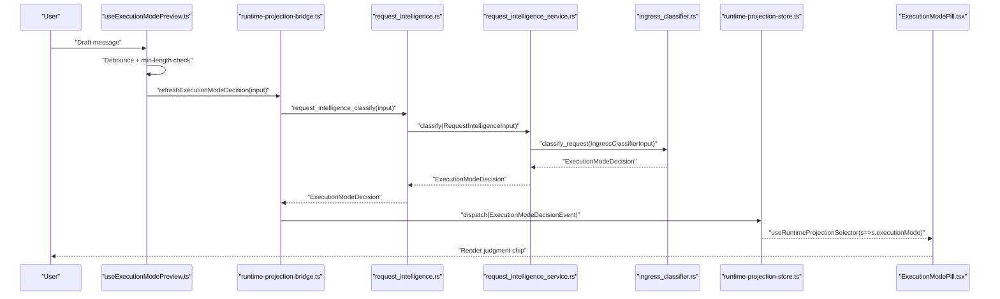
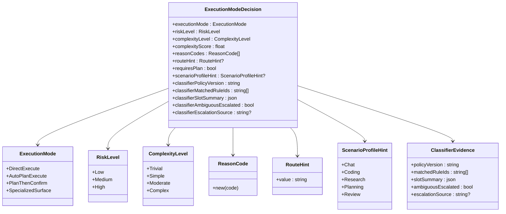
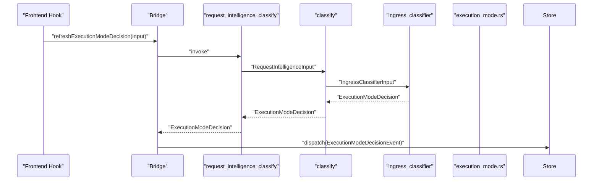
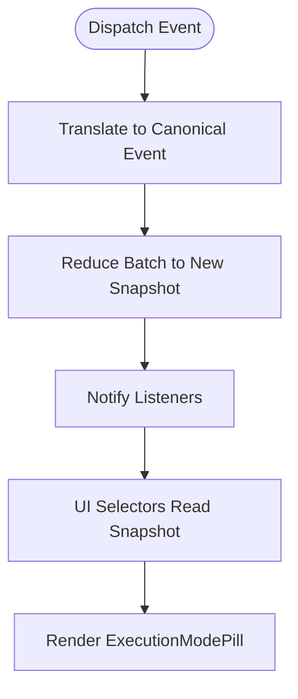
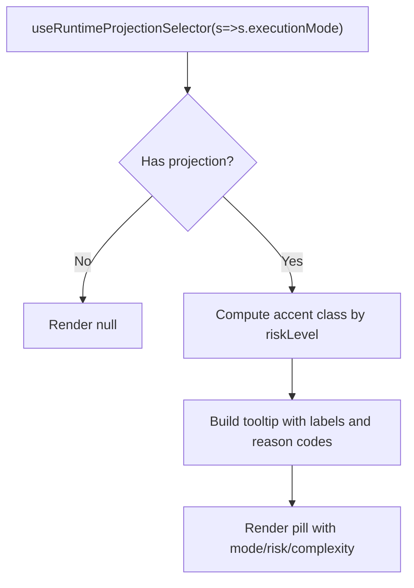
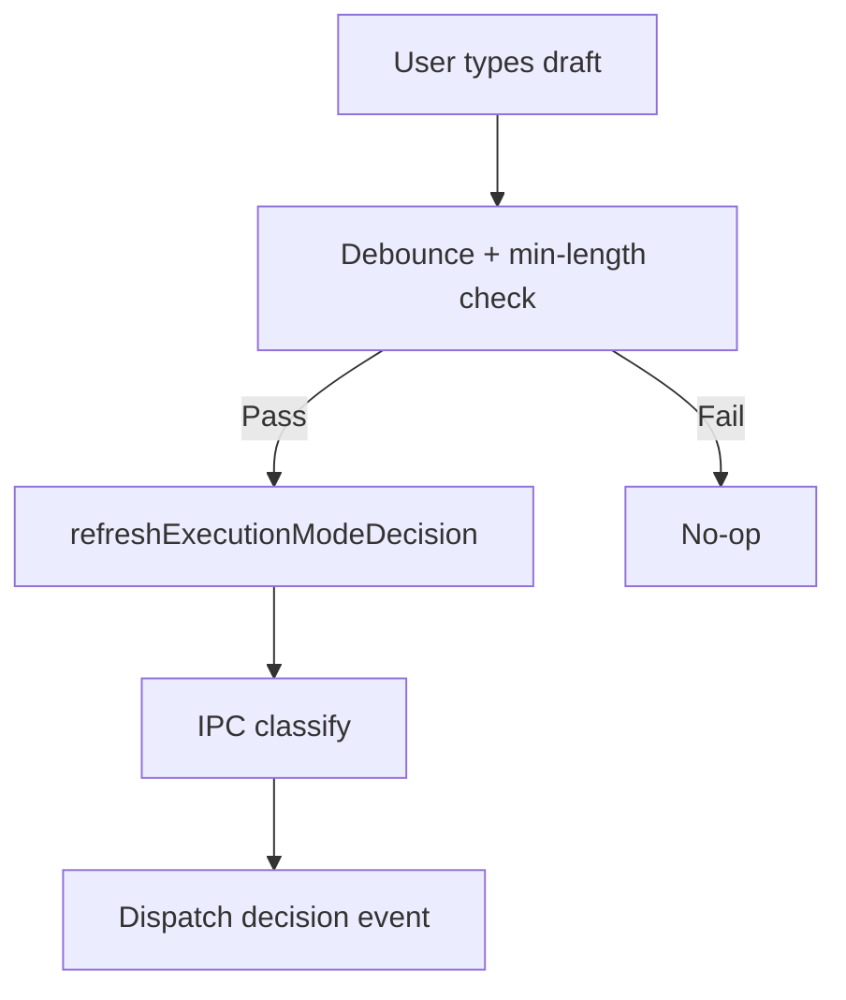
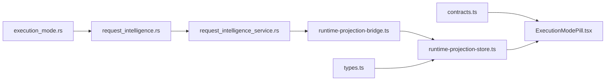

# Execution Mode Routing

<cite>
**Referenced Files in This Document**
- [ExecutionModePill.tsx](file://src/modules/execution-mode/ExecutionModePill.tsx)
- [use-execution-mode-preview.ts](file://src/runtime-projection/use-execution-mode-preview.ts)
- [execution_mode.rs](file://src-tauri/src/modules/runtime/contracts/execution_mode.rs)
- [request_intelligence.rs](file://src-tauri/src/commands/request_intelligence.rs)
- [request_intelligence_service.rs](file://src-tauri/src/modules/application/request_intelligence_service.rs)
- [types.ts](file://src/runtime-projection/types.ts)
- [runtime-projection-store.ts](file://src/runtime-projection/runtime-projection-store.ts)
- [runtime-projection-bridge.ts](file://src/runtime-projection/runtime-projection-bridge.ts)
- [contracts.ts](file://src/transport/contracts.ts)
</cite>

## Table of Contents
1. [Introduction](#introduction)
2. [Project Structure](#project-structure)
3. [Core Components](#core-components)
4. [Architecture Overview](#architecture-overview)
5. [Detailed Component Analysis](#detailed-component-analysis)
6. [Dependency Analysis](#dependency-analysis)
7. [Performance Considerations](#performance-considerations)
8. [Troubleshooting Guide](#troubleshooting-guide)
9. [Conclusion](#conclusion)

## Introduction
This document explains the execution mode routing and request intelligence processing pipeline. It covers how incoming user requests are classified into execution modes, how routing decisions are projected to the UI, and how policy and context influence mode selection. It also documents the deterministic classifier, the advisory nature of routing decisions, and the mechanisms for previewing and projecting execution mode judgments without altering the agent’s execution path.

## Project Structure
The execution mode routing spans both frontend and backend layers:
- Frontend runtime projection pipeline: event translation, store, and UI projection.
- Backend request intelligence service: deterministic classification and advisory decision emission.
- IPC bridge: frontend bridge to backend commands and event translation.

**Diagram sources**
- [ExecutionModePill.tsx:1-106](file://src/modules/execution-mode/ExecutionModePill.tsx#L1-L106)
- [use-execution-mode-preview.ts:1-87](file://src/runtime-projection/use-execution-mode-preview.ts#L1-L87)
- [runtime-projection-bridge.ts:1-253](file://src/runtime-projection/runtime-projection-bridge.ts#L1-L253)
- [runtime-projection-store.ts:1-134](file://src/runtime-projection/runtime-projection-store.ts#L1-L134)
- [types.ts:1-454](file://src/runtime-projection/types.ts#L1-L454)
- [contracts.ts:1-539](file://src/transport/contracts.ts#L1-L539)
- [request_intelligence.rs:1-90](file://src-tauri/src/commands/request_intelligence.rs#L1-L90)
- [request_intelligence_service.rs:1-81](file://src-tauri/src/modules/application/request_intelligence_service.rs#L1-L81)
- [execution_mode.rs:1-253](file://src-tauri/src/modules/runtime/contracts/execution_mode.rs#L1-L253)

**Section sources**
- [ExecutionModePill.tsx:1-106](file://src/modules/execution-mode/ExecutionModePill.tsx#L1-L106)
- [use-execution-mode-preview.ts:1-87](file://src/runtime-projection/use-execution-mode-preview.ts#L1-L87)
- [runtime-projection-bridge.ts:1-253](file://src/runtime-projection/runtime-projection-bridge.ts#L1-L253)
- [runtime-projection-store.ts:1-134](file://src/runtime-projection/runtime-projection-store.ts#L1-L134)
- [types.ts:1-454](file://src/runtime-projection/types.ts#L1-L454)
- [contracts.ts:1-539](file://src/transport/contracts.ts#L1-L539)
- [request_intelligence.rs:1-90](file://src-tauri/src/commands/request_intelligence.rs#L1-L90)
- [request_intelligence_service.rs:1-81](file://src-tauri/src/modules/application/request_intelligence_service.rs#L1-L81)
- [execution_mode.rs:1-253](file://src-tauri/src/modules/runtime/contracts/execution_mode.rs#L1-L253)

## Core Components
- Execution mode taxonomy and decision contract: defines the closed set of execution modes, risk/complexity taxonomy, and explainability fields.
- Request intelligence service: deterministic classification wrapper around the ingress classifier.
- IPC command: exposes classification to the frontend via a Tauri command.
- Runtime projection pipeline: translates backend decisions into canonical events, stores them, and exposes selectors to the UI.
- UI projection: renders the classifier’s judgment as a non-blocking, advisory “judgment” pill.

Key responsibilities:
- Classifier: deterministic + heuristic classification; advisory-only today.
- IPC: typed, camelCase decision payload mirroring Rust contract.
- Projection: immutable store, event batching, and selector-based UI reads.
- UI: renders judgment with risk/complexity labels; never auto-routes.

**Section sources**
- [execution_mode.rs:29-205](file://src-tauri/src/modules/runtime/contracts/execution_mode.rs#L29-L205)
- [request_intelligence_service.rs:29-61](file://src-tauri/src/modules/application/request_intelligence_service.rs#L29-L61)
- [request_intelligence.rs:36-89](file://src-tauri/src/commands/request_intelligence.rs#L36-L89)
- [types.ts:250-283](file://src/runtime-projection/types.ts#L250-L283)
- [runtime-projection-store.ts:32-125](file://src/runtime-projection/runtime-projection-store.ts#L32-L125)
- [ExecutionModePill.tsx:36-105](file://src/modules/execution-mode/ExecutionModePill.tsx#L36-L105)

## Architecture Overview
The system separates classification from routing. Classification is performed deterministically and is advisory. Routing remains controlled by the agent loop. The frontend receives and projects the classifier’s judgment into a UI chip.

**Diagram sources**
- [use-execution-mode-preview.ts:48-85](file://src/runtime-projection/use-execution-mode-preview.ts#L48-L85)
- [runtime-projection-bridge.ts:237-252](file://src/runtime-projection/runtime-projection-bridge.ts#L237-L252)
- [request_intelligence.rs:61-89](file://src-tauri/src/commands/request_intelligence.rs#L61-L89)
- [request_intelligence_service.rs:50-61](file://src-tauri/src/modules/application/request_intelligence_service.rs#L50-L61)
- [execution_mode.rs:141-205](file://src-tauri/src/modules/runtime/contracts/execution_mode.rs#L141-L205)
- [runtime-projection-store.ts:88-95](file://src/runtime-projection/runtime-projection-store.ts#L88-L95)
- [ExecutionModePill.tsx:64-105](file://src/modules/execution-mode/ExecutionModePill.tsx#L64-L105)

## Detailed Component Analysis

### Execution Mode Taxonomy and Decision Contract
- ExecutionMode: closed set of four modes (direct_execute, auto_plan_execute, plan_then_confirm, specialized_surface).
- RiskLevel and ComplexityLevel: coarse buckets for explainability.
- ExecutionModeDecision: canonical decision shape with reason codes, route hints, scenario profile hints, and classifier evidence fields.
- ClassifierEvidence: stable policy version, matched rule ids, slot summary, and escalation flags.

**Diagram sources**
- [execution_mode.rs:29-205](file://src-tauri/src/modules/runtime/contracts/execution_mode.rs#L29-L205)

**Section sources**
- [execution_mode.rs:29-205](file://src-tauri/src/modules/runtime/contracts/execution_mode.rs#L29-L205)

### Request Intelligence Service and IPC Command
- RequestIntelligenceService: thin wrapper around the ingress classifier, returning a typed ExecutionModeDecision.
- IPC command: request_intelligence_classify converts Tauri-owned inputs to the service’s input, invokes classification, and optionally emits a harness event for tracing.

**Diagram sources**
- [request_intelligence.rs:61-89](file://src-tauri/src/commands/request_intelligence.rs#L61-L89)
- [request_intelligence_service.rs:50-61](file://src-tauri/src/modules/application/request_intelligence_service.rs#L50-L61)
- [execution_mode.rs:141-205](file://src-tauri/src/modules/runtime/contracts/execution_mode.rs#L141-L205)
- [runtime-projection-bridge.ts:237-252](file://src/runtime-projection/runtime-projection-bridge.ts#L237-L252)

**Section sources**
- [request_intelligence.rs:1-90](file://src-tauri/src/commands/request_intelligence.rs#L1-L90)
- [request_intelligence_service.rs:1-81](file://src-tauri/src/modules/application/request_intelligence_service.rs#L1-L81)

### Runtime Projection Pipeline
- Event translation: converts backend payloads into canonical events (ExecutionModeDecisionEvent).
- Immutable store: maintains a single snapshot updated via a reducer; supports batching and listeners.
- Selector-based UI: components read projections via selectors; ExecutionModePill renders the classifier’s judgment.

**Diagram sources**
- [runtime-projection-store.ts:88-95](file://src/runtime-projection/runtime-projection-store.ts#L88-L95)
- [types.ts:250-283](file://src/runtime-projection/types.ts#L250-L283)
- [ExecutionModePill.tsx:64-105](file://src/modules/execution-mode/ExecutionModePill.tsx#L64-L105)

**Section sources**
- [runtime-projection-store.ts:1-134](file://src/runtime-projection/runtime-projection-store.ts#L1-L134)
- [types.ts:1-454](file://src/runtime-projection/types.ts#L1-L454)
- [ExecutionModePill.tsx:1-106](file://src/modules/execution-mode/ExecutionModePill.tsx#L1-L106)

### UI Projection: Execution Mode Pill
- Renders classifier judgment with risk/complexity labels.
- Honesty: never auto-routes; only shows “judgment,” not “auto-routed.”
- Tooltip includes mode, risk, complexity, policy version, and reason codes.

**Diagram sources**
- [ExecutionModePill.tsx:64-105](file://src/modules/execution-mode/ExecutionModePill.tsx#L64-L105)

**Section sources**
- [ExecutionModePill.tsx:1-106](file://src/modules/execution-mode/ExecutionModePill.tsx#L1-L106)

### Preview Hook: useExecutionModePreview
- Watches draft messages, debounces, enforces minimum length, and triggers classification.
- Does not mutate routing; only updates the projection store for UI visibility.

**Diagram sources**
- [use-execution-mode-preview.ts:48-85](file://src/runtime-projection/use-execution-mode-preview.ts#L48-L85)
- [runtime-projection-bridge.ts:237-252](file://src/runtime-projection/runtime-projection-bridge.ts#L237-L252)

**Section sources**
- [use-execution-mode-preview.ts:1-87](file://src/runtime-projection/use-execution-mode-preview.ts#L1-L87)

## Dependency Analysis
- Frontend depends on backend contracts via camelCase TypeScript types and Rust-derived decisions.
- IPC command depends on the request intelligence service and emits a harness event for tracing.
- Runtime projection store depends on event translation and reducer logic.
- UI depends on the projection store and contracts for rendering.

**Diagram sources**
- [contracts.ts:156-218](file://src/transport/contracts.ts#L156-L218)
- [execution_mode.rs:141-205](file://src-tauri/src/modules/runtime/contracts/execution_mode.rs#L141-L205)
- [request_intelligence.rs:61-89](file://src-tauri/src/commands/request_intelligence.rs#L61-L89)
- [request_intelligence_service.rs:50-61](file://src-tauri/src/modules/application/request_intelligence_service.rs#L50-L61)
- [runtime-projection-bridge.ts:237-252](file://src/runtime-projection/runtime-projection-bridge.ts#L237-L252)
- [runtime-projection-store.ts:88-95](file://src/runtime-projection/runtime-projection-store.ts#L88-L95)
- [ExecutionModePill.tsx:64-105](file://src/modules/execution-mode/ExecutionModePill.tsx#L64-L105)
- [types.ts:250-283](file://src/runtime-projection/types.ts#L250-L283)

**Section sources**
- [contracts.ts:1-539](file://src/transport/contracts.ts#L1-L539)
- [execution_mode.rs:1-253](file://src-tauri/src/modules/runtime/contracts/execution_mode.rs#L1-L253)
- [request_intelligence.rs:1-90](file://src-tauri/src/commands/request_intelligence.rs#L1-L90)
- [request_intelligence_service.rs:1-81](file://src-tauri/src/modules/application/request_intelligence_service.rs#L1-L81)
- [runtime-projection-bridge.ts:1-253](file://src/runtime-projection/runtime-projection-bridge.ts#L1-L253)
- [runtime-projection-store.ts:1-134](file://src/runtime-projection/runtime-projection-store.ts#L1-L134)
- [types.ts:1-454](file://src/runtime-projection/types.ts#L1-L454)
- [ExecutionModePill.tsx:1-106](file://src/modules/execution-mode/ExecutionModePill.tsx#L1-L106)

## Performance Considerations
- Debounce and minimum length: the preview hook debounces input and ignores drafts below a threshold to reduce unnecessary classification calls.
- Micro-batching: the runtime projection store batches events via a microtask queue to avoid excessive reducer invocations during high-frequency updates.
- Deterministic classification: classification is total and deterministic, avoiding retries and fallbacks that could increase latency.
- Advisory-only decisions: since routing is not altered by the classifier, the UI can safely preview decisions without impacting the agent loop.

Recommendations:
- Tune debounce and minimum length in the preview hook based on user typing patterns.
- Monitor projection store flush frequency; adjust flush mode in tests if needed.
- Keep the classifier lightweight; avoid heavy IO or model calls in deterministic path.

**Section sources**
- [use-execution-mode-preview.ts:26-85](file://src/runtime-projection/use-execution-mode-preview.ts#L26-L85)
- [runtime-projection-store.ts:56-125](file://src/runtime-projection/runtime-projection-store.ts#L56-L125)
- [request_intelligence_service.rs:49-61](file://src-tauri/src/modules/application/request_intelligence_service.rs#L49-L61)

## Troubleshooting Guide
Common issues and resolutions:
- Classifier errors: the bridge catches and logs errors from the IPC command; the UI remains unaffected. Verify backend IPC registration and service availability.
- No projection updates: ensure the preview hook is invoked with a non-empty draft meeting the minimum length and debounce thresholds.
- UI not rendering: confirm that the projection store has received an ExecutionModeDecisionEvent and that selectors are reading the snapshot correctly.
- Harness tracing: the IPC command emits an ExecutionModeJudged event; verify harness initialization and event bus wiring.

Debugging tips:
- Inspect the projection store snapshot and listener notifications.
- Confirm camelCase decision payload matches TypeScript contracts.
- Validate that the classifier’s policy version and matched rule ids are populated.

**Section sources**
- [runtime-projection-bridge.ts:242-252](file://src/runtime-projection/runtime-projection-bridge.ts#L242-L252)
- [use-execution-mode-preview.ts:66-85](file://src/runtime-projection/use-execution-mode-preview.ts#L66-L85)
- [types.ts:400-423](file://src/runtime-projection/types.ts#L400-L423)
- [contracts.ts:156-218](file://src/transport/contracts.ts#L156-L218)
- [request_intelligence.rs:74-87](file://src-tauri/src/commands/request_intelligence.rs#L74-L87)

## Conclusion
Execution mode routing is designed to be advisory and deterministic. The classifier evaluates user intent and context, producing a canonical decision that the frontend projects as a judgment chip. Routing remains unchanged by the classifier, ensuring stability while providing transparency and explainability. The runtime projection pipeline guarantees immutable state updates and efficient UI rendering, with performance optimized through debouncing, batching, and deterministic classification.