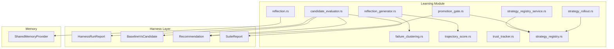
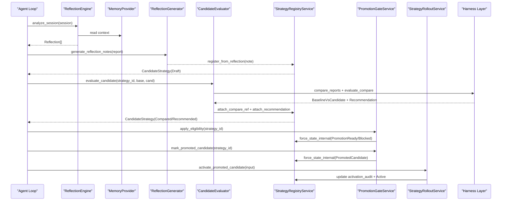
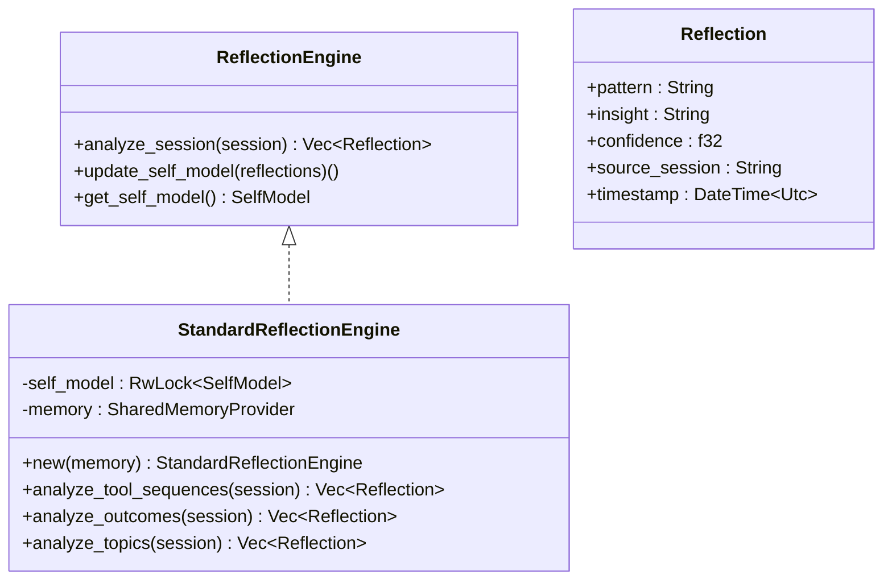
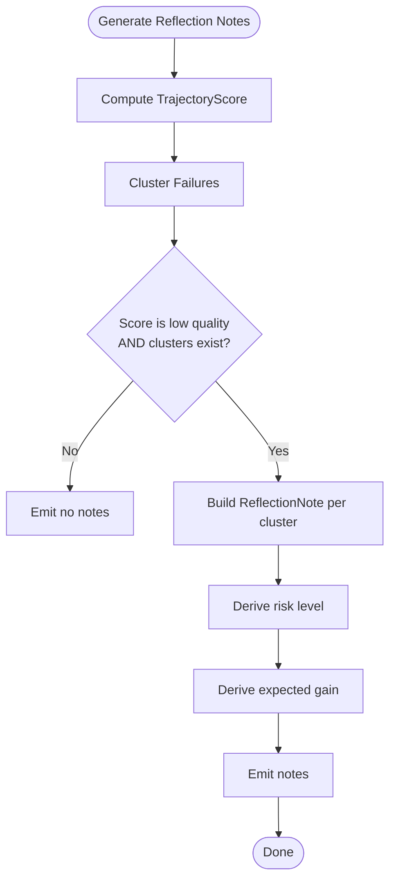
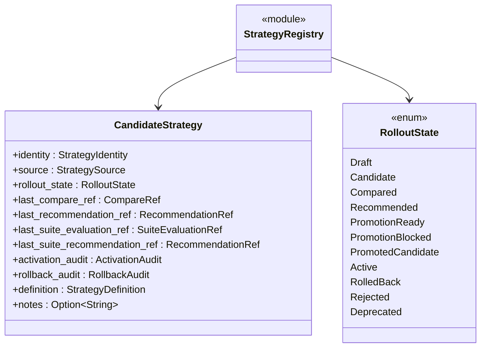
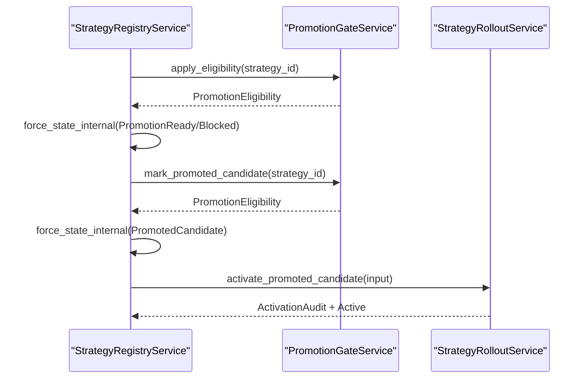
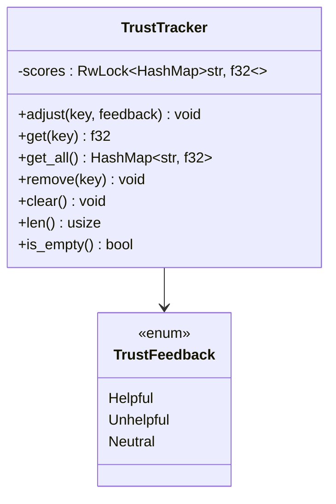
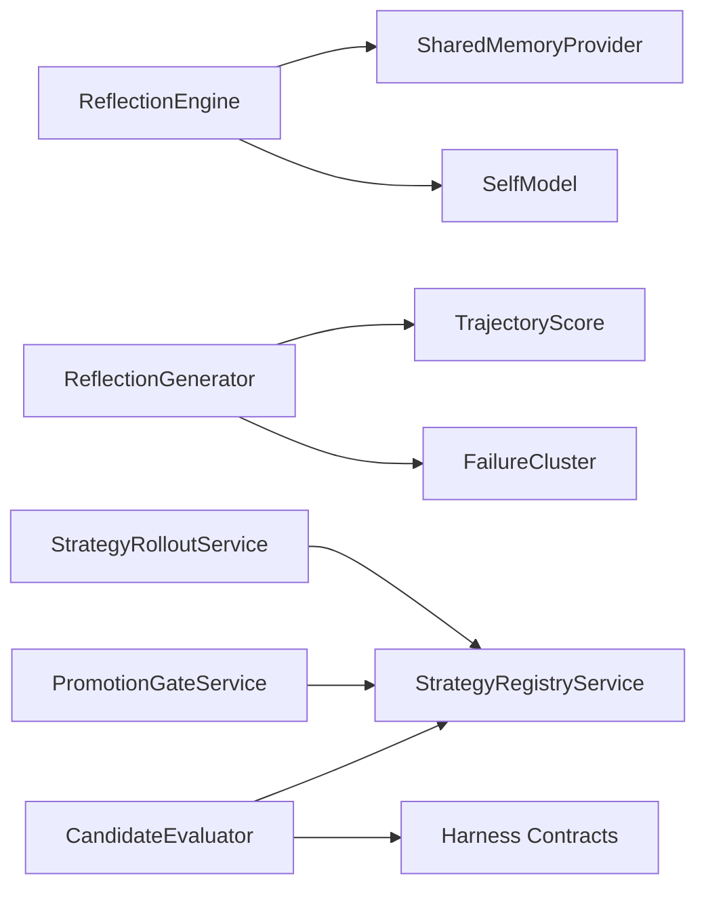

# Self-Learning System

<cite>
**Referenced Files in This Document**
- [reflection.rs](file://src-tauri/src/modules/learning/reflection.rs)
- [reflection_generator.rs](file://src-tauri/src/modules/learning/reflection_generator.rs)
- [failure_clustering.rs](file://src-tauri/src/modules/learning/failure_clustering.rs)
- [trajectory_score.rs](file://src-tauri/src/modules/learning/trajectory_score.rs)
- [trust_tracker.rs](file://src-tauri/src/modules/learning/trust_tracker.rs)
- [strategy_registry.rs](file://src-tauri/src/modules/learning/strategy_registry.rs)
- [strategy_registry_service.rs](file://src-tauri/src/modules/learning/strategy_registry_service.rs)
- [candidate_evaluator.rs](file://src-tauri/src/modules/learning/candidate_evaluator.rs)
- [promotion_gate.rs](file://src-tauri/src/modules/learning/promotion_gate.rs)
- [strategy_rollout.rs](file://src-tauri/src/modules/learning/strategy_rollout.rs)
- [mod.rs](file://src-tauri/src/modules/learning/mod.rs)
- [phase-m5-trajectory-failure-and-reflection-file-level-plan.md](file://docs/_legacy/exec-plans/active/phase-m5-trajectory-failure-and-reflection-file-level-plan.md)
</cite>

## Table of Contents
1. [Introduction](#introduction)
2. [Project Structure](#project-structure)
3. [Core Components](#core-components)
4. [Architecture Overview](#architecture-overview)
5. [Detailed Component Analysis](#detailed-component-analysis)
6. [Dependency Analysis](#dependency-analysis)
7. [Performance Considerations](#performance-considerations)
8. [Troubleshooting Guide](#troubleshooting-guide)
9. [Conclusion](#conclusion)
10. [Appendices](#appendices)

## Introduction
This document describes the self-learning system that powers autonomous improvement in the agent loop. It covers reflection engines that analyze sessions and update a self-model, failure analysis pipelines that cluster and classify regressions, and strategy registries that manage candidate strategies through evaluation, promotion gates, and rollout services. It also documents the trust tracking system for agent reliability assessment, along with practical examples of self-improvement workflows, evaluation metrics, and learning progression patterns.

## Project Structure
The self-learning system is implemented primarily in Rust under the learning module. It integrates with the harness layer for run reports and governance decisions, and with the memory subsystem for session context.

**Diagram sources**
- [reflection.rs:1-391](file://src-tauri/src/modules/learning/reflection.rs#L1-L391)
- [reflection_generator.rs:1-250](file://src-tauri/src/modules/learning/reflection_generator.rs#L1-L250)
- [failure_clustering.rs:1-236](file://src-tauri/src/modules/learning/failure_clustering.rs#L1-L236)
- [trajectory_score.rs:29-125](file://src-tauri/src/modules/learning/trajectory_score.rs#L29-L125)
- [trust_tracker.rs:1-202](file://src-tauri/src/modules/learning/trust_tracker.rs#L1-L202)
- [strategy_registry.rs:1-847](file://src-tauri/src/modules/learning/strategy_registry.rs#L1-L847)
- [strategy_registry_service.rs:1-948](file://src-tauri/src/modules/learning/strategy_registry_service.rs#L1-L948)
- [candidate_evaluator.rs:1-967](file://src-tauri/src/modules/learning/candidate_evaluator.rs#L1-L967)
- [promotion_gate.rs:1-825](file://src-tauri/src/modules/learning/promotion_gate.rs#L1-L825)
- [strategy_rollout.rs:51-82](file://src-tauri/src/modules/learning/strategy_rollout.rs#L51-L82)

**Section sources**
- [mod.rs:1-27](file://src-tauri/src/modules/learning/mod.rs#L1-L27)

## Core Components
- Reflection Engine: Analyzes sessions to extract patterns and updates a self-model with learned patterns.
- Reflection Generator: Produces structured ReflectionNotes from run reports, trajectory scores, and failure clusters.
- Failure Clustering: Aggregates blocking failures into typed clusters for diagnosis.
- Trajectory Scoring: Computes composite scores across axes (completion, recovery, tool quality, memory alignment, governance).
- Trust Tracker: Maintains per-entry trust scores influenced by user feedback for retrieval weighting.
- Strategy Registry: Manages candidate strategies through states (Draft, Candidate, Compared, Recommended, PromotionReady, PromotionBlocked, PromotedCandidate, Active, RolledBack, Rejected, Deprecated).
- Candidate Evaluator: Orchestrates evaluation against baseline and candidate runs, and optionally suite evaluations.
- Promotion Gate: Applies eligibility rules to allow candidates to proceed to promotion markers.
- Strategy Rollout: Manages activation and rollback of strategies with typed audit trails.

**Section sources**
- [reflection.rs:40-225](file://src-tauri/src/modules/learning/reflection.rs#L40-L225)
- [reflection_generator.rs:67-139](file://src-tauri/src/modules/learning/reflection_generator.rs#L67-L139)
- [failure_clustering.rs:85-146](file://src-tauri/src/modules/learning/failure_clustering.rs#L85-L146)
- [trajectory_score.rs:101-125](file://src-tauri/src/modules/learning/trajectory_score.rs#L101-L125)
- [trust_tracker.rs:32-92](file://src-tauri/src/modules/learning/trust_tracker.rs#L32-L92)
- [strategy_registry.rs:117-194](file://src-tauri/src/modules/learning/strategy_registry.rs#L117-L194)
- [strategy_registry_service.rs:131-563](file://src-tauri/src/modules/learning/strategy_registry_service.rs#L131-L563)
- [candidate_evaluator.rs:311-428](file://src-tauri/src/modules/learning/candidate_evaluator.rs#L311-L428)
- [promotion_gate.rs:191-298](file://src-tauri/src/modules/learning/promotion_gate.rs#L191-L298)
- [strategy_rollout.rs:73-82](file://src-tauri/src/modules/learning/strategy_rollout.rs#L73-L82)

## Architecture Overview
The self-learning system follows a structured pipeline:
- Sessions are reflected into insights and self-model updates.
- Run reports are scored and failures are clustered.
- ReflectionNotes are generated and registered as candidates.
- Candidates are evaluated against baselines and suites.
- Promotion gates determine readiness; rollout services manage activation and rollback.

**Diagram sources**
- [reflection.rs:180-225](file://src-tauri/src/modules/learning/reflection.rs#L180-L225)
- [reflection_generator.rs:67-85](file://src-tauri/src/modules/learning/reflection_generator.rs#L67-L85)
- [strategy_registry_service.rs:148-182](file://src-tauri/src/modules/learning/strategy_registry_service.rs#L148-L182)
- [candidate_evaluator.rs:333-428](file://src-tauri/src/modules/learning/candidate_evaluator.rs#L333-L428)
- [promotion_gate.rs:450-556](file://src-tauri/src/modules/learning/promotion_gate.rs#L450-L556)
- [strategy_rollout.rs:73-82](file://src-tauri/src/modules/learning/strategy_rollout.rs#L73-L82)

## Detailed Component Analysis

### Reflection Engine
The reflection engine analyzes tool sequences, outcomes, and topics from sessions to generate patterns and update a self-model with learned patterns. It reads from a shared memory provider but does not modify it.

**Diagram sources**
- [reflection.rs:40-60](file://src-tauri/src/modules/learning/reflection.rs#L40-L60)
- [reflection.rs:53-60](file://src-tauri/src/modules/learning/reflection.rs#L53-L60)
- [reflection.rs:25-38](file://src-tauri/src/modules/learning/reflection.rs#L25-L38)
- [reflection.rs:179-225](file://src-tauri/src/modules/learning/reflection.rs#L179-L225)

**Section sources**
- [reflection.rs:71-176](file://src-tauri/src/modules/learning/reflection.rs#L71-L176)
- [reflection.rs:191-225](file://src-tauri/src/modules/learning/reflection.rs#L191-L225)

### Reflection Generation and Failure Analysis
Structured reflection generation consumes run reports, computes trajectory scores, and clusters failures to produce ReflectionNotes. The trigger policy emits notes when trajectory quality is low and failure clusters exist.

**Diagram sources**
- [reflection_generator.rs:67-85](file://src-tauri/src/modules/learning/reflection_generator.rs#L67-L85)
- [trajectory_score.rs:101-125](file://src-tauri/src/modules/learning/trajectory_score.rs#L101-L125)
- [failure_clustering.rs:85-146](file://src-tauri/src/modules/learning/failure_clustering.rs#L85-L146)

**Section sources**
- [reflection_generator.rs:67-139](file://src-tauri/src/modules/learning/reflection_generator.rs#L67-L139)
- [failure_clustering.rs:85-146](file://src-tauri/src/modules/learning/failure_clustering.rs#L85-L146)
- [trajectory_score.rs:101-125](file://src-tauri/src/modules/learning/trajectory_score.rs#L101-L125)

### Strategy Registry Management
The strategy registry defines states and references for candidate strategies, supports registration from reflection notes, and maintains typed audit trails for activation and rollback.

**Diagram sources**
- [strategy_registry.rs:555-658](file://src-tauri/src/modules/learning/strategy_registry.rs#L555-L658)
- [strategy_registry.rs:117-194](file://src-tauri/src/modules/learning/strategy_registry.rs#L117-L194)

**Section sources**
- [strategy_registry.rs:555-658](file://src-tauri/src/modules/learning/strategy_registry.rs#L555-L658)
- [strategy_registry.rs:117-194](file://src-tauri/src/modules/learning/strategy_registry.rs#L117-L194)

### Rollout Services and Promotion Gates
Rollout services enforce singleton-active policy and maintain typed audit chains. Promotion gates apply eligibility rules across compare-pair and suite tracks, producing readiness decisions.

**Diagram sources**
- [strategy_registry_service.rs:502-523](file://src-tauri/src/modules/learning/strategy_registry_service.rs#L502-L523)
- [promotion_gate.rs:450-556](file://src-tauri/src/modules/learning/promotion_gate.rs#L450-L556)
- [strategy_rollout.rs:73-82](file://src-tauri/src/modules/learning/strategy_rollout.rs#L73-L82)

**Section sources**
- [strategy_rollout.rs:73-82](file://src-tauri/src/modules/learning/strategy_rollout.rs#L73-L82)
- [promotion_gate.rs:191-298](file://src-tauri/src/modules/learning/promotion_gate.rs#L191-L298)
- [strategy_registry_service.rs:502-523](file://src-tauri/src/modules/learning/strategy_registry_service.rs#L502-L523)

### Trust Tracking System
The trust tracker maintains per-key trust scores in [-1.0, 1.0] and adjusts them based on user feedback (Helpful, Unhelpful, Neutral). It is used by retrieval to weight results by trustworthiness.

**Diagram sources**
- [trust_tracker.rs:32-92](file://src-tauri/src/modules/learning/trust_tracker.rs#L32-L92)
- [trust_tracker.rs:17-23](file://src-tauri/src/modules/learning/trust_tracker.rs#L17-L23)

**Section sources**
- [trust_tracker.rs:32-92](file://src-tauri/src/modules/learning/trust_tracker.rs#L32-L92)

## Dependency Analysis
The learning module composes several subsystems:
- Reflection engine depends on memory provider and session data.
- Reflection generator depends on trajectory scoring and failure clustering.
- Strategy registry service orchestrates persistence and state transitions.
- Candidate evaluator composes harness contracts for evaluation.
- Promotion gate and rollout services depend on registry state and typed audits.

**Diagram sources**
- [reflection.rs:1-391](file://src-tauri/src/modules/learning/reflection.rs#L1-L391)
- [reflection_generator.rs:1-250](file://src-tauri/src/modules/learning/reflection_generator.rs#L1-L250)
- [strategy_registry_service.rs:1-948](file://src-tauri/src/modules/learning/strategy_registry_service.rs#L1-L948)
- [candidate_evaluator.rs:1-967](file://src-tauri/src/modules/learning/candidate_evaluator.rs#L1-L967)
- [promotion_gate.rs:1-825](file://src-tauri/src/modules/learning/promotion_gate.rs#L1-L825)
- [strategy_rollout.rs:51-82](file://src-tauri/src/modules/learning/strategy_rollout.rs#L51-L82)

**Section sources**
- [mod.rs:1-27](file://src-tauri/src/modules/learning/mod.rs#L1-L27)

## Performance Considerations
- Reflection computation is O(n) over tool sequences and outcomes within a session.
- Failure clustering aggregates failures across reports with O(f log c) complexity per report (f failures, c categories).
- Trajectory scoring is linear in the number of axes and constant-time per axis.
- Registry operations are file-based with atomic renames for idempotency and retry safety.
- Trust tracker operations are O(1) per adjustment with bounded memory growth proportional to unique keys.

## Troubleshooting Guide
Common issues and diagnostics:
- Reflection generation emits no notes when trajectory is not low quality or when no failure clusters exist.
- Candidate evaluator StepFailed indicates which pipeline step failed; use inspect_evaluation_progress to resume safely.
- Promotion gate Blocked reason codes indicate missing compare refs, stale recommendations, or non-promote decisions.
- Strategy registry service InvalidInput errors occur for empty IDs or terminal states when attempting mutations.
- Trust tracker adjustments clamp scores to [-1.0, 1.0] and accumulate feedback over time.

**Section sources**
- [reflection_generator.rs:160-168](file://src-tauri/src/modules/learning/reflection_generator.rs#L160-L168)
- [candidate_evaluator.rs:142-171](file://src-tauri/src/modules/learning/candidate_evaluator.rs#L142-L171)
- [candidate_evaluator.rs:576-606](file://src-tauri/src/modules/learning/candidate_evaluator.rs#L576-L606)
- [promotion_gate.rs:127-143](file://src-tauri/src/modules/learning/promotion_gate.rs#L127-L143)
- [strategy_registry_service.rs:54-66](file://src-tauri/src/modules/learning/strategy_registry_service.rs#L54-L66)
- [trust_tracker.rs:135-159](file://src-tauri/src/modules/learning/trust_tracker.rs#L135-L159)

## Conclusion
The self-learning system integrates reflection, failure analysis, and strategy management to enable autonomous improvement. It provides structured pipelines for generating actionable insights, evaluating candidates against governance rules, gating promotions, and managing rollout with typed audits. The trust tracking system further enhances reliability by weighting memory recall based on user feedback.

## Appendices

### Self-Improvement Workflows
- Session Reflection: Analyze session, update self-model, and generate ReflectionNotes.
- Candidate Registration: Register ReflectionNotes as Draft candidates.
- Evaluation Pipeline: Compare baseline vs candidate, attach recommendation, and record suite evaluations.
- Promotion Gate: Apply eligibility rules across compare-pair and suite tracks.
- Rollout Activation: Enforce singleton-active policy and maintain activation/rollback audits.

**Section sources**
- [reflection.rs:180-225](file://src-tauri/src/modules/learning/reflection.rs#L180-L225)
- [strategy_registry_service.rs:148-182](file://src-tauri/src/modules/learning/strategy_registry_service.rs#L148-L182)
- [candidate_evaluator.rs:333-428](file://src-tauri/src/modules/learning/candidate_evaluator.rs#L333-L428)
- [promotion_gate.rs:208-298](file://src-tauri/src/modules/learning/promotion_gate.rs#L208-L298)
- [strategy_rollout.rs:63-71](file://src-tauri/src/modules/learning/strategy_rollout.rs#L63-L71)

### Strategy Evaluation Metrics
- Trajectory Score: Composite score ∈ [0.0, 1.0] with axes (completion, recovery quality, tool quality, memory alignment, governance signal).
- Failure Clustering: Counts and severity of clustered failure signatures.
- Recommendation: Gate decision (promote/hold/reject) with reason codes and policy ID.
- Suite Evaluation: Grade and regression counts for suite-level assessments.

**Section sources**
- [trajectory_score.rs:101-125](file://src-tauri/src/modules/learning/trajectory_score.rs#L101-L125)
- [failure_clustering.rs:63-71](file://src-tauri/src/modules/learning/failure_clustering.rs#L63-L71)
- [strategy_registry_service.rs:345-370](file://src-tauri/src/modules/learning/strategy_registry_service.rs#L345-L370)
- [candidate_evaluator.rs:457-574](file://src-tauri/src/modules/learning/candidate_evaluator.rs#L457-L574)

### Learning Progression Patterns
- M5 trajectory scoring and failure clustering form the foundation for structured reflection notes.
- Reflection notes are registered as candidates and evaluated against governance.
- Promotion gates determine readiness; rollout services manage activation and rollback.
- Trust tracking improves retrieval reliability over time.

**Section sources**
- [phase-m5-trajectory-failure-and-reflection-file-level-plan.md:101-127](file://docs/_legacy/exec-plans/active/phase-m5-trajectory-failure-and-reflection-file-level-plan.md#L101-L127)
- [reflection_generator.rs:13-34](file://src-tauri/src/modules/learning/reflection_generator.rs#L13-L34)
- [strategy_registry.rs:81-89](file://src-tauri/src/modules/learning/strategy_registry.rs#L81-L89)
- [trust_tracker.rs:25-34](file://src-tauri/src/modules/learning/trust_tracker.rs#L25-L34)