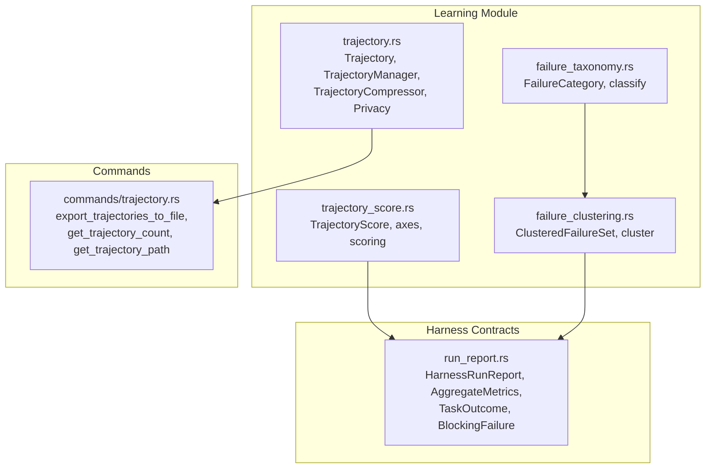
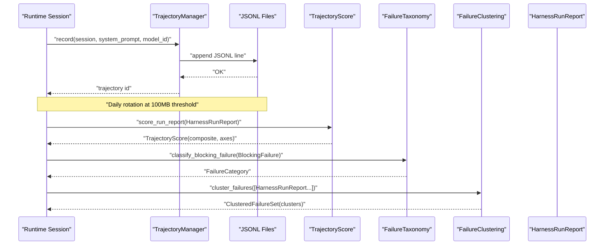
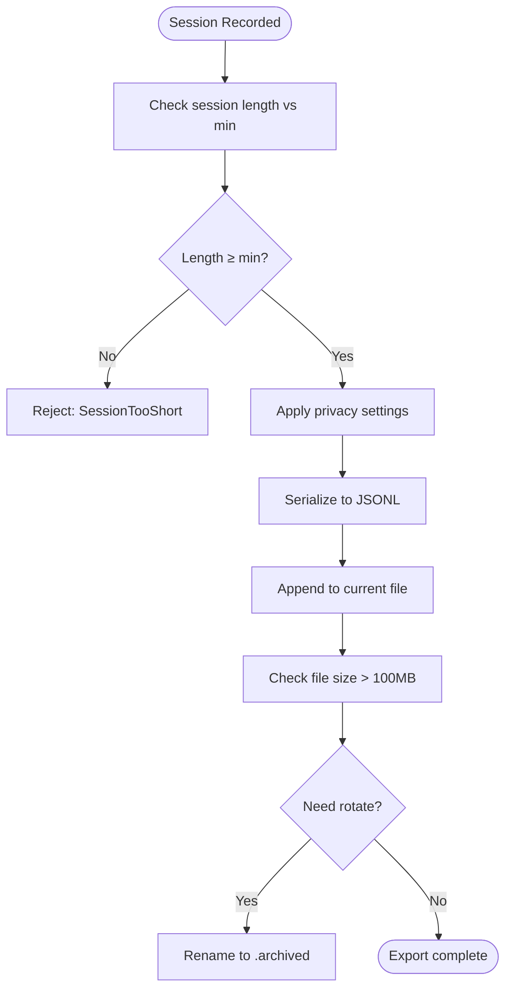
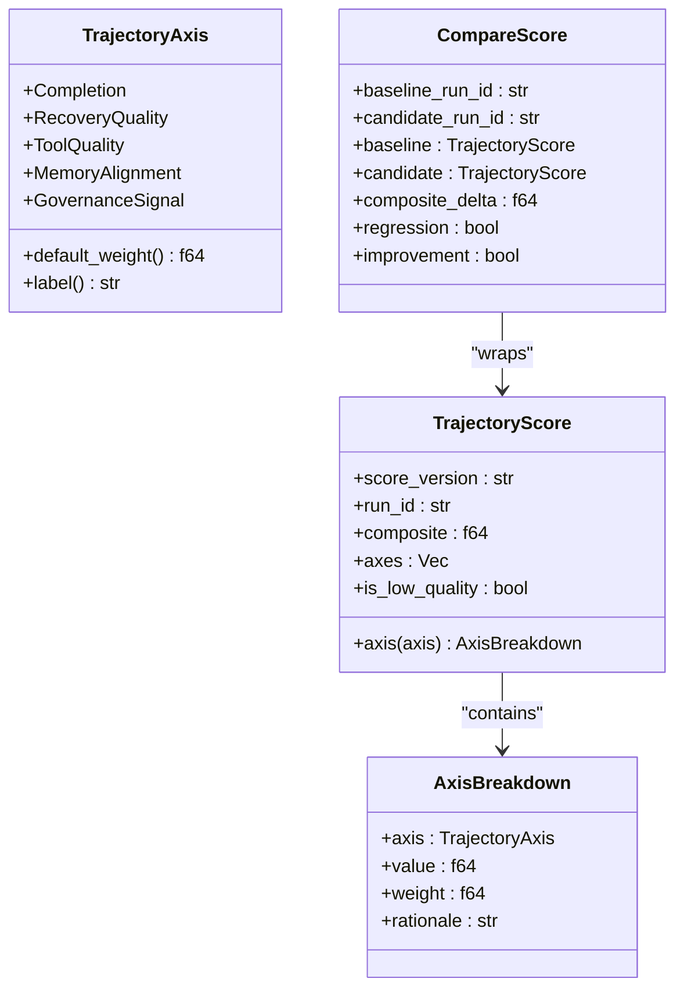
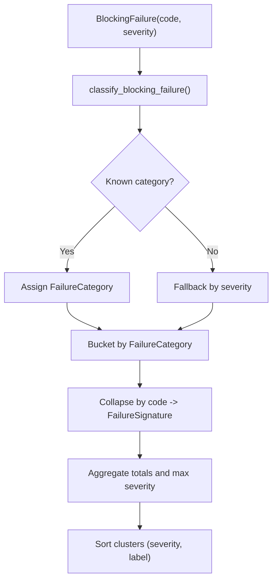
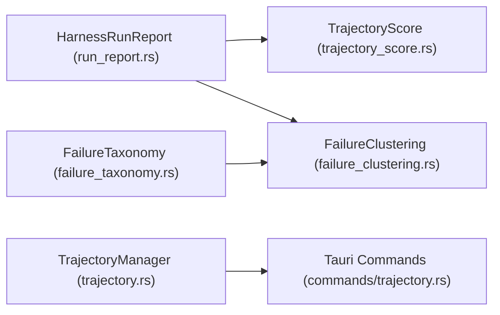

# Trajectory Planning

<cite>
**Referenced Files in This Document**
- [trajectory.rs](file://src-tauri/src/modules/learning/trajectory.rs)
- [trajectory_score.rs](file://src-tauri/src/modules/learning/trajectory_score.rs)
- [failure_taxonomy.rs](file://src-tauri/src/modules/learning/failure_taxonomy.rs)
- [failure_clustering.rs](file://src-tauri/src/modules/learning/failure_clustering.rs)
- [mod.rs](file://src-tauri/src/modules/learning/mod.rs)
- [run_report.rs](file://src-tauri/src/modules/harness/run_report.rs)
- [trajectory.rs (commands)](file://src-tauri/src/modules/commands/trajectory.rs)
- [phase-m5-trajectory-failure-and-reflection-file-level-plan.md](file://docs/_legacy/exec-plans/active/phase-m5-trajectory-failure-and-reflection-file-level-plan.md)
</cite>

## Table of Contents
1. [Introduction](#introduction)
2. [Project Structure](#project-structure)
3. [Core Components](#core-components)
4. [Architecture Overview](#architecture-overview)
5. [Detailed Component Analysis](#detailed-component-analysis)
6. [Dependency Analysis](#dependency-analysis)
7. [Performance Considerations](#performance-considerations)
8. [Troubleshooting Guide](#troubleshooting-guide)
9. [Conclusion](#conclusion)
10. [Appendices](#appendices)

## Introduction
This document describes the trajectory planning and execution tracking system in the repository. It covers how trajectories are created, exported, and managed; how they are scored and compared; how failures are categorized and clustered; and how these outputs support reflection and self-improvement. It also provides practical workflows, scoring calculations, failure analysis processes, and guidance for optimization and debugging.

## Project Structure
The trajectory system spans Rust modules under the learning domain and integrates with the harness run report types. Key areas:
- Trajectory capture and export: ShareGPT-like JSONL export with privacy controls and compression
- Scoring: Five-axis composite score aligned with governance and outcomes
- Failure taxonomy and clustering: Typed categorization and aggregation across runs
- Commands: Frontend-facing Tauri commands to export and inspect trajectory data
- Harness contracts: Run report types that supply inputs for scoring and clustering

**Diagram sources**
- [trajectory.rs:1-610](file://src-tauri/src/modules/learning/trajectory.rs#L1-L610)
- [trajectory_score.rs:1-398](file://src-tauri/src/modules/learning/trajectory_score.rs#L1-L398)
- [failure_taxonomy.rs:1-159](file://src-tauri/src/modules/learning/failure_taxonomy.rs#L1-L159)
- [failure_clustering.rs:1-236](file://src-tauri/src/modules/learning/failure_clustering.rs#L1-L236)
- [run_report.rs:1-423](file://src-tauri/src/modules/harness/run_report.rs#L1-L423)
- [trajectory.rs (commands):1-58](file://src-tauri/src/modules/commands/trajectory.rs#L1-L58)

**Section sources**
- [trajectory.rs:1-610](file://src-tauri/src/modules/learning/trajectory.rs#L1-L610)
- [trajectory_score.rs:1-398](file://src-tauri/src/modules/learning/trajectory_score.rs#L1-L398)
- [failure_taxonomy.rs:1-159](file://src-tauri/src/modules/learning/failure_taxonomy.rs#L1-L159)
- [failure_clustering.rs:1-236](file://src-tauri/src/modules/learning/failure_clustering.rs#L1-L236)
- [run_report.rs:1-423](file://src-tauri/src/modules/harness/run_report.rs#L1-L423)
- [trajectory.rs (commands):1-58](file://src-tauri/src/modules/commands/trajectory.rs#L1-L58)
- [mod.rs:1-153](file://src-tauri/src/modules/learning/mod.rs#L1-L153)

## Core Components
- Trajectory capture and export
  - Converts runtime sessions to ShareGPT-like JSONL entries
  - Applies privacy controls (include system prompt, anonymize user content, minimum session length)
  - Supports daily rotation and export-all functionality
  - Includes a compressor to filter and truncate long trajectories
- Trajectory scoring
  - Five-axis scoring aligned with governance: Completion, RecoveryQuality, ToolQuality, MemoryAlignment, GovernanceSignal
  - Produces a composite score and per-axis breakdown with rationales
  - Provides compare mode to detect regressions/improvements between baseline and candidate runs
- Failure taxonomy and clustering
  - Categorizes blocking failures into a closed set of FailureCategory
  - Aggregates failures across runs into typed clusters with signatures and severity roll-ups
- Harness run report contracts
  - Defines TaskOutcome, AggregateMetrics, BlockingFailure, and the full HarnessRunReport used as inputs for scoring and clustering
- Commands
  - Exposes Tauri commands to export trajectories, count files, and discover the default storage path

**Section sources**
- [trajectory.rs:1-610](file://src-tauri/src/modules/learning/trajectory.rs#L1-L610)
- [trajectory_score.rs:1-398](file://src-tauri/src/modules/learning/trajectory_score.rs#L1-L398)
- [failure_taxonomy.rs:1-159](file://src-tauri/src/modules/learning/failure_taxonomy.rs#L1-L159)
- [failure_clustering.rs:1-236](file://src-tauri/src/modules/learning/failure_clustering.rs#L1-L236)
- [run_report.rs:1-423](file://src-tauri/src/modules/harness/run_report.rs#L1-L423)
- [trajectory.rs (commands):1-58](file://src-tauri/src/modules/commands/trajectory.rs#L1-L58)

## Architecture Overview
The trajectory lifecycle integrates runtime sessions, export, scoring, and failure analysis:

**Diagram sources**
- [trajectory.rs:205-255](file://src-tauri/src/modules/learning/trajectory.rs#L205-L255)
- [trajectory_score.rs:127-166](file://src-tauri/src/modules/learning/trajectory_score.rs#L127-L166)
- [failure_taxonomy.rs:66-110](file://src-tauri/src/modules/learning/failure_taxonomy.rs#L66-L110)
- [failure_clustering.rs:85-146](file://src-tauri/src/modules/learning/failure_clustering.rs#L85-L146)
- [run_report.rs:345-368](file://src-tauri/src/modules/harness/run_report.rs#L345-L368)

## Detailed Component Analysis

### Trajectory Creation and Management
- ShareGPT conversion
  - Filters out system/tool messages; preserves assistant/user text blocks
  - Collects tool names used during the session
- Privacy controls
  - Defaults: exclude system prompt, anonymize user content, require minimum session length, include tool calls
  - Can be customized via TrajectoryPrivacy
- Export and rotation
  - Daily date-based file naming
  - Rotation when file exceeds 100MB; archived files receive timestamp suffix
  - Export-all combines all JSONL entries into a single output
- Compression
  - Filters low-quality trajectories and truncates long ones to a maximum length

**Diagram sources**
- [trajectory.rs:205-255](file://src-tauri/src/modules/learning/trajectory.rs#L205-L255)
- [trajectory.rs:319-351](file://src-tauri/src/modules/learning/trajectory.rs#L319-L351)

**Section sources**
- [trajectory.rs:1-610](file://src-tauri/src/modules/learning/trajectory.rs#L1-L610)

### Trajectory Compression and Privacy Controls
- Privacy defaults
  - include_system_prompt: false
  - anonymize_user_content: true
  - min_session_length: 3
  - include_tool_calls: true
- Compression
  - min_success_rate: 0.0 (accept all by default)
  - max_length: 100 turns
  - Truncates long trajectories to preserve training efficiency

**Section sources**
- [trajectory.rs:125-147](file://src-tauri/src/modules/learning/trajectory.rs#L125-L147)
- [trajectory.rs:362-407](file://src-tauri/src/modules/learning/trajectory.rs#L362-L407)

### Trajectory Scoring Mechanisms
- Axes and weights
  - Completion: 0.60 dominance (primary outcome signal)
  - RecoveryQuality: 0.10 (turn success rate)
  - ToolQuality: 0.10 (tool success ratio)
  - MemoryAlignment: 0.10 (accept/reject/warnings balance)
  - GovernanceSignal: 0.10 (penalty for blocking failures)
- Scoring functions
  - Completion: maps TaskOutcome and last-turn success to a value in [0.0, 1.0]
  - RecoveryQuality: uses AggregateMetrics.turn_success_rate
  - ToolQuality: computes successes/total tool calls
  - MemoryAlignment: rewards acceptance and penalizes rejections/warnings
  - GovernanceSignal: cumulative penalty by severity (Blocking > Warning > Info)
- Composite score
  - Weighted average normalized to [0.0, 1.0]
  - CompareScore exposes baseline/candidate/composite_delta with regression/improvement flags

**Diagram sources**
- [trajectory_score.rs:43-123](file://src-tauri/src/modules/learning/trajectory_score.rs#L43-L123)
- [trajectory_score.rs:168-183](file://src-tauri/src/modules/learning/trajectory_score.rs#L168-L183)

**Section sources**
- [trajectory_score.rs:1-398](file://src-tauri/src/modules/learning/trajectory_score.rs#L1-L398)
- [run_report.rs:121-191](file://src-tauri/src/modules/harness/run_report.rs#L121-L191)

### Failure Clustering and Taxonomy Systems
- Failure taxonomy
  - Closed categories: IntentMiss, PolicyIssue, MemoryIssue, RecoveryIssue, ToolMisuse, Other
  - Classification logic: keyword matching plus severity fallback
- Failure clustering
  - Aggregates BlockingFailure across runs into FailureCluster keyed by FailureCategory
  - Builds FailureSignature with code, max_severity, run_id, occurrences
  - Sorts clusters by max severity and category label

**Diagram sources**
- [failure_taxonomy.rs:66-110](file://src-tauri/src/modules/learning/failure_taxonomy.rs#L66-L110)
- [failure_clustering.rs:85-146](file://src-tauri/src/modules/learning/failure_clustering.rs#L85-L146)

**Section sources**
- [failure_taxonomy.rs:1-159](file://src-tauri/src/modules/learning/failure_taxonomy.rs#L1-L159)
- [failure_clustering.rs:1-236](file://src-tauri/src/modules/learning/failure_clustering.rs#L1-L236)
- [run_report.rs:193-213](file://src-tauri/src/modules/harness/run_report.rs#L193-L213)

### Performance Evaluation and Comparison Systems
- Scoring inputs from HarnessRunReport
  - TaskOutcome and last-turn success for Completion
  - AggregateMetrics for RecoveryQuality, ToolQuality, MemoryAlignment
  - BlockingFailure list for GovernanceSignal
- Compare mode
  - Computes delta between baseline and candidate composite scores
  - Flags regression (delta < -0.05) and improvement (delta > 0.05)

**Section sources**
- [trajectory_score.rs:127-166](file://src-tauri/src/modules/learning/trajectory_score.rs#L127-L166)
- [run_report.rs:345-368](file://src-tauri/src/modules/harness/run_report.rs#L345-L368)

### Examples of Trajectory Workflows
- Export workflow
  - Backend command: export_trajectories_to_file(path)
  - Internally uses TrajectoryManager.export_all to combine JSONL files
- Privacy-aware export
  - TrajectoryManager respects privacy settings before writing
- Failure analysis workflow
  - Collect HarnessRunReport instances
  - Classify failures into FailureCategory
  - Cluster by category and signature
  - Use ClusteredFailureSet for diagnostics and reflection

**Section sources**
- [trajectory.rs (commands):15-31](file://src-tauri/src/modules/commands/trajectory.rs#L15-L31)
- [trajectory.rs:257-293](file://src-tauri/src/modules/learning/trajectory.rs#L257-L293)
- [failure_clustering.rs:85-146](file://src-tauri/src/modules/learning/failure_clustering.rs#L85-L146)

### Failure Analysis Processes
- Classification process
  - Keyword-based mapping for known categories
  - Severity-based fallback for unknowns
- Clustering process
  - Bucket by category
  - Collapse by failure code with occurrence counting
  - Track max severity and representative run_id
  - Stable sorting for reproducibility

**Section sources**
- [failure_taxonomy.rs:66-110](file://src-tauri/src/modules/learning/failure_taxonomy.rs#L66-L110)
- [failure_clustering.rs:85-146](file://src-tauri/src/modules/learning/failure_clustering.rs#L85-L146)

### Trajectory Optimization Techniques
- Reduce noise
  - Increase min_session_length to filter very short runs
  - Enable anonymize_user_content to remove PII
- Improve training data quality
  - Use TrajectoryCompressor to truncate long trajectories
  - Filter by success criteria if available in future iterations
- Optimize export performance
  - Batch export using export_all to minimize filesystem overhead
  - Monitor file sizes and adjust rotation thresholds if needed

**Section sources**
- [trajectory.rs:125-147](file://src-tauri/src/modules/learning/trajectory.rs#L125-L147)
- [trajectory.rs:362-407](file://src-tauri/src/modules/learning/trajectory.rs#L362-L407)
- [trajectory.rs:257-293](file://src-tauri/src/modules/learning/trajectory.rs#L257-L293)

### Debugging Trajectory Issues
- Common issues and checks
  - SessionTooShort: verify min_session_length and session content
  - WriteError/ReadError: confirm file permissions and path validity
  - SerializationError: validate JSONL serialization and encoding
  - Privacy filtering: ensure include_system_prompt and anonymize_user_content align with expectations
- Scoring anomalies
  - Review rationale fields in AxisBreakdown to identify contributing factors
  - Inspect BlockingFailure severity and counts affecting GovernanceSignal
- Clustering discrepancies
  - Confirm classification keywords and severity thresholds
  - Validate that signatures aggregate occurrences correctly

**Section sources**
- [trajectory.rs:149-163](file://src-tauri/src/modules/learning/trajectory.rs#L149-L163)
- [trajectory_score.rs:187-296](file://src-tauri/src/modules/learning/trajectory_score.rs#L187-L296)
- [failure_taxonomy.rs:66-110](file://src-tauri/src/modules/learning/failure_taxonomy.rs#L66-L110)
- [failure_clustering.rs:85-146](file://src-tauri/src/modules/learning/failure_clustering.rs#L85-L146)

## Dependency Analysis
- Internal dependencies
  - TrajectoryManager depends on runtime session types and writes JSONL
  - TrajectoryScore consumes HarnessRunReport and AggregateMetrics
  - FailureClustering consumes BlockingFailure and uses FailureTaxonomy
- External integration points
  - Tauri commands expose trajectory export and inspection to the frontend
  - Harness contracts define the canonical report shape for scoring and clustering

**Diagram sources**
- [run_report.rs:345-368](file://src-tauri/src/modules/harness/run_report.rs#L345-L368)
- [trajectory_score.rs:127-166](file://src-tauri/src/modules/learning/trajectory_score.rs#L127-L166)
- [failure_clustering.rs:85-146](file://src-tauri/src/modules/learning/failure_clustering.rs#L85-L146)
- [trajectory.rs:205-255](file://src-tauri/src/modules/learning/trajectory.rs#L205-L255)
- [trajectory.rs (commands):15-31](file://src-tauri/src/modules/commands/trajectory.rs#L15-L31)

**Section sources**
- [mod.rs:25-92](file://src-tauri/src/modules/learning/mod.rs#L25-L92)
- [run_report.rs:1-423](file://src-tauri/src/modules/harness/run_report.rs#L1-L423)
- [trajectory_score.rs:1-398](file://src-tauri/src/modules/learning/trajectory_score.rs#L1-L398)
- [failure_taxonomy.rs:1-159](file://src-tauri/src/modules/learning/failure_taxonomy.rs#L1-L159)
- [failure_clustering.rs:1-236](file://src-tauri/src/modules/learning/failure_clustering.rs#L1-L236)
- [trajectory.rs:1-610](file://src-tauri/src/modules/learning/trajectory.rs#L1-L610)
- [trajectory.rs (commands):1-58](file://src-tauri/src/modules/commands/trajectory.rs#L1-L58)

## Performance Considerations
- File I/O
  - Daily rotation at 100MB prevents large single files; consider monitoring and alerting on rotation frequency
- Scoring
  - Pure compute; axis computations are O(1) per report; keep input sets bounded for batch comparisons
- Clustering
  - Aggregation is linear in number of failures; maintain stable ordering for deterministic outputs
- Export
  - export_all reads and concatenates files; ensure sufficient disk space and avoid concurrent writes

## Troubleshooting Guide
- Trajectory export fails
  - Check output path parent directory existence and permissions
  - Verify TrajectoryManager initialization and error propagation
- Privacy settings unexpected
  - Confirm TrajectoryPrivacy defaults and overrides
  - Validate that system prompts and user content are filtered as intended
- Scoring appears incorrect
  - Inspect AxisBreakdown rationales for each axis
  - Reconcile TaskOutcome and AggregateMetrics values
- Clustering yields empty results
  - Ensure BlockingFailure list is populated in reports
  - Verify classification keywords and severity thresholds

**Section sources**
- [trajectory.rs (commands):15-31](file://src-tauri/src/modules/commands/trajectory.rs#L15-L31)
- [trajectory.rs:149-163](file://src-tauri/src/modules/learning/trajectory.rs#L149-L163)
- [trajectory_score.rs:187-296](file://src-tauri/src/modules/learning/trajectory_score.rs#L187-L296)
- [failure_clustering.rs:85-146](file://src-tauri/src/modules/learning/failure_clustering.rs#L85-L146)

## Conclusion
The trajectory system provides a robust foundation for capturing agent interactions, evaluating performance via a governance-aligned scoring model, and analyzing failures through taxonomy and clustering. Together with privacy controls and compression, it enables safe, efficient, and actionable data for reflection and self-improvement.

## Appendices
- Implementation plan alignment
  - The documented phases and milestones reflect the planned evolution of trajectory scoring, failure taxonomy, and clustering, ensuring stable contracts and deterministic pipelines

**Section sources**
- [phase-m5-trajectory-failure-and-reflection-file-level-plan.md:56-194](file://docs/_legacy/exec-plans/active/phase-m5-trajectory-failure-and-reflection-file-level-plan.md#L56-L194)