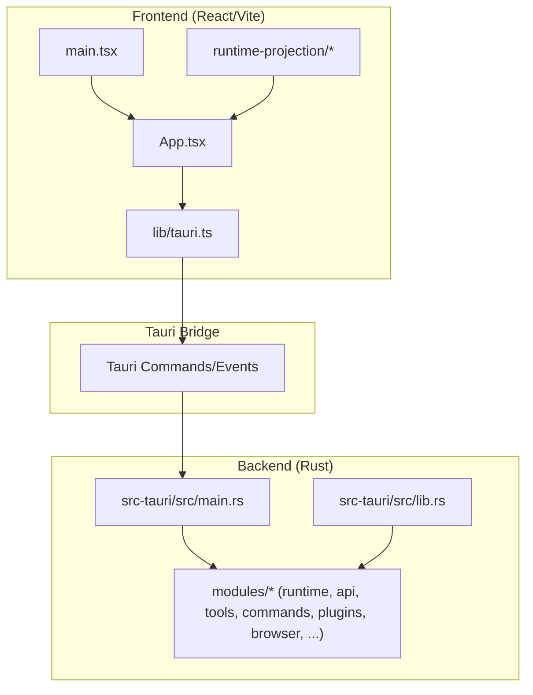
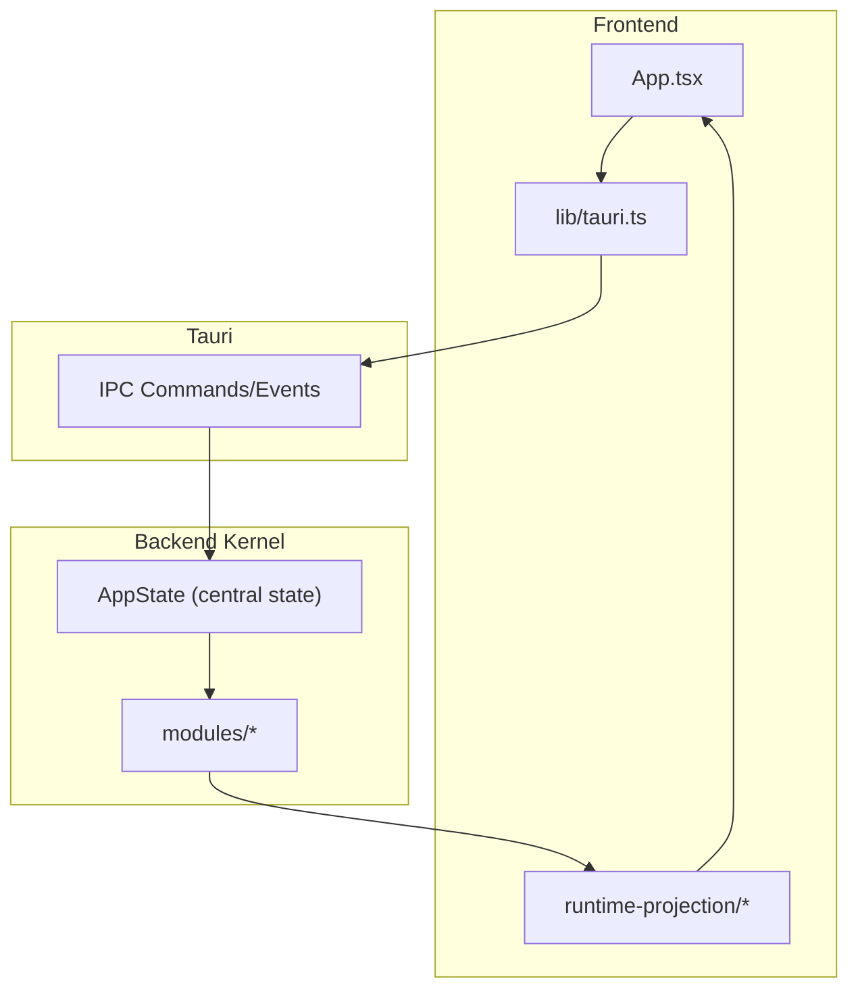
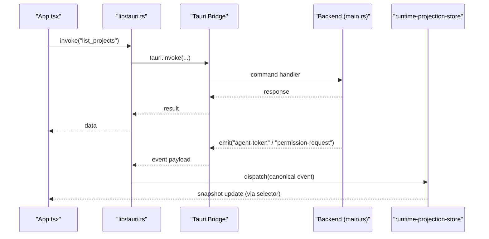
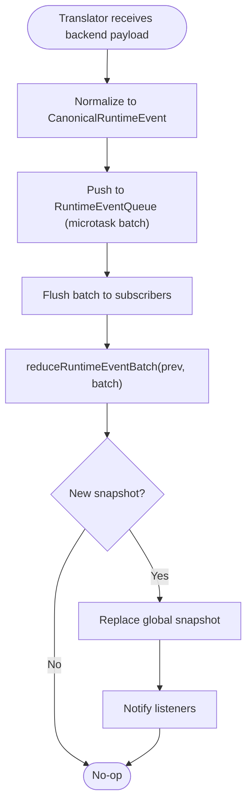
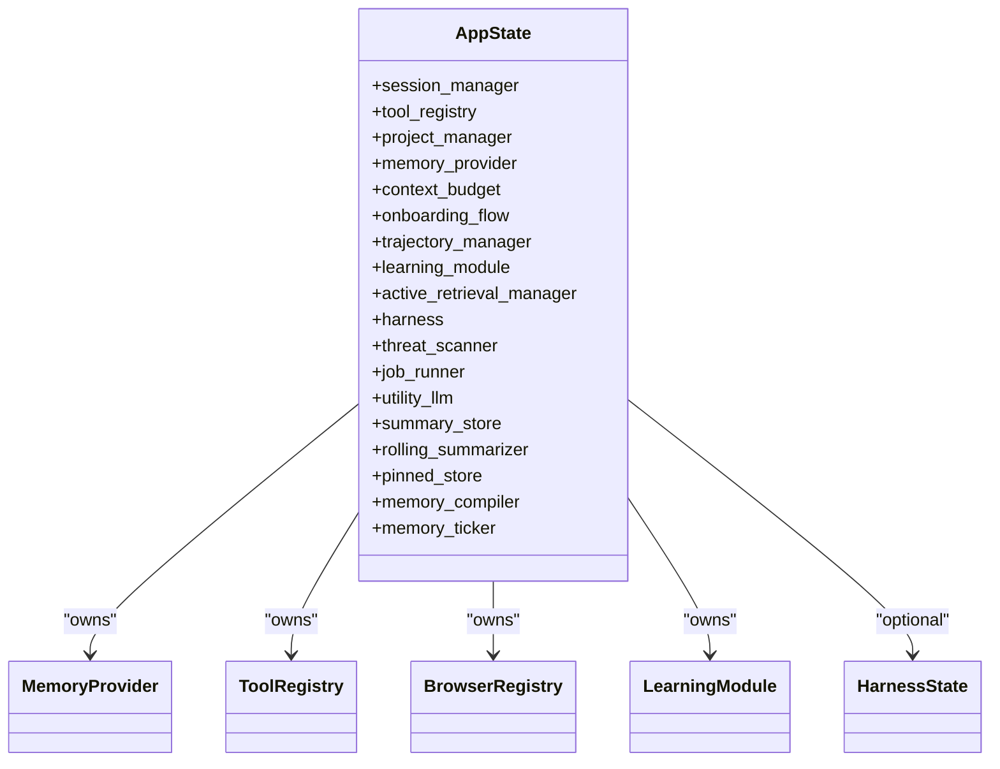
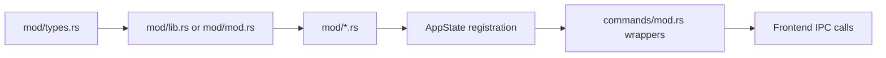
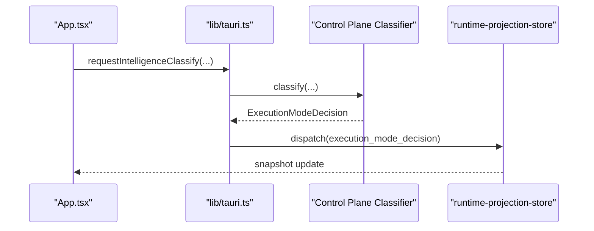
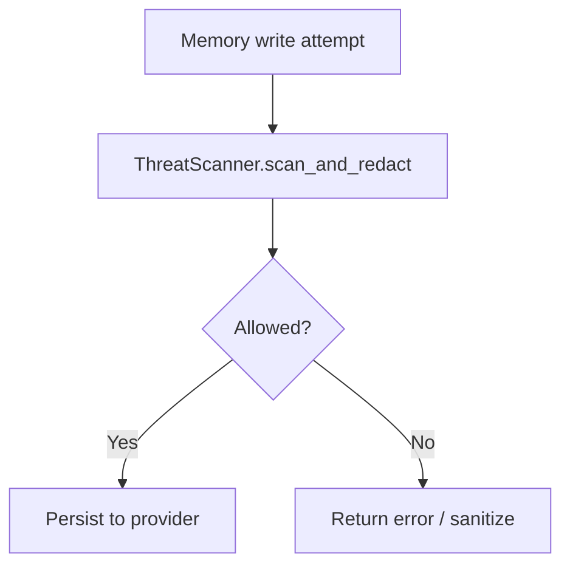
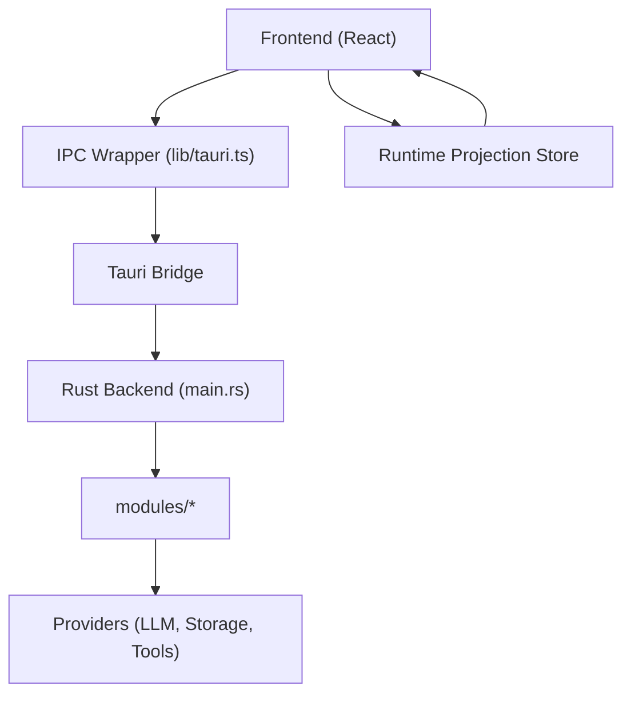
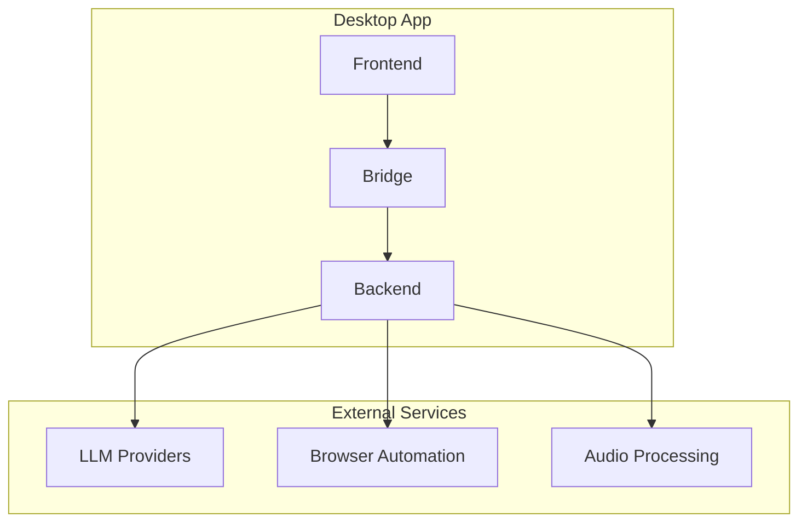

# Architecture & Design

<cite>
**Referenced Files in This Document**
- [DESIGN.md](file://DESIGN.md)
- [Cargo.toml](file://rust/Cargo.toml)
- [package.json](file://package.json)
- [main.tsx](file://src/main.tsx)
- [App.tsx](file://src/App.tsx)
- [tauri.ts](file://src/lib/tauri.ts)
- [lib.rs](file://src-tauri/src/lib.rs)
- [main.rs](file://src-tauri/src/main.rs)
- [types.ts](file://src/runtime-projection/types.ts)
- [runtime-projection-store.ts](file://src/runtime-projection/runtime-projection-store.ts)
- [runtime-event-translator.ts](file://src/runtime-projection/runtime-event-translator.ts)
- [runtime-event-reducer.ts](file://src/runtime-projection/runtime-event-reducer.ts)
- [runtime-event-queue.ts](file://src/runtime-projection/runtime-event-queue.ts)
- [module-boundaries-and-integration.md](file://docs/design-docs/module-boundaries-and-integration.md)
- [ADR-006-Security-Design.md](file://docs/design-docs/postCLI/ADR/ADR-006-Security-Design.md)
- [ingress_classifier.rs](file://src-tauri/src/modules/control_plane/ingress_classifier.rs)
- [graders.rs](file://src-tauri/src/modules/harness/graders.rs)
</cite>

## Table of Contents
1. [Introduction](#introduction)
2. [Project Structure](#project-structure)
3. [Core Components](#core-components)
4. [Architecture Overview](#architecture-overview)
5. [Detailed Component Analysis](#detailed-component-analysis)
6. [Dependency Analysis](#dependency-analysis)
7. [Performance Considerations](#performance-considerations)
8. [Troubleshooting Guide](#troubleshooting-guide)
9. [Conclusion](#conclusion)
10. [Appendices](#appendices)

## Introduction
This document describes the architectural design of If2Ai, focusing on the layered system integrating a React frontend, a Tauri IPC bridge, and a Rust backend. It explains the microkernel-style orchestration with pluggable modules, the event-driven runtime projection pipeline, and the integration points with external services such as LLM providers, browser automation, and audio processing. It also documents design principles, architectural constraints, and cross-cutting concerns including security, performance, and scalability.

## Project Structure
The project follows a unified Rust workspace with a React + Tauri desktop application. The frontend is a Vite/React application that communicates with the Rust backend via Tauri commands and events. The Rust backend organizes functionality into modular domains (runtime, API, tools, commands, plugins, browser) and exposes Tauri commands for the frontend.

**Diagram sources**
- [main.tsx:1-44](file://src/main.tsx#L1-L44)
- [App.tsx:1-120](file://src/App.tsx#L1-L120)
- [tauri.ts:1-120](file://src/lib/tauri.ts#L1-L120)
- [lib.rs:1-23](file://src-tauri/src/lib.rs#L1-L23)
- [main.rs:1-120](file://src-tauri/src/main.rs#L1-L120)

**Section sources**
- [package.json:1-85](file://package.json#L1-L85)
- [Cargo.toml:1-24](file://rust/Cargo.toml#L1-L24)
- [main.tsx:1-44](file://src/main.tsx#L1-L44)
- [lib.rs:1-23](file://src-tauri/src/lib.rs#L1-L23)

## Core Components
- React Frontend: Renders UI surfaces, manages application state, and invokes Tauri commands via a typed IPC wrapper.
- Tauri IPC Layer: Provides typed command invocations and event subscriptions, decoupling frontend from backend internals.
- Rust Backend: Implements a modular runtime with pluggable modules (API clients, tools, browser control, memory, learning, TTS), orchestrated by a central state container and command handlers.

Key architectural constraints and design principles include:
- Strict layered architecture (Types → Config → Repo → Providers → Service → Runtime → UI) with enforced directionality.
- Provider injection for external dependencies (LLM, storage, tools) to enable testability and flexibility.
- Structured logging and error handling.
- Asynchronous-first I/O with async/await.
- Event-driven runtime projection pipeline for reactive UI updates.

**Section sources**
- [DESIGN.md:37-138](file://DESIGN.md#L37-L138)
- [DESIGN.md:175-280](file://DESIGN.md#L175-L280)

## Architecture Overview
The system employs a microkernel-style orchestration:
- Central AppState aggregates shared services (memory, tools, browser registry, learning, trajectory manager, harness, etc.).
- Modules encapsulate domain-specific functionality and are registered during application bootstrap.
- Tauri commands expose module APIs to the frontend while preserving internal boundaries.
- The runtime projection pipeline transforms backend events into a canonical, immutable snapshot consumed by React components.

**Diagram sources**
- [main.rs:406-782](file://src-tauri/src/main.rs#L406-L782)
- [tauri.ts:1-120](file://src/lib/tauri.ts#L1-L120)
- [runtime-projection-store.ts:1-134](file://src/runtime-projection/runtime-projection-store.ts#L1-L134)

**Section sources**
- [main.rs:406-782](file://src-tauri/src/main.rs#L406-L782)
- [lib.rs:6-23](file://src-tauri/src/lib.rs#L6-L23)

## Detailed Component Analysis

### React Frontend and Tauri IPC Layer
- App.tsx orchestrates application boot, onboarding checks, project/session loading, and runtime projection wiring.
- lib/tauri.ts provides a typed façade over Tauri commands and event listeners, enabling centralized IPC logic and transport contract re-exports.
- main.tsx initializes the React tree and selects the appropriate root component based on URL parameters (e.g., settings, browser viewer, loading screen).

**Diagram sources**
- [App.tsx:100-197](file://src/App.tsx#L100-L197)
- [tauri.ts:200-320](file://src/lib/tauri.ts#L200-L320)
- [runtime-projection-store.ts:66-125](file://src/runtime-projection/runtime-projection-store.ts#L66-L125)

**Section sources**
- [App.tsx:1-200](file://src/App.tsx#L1-L200)
- [tauri.ts:1-120](file://src/lib/tauri.ts#L1-L120)
- [main.tsx:16-44](file://src/main.tsx#L16-L44)

### Runtime Projection Pipeline (Event-Driven Architecture)
The runtime projection pipeline transforms backend events into a canonical, immutable snapshot:
- Translator: Normalizes backend wire payloads into canonical event types.
- Queue: Batches events via micro-tasks to optimize rendering and reduce thrashing.
- Reducer: Pure function mapping previous snapshot + event batch to a new snapshot.
- Store: Global store exposing subscribe/getSnapshot for React and other consumers.

**Diagram sources**
- [runtime-event-translator.ts:45-132](file://src/runtime-projection/runtime-event-translator.ts#L45-L132)
- [runtime-event-queue.ts:1-25](file://src/runtime-projection/runtime-event-queue.ts#L1-L25)
- [runtime-event-reducer.ts:289-300](file://src/runtime-projection/runtime-event-reducer.ts#L289-L300)
- [runtime-projection-store.ts:88-95](file://src/runtime-projection/runtime-projection-store.ts#L88-L95)

**Section sources**
- [types.ts:46-131](file://src/runtime-projection/types.ts#L46-L131)
- [runtime-event-translator.ts:1-132](file://src/runtime-projection/runtime-event-translator.ts#L1-L132)
- [runtime-event-reducer.ts:1-120](file://src/runtime-projection/runtime-event-reducer.ts#L1-L120)
- [runtime-projection-store.ts:1-134](file://src/runtime-projection/runtime-projection-store.ts#L1-L134)

### Backend Microkernel Orchestration
The backend composes a central AppState with shared services:
- Memory infrastructure: hybrid/vector/SQLite providers, job runner, rolling summarizer, compiler, ticker.
- Tools: registry and builtin tool integration.
- Browser: registry and profile modes.
- Learning: trajectory manager and learning module.
- Harness: optional runtime evaluation and tracing.
- Security: single-threaded threat scanner injected across memory write paths.

**Diagram sources**
- [main.rs:501-782](file://src-tauri/src/main.rs#L501-L782)

**Section sources**
- [main.rs:406-782](file://src-tauri/src/main.rs#L406-L782)

### Module Boundaries and Pluggable Services
The system enforces clear module boundaries and a registration pattern:
- Modules define public traits and internal implementations.
- Modules are registered in AppState and exposed via Tauri commands.
- New modules integrate via a prescribed lifecycle: types → public trait → internals → registration → command exposure → tests → documentation.

**Diagram sources**
- [module-boundaries-and-integration.md:804-842](file://docs/design-docs/module-boundaries-and-integration.md#L804-L842)

**Section sources**
- [module-boundaries-and-integration.md:10-85](file://docs/design-docs/module-boundaries-and-integration.md#L10-L85)
- [module-boundaries-and-integration.md:804-842](file://docs/design-docs/module-boundaries-and-integration.md#L804-L842)

### Execution Mode Classification and Governance
Execution mode classification is handled by a control plane classifier that evaluates incoming requests and emits decisions to the runtime projection pipeline. This enables reactive UI surfaces and governance insights.

**Diagram sources**
- [ingress_classifier.rs:192-212](file://src-tauri/src/modules/control_plane/ingress_classifier.rs#L192-L212)
- [runtime-event-translator.ts:261-276](file://src/runtime-projection/runtime-event-translator.ts#L261-L276)

**Section sources**
- [ingress_classifier.rs:192-212](file://src-tauri/src/modules/control_plane/ingress_classifier.rs#L192-L212)
- [runtime-event-translator.ts:244-276](file://src/runtime-projection/runtime-event-translator.ts#L244-L276)

### Security and Threat Scanning
Security is enforced through a centralized threat scanner applied to memory write paths, ensuring content sanitization and limits. This defense-in-depth approach protects user data and system integrity.

**Diagram sources**
- [ADR-006-Security-Design.md:201-259](file://docs/design-docs/postCLI/ADR/ADR-006-Security-Design.md#L201-L259)

**Section sources**
- [ADR-006-Security-Design.md:201-259](file://docs/design-docs/postCLI/ADR/ADR-006-Security-Design.md#L201-L259)

## Dependency Analysis
The system maintains strict layering and dependency discipline:
- Frontend depends on backend via IPC; backend modules depend on shared providers and services.
- Workspace configuration centralizes dependencies and lints.
- CI enforces architectural constraints and quality gates.

**Diagram sources**
- [package.json:17-83](file://package.json#L17-L83)
- [Cargo.toml:11-24](file://rust/Cargo.toml#L11-L24)
- [main.rs:406-782](file://src-tauri/src/main.rs#L406-L782)

**Section sources**
- [package.json:1-85](file://package.json#L1-L85)
- [Cargo.toml:1-24](file://rust/Cargo.toml#L1-L24)
- [DESIGN.md:37-138](file://DESIGN.md#L37-L138)

## Performance Considerations
- Asynchronous-first design ensures non-blocking I/O across the stack.
- Event batching in the runtime projection pipeline minimizes render thrashing.
- Microkernel composition reduces coupling and improves testability and isolation.
- Logging and observability are built-in to support performance monitoring and diagnostics.

[No sources needed since this section provides general guidance]

## Troubleshooting Guide
Common areas to inspect:
- IPC command failures: verify command registration and argument serialization in the IPC wrapper.
- Event delivery issues: confirm event translation and queue flush behavior.
- Memory provider initialization: check fallback logic and error logs for provider selection.
- Harness and evaluation: ensure harness is enabled and traces are written to the configured directory.

**Section sources**
- [tauri.ts:1-120](file://src/lib/tauri.ts#L1-L120)
- [runtime-event-queue.ts:1-25](file://src/runtime-projection/runtime-event-queue.ts#L1-L25)
- [main.rs:242-404](file://src-tauri/src/main.rs#L242-L404)

## Conclusion
If2Ai’s architecture blends a React frontend, a robust Tauri IPC layer, and a modular Rust backend into a cohesive, event-driven system. The microkernel-style orchestration, combined with a canonical runtime projection pipeline, delivers reactive UI updates, strong security guarantees, and scalable integration with external services. Adherence to architectural constraints and continuous quality checks ensures maintainability and reliability.

[No sources needed since this section summarizes without analyzing specific files]

## Appendices

### System Context Diagrams
External integrations include:
- LLM providers: via API module and provider resolution.
- Browser automation: via Chromium-based browser control module.
- Audio processing: via TTS module with provider abstraction.

[No sources needed since this diagram shows conceptual workflow, not actual code structure]