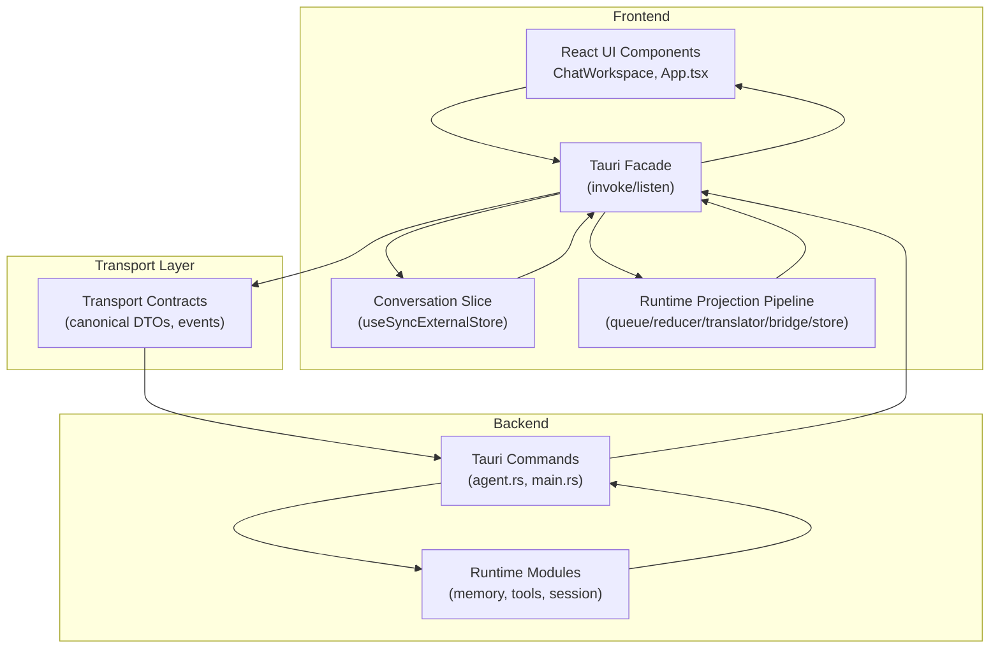
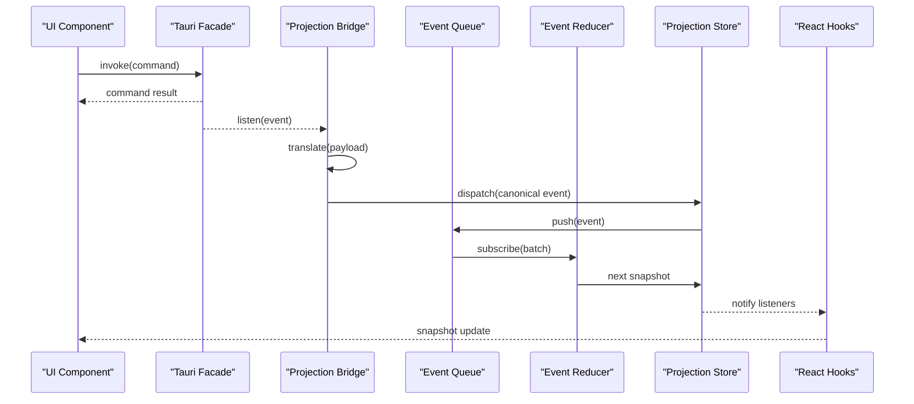
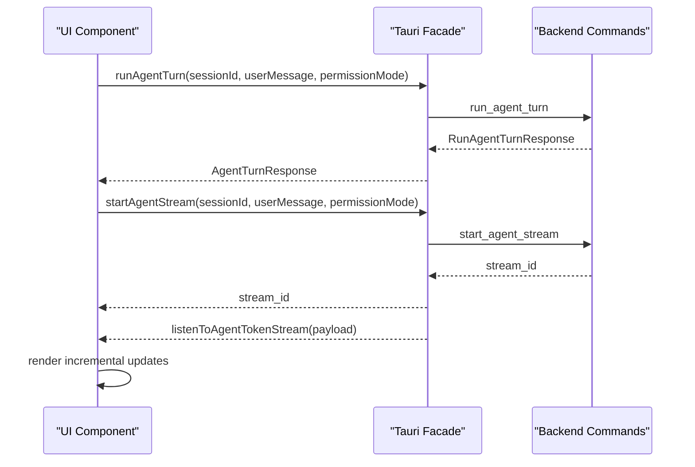
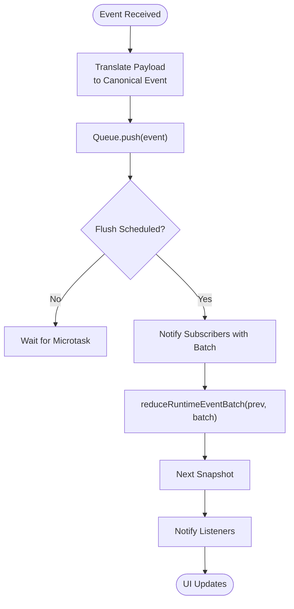
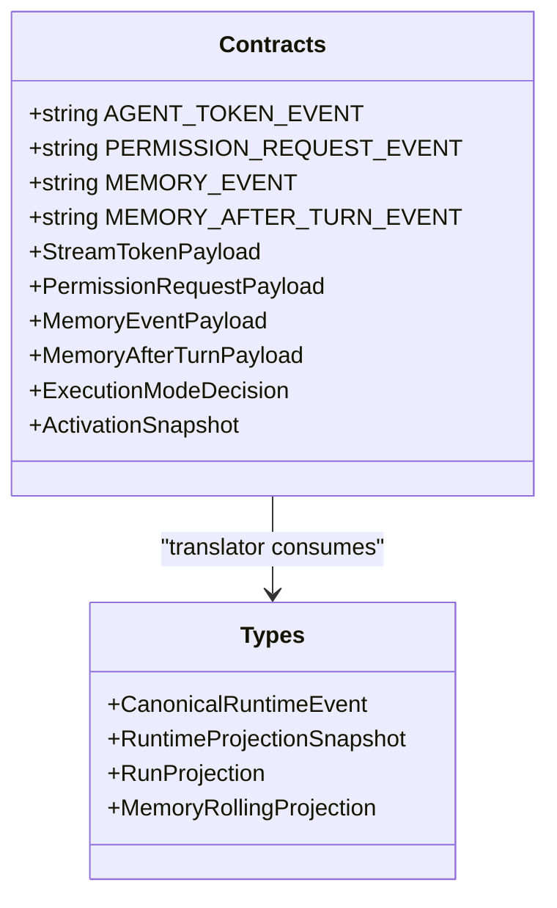
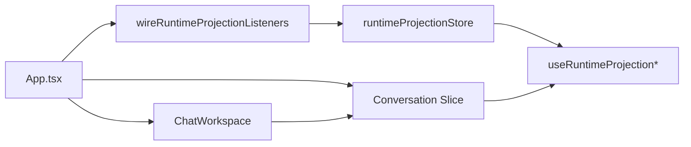
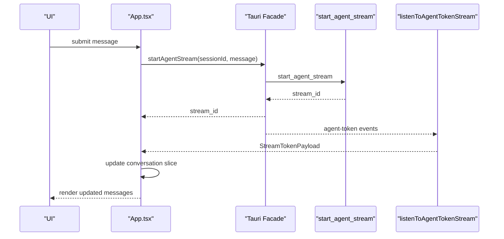
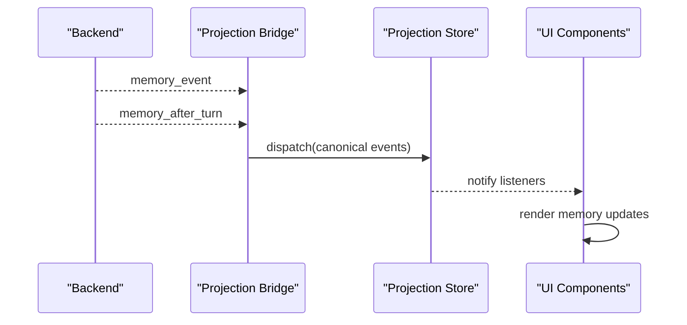
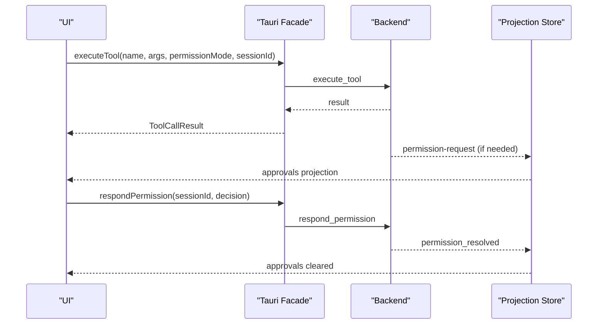
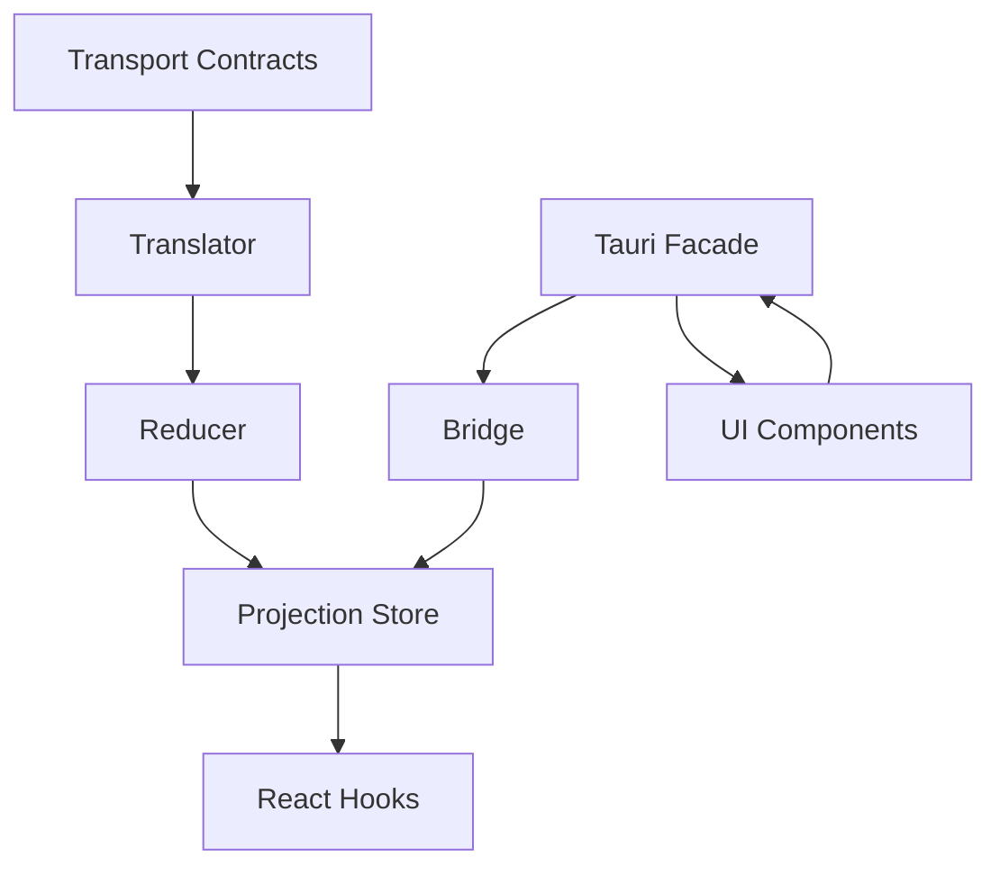

# Component Interaction Patterns

<cite>
**Referenced Files in This Document**
- [src/lib/tauri.ts](file://src/lib/tauri.ts)
- [src/transport/contracts.ts](file://src/transport/contracts.ts)
- [src/runtime-projection/index.ts](file://src/runtime-projection/index.ts)
- [src/runtime-projection/runtime-event-queue.ts](file://src/runtime-projection/runtime-event-queue.ts)
- [src/runtime-projection/runtime-event-reducer.ts](file://src/runtime-projection/runtime-event-reducer.ts)
- [src/runtime-projection/runtime-event-translator.ts](file://src/runtime-projection/runtime-event-translator.ts)
- [src/runtime-projection/runtime-projection-bridge.ts](file://src/runtime-projection/runtime-projection-bridge.ts)
- [src/runtime-projection/runtime-projection-store.ts](file://src/runtime-projection/runtime-projection-store.ts)
- [src/runtime-projection/types.ts](file://src/runtime-projection/types.ts)
- [src/runtime-projection/use-runtime-projection.ts](file://src/runtime-projection/use-runtime-projection.ts)
- [src/runtime-projection/use-execution-mode-preview.ts](file://src/runtime-projection/use-execution-mode-preview.ts)
- [src/App.tsx](file://src/App.tsx)
- [src/modules/chat/components/ChatWorkspace.tsx](file://src/modules/chat/components/ChatWorkspace.tsx)
- [src/stores/conversation-slice.ts](file://src/stores/conversation-slice.ts)
- [src-tauri/src/main.rs](file://src-tauri/src/main.rs)
- [src-tauri/src/commands/agent.rs](file://src-tauri/src/commands/agent.rs)
</cite>

## Table of Contents
1. [Introduction](#introduction)
2. [Project Structure](#project-structure)
3. [Core Components](#core-components)
4. [Architecture Overview](#architecture-overview)
5. [Detailed Component Analysis](#detailed-component-analysis)
6. [Dependency Analysis](#dependency-analysis)
7. [Performance Considerations](#performance-considerations)
8. [Troubleshooting Guide](#troubleshooting-guide)
9. [Conclusion](#conclusion)

## Introduction
This document explains the component interaction patterns in If2Ai’s architecture with a focus on:
- Tauri IPC communication between frontend and backend
- Runtime projection system bridging frontend state with backend services
- Event-driven architecture with reactive updates
- Component boundaries and module interfaces
- Concrete interaction patterns: conversation flow, memory updates, and tool execution coordination
- Transport layer contracts governing data movement across UI, state, and backend services

## Project Structure
If2Ai separates concerns across three layers:
- Frontend (React + TypeScript): UI surfaces, state slices, and the canonical runtime projection pipeline
- Transport Contracts: Shared DTOs and event schemas between frontend and backend
- Backend (Rust + Tauri): Commands, modules, and event emitters

**Diagram sources**
- [src/App.tsx:755-766](file://src/App.tsx#L755-L766)
- [src/lib/tauri.ts:14-35](file://src/lib/tauri.ts#L14-L35)
- [src-tauri/src/main.rs:10-226](file://src-tauri/src/main.rs#L10-L226)
- [src-tauri/src/commands/agent.rs:164-722](file://src-tauri/src/commands/agent.rs#L164-L722)

**Section sources**
- [src/App.tsx:755-766](file://src/App.tsx#L755-L766)
- [src/lib/tauri.ts:14-35](file://src/lib/tauri.ts#L14-L35)
- [src-tauri/src/main.rs:10-226](file://src-tauri/src/main.rs#L10-L226)

## Core Components
- Tauri IPC facade: Thin wrapper around @tauri-apps APIs, exposing typed helpers for commands and listeners
- Transport contracts: Canonical DTOs and event names for memory, permissions, agent tokens, and execution mode
- Runtime projection pipeline: Queue → Translator → Reducer → Store → React hooks
- Bridge: Subscribes to backend events and dispatches canonical events into the projection store
- Conversation slice: Module-level store for per-session conversation state, decoupled from App.tsx

Key responsibilities:
- IPC: Invoke commands, listen to events, and maintain unlisten handles
- Projection: Normalize backend payloads into canonical events, batch and reduce them into immutable snapshots
- UI: React hooks subscribe to projection snapshots and conversation slices for reactive updates

**Section sources**
- [src/lib/tauri.ts:83-107](file://src/lib/tauri.ts#L83-L107)
- [src/transport/contracts.ts:385-397](file://src/transport/contracts.ts#L385-L397)
- [src/runtime-projection/runtime-event-queue.ts:54-123](file://src/runtime-projection/runtime-event-queue.ts#L54-L123)
- [src/runtime-projection/runtime-event-translator.ts:45-132](file://src/runtime-projection/runtime-event-translator.ts#L45-L132)
- [src/runtime-projection/runtime-event-reducer.ts:40-287](file://src/runtime-projection/runtime-event-reducer.ts#L40-L287)
- [src/runtime-projection/runtime-projection-store.ts:66-124](file://src/runtime-projection/runtime-projection-store.ts#L66-L124)
- [src/runtime-projection/runtime-projection-bridge.ts:88-194](file://src/runtime-projection/runtime-projection-bridge.ts#L88-L194)
- [src/stores/conversation-slice.ts:69-156](file://src/stores/conversation-slice.ts#L69-L156)

## Architecture Overview
The runtime projection system is the central event bus that:
- Receives backend events via the Tauri facade
- Normalizes payloads into canonical events
- Batches and reduces events into immutable snapshots
- Exposes snapshots to React via useSyncExternalStore-compatible hooks
- Allows UI components to subscribe to subsets of the snapshot

**Diagram sources**
- [src/runtime-projection/runtime-projection-bridge.ts:117-125](file://src/runtime-projection/runtime-projection-bridge.ts#L117-L125)
- [src/runtime-projection/runtime-event-queue.ts:88-95](file://src/runtime-projection/runtime-event-queue.ts#L88-L95)
- [src/runtime-projection/runtime-event-reducer.ts:291-300](file://src/runtime-projection/runtime-event-reducer.ts#L291-L300)
- [src/runtime-projection/runtime-projection-store.ts:88-95](file://src/runtime-projection/runtime-projection-store.ts#L88-L95)
- [src/runtime-projection/use-runtime-projection.ts:27-50](file://src/runtime-projection/use-runtime-projection.ts#L27-L50)

## Detailed Component Analysis

### Tauri IPC Communication Patterns
- Commands: Typed wrappers around invoke for run_agent_turn, start_agent_stream, memory operations, tool execution, and UI actions
- Listeners: Typed wrappers around listen for agent-token, permission-request, memory_event, and memory_after_turn
- Backpressure and filtering: listenToStream filters by stream_id; listenToAgentTokenStream listens to all agent-token events for the projection pipeline

**Diagram sources**
- [src/lib/tauri.ts:202-231](file://src/lib/tauri.ts#L202-L231)
- [src/lib/tauri.ts:221-231](file://src/lib/tauri.ts#L221-L231)
- [src/lib/tauri.ts:248-265](file://src/lib/tauri.ts#L248-L265)
- [src-tauri/src/commands/agent.rs:164-722](file://src-tauri/src/commands/agent.rs#L164-L722)

**Section sources**
- [src/lib/tauri.ts:202-231](file://src/lib/tauri.ts#L202-L231)
- [src/lib/tauri.ts:248-265](file://src/lib/tauri.ts#L248-L265)
- [src-tauri/src/commands/agent.rs:164-722](file://src-tauri/src/commands/agent.rs#L164-L722)

### Runtime Projection Pipeline
- Queue: Batches events and flushes on microtasks; exposes subscribe, push, flush, reset, and pending
- Translator: Converts backend payloads into canonical events; preserves semantics and returns null for unknown variants
- Reducer: Pure function over canonical events; produces immutable snapshots; maintains rolling rings for memory and approvals
- Store: Global store with useSyncExternalStore wiring; exposes dispatch, queue(), flush(), reset()
- Bridge: Subscribes to three backend event sources; translates and dispatches; supports fetch-based seams for activation and execution-mode decisions

**Diagram sources**
- [src/runtime-projection/runtime-event-queue.ts:54-123](file://src/runtime-projection/runtime-event-queue.ts#L54-L123)
- [src/runtime-projection/runtime-event-translator.ts:45-132](file://src/runtime-projection/runtime-event-translator.ts#L45-L132)
- [src/runtime-projection/runtime-event-reducer.ts:291-300](file://src/runtime-projection/runtime-event-reducer.ts#L291-L300)
- [src/runtime-projection/runtime-projection-store.ts:88-95](file://src/runtime-projection/runtime-projection-store.ts#L88-L95)

**Section sources**
- [src/runtime-projection/runtime-event-queue.ts:54-123](file://src/runtime-projection/runtime-event-queue.ts#L54-L123)
- [src/runtime-projection/runtime-event-translator.ts:45-132](file://src/runtime-projection/runtime-event-translator.ts#L45-L132)
- [src/runtime-projection/runtime-event-reducer.ts:40-287](file://src/runtime-projection/runtime-event-reducer.ts#L40-L287)
- [src/runtime-projection/runtime-projection-store.ts:66-124](file://src/runtime-projection/runtime-projection-store.ts#L66-L124)
- [src/runtime-projection/runtime-projection-bridge.ts:88-194](file://src/runtime-projection/runtime-projection-bridge.ts#L88-L194)

### Transport Layer Contracts
- Event names: agent-token, permission-request, memory_event, memory_after_turn
- Payloads: StreamTokenPayload, PermissionRequestPayload, MemoryEventPayload, MemoryAfterTurnPayload
- Canonical shapes: ExecutionModeDecision, ActivationSnapshot, MemoryWriteDecisionPayload, MemoryContextItem
- Contract versioning: CONTRACTS_SCHEMA_VERSION and schemaVersion markers

**Diagram sources**
- [src/transport/contracts.ts:385-397](file://src/transport/contracts.ts#L385-L397)
- [src/runtime-projection/types.ts:46-62](file://src/runtime-projection/types.ts#L46-L62)

**Section sources**
- [src/transport/contracts.ts:385-397](file://src/transport/contracts.ts#L385-L397)
- [src/runtime-projection/types.ts:46-62](file://src/runtime-projection/types.ts#L46-L62)

### Component Boundaries and Interfaces
- App.tsx: Orchestrates boot, wires runtime projection bridge, manages conversation slice, and coordinates UI state
- ChatWorkspace: Renders chat UI, integrates with browser store, and delegates user actions to App.tsx handlers
- Conversation slice: Immutable per-session state with mutation functions for message append/update, session loading, todos, title stages, and abort handles
- Runtime projection hooks: useRuntimeProjection and useRuntimeProjectionSelector for subscribing to canonical snapshots

**Diagram sources**
- [src/App.tsx:755-766](file://src/App.tsx#L755-L766)
- [src/stores/conversation-slice.ts:69-156](file://src/stores/conversation-slice.ts#L69-L156)
- [src/runtime-projection/use-runtime-projection.ts:27-50](file://src/runtime-projection/use-runtime-projection.ts#L27-L50)

**Section sources**
- [src/App.tsx:755-766](file://src/App.tsx#L755-L766)
- [src/modules/chat/components/ChatWorkspace.tsx:92-138](file://src/modules/chat/components/ChatWorkspace.tsx#L92-L138)
- [src/stores/conversation-slice.ts:69-156](file://src/stores/conversation-slice.ts#L69-L156)
- [src/runtime-projection/use-runtime-projection.ts:27-50](file://src/runtime-projection/use-runtime-projection.ts#L27-L50)

### Concrete Interaction Patterns

#### Conversation Flow
- Start streaming: App.tsx invokes start_agent_stream; backend returns stream_id
- Listen to tokens: App.tsx uses listenToAgentTokenStream; ChatWorkspace renders incremental updates
- Stop or error: App.tsx manages abort handles and updates conversation slice

**Diagram sources**
- [src/App.tsx:755-766](file://src/App.tsx#L755-L766)
- [src/lib/tauri.ts:221-231](file://src/lib/tauri.ts#L221-L231)
- [src/lib/tauri.ts:248-265](file://src/lib/tauri.ts#L248-L265)
- [src-tauri/src/commands/agent.rs:738-800](file://src-tauri/src/commands/agent.rs#L738-L800)

**Section sources**
- [src/App.tsx:755-766](file://src/App.tsx#L755-L766)
- [src/lib/tauri.ts:221-231](file://src/lib/tauri.ts#L221-L231)
- [src/lib/tauri.ts:248-265](file://src/lib/tauri.ts#L248-L265)
- [src-tauri/src/commands/agent.rs:738-800](file://src-tauri/src/commands/agent.rs#L738-L800)

#### Memory Updates
- Backend emits memory lifecycle events and memory_after_turn envelopes
- Bridge translates and dispatches canonical events
- Reducer maintains rolling memory events and lastAfterTurn projection
- UI components read projections via useRuntimeProjectionSelector

**Diagram sources**
- [src/runtime-projection/runtime-projection-bridge.ts:134-170](file://src/runtime-projection/runtime-projection-bridge.ts#L134-L170)
- [src/runtime-projection/runtime-event-translator.ts:157-242](file://src/runtime-projection/runtime-event-translator.ts#L157-L242)
- [src/runtime-projection/runtime-event-reducer.ts:149-211](file://src/runtime-projection/runtime-event-reducer.ts#L149-L211)

**Section sources**
- [src/runtime-projection/runtime-projection-bridge.ts:134-170](file://src/runtime-projection/runtime-projection-bridge.ts#L134-L170)
- [src/runtime-projection/runtime-event-translator.ts:157-242](file://src/runtime-projection/runtime-event-translator.ts#L157-L242)
- [src/runtime-projection/runtime-event-reducer.ts:149-211](file://src/runtime-projection/runtime-event-reducer.ts#L149-L211)

#### Tool Execution Coordination
- Frontend executes tools via executeTool; backend returns structured results
- Memory store tool results are parsed to enrich UI with policy decisions and scopes
- Permission prompts are routed through the projection pipeline and cleared after user decisions

**Diagram sources**
- [src/lib/tauri.ts:682-699](file://src/lib/tauri.ts#L682-L699)
- [src/App.tsx:256-274](file://src/App.tsx#L256-L274)
- [src/runtime-projection/runtime-projection-bridge.ts:127-132](file://src/runtime-projection/runtime-projection-bridge.ts#L127-L132)
- [src/runtime-projection/runtime-event-translator.ts:138-150](file://src/runtime-projection/runtime-event-translator.ts#L138-L150)
- [src/runtime-projection/runtime-event-reducer.ts:137-148](file://src/runtime-projection/runtime-event-reducer.ts#L137-L148)

**Section sources**
- [src/lib/tauri.ts:682-699](file://src/lib/tauri.ts#L682-L699)
- [src/App.tsx:256-274](file://src/App.tsx#L256-L274)
- [src/runtime-projection/runtime-projection-bridge.ts:127-132](file://src/runtime-projection/runtime-projection-bridge.ts#L127-L132)
- [src/runtime-projection/runtime-event-translator.ts:138-150](file://src/runtime-projection/runtime-event-translator.ts#L138-L150)
- [src/runtime-projection/runtime-event-reducer.ts:137-148](file://src/runtime-projection/runtime-event-reducer.ts#L137-L148)

## Dependency Analysis
- Frontend depends on transport contracts for type safety and on the projection pipeline for reactive state
- Bridge depends on Tauri facade and translator; translator depends on contracts
- Backend exposes commands and modules; commands depend on runtime modules and emit events

**Diagram sources**
- [src/transport/contracts.ts:385-397](file://src/transport/contracts.ts#L385-L397)
- [src/runtime-projection/runtime-event-translator.ts:45-132](file://src/runtime-projection/runtime-event-translator.ts#L45-L132)
- [src/runtime-projection/runtime-event-reducer.ts:40-287](file://src/runtime-projection/runtime-event-reducer.ts#L40-L287)
- [src/runtime-projection/runtime-projection-store.ts:66-124](file://src/runtime-projection/runtime-projection-store.ts#L66-L124)
- [src/runtime-projection/runtime-projection-bridge.ts:88-194](file://src/runtime-projection/runtime-projection-bridge.ts#L88-L194)
- [src/lib/tauri.ts:14-35](file://src/lib/tauri.ts#L14-L35)

**Section sources**
- [src/transport/contracts.ts:385-397](file://src/transport/contracts.ts#L385-L397)
- [src/runtime-projection/runtime-event-translator.ts:45-132](file://src/runtime-projection/runtime-event-translator.ts#L45-L132)
- [src/runtime-projection/runtime-event-reducer.ts:40-287](file://src/runtime-projection/runtime-event-reducer.ts#L40-L287)
- [src/runtime-projection/runtime-projection-store.ts:66-124](file://src/runtime-projection/runtime-projection-store.ts#L66-L124)
- [src/runtime-projection/runtime-projection-bridge.ts:88-194](file://src/runtime-projection/runtime-projection-bridge.ts#L88-L194)
- [src/lib/tauri.ts:14-35](file://src/lib/tauri.ts#L14-L35)

## Performance Considerations
- Event batching: Queue flushes via queueMicrotask to batch bursts of text_delta events without introducing latency
- Immutable snapshots: Reducer produces new objects on every change; React subscribers re-render only when reference changes
- Selector-based subscriptions: useRuntimeProjectionSelector minimizes re-renders by comparing selected slices
- Conversation slice: Separate store prevents App.tsx from becoming a God component and reduces unnecessary re-renders

[No sources needed since this section provides general guidance]

## Troubleshooting Guide
- Permission dialogs: Ensure the projection bridge is wired; approvals appear in snapshot.approvals and are cleared after respondPermission
- Streaming issues: Verify listenToAgentTokenStream and per-stream listeners; check stream_id correlation
- Memory events: Confirm memory_after_turn fan-out and translator mapping for quality/gate/conflicts
- Execution mode preview: Use useExecutionModePreview to classify drafts without changing routing

**Section sources**
- [src/App.tsx:256-274](file://src/App.tsx#L256-L274)
- [src/runtime-projection/runtime-projection-bridge.ts:117-170](file://src/runtime-projection/runtime-projection-bridge.ts#L117-L170)
- [src/runtime-projection/use-execution-mode-preview.ts:48-86](file://src/runtime-projection/use-execution-mode-preview.ts#L48-L86)

## Conclusion
If2Ai’s architecture leverages a robust runtime projection pipeline to unify backend events with frontend state. The Tauri IPC facade ensures type-safe command and event handling, while transport contracts guarantee consistent data contracts. The event-driven design enables reactive UI updates, clear component boundaries, and scalable extension points for memory, permissions, and execution-mode decisions.