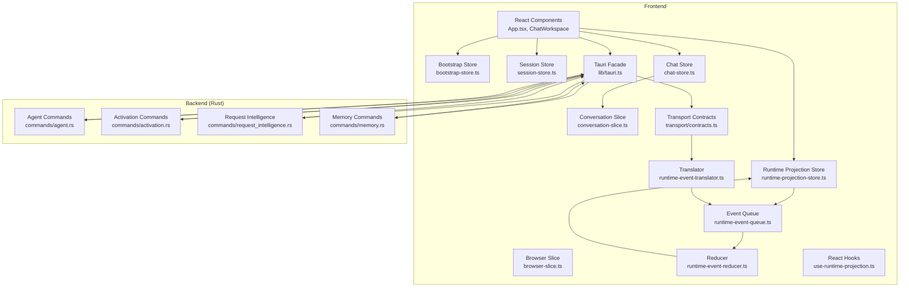
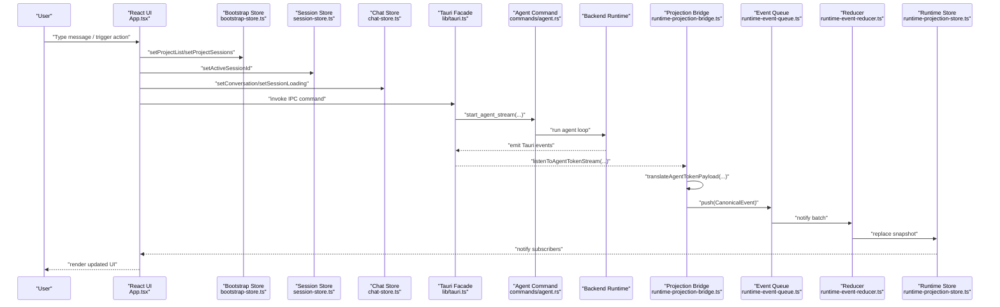
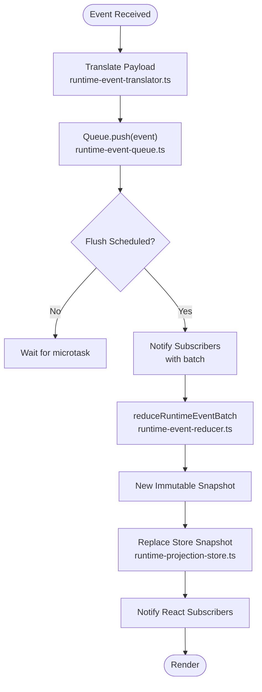
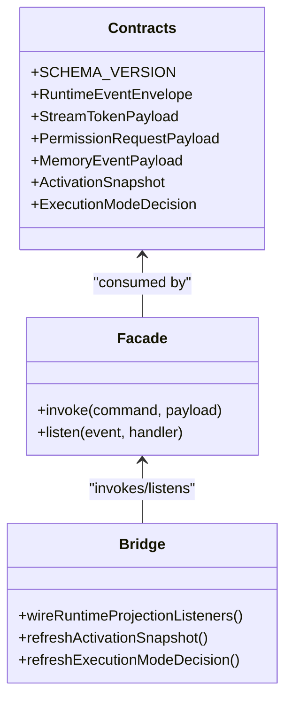
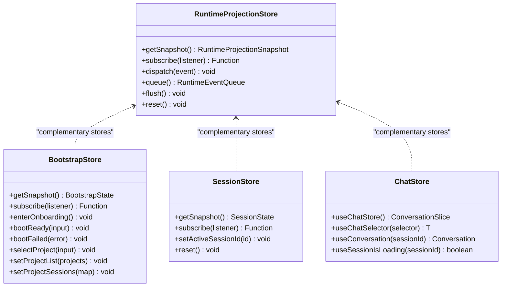
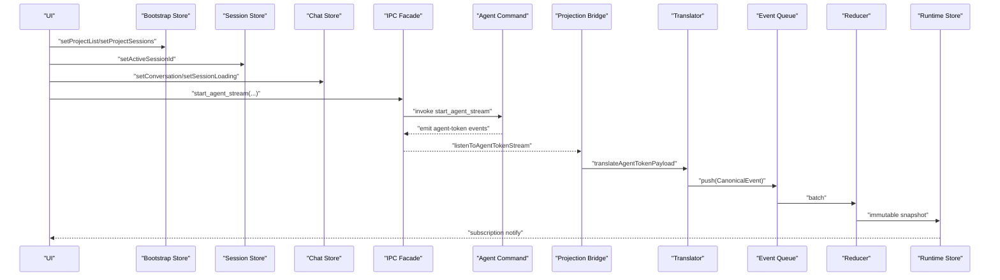
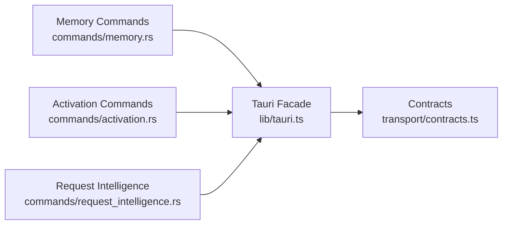
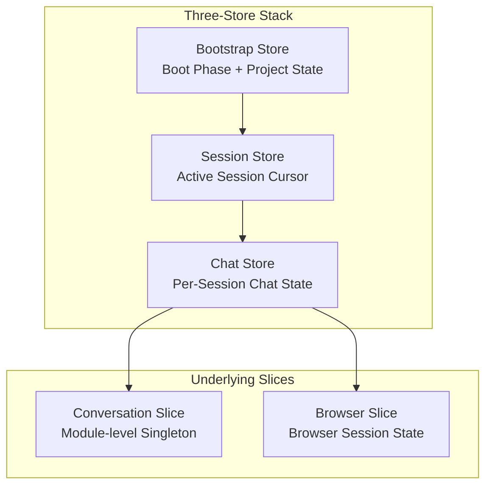
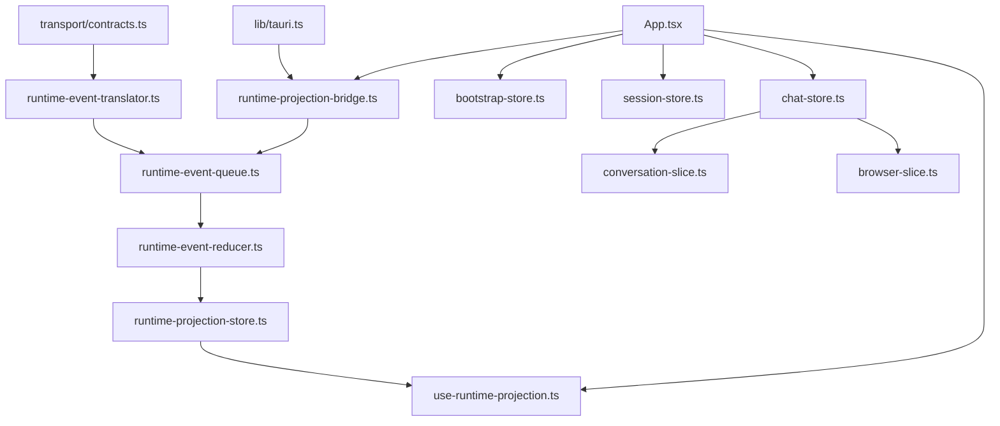

# Data Flow & State Management

<cite>
**Referenced Files in This Document**
- [index.ts](file://src/runtime-projection/index.ts)
- [runtime-projection-store.ts](file://src/runtime-projection/runtime-projection-store.ts)
- [runtime-event-reducer.ts](file://src/runtime-projection/runtime-event-reducer.ts)
- [runtime-event-translator.ts](file://src/runtime-projection/runtime-event-translator.ts)
- [runtime-projection-bridge.ts](file://src/runtime-projection/runtime-projection-bridge.ts)
- [runtime-event-queue.ts](file://src/runtime-projection/runtime-event-queue.ts)
- [types.ts](file://src/runtime-projection/types.ts)
- [use-runtime-projection.ts](file://src/runtime-projection/use-runtime-projection.ts)
- [contracts.ts](file://src/transport/contracts.ts)
- [tauri.ts](file://src/lib/tauri.ts)
- [conversation-slice.ts](file://src/stores/conversation-slice.ts)
- [browser-slice.ts](file://src/stores/browser-slice.ts)
- [session-store.ts](file://src/stores/session-store.ts)
- [chat-store.ts](file://src/stores/chat-store.ts)
- [bootstrap-store.ts](file://src/state/bootstrap-store.ts)
- [App.tsx](file://src/App.tsx)
- [agent.rs](file://src-tauri/src/commands/agent.rs)
- [activation.rs](file://src-tauri/src/commands/activation.rs)
- [request_intelligence.rs](file://src-tauri/src/commands/request_intelligence.rs)
- [memory.rs](file://src-tauri/src/commands/memory.rs)
</cite>

## Update Summary
**Changes Made**
- Added comprehensive documentation for the new three-store architecture created by MIG-014
- Updated state management patterns to reflect the non-overlapping responsibilities of session-store, chat-store, and bootstrap-store
- Enhanced architectural diagrams to show the three-store stack design
- Added detailed coverage of the session cursor management and chat store facade patterns
- Updated dependency analysis to reflect the new store layering

## Table of Contents
1. [Introduction](#introduction)
2. [Project Structure](#project-structure)
3. [Core Components](#core-components)
4. [Architecture Overview](#architecture-overview)
5. [Detailed Component Analysis](#detailed-component-analysis)
6. [Three-Store Architecture](#three-store-architecture)
7. [Dependency Analysis](#dependency-analysis)
8. [Performance Considerations](#performance-considerations)
9. [Troubleshooting Guide](#troubleshooting-guide)
10. [Conclusion](#conclusion)

## Introduction
This document explains the data flow and state management architecture in If2Ai, focusing on the unidirectional data flow from user input through React components, Tauri IPC commands, to Rust backend services. It details the runtime projection system that maintains consistency between frontend state and backend services, covering Redux-like reducers, reactive state updates, and event-driven state changes. The architecture now features a three-store design with clear separation of responsibilities: bootstrap-store for boot phase state, session-store for active session cursor management, and chat-store for per-session conversation state. It also documents memory lifecycle management, conversation state tracking, session persistence mechanisms, transport layer contracts, and performance considerations.

## Project Structure
If2Ai separates concerns across four distinct layers:
- Transport layer: Defines canonical contracts and thin IPC wrappers.
- Runtime projection pipeline: Normalizes backend events, batches them, reduces them into immutable snapshots, and exposes them to React via useSyncExternalStore.
- Application state stores: Three specialized stores with non-overlapping responsibilities - bootstrap-store for boot phase, session-store for active session cursor, and chat-store for per-session conversation state.
- Domain-specific slices: conversation-slice.ts and browser-slice.ts provide focused state management for heavy per-session data.

**Diagram sources**
- [bootstrap-store.ts:1-159](file://src/state/bootstrap-store.ts#L1-L159)
- [session-store.ts:1-110](file://src/stores/session-store.ts#L1-L110)
- [chat-store.ts:1-112](file://src/stores/chat-store.ts#L1-L112)
- [conversation-slice.ts:1-269](file://src/stores/conversation-slice.ts#L1-L269)
- [browser-slice.ts:1-103](file://src/stores/browser-slice.ts#L1-L103)
- [runtime-projection-store.ts:1-134](file://src/runtime-projection/runtime-projection-store.ts#L1-L134)
- [runtime-event-queue.ts:1-124](file://src/runtime-projection/runtime-event-queue.ts#L1-L124)
- [runtime-event-reducer.ts:1-361](file://src/runtime-projection/runtime-event-reducer.ts#L1-L361)
- [runtime-event-translator.ts:1-277](file://src/runtime-projection/runtime-event-translator.ts#L1-L277)
- [use-runtime-projection.ts:1-51](file://src/runtime-projection/use-runtime-projection.ts#L1-L51)
- [contracts.ts:1-539](file://src/transport/contracts.ts#L1-L539)
- [tauri.ts:1-800](file://src/lib/tauri.ts#L1-L800)
- [agent.rs:1-800](file://src-tauri/src/commands/agent.rs#L1-L800)
- [activation.rs:1-127](file://src-tauri/src/commands/activation.rs#L1-L127)
- [request_intelligence.rs:1-90](file://src-tauri/src/commands/request_intelligence.rs#L1-L90)
- [memory.rs:1-800](file://src-tauri/src/commands/memory.rs#L1-L800)

**Section sources**
- [index.ts:1-15](file://src/runtime-projection/index.ts#L1-L15)
- [contracts.ts:1-539](file://src/transport/contracts.ts#L1-L539)
- [tauri.ts:1-800](file://src/lib/tauri.ts#L1-L800)

## Core Components
- Runtime projection store: Immutable snapshot holder with dispatch/subscribe/flush/reset APIs, designed for useSyncExternalStore.
- Event queue: Micro-batch buffering with FIFO ordering and configurable flush modes.
- Translator: Canonical event normalizer from backend wire payloads to frontend canonical shapes.
- Reducer: Pure function mapping previous snapshot + event batch to a new immutable snapshot.
- Bridge: Subscribes to Tauri event sources, translates payloads, and dispatches to the store.
- React hooks: useRuntimeProjection and useRuntimeProjectionSelector for subscribing to the store.
- Transport contracts: Canonical TypeScript shapes mirroring Rust runtime contracts.
- IPC facade: Thin wrappers around Tauri invoke/listen, exposing typed helpers for commands/events.
- Bootstrap store: Manages boot phase state, project lists, and active project selection.
- Session store: Owns the active session cursor and lightweight per-session metadata.
- Chat store: Facade over conversation-slice providing canonical surface for per-session chat state.

**Section sources**
- [runtime-projection-store.ts:1-134](file://src/runtime-projection/runtime-projection-store.ts#L1-L134)
- [runtime-event-queue.ts:1-124](file://src/runtime-projection/runtime-event-queue.ts#L1-L124)
- [runtime-event-translator.ts:1-277](file://src/runtime-projection/runtime-event-translator.ts#L1-L277)
- [runtime-event-reducer.ts:1-361](file://src/runtime-projection/runtime-event-reducer.ts#L1-L361)
- [runtime-projection-bridge.ts:1-253](file://src/runtime-projection/runtime-projection-bridge.ts#L1-L253)
- [use-runtime-projection.ts:1-51](file://src/runtime-projection/use-runtime-projection.ts#L1-L51)
- [contracts.ts:1-539](file://src/transport/contracts.ts#L1-L539)
- [tauri.ts:1-800](file://src/lib/tauri.ts#L1-L800)
- [bootstrap-store.ts:1-159](file://src/state/bootstrap-store.ts#L1-L159)
- [session-store.ts:1-110](file://src/stores/session-store.ts#L1-L110)
- [chat-store.ts:1-112](file://src/stores/chat-store.ts#L1-L112)

## Architecture Overview
The system enforces a strict unidirectional data flow with a three-store architecture:
- User input triggers IPC commands (e.g., start_agent_stream).
- Backend emits Tauri events (agent-token, permission-request, memory_event).
- Frontend bridge listens to events, translates them, and dispatches canonical events.
- Events are queued and reduced into immutable snapshots.
- React components subscribe via useSyncExternalStore and re-render only on snapshot changes.
- Three specialized stores manage different aspects of application state with clear separation of responsibilities.

**Diagram sources**
- [App.tsx:256-268](file://src/App.tsx#L256-L268)
- [bootstrap-store.ts:119-152](file://src/state/bootstrap-store.ts#L119-L152)
- [session-store.ts:76-84](file://src/stores/session-store.ts#L76-L84)
- [chat-store.ts:54-69](file://src/stores/chat-store.ts#L54-L69)
- [tauri.ts:248-265](file://src/lib/tauri.ts#L248-L265)
- [agent.rs:738-800](file://src-tauri/src/commands/agent.rs#L738-L800)
- [runtime-projection-bridge.ts:117-125](file://src/runtime-projection/runtime-projection-bridge.ts#L117-L125)
- [runtime-event-queue.ts:98-105](file://src/runtime-projection/runtime-event-queue.ts#L98-L105)
- [runtime-event-reducer.ts:291-300](file://src/runtime-projection/runtime-event-reducer.ts#L291-L300)
- [runtime-projection-store.ts:89-95](file://src/runtime-projection/runtime-projection-store.ts#L89-L95)

## Detailed Component Analysis

### Runtime Projection Pipeline
The pipeline ensures predictable, testable state transitions:
- Queue batches events via microtasks to avoid render thrashing.
- Translator preserves semantics and returns null for unwired inputs.
- Reducer is pure and immutable; it does not touch storage or React.
- Store exposes getSnapshot/subscribe/dispatch and supports synchronous flush for tests.

**Diagram sources**
- [runtime-event-translator.ts:45-132](file://src/runtime-projection/runtime-event-translator.ts#L45-L132)
- [runtime-event-queue.ts:80-95](file://src/runtime-projection/runtime-event-queue.ts#L80-L95)
- [runtime-event-reducer.ts:291-300](file://src/runtime-projection/runtime-event-reducer.ts#L291-L300)
- [runtime-projection-store.ts:89-95](file://src/runtime-projection/runtime-projection-store.ts#L89-L95)

**Section sources**
- [runtime-event-queue.ts:1-124](file://src/runtime-projection/runtime-event-queue.ts#L1-L124)
- [runtime-event-translator.ts:1-277](file://src/runtime-projection/runtime-event-translator.ts#L1-L277)
- [runtime-event-reducer.ts:1-361](file://src/runtime-projection/runtime-event-reducer.ts#L1-L361)
- [runtime-projection-store.ts:1-134](file://src/runtime-projection/runtime-projection-store.ts#L1-L134)

### Transport Layer Contracts and Serialization
- Canonical contracts define wire shapes and schema versions, ensuring frontend/backend alignment.
- Wire payloads use camelCase on the wire; translators map snake_case legacy payloads to canonical shapes.
- IPC commands return strongly-typed responses; events are emitted with envelopes carrying correlation IDs.

**Diagram sources**
- [contracts.ts:1-539](file://src/transport/contracts.ts#L1-L539)
- [tauri.ts:1-800](file://src/lib/tauri.ts#L1-L800)
- [runtime-projection-bridge.ts:1-253](file://src/runtime-projection/runtime-projection-bridge.ts#L1-L253)

**Section sources**
- [contracts.ts:1-539](file://src/transport/contracts.ts#L1-L539)
- [tauri.ts:1-800](file://src/lib/tauri.ts#L1-L800)

### State Management Patterns
- Redux-like reducer: Pure, immutable transformations keyed by event kind.
- Reactive subscriptions: useSyncExternalStore enables efficient React integration without third-party libraries.
- Event-driven updates: Components subscribe to specific selectors to minimize re-renders.
- Three-store architecture: Separate stores for boot phase, session cursor, and chat state, enabling fine-grained updates and clear separation of concerns.

**Diagram sources**
- [runtime-projection-store.ts:32-54](file://src/runtime-projection/runtime-projection-store.ts#L32-L54)
- [bootstrap-store.ts:59-91](file://src/state/bootstrap-store.ts#L59-L91)
- [session-store.ts:42-50](file://src/stores/session-store.ts#L42-L50)
- [chat-store.ts:77-111](file://src/stores/chat-store.ts#L77-L111)

**Section sources**
- [runtime-projection-store.ts:1-134](file://src/runtime-projection/runtime-projection-store.ts#L1-L134)
- [bootstrap-store.ts:1-159](file://src/state/bootstrap-store.ts#L1-L159)
- [session-store.ts:1-110](file://src/stores/session-store.ts#L1-L110)
- [chat-store.ts:1-112](file://src/stores/chat-store.ts#L1-L112)

### Data Flow Through System Boundaries
- User input → IPC command → backend agent loop → streaming events → Tauri event → bridge → translator → queue → reducer → store → React.
- Activation and execution-mode decisions are fetched via dedicated IPC commands and projected into the store.
- Memory lifecycle events and after-turn batches are emitted and projected for governance and auditing.

**Diagram sources**
- [App.tsx:256-268](file://src/App.tsx#L256-L268)
- [bootstrap-store.ts:119-152](file://src/state/bootstrap-store.ts#L119-L152)
- [session-store.ts:76-84](file://src/stores/session-store.ts#L76-L84)
- [chat-store.ts:54-69](file://src/stores/chat-store.ts#L54-L69)
- [tauri.ts:248-265](file://src/lib/tauri.ts#L248-L265)
- [runtime-projection-bridge.ts:117-125](file://src/runtime-projection/runtime-projection-bridge.ts#L117-L125)
- [runtime-event-translator.ts:45-132](file://src/runtime-projection/runtime-event-translator.ts#L45-L132)
- [runtime-event-queue.ts:98-105](file://src/runtime-projection/runtime-event-queue.ts#L98-L105)
- [runtime-event-reducer.ts:291-300](file://src/runtime-projection/runtime-event-reducer.ts#L291-L300)
- [runtime-projection-store.ts:89-95](file://src/runtime-projection/runtime-projection-store.ts#L89-L95)

**Section sources**
- [App.tsx:256-268](file://src/App.tsx#L256-L268)
- [bootstrap-store.ts:119-152](file://src/state/bootstrap-store.ts#L119-L152)
- [session-store.ts:76-84](file://src/stores/session-store.ts#L76-L84)
- [chat-store.ts:54-69](file://src/stores/chat-store.ts#L54-L69)
- [tauri.ts:248-265](file://src/lib/tauri.ts#L248-L265)
- [runtime-projection-bridge.ts:1-253](file://src/runtime-projection/runtime-projection-bridge.ts#L1-L253)
- [runtime-event-translator.ts:1-277](file://src/runtime-projection/runtime-event-translator.ts#L1-L277)
- [runtime-event-queue.ts:1-124](file://src/runtime-projection/runtime-event-queue.ts#L1-L124)
- [runtime-event-reducer.ts:1-361](file://src/runtime-projection/runtime-event-reducer.ts#L1-L361)
- [runtime-projection-store.ts:1-134](file://src/runtime-projection/runtime-projection-store.ts#L1-L134)

### Memory Lifecycle Management and Session Persistence
- Memory commands expose recall, export, promotion/demotion, and compilation operations.
- Activation commands provide status retrieval for boot-time projections.
- Request intelligence command offers deterministic classification previews without routing.
- Session persistence integrates with conversation slices and App-level state.

**Diagram sources**
- [memory.rs:1-800](file://src-tauri/src/commands/memory.rs#L1-L800)
- [activation.rs:1-127](file://src-tauri/src/commands/activation.rs#L1-L127)
- [request_intelligence.rs:1-90](file://src-tauri/src/commands/request_intelligence.rs#L1-L90)
- [contracts.ts:1-539](file://src/transport/contracts.ts#L1-L539)
- [tauri.ts:1-800](file://src/lib/tauri.ts#L1-L800)

**Section sources**
- [memory.rs:1-800](file://src-tauri/src/commands/memory.rs#L1-L800)
- [activation.rs:1-127](file://src-tauri/src/commands/activation.rs#L1-L127)
- [request_intelligence.rs:1-90](file://src-tauri/src/commands/request_intelligence.rs#L1-L90)
- [tauri.ts:1-800](file://src/lib/tauri.ts#L1-L800)

## Three-Store Architecture

### Bootstrap Store (MIG-013)
Manages the application boot phase and project-level state:
- Boot phase transitions (splash → onboarding → main → error)
- Project list and active project selection
- Project sessions mapping for navigation
- Startup error handling and recovery

### Session Store (MIG-014)
Owns the canonical "which session is the user currently looking at?" cursor:
- Active session ID tracking with null for home/project picker
- Last selected timestamp for recency highlighting
- Lightweight per-session metadata too granular for bootstrap store
- Cross-cutting session state that doesn't belong in per-component useState

### Chat Store (MIG-014)
Provides a facade over conversation-slice with canonical surface:
- Per-session conversation state management
- Message stream handling and loading flags
- Todo lists and title state tracking
- Stream abort handle management
- Selector layer for fine-grained access patterns

**Diagram sources**
- [bootstrap-store.ts:28-46](file://src/state/bootstrap-store.ts#L28-L46)
- [session-store.ts:24-33](file://src/stores/session-store.ts#L24-L33)
- [chat-store.ts:19-25](file://src/stores/chat-store.ts#L19-L25)
- [conversation-slice.ts:19-31](file://src/stores/conversation-slice.ts#L19-L31)
- [browser-slice.ts:16-34](file://src/stores/browser-slice.ts#L16-L34)

**Section sources**
- [bootstrap-store.ts:1-159](file://src/state/bootstrap-store.ts#L1-L159)
- [session-store.ts:1-110](file://src/stores/session-store.ts#L1-L110)
- [chat-store.ts:1-112](file://src/stores/chat-store.ts#L1-L112)
- [conversation-slice.ts:1-269](file://src/stores/conversation-slice.ts#L1-L269)
- [browser-slice.ts:1-103](file://src/stores/browser-slice.ts#L1-L103)

## Dependency Analysis
The runtime projection pipeline exhibits low coupling and high cohesion:
- Translator depends only on transport contracts and types.
- Queue is decoupled from reducer/store; it only knows canonical events.
- Reducer depends only on types and produces immutable snapshots.
- Bridge wires transport and projection without embedding UI logic.
- React hooks depend only on store APIs.
- Three-store architecture ensures clear separation of concerns with minimal inter-store dependencies.

**Diagram sources**
- [contracts.ts:1-539](file://src/transport/contracts.ts#L1-L539)
- [runtime-event-translator.ts:1-277](file://src/runtime-projection/runtime-event-translator.ts#L1-L277)
- [runtime-event-queue.ts:1-124](file://src/runtime-projection/runtime-event-queue.ts#L1-L124)
- [runtime-event-reducer.ts:1-361](file://src/runtime-projection/runtime-event-reducer.ts#L1-L361)
- [runtime-projection-store.ts:1-134](file://src/runtime-projection/runtime-projection-store.ts#L1-L134)
- [runtime-projection-bridge.ts:1-253](file://src/runtime-projection/runtime-projection-bridge.ts#L1-L253)
- [use-runtime-projection.ts:1-51](file://src/runtime-projection/use-runtime-projection.ts#L1-L51)
- [tauri.ts:1-800](file://src/lib/tauri.ts#L1-L800)
- [App.tsx:755-766](file://src/App.tsx#L755-L766)
- [bootstrap-store.ts:1-159](file://src/state/bootstrap-store.ts#L1-L159)
- [session-store.ts:1-110](file://src/stores/session-store.ts#L1-L110)
- [chat-store.ts:1-112](file://src/stores/chat-store.ts#L1-L112)
- [conversation-slice.ts:1-269](file://src/stores/conversation-slice.ts#L1-L269)
- [browser-slice.ts:1-103](file://src/stores/browser-slice.ts#L1-L103)

**Section sources**
- [index.ts:1-15](file://src/runtime-projection/index.ts#L1-L15)
- [runtime-projection-store.ts:1-134](file://src/runtime-projection/runtime-projection-store.ts#L1-L134)
- [runtime-event-queue.ts:1-124](file://src/runtime-projection/runtime-event-queue.ts#L1-L124)
- [runtime-event-reducer.ts:1-361](file://src/runtime-projection/runtime-event-reducer.ts#L1-L361)
- [runtime-event-translator.ts:1-277](file://src/runtime-projection/runtime-event-translator.ts#L1-L277)
- [runtime-projection-bridge.ts:1-253](file://src/runtime-projection/runtime-projection-bridge.ts#L1-L253)
- [use-runtime-projection.ts:1-51](file://src/runtime-projection/use-runtime-projection.ts#L1-L51)
- [contracts.ts:1-539](file://src/transport/contracts.ts#L1-L539)
- [tauri.ts:1-800](file://src/lib/tauri.ts#L1-L800)
- [App.tsx:755-766](file://src/App.tsx#L755-L766)
- [bootstrap-store.ts:1-159](file://src/state/bootstrap-store.ts#L1-L159)
- [session-store.ts:1-110](file://src/stores/session-store.ts#L1-L110)
- [chat-store.ts:1-112](file://src/stores/chat-store.ts#L1-L112)
- [conversation-slice.ts:1-269](file://src/stores/conversation-slice.ts#L1-L269)
- [browser-slice.ts:1-103](file://src/stores/browser-slice.ts#L1-L103)

## Performance Considerations
- Micro-batch event flushing minimizes render thrashing while preserving ordering guarantees.
- Immutable snapshots enable shallow equality checks and efficient React re-renders.
- Selector-based hooks reduce unnecessary re-renders by subscribing to computed slices.
- Test-friendly synchronous flush mode allows deterministic assertions.
- Ring buffers for memory events and write decisions cap growth and maintain bounded memory.
- Three-store architecture reduces subscription overhead by allowing components to subscribe to specific store slices.
- Session cursor changes don't trigger chat store re-renders, improving performance for session switching.

## Troubleshooting Guide
Common issues and remedies:
- Listener errors: Queue notifies subscribers with error logging; errors do not block other subscribers.
- Bridge registration failures: Asynchronous listener registration failures are logged and do not block others.
- Activation and execution-mode fetch failures: Logged and swallowed; UI treats null as unknown rather than blocked.
- Permission prompt lifecycle: Approval entries are cleared after user decision via permission_resolved event.
- Store subscription leaks: Each store maintains its own listener set; ensure proper cleanup in components.
- Cross-store synchronization: Three-store architecture requires careful coordination to prevent inconsistent state.

**Section sources**
- [runtime-event-queue.ts:70-78](file://src/runtime-projection/runtime-event-queue.ts#L70-L78)
- [runtime-projection-bridge.ts:108-115](file://src/runtime-projection/runtime-projection-bridge.ts#L108-L115)
- [runtime-projection-bridge.ts:212-219](file://src/runtime-projection/runtime-projection-bridge.ts#L212-L219)
- [runtime-event-reducer.ts:137-148](file://src/runtime-projection/runtime-event-reducer.ts#L137-L148)

## Conclusion
If2Ai's runtime projection system establishes a robust, unidirectional data flow from user input to backend services and back to React components. The translator-normalized, queue-batched, reducer-driven pipeline ensures immutability, testability, and scalability. The new three-store architecture with bootstrap-store, session-store, and chat-store provides clear separation of concerns, preventing the accumulation of global state and enabling efficient, fine-grained updates. Complementary application slices manage heavy per-session state, while transport contracts and IPC facades provide strong typing and separation of concerns across the frontend-backend boundary. This layered approach ensures maintainability, performance, and scalability as the application evolves.