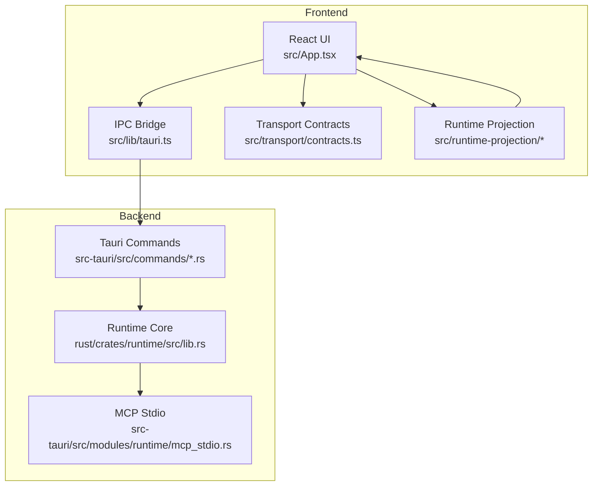
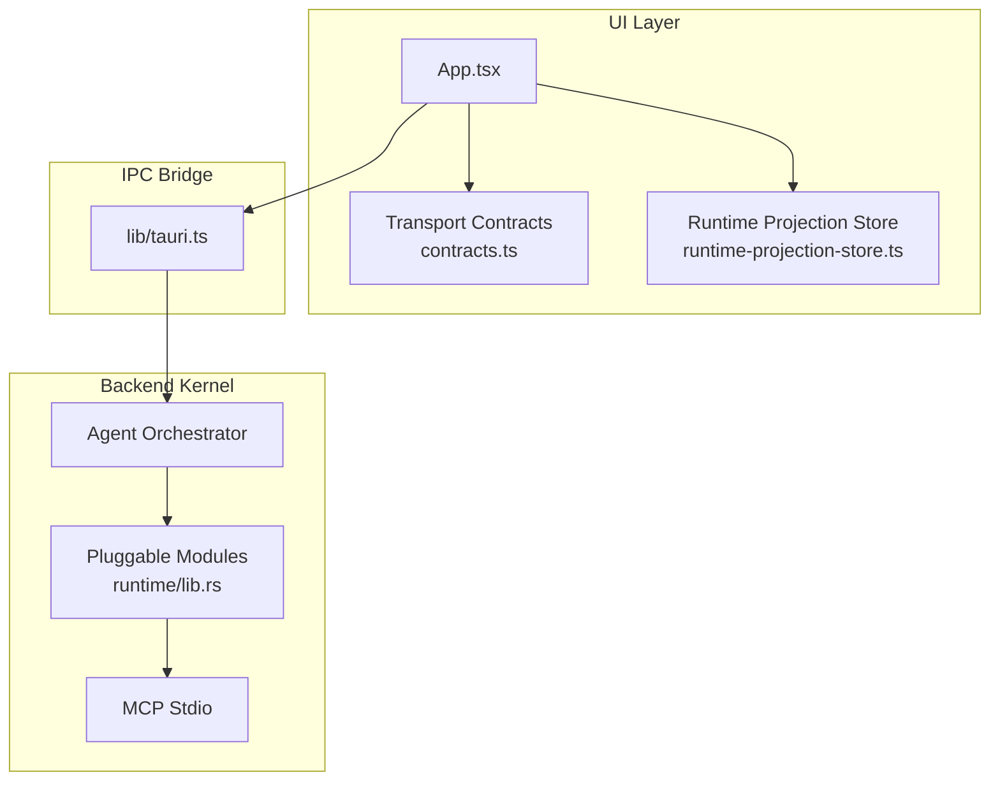
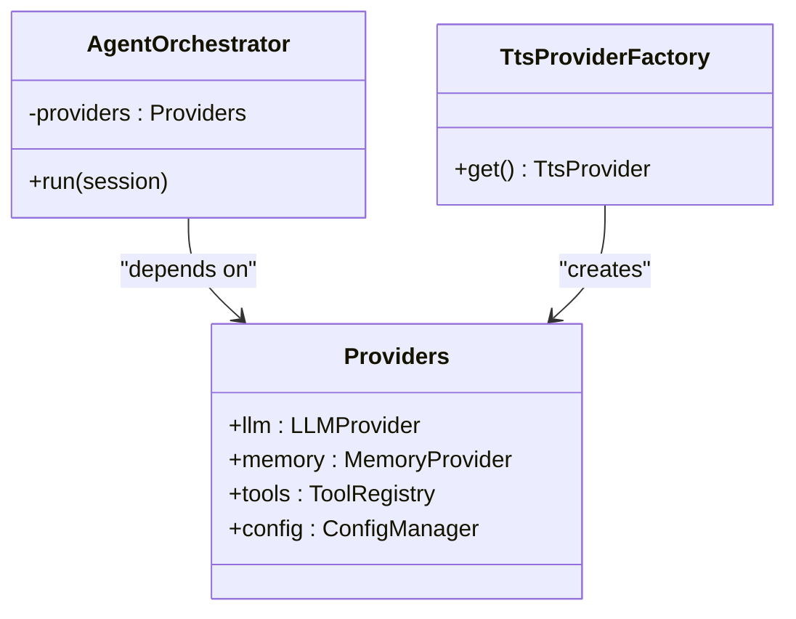
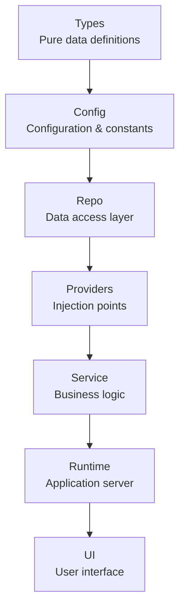
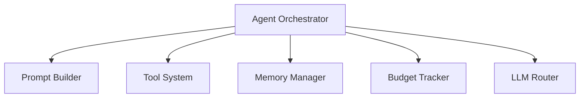
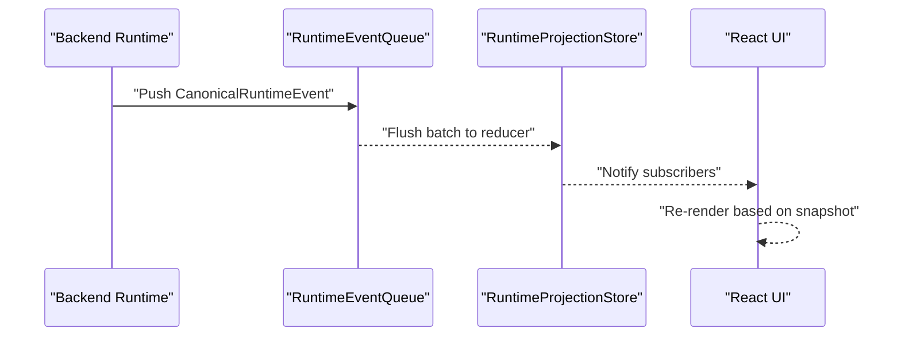
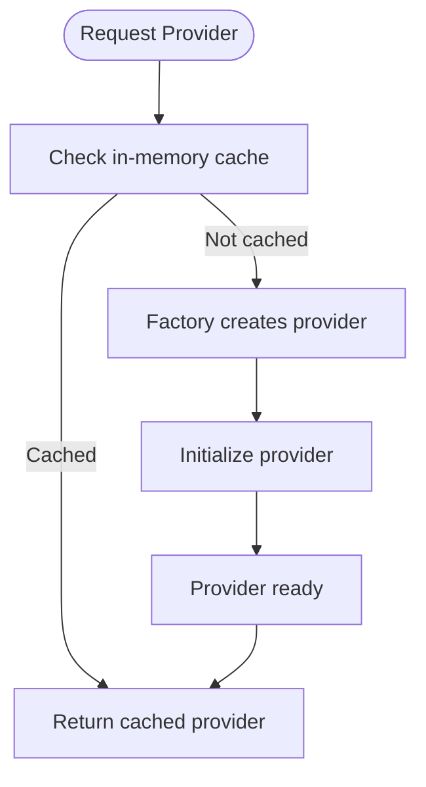
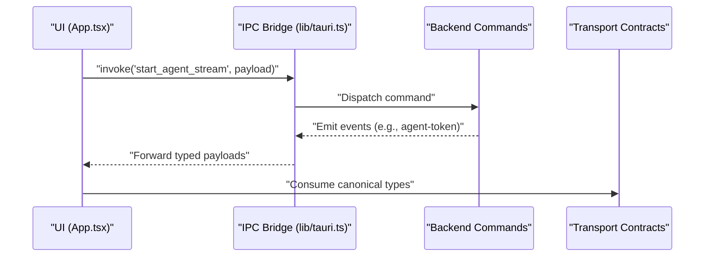
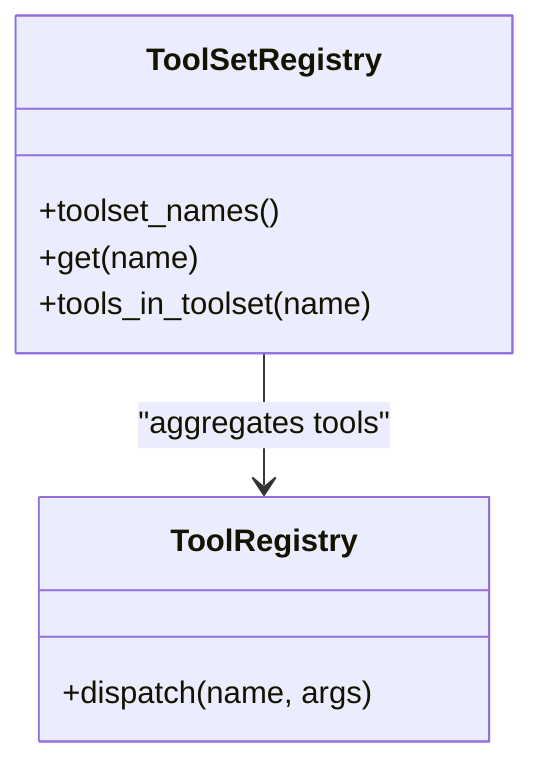
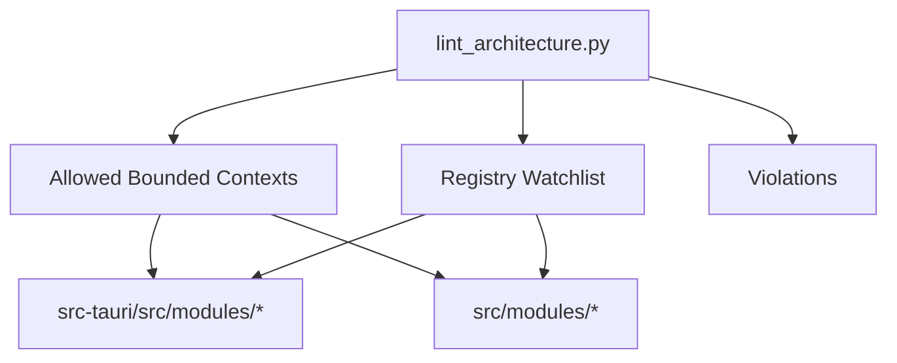

# Design Patterns & Principles

<cite>
**Referenced Files in This Document**
- [DESIGN.md](file://DESIGN.md)
- [ARCHITECTURE.md](file://ARCHITECTURE.md)
- [src/App.tsx](file://src/App.tsx)
- [src/lib/tauri.ts](file://src/lib/tauri.ts)
- [src/transport/contracts.ts](file://src/transport/contracts.ts)
- [src/transport/index.ts](file://src/transport/index.ts)
- [src/runtime-projection/index.ts](file://src/runtime-projection/index.ts)
- [src/runtime-projection/runtime-projection-store.ts](file://src/runtime-projection/runtime-projection-store.ts)
- [src/runtime-projection/runtime-event-queue.ts](file://src/runtime-projection/runtime-event-queue.ts)
- [src/runtime-projection/use-runtime-projection.ts](file://src/runtime-projection/use-runtime-projection.ts)
- [src-tauri/src/commands/tts.rs](file://src-tauri/src/commands/tts.rs)
- [src-tauri/src/modules/runtime/mcp_stdio.rs](file://src-tauri/src/modules/runtime/mcp_stdio.rs)
- [rust/crates/runtime/src/lib.rs](file://rust/crates/runtime/src/lib.rs)
- [scripts/lint_architecture.py](file://scripts/lint_architecture.py)
- [docs/design-docs/tool-system.md](file://docs/design-docs/tool-system.md)
- [docs/design-docs/tool-activation.md](file://docs/design-docs/tool-activation.md)
- [docs/_legacy/exec-plans/active/phase-4-tool-and-boundary.yaml](file://docs/_legacy/exec-plans/active/phase-4-tool-and-boundary.yaml)
- [docs/_legacy/exec-plans/active/phase-1-foundation.yaml](file://docs/_legacy/exec-plans/active/phase-1-foundation.yaml)
</cite>

## Table of Contents
1. [Introduction](#introduction)
2. [Project Structure](#project-structure)
3. [Core Components](#core-components)
4. [Architecture Overview](#architecture-overview)
5. [Detailed Component Analysis](#detailed-component-analysis)
6. [Dependency Analysis](#dependency-analysis)
7. [Performance Considerations](#performance-considerations)
8. [Troubleshooting Guide](#troubleshooting-guide)
9. [Conclusion](#conclusion)
10. [Appendices](#appendices)

## Introduction
This document explains the design patterns and architectural principles used in If2Ai, focusing on:
- Provider pattern for external dependency injection and testability
- Layered architecture with strict dependency flow
- Microkernel pattern for core orchestration with pluggable modules
- Observer pattern for event-driven UI updates
- Factory pattern for dynamic tool and provider instantiation
- Command pattern for type-safe IPC communication
- Taste invariants and design decision framework
- Constraint enforcement via custom linters, CI checks, and manual reviews

## Project Structure
If2Ai follows a clear separation of concerns across layers:
- UI (React + Svelte) consumes canonical runtime contracts and orchestrates streams via a thin IPC bridge
- Backend (Rust/Tokio) exposes typed commands and emits structured events
- Runtime projection pipeline decouples UI from backend event streams and normalizes them into a canonical store

**Diagram sources**
- [src/App.tsx:1-2515](file://src/App.tsx#L1-L2515)
- [src/lib/tauri.ts:1-2387](file://src/lib/tauri.ts#L1-L2387)
- [src/transport/contracts.ts:1-539](file://src/transport/contracts.ts#L1-L539)
- [src/runtime-projection/index.ts:1-15](file://src/runtime-projection/index.ts#L1-L15)
- [rust/crates/runtime/src/lib.rs:1-95](file://rust/crates/runtime/src/lib.rs#L1-L95)
- [src-tauri/src/modules/runtime/mcp_stdio.rs:567-615](file://src-tauri/src/modules/runtime/mcp_stdio.rs#L567-L615)

**Section sources**
- [ARCHITECTURE.md:1-324](file://ARCHITECTURE.md#L1-L324)
- [DESIGN.md:23-68](file://DESIGN.md#L23-L68)

## Core Components
- Provider pattern: All external dependencies (LLM, storage, tools) are injected via a central Providers container, enabling testability and flexible configuration.
- Layered architecture: Types → Config → Repo → Providers → Service → Runtime → UI enforces unidirectional dependencies.
- Microkernel: The Agent Orchestrator coordinates subsystems (prompt building, tool execution, memory, budgeting) while keeping core logic minimal and extensible.
- Observer pattern: UI subscribes to a runtime projection store that receives normalized events from backend streams.
- Factory pattern: Dynamic tool and provider instantiation with lazy loading and eviction policies.
- Command pattern: Typed IPC commands and events provide a type-safe contract between UI and backend.

**Section sources**
- [DESIGN.md:70-87](file://DESIGN.md#L70-L87)
- [ARCHITECTURE.md:195-234](file://ARCHITECTURE.md#L195-L234)
- [src/runtime-projection/runtime-projection-store.ts:30-133](file://src/runtime-projection/runtime-projection-store.ts#L30-L133)
- [src-tauri/src/commands/tts.rs:303-342](file://src-tauri/src/commands/tts.rs#L303-L342)

## Architecture Overview
The system is built around a microkernel (Agent Orchestrator) that delegates to pluggable modules. The UI remains decoupled from backend internals by consuming canonical contracts and subscribing to a runtime projection store.

**Diagram sources**
- [src/App.tsx:1-2515](file://src/App.tsx#L1-L2515)
- [src/transport/contracts.ts:1-539](file://src/transport/contracts.ts#L1-L539)
- [src/runtime-projection/runtime-projection-store.ts:30-133](file://src/runtime-projection/runtime-projection-store.ts#L30-L133)
- [src/lib/tauri.ts:1-2387](file://src/lib/tauri.ts#L1-L2387)
- [rust/crates/runtime/src/lib.rs:1-95](file://rust/crates/runtime/src/lib.rs#L1-L95)
- [src-tauri/src/modules/runtime/mcp_stdio.rs:567-615](file://src-tauri/src/modules/runtime/mcp_stdio.rs#L567-L615)

## Detailed Component Analysis

### Provider Pattern: External Dependency Injection
- Purpose: Inject all external dependencies (LLM, memory, tools) via a centralized Providers container to enable mocking, switching, and fault tolerance.
- Implementation highlights:
  - Providers are passed into core services and orchestrators.
  - Lazy provider loading with factory-based creation and eviction tracking.
  - Example: TTS provider factory and lazy acquisition with state transitions.

**Diagram sources**
- [ARCHITECTURE.md:210-221](file://ARCHITECTURE.md#L210-L221)
- [src-tauri/src/commands/tts.rs:303-342](file://src-tauri/src/commands/tts.rs#L303-L342)

**Section sources**
- [DESIGN.md:70-87](file://DESIGN.md#L70-L87)
- [ARCHITECTURE.md:210-221](file://ARCHITECTURE.md#L210-L221)
- [src-tauri/src/commands/tts.rs:303-342](file://src-tauri/src/commands/tts.rs#L303-L342)

### Layered Architecture: Strict Dependency Flow
- The dependency chain is Types → Config → Repo → Providers → Service → Runtime → UI.
- Enforced by:
  - Custom architecture linter checking bounded contexts and file sizes
  - CI checks and manual review guidelines

**Diagram sources**
- [DESIGN.md:41-68](file://DESIGN.md#L41-L68)
- [ARCHITECTURE.md:195-208](file://ARCHITECTURE.md#L195-L208)

**Section sources**
- [DESIGN.md:41-68](file://DESIGN.md#L41-L68)
- [ARCHITECTURE.md:195-208](file://ARCHITECTURE.md#L195-L208)
- [scripts/lint_architecture.py:155-196](file://scripts/lint_architecture.py#L155-L196)

### Microkernel Pattern: Core Orchestration with Pluggable Modules
- The Agent Orchestrator acts as the kernel, delegating to pluggable modules (prompt builder, tool system, memory, budget tracker).
- Modules are exposed via a consolidated runtime library entry.

**Diagram sources**
- [ARCHITECTURE.md:36-112](file://ARCHITECTURE.md#L36-L112)
- [rust/crates/runtime/src/lib.rs:20-86](file://rust/crates/runtime/src/lib.rs#L20-L86)

**Section sources**
- [ARCHITECTURE.md:36-112](file://ARCHITECTURE.md#L36-L112)
- [rust/crates/runtime/src/lib.rs:20-86](file://rust/crates/runtime/src/lib.rs#L20-L86)

### Observer Pattern: Event-Driven UI Updates
- UI subscribes to a runtime projection store that:
  - Receives normalized events from backend streams
  - Batches and flushes events via a queue
  - Reduces events into a snapshot and notifies subscribers

**Diagram sources**
- [src/runtime-projection/runtime-event-queue.ts:1-57](file://src/runtime-projection/runtime-event-queue.ts#L1-L57)
- [src/runtime-projection/runtime-projection-store.ts:30-133](file://src/runtime-projection/runtime-projection-store.ts#L30-L133)
- [src/runtime-projection/use-runtime-projection.ts:38-50](file://src/runtime-projection/use-runtime-projection.ts#L38-L50)

**Section sources**
- [src/runtime-projection/index.ts:1-15](file://src/runtime-projection/index.ts#L1-L15)
- [src/runtime-projection/runtime-event-queue.ts:1-57](file://src/runtime-projection/runtime-event-queue.ts#L1-L57)
- [src/runtime-projection/runtime-projection-store.ts:30-133](file://src/runtime-projection/runtime-projection-store.ts#L30-L133)
- [src/runtime-projection/use-runtime-projection.ts:38-50](file://src/runtime-projection/use-runtime-projection.ts#L38-L50)

### Factory Pattern: Dynamic Tool and Provider Instantiation
- Tools and providers are loaded lazily with factory functions and state tracking.
- Example: TTS provider factory with loading, success, and failure states.

**Diagram sources**
- [src-tauri/src/commands/tts.rs:303-342](file://src-tauri/src/commands/tts.rs#L303-L342)

**Section sources**
- [src-tauri/src/commands/tts.rs:303-342](file://src-tauri/src/commands/tts.rs#L303-L342)

### Command Pattern: Type-Safe IPC Communication
- UI invokes typed commands via the IPC bridge and listens to typed events.
- Canonical contracts define wire shapes and event families.

**Diagram sources**
- [src/App.tsx:1-2515](file://src/App.tsx#L1-L2515)
- [src/lib/tauri.ts:1-2387](file://src/lib/tauri.ts#L1-L2387)
- [src/transport/contracts.ts:1-539](file://src/transport/contracts.ts#L1-L539)

**Section sources**
- [src/App.tsx:1-2515](file://src/App.tsx#L1-L2515)
- [src/lib/tauri.ts:1-2387](file://src/lib/tauri.ts#L1-L2387)
- [src/transport/contracts.ts:1-539](file://src/transport/contracts.ts#L1-L539)
- [src/transport/index.ts:1-9](file://src/transport/index.ts#L1-L9)

### Tool System: Registry, Sets, and Execution
- ToolRegistry dynamically registers tools and executes them with shared context.
- ToolSetRegistry groups tools into sets for controlled activation.

**Diagram sources**
- [docs/design-docs/tool-system.md:33-55](file://docs/design-docs/tool-system.md#L33-L55)
- [docs/design-docs/tool-activation.md:343-430](file://docs/design-docs/tool-activation.md#L343-L430)

**Section sources**
- [docs/design-docs/tool-system.md:33-55](file://docs/design-docs/tool-system.md#L33-L55)
- [docs/design-docs/tool-activation.md:343-430](file://docs/design-docs/tool-activation.md#L343-L430)
- [docs/_legacy/exec-plans/active/phase-4-tool-and-boundary.yaml:134-171](file://docs/_legacy/exec-plans/active/phase-4-tool-and-boundary.yaml#L134-L171)

## Dependency Analysis
The system enforces strict dependency direction and bounded contexts:
- Backend modules and frontend modules must belong to allowed bounded contexts
- File size thresholds prevent god files
- Forbidden directory names are banned to maintain bounded contexts

**Diagram sources**
- [scripts/lint_architecture.py:105-149](file://scripts/lint_architecture.py#L105-L149)
- [scripts/lint_architecture.py:155-196](file://scripts/lint_architecture.py#L155-L196)
- [scripts/lint_architecture.py:199-246](file://scripts/lint_architecture.py#L199-L246)

**Section sources**
- [scripts/lint_architecture.py:105-149](file://scripts/lint_architecture.py#L105-L149)
- [scripts/lint_architecture.py:155-196](file://scripts/lint_architecture.py#L155-L196)
- [scripts/lint_architecture.py:199-246](file://scripts/lint_architecture.py#L199-L246)

## Performance Considerations
- Asynchronous-first design with Tokio for concurrency
- Streaming events with micro-batch queuing to reduce render thrashing
- Parallel tool execution (bounded by worker limits)
- Context compression triggers at configurable thresholds

[No sources needed since this section provides general guidance]

## Troubleshooting Guide
Common issues and remedies:
- Architecture violations: The linter reports forbidden directories, unknown contexts, and oversized files with actionable fix prompts.
- IPC mismatches: Ensure UI consumes canonical contracts and uses typed IPC helpers.
- Event ordering: Use the runtime projection store’s queue and reducer to batch and normalize events.

**Section sources**
- [scripts/lint_architecture.py:253-300](file://scripts/lint_architecture.py#L253-L300)
- [src/transport/contracts.ts:1-539](file://src/transport/contracts.ts#L1-L539)
- [src/runtime-projection/runtime-event-queue.ts:1-57](file://src/runtime-projection/runtime-event-queue.ts#L1-L57)

## Conclusion
If2Ai’s architecture is intentionally rigid in structure yet flexible in implementation:
- The Provider pattern ensures testability and configurability
- The layered architecture enforces clear boundaries
- The microkernel keeps core logic minimal and extensible
- The Observer pattern decouples UI from backend streams
- The Factory pattern supports dynamic, lazy-loaded modules
- The Command pattern guarantees type-safe IPC
- Constraints and taste invariants are enforced by custom linters, CI, and manual review

[No sources needed since this section summarizes without analyzing specific files]

## Appendices

### Design Decision Framework
When evaluating alternatives, prioritize:
- Agent readability over cleverness
- Composability over monolithic features
- Explicit boundaries with internal flexibility
- Testability over intelligence

**Section sources**
- [DESIGN.md:244-271](file://DESIGN.md#L244-L271)

### Constraint Enforcement Matrix
- Automated checks: architecture linter, file size thresholds, coverage targets, code quality tools
- Manual checks: PR review criteria for readability, test completeness, and anti-pattern detection

**Section sources**
- [DESIGN.md:222-243](file://DESIGN.md#L222-L243)
- [DESIGN.md:224-234](file://DESIGN.md#L224-L234)
- [DESIGN.md:235-243](file://DESIGN.md#L235-L243)
- [docs/_legacy/exec-plans/active/phase-1-foundation.yaml:316-343](file://docs/_legacy/exec-plans/active/phase-1-foundation.yaml#L316-L343)