# Integration Architecture

<cite>
**Referenced Files in This Document**
- [lib.rs](file://rust/crates/api/src/lib.rs)
- [client.rs](file://rust/crates/api/src/client.rs)
- [error.rs](file://rust/crates/api/src/error.rs)
- [sse.rs](file://rust/crates/api/src/sse.rs)
- [types.rs](file://rust/crates/api/src/types.rs)
- [lib.rs](file://rust/crates/runtime/src/lib.rs)
- [sse.rs](file://rust/crates/runtime/src/sse.rs)
- [oauth.rs](file://rust/crates/runtime/src/oauth.rs)
- [lib.rs](file://rust/crates/plugins/src/lib.rs)
- [lib.rs](file://src-tauri/src/modules/api/mod.rs)
- [client.rs](file://src-tauri/src/modules/api/client.rs)
- [error.rs](file://src-tauri/src/modules/api/error.rs)
- [sse.rs](file://src-tauri/src/modules/api/sse.rs)
- [types.rs](file://src-tauri/src/modules/api/types.rs)
- [mcp.rs](file://src-tauri/src/modules/runtime/mcp.rs)
- [mcp_client.rs](file://src-tauri/src/modules/runtime/mcp_client.rs)
- [mcp_stdio.rs](file://src-tauri/src/modules/runtime/mcp_stdio.rs)
- [claw_provider.rs](file://src-tauri/src/modules/api/providers/claw_provider.rs)
- [browser-control-system.md](file://docs/design-docs/postCLI/browser-control-system.md)
- [ADR-015-Browser-Subsystem-Remediation-Design.md](file://docs/design-docs/postCLI/ADR/ADR-015-Browser-Subsystem-Remediation-Design.md)
- [streaming.rs](file://src-tauri/src/modules/tts/inference/streaming.rs)
- [decode.rs](file://src-tauri/src/modules/tts/inference/decode.rs)
- [codec.rs](file://src-tauri/src/modules/tts/model/codec.rs)
- [vector_provider.rs](file://src-tauri/src/modules/memory/providers/vector_provider.rs)
- [default.json](file://src-tauri/capabilities/default.json)
- [browser-viewer-window.json](file://src-tauri/capabilities/browser-viewer-window.json)
- [settings-window.json](file://src-tauri/capabilities/settings-window.json)
- [node_mcp_server.md](file://src-tauri/resources/bundled-skills/mcp-builder/reference/node_mcp_server.md)
- [SKILL.md](file://src-tauri/resources/bundled-skills/mcp-builder/SKILL.md)
</cite>

## Table of Contents
1. [Introduction](#introduction)
2. [Project Structure](#project-structure)
3. [Core Components](#core-components)
4. [Architecture Overview](#architecture-overview)
5. [Detailed Component Analysis](#detailed-component-analysis)
6. [Dependency Analysis](#dependency-analysis)
7. [Performance Considerations](#performance-considerations)
8. [Troubleshooting Guide](#troubleshooting-guide)
9. [Conclusion](#conclusion)
10. [Appendices](#appendices)

## Introduction
This document describes the integration architecture of If2Ai, focusing on how the system connects to external services and subsystems. It covers:
- LLM provider integration via the API module
- Browser automation via Chromiumoxide
- Audio processing using ONNX Runtime
- Vector database integration via FastEmbed and LanceDB
- MCP (Model Context Protocol) for tool execution
- OAuth for secure authentication
- SSE (Server-Sent Events) for real-time communication
- Plugin architecture for extensibility
- Security, error handling, and performance considerations
- Window capability system for system-level integrations

## Project Structure
The integration architecture spans Rust crates for core runtime and API handling, Tauri-based modules for platform integration, and bundled skills for MCP tooling. Key integration points include:
- API module for provider resolution and streaming
- Runtime module for OAuth, SSE, and MCP orchestration
- Plugins module for third-party extension management
- Capabilities JSON for window-level permissions

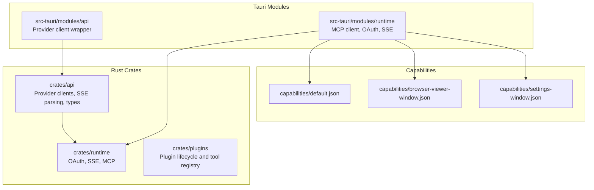

**Diagram sources**
- [lib.rs:1-26](file://rust/crates/api/src/lib.rs#L1-L26)
- [lib.rs:241-260](file://rust/crates/runtime/src/lib.rs#L241-L260)
- [lib.rs:489-587](file://rust/crates/plugins/src/lib.rs#L489-L587)
- [client.rs:1-150](file://src-tauri/src/modules/api/client.rs#L1-L150)
- [mcp_client.rs:1-237](file://src-tauri/src/modules/runtime/mcp_client.rs#L1-L237)
- [default.json:1-17](file://src-tauri/capabilities/default.json#L1-L17)
- [browser-viewer-window.json:1-17](file://src-tauri/capabilities/browser-viewer-window.json#L1-L17)
- [settings-window.json:1-17](file://src-tauri/capabilities/settings-window.json#L1-L17)

**Section sources**
- [lib.rs:1-26](file://rust/crates/api/src/lib.rs#L1-L26)
- [lib.rs:241-260](file://rust/crates/runtime/src/lib.rs#L241-L260)
- [lib.rs:489-587](file://rust/crates/plugins/src/lib.rs#L489-L587)
- [client.rs:1-150](file://src-tauri/src/modules/api/client.rs#L1-L150)
- [mcp_client.rs:1-237](file://src-tauri/src/modules/runtime/mcp_client.rs#L1-L237)
- [default.json:1-17](file://src-tauri/capabilities/default.json#L1-L17)
- [browser-viewer-window.json:1-17](file://src-tauri/capabilities/browser-viewer-window.json#L1-L17)
- [settings-window.json:1-17](file://src-tauri/capabilities/settings-window.json#L1-L17)

## Core Components
- API module: Provides provider-agnostic client abstractions, streaming, and SSE parsing. It exposes enums and traits for provider selection and streaming consumption.
- Runtime module: Implements OAuth flows, SSE event parsing, and MCP client bootstrapping for multiple transports (stdio, HTTP, SSE, WebSocket, SDK, managed proxy).
- Plugins module: Defines plugin metadata, lifecycle hooks, and tool registries for third-party integrations.
- Capabilities: JSON manifests define window permissions and identifiers for system-level integrations.

Key integration contracts:
- ProviderClient: Unified interface for sending messages and streaming responses across providers.
- StreamEvent: Standardized streaming event model for LLM responses.
- OAuthTokenSet and OAuth flows: Secure credential management and PKCE-based authorization.
- SSE parsing: Robust incremental parsing of Server-Sent Events.
- MCP transport and tool naming: Normalized tool names and signatures for MCP servers.

**Section sources**
- [lib.rs:7-26](file://rust/crates/api/src/lib.rs#L7-L26)
- [client.rs:23-88](file://rust/crates/api/src/client.rs#L23-L88)
- [types.rs:6-270](file://rust/crates/api/src/types.rs#L6-L270)
- [oauth.rs:1-324](file://rust/crates/runtime/src/oauth.rs#L1-L324)
- [sse.rs:1-106](file://rust/crates/api/src/sse.rs#L1-L106)
- [mcp.rs:1-303](file://src-tauri/src/modules/runtime/mcp.rs#L1-L303)
- [mcp_client.rs:1-237](file://src-tauri/src/modules/runtime/mcp_client.rs#L1-L237)
- [lib.rs:489-587](file://rust/crates/plugins/src/lib.rs#L489-L587)

## Architecture Overview
The integration architecture separates concerns across crates and modules:
- API layer handles provider resolution and streaming
- Runtime layer manages authentication, transport, and real-time events
- Plugins layer enables extensibility and tool discovery
- Capabilities layer enforces window-level permissions

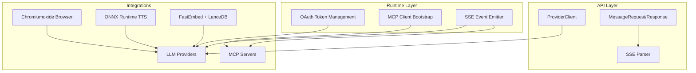

**Diagram sources**
- [client.rs:23-88](file://rust/crates/api/src/client.rs#L23-L88)
- [types.rs:6-270](file://rust/crates/api/src/types.rs#L6-L270)
- [sse.rs:1-106](file://rust/crates/api/src/sse.rs#L1-L106)
- [oauth.rs:1-324](file://rust/crates/runtime/src/oauth.rs#L1-L324)
- [mcp_client.rs:1-237](file://src-tauri/src/modules/runtime/mcp_client.rs#L1-L237)
- [lib.rs:241-260](file://rust/crates/runtime/src/lib.rs#L241-L260)

## Detailed Component Analysis

### LLM Provider Integration (API Module)
The API module centralizes provider selection and streaming:
- ProviderClient selects provider based on model alias and environment configuration
- MessageRequest/Response and StreamEvent define standardized contracts
- SSE parsing supports incremental event processing

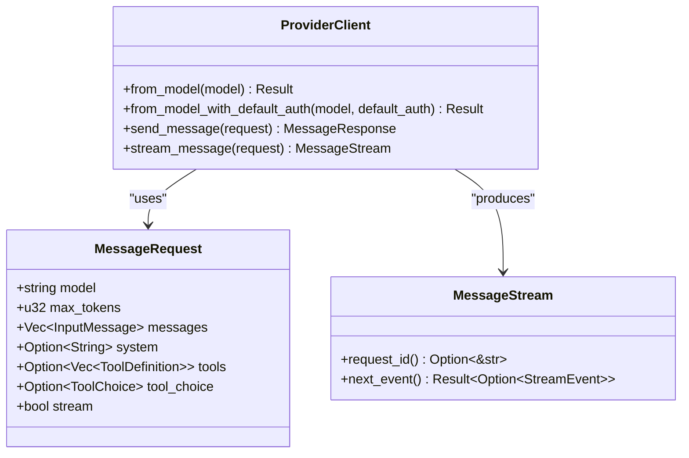

**Diagram sources**
- [client.rs:23-113](file://rust/crates/api/src/client.rs#L23-L113)
- [types.rs:6-270](file://rust/crates/api/src/types.rs#L6-L270)

**Section sources**
- [client.rs:1-150](file://rust/crates/api/src/client.rs#L1-L150)
- [types.rs:1-270](file://rust/crates/api/src/types.rs#L1-L270)
- [error.rs:1-60](file://rust/crates/api/src/error.rs#L1-L60)
- [sse.rs:1-106](file://rust/crates/api/src/sse.rs#L1-L106)

### Browser Automation Engine (Chromiumoxide)
The browser control system leverages Chromiumoxide for headless and headed automation:
- Headless mode by default, with optional headed mode
- Session isolation via incognito contexts
- Real-time screenshot and AXTree snapshots via Tauri events

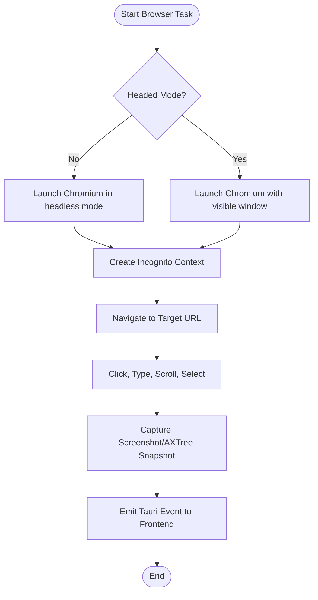

**Diagram sources**
- [browser-control-system.md:1-38](file://docs/design-docs/postCLI/browser-control-system.md#L1-L38)
- [ADR-015-Browser-Subsystem-Remediation-Design.md:1665-1704](file://docs/design-docs/postCLI/ADR/ADR-015-Browser-Subsystem-Remediation-Design.md#L1665-L1704)

**Section sources**
- [browser-control-system.md:1-38](file://docs/design-docs/postCLI/browser-control-system.md#L1-L38)
- [ADR-015-Browser-Subsystem-Remediation-Design.md:1665-1704](file://docs/design-docs/postCLI/ADR/ADR-015-Browser-Subsystem-Remediation-Design.md#L1665-L1704)

### Audio Processing (ONNX Runtime)
Audio processing uses ONNX Runtime for voice cloning and streaming:
- Codec sessions for encode/decode/step operations
- Streaming lead computation to maintain real-time playback
- Decoding utilities for VQ channel logits

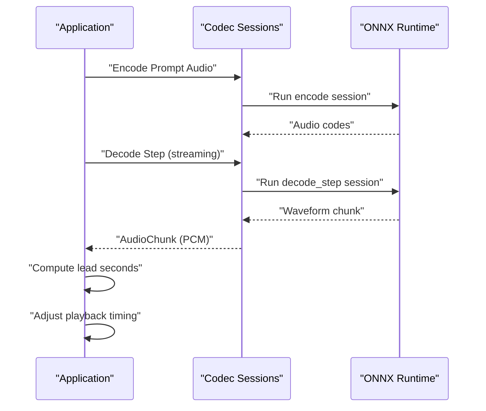

**Diagram sources**
- [codec.rs:68-90](file://src-tauri/src/modules/tts/model/codec.rs#L68-L90)
- [streaming.rs:96-142](file://src-tauri/src/modules/tts/inference/streaming.rs#L96-L142)
- [decode.rs:632-665](file://src-tauri/src/modules/tts/inference/decode.rs#L632-L665)

**Section sources**
- [codec.rs:68-90](file://src-tauri/src/modules/tts/model/codec.rs#L68-L90)
- [streaming.rs:96-142](file://src-tauri/src/modules/tts/inference/streaming.rs#L96-L142)
- [decode.rs:632-665](file://src-tauri/src/modules/tts/inference/decode.rs#L632-L665)

### Vector Database Integration (FastEmbed + LanceDB)
Vector memory provider integrates FastEmbed for embeddings and LanceDB for storage:
- FastEmbed model initialization and batch embedding
- LanceDB table creation and IVF-PQ index management
- Graceful degradation on secondary store initialization errors

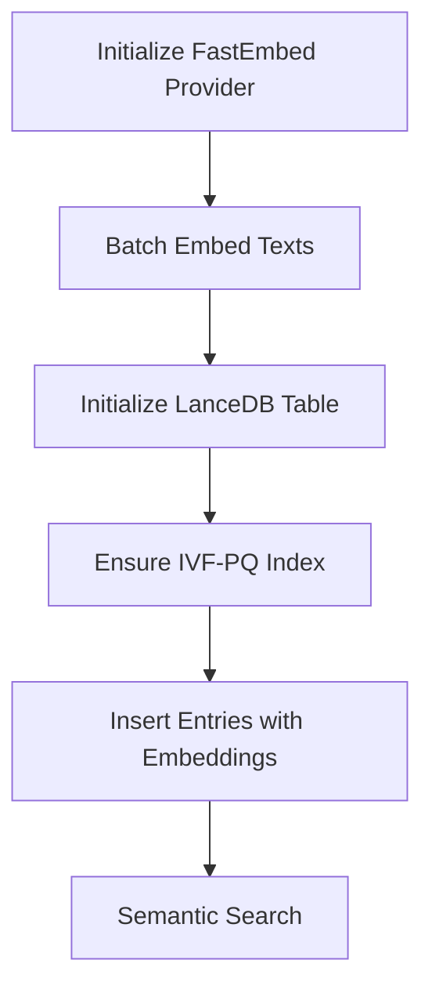

**Diagram sources**
- [vector_provider.rs:119-148](file://src-tauri/src/modules/memory/providers/vector_provider.rs#L119-L148)
- [ADR-003-FastEmbed-LanceDB-Selection.md:46-109](file://docs/design-docs/postCLI/ADR/ADR-003-FastEmbed-LanceDB-Selection.md#L46-L109)

**Section sources**
- [vector_provider.rs:119-148](file://src-tauri/src/modules/memory/providers/vector_provider.rs#L119-L148)
- [ADR-003-FastEmbed-LanceDB-Selection.md:46-109](file://docs/design-docs/postCLI/ADR/ADR-003-FastEmbed-LanceDB-Selection.md#L46-L109)

### MCP Integration for Tool Execution
MCP integration supports multiple transports and OAuth:
- Normalized tool names and server signatures
- Transport bootstrapping for stdio, HTTP, SSE, WebSocket, SDK, managed proxy
- OAuth-aware remote transports

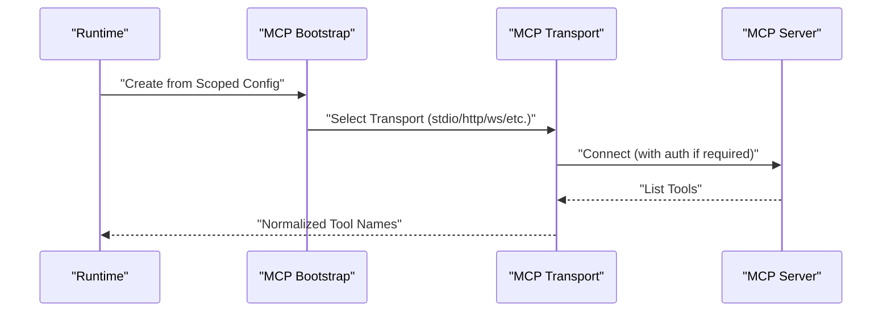

**Diagram sources**
- [mcp.rs:1-303](file://src-tauri/src/modules/runtime/mcp.rs#L1-L303)
- [mcp_client.rs:1-237](file://src-tauri/src/modules/runtime/mcp_client.rs#L1-L237)
- [mcp_stdio.rs:1357-1379](file://src-tauri/src/modules/runtime/mcp_stdio.rs#L1357-L1379)

**Section sources**
- [mcp.rs:1-303](file://src-tauri/src/modules/runtime/mcp.rs#L1-L303)
- [mcp_client.rs:1-237](file://src-tauri/src/modules/runtime/mcp_client.rs#L1-L237)
- [mcp_stdio.rs:1357-1379](file://src-tauri/src/modules/runtime/mcp_stdio.rs#L1357-L1379)
- [SKILL.md:45-145](file://src-tauri/resources/bundled-skills/mcp-builder/SKILL.md#L45-L145)
- [node_mcp_server.md:584-756](file://src-tauri/resources/bundled-skills/mcp-builder/reference/node_mcp_server.md#L584-L756)

### OAuth Integration for Secure Authentication
OAuth flows include PKCE, token exchange, refresh, and callback parsing:
- PKCE code pair generation and challenge methods
- Authorization and token exchange requests
- Callback parameter parsing and state validation

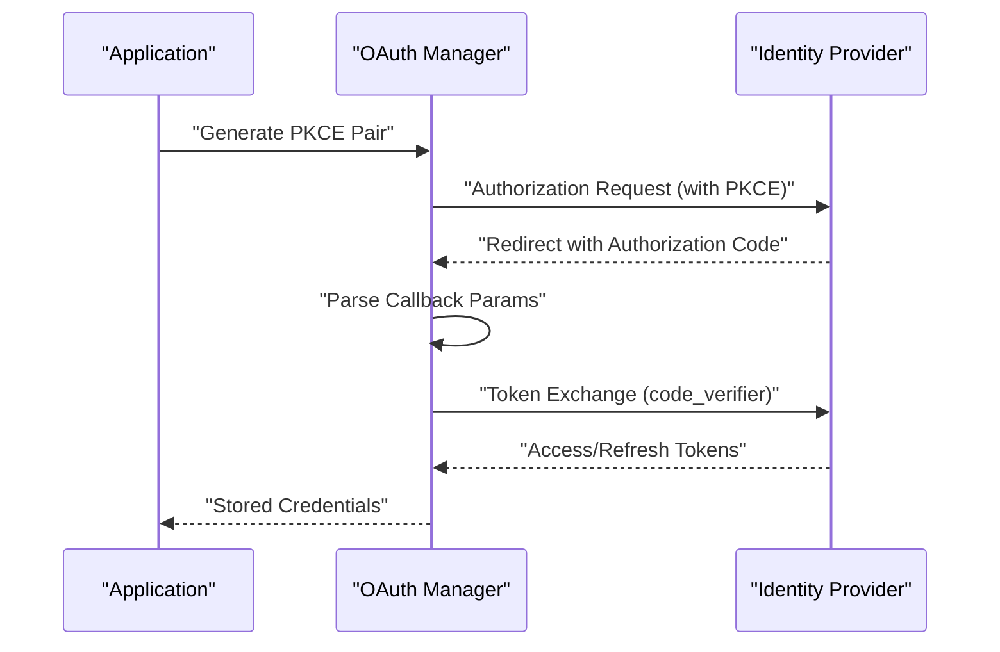

**Diagram sources**
- [oauth.rs:1-324](file://rust/crates/runtime/src/oauth.rs#L1-L324)
- [claw_provider.rs:810-838](file://src-tauri/src/modules/api/providers/claw_provider.rs#L810-L838)

**Section sources**
- [oauth.rs:1-324](file://rust/crates/runtime/src/oauth.rs#L1-L324)
- [claw_provider.rs:810-838](file://src-tauri/src/modules/api/providers/claw_provider.rs#L810-L838)

### SSE Integration for Real-Time Communication
SSE is used for streaming LLM responses and runtime events:
- Incremental parsing of frames with ping filtering and DONE handling
- Event emission and keep-alive intervals

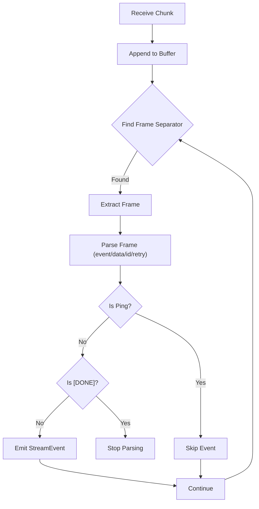

**Diagram sources**
- [sse.rs:1-106](file://rust/crates/api/src/sse.rs#L1-L106)
- [sse.rs:1-128](file://rust/crates/runtime/src/sse.rs#L1-L128)
- [lib.rs:241-260](file://rust/crates/runtime/src/lib.rs#L241-L260)

**Section sources**
- [sse.rs:1-106](file://rust/crates/api/src/sse.rs#L1-L106)
- [sse.rs:1-128](file://rust/crates/runtime/src/sse.rs#L1-L128)
- [lib.rs:241-260](file://rust/crates/runtime/src/lib.rs#L241-L260)

### Plugin Architecture for Extensibility
The plugin system supports built-in, bundled, and external plugins:
- Plugin metadata, hooks, lifecycle commands, and tool definitions
- Validation, initialization, and shutdown routines
- Command-driven installation and enablement

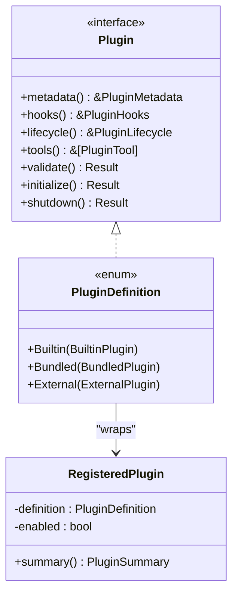

**Diagram sources**
- [lib.rs:489-587](file://rust/crates/plugins/src/lib.rs#L489-L587)

**Section sources**
- [lib.rs:489-587](file://rust/crates/plugins/src/lib.rs#L489-L587)
- [lib.rs:1356-1400](file://rust/crates/plugins/src/lib.rs#L1356-L1400)

### Window Capability System
Capabilities define window permissions and identifiers:
- Default, browser-viewer, and settings windows
- Permissions for events, window controls, and dialogs

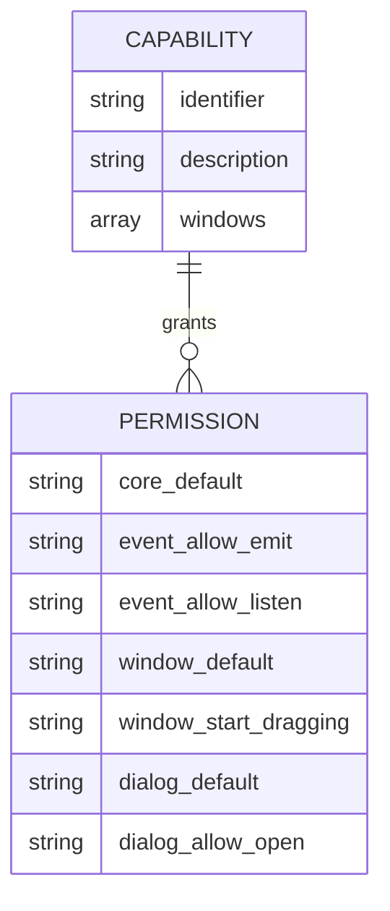

**Diagram sources**
- [default.json:1-17](file://src-tauri/capabilities/default.json#L1-L17)
- [browser-viewer-window.json:1-17](file://src-tauri/capabilities/browser-viewer-window.json#L1-L17)
- [settings-window.json:1-17](file://src-tauri/capabilities/settings-window.json#L1-L17)

**Section sources**
- [default.json:1-17](file://src-tauri/capabilities/default.json#L1-L17)
- [browser-viewer-window.json:1-17](file://src-tauri/capabilities/browser-viewer-window.json#L1-L17)
- [settings-window.json:1-17](file://src-tauri/capabilities/settings-window.json#L1-L17)

## Dependency Analysis
The integration architecture exhibits clear separation of concerns:
- API crate depends on runtime for OAuth and SSE utilities
- Tauri modules wrap API and runtime for platform-specific integrations
- Plugins depend on the plugin crate for lifecycle management
- Capabilities enforce window-level permissions across modules

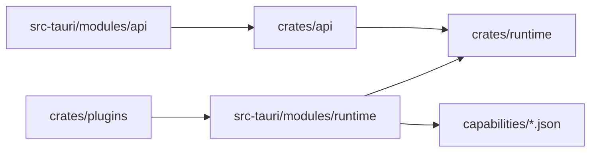

**Diagram sources**
- [lib.rs:1-26](file://rust/crates/api/src/lib.rs#L1-L26)
- [lib.rs:241-260](file://rust/crates/runtime/src/lib.rs#L241-L260)
- [lib.rs:489-587](file://rust/crates/plugins/src/lib.rs#L489-L587)
- [client.rs:1-150](file://src-tauri/src/modules/api/client.rs#L1-L150)
- [mcp_client.rs:1-237](file://src-tauri/src/modules/runtime/mcp_client.rs#L1-L237)
- [default.json:1-17](file://src-tauri/capabilities/default.json#L1-L17)

**Section sources**
- [lib.rs:1-26](file://rust/crates/api/src/lib.rs#L1-L26)
- [lib.rs:241-260](file://rust/crates/runtime/src/lib.rs#L241-L260)
- [lib.rs:489-587](file://rust/crates/plugins/src/lib.rs#L489-L587)
- [client.rs:1-150](file://src-tauri/src/modules/api/client.rs#L1-L150)
- [mcp_client.rs:1-237](file://src-tauri/src/modules/runtime/mcp_client.rs#L1-L237)
- [default.json:1-17](file://src-tauri/capabilities/default.json#L1-L17)

## Performance Considerations
- SSE streaming: Use incremental parsers to minimize latency and memory overhead
- MCP transports: Prefer stdio for local servers and HTTP/SSE for remote servers to balance latency and scalability
- Vector indexing: IVF-PQ indices improve retrieval performance; degrade gracefully on initialization failures
- Audio streaming: Compute lead time to maintain real-time playback alignment
- Browser automation: Headless mode reduces overhead; isolate sessions to avoid cross-contamination

## Troubleshooting Guide
Common issues and strategies:
- Network failures: Distinguish retryable vs non-retryable errors; implement exponential backoff for HTTP and API errors
- OAuth errors: Validate PKCE parameters, state, and callback parsing; handle expired tokens and refresh flows
- SSE parsing: Handle malformed frames and [DONE] markers; filter ping events
- MCP connectivity: Verify normalized tool names and server signatures; confirm OAuth configuration for remote transports
- Plugin lifecycle: Validate hook paths and lifecycle commands; ensure proper initialization and shutdown

**Section sources**
- [error.rs:1-60](file://rust/crates/api/src/error.rs#L1-L60)
- [error.rs:1-64](file://src-tauri/src/modules/api/error.rs#L1-L64)
- [oauth.rs:294-324](file://rust/crates/runtime/src/oauth.rs#L294-L324)
- [sse.rs:63-101](file://rust/crates/api/src/sse.rs#L63-L101)
- [mcp.rs:67-120](file://src-tauri/src/modules/runtime/mcp.rs#L67-L120)

## Conclusion
If2Ai’s integration architecture combines a provider-agnostic API layer, robust runtime utilities for OAuth and SSE, flexible MCP transport support, and a plugin-based extensibility model. The system’s capability system ensures secure window-level access, while vector and audio integrations provide semantic search and speech synthesis. The documented contracts and transports enable reliable, scalable, and secure external integrations.

## Appendices
- MCP tooling reference and best practices are documented in the bundled skills documentation
- Browser control system design emphasizes consistency and automation fidelity

**Section sources**
- [SKILL.md:45-145](file://src-tauri/resources/bundled-skills/mcp-builder/SKILL.md#L45-L145)
- [node_mcp_server.md:584-756](file://src-tauri/resources/bundled-skills/mcp-builder/reference/node_mcp_server.md#L584-L756)
- [browser-control-system.md:1-38](file://docs/design-docs/postCLI/browser-control-system.md#L1-L38)