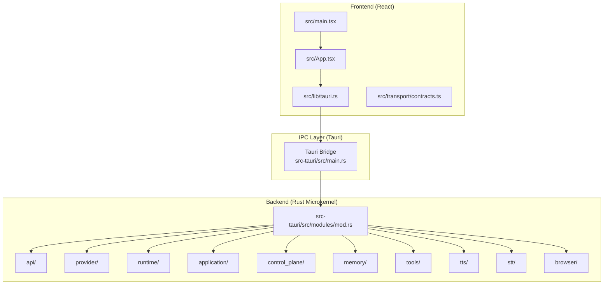
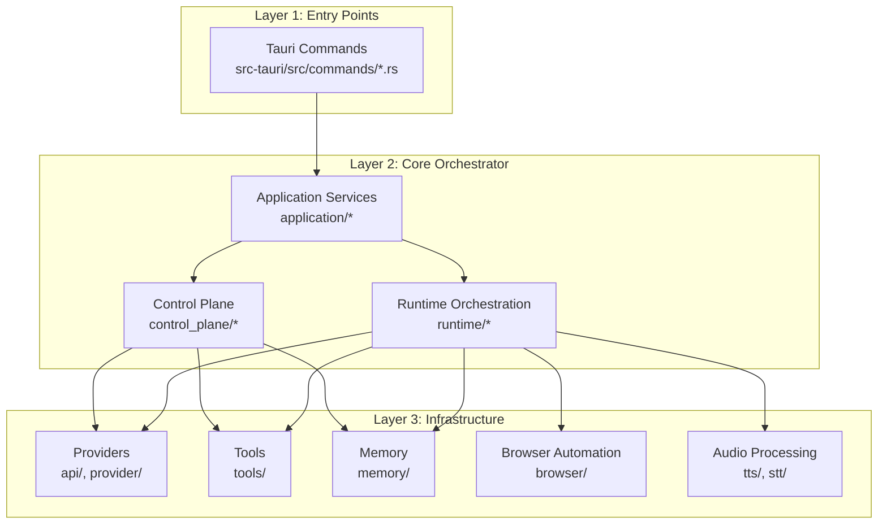
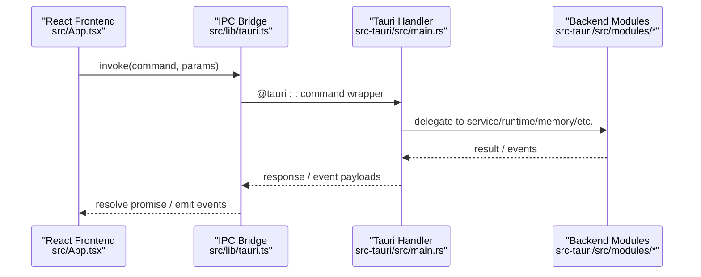
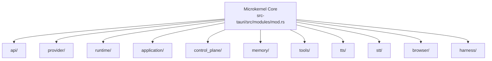
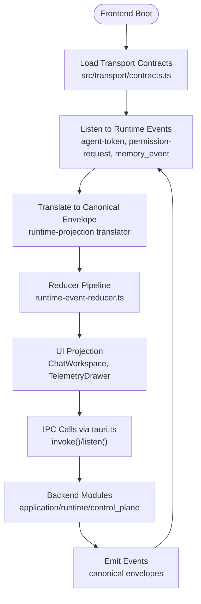
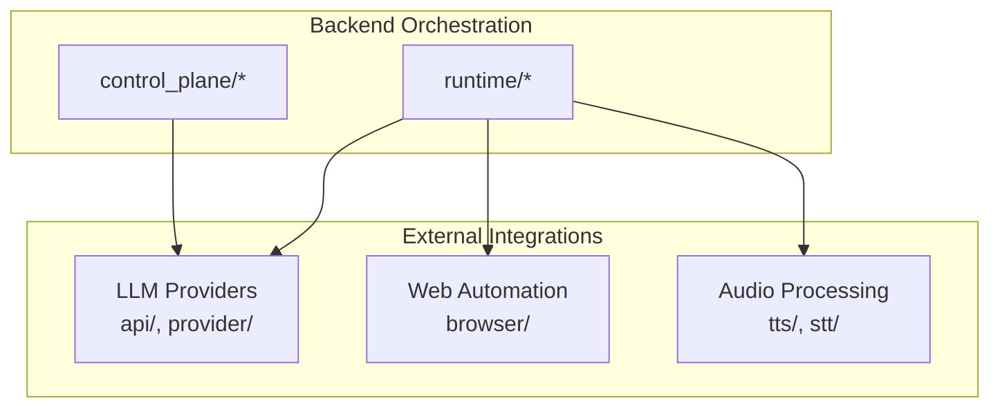
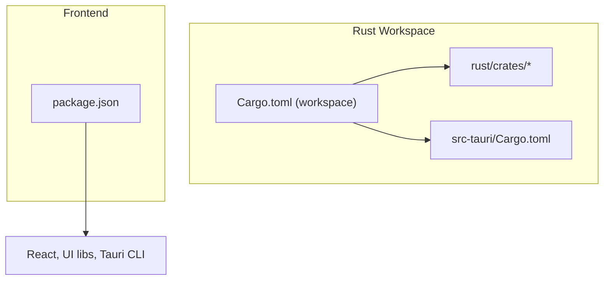

# System Architecture Overview

<cite>
**Referenced Files in This Document**
- [DESIGN.md](file://DESIGN.md)
- [Cargo.toml](file://Cargo.toml)
- [src-tauri/Cargo.toml](file://src-tauri/Cargo.toml)
- [package.json](file://package.json)
- [src-tauri/README.md](file://src-tauri/README.md)
- [src-tauri/src/main.rs](file://src-tauri/src/main.rs)
- [src/main.tsx](file://src/main.tsx)
- [src/App.tsx](file://src/App.tsx)
- [src/lib/tauri.ts](file://src/lib/tauri.ts)
- [src/transport/contracts.ts](file://src/transport/contracts.ts)
- [src-tauri/src/modules/mod.rs](file://src-tauri/src/modules/mod.rs)
- [src-tauri/src/modules/api/mod.rs](file://src-tauri/src/modules/api/mod.rs)
- [src-tauri/src/modules/provider/mod.rs](file://src-tauri/src/modules/provider/mod.rs)
- [src-tauri/src/modules/application/tool_executor.rs](file://src-tauri/src/modules/application/tool_executor.rs)
- [docs/staff-remediation/if2ai-staff-remediation-blueprint.md](file://docs/staff-remediation/if2ai-staff-remediation-blueprint.md)
- [docs/design-docs/postCLI/ADR/ADR-014-if2AI-Onboarding.md](file://docs/design-docs/postCLI/ADR/ADR-014-if2AI-Onboarding.md)
- [docs/design-docs/module-boundaries-and-integration.md](file://docs/design-docs/module-boundaries-and-integration.md)
- [docs/_legacy/exec-plans/active/phase-m1-backend-service-extraction.yaml](file://docs/_legacy/exec-plans/active/phase-m1-backend-service-extraction.yaml)
- [docs/packs/feature/migration-core/MIG-007-worker-tool-execution-contract.md](file://docs/packs/feature/migration-core/MIG-007-worker-tool-execution-contract.md)
- [docs/design-docs/postCLI/ADR/ADR-015-Browser-Subsystem-Remediation-Design.md](file://docs/design-docs/postCLI/ADR/ADR-015-Browser-Subsystem-Remediation-Design.md)
</cite>

## Table of Contents
1. [Introduction](#introduction)
2. [Project Structure](#project-structure)
3. [Core Components](#core-components)
4. [Architecture Overview](#architecture-overview)
5. [Detailed Component Analysis](#detailed-component-analysis)
6. [Dependency Analysis](#dependency-analysis)
7. [Performance Considerations](#performance-considerations)
8. [Troubleshooting Guide](#troubleshooting-guide)
9. [Conclusion](#conclusion)
10. [Appendices](#appendices)

## Introduction
This document presents the system architecture overview for If2Ai, focusing on the three-tier layered design and the microkernel pattern used for core orchestration. The system consists of:
- React frontend (TypeScript/JSX)
- Tauri IPC layer (TypeScript bridge and Rust backend)
- Rust backend services (microkernel with pluggable modules)

It explains the component interaction patterns, data flow between layers, and integration points with external services such as LLM providers, browser automation engines, and audio processing systems. Architectural constraints, should-have guidelines, design principles, and technical trade-offs are documented to guide development and maintenance.

## Project Structure
The repository organizes the system across three primary layers:
- Frontend (React + TypeScript): located under src/
- IPC Bridge: thin TypeScript wrappers under src/lib/tauri.ts and transport contracts under src/transport/
- Backend (Rust): under src-tauri/, organized into modular subsystems mirroring the microkernel pattern

**Diagram sources**
- [src-tauri/src/main.rs:1-1217](file://src-tauri/src/main.rs#L1-L1217)
- [src-tauri/src/modules/mod.rs:1-68](file://src-tauri/src/modules/mod.rs#L1-L68)
- [src/lib/tauri.ts:1-34](file://src/lib/tauri.ts#L1-L34)
- [src/transport/contracts.ts:1-539](file://src/transport/contracts.ts#L1-L539)
- [src/App.tsx:1-2515](file://src/App.tsx#L1-L2515)
- [src/main.tsx:1-44](file://src/main.tsx#L1-L44)

**Section sources**
- [src-tauri/README.md:1-66](file://src-tauri/README.md#L1-L66)
- [src-tauri/src/main.rs:1-1217](file://src-tauri/src/main.rs#L1-L1217)
- [src-tauri/src/modules/mod.rs:1-68](file://src-tauri/src/modules/mod.rs#L1-L68)
- [src/lib/tauri.ts:1-34](file://src/lib/tauri.ts#L1-L34)
- [src/transport/contracts.ts:1-539](file://src/transport/contracts.ts#L1-L539)
- [src/App.tsx:1-2515](file://src/App.tsx#L1-L2515)
- [src/main.tsx:1-44](file://src/main.tsx#L1-L44)

## Core Components
- React Frontend: Initializes the app shell, manages boot and onboarding, orchestrates IPC calls, and renders UI surfaces.
- Tauri Bridge: Provides typed IPC helpers and event listeners, exposing backend commands to the frontend while maintaining a thin boundary.
- Rust Backend (Microkernel): Composed of pluggable modules (runtime, api, provider, application, control_plane, memory, tools, tts, stt, browser, etc.) orchestrated centrally in main.rs.

Key orchestration points:
- Frontend invokes commands via src/lib/tauri.ts, which wraps @tauri-apps/api.
- Backend registers commands in main.rs and delegates to modules for business logic.
- Transport contracts define canonical event envelopes and execution-mode decisions.

**Section sources**
- [src/App.tsx:1-2515](file://src/App.tsx#L1-L2515)
- [src/lib/tauri.ts:1-34](file://src/lib/tauri.ts#L1-L34)
- [src-tauri/src/main.rs:1-1217](file://src-tauri/src/main.rs#L1-L1217)
- [src-tauri/src/modules/mod.rs:1-68](file://src-tauri/src/modules/mod.rs#L1-L68)
- [src/transport/contracts.ts:1-539](file://src/transport/contracts.ts#L1-L539)

## Architecture Overview
If2Ai employs a strict three-tier layered architecture with a microkernel pattern at the backend:
- Layer 1 (Entry Points): Tauri commands and IPC handlers.
- Layer 2 (Core Orchestrator): Application services, runtime orchestration, and control plane enforcement.
- Layer 3 (Infrastructure): Providers, tools, memory, browser automation, and audio/video processing.

Architectural constraints enforced:
- Forced constraints: layered dependency architecture, provider pattern, type boundaries, structured logging, asynchronous-first approach.
- Should-have constraints: naming conventions, code size limits, test coverage, documentation completeness.

Design principles:
- Agent-first engineering prioritizing readability for AI.
- Clear boundaries and composability.
- Observability and evaluation via the Harness framework.
- Explicit boundaries, single-direction dependency flow, and minimal implicit behavior.

**Diagram sources**
- [src-tauri/src/main.rs:1-1217](file://src-tauri/src/main.rs#L1-L1217)
- [src-tauri/src/modules/mod.rs:1-68](file://src-tauri/src/modules/mod.rs#L1-L68)
- [docs/staff-remediation/if2ai-staff-remediation-blueprint.md:573-600](file://docs/staff-remediation/if2ai-staff-remediation-blueprint.md#L573-L600)

**Section sources**
- [DESIGN.md:37-138](file://DESIGN.md#L37-L138)
- [docs/staff-remediation/if2ai-staff-remediation-blueprint.md:573-600](file://docs/staff-remediation/if2ai-staff-remediation-blueprint.md#L573-L600)

## Detailed Component Analysis

### Three-Tier System: React Frontend, Tauri IPC, Rust Backend
- Frontend (React) initializes the app, handles boot and onboarding, and consumes IPC commands and events.
- IPC Bridge (TypeScript) encapsulates invoke/listen and exposes typed helpers for commands and events.
- Backend (Rust) registers commands and orchestrates modules for runtime orchestration, provider resolution, memory, tools, and specialized subsystems.

**Diagram sources**
- [src/App.tsx:1-2515](file://src/App.tsx#L1-L2515)
- [src/lib/tauri.ts:1-34](file://src/lib/tauri.ts#L1-L34)
- [src-tauri/src/main.rs:1-1217](file://src-tauri/src/main.rs#L1-L1217)

**Section sources**
- [src/App.tsx:1-2515](file://src/App.tsx#L1-L2515)
- [src/lib/tauri.ts:1-34](file://src/lib/tauri.ts#L1-L34)
- [src-tauri/src/main.rs:1-1217](file://src-tauri/src/main.rs#L1-L1217)

### Microkernel Pattern and Pluggable Modules
The Rust backend is organized as a microkernel with pluggable modules:
- api: Provider management and routing
- provider: Registry, configuration, and connection testing
- runtime: Conversation runtime, stream orchestration, prompt planning, and contracts
- application: Turn service, session management, request intelligence, activation/license lifecycle
- control_plane: Permission, audit, boundary enforcement, ingress classification, tool execution broker
- memory: Retrieval, compiler, summary, ticker, injection, reflection, trajectory feedback
- tools: Tool registry and execution
- tts/stt: Text-to-speech and speech-to-text pipelines
- browser: Chromium automation via CDP
- harness: Evaluation and telemetry

**Diagram sources**
- [src-tauri/src/modules/mod.rs:1-68](file://src-tauri/src/modules/mod.rs#L1-L68)

**Section sources**
- [src-tauri/src/modules/mod.rs:1-68](file://src-tauri/src/modules/mod.rs#L1-L68)
- [docs/staff-remediation/if2ai-staff-remediation-blueprint.md:573-600](file://docs/staff-remediation/if2ai-staff-remediation-blueprint.md#L573-L600)

### Component Interaction Patterns and Data Flow
- Canonical contracts define runtime event envelopes and execution-mode decisions, ensuring consistent interpretation across frontend and backend.
- The frontend consumes canonical envelopes via a translator/reducer pipeline and renders projections for execution mode, memory decisions, and activation status.
- Tool execution is mediated by the control plane, which enforces boundary, permission, and sandbox policies before delegating to workers or tools.

**Diagram sources**
- [src/transport/contracts.ts:1-539](file://src/transport/contracts.ts#L1-L539)
- [src/App.tsx:1-2515](file://src/App.tsx#L1-L2515)
- [src/lib/tauri.ts:1-34](file://src/lib/tauri.ts#L1-L34)

**Section sources**
- [src/transport/contracts.ts:1-539](file://src/transport/contracts.ts#L1-L539)
- [src/App.tsx:1-2515](file://src/App.tsx#L1-L2515)
- [src/lib/tauri.ts:1-34](file://src/lib/tauri.ts#L1-L34)

### Integration Points with External Services
- LLM Providers: Integrated via provider modules supporting OpenAI-compatible clients and Claw provider integrations.
- Browser Automation: Chromium automation via CDP (chromiumoxide) for web search, fetch, and browser-based tasks.
- Audio Processing: TTS and STT modules with ONNX-based synthesis and SenseVoice ASR.

**Diagram sources**
- [src-tauri/src/modules/api/mod.rs:1-40](file://src-tauri/src/modules/api/mod.rs#L1-L40)
- [src-tauri/src/modules/provider/mod.rs:1-25](file://src-tauri/src/modules/provider/mod.rs#L1-L25)
- [src-tauri/src/modules/browser/registry.rs](file://src-tauri/src/modules/browser/registry.rs)
- [src-tauri/src/modules/tts/](file://src-tauri/src/modules/tts/)
- [src-tauri/src/modules/stt/](file://src-tauri/src/modules/stt/)

**Section sources**
- [src-tauri/src/modules/api/mod.rs:1-40](file://src-tauri/src/modules/api/mod.rs#L1-L40)
- [src-tauri/src/modules/provider/mod.rs:1-25](file://src-tauri/src/modules/provider/mod.rs#L1-L25)
- [docs/design-docs/postCLI/ADR/ADR-015-Browser-Subsystem-Remediation-Design.md:665-697](file://docs/design-docs/postCLI/ADR/ADR-015-Browser-Subsystem-Remediation-Design.md#L665-L697)

## Dependency Analysis
- Workspace composition: The Rust workspace aggregates crates under rust/crates and the Tauri backend under src-tauri.
- Frontend dependencies: React, Radix UI, Tailwind, and Tauri plugins for filesystem and dialogs.
- Backend dependencies: Tokio, reqwest, tracing, SQLite, fastembed/lancedb, chromiumoxide, scraper, and audio libraries.

**Diagram sources**
- [Cargo.toml:1-24](file://Cargo.toml#L1-L24)
- [src-tauri/Cargo.toml:1-161](file://src-tauri/Cargo.toml#L1-L161)
- [package.json:1-85](file://package.json#L1-L85)

**Section sources**
- [Cargo.toml:1-24](file://Cargo.toml#L1-L24)
- [src-tauri/Cargo.toml:1-161](file://src-tauri/Cargo.toml#L1-L161)
- [package.json:1-85](file://package.json#L1-L85)

## Performance Considerations
- Asynchronous-first design ensures non-blocking I/O across backend services.
- Structured logging and observability enable efficient diagnostics and profiling.
- Lazy provider initialization and idle eviction reduce cold-start overhead for TTS/STT.
- Memory providers support hybrid/vector fallbacks with timeouts to maintain responsiveness.

[No sources needed since this section provides general guidance]

## Troubleshooting Guide
- Logging: Backend uses structured tracing with rolling file appender; verify logs under ~/.if2ai/log.
- IPC failures: Ensure invoke/listen wrappers are used consistently and canonical contracts are aligned.
- Module initialization: Failures in memory providers or job runners fall back gracefully; inspect logs for detailed error messages.

**Section sources**
- [src-tauri/src/main.rs:406-436](file://src-tauri/src/main.rs#L406-L436)
- [src-tauri/src/main.rs:329-361](file://src-tauri/src/main.rs#L329-L361)

## Conclusion
If2Ai’s architecture balances a clean three-tier design with a robust microkernel pattern. The forced constraints enforce strong boundaries and predictable behavior, while the should-have guidelines promote maintainability and readability. The transport contracts and runtime-projection pipeline ensure consistent interpretation of backend events across the frontend, enabling transparent and auditable agent behavior.

[No sources needed since this section summarizes without analyzing specific files]

## Appendices

### Architectural Constraints and Design Principles
- Forced constraints:
  - Layered dependency architecture with single-direction dependency flow
  - Provider pattern for external dependencies
  - Type boundaries and parse-at-bounds validation
  - Structured logging and error categorization
  - Asynchronous-first approach for I/O
- Should-have constraints:
  - Naming conventions, code size limits, test coverage, and documentation completeness

**Section sources**
- [DESIGN.md:37-138](file://DESIGN.md#L37-L138)

### Backend Module Boundaries and Integration
- Modules are designed with clear responsibilities and integrated via AppState and command registration.
- Commands act as thin adapters delegating to application/runtime/control_plane services.

**Section sources**
- [docs/design-docs/module-boundaries-and-integration.md:1-857](file://docs/design-docs/module-boundaries-and-integration.md#L1-L857)
- [src-tauri/src/main.rs:1-1217](file://src-tauri/src/main.rs#L1-L1217)

### Frontend Boot, Onboarding, and Activation Gate
- Boot sequence checks onboarding state and routes accordingly.
- Activation and provider configuration are handled through dedicated modules and commands.

**Section sources**
- [src/App.tsx:102-197](file://src/App.tsx#L102-L197)
- [docs/design-docs/postCLI/ADR/ADR-014-if2AI-Onboarding.md:118-167](file://docs/design-docs/postCLI/ADR/ADR-014-if2AI-Onboarding.md#L118-L167)

### Tool Execution Contract Migration
- Unified worker/tool contract to standardize capability, permission, sandbox, approval, and event emission.

**Section sources**
- [docs/packs/feature/migration-core/MIG-007-worker-tool-execution-contract.md:1-65](file://docs/packs/feature/migration-core/MIG-007-worker-tool-execution-contract.md#L1-L65)

### Control Plane Switches and Runtime Behavior
- Control plane switches (v2 enablement, boundary enforcement, sandbox strictness) are configurable via runtime config and environment variables.

**Section sources**
- [src-tauri/src/modules/application/tool_executor.rs:21-50](file://src-tauri/src/modules/application/tool_executor.rs#L21-L50)

### Backend Service Extraction Plan
- Phase M1 focuses on extracting command-first backend into application services, runtime, and control plane boundaries.

**Section sources**
- [docs/_legacy/exec-plans/active/phase-m1-backend-service-extraction.yaml:1-5](file://docs/_legacy/exec-plans/active/phase-m1-backend-service-extraction.yaml#L1-L5)