# Application State Management

<cite>
**Referenced Files in This Document**
- [lib.rs](file://src-tauri/src/lib.rs)
- [main.rs](file://src-tauri/src/main.rs)
- [commands/mod.rs](file://src-tauri/src/commands/mod.rs)
- [runtime/mod.rs](file://src-tauri/src/modules/runtime/mod.rs)
- [application/mod.rs](file://src-tauri/src/modules/application/mod.rs)
</cite>

## Table of Contents
1. [Introduction](#introduction)
2. [Project Structure](#project-structure)
3. [Core Components](#core-components)
4. [Architecture Overview](#architecture-overview)
5. [Detailed Component Analysis](#detailed-component-analysis)
6. [Dependency Analysis](#dependency-analysis)
7. [Performance Considerations](#performance-considerations)
8. [Troubleshooting Guide](#troubleshooting-guide)
9. [Conclusion](#conclusion)

## Introduction
This document explains the application state management architecture centered on the AppState structure in the Rust backend. AppState acts as the global coordinator for all subsystems, including memory providers, tool registries, browser sessions, learning modules, onboarding, and runtime configuration. It consolidates shared services (e.g., JobRunner, ThreatScanner, SessionSummaryStore) and exposes them to Tauri command handlers and internal modules. The document covers state initialization, module dependencies, lifecycle management, runtime configuration, context budget management, session handling, mutation patterns, event-driven updates, persistence strategies, thread safety, consistency guarantees, and debugging approaches.

## Project Structure
The Rust backend integrates multiple crates under a unified Tauri application. The state orchestration resides in the Tauri main binary and the commands module, while runtime and application services are organized under dedicated modules.

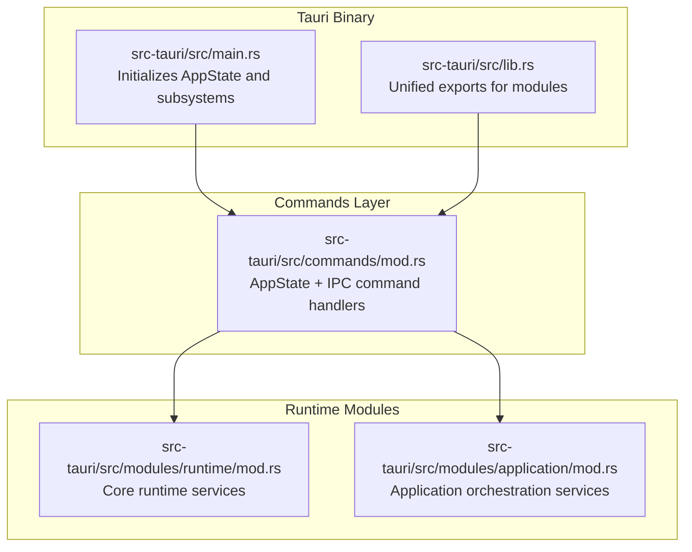

**Diagram sources**
- [main.rs:406-782](file://src-tauri/src/main.rs#L406-L782)
- [lib.rs:16-22](file://src-tauri/src/lib.rs#L16-L22)
- [commands/mod.rs:28-251](file://src-tauri/src/commands/mod.rs#L28-L251)
- [runtime/mod.rs:1-38](file://src-tauri/src/modules/runtime/mod.rs#L1-L38)
- [application/mod.rs:1-117](file://src-tauri/src/modules/application/mod.rs#L1-L117)

**Section sources**
- [lib.rs:16-22](file://src-tauri/src/lib.rs#L16-L22)
- [main.rs:406-782](file://src-tauri/src/main.rs#L406-L782)
- [commands/mod.rs:28-251](file://src-tauri/src/commands/mod.rs#L28-L251)
- [runtime/mod.rs:1-38](file://src-tauri/src/modules/runtime/mod.rs#L1-L38)
- [application/mod.rs:1-117](file://src-tauri/src/modules/application/mod.rs#L1-L117)

## Core Components
AppState aggregates the following core subsystems:
- Session management and project management for persistence and scoping
- Tool registry and execution context
- Memory infrastructure: provider selection, JobRunner, ThreatScanner, SessionSummaryStore, PinnedStore, MemoryCompiler, MemoryTicker
- Learning module and trajectory recording
- Active retrieval manager
- Runtime configuration and context budget
- Agent loop harness for observability
- Browser registry for session lifecycle
- Streaming and permission coordination channels

Key fields and roles:
- Shared providers and stores: memory_provider, summary_store, pinned_store, job_runner, threat_scanner, utility_llm
- Learning and trajectory: learning_module, trajectory_manager
- Runtime orchestration: memory_compiler, memory_ticker, active_retrieval_manager
- UX and diagnostics: harness, context_budget, onboarding_flow
- IPC coordination: permission_senders, permission_overrides, stream_cancel_senders

**Section sources**
- [commands/mod.rs:28-169](file://src-tauri/src/commands/mod.rs#L28-L169)
- [commands/mod.rs:174-251](file://src-tauri/src/commands/mod.rs#L174-L251)

## Architecture Overview
AppState is constructed once at application startup and injected into the Tauri runtime. It serves as the single source of truth for shared services and is accessed by command handlers and internal modules. The initialization process selects and configures memory providers, sets up background job coordination, builds the learning and trajectory systems, and wires runtime services.

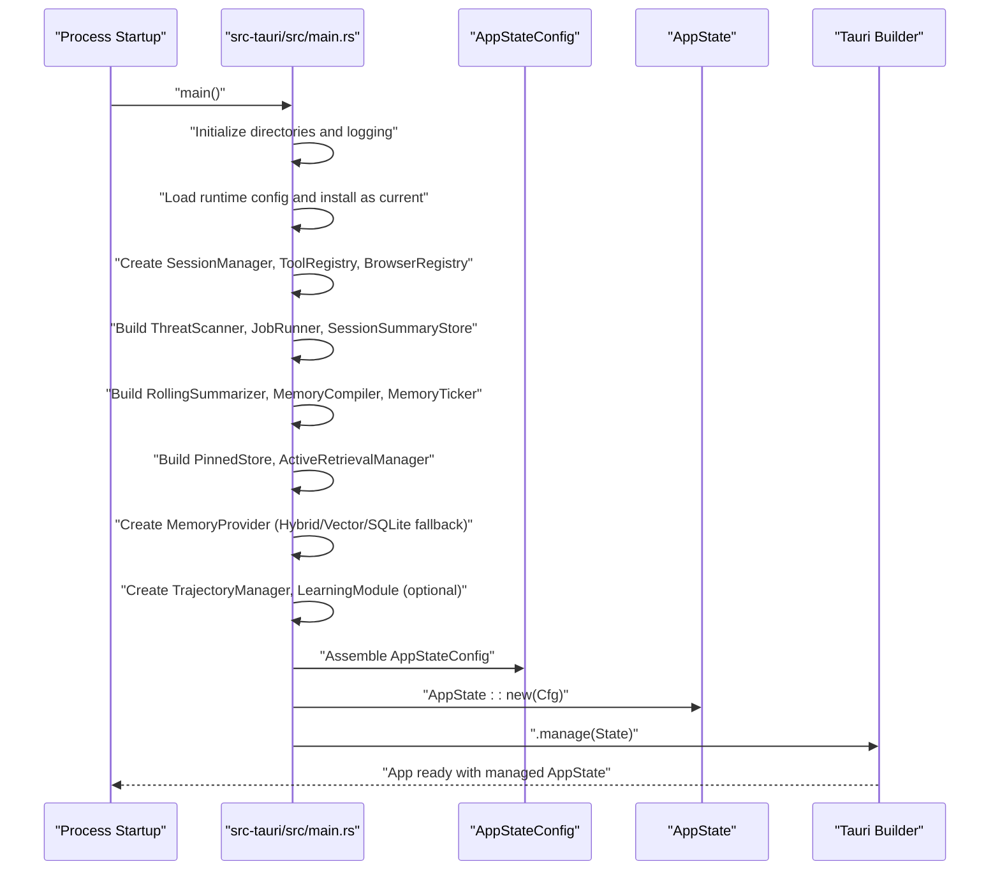

**Diagram sources**
- [main.rs:406-782](file://src-tauri/src/main.rs#L406-L782)
- [commands/mod.rs:174-251](file://src-tauri/src/commands/mod.rs#L174-L251)

## Detailed Component Analysis

### AppState Structure and Initialization
AppState encapsulates all shared state and collaborators. Construction is centralized in a single place to ensure consistent wiring and to avoid excessive argument lists. The configuration bundle (AppStateConfig) groups initialization inputs and is passed to AppState::new.

Initialization highlights:
- Logging and panic hooks are configured early
- Runtime configuration is loaded and installed globally
- Session and project managers are created with environment-aware directories
- Memory subsystems are built with fallback strategies and shared collaborators
- Browser registry is initialized with profile mode resolution
- Tool registry is registered with memory provider, scheduler, browser registry, and pinned store
- Optional subsystems (learning module, trajectory manager, harness) are conditionally created

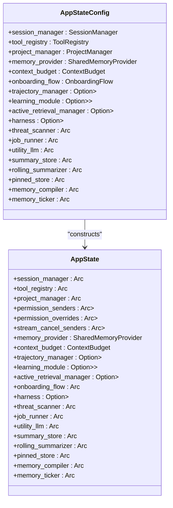

**Diagram sources**
- [commands/mod.rs:28-169](file://src-tauri/src/commands/mod.rs#L28-L169)
- [commands/mod.rs:174-251](file://src-tauri/src/commands/mod.rs#L174-L251)

**Section sources**
- [commands/mod.rs:28-169](file://src-tauri/src/commands/mod.rs#L28-L169)
- [commands/mod.rs:174-251](file://src-tauri/src/commands/mod.rs#L174-L251)

### Memory Provider Selection and Fallback Strategy
The memory provider is selected with a priority order and guarded by timeouts and fallbacks. The process evaluates environment flags, attempts hybrid/vector providers with timeouts, and falls back to SQLite or in-memory providers as needed. A shared ThreatScanner is attached to the provider to enforce security scanning on writes.

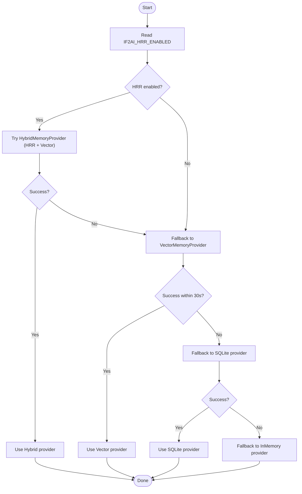

**Diagram sources**
- [main.rs:242-404](file://src-tauri/src/main.rs#L242-L404)

**Section sources**
- [main.rs:242-404](file://src-tauri/src/main.rs#L242-L404)

### JobRunner and Background Coordination
A shared JobRunner coordinates background memory tasks with retry budgets and concurrency limits. It is backed by a persistent database and can fall back to an ephemeral temporary database if the primary fails, ensuring graceful degradation.

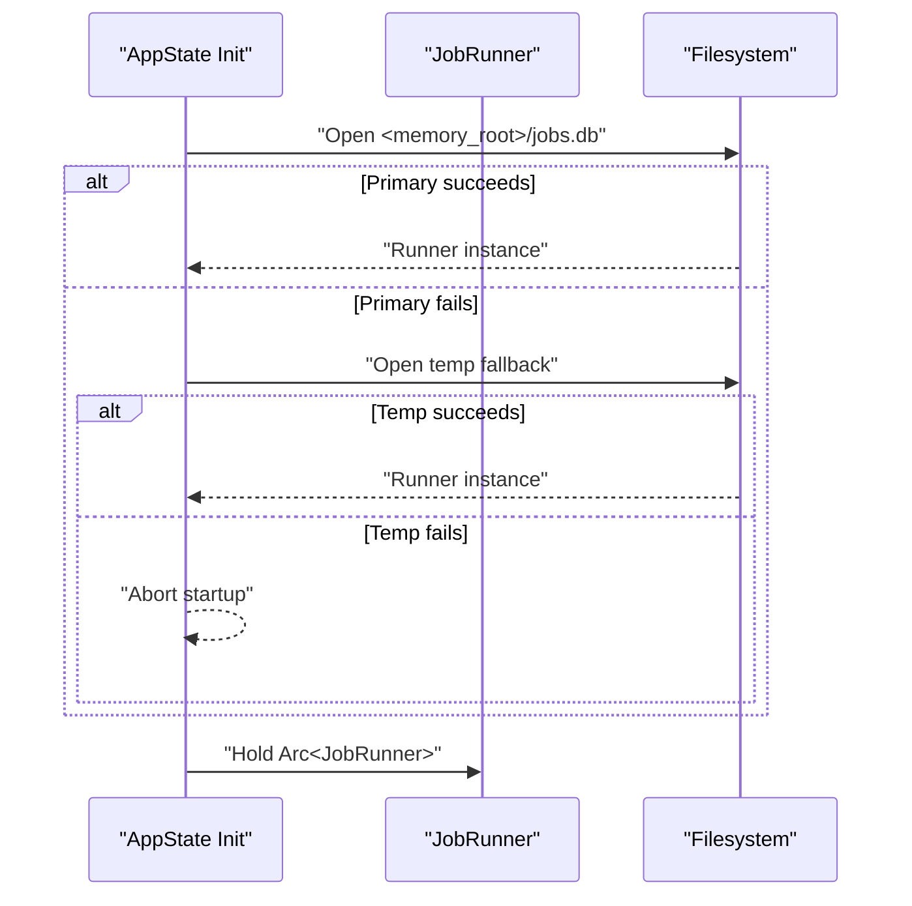

**Diagram sources**
- [main.rs:329-361](file://src-tauri/src/main.rs#L329-L361)

**Section sources**
- [main.rs:329-361](file://src-tauri/src/main.rs#L329-L361)

### Learning Module Lifecycle
The LearningModule is optional and initialized asynchronously with a dedicated runtime. It is wrapped in a mutex to coordinate concurrent access and is shared across turns to accumulate SelfModel state.

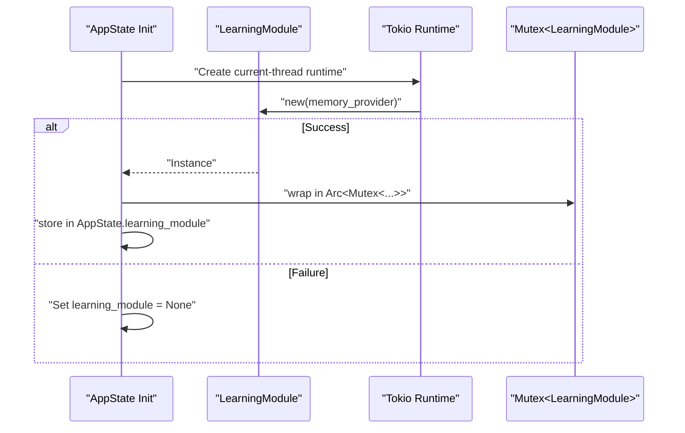

**Diagram sources**
- [main.rs:713-742](file://src-tauri/src/main.rs#L713-L742)

**Section sources**
- [main.rs:713-742](file://src-tauri/src/main.rs#L713-L742)

### Runtime Configuration and Context Budget
Runtime configuration is loaded at startup and installed as the process-wide current configuration. Context budget is loaded from a user-controlled YAML file with a fallback to default values. These enable dynamic behavior tuning without restarts.

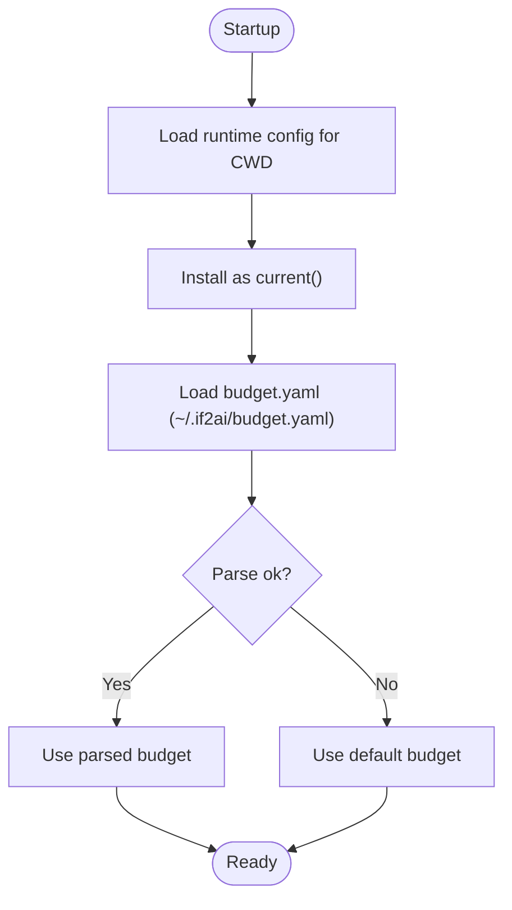

**Diagram sources**
- [main.rs:447-466](file://src-tauri/src/main.rs#L447-L466)
- [main.rs:682-690](file://src-tauri/src/main.rs#L682-L690)

**Section sources**
- [main.rs:447-466](file://src-tauri/src/main.rs#L447-L466)
- [main.rs:682-690](file://src-tauri/src/main.rs#L682-L690)

### Session and Project Management
SessionManager and ProjectManager are created with environment-aware directories. Sessions are persisted under a configurable sessions directory, and projects are managed separately. These are essential for scoping memory writes and organizing agent workspaces.

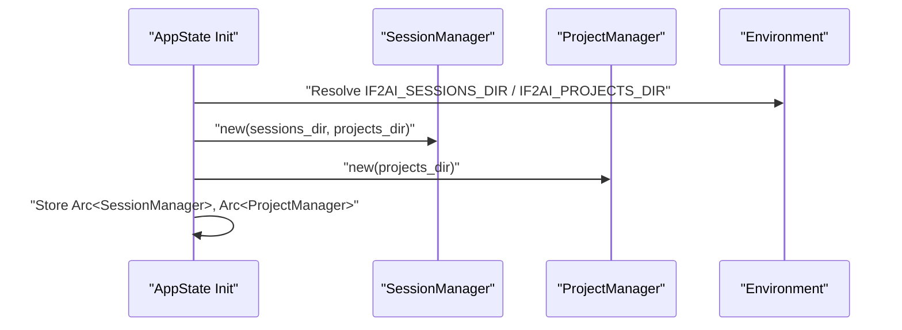

**Diagram sources**
- [main.rs:489-501](file://src-tauri/src/main.rs#L489-L501)

**Section sources**
- [main.rs:489-501](file://src-tauri/src/main.rs#L489-L501)

### Tool Registry and Browser Integration
The tool registry is initialized with a default tool context and registered with the memory provider, scheduler, browser registry, and pinned store. This ensures tools can access memory, scheduling, browser sessions, and pinned items consistently.

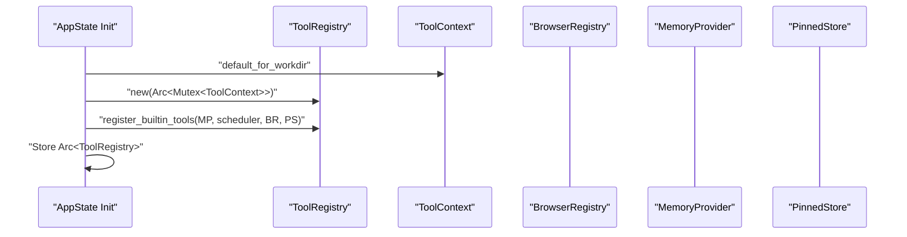

**Diagram sources**
- [main.rs:502-506](file://src-tauri/src/main.rs#L502-L506)
- [main.rs:669-675](file://src-tauri/src/main.rs#L669-L675)

**Section sources**
- [main.rs:502-506](file://src-tauri/src/main.rs#L502-L506)
- [main.rs:669-675](file://src-tauri/src/main.rs#L669-L675)

### Event-Driven Updates and Memory Ticker
The MemoryTicker is constructed once and held on AppState to drive periodic memory operations. The future ConversationRuntime will attach a TurnHook to invoke ticker notifications on turn completion, enabling event-driven updates without re-threading collaborators.

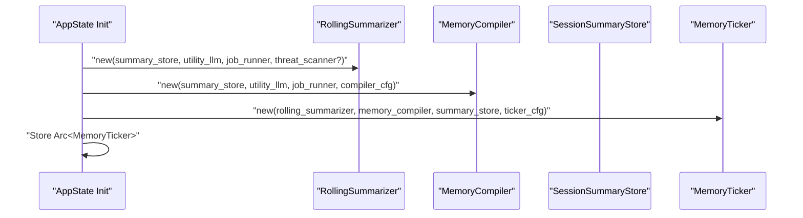

**Diagram sources**
- [main.rs:567-608](file://src-tauri/src/main.rs#L567-L608)

**Section sources**
- [main.rs:567-608](file://src-tauri/src/main.rs#L567-L608)

### State Mutations and IPC Coordination
AppState exposes several maps and channels for IPC coordination:
- permission_senders: keyed by session_id, used by respond_permission to deliver user decisions
- permission_overrides: keyed by session_id and tool_name, used for session-scoped permission overrides
- stream_cancel_senders: keyed by stream_id, used by stop_agent_stream to cancel in-flight streams

These are protected by Mutex to ensure thread-safe access across asynchronous command handlers.

**Section sources**
- [commands/mod.rs:36-45](file://src-tauri/src/commands/mod.rs#L36-L45)

### Persistence Patterns
AppState holds multiple persistence-capable collaborators:
- MemoryProvider: shared across scopes and tools
- SessionSummaryStore: SQLite-backed with JSON sidecars
- PinnedStore: SQLite-backed with markdown sidecar
- JobRunner: background job coordination with retry semantics
- TrajectoryManager: optional persistence of session trajectories

Fallbacks are implemented to keep the app bootable even when storage is unavailable.

**Section sources**
- [main.rs:539-565](file://src-tauri/src/main.rs#L539-L565)
- [main.rs:618-638](file://src-tauri/src/main.rs#L618-L638)
- [main.rs:329-361](file://src-tauri/src/main.rs#L329-L361)
- [main.rs:694-711](file://src-tauri/src/main.rs#L694-L711)

## Dependency Analysis
AppState depends on and coordinates the following subsystems:
- SessionManager and ProjectManager for persistence and scoping
- ToolRegistry for tool execution and context
- Memory subsystems (provider, stores, compiler, ticker, summarizer) for memory lifecycle
- LearningModule and TrajectoryManager for self-modeling and trajectory recording
- ActiveRetrievalManager for intent classification and fused recall
- Runtime configuration and context budget for behavior tuning
- BrowserRegistry for session lifecycle
- Harness for observability and evaluation

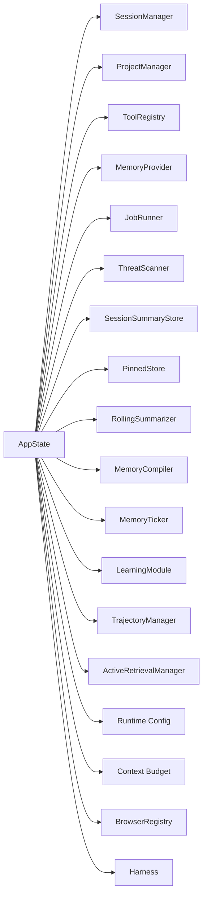

**Diagram sources**
- [commands/mod.rs:28-169](file://src-tauri/src/commands/mod.rs#L28-L169)
- [main.rs:501-782](file://src-tauri/src/main.rs#L501-L782)

**Section sources**
- [commands/mod.rs:28-169](file://src-tauri/src/commands/mod.rs#L28-L169)
- [main.rs:501-782](file://src-tauri/src/main.rs#L501-L782)

## Performance Considerations
- Provider selection uses timeouts and fallbacks to avoid blocking startup; vector provider creation is guarded to prevent long delays.
- JobRunner centralizes retries and concurrency to reduce contention and rate-limit LLM calls.
- Shared ThreatScanner avoids repeated regex compilation costs across memory write paths.
- MemoryTicker and RollingSummarizer are constructed once and reused to minimize allocations and context switching.
- Optional subsystems (learning module, trajectory manager, harness) are conditionally initialized to reduce overhead in production mode.

[No sources needed since this section provides general guidance]

## Troubleshooting Guide
Common issues and diagnostics:
- Memory provider initialization failures: Check logs for hybrid/vector provider errors and fallback to SQLite/in-memory. Verify environment flags and filesystem permissions.
- JobRunner open failures: If primary database fails, the system falls back to a temporary database; if both fail, startup aborts. Inspect filesystem permissions and disk health.
- Learning module initialization: If the module fails to initialize, it is disabled gracefully. Review logs for initialization errors and ensure required resources are available.
- Runtime configuration and budget: If budget.yaml parsing fails, defaults are used. Validate the YAML syntax and path resolution.
- Harness mode: Enabled via environment variable; ensure proper trace directory permissions if enabled.
- IPC coordination: Permission prompts and stream cancellation rely on AppState maps/channels. Verify keys and lifecycle of senders to prevent deadlocks.

**Section sources**
- [main.rs:242-404](file://src-tauri/src/main.rs#L242-L404)
- [main.rs:329-361](file://src-tauri/src/main.rs#L329-L361)
- [main.rs:713-742](file://src-tauri/src/main.rs#L713-L742)
- [main.rs:447-466](file://src-tauri/src/main.rs#L447-L466)
- [main.rs:682-690](file://src-tauri/src/main.rs#L682-L690)

## Conclusion
AppState centralizes the Rust backend’s subsystems, ensuring consistent initialization, robust fallbacks, and efficient coordination across memory, tools, learning, and runtime services. Its design supports thread-safe access, event-driven updates, and resilient persistence patterns. By maintaining a single source of truth and carefully managing dependencies, the application achieves reliable state consistency and maintainable evolution across phases and features.