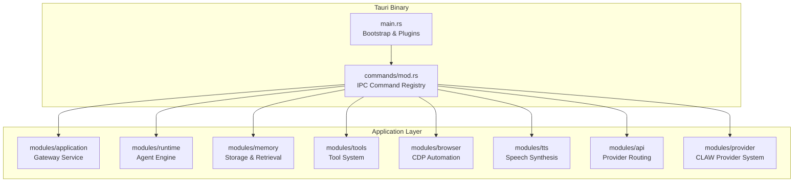
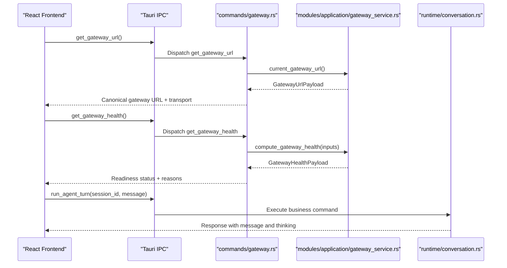
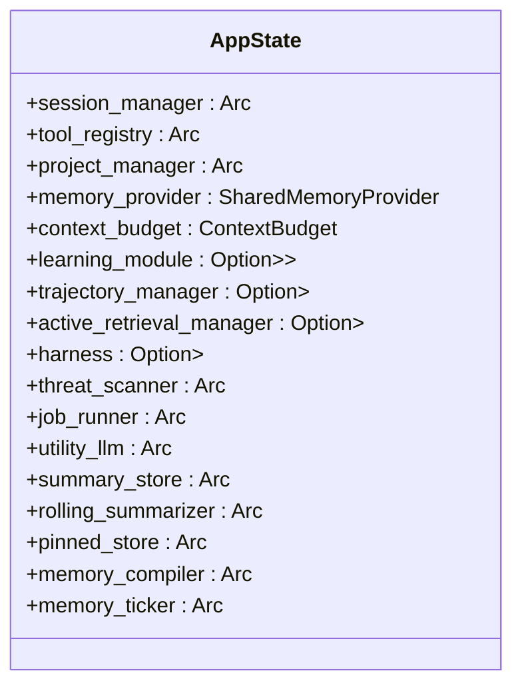
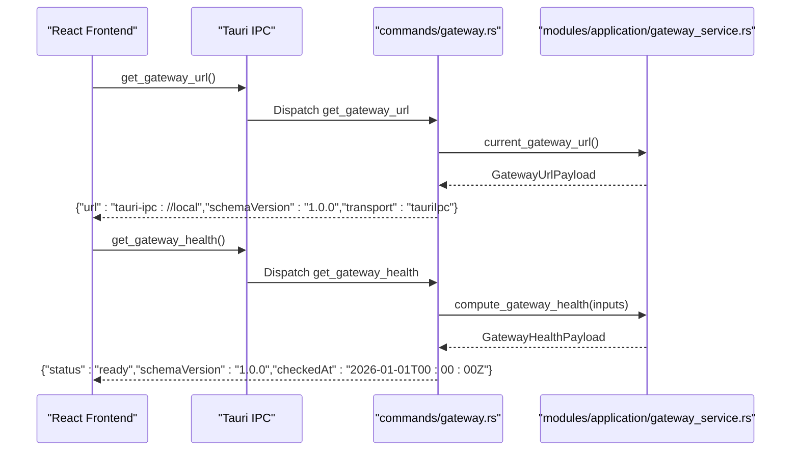
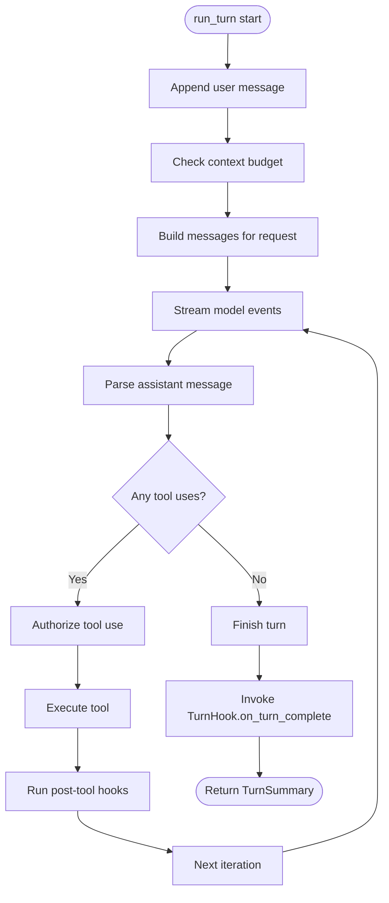
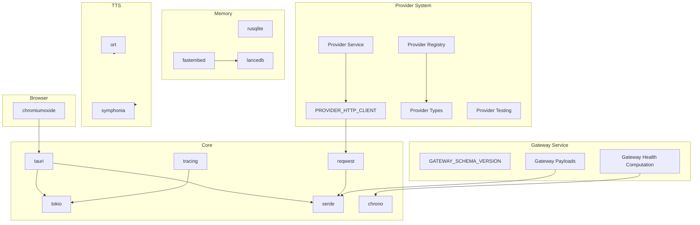

# Backend System (Rust)

<cite>
**Referenced Files in This Document**
- [Cargo.toml](file://src-tauri/Cargo.toml)
- [lib.rs](file://src-tauri/src/lib.rs)
- [main.rs](file://src-tauri/src/main.rs)
- [mod.rs](file://src-tauri/src/modules/mod.rs)
- [commands/mod.rs](file://src-tauri/src/commands/mod.rs)
- [commands/agent/mod.rs](file://src-tauri/src/commands/agent/mod.rs)
- [commands/agent/tests.rs](file://src-tauri/src/commands/agent/tests.rs)
- [commands/memory.rs](file://src-tauri/src/commands/memory.rs)
- [commands/gateway.rs](file://src-tauri/src/commands/gateway.rs)
- [modules/mod.rs](file://src-tauri/src/modules/mod.rs)
- [modules/application/mod.rs](file://src-tauri/src/modules/application/mod.rs)
- [modules/application/gateway_service.rs](file://src-tauri/src/modules/application/gateway_service.rs)
- [modules/runtime/mod.rs](file://src-tauri/src/modules/runtime/mod.rs)
- [modules/runtime/conversation.rs](file://src-tauri/src/modules/runtime/conversation.rs)
- [modules/api/mod.rs](file://src-tauri/src/modules/api/mod.rs)
- [modules/tools/mod.rs](file://src-tauri/src/modules/tools/mod.rs)
- [modules/memory/mod.rs](file://src-tauri/src/modules/memory/mod.rs)
- [modules/browser/mod.rs](file://src-tauri/src/modules/browser/mod.rs)
- [modules/tts/mod.rs](file://src-tauri/src/modules/tts/mod.rs)
- [modules/provider/mod.rs](file://src-tauri/src/modules/provider/mod.rs)
- [modules/provider/client.rs](file://src-tauri/src/modules/provider/client.rs)
- [modules/provider/registry.rs](file://src-tauri/src/modules/provider/registry.rs)
- [modules/provider/service.rs](file://src-tauri/src/modules/provider/service.rs)
- [modules/provider/test.rs](file://src-tauri/src/modules/provider/test.rs)
- [modules/provider/types.rs](file://src-tauri/src/modules/provider/types.rs)
- [workspace Cargo.toml](file://Cargo.toml)
</cite>

## Update Summary
**Changes Made**
- Added comprehensive documentation for the new local gateway bootstrap seam established through gateway_service.rs
- Documented the stable typed interface between desktop host and frontend bootstrap path
- Added documentation for canonical payload structures and schema versioning system
- Updated command handling system to include gateway commands (get_gateway_url, get_gateway_health)
- Enhanced architectural overview to include the new bootstrap layer
- Updated file path references to reflect the new gateway service module structure

## Table of Contents
1. [Introduction](#introduction)
2. [Project Structure](#project-structure)
3. [Core Components](#core-components)
4. [Architecture Overview](#architecture-overview)
5. [Detailed Component Analysis](#detailed-component-analysis)
6. [Dependency Analysis](#dependency-analysis)
7. [Performance Considerations](#performance-considerations)
8. [Troubleshooting Guide](#troubleshooting-guide)
9. [Conclusion](#conclusion)

## Introduction
This document describes the Rust-based backend for the Tauri application. The backend is responsible for system-level operations, state management, and orchestration of AI agent workflows, while the React frontend handles the user interface. The backend integrates Tauri's IPC to expose commands that drive agent turns, manage memory, control tools, and coordinate specialized subsystems such as browser automation, speech processing, and learning systems.

**Updated** The backend has undergone significant architectural improvements with the establishment of a new local gateway bootstrap seam through gateway_service.rs, creating a stable typed interface between the desktop host and frontend bootstrap path. This establishes canonical payload structures with schema versioning system and separates bootstrap concerns from business command responsibilities.

## Project Structure
The backend is organized around a unified module layout that aggregates functionality from multiple crates into a cohesive runtime. The structure emphasizes separation of concerns with recent architectural improvements:
- modules: Core subsystems (runtime, memory, tools, browser, tts, api, provider, application)
- commands: Tauri command handlers that expose backend capabilities to the frontend
- main.rs: Application bootstrap, state initialization, and Tauri plugin registration

**Updated** The application layer now includes a dedicated gateway service module that provides bootstrap and readiness services, separating them from business command responsibilities. The gateway service establishes canonical payload structures with schema versioning for frontend integration.

**Diagram sources**
- [main.rs:406-800](file://src-tauri/src/main.rs#L406-L800)
- [lib.rs:1-23](file://src-tauri/src/lib.rs#L1-L23)
- [modules/mod.rs:1-68](file://src-tauri/src/modules/mod.rs#L1-L68)
- [modules/application/mod.rs:45-65](file://src-tauri/src/modules/application/mod.rs#L45-L65)

**Section sources**
- [lib.rs:1-23](file://src-tauri/src/lib.rs#L1-L23)
- [modules/mod.rs:1-68](file://src-tauri/src/modules/mod.rs#L1-L68)
- [modules/application/mod.rs:45-65](file://src-tauri/src/modules/application/mod.rs#L45-L65)
- [main.rs:406-800](file://src-tauri/src/main.rs#L406-L800)

## Core Components
- AppState: Central state container holding shared services and providers. It coordinates:
  - Session and project managers
  - Tool registry
  - Memory provider and related subsystems (summary store, pinned store, compiler, ticker)
  - Learning module and trajectory manager
  - Active retrieval manager
  - Threat scanner and job runner
  - Harness state for agent loop observability
- Tauri command handlers: Exposed via #[tauri::command] macros, they accept frontend requests, validate inputs, and delegate to modules for execution.
- Runtime engine: ConversationRuntime orchestrates a single turn, manages permissions, tool execution, and usage tracking, and supports hooks for memory subsystems.
- **Updated** Gateway service: Provides bootstrap and readiness services with canonical payload structures and schema versioning for frontend integration.

**Updated** The gateway service establishes a stable typed interface between the desktop host and frontend bootstrap path, separating bootstrap concerns from business command responsibilities. It provides get_gateway_url and get_gateway_health commands with schema versioning support.

Key implementation references:
- AppState definition and fields: [commands/mod.rs:29-169](file://src-tauri/src/commands/mod.rs#L29-L169)
- Command registration and exports: [commands/mod.rs:254-418](file://src-tauri/src/commands/mod.rs#L254-L418)
- Gateway service exports: [modules/application/mod.rs:68-71](file://src-tauri/src/modules/application/mod.rs#L68-L71)
- Gateway commands: [commands/gateway.rs:29-49](file://src-tauri/src/commands/gateway.rs#L29-L49)
- Agent turn execution: [commands/agent/mod.rs:179-736](file://src-tauri/src/commands/agent/mod.rs#L179-L736)
- Runtime engine and hooks: [modules/runtime/conversation.rs:182-547](file://src-tauri/src/modules/runtime/conversation.rs#L182-L547)

**Section sources**
- [commands/mod.rs:29-169](file://src-tauri/src/commands/mod.rs#L29-L169)
- [commands/mod.rs:254-418](file://src-tauri/src/commands/mod.rs#L254-L418)
- [modules/application/mod.rs:68-71](file://src-tauri/src/modules/application/mod.rs#L68-L71)
- [commands/gateway.rs:29-49](file://src-tauri/src/commands/gateway.rs#L29-L49)
- [commands/agent/mod.rs:179-736](file://src-tauri/src/commands/agent/mod.rs#L179-L736)
- [modules/runtime/conversation.rs:182-547](file://src-tauri/src/modules/runtime/conversation.rs#L182-L547)

## Architecture Overview
The backend follows a layered architecture:
- Presentation: Tauri IPC commands exposed to the React frontend
- **Updated** Bootstrap Layer: Gateway service provides stable bootstrap and readiness signals
- Orchestration: Commands in commands/... delegate to modules for domain-specific logic
- Domain Services: Modules encapsulate runtime, memory, tools, browser, tts, api, and application services
- Persistence: Memory providers (SQLite, Vector, Hybrid) and auxiliary stores (summary, pinned)
- Observability: Harness for telemetry and event collection

**Updated** The architecture now includes a dedicated bootstrap layer with the gateway service providing canonical payload structures and schema versioning. This separates bootstrap concerns from business command responsibilities, enabling future transport cutover to local HTTP while maintaining backward compatibility.

**Diagram sources**
- [commands/gateway.rs:29-49](file://src-tauri/src/commands/gateway.rs#L29-L49)
- [modules/application/gateway_service.rs:105-176](file://src-tauri/src/modules/application/gateway_service.rs#L105-L176)
- [modules/runtime/conversation.rs:358-515](file://src-tauri/src/modules/runtime/conversation.rs#L358-L515)

**Section sources**
- [commands/gateway.rs:29-49](file://src-tauri/src/commands/gateway.rs#L29-L49)
- [modules/application/gateway_service.rs:105-176](file://src-tauri/src/modules/application/gateway_service.rs#L105-L176)
- [modules/runtime/conversation.rs:358-515](file://src-tauri/src/modules/runtime/conversation.rs#L358-L515)

## Detailed Component Analysis

### Application State Management (AppState)
AppState centralizes shared state and collaborator instances:
- Session and project managers for persistence and scoping
- Tool registry for tool discovery and execution
- Memory subsystems: provider, summary store, pinned store, compiler, ticker, job runner, threat scanner
- Learning module and trajectory manager
- Active retrieval manager
- Harness state for agent loop observability

Initialization flow:
- main.rs constructs AppState by assembling collaborators, including memory provider selection (Hybrid/Vector/SQLite), JobRunner, ThreatScanner, and other subsystems.
- The state is injected into Tauri via .manage(app_state) so commands can access it via tauri::State<AppState>.

References:
- [main.rs:513-782](file://src-tauri/src/main.rs#L513-L782)
- [commands/mod.rs:221-251](file://src-tauri/src/commands/mod.rs#L221-L251)

**Diagram sources**
- [commands/mod.rs:29-169](file://src-tauri/src/commands/mod.rs#L29-L169)

**Section sources**
- [main.rs:513-782](file://src-tauri/src/main.rs#L513-L782)
- [commands/mod.rs:29-169](file://src-tauri/src/commands/mod.rs#L29-L169)

### Command Handling System (IPC)
Commands are defined with #[tauri::command] and exported from commands/mod.rs. Examples include:
- **Updated** Gateway commands: get_gateway_url, get_gateway_health
- Agent commands: run_agent_turn, start_agent_stream, stop_agent_stream
- Memory commands: memory_recall, memory_delete, memory_export, memory_promote/demote, memory_compile_now, memory_compiled_read/clear
- Browser commands: request_browser_status, request_browser_takeover, release_browser_takeover, get_browser_sessions, set_browser_settings
- Tools commands: execute_tool, get_tool_definitions, list_tools, list_toolsets
- TTS commands: tts_synthesize, tts_stream_start/stream_result/stream_close, tts_model_status, tts_voice_audio
- Settings and configuration commands: get_memory_config, set_memory_config, config_load/save/validate

**Updated** The gateway commands provide bootstrap and readiness services separate from business commands. They establish a stable interface for frontend integration with schema versioning and canonical payload structures.

Processing flow:
- Frontend calls a Tauri command
- Tauri routes to the corresponding #[tauri::command] handler
- Handler reads AppState, validates inputs, and executes domain logic
- Results are serialized and returned to the frontend

References:
- [commands/mod.rs:254-418](file://src-tauri/src/commands/mod.rs#L254-L418)
- [commands/gateway.rs:29-49](file://src-tauri/src/commands/gateway.rs#L29-L49)
- [commands/agent/mod.rs:179-736](file://src-tauri/src/commands/agent/mod.rs#L179-L736)
- [commands/memory.rs:143-219](file://src-tauri/src/commands/memory.rs#L143-L219)

**Diagram sources**
- [commands/gateway.rs:29-49](file://src-tauri/src/commands/gateway.rs#L29-L49)
- [modules/application/gateway_service.rs:105-176](file://src-tauri/src/modules/application/gateway_service.rs#L105-L176)

**Section sources**
- [commands/mod.rs:254-418](file://src-tauri/src/commands/mod.rs#L254-L418)
- [commands/gateway.rs:29-49](file://src-tauri/src/commands/gateway.rs#L29-L49)
- [commands/agent/mod.rs:179-736](file://src-tauri/src/commands/agent/mod.rs#L179-L736)
- [commands/memory.rs:143-219](file://src-tauri/src/commands/memory.rs#L143-L219)

### Gateway Service (New Bootstrap Seam)
**Updated** The gateway service establishes a new local gateway bootstrap seam that creates a stable typed interface between the desktop host and frontend bootstrap path:

#### Canonical Payload Structures
The gateway service defines two core payload structures with schema versioning:

**GatewayUrlPayload**
- url: Canonical entry URL (currently "tauri-ipc://local", will become real HTTP URL in future)
- schema_version: Matches GATEWAY_SCHEMA_VERSION constant
- transport: GatewayTransport enum (TauriIpc today, LocalHttp reserved for future)

**GatewayHealthPayload**
- status: GatewayStatus enum (Initializing, Ready, Degraded)
- schema_version: Matches GATEWAY_SCHEMA_VERSION constant
- reason: Optional human-readable reason (present when status is Degraded)
- checked_at: RFC3339 UTC timestamp of health snapshot

#### Schema Versioning System
- GATEWAY_SCHEMA_VERSION: "1.0.0" - bumped on breaking changes
- Ensures frontend can refuse to bootstrap against incompatible backend versions
- Maintains wire compatibility through serde rename_all = "camelCase"

#### Health Computation Logic
The compute_gateway_health function treats optional subsystems as non-critical:
- Trajectory manager, learning module, active retrieval manager are considered non-critical
- Missing any non-critical subsystem yields Degraded status rather than Initializing
- All critical subsystems must be ready for Ready status

#### Command Implementation
- get_gateway_url: Pure/synchronous command returning canonical URL and transport
- get_gateway_health: Reads AppState to determine readiness from optional subsystems

**Section sources**
- [modules/application/gateway_service.rs:1-230](file://src-tauri/src/modules/application/gateway_service.rs#L1-L230)
- [commands/gateway.rs:1-50](file://src-tauri/src/commands/gateway.rs#L1-L50)
- [modules/application/mod.rs:68-71](file://src-tauri/src/modules/application/mod.rs#L68-L71)

### Agent Command System (Modular)
**Updated** The agent command system has been successfully modularized into a dedicated directory structure:

- **Main Implementation**: commands/agent/mod.rs contains the core agent commands including run_agent_turn and start_agent_stream
- **Unit Tests**: commands/agent/tests.rs maintains comprehensive test coverage for agent functionality
- **Command Registration**: Both modules are properly integrated into the main commands/mod.rs export system

The modular structure provides:
- Clear separation of concerns with business logic in mod.rs and tests in tests.rs
- Improved maintainability and testability
- Better code organization following Rust best practices
- Preserved functionality while enhancing development workflow

Key features of the modular agent system:
- run_agent_turn: Handles single-turn agent execution with comprehensive error handling and memory management
- start_agent_stream: Manages streaming agent responses with event emission
- Comprehensive testing suite for end-to-end scenarios
- Proper integration with AppState and runtime components

**Section sources**
- [commands/agent/mod.rs:1-800](file://src-tauri/src/commands/agent/mod.rs#L1-L800)
- [commands/agent/tests.rs:1-145](file://src-tauri/src/commands/agent/tests.rs#L1-L145)
- [commands/mod.rs:287-290](file://src-tauri/src/commands/mod.rs#L287-L290)

### Provider System (Decomposed)
**Updated** The CLAW provider system has been comprehensively decomposed into specialized modules under modules/provider/:

#### Provider Module Structure
- **mod.rs**: Main module entry point with re-exports for commonly used types and functions
- **client.rs**: Shared HTTP client management with connection pooling and keepalive
- **registry.rs**: Builtin provider registry with 16 pre-configured providers (Local, International, Domestic categories)
- **service.rs**: Service layer for provider operations including model listing and configuration
- **test.rs**: Provider connection testing with protocol-specific implementations
- **types.rs**: Type definitions for providers, models, categories, and status indicators

#### Provider Capabilities
The decomposed system supports:
- **16 Built-in Providers**: Including Ollama, OpenAI, Anthropic, Google, and various domestic providers
- **Multi-Protocol Support**: Ollama, Anthropic-compatible, and OpenAI-compatible APIs
- **Connection Testing**: Protocol-specific validation with detailed error reporting
- **Model Management**: Dynamic model listing and selection with authentication handling
- **Configuration Management**: Persistent provider and model configuration storage

#### Specialized Functions
- **list_providers()**: Returns all 16 builtin providers with categorization
- **test_provider_connection()**: Validates API connectivity with detailed error codes
- **list_models()**: Fetches available models per provider with protocol-specific implementations
- **configure_provider()**: Saves provider configuration via ConfigService
- **select_model()**: Manages model selection and active model configuration

**Section sources**
- [modules/provider/mod.rs:1-25](file://src-tauri/src/modules/provider/mod.rs#L1-L25)
- [modules/provider/client.rs:1-22](file://src-tauri/src/modules/provider/client.rs#L1-L22)
- [modules/provider/registry.rs:1-415](file://src-tauri/src/modules/provider/registry.rs#L1-L415)
- [modules/provider/service.rs:1-397](file://src-tauri/src/modules/provider/service.rs#L1-L397)
- [modules/provider/test.rs:1-495](file://src-tauri/src/modules/provider/test.rs#L1-L495)
- [modules/provider/types.rs:1-265](file://src-tauri/src/modules/provider/types.rs#L1-L265)

### Runtime Engine and Hooks
The runtime engine drives a single agent turn:
- Prepares the system prompt and message list
- Streams model events and builds assistant messages
- Executes tool calls with permission checks
- Tracks usage and supports working memory sliding window
- Invokes TurnHook after successful turns for background jobs

References:
- [modules/runtime/conversation.rs:358-515](file://src-tauri/src/modules/runtime/conversation.rs#L358-L515)

**Diagram sources**
- [modules/runtime/conversation.rs:358-515](file://src-tauri/src/modules/runtime/conversation.rs#L358-L515)

**Section sources**
- [modules/runtime/conversation.rs:358-515](file://src-tauri/src/modules/runtime/conversation.rs#L358-L515)

### Memory Subsystem
The memory module provides:
- MemoryProvider trait with store/recall/export and scoped variants
- Providers: SQLite, Vector (FastEmbed + LanceDB), and Hybrid (HRR + Vector)
- Security: ThreatScanner for PII/redaction and audit emissions
- Stores: SessionSummaryStore, PinnedStore
- Compiler and Ticker for compiled memory sections
- JobRunner for background jobs with retry and rate limiting

Initialization and selection:
- main.rs selects a provider based on environment flags and availability, with fallbacks to SQLite and in-memory
- JobRunner is opened with a persistent database path and fallback to ephemeral

References:
- [modules/memory/mod.rs:204-380](file://src-tauri/src/modules/memory/mod.rs#L204-L380)
- [main.rs:250-404](file://src-tauri/src/main.rs#L250-L404)

**Section sources**
- [modules/memory/mod.rs:204-380](file://src-tauri/src/modules/memory/mod.rs#L204-L380)
- [main.rs:250-404](file://src-tauri/src/main.rs#L250-L404)

### Tool System
The tool system registers built-in tools at startup and exposes them via the registry:
- File operations, web search/fetch, browser automation, memory tools, scheduler/cron, skills, and utilities
- Tools are executed with permission policies and can produce multimodal results

References:
- [modules/tools/mod.rs:26-173](file://src-tauri/src/modules/tools/mod.rs#L26-L173)

**Section sources**
- [modules/tools/mod.rs:26-173](file://src-tauri/src/modules/tools/mod.rs#L26-L173)

### Browser Automation
The browser subsystem automates Chrome/Chromium via CDP:
- Multi-session registry, session lifecycle, navigation, scrolling, and action logging
- Profile management and persistence across restarts
- Events emission for UI updates

References:
- [modules/browser/mod.rs:1-40](file://src-tauri/src/modules/browser/mod.rs#L1-L40)

**Section sources**
- [modules/browser/mod.rs:1-40](file://src-tauri/src/modules/browser/mod.rs#L1-L40)

### Speech Processing (TTS)
The TTS module defines the TTS provider abstraction and supporting types:
- TtsProvider trait for synthesis, streaming, warmup, and voice operations
- AudioSink for streaming PCM chunks
- Types for synthesis parameters, results, and streaming metrics

References:
- [modules/tts/mod.rs:62-209](file://src-tauri/src/modules/tts/mod.rs#L62-L209)

**Section sources**
- [modules/tts/mod.rs:62-209](file://src-tauri/src/modules/tts/mod.rs#L62-L209)

### API Provider Integration
The API module manages provider clients and routing:
- Provider kinds and client abstractions
- SSE parsing and streaming
- OAuth token handling and base URL resolution

References:
- [modules/api/mod.rs:1-40](file://src-tauri/src/modules/api/mod.rs#L1-L40)

**Section sources**
- [modules/api/mod.rs:1-40](file://src-tauri/src/modules/api/mod.rs#L1-L40)

## Dependency Analysis
External dependencies and crates are declared in the workspace Cargo.toml and member Cargo.toml. Key categories include:
- Tauri and plugins for desktop integration
- Tokio for asynchronous runtime
- reqwest for HTTP and SSE
- rusqlite/lancedb/fastembed for memory and embeddings
- chromiumoxide for browser automation
- ort/symphonia for TTS
- tracing ecosystem for logging

**Updated** The gateway service introduces additional dependencies for schema versioning and timestamp handling through chrono crate. The provider system introduces additional dependencies for HTTP client management and specialized provider integrations.

**Diagram sources**
- [Cargo.toml:8-95](file://src-tauri/Cargo.toml#L8-L95)
- [workspace Cargo.toml:1-48](file://Cargo.toml#L1-L48)
- [modules/provider/client.rs:15-21](file://src-tauri/src/modules/provider/client.rs#L15-L21)
- [modules/application/gateway_service.rs:25-29](file://src-tauri/src/modules/application/gateway_service.rs#L25-L29)

**Section sources**
- [Cargo.toml:8-95](file://src-tauri/Cargo.toml#L8-L95)
- [workspace Cargo.toml:1-48](file://Cargo.toml#L1-L48)

## Performance Considerations
- Asynchronous runtime: Tokio is used pervasively for I/O-bound operations (HTTP, SSE, filesystem) and background jobs.
- Memory provider selection: The backend attempts a hybrid/vector provider first, with SQLite fallback and in-memory fallback, ensuring robustness and performance tuning.
- JobRunner: Centralized background job execution with retry limits and concurrency controls to prevent resource contention.
- Logging: Structured logging with rolling file appender and environment-based filters for observability without impacting performance.
- Build profiles: Workspace-level profile tuning optimizes dependency builds and incremental compilation trade-offs.
- **Updated** Gateway service efficiency: The gateway commands are designed to be zero-cost in steady state, pure/synchronous operations that can be called before any business command without performance impact.

**Updated** The provider system implements connection pooling through a shared HTTP client (PROVIDER_HTTP_CLIENT) to minimize overhead and improve performance for repeated API calls. The modular architecture also improves compilation times and enables better code reuse across different subsystems.

## Troubleshooting Guide
Common areas to investigate:
- Memory provider initialization failures: Check logs for provider selection and fallback paths; verify filesystem permissions and environment variables affecting feature flags.
- JobRunner failures: Inspect persistent database path and fallback to ephemeral mode; review failure counters and retry budgets.
- Runtime errors: ConversationRuntime returns specific error variants (API/tool/permission/session/config/max iterations). Map these to friendly messages for the frontend.
- Browser automation: Validate Chrome binary discovery and profile persistence; ensure environment allows CDP connections.
- TTS model downloads and warmup: Confirm model cache directories and ONNX runtime readiness; monitor warmup results and device usage.
- **Updated** Gateway service issues: Check schema version mismatches between frontend and backend; verify gateway URL payload structure; ensure health computation reflects actual subsystem states.

**Updated** Gateway service troubleshooting:
- Schema version mismatch: Use frontend GATEWAY_SCHEMA_VERSION constant to compare with backend GATEWAY_SCHEMA_VERSION
- Gateway URL validation: Verify synthetic URL "tauri-ipc://local" and transport tag consistency
- Health computation: Check AppState optional subsystems (trajectory_manager, learning_module, active_retrieval_manager)
- Transport readiness: Ensure GatewayTransport::TauriIpc is properly serialized as "tauriIpc" in camelCase

References:
- [main.rs:336-361](file://src-tauri/src/main.rs#L336-L361)
- [commands/agent.rs:664-721](file://src-tauri/src/commands/agent.rs#L664-L721)
- [modules/runtime/conversation.rs:118-157](file://src-tauri/src/modules/runtime/conversation.rs#L118-L157)
- [modules/application/gateway_service.rs:178-229](file://src-tauri/src/modules/application/gateway_service.rs#L178-L229)

**Section sources**
- [main.rs:336-361](file://src-tauri/src/main.rs#L336-L361)
- [commands/agent.rs:664-721](file://src-tauri/src/commands/agent.rs#L664-L721)
- [modules/runtime/conversation.rs:118-157](file://src-tauri/src/modules/runtime/conversation.rs#L118-L157)
- [modules/application/gateway_service.rs:178-229](file://src-tauri/src/modules/application/gateway_service.rs#L178-L229)

## Conclusion
The Rust backend provides a robust, modular foundation for the Tauri application. It coordinates state via AppState, exposes capabilities through Tauri IPC commands, and orchestrates domain-specific modules for runtime, memory, tools, browser automation, and speech processing.

**Updated** Recent architectural improvements include the establishment of a new local gateway bootstrap seam through gateway_service.rs, creating a stable typed interface between the desktop host and frontend bootstrap path. This introduces canonical payload structures with schema versioning system, separating bootstrap concerns from business command responsibilities. The gateway service provides get_gateway_url and get_gateway_health commands that enable future transport cutover while maintaining backward compatibility.

The backend has undergone significant architectural refactoring with the agent command system decomposed into modular directory structure and the CLAW provider system broken down into specialized components for improved maintainability and separation of concerns. The gateway service establishes a foundation for future transport evolution while preserving all existing functionality. The architecture leverages asynchronous processing, structured logging, and resilient provider selection to deliver a secure and performant desktop agent experience.