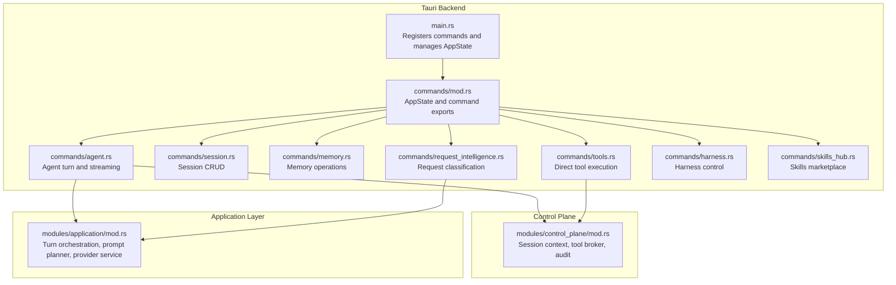
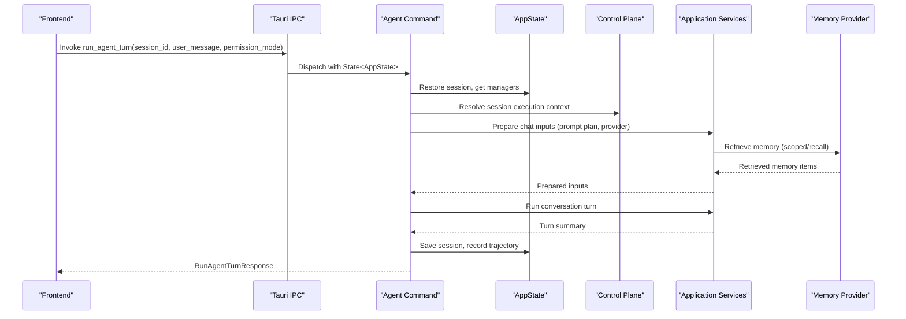
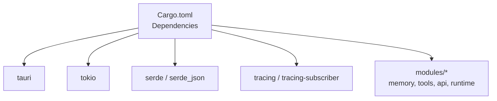

# Command Handling System

<cite>
**Referenced Files in This Document**
- [main.rs](file://src-tauri/src/main.rs)
- [lib.rs](file://src-tauri/src/lib.rs)
- [commands/mod.rs](file://src-tauri/src/commands/mod.rs)
- [commands/agent.rs](file://src-tauri/src/commands/agent.rs)
- [commands/session.rs](file://src-tauri/src/commands/session.rs)
- [commands/memory.rs](file://src-tauri/src/commands/memory.rs)
- [commands/tools.rs](file://src-tauri/src/commands/tools.rs)
- [commands/request_intelligence.rs](file://src-tauri/src/commands/request_intelligence.rs)
- [commands/harness.rs](file://src-tauri/src/commands/harness.rs)
- [commands/skills_hub.rs](file://src-tauri/src/commands/skills_hub.rs)
- [modules/control_plane/mod.rs](file://src-tauri/src/modules/control_plane/mod.rs)
- [modules/application/mod.rs](file://src-tauri/src/modules/application/mod.rs)
- [Cargo.toml](file://src-tauri/Cargo.toml)
</cite>

## Table of Contents
1. [Introduction](#introduction)
2. [Project Structure](#project-structure)
3. [Core Components](#core-components)
4. [Architecture Overview](#architecture-overview)
5. [Detailed Component Analysis](#detailed-component-analysis)
6. [Dependency Analysis](#dependency-analysis)
7. [Performance Considerations](#performance-considerations)
8. [Troubleshooting Guide](#troubleshooting-guide)
9. [Conclusion](#conclusion)

## Introduction
This document describes the command handling system that processes Tauri IPC requests in the If2Ai desktop application. It covers the command registration mechanism, parameter validation, response formatting, and the control plane architecture for request classification, session context management, and tool execution coordination. It also documents error handling patterns, asynchronous command processing, command lifecycle management, security considerations, rate limiting, and performance optimization techniques. Finally, it explains how commands integrate with the agent loop harness and outlines request/response schemas for key commands.

## Project Structure
The command handling system is implemented in the Rust backend under the `src-tauri/src/commands` directory. Each command is defined as a `#[tauri::command]` function that receives a shared `State<AppState>` and returns a `Result<T, String>`. The `AppState` struct aggregates shared services such as session managers, tool registries, memory providers, and harness state. The main entry point registers all commands with Tauri and initializes the application state.

**Diagram sources**
- [main.rs:1-226](file://src-tauri/src/main.rs#L1-L226)
- [commands/mod.rs:1-418](file://src-tauri/src/commands/mod.rs#L1-L418)
- [modules/control_plane/mod.rs:1-32](file://src-tauri/src/modules/control_plane/mod.rs#L1-L32)
- [modules/application/mod.rs:1-117](file://src-tauri/src/modules/application/mod.rs#L1-L117)

**Section sources**
- [main.rs:1-226](file://src-tauri/src/main.rs#L1-L226)
- [lib.rs:1-23](file://src-tauri/src/lib.rs#L1-L23)
- [commands/mod.rs:1-418](file://src-tauri/src/commands/mod.rs#L1-L418)

## Core Components
- AppState: Central shared state containing session manager, tool registry, memory provider, context budget, harness, and other subsystems. It is injected into all commands via Tauri's state management.
- Command Registration: All commands are declared in `commands/mod.rs` and re-exported from `main.rs` for Tauri to register.
- Control Plane: Provides session context resolution, tool execution brokerage, and audit/emission facilities used by commands.
- Application Layer: Provides orchestration services (turn preparation, prompt planning, provider resolution) used by agent commands.

Key responsibilities:
- Parameter validation: Commands validate inputs (e.g., JSON parsing, permission mode parsing, scope building) and return descriptive errors.
- Response formatting: Commands return strongly-typed structs serialized to JSON for the frontend.
- Async processing: Commands leverage async runtime for I/O-bound operations (memory reads, tool execution, provider calls).
- Lifecycle management: Commands coordinate session restoration, execution context creation, and persistence of results.

**Section sources**
- [commands/mod.rs:28-169](file://src-tauri/src/commands/mod.rs#L28-L169)
- [modules/control_plane/mod.rs:1-32](file://src-tauri/src/modules/control_plane/mod.rs#L1-L32)
- [modules/application/mod.rs:1-117](file://src-tauri/src/modules/application/mod.rs#L1-L117)

## Architecture Overview
The command handling architecture follows a layered design:
- IPC Adapter Layer: `#[tauri::command]` functions in `commands/*.rs` accept parameters, validate them, and delegate to application services.
- Control Plane Layer: Resolves session contexts, enforces permissions, and brokers tool execution.
- Application Layer: Orchestrates prompts, provider selection, and memory retrieval/injection.
- Persistence and Providers: Session manager, memory provider, tool registry, and harness state are accessed via `AppState`.

**Diagram sources**
- [commands/agent.rs:160-722](file://src-tauri/src/commands/agent.rs#L160-L722)
- [modules/application/mod.rs:114-116](file://src-tauri/src/modules/application/mod.rs#L114-L116)
- [modules/control_plane/mod.rs:29-31](file://src-tauri/src/modules/control_plane/mod.rs#L29-L31)

## Detailed Component Analysis

### Command Registration Mechanism
- All commands are declared in individual files under `src-tauri/src/commands/` and re-exported in `commands/mod.rs`.
- `main.rs` imports and registers all commands with Tauri, ensuring they are available to the frontend.
- The `AppState` is managed by Tauri and injected into each command via `State<'_, AppState>`.

Validation and error handling:
- Commands parse and validate inputs (e.g., JSON for tool execution, permission modes).
- Errors are returned as `Result<T, String>`, with user-friendly messages for common failure modes (network timeouts, authentication, permission denials).

Response formatting:
- Commands define dedicated DTOs (e.g., `RunAgentTurnResponse`, `MemoryEntryDto`, `ToolDefinition`) that serialize to JSON for the frontend.

**Section sources**
- [commands/mod.rs:279-418](file://src-tauri/src/commands/mod.rs#L279-L418)
- [main.rs:9-226](file://src-tauri/src/main.rs#L9-L226)

### Parameter Validation Patterns
- JSON parsing: Tools command validates JSON arguments and returns descriptive errors for malformed input.
- Permission mode parsing: Agent commands parse and apply permission policies consistently across streaming and non-streaming paths.
- Scope building: Memory commands build execution scopes from optional parameters, gracefully degrading when identifiers are missing.

Examples of validation locations:
- Tool execution: [commands/tools.rs:138-140](file://src-tauri/src/commands/tools.rs#L138-L140)
- Permission enforcement: [commands/tools.rs:176-198](file://src-tauri/src/commands/tools.rs#L176-L198)
- Scope resolution: [commands/memory.rs:112-132](file://src-tauri/src/commands/memory.rs#L112-L132)

**Section sources**
- [commands/tools.rs:127-257](file://src-tauri/src/commands/tools.rs#L127-L257)
- [commands/memory.rs:105-132](file://src-tauri/src/commands/memory.rs#L105-L132)

### Response Formatting
- Strongly-typed DTOs are defined per command to ensure consistent serialization.
- Examples:
  - Agent turn response: [commands/agent.rs:100-110](file://src-tauri/src/commands/agent.rs#L100-L110)
  - Memory entry DTO: [commands/memory.rs:53-84](file://src-tauri/src/commands/memory.rs#L53-L84)
  - Tool definition DTO: [commands/tools.rs:15-37](file://src-tauri/src/commands/tools.rs#L15-L37)

**Section sources**
- [commands/agent.rs:100-110](file://src-tauri/src/commands/agent.rs#L100-L110)
- [commands/memory.rs:53-84](file://src-tauri/src/commands/memory.rs#L53-L84)
- [commands/tools.rs:15-37](file://src-tauri/src/commands/tools.rs#L15-L37)

### Control Plane Architecture
- Session context resolution: Commands use `SessionContextResolver` to derive execution context from session/project/workdir.
- Tool execution brokerage: `ToolExecutionBroker` coordinates tool dispatch with permission enforcement and auditing.
- Audit emission: `AuditEmitter` records policy decisions and operational events for observability.

Integration points:
- Agent commands resolve execution context and prepare chat inputs via application services.
- Tools command enforces permissions and delegates execution through the broker.

**Section sources**
- [commands/agent.rs:120-132](file://src-tauri/src/commands/agent.rs#L120-L132)
- [commands/tools.rs:156-158](file://src-tauri/src/commands/tools.rs#L156-L158)
- [modules/control_plane/mod.rs:14-31](file://src-tauri/src/modules/control_plane/mod.rs#L14-L31)

### Session Context Management
- Session commands manage session lifecycle: creation, listing, deletion, renaming, pinning, and toggling memory enablement.
- Agent commands restore sessions, compute turn numbers, and persist updated sessions after execution.

Key flows:
- Session restoration and saving: [commands/agent.rs:183-188](file://src-tauri/src/commands/agent.rs#L183-L188), [commands/agent.rs:435-440](file://src-tauri/src/commands/agent.rs#L435-L440)
- Session listing and CRUD: [commands/session.rs:10-135](file://src-tauri/src/commands/session.rs#L10-L135)

**Section sources**
- [commands/agent.rs:183-188](file://src-tauri/src/commands/agent.rs#L183-L188)
- [commands/agent.rs:435-440](file://src-tauri/src/commands/agent.rs#L435-L440)
- [commands/session.rs:10-135](file://src-tauri/src/commands/session.rs#L10-L135)

### Tool Execution Coordination
- Direct tool execution: The `execute_tool` command validates JSON arguments, resolves session context, enforces permissions, and dispatches to the tool registry or broker.
- Tool discovery: `list_tools` and `get_tool_definitions` expose tool metadata in OpenAI-compatible format.

Security and validation:
- Permission policy evaluation prevents unauthorized tool execution.
- Explicit context requirement for tools that need session/project binding.

**Section sources**
- [commands/tools.rs:127-257](file://src-tauri/src/commands/tools.rs#L127-L257)
- [commands/tools.rs:259-308](file://src-tauri/src/commands/tools.rs#L259-L308)

### Memory Operations
- Memory recall: Supports scoped and unscoped recall with category filtering and limits.
- Memory promotion/demotion: Surfaces candidates and transitions entries across global/project/session scopes.
- Compiled memory: Manual triggers for memory compilation and read/clear operations.

Scope handling:
- Optional scope kinds (Global, Project, Session) with graceful fallback when identifiers are missing.

**Section sources**
- [commands/memory.rs:134-171](file://src-tauri/src/commands/memory.rs#L134-L171)
- [commands/memory.rs:283-347](file://src-tauri/src/commands/memory.rs#L283-L347)
- [commands/memory.rs:559-668](file://src-tauri/src/commands/memory.rs#L559-L668)

### Request Intelligence Classification
- Advisory classifier returns an execution mode decision without altering the execution path.
- Decision is logged and optionally emitted as a harness event for observability.

**Section sources**
- [commands/request_intelligence.rs:53-89](file://src-tauri/src/commands/request_intelligence.rs#L53-L89)

### Harness Control Commands
- Recording control: Start/stop recording for sessions, query status, and telemetry snapshots.
- Report management: Begin runs, finalize and rotate runs, aggregate suite reports, compare reports, and evaluate gates.
- Non-blocking operations: Telemetry queries and report operations are designed for low-latency feedback.

**Section sources**
- [commands/harness.rs:46-106](file://src-tauri/src/commands/harness.rs#L46-L106)
- [commands/harness.rs:140-214](file://src-tauri/src/commands/harness.rs#L140-L214)
- [commands/harness.rs:317-360](file://src-tauri/src/commands/harness.rs#L317-L360)

### Skills Hub Commands
- Marketplace operations: Browse, search, inspect, check, update, audit, uninstall, publish, snapshot import/export, and tap management.
- Security scanning: Installation pipeline includes quarantine, security scan, and lock file updates.

**Section sources**
- [commands/skills_hub.rs:81-126](file://src-tauri/src/commands/skills_hub.rs#L81-L126)
- [commands/skills_hub.rs:448-559](file://src-tauri/src/commands/skills_hub.rs#L448-L559)

### Agent Loop Integration
- Turn lifecycle: Agent commands emit harness events for turn start/end, capture timing, and record trajectory data.
- Memory integration: After-turn memory promotion scans and quality gates are triggered post-execution.

**Section sources**
- [commands/agent.rs:195-210](file://src-tauri/src/commands/agent.rs#L195-L210)
- [commands/agent.rs:649-657](file://src-tauri/src/commands/agent.rs#L649-L657)

## Dependency Analysis
The command system relies on a set of core dependencies defined in the Tauri backend Cargo manifest. These include Tauri itself, Tokio for async runtime, tracing for observability, and various modules for memory, tools, API clients, and browser control.

**Diagram sources**
- [Cargo.toml:8-94](file://src-tauri/Cargo.toml#L8-L94)

**Section sources**
- [Cargo.toml:8-94](file://src-tauri/Cargo.toml#L8-L94)

## Performance Considerations
- Asynchronous execution: Commands use async I/O for memory operations, tool execution, and provider calls to avoid blocking the main thread.
- Working memory budget: Agent commands track token usage against a configurable budget to prevent excessive memory consumption.
- Context compaction: Sessions are compacted when exceeding token thresholds to maintain performance.
- Memory importance decay: Applies Weibull decay to reduce importance of unused entries, improving recall performance.
- Lazy initialization: Some subsystems (e.g., TTS providers) are lazily initialized to reduce cold-start latency.

[No sources needed since this section provides general guidance]

## Troubleshooting Guide
Common error scenarios and handling:
- Network timeouts and provider errors: Agent commands translate common network errors into user-friendly messages and log detailed reasons.
- Permission denials: Tools command enforces permission policies and returns deny reasons with trace IDs for auditing.
- Session errors: Session commands return descriptive errors for invalid IDs or persistence failures.
- Memory operations: Memory commands return errors for invalid keys, scope mismatches, or provider failures.

Diagnostic tips:
- Use harness telemetry to correlate events and timings.
- Check audit logs for policy decisions and security scans.
- Validate JSON arguments for tool execution commands.

**Section sources**
- [commands/agent.rs:664-721](file://src-tauri/src/commands/agent.rs#L664-L721)
- [commands/tools.rs:176-198](file://src-tauri/src/commands/tools.rs#L176-L198)
- [commands/session.rs:61-70](file://src-tauri/src/commands/session.rs#L61-L70)

## Conclusion
The If2Ai command handling system provides a robust, layered architecture for processing Tauri IPC requests. It emphasizes strong typing, validation, and clear separation of concerns between IPC adapters, control plane services, and application orchestration. The system integrates tightly with the agent loop harness for observability, supports comprehensive permission enforcement, and offers performance optimizations such as working memory budgets and context compaction. Together, these mechanisms deliver a secure, observable, and efficient command processing pipeline suitable for complex agent-driven workflows.