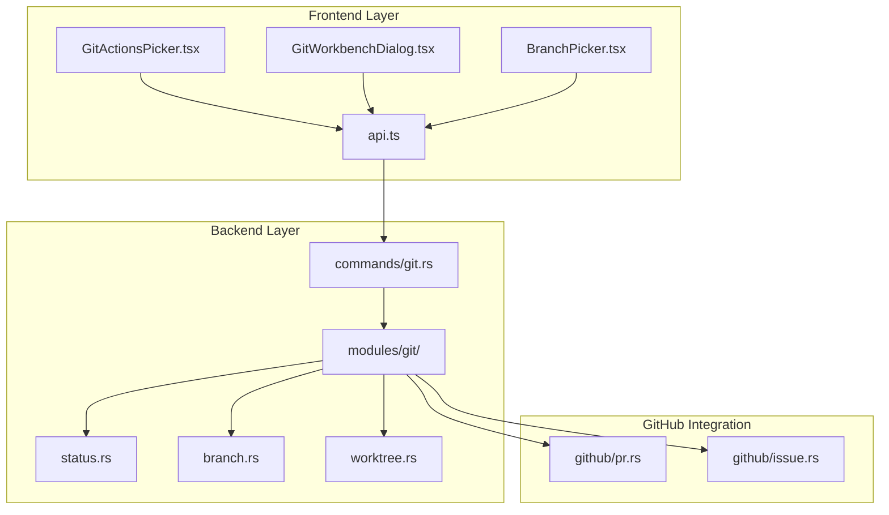
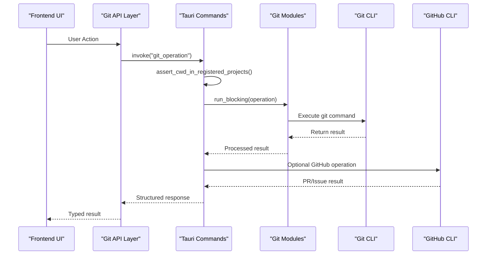
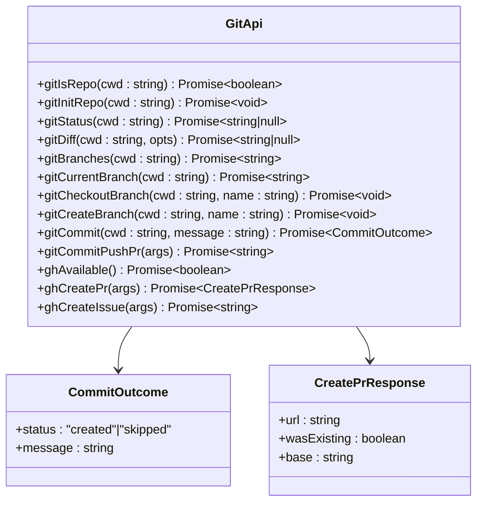
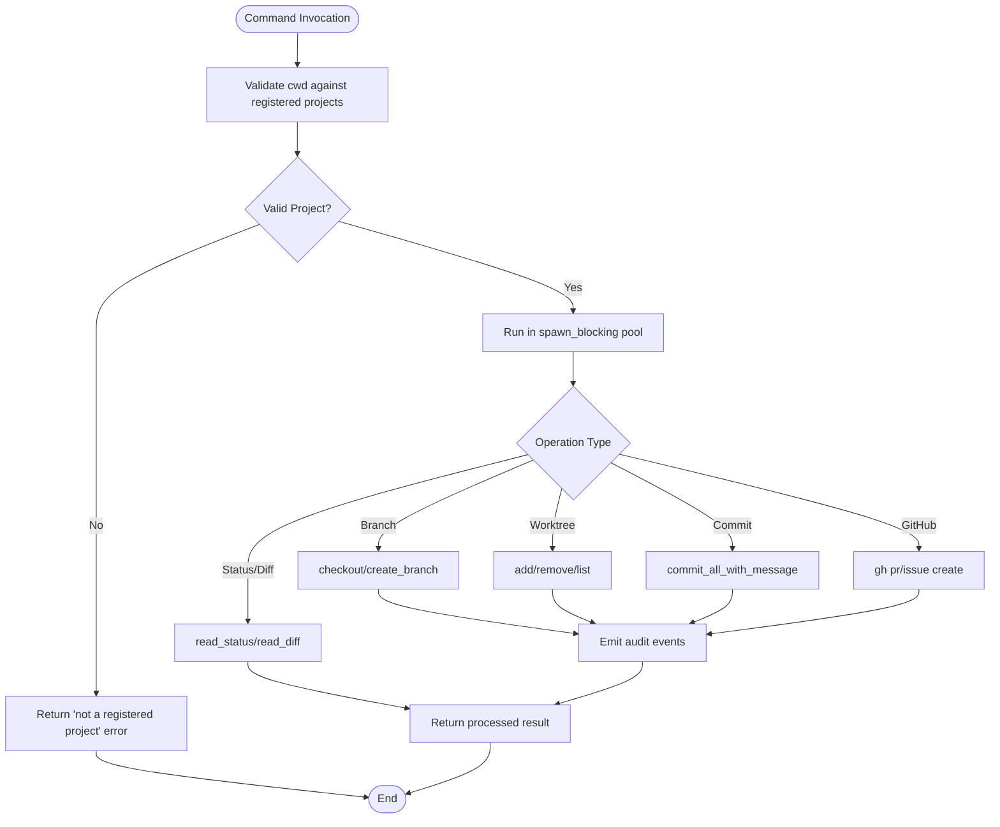
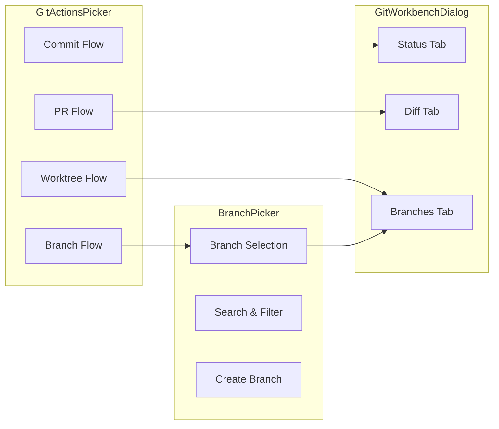

# Git Integration

<cite>
**Referenced Files in This Document**
- [api.ts](file://src/modules/git/api.ts)
- [git.rs](file://src-tauri/src/commands/git.rs)
- [GitWorkbenchDialog.tsx](file://src/components/chat/GitWorkbenchDialog.tsx)
- [GitActionsPicker.tsx](file://src/components/chat/GitActionsPicker.tsx)
- [BranchPicker.tsx](file://src/components/chat/BranchPicker.tsx)
- [status.rs](file://src-tauri/src/modules/git/status.rs)
- [branch.rs](file://src-tauri/src/modules/git/branch.rs)
- [index.md](file://docs/final_design/git/index.md)
- [02-implementation.md](file://docs/final_design/git/02-implementation.md)
</cite>

## Table of Contents
1. [Introduction](#introduction)
2. [Project Structure](#project-structure)
3. [Core Components](#core-components)
4. [Architecture Overview](#architecture-overview)
5. [Detailed Component Analysis](#detailed-component-analysis)
6. [Dependency Analysis](#dependency-analysis)
7. [Performance Considerations](#performance-considerations)
8. [Troubleshooting Guide](#troubleshooting-guide)
9. [Conclusion](#conclusion)

## Introduction

The Git Integration module provides comprehensive version control capabilities within the If2Ai application, combining a robust Rust backend with a user-friendly TypeScript/React frontend. This system enables developers to manage Git repositories, branches, worktrees, and GitHub interactions directly from the application interface.

The integration follows a strict security model with sandbox guards, comprehensive error handling, and audit logging for all Git operations. It supports both interactive UI workflows and automated slash commands for seamless development experiences.

## Project Structure

The Git Integration is organized across three main layers:



**Diagram sources**
- [api.ts:1-284](file://src/modules/git/api.ts#L1-L284)
- [git.rs:1-663](file://src-tauri/src/commands/git.rs#L1-L663)
- [status.rs:1-210](file://src-tauri/src/modules/git/status.rs#L1-L210)
- [branch.rs:1-241](file://src-tauri/src/modules/git/branch.rs#L1-L241)

**Section sources**
- [api.ts:1-284](file://src/modules/git/api.ts#L1-L284)
- [git.rs:1-663](file://src-tauri/src/commands/git.rs#L1-L663)

## Core Components

### Frontend Git API Layer

The frontend provides a strongly-typed interface for Git operations through the `api.ts` module, which serves as the sole sanctioned entry-point for git operations from the UI.

Key features include:
- **Typed IPC Bindings**: All commands return promises with specific result shapes
- **Consistent Argument Structure**: Every git operation uses `{ cwd, ...rest }` pattern
- **Error Handling**: Non-recoverable errors are surfaced as displayable strings
- **Idempotent Operations**: Clean tree commits return success without rejection

### Backend Command Layer

The Rust backend implements comprehensive Git functionality with security and performance considerations:

- **Sandbox Guards**: All operations require explicit project registration verification
- **Audit Logging**: Complete traceability for all Git operations
- **Async Safety**: Long-running operations run in blocking pools
- **Error Propagation**: Structured error handling with meaningful messages

### UI Components

The frontend consists of three primary components working together:

1. **GitActionsPicker**: Main action menu for commit, branch creation, PR creation, and worktree management
2. **GitWorkbenchDialog**: Three-tab read-only view for status, diff, and branch inspection
3. **BranchPicker**: Branch selection and management interface

**Section sources**
- [api.ts:21-284](file://src/modules/git/api.ts#L21-L284)
- [git.rs:48-154](file://src-tauri/src/commands/git.rs#L48-L154)

## Architecture Overview

The Git Integration follows a layered architecture with clear separation of concerns:



**Diagram sources**
- [git.rs:62-87](file://src-tauri/src/commands/git.rs#L62-L87)
- [git.rs:38-46](file://src-tauri/src/commands/git.rs#L38-L46)

The architecture ensures:
- **Security**: All operations validated against registered projects
- **Performance**: Blocking operations isolated from async runtime
- **Reliability**: Comprehensive error handling and audit trails
- **Extensibility**: Modular design supporting future Git operations

## Detailed Component Analysis

### Git API Module

The `api.ts` module provides a comprehensive typed interface for Git operations:



**Diagram sources**
- [api.ts:26-45](file://src/modules/git/api.ts#L26-L45)
- [api.ts:239-251](file://src/modules/git/api.ts#L239-L251)

**Section sources**
- [api.ts:48-284](file://src/modules/git/api.ts#L48-L284)

### Backend Command Implementation

The Rust backend implements comprehensive Git functionality with security and performance considerations:



**Diagram sources**
- [git.rs:62-87](file://src-tauri/src/commands/git.rs#L62-L87)
- [git.rs:102-154](file://src-tauri/src/commands/git.rs#L102-L154)

**Section sources**
- [git.rs:156-663](file://src-tauri/src/commands/git.rs#L156-L663)

### UI Component Integration

The frontend components work together to provide a cohesive Git experience:



**Diagram sources**
- [GitActionsPicker.tsx:152-274](file://src/components/chat/GitActionsPicker.tsx#L152-L274)
- [GitWorkbenchDialog.tsx:67-136](file://src/components/chat/GitWorkbenchDialog.tsx#L67-L136)
- [BranchPicker.tsx:113-145](file://src/components/chat/BranchPicker.tsx#L113-L145)

**Section sources**
- [GitActionsPicker.tsx:1-718](file://src/components/chat/GitActionsPicker.tsx#L1-L718)
- [GitWorkbenchDialog.tsx:1-420](file://src/components/chat/GitWorkbenchDialog.tsx#L1-L420)
- [BranchPicker.tsx:1-434](file://src/components/chat/BranchPicker.tsx#L1-L434)

## Dependency Analysis

The Git Integration has a well-defined dependency structure:

```mermaid
graph TD
subgraph "External Dependencies"
A[Git CLI]
B[GitHub CLI (gh)]
C[Tauri Runtime]
end
subgraph "Internal Dependencies"
D[commands/git.rs]
E[modules/git/status.rs]
F[modules/git/branch.rs]
G[modules/git/worktree.rs]
H[modules/git/github/]
end
subgraph "Frontend Dependencies"
I[api.ts]
J[GitActionsPicker.tsx]
K[GitWorkbenchDialog.tsx]
L[BranchPicker.tsx]
end
A --> D
B --> H
C --> D
D --> E
D --> F
D --> G
D --> H
I --> D
J --> I
K --> I
L --> I
```

**Diagram sources**
- [git.rs:24-31](file://src-tauri/src/commands/git.rs#L24-L31)
- [status.rs:9](file://src-tauri/src/modules/git/status.rs#L9)
- [branch.rs:13](file://src-tauri/src/modules/git/branch.rs#L13)

**Section sources**
- [git.rs:17-32](file://src-tauri/src/commands/git.rs#L17-L32)
- [status.rs:1-10](file://src-tauri/src/modules/git/status.rs#L1-L10)

## Performance Considerations

The Git Integration implements several performance optimization strategies:

### Asynchronous Design
- **Blocking Pool Isolation**: Long-running Git operations execute in dedicated blocking threads
- **Async Runtime Protection**: Prevents blocking the main async executor with subprocess calls
- **Concurrent Operations**: Multiple Git operations can run simultaneously without interference

### Caching and Memoization
- **Repository Detection**: Efficient `.git` directory probing without unnecessary filesystem traversal
- **Path Resolution**: Canonicalized path caching to avoid repeated filesystem operations
- **Audit Trail Optimization**: Minimal overhead for security auditing

### Memory Management
- **Streaming Results**: Large diff outputs are processed incrementally to prevent memory spikes
- **Lazy Loading**: Git operations are deferred until UI components actually need them
- **Resource Cleanup**: Proper cleanup of temporary files and process handles

## Troubleshooting Guide

### Common Issues and Solutions

**Git Binary Not Found**
- Verify Git is installed and accessible in PATH
- Check system environment variables
- Restart application after Git installation

**Permission Denied Errors**
- Ensure project directory belongs to registered projects
- Verify file system permissions for repository location
- Check antivirus software interference

**Network Issues with GitHub**
- Verify `gh` CLI installation and authentication
- Check internet connectivity
- Review GitHub API rate limits

**Performance Issues**
- Monitor system resource usage during large operations
- Consider repository size limitations
- Optimize diff viewing modes for large changesets

**Section sources**
- [git.rs:48-87](file://src-tauri/src/commands/git.rs#L48-L87)
- [GitActionsPicker.tsx:263-274](file://src/components/chat/GitActionsPicker.tsx#L263-L274)

## Conclusion

The Git Integration provides a comprehensive, secure, and performant solution for version control within the If2Ai application. The modular architecture ensures maintainability while the strong typing and comprehensive error handling provide reliability.

Key strengths include:
- **Security-First Design**: Complete sandbox protection for all Git operations
- **Comprehensive Coverage**: Full support for Git workflows and GitHub integration
- **Performance Optimization**: Carefully designed asynchronous architecture
- **Developer Experience**: Intuitive UI components with robust error handling

The integration successfully bridges the gap between traditional Git workflows and modern AI-assisted development, enabling seamless collaboration between human developers and AI agents.