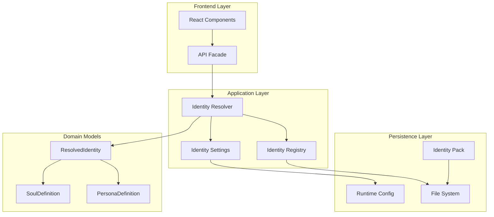
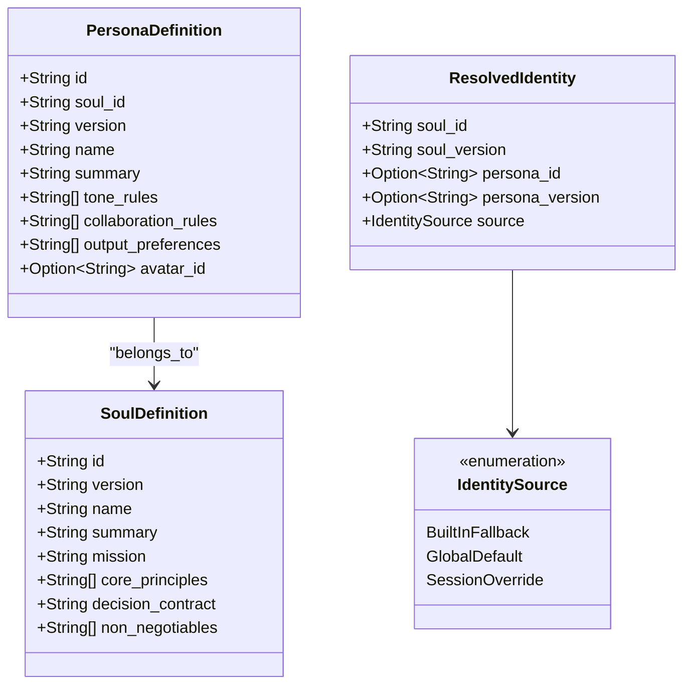
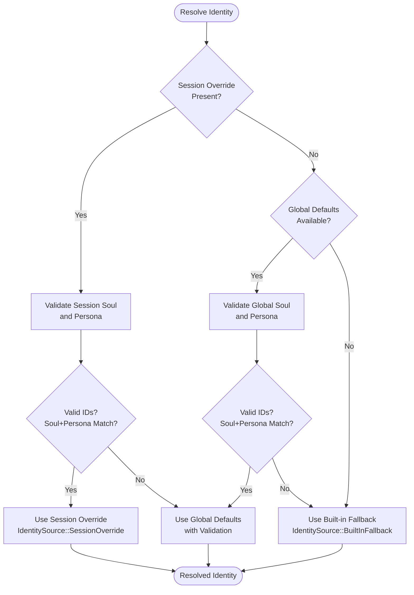
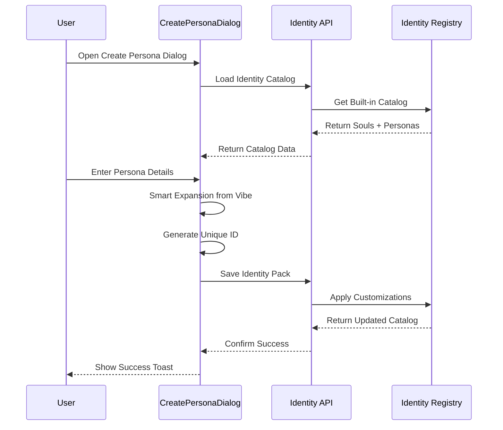
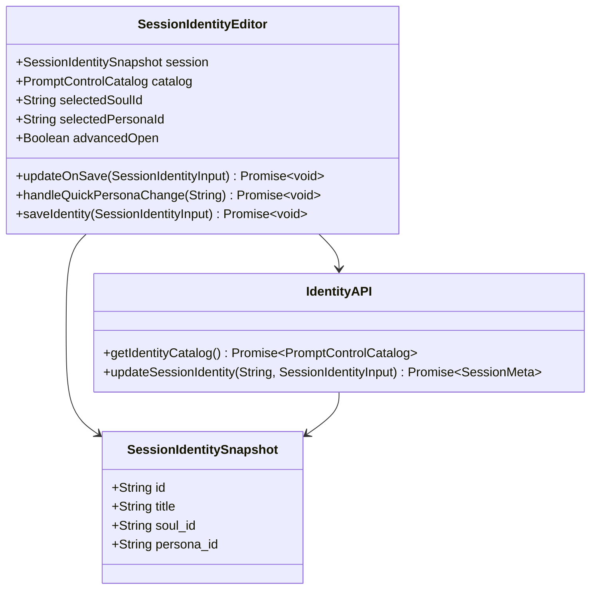
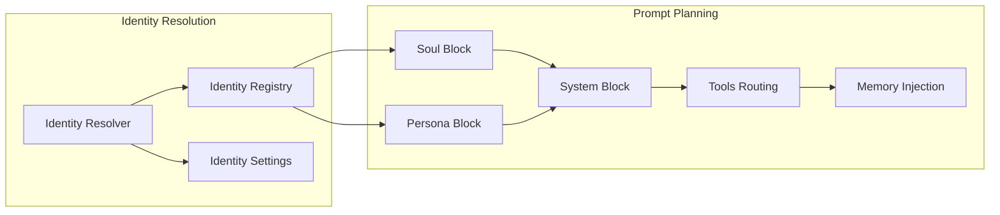
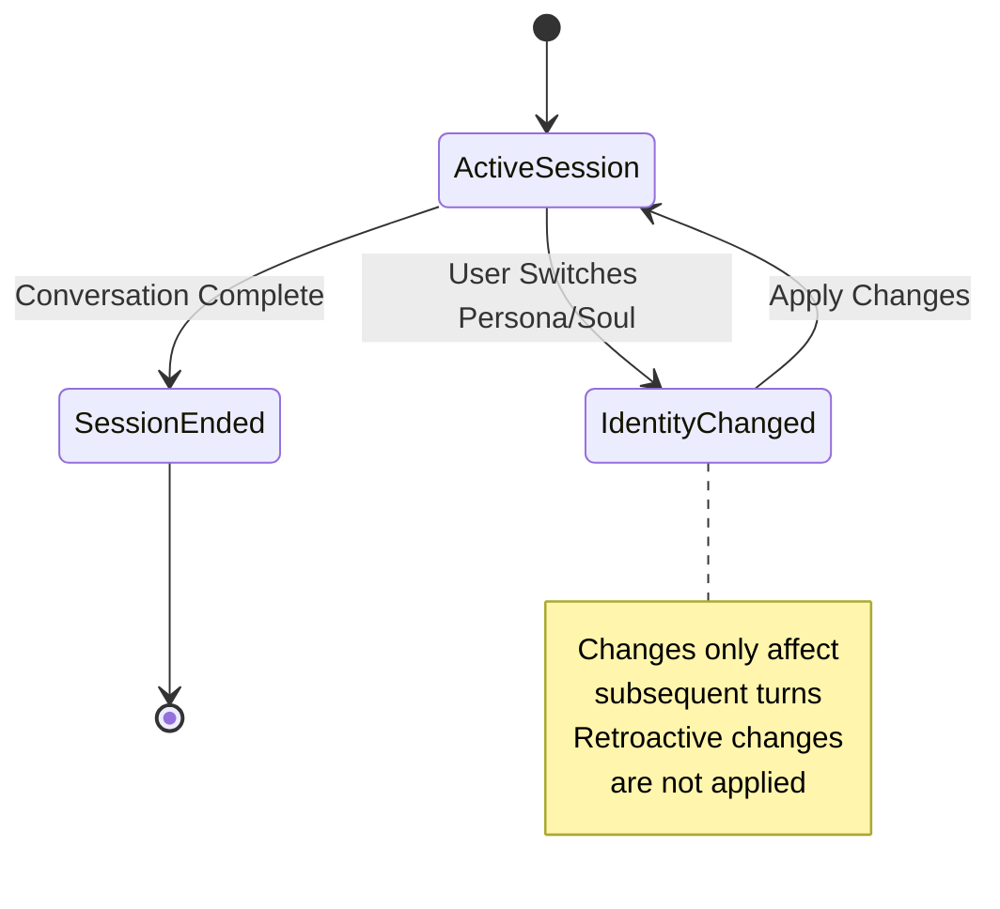
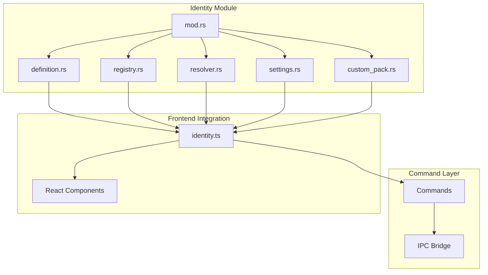

# Identity System

<cite>
**Referenced Files in This Document**
- [identity.ts](file://src/api/identity.ts)
- [CreatePersonaDialog.tsx](file://src/components/identity/CreatePersonaDialog.tsx)
- [SessionIdentityEditor.tsx](file://src/components/identity/SessionIdentityEditor.tsx)
- [mod.rs](file://src-tauri/src/modules/identity/mod.rs)
- [resolver.rs](file://src-tauri/src/modules/identity/resolver.rs)
- [settings.rs](file://src-tauri/src/modules/identity/settings.rs)
- [registry.rs](file://src-tauri/src/modules/identity/registry.rs)
- [custom_pack.rs](file://src-tauri/src/modules/identity/custom_pack.rs)
- [definition.rs](file://src-tauri/src/modules/identity/definition.rs)
- [identity-soul-persona-memory-foundation.md](file://docs/design-docs/identity-soul-persona-memory-foundation.md)
- [FEAT-ID-001-identity-domain-and-resolution.md](file://docs/packs/feature/identity-foundation/FEAT-ID-001-identity-domain-and-resolution.md)
</cite>

## Table of Contents
1. [Introduction](#introduction)
2. [System Architecture](#system-architecture)
3. [Core Identity Model](#core-identity-model)
4. [Resolution Engine](#resolution-engine)
5. [Frontend Components](#frontend-components)
6. [Data Persistence](#data-persistence)
7. [Integration Points](#integration-points)
8. [Implementation Details](#implementation-details)
9. [Performance Considerations](#performance-considerations)
10. [Troubleshooting Guide](#troubleshooting-guide)
11. [Conclusion](#conclusion)

## Introduction

The If2Ai Identity System establishes a robust, layered approach to agent identity management that separates stable personality foundations from flexible interaction styles. This system introduces three fundamental concepts: **Soul** (the stable, long-term identity core), **Persona** (the session-specific interaction style), and **ResolvedIdentity** (the effective identity for each conversational turn).

The system addresses critical gaps in the current architecture where agents lacked stable identity models, users couldn't control interaction styles systematically, and memory systems couldn't distinguish between permanent identity characteristics versus temporary interaction preferences. By implementing a structured identity foundation, the system enables consistent agent behavior across conversations while maintaining flexibility for different interaction contexts.

## System Architecture

The Identity System follows a clean separation of concerns with distinct layers for data modeling, resolution logic, persistence, and presentation:



**Diagram sources**
- [identity.ts:1-76](file://src/api/identity.ts#L1-76)
- [resolver.rs:13-80](file://src-tauri/src/modules/identity/resolver.rs#L13-L80)
- [registry.rs:25-120](file://src-tauri/src/modules/identity/registry.rs#L25-L120)

The architecture ensures that identity resolution remains decoupled from UI concerns while providing a stable contract for downstream systems like memory and prompt planning.

**Section sources**
- [identity-soul-persona-memory-foundation.md:14-42](file://docs/design-docs/identity-soul-persona-memory-foundation.md#L14-L42)
- [mod.rs:1-37](file://src-tauri/src/modules/identity/mod.rs#L1-L37)

## Core Identity Model

The identity system is built around three core data structures that define the relationship between stable identity and flexible interaction styles:

### Soul Definition
Soul represents the agent's fundamental identity - its core principles, mission, and non-negotiable boundaries. Each Soul contains:
- **id**: Unique identifier for the soul
- **version**: Version tracking for prompt content
- **name**: Human-readable soul name
- **summary**: Brief description for UI display
- **mission**: Long-term purpose and goals
- **core_principles**: Fundamental behavioral guidelines
- **decision_contract**: Methodology for decision-making
- **non_negotiables**: Absolute boundaries that cannot be overridden

### Persona Definition
Persona captures the agent's interaction style and communication approach within a specific context. Each Persona includes:
- **id**: Unique persona identifier
- **soul_id**: Foreign key linking to the associated Soul
- **version**: Version tracking for persona modifications
- **name**: Human-readable persona name
- **summary**: Brief description for selection interfaces
- **tone_rules**: Guidelines for communication style
- **collaboration_rules**: Approaches to collaborative work
- **output_preferences**: Preferred formats for responses
- **avatar_id**: Optional visual representation identifier

### Resolved Identity
The resolved identity represents the effective identity for a specific conversational turn, combining the best available Soul and Persona based on the resolution rules.



**Diagram sources**
- [definition.rs:3-56](file://src-tauri/src/modules/identity/definition.rs#L3-L56)

**Section sources**
- [definition.rs:1-111](file://src-tauri/src/modules/identity/definition.rs#L1-L111)
- [registry.rs:25-120](file://src-tauri/src/modules/identity/registry.rs#L25-L120)

## Resolution Engine

The identity resolution engine implements a sophisticated precedence system that determines which Soul and Persona should be active for each conversational turn. The resolution follows a strict hierarchy:



**Diagram sources**
- [resolver.rs:13-80](file://src-tauri/src/modules/identity/resolver.rs#L13-L80)

### Resolution Rules

The system enforces several critical validation rules:

1. **Soul Existence**: The resolved Soul must always exist and be valid
2. **Persona-Soul Consistency**: If a Persona is specified, it must belong to the resolved Soul
3. **Fallback Safety**: Invalid identifiers trigger graceful fallbacks without system failure
4. **Precedence Hierarchy**: Session overrides take precedence over global defaults, which take precedence over built-in fallbacks

### Warning System

The resolver maintains a comprehensive warning system that tracks validation issues, missing identifiers, and persona-soul mismatches. These warnings are crucial for observability and debugging but never cause resolution failures.

**Section sources**
- [resolver.rs:13-226](file://src-tauri/src/modules/identity/resolver.rs#L13-L226)

## Frontend Components

The frontend provides two primary interfaces for managing identity: a persona creation dialog and a session-level identity editor.

### Persona Creation Dialog

The CreatePersonaDialog offers a sophisticated interface for creating custom Personas with intelligent assistance:



**Diagram sources**
- [CreatePersonaDialog.tsx:220-384](file://src/components/identity/CreatePersonaDialog.tsx#L220-L384)

The dialog includes intelligent features like automatic persona expansion from vibe keywords, collision-safe ID generation, and avatar selection with usage tracking.

### Session Identity Editor

The SessionIdentityEditor provides a streamlined interface for managing identity at the session level:



**Diagram sources**
- [SessionIdentityEditor.tsx:24-132](file://src/components/identity/SessionIdentityEditor.tsx#L24-L132)

**Section sources**
- [CreatePersonaDialog.tsx:1-669](file://src/components/identity/CreatePersonaDialog.tsx#L1-L669)
- [SessionIdentityEditor.tsx:1-367](file://src/components/identity/SessionIdentityEditor.tsx#L1-L367)

## Data Persistence

The identity system implements a dual-layer persistence strategy that balances flexibility with reliability.

### Identity Customization Pack

The IdentityCustomizationPack serves as the user-editable persistence layer:

```mermaid
erDiagram
IDENTITY_CUSTOMIZATION_PACK {
JSON schema string schema
uint32 version version
map souls souls
map personas personas
map custom_personas custom_personas
}
SOUL_CUSTOMIZATION {
string summary optional
string mission optional
array core_principles optional
string decision_contract optional
array non_negotiables optional
}
PERSONA_CUSTOMIZATION {
string summary optional
array tone_rules optional
array collaboration_rules optional
array output_preferences optional
}
CUSTOM_PERSONA_DEFINITION {
string soul_id required
string name required
string summary required
string avatar_id optional
array tone_rules required
array collaboration_rules required
array output_preferences required
}
IDENTITY_CUSTOMIZATION_PACK ||--o{ SOUL_CUSTOMIZATION : contains
IDENTITY_CUSTOMIZATION_PACK ||--o{ PERSONA_CUSTOMIZATION : contains
IDENTITY_CUSTOMIZATION_PACK ||--o{ CUSTOM_PERSONA_DEFINITION : contains
```

**Diagram sources**
- [custom_pack.rs:10-76](file://src-tauri/src/modules/identity/custom_pack.rs#L10-L76)

### Runtime Configuration

Identity settings are persisted in the runtime configuration system with dedicated namespace support:

| Setting | Type | Description |
|---------|------|-------------|
| `identity.defaultSoulId` | String? | Global default Soul identifier |
| `identity.defaultPersonaId` | String? | Global default Persona identifier |
| `identity.agentName` | String? | Constant agent name for all Personas |
| `identity.userName` | String? | User name for agent addressing |

**Section sources**
- [custom_pack.rs:10-24](file://src-tauri/src/modules/identity/custom_pack.rs#L10-L24)
- [settings.rs:69-95](file://src-tauri/src/modules/identity/settings.rs#L69-L95)

## Integration Points

The Identity System integrates seamlessly with multiple subsystems throughout the If2Ai architecture.

### Prompt Planning Integration

Identity blocks integrate into the prompt planning system as structured components:



**Diagram sources**
- [identity-soul-persona-memory-foundation.md:369-394](file://docs/design-docs/identity-soul-persona-memory-foundation.md#L369-L394)

### Memory System Integration

The memory system receives identity metadata for proper categorization and future retrieval:

| Memory Field | Purpose | Identity Relationship |
|-------------|---------|----------------------|
| `soul_id` | Primary identity anchor | Long-term stable identity |
| `persona_id` | Secondary interaction tag | Temporary style preference |
| `session_id` | Contextual binding | Conversation continuity |
| `project_id` | Project association | Work context |
| `origin_kind` | Source classification | Action type |

### Session Management Integration

Sessions maintain identity state for continuity across conversation turns:



**Section sources**
- [identity-soul-persona-memory-foundation.md:475-526](file://docs/design-docs/identity-soul-persona-memory-foundation.md#L475-L526)

## Implementation Details

### Backend Architecture

The Rust backend implements a modular, test-driven approach to identity management:



**Diagram sources**
- [mod.rs:1-37](file://src-tauri/src/modules/identity/mod.rs#L1-L37)

### API Facade

The frontend API facade provides a clean interface to the underlying identity system:

| Function | Purpose | Parameters |
|----------|---------|------------|
| `getIdentityCatalog()` | Load built-in identity catalog | None |
| `getIdentityDefaults()` | Load global default settings | None |
| `getIdentityPack()` | Load user customization pack | None |
| `setIdentityPack()` | Save user customization pack | IdentityCustomizationPack |
| `setIdentityDefaults()` | Save global default settings | PromptControlSettingsInput |
| `updateSessionIdentity()` | Update session-level identity | sessionId, SessionIdentityInput |

**Section sources**
- [identity.ts:40-76](file://src/api/identity.ts#L40-L76)

## Performance Considerations

The identity system is designed with performance and reliability as primary concerns:

### Resolution Performance
- **O(1)** lookup complexity for Soul and Persona resolution
- **Minimal I/O operations** - all resolution happens in memory
- **Lazy loading** of catalog data only when needed
- **Immutable data structures** prevent race conditions

### Memory Efficiency
- **Compact data models** minimize memory footprint
- **Optional fields** reduce storage overhead for partial configurations
- **Schema validation** prevents malformed data from consuming resources

### Caching Strategy
- **Registry caching** prevents repeated file system access
- **Resolution result caching** avoids redundant computation
- **Catalog lazy initialization** defers expensive operations until first use

## Troubleshooting Guide

### Common Issues and Solutions

#### Invalid Identity References
**Symptom**: Identity resolution fails or produces unexpected results
**Cause**: References to non-existent Souls or Personas
**Solution**: Check identity IDs against the registry, verify customization pack validity

#### Persona-Soul Mismatch
**Symptom**: Selected Persona disappears from effective identity
**Cause**: Persona belongs to a different Soul than the resolved Soul
**Solution**: Select a Persona that belongs to the current Soul, or change the Soul selection

#### Configuration Loading Failures
**Symptom**: Identity settings not applying as expected
**Cause**: Corrupted or missing configuration files
**Solution**: Reset to defaults, verify file permissions, check configuration schema

#### UI Synchronization Issues
**Symptom**: Frontend shows different identity than backend resolution
**Cause**: Stale cache or timing issues in state synchronization
**Solution**: Refresh UI state, verify API calls, check for concurrent modifications

### Debug Information

The system provides comprehensive logging and diagnostic information:

- **Resolution warnings**: Track validation issues and fallbacks
- **Prompt diagnostics**: Show which identity blocks are included in prompts
- **Memory audit trails**: Track identity tagging in memory entries
- **Configuration parsing logs**: Monitor settings file loading and validation

**Section sources**
- [resolver.rs:102-226](file://src-tauri/src/modules/identity/resolver.rs#L102-L226)
- [settings.rs:46-67](file://src-tauri/src/modules/identity/settings.rs#L46-L67)

## Conclusion

The If2Ai Identity System represents a comprehensive solution to agent identity management that balances flexibility with stability. By separating the persistent identity core (Soul) from flexible interaction styles (Persona), the system enables rich user experiences while maintaining reliable behavior across conversations.

The modular architecture ensures that identity management can evolve independently of other system components, while the robust resolution engine guarantees consistent behavior even in the face of configuration errors or missing data. The dual-layer persistence strategy provides both user-friendly customization capabilities and system reliability.

Future enhancements can build upon this foundation to support more advanced features like project-level identity defaults, request-specific overrides, and distributed persona catalogs, all while maintaining backward compatibility and system stability.

The Identity System successfully addresses the three core problems identified in the project scope: establishing stable agent identity models, enabling user-controlled interaction style switching, and providing the foundation for identity-aware memory systems that will support future retrieval and reflection capabilities.