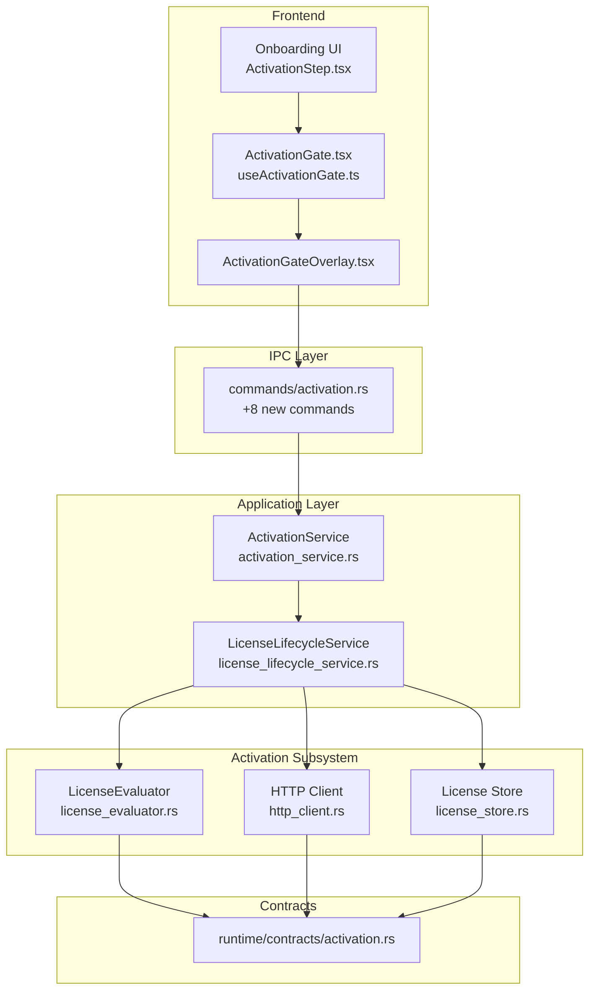
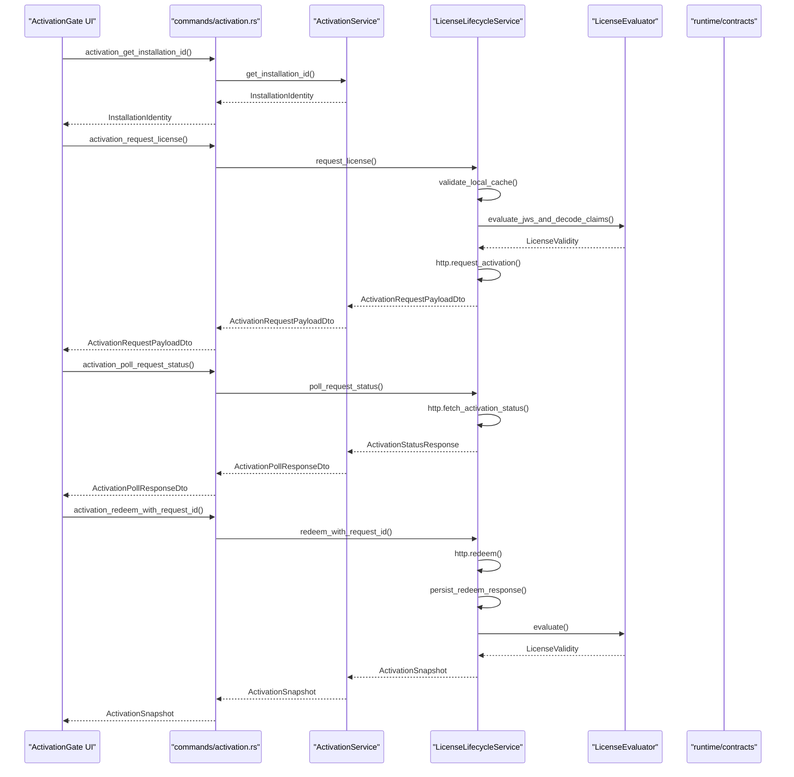
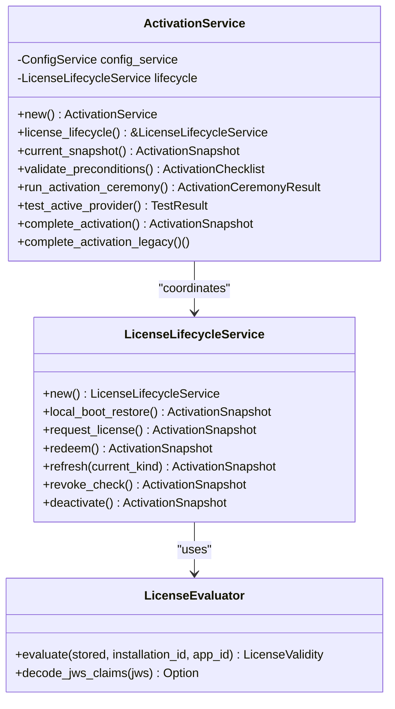
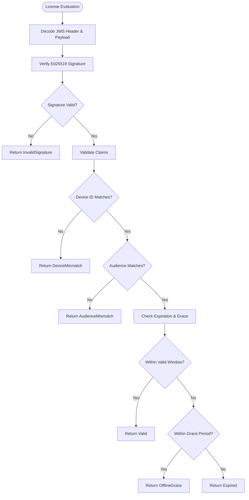
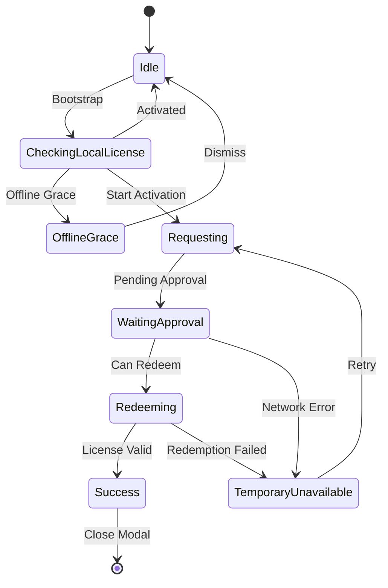
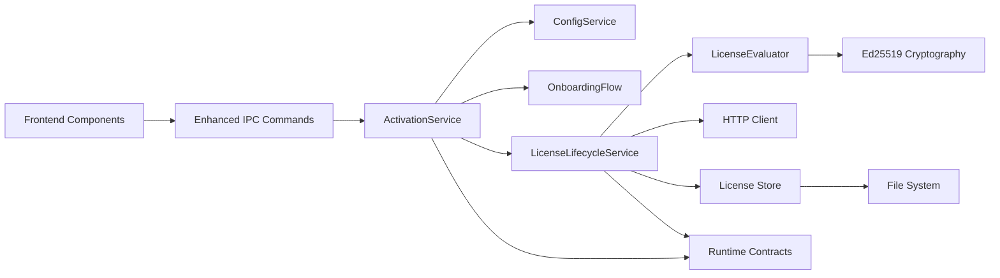

# Activation Service

<cite>
**Referenced Files in This Document**
- [activation.rs](file://src-tauri/src/commands/activation.rs)
- [activation_service.rs](file://src-tauri/src/modules/application/activation_service.rs)
- [license_lifecycle_service.rs](file://src-tauri/src/modules/application/license_lifecycle_service.rs)
- [license_evaluator.rs](file://src-tauri/src/modules/application/activation/license_evaluator.rs)
- [activation.rs (runtime contracts)](file://src-tauri/src/modules/runtime/contracts/activation.rs)
- [ActivationChecklist.tsx](file://src/modules/onboarding/components/ActivationChecklist.tsx)
- [ActivationStep.tsx](file://src/modules/onboarding/steps/ActivationStep.tsx)
- [ActivationGate.tsx](file://src/boot/activation/ActivationGate.tsx)
- [useActivationGate.ts](file://src/boot/activation/useActivationGate.ts)
- [ActivationGateOverlay.tsx](file://src/boot/ActivationGateOverlay.tsx)
- [mod.rs (application layer)](file://src-tauri/src/modules/application/mod.rs)
- [types.ts (onboarding TS types)](file://src/modules/onboarding/types.ts)
- [mod.rs (activation subsystem)](file://src-tauri/src/modules/application/activation/mod.rs)
</cite>

## Update Summary
**Changes Made**
- Enhanced activation system documentation with Ed25519 verification implementation
- Added comprehensive coverage of automatic license revocation detection
- Documented real-time status update mechanisms through retry event system
- Replaced placeholder ActivationGate component with full SwiftUI-port implementation
- Updated architecture diagrams to reflect new activation server integration
- Added detailed license evaluation and JWS verification processes

## Table of Contents
1. [Introduction](#introduction)
2. [Project Structure](#project-structure)
3. [Core Components](#core-components)
4. [Architecture Overview](#architecture-overview)
5. [Detailed Component Analysis](#detailed-component-analysis)
6. [Enhanced Security Features](#enhanced-security-features)
7. [Real-Time Status Management](#real-time-status-management)
8. [Activation Gate Implementation](#activation-gate-implementation)
9. [Dependency Analysis](#dependency-analysis)
10. [Performance Considerations](#performance-considerations)
11. [Troubleshooting Guide](#troubleshooting-guide)
12. [Conclusion](#conclusion)

## Introduction
This document describes the enhanced activation service module responsible for orchestrating the agent activation ceremony, managing the activation checklist, and coordinating with the license lifecycle service. The system now features advanced Ed25519 JWS verification, automatic license revocation detection, and real-time status updates through a comprehensive activation server integration. It explains the ActivationCeremonyResult structure, activation workflow orchestration, and the integration with the license lifecycle service. It also covers activation validation, permission checking, service initialization patterns, error handling strategies, and activation state management.

## Project Structure
The activation service spans four enhanced layers with comprehensive integration:
- IPC commands layer: thin adapters that delegate to the application service with new activation server commands
- Application service layer: orchestrates onboarding and lifecycle coordination with enhanced security
- Activation subsystem: implements client-side activation server integration with Ed25519 verification
- Runtime contracts: defines canonical activation state machine and data structures with expanded states

**Diagram sources**
- [activation.rs:1-301](file://src-tauri/src/commands/activation.rs#L1-L301)
- [activation_service.rs:1-289](file://src-tauri/src/modules/application/activation_service.rs#L1-L289)
- [license_lifecycle_service.rs:1-390](file://src-tauri/src/modules/application/license_lifecycle_service.rs#L1-L390)
- [license_evaluator.rs:1-409](file://src-tauri/src/modules/application/activation/license_evaluator.rs#L1-L409)
- [activation.rs (runtime contracts):1-262](file://src-tauri/src/modules/runtime/contracts/activation.rs#L1-L262)

**Section sources**
- [activation.rs:1-301](file://src-tauri/src/commands/activation.rs#L1-L301)
- [activation_service.rs:1-289](file://src-tauri/src/modules/application/activation_service.rs#L1-L289)
- [license_lifecycle_service.rs:1-390](file://src-tauri/src/modules/application/license_lifecycle_service.rs#L1-L390)
- [license_evaluator.rs:1-409](file://src-tauri/src/modules/application/activation/license_evaluator.rs#L1-L409)
- [activation.rs (runtime contracts):1-262](file://src-tauri/src/modules/runtime/contracts/activation.rs#L1-L262)

## Core Components
- **Enhanced ActivationService**: application service that orchestrates the activation ceremony with improved security and integrates with configuration, onboarding, and license lifecycle services.
- **LicenseLifecycleService**: manages license lifecycle transitions with Ed25519 verification and returns canonical ActivationSnapshot instances.
- **LicenseEvaluator**: implements Ed25519 JWS verification for license authenticity and integrity.
- **ActivationSubsystem**: comprehensive client-side implementation of iclaw-activation-server v0.2 with HTTP client, installation ID management, and license store.
- **Runtime contracts**: define expanded ActivationStatusKind states (10 states) and related structures with enhanced security features.

Key structures with enhanced security:
- **ActivationChecklist**: mirrors the frontend checklist shape for preconditions with improved validation.
- **ActivationCeremonyResult**: result returned by the legacy ceremony-style activation start.
- **ActivationSnapshot**: canonical snapshot with enhanced state management and security validation.
- **LicenseValidity**: new enum defining license evaluation results with Ed25519 verification outcomes.

**Section sources**
- [activation_service.rs:55-72](file://src-tauri/src/modules/application/activation_service.rs#L55-L72)
- [license_lifecycle_service.rs:33-43](file://src-tauri/src/modules/application/license_lifecycle_service.rs#L33-L43)
- [license_evaluator.rs:95-99](file://src-tauri/src/modules/application/activation/license_evaluator.rs#L95-L99)
- [activation.rs (runtime contracts):29-57](file://src-tauri/src/modules/runtime/contracts/activation.rs#L29-L57)
- [activation.rs:28-72](file://src-tauri/src/commands/activation.rs#L28-L72)

## Architecture Overview
The enhanced activation service follows a comprehensive layered architecture with security-first design:
- IPC commands preserve legacy wire shapes while adding 8 new activation server commands
- ActivationService composes configuration, onboarding, and provider testing with enhanced security
- LicenseLifecycleService provides typed lifecycle snapshots with Ed25519 verification
- LicenseEvaluator implements cryptographic JWS verification for license authenticity
- Runtime contracts define the expanded canonical state machine with 10 states

**Diagram sources**
- [activation.rs:226-300](file://src-tauri/src/commands/activation.rs#L226-L300)
- [activation_service.rs:123-136](file://src-tauri/src/modules/application/activation_service.rs#L123-L136)
- [license_lifecycle_service.rs:139-187](file://src-tauri/src/modules/application/license_lifecycle_service.rs#L139-L187)
- [license_evaluator.rs:101-137](file://src-tauri/src/modules/application/activation/license_evaluator.rs#L101-L137)

## Detailed Component Analysis

### Enhanced ActivationService Orchestration
Enhanced ActivationService coordinates with improved security and comprehensive lifecycle management:
- Precondition validation using ConfigService with enhanced security checks
- Legacy ceremony greeting via provider testing with timeout handling
- Onboarding completion and state persistence with security validation
- License lifecycle snapshot computation with Ed25519 verification
- Integration with new activation server commands for comprehensive activation flow

**Diagram sources**
- [activation_service.rs:76-102](file://src-tauri/src/modules/application/activation_service.rs#L76-L102)
- [license_lifecycle_service.rs:65-83](file://src-tauri/src/modules/application/license_lifecycle_service.rs#L65-L83)
- [license_evaluator.rs:57-93](file://src-tauri/src/modules/application/activation/license_evaluator.rs#L57-L93)

**Section sources**
- [activation_service.rs:74-289](file://src-tauri/src/modules/application/activation_service.rs#L74-L289)

### Enhanced License Lifecycle Coordination
The license lifecycle service now provides comprehensive typed snapshots with Ed25519 verification for all activation states:
- **CheckingLocal**: Boot is reading the local license cache; no decision yet
- **NeedsActivation**: No local license found and no request in flight
- **RequestingActivation**: User has submitted activation credentials; remote call in flight
- **PendingApproval**: Remote acknowledged the request and is awaiting manual approval
- **Redeeming**: Approved license is being redeemed locally
- **Activated**: License is valid and main shell is permitted
- **OfflineGrace**: License refresh failed but offline grace window is still open
- **Expired**: License is past its expiry date; main shell must be gated
- **Revoked**: Remote has revoked the license; main shell must be gated
- **Deactivated**: User has explicitly deactivated this install

The service centralizes snapshot creation with enhanced security validation and allows_main_shell computation.

**Section sources**
- [license_lifecycle_service.rs:333-355](file://src-tauri/src/modules/application/license_lifecycle_service.rs#L333-L355)
- [activation.rs (runtime contracts):29-57](file://src-tauri/src/modules/runtime/contracts/activation.rs#L29-L57)

### License Evaluation and Ed25519 Verification
The LicenseEvaluator implements comprehensive JWS verification with Ed25519 cryptography:
- **Ed25519 JWS Verification**: Validates license_jws signatures against built-in verifying key
- **License Claims Decoding**: Extracts and validates license claims from JWS payload
- **Device and Audience Validation**: Ensures license matches current installation and application
- **Expiration and Grace Handling**: Manages license expiration with offline grace periods
- **Clock Skew Tolerance**: Handles system clock drift with 60-second tolerance

**Diagram sources**
- [license_evaluator.rs:57-93](file://src-tauri/src/modules/application/activation/license_evaluator.rs#L57-L93)
- [license_evaluator.rs:101-137](file://src-tauri/src/modules/application/activation/license_evaluator.rs#L101-L137)

**Section sources**
- [license_evaluator.rs:1-409](file://src-tauri/src/modules/application/activation/license_evaluator.rs#L1-L409)

## Enhanced Security Features

### Ed25519 JWS Verification Implementation
The activation system now implements robust cryptographic verification:
- **Build-Time Key Embedding**: Verifying key baked into binary via build.rs and keys/activation_license_ed25519_pub.b64
- **RFC 8032 Compliance**: Uses standard Ed25519 signature algorithm with proper key derivation
- **Cross-Platform Support**: Works across macOS, Windows, and Linux platforms
- **Security Testing**: Comprehensive unit tests with RFC 8032 test vectors

### License Integrity Protection
- **Tamper Detection**: Invalid signatures automatically rejected with InvalidSignature
- **Format Validation**: Malformed JWS structures detected and handled gracefully
- **Device Binding**: License tied to specific installation ID prevents cross-device usage
- **Audience Control**: Application ID validation ensures proper licensing scope

**Section sources**
- [license_evaluator.rs:1-42](file://src-tauri/src/modules/application/activation/license_evaluator.rs#L1-L42)
- [mod.rs (activation subsystem):8-14](file://src-tauri/src/modules/application/activation/mod.rs#L8-L14)

## Real-Time Status Management

### Retry Event System
The activation system provides comprehensive real-time status updates through a sophisticated retry event mechanism:
- **Retry Status Events**: Forwarded to frontend as `activation_retry_status` Tauri event
- **Status Code Mapping**: Translates HTTP 429/503 responses to UI-friendly retry messages
- **Attempt Tracking**: Monitors retry attempts with configurable max attempts
- **User Feedback**: Provides meaningful status messages for rate limiting and service unavailability

### Automatic Revocation Detection
The system implements continuous license monitoring:
- **Periodic Revoke Checks**: Regular server-side revocation verification
- **Automatic Cache Clearing**: Immediate license cache cleanup upon revocation detection
- **State Transition**: Seamless transition to Revoked state with appropriate messaging
- **User Notification**: Clear indication of license revocation in UI

**Section sources**
- [activation.rs:200-224](file://src-tauri/src/commands/activation.rs#L200-L224)
- [license_lifecycle_service.rs:243-272](file://src-tauri/src/modules/application/license_lifecycle_service.rs#L243-L272)

## Activation Gate Implementation

### Comprehensive UI Implementation
The ActivationGate provides a full SwiftUI-port experience with comprehensive state management:
- **Fibonacci Digit Sphere**: Animated visual element with 8-cell OTP display
- **Multi-State Progression**: Five visual phases (idle, filling, verifying, success, error)
- **Dual Input Modes**: Automatic OTP generation and manual 8-character code entry
- **Real-Time Status Updates**: Dynamic status text with retry status integration
- **Device Identification**: Built-in device indicator and installation ID display

### State Machine Logic
The activation gate implements a sophisticated state machine with comprehensive error handling:
- **Bootstrap Sequence**: Initial license check with automatic progression
- **Request Processing**: License request creation with approval polling
- **Redemption Flow**: License redemption with automatic OTP verification
- **Error Recovery**: Graceful handling of network failures and service unavailability
- **Success Handoff**: Smooth transition to main shell with proper state synchronization

**Diagram sources**
- [useActivationGate.ts:50-59](file://src/boot/activation/useActivationGate.ts#L50-L59)
- [useActivationGate.ts:264-307](file://src/boot/activation/useActivationGate.ts#L264-L307)

**Section sources**
- [ActivationGate.tsx:1-256](file://src/boot/activation/ActivationGate.tsx#L1-L256)
- [useActivationGate.ts:1-401](file://src/boot/activation/useActivationGate.ts#L1-L401)

## Dependency Analysis
The enhanced activation service maintains clean separation with comprehensive security dependencies:
- IPC commands depend only on ActivationService and new activation server commands
- ActivationService depends on ConfigService, OnboardingFlow, and LicenseLifecycleService
- LicenseLifecycleService depends on LicenseEvaluator, HTTP Client, and License Store
- LicenseEvaluator depends only on cryptographic libraries and license models
- Frontend components depend on comprehensive TypeScript types and React hooks

**Diagram sources**
- [mod.rs (application layer):45-66](file://src-tauri/src/modules/application/mod.rs#L45-L66)
- [activation.rs:21-27](file://src-tauri/src/commands/activation.rs#L21-L27)
- [activation_service.rs:39-47](file://src-tauri/src/modules/application/activation_service.rs#L39-L47)
- [license_evaluator.rs:18-22](file://src-tauri/src/modules/application/activation/license_evaluator.rs#L18-L22)

**Section sources**
- [mod.rs (application layer):38-66](file://src-tauri/src/modules/application/mod.rs#L38-L66)
- [activation.rs:19-27](file://src-tauri/src/commands/activation.rs#L19-L27)
- [activation_service.rs:39-47](file://src-tauri/src/modules/application/activation_service.rs#L39-L47)

## Performance Considerations
- **Greeting timeout**: 30-second timeout prevents UI blocking during provider greeting
- **Async operations**: All I/O operations use async/await to avoid blocking the event loop
- **Ed25519 verification**: Optimized cryptographic operations with lazy initialization
- **License caching**: Efficient local license storage with atomic file operations
- **Retry backoff**: Intelligent retry logic with exponential backoff for network failures
- **Real-time updates**: WebSocket-like event system for immediate status updates

## Troubleshooting Guide
Enhanced troubleshooting for the comprehensive activation system:
- **Provider not configured**: activation_start returns error requiring provider setup first
- **Greeting timeouts**: handled gracefully with warning logs and fallback behavior
- **Onboarding state corruption**: defaults to NeedsActivation when state file missing
- **Permission errors**: ensure security confirmation and proper provider credentials
- **License verification failures**: InvalidSignature, DeviceMismatch, AudienceMismatch, MalformedJws
- **Network connectivity issues**: 429/503 responses with retry status events
- **Revocation detection**: Immediate license cache clearing and state transition
- **Ed25519 key mismatches**: Build-time verification key validation failures

Diagnostic approaches:
- Check activation_checklist for failing prerequisites
- Verify provider connection using activation_test_message
- Monitor logs for greeting timeout warnings
- Inspect activation_get_status for canonical snapshot state
- Review license evaluation results for verification failures
- Monitor retry status events for network issues
- Validate Ed25519 verifying key configuration

**Section sources**
- [activation_service.rs:168-194](file://src-tauri/src/modules/application/activation_service.rs#L168-L194)
- [activation_service.rs:197-214](file://src-tauri/src/modules/application/activation_service.rs#L197-L214)
- [activation_service.rs:124-138](file://src-tauri/src/modules/application/activation_service.rs#L124-L138)
- [license_evaluator.rs:62-66](file://src-tauri/src/modules/application/activation/license_evaluator.rs#L62-L66)
- [activation.rs:115-118](file://src-tauri/src/commands/activation.rs#L115-L118)

## Conclusion
The enhanced activation service module provides a comprehensive, security-first approach to agent activation:
- **Advanced Security**: Ed25519 JWS verification with cryptographic integrity protection
- **Comprehensive State Management**: 10-state activation lifecycle with detailed status tracking
- **Real-Time Monitoring**: Automatic license revocation detection and continuous status updates
- **Enhanced User Experience**: Full SwiftUI-port activation gate with dual input modes
- **Robust Architecture**: Clean separation between IPC, application, and contract layers
- **Future-Ready Design**: Extensible framework supporting additional activation backends

The design enables seamless integration with the iclaw-activation-server while maintaining backward compatibility and providing a superior user experience through comprehensive real-time status management and enhanced security validation.