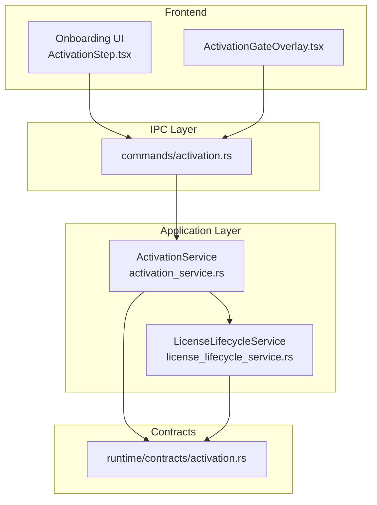
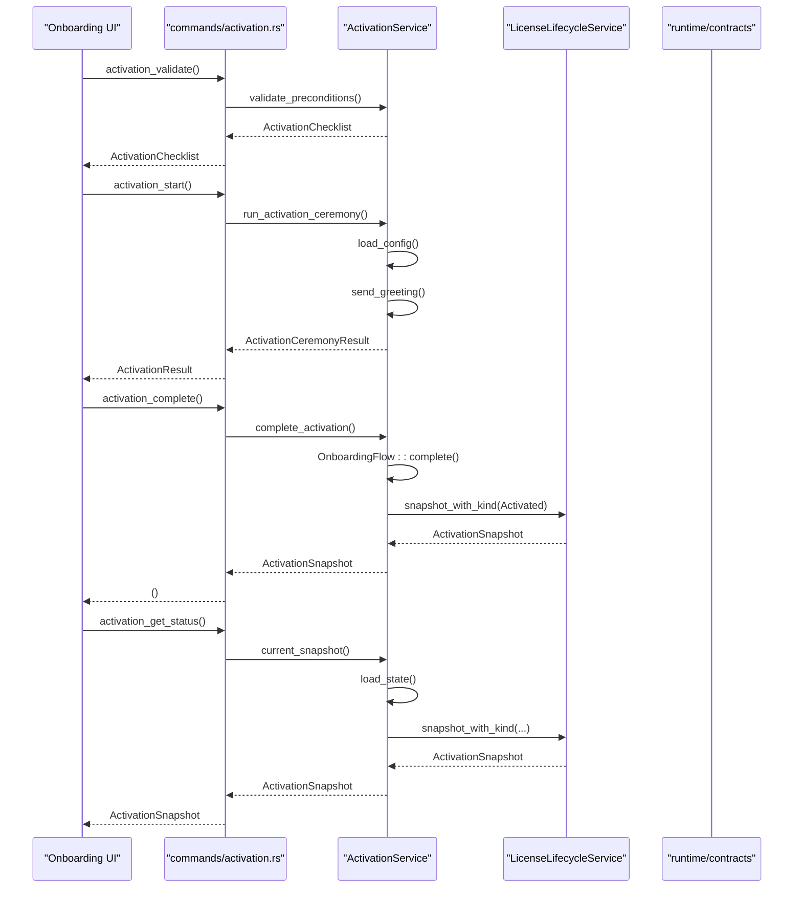
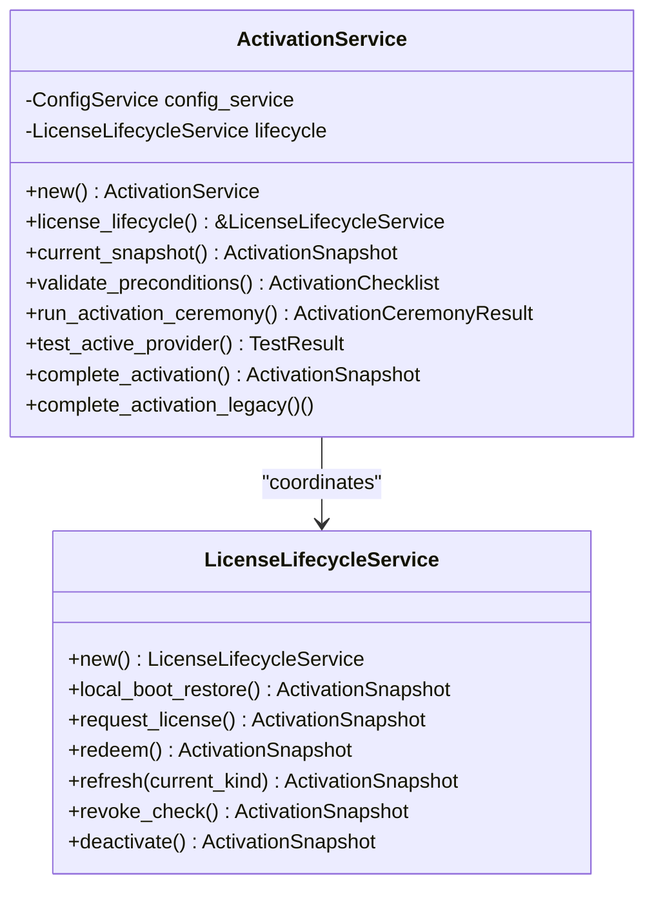
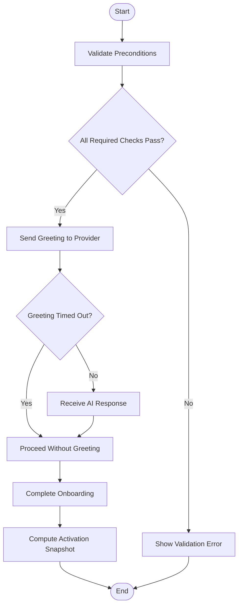
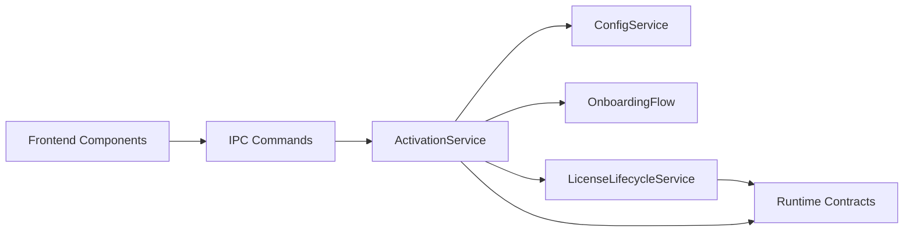

# Activation Service

<cite>
**Referenced Files in This Document**
- [activation.rs](file://src-tauri/src/commands/activation.rs)
- [activation_service.rs](file://src-tauri/src/modules/application/activation_service.rs)
- [license_lifecycle_service.rs](file://src-tauri/src/modules/application/license_lifecycle_service.rs)
- [activation.rs (runtime contracts)](file://src-tauri/src/modules/runtime/contracts/activation.rs)
- [ActivationChecklist.tsx](file://src/modules/onboarding/components/ActivationChecklist.tsx)
- [ActivationStep.tsx](file://src/modules/onboarding/steps/ActivationStep.tsx)
- [ActivationGateOverlay.tsx](file://src/boot/ActivationGateOverlay.tsx)
- [mod.rs (application layer)](file://src-tauri/src/modules/application/mod.rs)
- [types.ts (onboarding TS types)](file://src/modules/onboarding/types.ts)
</cite>

## Table of Contents
1. [Introduction](#introduction)
2. [Project Structure](#project-structure)
3. [Core Components](#core-components)
4. [Architecture Overview](#architecture-overview)
5. [Detailed Component Analysis](#detailed-component-analysis)
6. [Dependency Analysis](#dependency-analysis)
7. [Performance Considerations](#performance-considerations)
8. [Troubleshooting Guide](#troubleshooting-guide)
9. [Conclusion](#conclusion)

## Introduction
This document describes the activation service module responsible for orchestrating the agent activation ceremony, managing the activation checklist, and coordinating with the license lifecycle service. It explains the ActivationCeremonyResult structure, activation workflow orchestration, and the integration with the license lifecycle service. It also covers activation validation, permission checking, service initialization patterns, error handling strategies, and activation state management.

## Project Structure
The activation service spans three layers:
- IPC commands layer: thin adapters that delegate to the application service
- Application service layer: orchestrates onboarding and lifecycle coordination
- Runtime contracts: defines canonical activation state machine and data structures

**Diagram sources**
- [activation.rs:1-127](file://src-tauri/src/commands/activation.rs#L1-L127)
- [activation_service.rs:1-291](file://src-tauri/src/modules/application/activation_service.rs#L1-L291)
- [license_lifecycle_service.rs:1-165](file://src-tauri/src/modules/application/license_lifecycle_service.rs#L1-L165)
- [activation.rs (runtime contracts):1-262](file://src-tauri/src/modules/runtime/contracts/activation.rs#L1-L262)

**Section sources**
- [activation.rs:1-127](file://src-tauri/src/commands/activation.rs#L1-L127)
- [activation_service.rs:1-291](file://src-tauri/src/modules/application/activation_service.rs#L1-L291)
- [license_lifecycle_service.rs:1-165](file://src-tauri/src/modules/application/license_lifecycle_service.rs#L1-L165)
- [activation.rs (runtime contracts):1-262](file://src-tauri/src/modules/runtime/contracts/activation.rs#L1-L262)

## Core Components
- ActivationService: application service that orchestrates the activation ceremony and integrates with configuration, onboarding, and license lifecycle services.
- LicenseLifecycleService: manages license lifecycle transitions and returns canonical ActivationSnapshot instances.
- Runtime contracts: define ActivationStatusKind, ActivationSnapshot, ActivationLicense, and related enums and structures.
- IPC commands: thin adapters that delegate to ActivationService while preserving legacy wire shapes.

Key structures:
- ActivationChecklist: mirrors the frontend checklist shape for preconditions.
- ActivationCeremonyResult: result returned by the legacy ceremony-style activation start.
- ActivationSnapshot: canonical snapshot consumed by the frontend boot shell.

**Section sources**
- [activation_service.rs:55-72](file://src-tauri/src/modules/application/activation_service.rs#L55-L72)
- [license_lifecycle_service.rs:33-43](file://src-tauri/src/modules/application/license_lifecycle_service.rs#L33-L43)
- [activation.rs (runtime contracts):29-154](file://src-tauri/src/modules/runtime/contracts/activation.rs#L29-L154)
- [activation.rs:28-72](file://src-tauri/src/commands/activation.rs#L28-L72)

## Architecture Overview
The activation service follows a layered architecture:
- IPC commands preserve legacy wire shapes while delegating to ActivationService
- ActivationService composes configuration, onboarding, and provider testing
- LicenseLifecycleService provides typed lifecycle snapshots
- Runtime contracts define the canonical state machine and data structures

**Diagram sources**
- [activation.rs:74-126](file://src-tauri/src/commands/activation.rs#L74-L126)
- [activation_service.rs:142-253](file://src-tauri/src/modules/application/activation_service.rs#L142-L253)
- [license_lifecycle_service.rs:108-130](file://src-tauri/src/modules/application/license_lifecycle_service.rs#L108-L130)

## Detailed Component Analysis

### ActivationService Orchestration
ActivationService coordinates:
- Precondition validation using ConfigService
- Legacy ceremony greeting via provider testing
- Onboarding completion and state persistence
- License lifecycle snapshot computation

**Diagram sources**
- [activation_service.rs:76-102](file://src-tauri/src/modules/application/activation_service.rs#L76-L102)
- [license_lifecycle_service.rs:41-103](file://src-tauri/src/modules/application/license_lifecycle_service.rs#L41-L103)

**Section sources**
- [activation_service.rs:74-254](file://src-tauri/src/modules/application/activation_service.rs#L74-L254)

### ActivationCeremonyResult Structure
ActivationCeremonyResult carries:
- success flag indicating ceremony initiation outcome
- optional session_id for session tracking
- message describing the ceremony result
- optional ai_response containing the model's first greeting

The structure preserves compatibility with the legacy IPC wire shape and is mapped to the frontend ActivationResult type.

**Section sources**
- [activation_service.rs:66-72](file://src-tauri/src/modules/application/activation_service.rs#L66-L72)
- [activation.rs:52-72](file://src-tauri/src/commands/activation.rs#L52-L72)
- [types.ts:161-167](file://src/modules/onboarding/types.ts#L161-L167)

### Activation Workflow Orchestration
The activation workflow consists of three phases:
1. Validation: checks system health, security confirmation, provider configuration, and channel configuration
2. Ceremony: sends a greeting to the configured provider and optionally displays the AI's first response
3. Completion: marks onboarding as complete and persists configuration

**Diagram sources**
- [activation_service.rs:142-194](file://src-tauri/src/modules/application/activation_service.rs#L142-L194)
- [activation_service.rs:220-246](file://src-tauri/src/modules/application/activation_service.rs#L220-L246)

**Section sources**
- [activation_service.rs:140-194](file://src-tauri/src/modules/application/activation_service.rs#L140-L194)
- [ActivationStep.tsx:70-101](file://src/modules/onboarding/steps/ActivationStep.tsx#L70-L101)

### License Lifecycle Coordination
The license lifecycle service provides typed snapshots for all activation states:
- NeedsActivation: initial state when no license exists
- RequestingActivation: user submitted activation credentials
- PendingApproval: waiting for manual/async approval
- Redeeming: decoding and writing license locally
- Activated: license valid and main shell permitted
- OfflineGrace: refresh failed but grace window open
- Expired: license past expiry date
- Revoked: remote has revoked license
- Deactivated: user explicitly deactivated

The service centralizes snapshot creation and ensures allows_main_shell is computed consistently.

**Section sources**
- [license_lifecycle_service.rs:108-130](file://src-tauri/src/modules/application/license_lifecycle_service.rs#L108-L130)
- [activation.rs (runtime contracts):29-57](file://src-tauri/src/modules/runtime/contracts/activation.rs#L29-L57)

### Frontend Integration Patterns
The frontend integrates through:
- ActivationStep.tsx: orchestrates the three-phase activation flow
- ActivationChecklist.tsx: displays validation results
- ActivationGateOverlay.tsx: gates main shell based on canonical snapshot
- IPC commands: preserve legacy wire shapes for backward compatibility

**Section sources**
- [ActivationStep.tsx:34-101](file://src/modules/onboarding/steps/ActivationStep.tsx#L34-L101)
- [ActivationChecklist.tsx:24-78](file://src/modules/onboarding/components/ActivationChecklist.tsx#L24-L78)
- [ActivationGateOverlay.tsx:49-96](file://src/boot/ActivationGateOverlay.tsx#L49-L96)
- [activation.rs:74-126](file://src-tauri/src/commands/activation.rs#L74-L126)

## Dependency Analysis
The activation service maintains clean separation of concerns:
- IPC commands depend only on ActivationService types
- ActivationService depends on ConfigService, OnboardingFlow, and LicenseLifecycleService
- LicenseLifecycleService depends only on runtime contracts
- Frontend components depend on canonical TypeScript types

**Diagram sources**
- [mod.rs (application layer):45-66](file://src-tauri/src/modules/application/mod.rs#L45-L66)
- [activation.rs:21-26](file://src-tauri/src/commands/activation.rs#L21-L26)
- [activation_service.rs:39-47](file://src-tauri/src/modules/application/activation_service.rs#L39-L47)

**Section sources**
- [mod.rs (application layer):38-66](file://src-tauri/src/modules/application/mod.rs#L38-L66)
- [activation.rs:19-26](file://src-tauri/src/commands/activation.rs#L19-L26)
- [activation_service.rs:39-47](file://src-tauri/src/modules/application/activation_service.rs#L39-L47)

## Performance Considerations
- Greeting timeout: 30-second timeout prevents UI blocking during provider greeting
- Async operations: all I/O operations use async/await to avoid blocking the event loop
- Minimal state: LicenseLifecycleService uses placeholder implementations to avoid premature vendor lock-in
- Efficient serialization: runtime contracts use optimized serde configurations for wire transmission

## Troubleshooting Guide
Common activation issues and resolutions:
- Provider not configured: activation_start returns error requiring provider setup first
- Greeting timeouts: handled gracefully with warning logs and fallback behavior
- Onboarding state corruption: defaults to NeedsActivation when state file missing
- Permission errors: ensure security confirmation and proper provider credentials

Diagnostic approaches:
- Check activation_checklist for failing prerequisites
- Verify provider connection using activation_test_message
- Monitor logs for greeting timeout warnings
- Inspect activation_get_status for canonical snapshot state

**Section sources**
- [activation_service.rs:168-194](file://src-tauri/src/modules/application/activation_service.rs#L168-L194)
- [activation_service.rs:197-214](file://src-tauri/src/modules/application/activation_service.rs#L197-L214)
- [activation_service.rs:124-138](file://src-tauri/src/modules/application/activation_service.rs#L124-L138)

## Conclusion
The activation service module provides a robust, layered approach to agent activation:
- Clean separation between IPC, application, and contract layers
- Canonical state machine for license lifecycle management
- Backward-compatible wire protocol preservation
- Comprehensive error handling and graceful degradation
- Clear integration points for future license backend implementation

The design enables future expansion while maintaining stability and predictable behavior for both developers and end users.