# Application Layer

<cite>
**Referenced Files in This Document**
- [application/mod.rs](file://src-tauri/src/modules/application/mod.rs)
- [turn_service/mod.rs](file://src-tauri/src/modules/application/turn_service/mod.rs)
- [provider_service.rs](file://src-tauri/src/modules/application/provider_service.rs)
- [permission_service.rs](file://src-tauri/src/modules/application/permission_service.rs)
- [real_api_client.rs](file://src-tauri/src/modules/application/real_api_client.rs)
- [prompt_planner/mod.rs](file://src-tauri/src/modules/application/prompt_planner/mod.rs)
- [prompt_planner/governor.rs](file://src-tauri/src/modules/application/prompt_planner/governor.rs)
- [prompt_planner/preflight.rs](file://src-tauri/src/modules/application/prompt_planner/preflight.rs)
- [prompt_planner/sanitize.rs](file://src-tauri/src/modules/application/prompt_planner/sanitize.rs)
- [memory_coordinator.rs](file://src-tauri/src/modules/application/memory_coordinator.rs)
- [stream_emitter_service.rs](file://src-tauri/src/modules/application/stream_emitter_service.rs)
- [stream_cancel_service.rs](file://src-tauri/src/modules/application/stream_cancel_service.rs)
- [tool_executor.rs](file://src-tauri/src/modules/application/tool_executor.rs)
- [tool_heuristics.rs](file://src-tauri/src/modules/application/tool_heuristics.rs)
- [trajectory_service.rs](file://src-tauri/src/modules/application/trajectory_service.rs)
- [request_intelligence_service.rs](file://src-tauri/src/modules/application/request_intelligence_service.rs)
- [activation_service.rs](file://src-tauri/src/modules/application/activation_service.rs)
- [commands/agent/mod.rs](file://src-tauri/src/commands/agent/mod.rs)
</cite>

## Update Summary
**Changes Made**
- Added documentation for the newly extracted `stream_cancel_service.rs` module and its role in centralized cancellation management
- Updated permission service documentation to reflect the extraction from `commands/agent.rs` into `permission_service.rs`
- Enhanced IPC command adapter documentation to show how thin adapters delegate to application-layer services
- Updated architecture diagrams to reflect the new service boundaries and delegation patterns

## Table of Contents
1. [Introduction](#introduction)
2. [Project Structure](#project-structure)
3. [Core Components](#core-components)
4. [Architecture Overview](#architecture-overview)
5. [Detailed Component Analysis](#detailed-component-analysis)
6. [IPC Command Adapters](#ipc-command-adapters)
7. [Dependency Analysis](#dependency-analysis)
8. [Performance Considerations](#performance-considerations)
9. [Troubleshooting Guide](#troubleshooting-guide)
10. [Conclusion](#conclusion)

## Introduction
This document describes the application layer module architecture that orchestrates a single agent turn. It focuses on the business logic modules responsible for activation, license lifecycle, memory orchestration, tool execution, and trajectory recording. It also documents the prompt planner components (governor, preflight, sanitize), the provider service, permission service, and real API client integration. The document explains application-level orchestration patterns, service composition, inter-module communication, and outlines initialization, dependency injection, and error handling strategies.

**Updated** The application layer now features centralized cancellation management through `stream_cancel_service.rs` and extracted permission handling from IPC adapters into dedicated application services.

## Project Structure
The application layer resides under `src-tauri/src/modules/application` and exposes a curated set of services and utilities. The module acts as a thin orchestration layer between IPC command adapters and lower-level runtime/memory/tools/api modules. It defines typed inputs/outputs and stable contracts to support future M2+ projections and M4+ governance.

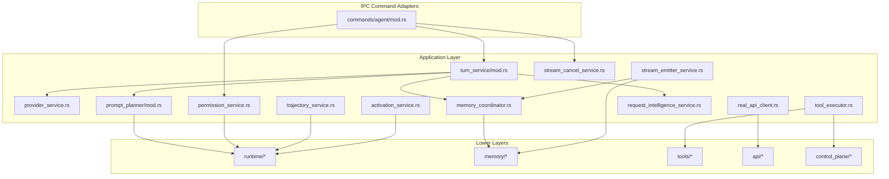

**Diagram sources**
- [application/mod.rs:45-124](file://src-tauri/src/modules/application/mod.rs#L45-L124)
- [turn_service/mod.rs:1-347](file://src-tauri/src/modules/application/turn_service/mod.rs#L1-L347)
- [provider_service.rs:22-125](file://src-tauri/src/modules/application/provider_service.rs#L22-L125)
- [prompt_planner/mod.rs:35-373](file://src-tauri/src/modules/application/prompt_planner/mod.rs#L35-L373)
- [memory_coordinator.rs:42-335](file://src-tauri/src/modules/application/memory_coordinator.rs#L42-L335)
- [stream_emitter_service.rs:12-122](file://src-tauri/src/modules/application/stream_emitter_service.rs#L12-L122)
- [permission_service.rs:1-251](file://src-tauri/src/modules/application/permission_service.rs#L1-L251)
- [real_api_client.rs:10-171](file://src-tauri/src/modules/application/real_api_client.rs#L10-L171)
- [tool_executor.rs:8-143](file://src-tauri/src/modules/application/tool_executor.rs#L8-L143)
- [trajectory_service.rs:8-58](file://src-tauri/src/modules/application/trajectory_service.rs#L8-L58)
- [request_intelligence_service.rs:22-61](file://src-tauri/src/modules/application/request_intelligence_service.rs#L22-L61)
- [activation_service.rs:37-254](file://src-tauri/src/modules/application/activation_service.rs#L37-L254)
- [stream_cancel_service.rs:1-51](file://src-tauri/src/modules/application/stream_cancel_service.rs#L1-L51)
- [commands/agent/mod.rs:1-220](file://src-tauri/src/commands/agent/mod.rs#L1-L220)

**Section sources**
- [application/mod.rs:1-124](file://src-tauri/src/modules/application/mod.rs#L1-L124)

## Core Components
- TurnService: Composes provider resolution, request intelligence, memory orchestration, and prompt planning into a single PreparedChatInputs bundle for the runtime.
- ProviderService: Resolves a concrete provider client, model, and timeout from configuration.
- PromptPlanner: Builds a structured PromptPlan from system prompt, web-tools guide, memory injection sections, and optional active strategy overlay.
- MemoryCoordinator: Orchestrates per-turn recall/injection and post-turn write decisions (policy, quality gate, conflict resolution).
- StreamEmitterService: Dispatches a typed after-turn envelope to both frontend and harness transports.
- PermissionService: Bridges runtime PermissionPrompter with Tauri IPC for permission prompts (extracted from IPC adapters).
- RealApiClient: Implements the runtime ApiClient over the outbound ProviderClient.
- ToolExecutor: Bridges async ToolRegistry to the runtime's ToolExecutor trait and loads control plane switches.
- ToolHeuristics: Heuristics for interpreting tool results and shell commands.
- TrajectoryService: Records conversation trajectories for future RL training.
- RequestIntelligenceService: Runs a deterministic classifier to decide execution mode.
- ActivationService: Wraps onboarding-style activation and exposes typed activation snapshots.
- StreamCancelService: Centralized service for managing agent stream cancellations across the application.

**Updated** Added StreamCancelService for centralized cancellation management and updated PermissionService description to reflect extraction from IPC adapters.

**Section sources**
- [turn_service/mod.rs:152-322](file://src-tauri/src/modules/application/turn_service/mod.rs#L152-L322)
- [provider_service.rs:31-125](file://src-tauri/src/modules/application/provider_service.rs#L31-L125)
- [prompt_planner/mod.rs:56-373](file://src-tauri/src/modules/application/prompt_planner/mod.rs#L56-L373)
- [memory_coordinator.rs:57-335](file://src-tauri/src/modules/application/memory_coordinator.rs#L57-L335)
- [stream_emitter_service.rs:21-122](file://src-tauri/src/modules/application/stream_emitter_service.rs#L21-L122)
- [permission_service.rs:15-251](file://src-tauri/src/modules/application/permission_service.rs#L15-L251)
- [real_api_client.rs:18-171](file://src-tauri/src/modules/application/real_api_client.rs#L18-L171)
- [tool_executor.rs:52-143](file://src-tauri/src/modules/application/tool_executor.rs#L52-L143)
- [tool_heuristics.rs:1-104](file://src-tauri/src/modules/application/tool_heuristics.rs#L1-L104)
- [trajectory_service.rs:14-58](file://src-tauri/src/modules/application/trajectory_service.rs#L14-L58)
- [request_intelligence_service.rs:29-61](file://src-tauri/src/modules/application/request_intelligence_service.rs#L29-L61)
- [activation_service.rs:74-254](file://src-tauri/src/modules/application/activation_service.rs#L74-L254)
- [stream_cancel_service.rs:16-51](file://src-tauri/src/modules/application/stream_cancel_service.rs#L16-L51)

## Architecture Overview
The application layer enforces strict separation of concerns:
- Application services depend on runtime, memory, tools, and api modules, but not on commands.
- Orchestration occurs via typed inputs/outputs and stable contracts.
- Cross-cutting concerns (permissions, telemetry, tracing) are centralized.
- IPC command adapters remain thin wrappers that delegate to application services.

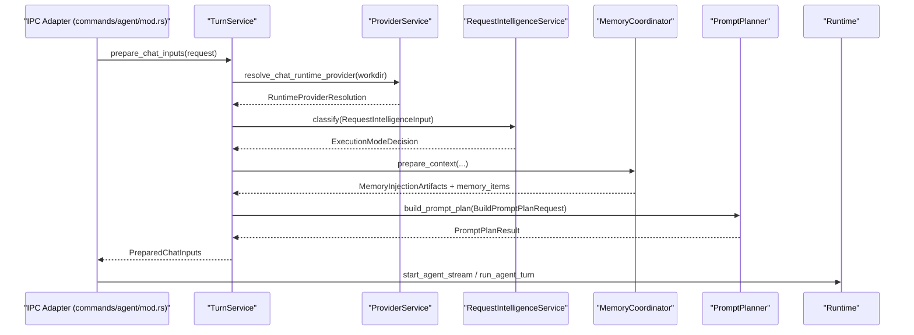

**Updated** Added stream cancellation flow to the architecture diagram.

**Diagram sources**
- [turn_service/mod.rs:242-322](file://src-tauri/src/modules/application/turn_service/mod.rs#L242-L322)
- [provider_service.rs:81-125](file://src-tauri/src/modules/application/provider_service.rs#L81-L125)
- [request_intelligence_service.rs:50-61](file://src-tauri/src/modules/application/request_intelligence_service.rs#L50-L61)
- [memory_coordinator.rs:105-124](file://src-tauri/src/modules/application/memory_coordinator.rs#L105-L124)
- [prompt_planner/mod.rs:210-277](file://src-tauri/src/modules/application/prompt_planner/mod.rs#L210-L277)

## Detailed Component Analysis

### TurnService
TurnService is the first orchestration seam for a single turn. It:
- Resolves the provider client and model.
- Classifies the request to determine execution mode.
- Delegates memory preparation to MemoryCoordinator.
- Builds the prompt plan via PromptPlanner.
- Returns a PreparedChatInputs bundle for the runtime.

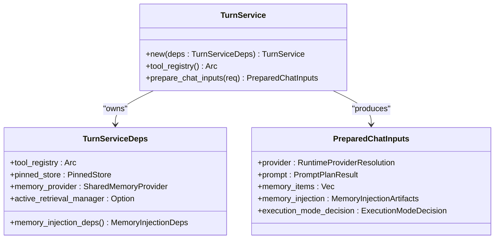

**Diagram sources**
- [turn_service/mod.rs:152-322](file://src-tauri/src/modules/application/turn_service/mod.rs#L152-L322)

**Section sources**
- [turn_service/mod.rs:152-322](file://src-tauri/src/modules/application/turn_service/mod.rs#L152-L322)

### ProviderService
ProviderService resolves a concrete provider client, model id, and request timeout from configuration. It preserves legacy fallback behavior and transport policy semantics.

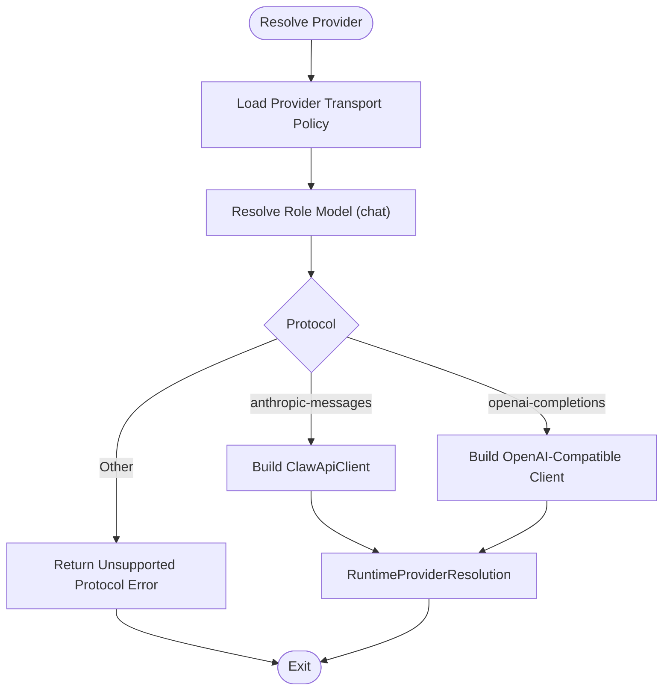

**Diagram sources**
- [provider_service.rs:48-125](file://src-tauri/src/modules/application/provider_service.rs#L48-L125)

**Section sources**
- [provider_service.rs:31-125](file://src-tauri/src/modules/application/provider_service.rs#L31-L125)

### PromptPlanner and Prompt Planner Components
PromptPlanner builds a structured PromptPlan with stable block kinds and renders a single text. It delegates sanitization, preflight estimation, and governance to submodules.

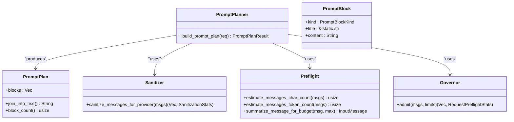

**Diagram sources**
- [prompt_planner/mod.rs:56-373](file://src-tauri/src/modules/application/prompt_planner/mod.rs#L56-L373)
- [prompt_planner/sanitize.rs:49-148](file://src-tauri/src/modules/application/prompt_planner/sanitize.rs#L49-L148)
- [prompt_planner/preflight.rs:10-142](file://src-tauri/src/modules/application/prompt_planner/preflight.rs#L10-L142)
- [prompt_planner/governor.rs:34-172](file://src-tauri/src/modules/application/prompt_planner/governor.rs#L34-L172)

**Section sources**
- [prompt_planner/mod.rs:195-277](file://src-tauri/src/modules/application/prompt_planner/mod.rs#L195-L277)
- [prompt_planner/sanitize.rs:1-172](file://src-tauri/src/modules/application/prompt_planner/sanitize.rs#L1-L172)
- [prompt_planner/preflight.rs:1-142](file://src-tauri/src/modules/application/prompt_planner/preflight.rs#L1-L142)
- [prompt_planner/governor.rs:1-204](file://src-tauri/src/modules/application/prompt_planner/governor.rs#L1-L204)

### MemoryCoordinator
MemoryCoordinator orchestrates per-turn recall and injection and computes post-turn write decisions in a staged pipeline: policy → quality gate → conflict resolution.

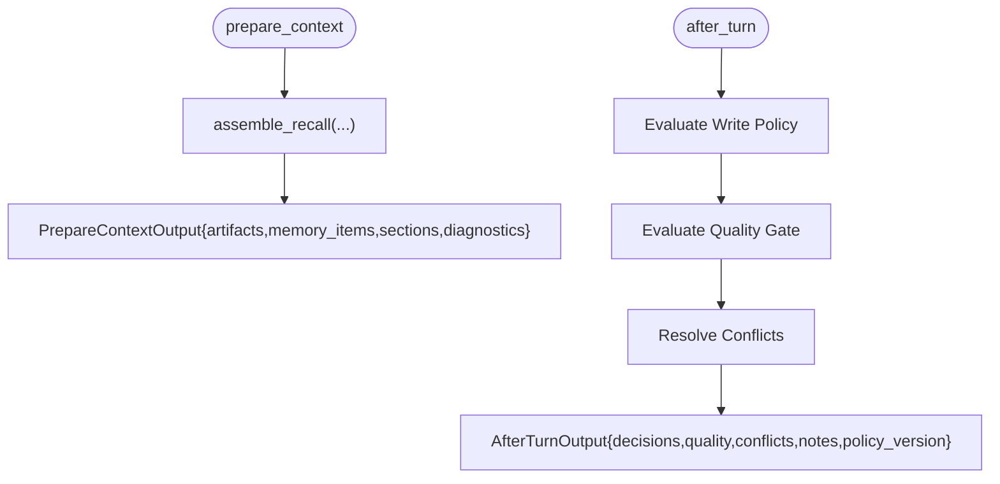

**Diagram sources**
- [memory_coordinator.rs:96-179](file://src-tauri/src/modules/application/memory_coordinator.rs#L96-L179)

**Section sources**
- [memory_coordinator.rs:57-335](file://src-tauri/src/modules/application/memory_coordinator.rs#L57-L335)

### StreamEmitterService
Dispatches a typed after-turn envelope to both frontend and harness transports, carrying decisions, quality, and conflicts.

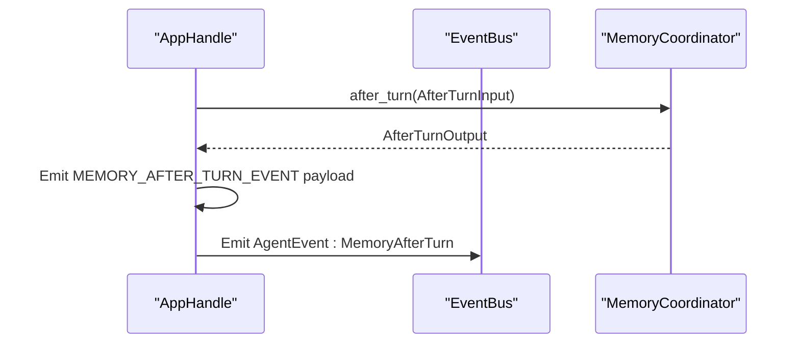

**Diagram sources**
- [stream_emitter_service.rs:52-122](file://src-tauri/src/modules/application/stream_emitter_service.rs#L52-L122)

**Section sources**
- [stream_emitter_service.rs:21-122](file://src-tauri/src/modules/application/stream_emitter_service.rs#L21-L122)

### PermissionService
Bridges the runtime PermissionPrompter trait with Tauri IPC by emitting permission-request events and awaiting user decisions. **Extracted from IPC adapters** into a dedicated application service.

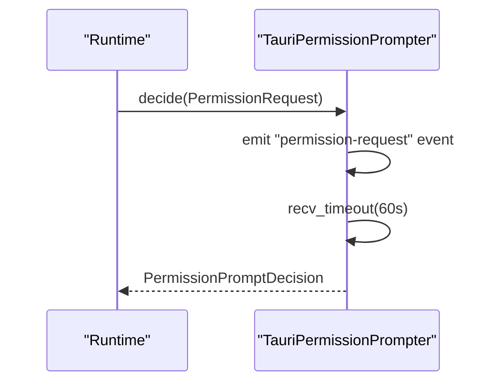

**Updated** PermissionService is now a dedicated application service that handles permission prompt responses centrally.

**Diagram sources**
- [permission_service.rs:51-94](file://src-tauri/src/modules/application/permission_service.rs#L51-L94)

**Section sources**
- [permission_service.rs:15-251](file://src-tauri/src/modules/application/permission_service.rs#L15-L251)

### StreamCancelService
Centralized service for managing agent stream cancellations across the application. **New component** that handles the lookup-and-fire behavior for stopping in-flight streaming turns.

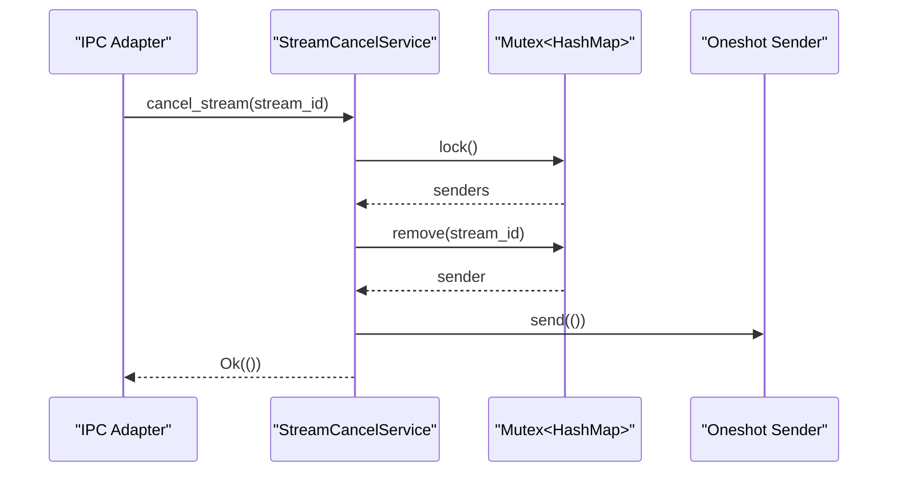

**New** Added StreamCancelService for centralized cancellation management.

**Diagram sources**
- [stream_cancel_service.rs:30-50](file://src-tauri/src/modules/application/stream_cancel_service.rs#L30-L50)

**Section sources**
- [stream_cancel_service.rs:16-51](file://src-tauri/src/modules/application/stream_cancel_service.rs#L16-L51)

### RealApiClient
Implements the runtime ApiClient over the outbound ProviderClient, converting runtime blocks to provider messages and streaming assistant events.

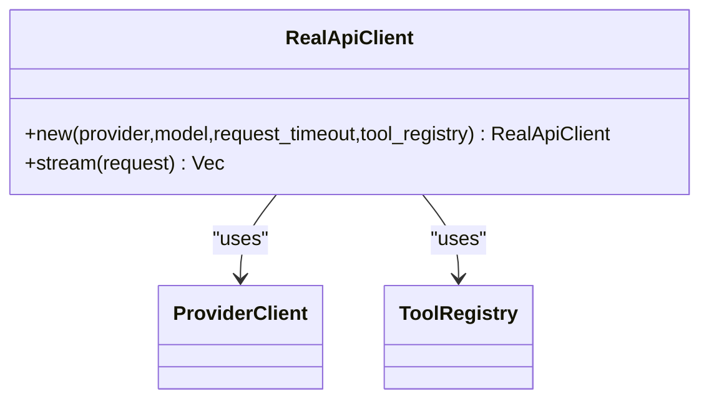

**Diagram sources**
- [real_api_client.rs:21-171](file://src-tauri/src/modules/application/real_api_client.rs#L21-L171)

**Section sources**
- [real_api_client.rs:18-171](file://src-tauri/src/modules/application/real_api_client.rs#L18-L171)

### ToolExecutor
Bridges async ToolRegistry to the runtime's ToolExecutor trait and loads control plane switches from configuration.

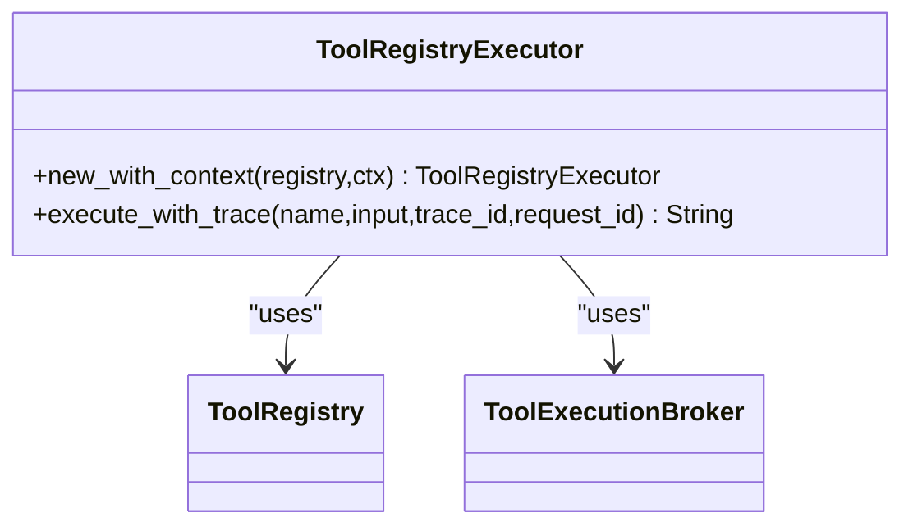

**Diagram sources**
- [tool_executor.rs:52-143](file://src-tauri/src/modules/application/tool_executor.rs#L52-L143)

**Section sources**
- [tool_executor.rs:14-143](file://src-tauri/src/modules/application/tool_executor.rs#L14-L143)

### ToolHeuristics
Provides heuristics to detect unverified file claims, mutating tool successes, and shell commands likely to mutate files.

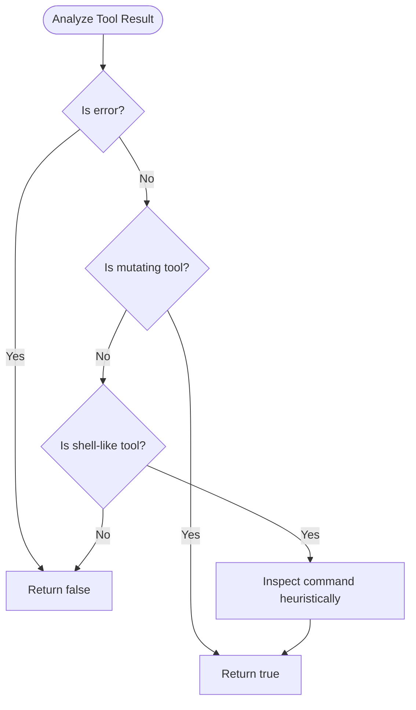

**Diagram sources**
- [tool_heuristics.rs:27-95](file://src-tauri/src/modules/application/tool_heuristics.rs#L27-L95)

**Section sources**
- [tool_heuristics.rs:1-104](file://src-tauri/src/modules/application/tool_heuristics.rs#L1-L104)

### TrajectoryService
Records conversation trajectories for RL training, preferring a shared AppState manager and falling back to a temporary manager.

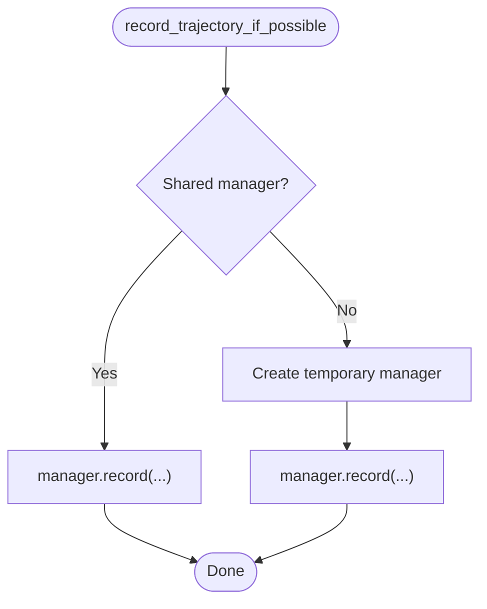

**Diagram sources**
- [trajectory_service.rs:23-57](file://src-tauri/src/modules/application/trajectory_service.rs#L23-L57)

**Section sources**
- [trajectory_service.rs:14-58](file://src-tauri/src/modules/application/trajectory_service.rs#L14-L58)

### RequestIntelligenceService
Runs a deterministic classifier to decide execution mode for a turn.

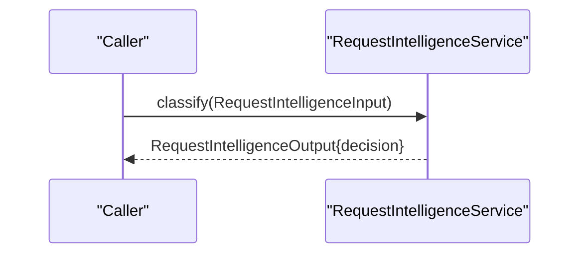

**Diagram sources**
- [request_intelligence_service.rs:50-61](file://src-tauri/src/modules/application/request_intelligence_service.rs#L50-L61)

**Section sources**
- [request_intelligence_service.rs:29-61](file://src-tauri/src/modules/application/request_intelligence_service.rs#L29-L61)

### ActivationService
Wraps onboarding-style activation and exposes typed activation snapshots and checks.

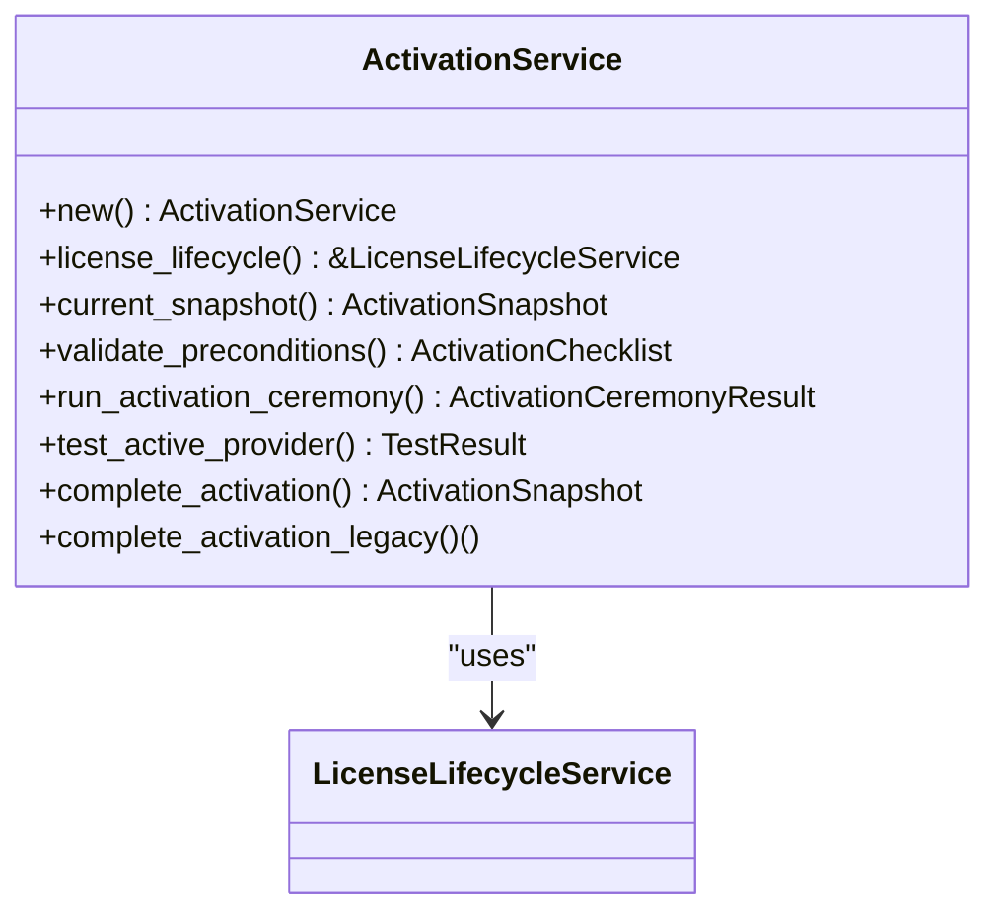

**Diagram sources**
- [activation_service.rs:76-254](file://src-tauri/src/modules/application/activation_service.rs#L76-L254)

**Section sources**
- [activation_service.rs:74-254](file://src-tauri/src/modules/application/activation_service.rs#L74-L254)

## IPC Command Adapters
**Updated** IPC command adapters are now thin wrappers that delegate to application-layer services. They handle parameter parsing and dependency injection but contain no business logic.

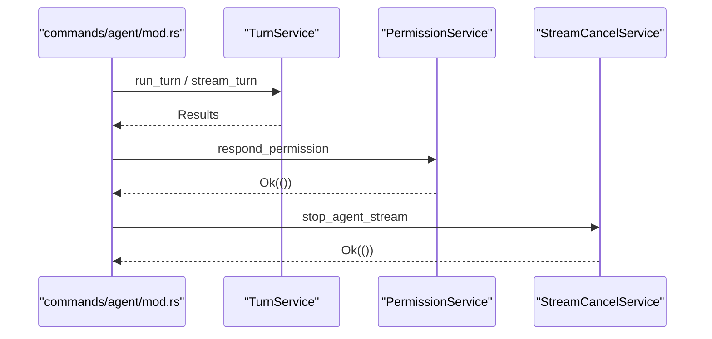

**New** Added comprehensive documentation for IPC command adapters showing delegation patterns.

**Diagram sources**
- [commands/agent/mod.rs:90-216](file://src-tauri/src/commands/agent/mod.rs#L90-L216)

**Section sources**
- [commands/agent/mod.rs:1-220](file://src-tauri/src/commands/agent/mod.rs#L1-L220)

## Dependency Analysis
- Coupling: TurnService depends on ProviderService, RequestIntelligenceService, MemoryCoordinator, and PromptPlanner. These dependencies are intentional and stable.
- Cohesion: Each service encapsulates a single responsibility (provider resolution, prompt planning, memory orchestration, etc.).
- External dependencies: Services import runtime, memory, tools, api, and control_plane modules as needed.
- No circular dependencies: The module re-exports and imports are controlled via mod.rs and do not introduce cycles.
- **Updated** PermissionService and StreamCancelService are now central application services that IPC adapters delegate to.

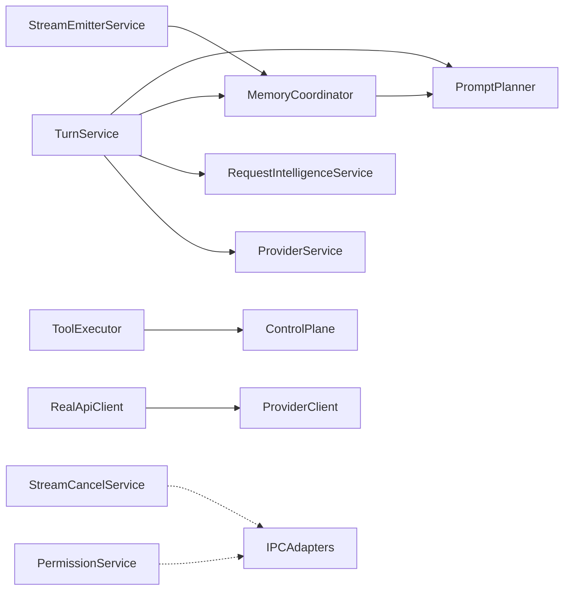

**Diagram sources**
- [application/mod.rs:45-124](file://src-tauri/src/modules/application/mod.rs#L45-L124)
- [turn_service/mod.rs:35-43](file://src-tauri/src/modules/application/turn_service/mod.rs#L35-L43)
- [memory_coordinator.rs:49-55](file://src-tauri/src/modules/application/memory_coordinator.rs#L49-L55)
- [stream_emitter_service.rs:14-19](file://src-tauri/src/modules/application/stream_emitter_service.rs#L14-L19)
- [tool_executor.rs:10-11](file://src-tauri/src/modules/application/tool_executor.rs#L10-L11)
- [real_api_client.rs:12-16](file://src-tauri/src/modules/application/real_api_client.rs#L12-L16)

**Section sources**
- [application/mod.rs:1-124](file://src-tauri/src/modules/application/mod.rs#L1-L124)

## Performance Considerations
- Blocking in sync contexts: RealApiClient uses block_in_place to call async functions from the sync stream method. Ensure timeouts are configured appropriately to avoid long blocking periods.
- Budgeting and trimming: PromptPlanner's governor trims messages and tokens to fit provider budgets. Keep token/char estimates accurate to minimize retries.
- Memory orchestration: MemoryCoordinator's after_turn pipeline (policy → quality gate → conflict resolution) should be efficient; avoid unnecessary recomputation of classifiers or activation status.
- Permission prompts: PermissionService blocks on an mpsc channel; keep UI responsiveness by minimizing prompt frequency and providing clear user feedback.
- **Updated** Stream cancellation: StreamCancelService uses a mutex-protected HashMap for tracking cancellation senders. Ensure proper cleanup to prevent memory leaks.

## Troubleshooting Guide
- Provider resolution failures: Verify transport policy loading and model resolution. Check for missing API keys or unsupported protocols.
- Prompt planner errors: Validate system prompt loading and ensure memory injection artifacts are present when expected.
- Tool execution errors: Confirm control plane switches and tool registry definitions. Use ToolExecutor's trace id for auditing.
- Permission denials: Review PermissionPrompter decisions and ensure frontend listeners are registered for permission-request events.
- Stream emissions: If MEMORY_AFTER_TURN_EVENT or harness events fail, check logging for non-fatal errors and ensure the bus is subscribed.
- **Updated** Stream cancellation failures: Check for locked mutex errors or missing stream IDs in the StreamCancelService. Verify that the stream_id matches the one registered during turn startup.
- **Updated** Permission response handling: Ensure the respond_permission IPC command is properly registered and that the session_id matches the pending request.

**Section sources**
- [provider_service.rs:48-125](file://src-tauri/src/modules/application/provider_service.rs#L48-L125)
- [prompt_planner/mod.rs:188-194](file://src-tauri/src/modules/application/prompt_planner/mod.rs#L188-L194)
- [tool_executor.rs:118-143](file://src-tauri/src/modules/application/tool_executor.rs#L118-L143)
- [permission_service.rs:43-86](file://src-tauri/src/modules/application/permission_service.rs#L43-86)
- [stream_emitter_service.rs:92-121](file://src-tauri/src/modules/application/stream_emitter_service.rs#L92-L121)
- [stream_cancel_service.rs:24-50](file://src-tauri/src/modules/application/stream_cancel_service.rs#L24-L50)

## Conclusion
The application layer cleanly separates orchestration from IPC and lower-level modules. It introduces typed contracts and stable seams to support future M2+ projections and M4+ governance. The services demonstrate clear responsibilities, predictable dependencies, and robust error handling strategies. Initialization and dependency injection are achieved via constructors and re-exports in mod.rs, enabling modular composition and testability.

**Updated** The recent refactoring successfully extracted permission handling and stream cancellation into dedicated application services, while maintaining thin IPC command adapters. This improves code organization, reduces coupling, and provides better separation of concerns across the application layer.