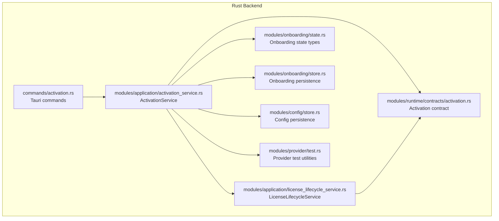
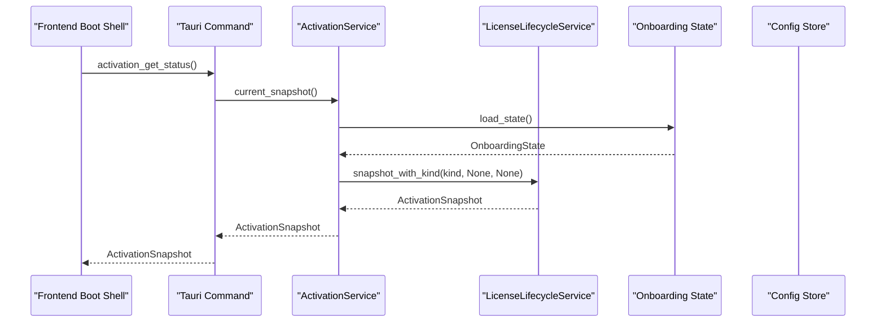
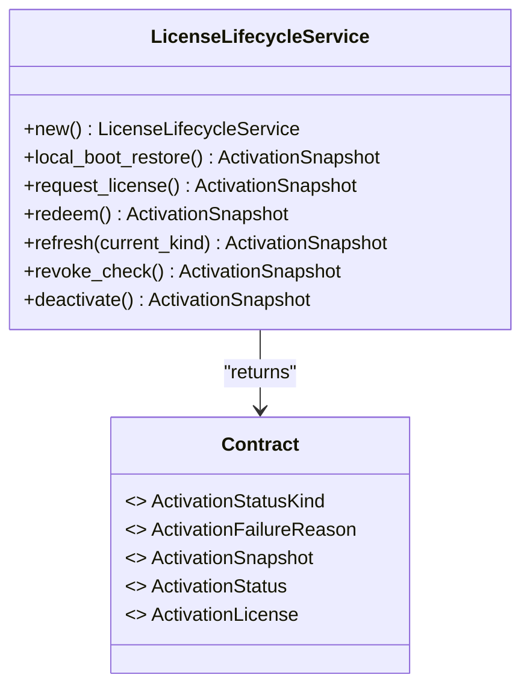
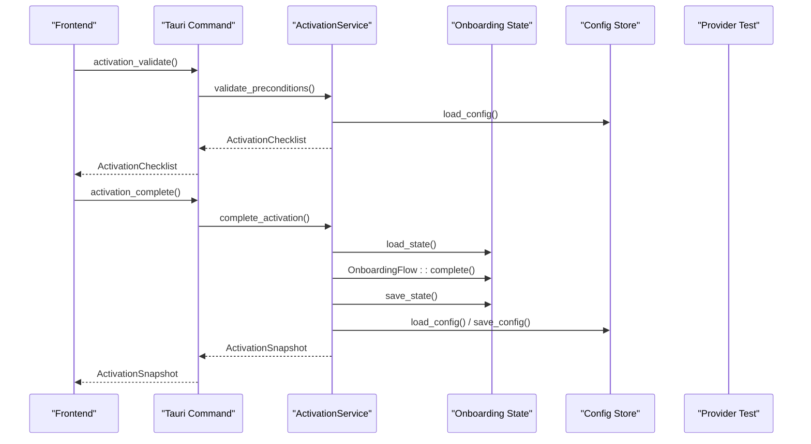
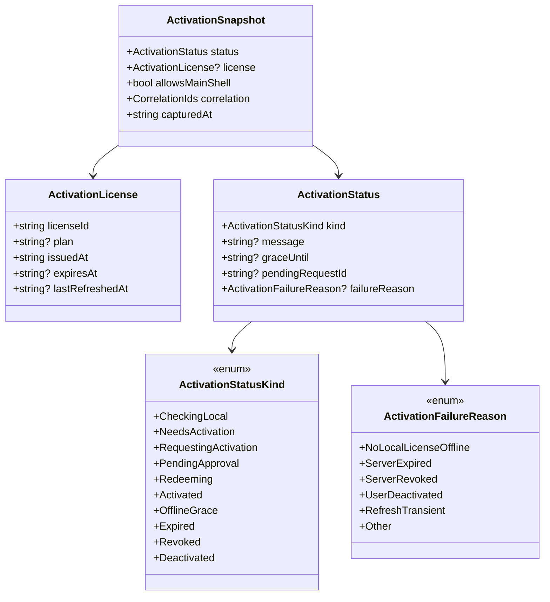
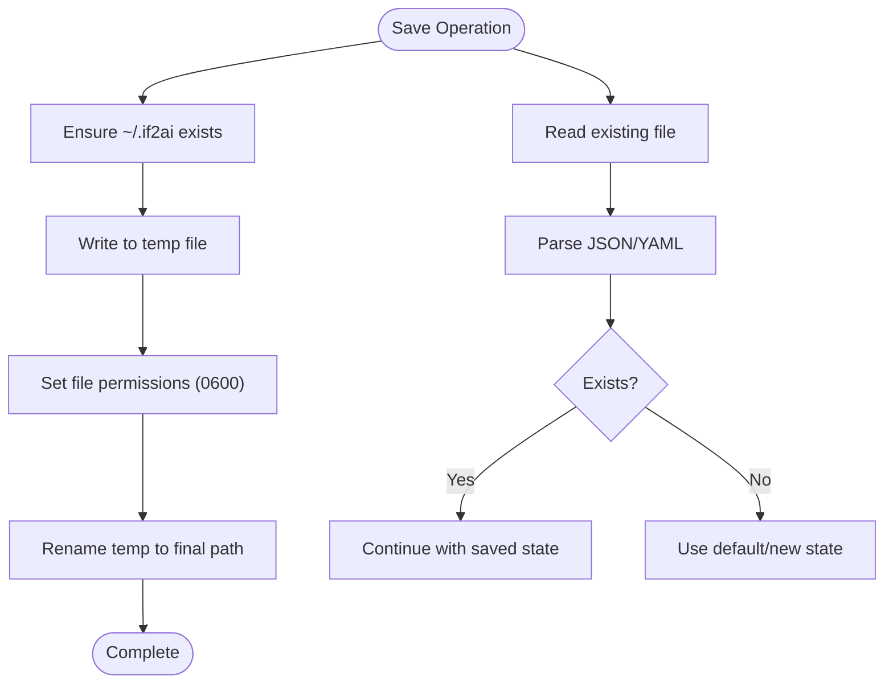
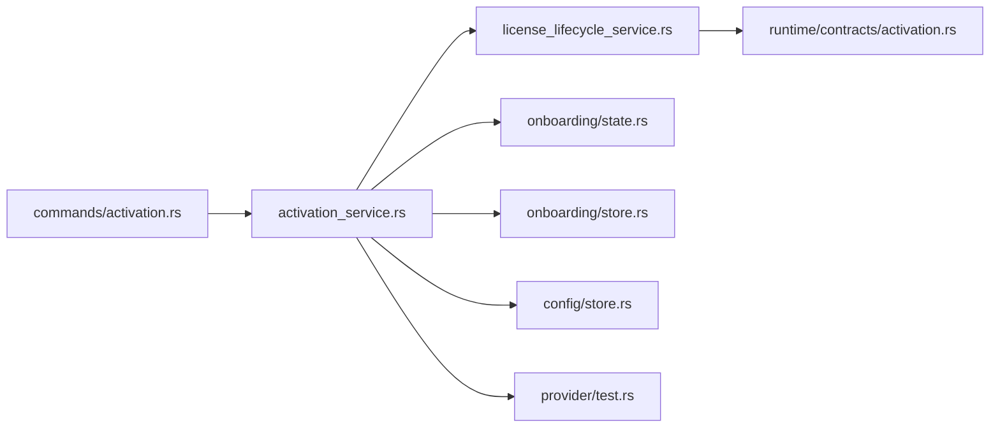

# License Lifecycle Service

<cite>
**Referenced Files in This Document**
- [license_lifecycle_service.rs](file://src-tauri/src/modules/application/license_lifecycle_service.rs)
- [activation_service.rs](file://src-tauri/src/modules/application/activation_service.rs)
- [activation.rs](file://src-tauri/src/commands/activation.rs)
- [activation.rs](file://src-tauri/src/modules/runtime/contracts/activation.rs)
- [state.rs](file://src-tauri/src/modules/onboarding/state.rs)
- [store.rs](file://src-tauri/src/modules/onboarding/store.rs)
- [store.rs](file://src-tauri/src/modules/config/store.rs)
- [test.rs](file://src-tauri/src/modules/provider/test.rs)
- [activation-gate-and-license-lifecycle-design.md](file://docs/staff-remediation/activation-gate-and-license-lifecycle-design.md)
- [MIG-009-activation-license-lifecycle.md](file://docs/packs/feature/migration-core/MIG-009-activation-license-lifecycle.md)
</cite>

## Table of Contents
1. [Introduction](#introduction)
2. [Project Structure](#project-structure)
3. [Core Components](#core-components)
4. [Architecture Overview](#architecture-overview)
5. [Detailed Component Analysis](#detailed-component-analysis)
6. [Dependency Analysis](#dependency-analysis)
7. [Performance Considerations](#performance-considerations)
8. [Troubleshooting Guide](#troubleshooting-guide)
9. [Conclusion](#conclusion)

## Introduction
This document explains the license lifecycle service module that manages activation gating and license state transitions for the If2Ai platform. It covers the LicenseLifecycleService implementation, its integration with the ActivationService, and the canonical activation snapshot contract. The service is designed as a typed, contract-driven component that will evolve into a full-featured lifecycle manager while maintaining backward compatibility with the existing onboarding flow.

## Project Structure
The license lifecycle service resides in the Rust backend under the application module and integrates with runtime contracts, onboarding state, and Tauri commands.

**Diagram sources**
- [activation.rs:1-127](file://src-tauri/src/commands/activation.rs#L1-L127)
- [activation_service.rs:1-291](file://src-tauri/src/modules/application/activation_service.rs#L1-L291)
- [license_lifecycle_service.rs:1-165](file://src-tauri/src/modules/application/license_lifecycle_service.rs#L1-L165)
- [activation.rs:1-262](file://src-tauri/src/modules/runtime/contracts/activation.rs#L1-L262)
- [state.rs:1-330](file://src-tauri/src/modules/onboarding/state.rs#L1-L330)
- [store.rs:1-199](file://src-tauri/src/modules/onboarding/store.rs#L1-L199)
- [store.rs:1-302](file://src-tauri/src/modules/config/store.rs#L1-L302)
- [test.rs:1-495](file://src-tauri/src/modules/provider/test.rs#L1-L495)

**Section sources**
- [license_lifecycle_service.rs:1-165](file://src-tauri/src/modules/application/license_lifecycle_service.rs#L1-L165)
- [activation_service.rs:1-291](file://src-tauri/src/modules/application/activation_service.rs#L1-L291)
- [activation.rs:1-127](file://src-tauri/src/commands/activation.rs#L1-L127)
- [activation.rs:1-262](file://src-tauri/src/modules/runtime/contracts/activation.rs#L1-L262)
- [state.rs:1-330](file://src-tauri/src/modules/onboarding/state.rs#L1-L330)
- [store.rs:1-199](file://src-tauri/src/modules/onboarding/store.rs#L1-L199)
- [store.rs:1-302](file://src-tauri/src/modules/config/store.rs#L1-L302)
- [test.rs:1-495](file://src-tauri/src/modules/provider/test.rs#L1-L495)

## Core Components
- LicenseLifecycleService: Provides typed lifecycle transitions and builds canonical ActivationSnapshot instances. It currently returns placeholder snapshots reflecting the current phase scope.
- ActivationService: Composes legacy onboarding logic with the new typed lifecycle surface, exposing a stable interface for the boot shell and IPC commands.
- Runtime Contracts: Define the canonical activation state machine, status kinds, failure reasons, and snapshot structure.
- Onboarding State and Persistence: Provide the source of truth for activation gating during the initial phase.
- Provider Testing Utilities: Support preconditions validation and activation ceremony.

Key responsibilities:
- LicenseLifecycleService: Manages state transitions (local boot restore, request, redeem, refresh, revoke check, deactivate) and constructs snapshots with computed allowance flags.
- ActivationService: Bridges legacy onboarding with the typed lifecycle, validates preconditions, runs the activation ceremony, and marks onboarding complete.
- Contracts: Enforce a stable wire format for activation states and actions.

**Section sources**
- [license_lifecycle_service.rs:33-130](file://src-tauri/src/modules/application/license_lifecycle_service.rs#L33-L130)
- [activation_service.rs:74-254](file://src-tauri/src/modules/application/activation_service.rs#L74-L254)
- [activation.rs:22-154](file://src-tauri/src/modules/runtime/contracts/activation.rs#L22-L154)
- [state.rs:151-202](file://src-tauri/src/modules/onboarding/state.rs#L151-L202)

## Architecture Overview
The system follows a layered architecture:
- Commands layer: Thin Tauri command handlers delegate to the ActivationService.
- Application layer: ActivationService composes onboarding state, configuration, provider testing, and the LicenseLifecycleService.
- Contracts layer: Defines the canonical activation data structures and state machine.
- Persistence layer: Onboarding state and configuration are persisted to the user's home directory.

**Diagram sources**
- [activation.rs:123-126](file://src-tauri/src/commands/activation.rs#L123-L126)
- [activation_service.rs:123-138](file://src-tauri/src/modules/application/activation_service.rs#L123-L138)
- [license_lifecycle_service.rs:108-130](file://src-tauri/src/modules/application/license_lifecycle_service.rs#L108-L130)
- [state.rs:151-174](file://src-tauri/src/modules/onboarding/state.rs#L151-L174)
- [store.rs:1-302](file://src-tauri/src/modules/config/store.rs#L1-L302)

## Detailed Component Analysis

### LicenseLifecycleService
Purpose:
- Owns canonical lifecycle transitions for ActivationLicense and returns typed ActivationSnapshot instances.
- Enforces typed boundaries and defers remote backend integration to later slices.
- Computes allows_main_shell internally to prevent caller-side recomputation.

Core methods:
- local_boot_restore: Returns a placeholder snapshot indicating NeedsActivation.
- request_license: Returns a snapshot indicating RequestingActivation.
- redeem: Returns a snapshot indicating Redeeming.
- refresh: Branches on current state to return Activated or NeedsActivation.
- revoke_check: Placeholder returning Activated.
- deactivate: Returns a snapshot with Deactivated and UserDeactivated failure reason.

Snapshot construction:
- snapshot_with_kind centralizes snapshot creation and computes allows_main_shell based on the status kind.

**Diagram sources**
- [license_lifecycle_service.rs:41-130](file://src-tauri/src/modules/application/license_lifecycle_service.rs#L41-L130)
- [activation.rs:22-154](file://src-tauri/src/modules/runtime/contracts/activation.rs#L22-L154)

**Section sources**
- [license_lifecycle_service.rs:51-103](file://src-tauri/src/modules/application/license_lifecycle_service.rs#L51-L103)
- [license_lifecycle_service.rs:108-130](file://src-tauri/src/modules/application/license_lifecycle_service.rs#L108-L130)

### ActivationService
Purpose:
- Composes legacy onboarding with the typed lifecycle surface.
- Exposes a stable interface for the boot shell and IPC commands.
- Validates preconditions, runs the activation ceremony, and completes onboarding.

Key responsibilities:
- current_snapshot: Honesty mapping to onboarding state; returns Activated if onboarding is complete, otherwise NeedsActivation.
- validate_preconditions: Checks security confirmation, provider configuration completeness, and channel configuration presence.
- run_activation_ceremony: Sends a greeting to the configured provider and returns a ceremony result.
- test_active_provider: Verifies provider connectivity.
- complete_activation: Marks onboarding complete, persists state, updates configuration, and returns a typed snapshot.

Integration points:
- Uses LicenseLifecycleService for snapshot construction via snapshot_with_kind.
- Loads and saves onboarding state from ~/.if2ai/state.json.
- Persists configuration to ~/.if2ai/config.json with atomic writes.

**Diagram sources**
- [activation_service.rs:142-253](file://src-tauri/src/modules/application/activation_service.rs#L142-L253)
- [activation.rs:75-108](file://src-tauri/src/commands/activation.rs#L75-L108)
- [state.rs:151-202](file://src-tauri/src/modules/onboarding/state.rs#L151-L202)
- [store.rs:39-68](file://src-tauri/src/modules/onboarding/store.rs#L39-L68)
- [store.rs:74-115](file://src-tauri/src/modules/config/store.rs#L74-L115)
- [test.rs:37-92](file://src-tauri/src/modules/provider/test.rs#L37-L92)

**Section sources**
- [activation_service.rs:74-254](file://src-tauri/src/modules/application/activation_service.rs#L74-L254)
- [activation.rs:75-108](file://src-tauri/src/commands/activation.rs#L75-L108)
- [state.rs:151-202](file://src-tauri/src/modules/onboarding/state.rs#L151-L202)
- [store.rs:39-68](file://src-tauri/src/modules/onboarding/store.rs#L39-L68)
- [store.rs:74-115](file://src-tauri/src/modules/config/store.rs#L74-L115)
- [test.rs:37-92](file://src-tauri/src/modules/provider/test.rs#L37-L92)

### Runtime Contracts for Activation
Defines the canonical state machine and data structures:
- ActivationStatusKind: Canonical states including CheckingLocal, NeedsActivation, RequestingActivation, PendingApproval, Redeeming, Activated, OfflineGrace, Expired, Revoked, Deactivated.
- ActivationStatus: Rich status with optional metadata (message, grace_until, pending_request_id, failure_reason).
- ActivationLicense: Summary of license details suitable for frontend display.
- ActivationSnapshot: Full projection with allows_main_shell computed by the backend.

**Diagram sources**
- [activation.rs:22-154](file://src-tauri/src/modules/runtime/contracts/activation.rs#L22-L154)

**Section sources**
- [activation.rs:22-154](file://src-tauri/src/modules/runtime/contracts/activation.rs#L22-L154)

### State Persistence Patterns
Onboarding state and configuration persistence:
- Onboarding state: Stored in ~/.if2ai/state.json with atomic write semantics and 0600 permissions.
- Configuration: Stored in ~/.if2ai/config.json with atomic write semantics and 0600 permissions.
- Both use temporary files and rename operations to ensure atomicity and prevent corruption.

**Diagram sources**
- [store.rs:87-121](file://src-tauri/src/modules/onboarding/store.rs#L87-L121)
- [store.rs:83-115](file://src-tauri/src/modules/config/store.rs#L83-L115)

**Section sources**
- [store.rs:39-121](file://src-tauri/src/modules/onboarding/store.rs#L39-L121)
- [store.rs:74-115](file://src-tauri/src/modules/config/store.rs#L74-L115)

## Dependency Analysis
- LicenseLifecycleService depends on runtime activation contracts for types and constants.
- ActivationService depends on LicenseLifecycleService, onboarding state, configuration store, and provider testing utilities.
- Commands layer depends on ActivationService for all activation-related operations.

**Diagram sources**
- [activation.rs:21-26](file://src-tauri/src/commands/activation.rs#L21-L26)
- [activation_service.rs:39-47](file://src-tauri/src/modules/application/activation_service.rs#L39-L47)
- [license_lifecycle_service.rs:33-37](file://src-tauri/src/modules/application/license_lifecycle_service.rs#L33-L37)
- [activation.rs:18-21](file://src-tauri/src/modules/runtime/contracts/activation.rs#L18-L21)

**Section sources**
- [activation_service.rs:39-47](file://src-tauri/src/modules/application/activation_service.rs#L39-L47)
- [license_lifecycle_service.rs:33-37](file://src-tauri/src/modules/application/license_lifecycle_service.rs#L33-L37)
- [activation.rs:18-21](file://src-tauri/src/modules/runtime/contracts/activation.rs#L18-L21)

## Performance Considerations
- Asynchronous operations: All lifecycle and service methods are async to avoid blocking the Tauri command thread.
- Minimal I/O: LicenseLifecycleService currently avoids network calls and disk I/O, focusing on snapshot construction.
- Atomic persistence: Onboarding and configuration persistence uses atomic write patterns to minimize corruption risk.
- Provider testing timeouts: Provider connectivity checks enforce strict timeouts to prevent UI stalls.

## Troubleshooting Guide
Common scenarios and resolutions:
- Onboarding state not found: The system defaults to NeedsActivation and logs a debug message. Verify ~/.if2ai/state.json exists and is readable.
- Provider configuration errors: Activation preconditions fail if provider is incomplete. Ensure base_url and API key are set appropriately for the selected provider.
- Activation ceremony failures: The greeting test is non-fatal; the ceremony proceeds without a first-response message if the test times out or fails.
- Configuration persistence errors: Atomic write failures indicate filesystem issues. Check permissions and available disk space in ~/.if2ai/.

**Section sources**
- [activation_service.rs:124-129](file://src-tauri/src/modules/application/activation_service.rs#L124-L129)
- [activation_service.rs:168-194](file://src-tauri/src/modules/application/activation_service.rs#L168-L194)
- [store.rs:76-84](file://src-tauri/src/modules/onboarding/store.rs#L76-L84)
- [test.rs:124-153](file://src-tauri/src/modules/provider/test.rs#L124-L153)

## Conclusion
The license lifecycle service module establishes a typed, contract-driven foundation for activation gating and license state management. It preserves backward compatibility with the existing onboarding flow while preparing the ground for future remote license backend integration. The design emphasizes stability, atomic persistence, and clear separation of concerns across layers.