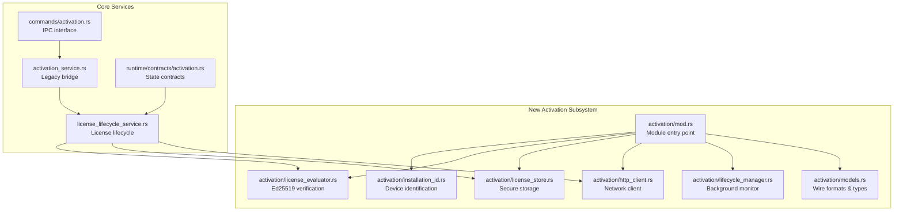
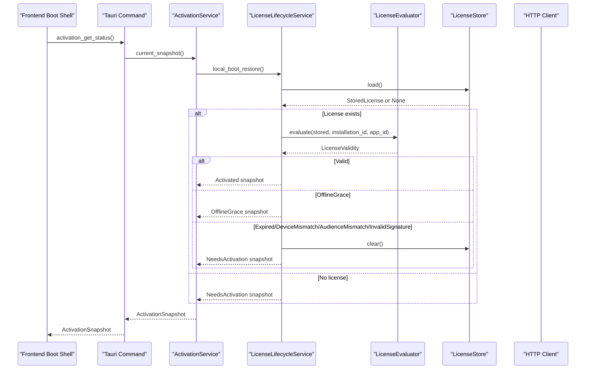
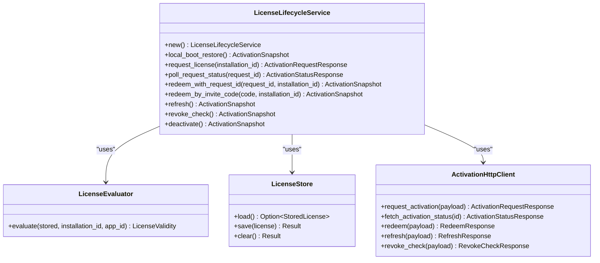
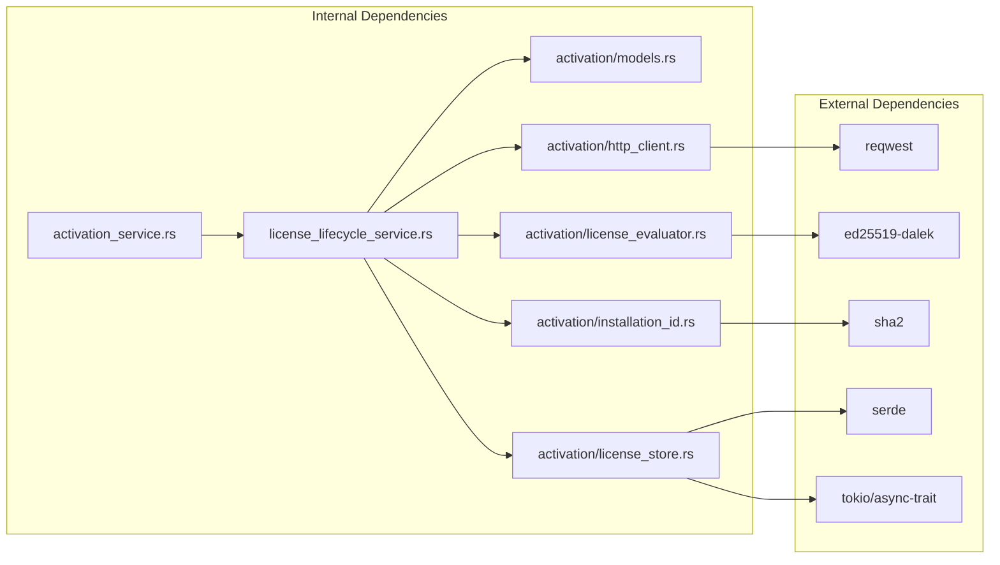

# License Lifecycle Service

<cite>
**Referenced Files in This Document**
- [license_lifecycle_service.rs](file://src-tauri/src/modules/application/license_lifecycle_service.rs)
- [activation_service.rs](file://src-tauri/src/modules/application/activation_service.rs)
- [activation.rs](file://src-tauri/src/commands/activation.rs)
- [activation.rs](file://src-tauri/src/modules/runtime/contracts/activation.rs)
- [state.rs](file://src-tauri/src/modules/onboarding/state.rs)
- [store.rs](file://src-tauri/src/modules/onboarding/store.rs)
- [store.rs](file://src-tauri/src/modules/config/store.rs)
- [test.rs](file://src-tauri/src/modules/provider/test.rs)
- [activation-gate-and-license-lifecycle-design.md](file://docs/staff-remediation/activation-gate-and-license-lifecycle-design.md)
- [MIG-009-activation-license-lifecycle.md](file://docs/packs/feature/migration-core/MIG-009-activation-license-lifecycle.md)
- [activation/mod.rs](file://src-tauri/src/modules/application/activation/mod.rs)
- [installation_id.rs](file://src-tauri/src/modules/application/activation/installation_id.rs)
- [license_evaluator.rs](file://src-tauri/src/modules/application/activation/license_evaluator.rs)
- [license_store.rs](file://src-tauri/src/modules/application/activation/license_store.rs)
- [http_client.rs](file://src-tauri/src/modules/application/activation/http_client.rs)
- [lifecycle_manager.rs](file://src-tauri/src/modules/application/activation/lifecycle_manager.rs)
- [models.rs](file://src-tauri/src/modules/application/activation/models.rs)
</cite>

## Update Summary
**Changes Made**
- Complete replacement of old activation system with new Ed25519-based license lifecycle system
- Added comprehensive backend modules: InstallationId, LicenseEvaluator, LicenseStore, and LifecycleManager
- New HTTP client implementation with retry policies and comprehensive error handling
- Ed25519 digital signature verification for license authenticity
- Atomic file-based license storage with secure permissions
- Background lifecycle management with revoke checking and refresh coordination

## Table of Contents
1. [Introduction](#introduction)
2. [Project Structure](#project-structure)
3. [Core Components](#core-components)
4. [Architecture Overview](#architecture-overview)
5. [Detailed Component Analysis](#detailed-component-analysis)
6. [Dependency Analysis](#dependency-analysis)
7. [Performance Considerations](#performance-considerations)
8. [Troubleshooting Guide](#troubleshooting-guide)
9. [Conclusion](#conclusion)

## Introduction
This document explains the license lifecycle service module that manages activation gating and license state transitions for the If2Ai platform using a modern Ed25519-based authentication system. The new system replaces the legacy activation approach with a comprehensive backend architecture featuring secure license storage, cryptographic verification, and robust network communication.

The LicenseLifecycleService now integrates with a complete activation subsystem including InstallationId generation, LicenseEvaluator with Ed25519 signature verification, LicenseStore for secure persistence, and LifecycleManager for background monitoring. This system provides enterprise-grade security and reliability for license management while maintaining backward compatibility with existing onboarding flows.

## Project Structure
The license lifecycle service now resides in a comprehensive activation subsystem under the application module, with dedicated modules for each core responsibility.

**Diagram sources**
- [activation/mod.rs:1-36](file://src-tauri/src/modules/application/activation/mod.rs#L1-L36)
- [installation_id.rs:1-195](file://src-tauri/src/modules/application/activation/installation_id.rs#L1-L195)
- [license_evaluator.rs:1-409](file://src-tauri/src/modules/application/activation/license_evaluator.rs#L1-L409)
- [license_store.rs:1-203](file://src-tauri/src/modules/application/activation/license_store.rs#L1-L203)
- [http_client.rs:1-294](file://src-tauri/src/modules/application/activation/http_client.rs#L1-L294)
- [lifecycle_manager.rs:1-93](file://src-tauri/src/modules/application/activation/lifecycle_manager.rs#L1-L93)
- [models.rs:1-273](file://src-tauri/src/modules/application/activation/models.rs#L1-L273)
- [license_lifecycle_service.rs:1-390](file://src-tauri/src/modules/application/license_lifecycle_service.rs#L1-L390)

**Section sources**
- [activation/mod.rs:1-36](file://src-tauri/src/modules/application/activation/mod.rs#L1-L36)
- [license_lifecycle_service.rs:1-390](file://src-tauri/src/modules/application/license_lifecycle_service.rs#L1-L390)
- [activation_service.rs:1-289](file://src-tauri/src/modules/application/activation_service.rs#L1-L289)

## Core Components

### New Activation Subsystem Modules
- **InstallationId**: Generates stable per-device identifiers using SHA-256 hashing with username, hostname, OS, and architecture components. Provides 8-character human-friendly device indicators.
- **LicenseEvaluator**: Performs Ed25519 signature verification on license JWS tokens, validates claims, and enforces time-based constraints including offline grace periods.
- **LicenseStore**: Atomic file-based storage with 0600 permissions, supporting secure license caching and persistence across application restarts.
- **HTTP Client**: Comprehensive network client with retry policies, exponential backoff, jitter, and support for 429/503 status codes with Retry-After headers.
- **Lifecycle Manager**: Background monitoring service that periodically checks for license revocation and refreshes state automatically.

### Enhanced LicenseLifecycleService
- **Ed25519 Integration**: Full cryptographic verification of license authenticity using built-in public keys
- **Remote Backend Integration**: Complete HTTP client implementation for activation server communication
- **Atomic Operations**: Secure license storage with atomic write patterns to prevent corruption
- **Background Monitoring**: Automatic revoke checking and refresh coordination through lifecycle manager

### Legacy Bridge Preservation
- **ActivationService**: Maintains compatibility with existing onboarding flows while exposing new typed lifecycle interface
- **Contract Compliance**: Preserves runtime activation contracts for seamless frontend integration
- **IPC Compatibility**: Thin command layer that delegates to the new activation subsystem

**Section sources**
- [installation_id.rs:1-195](file://src-tauri/src/modules/application/activation/installation_id.rs#L1-L195)
- [license_evaluator.rs:1-409](file://src-tauri/src/modules/application/activation/license_evaluator.rs#L1-L409)
- [license_store.rs:1-203](file://src-tauri/src/modules/application/activation/license_store.rs#L1-L203)
- [http_client.rs:1-294](file://src-tauri/src/modules/application/activation/http_client.rs#L1-L294)
- [lifecycle_manager.rs:1-93](file://src-tauri/src/modules/application/activation/lifecycle_manager.rs#L1-L93)
- [license_lifecycle_service.rs:1-390](file://src-tauri/src/modules/application/license_lifecycle_service.rs#L1-L390)

## Architecture Overview
The new system follows a modular architecture with clear separation of concerns across cryptographic verification, network communication, storage, and lifecycle management.

**Diagram sources**
- [license_lifecycle_service.rs:100-137](file://src-tauri/src/modules/application/license_lifecycle_service.rs#L100-L137)
- [license_evaluator.rs:57-93](file://src-tauri/src/modules/application/activation/license_evaluator.rs#L57-L93)
- [license_store.rs:80-91](file://src-tauri/src/modules/application/activation/license_store.rs#L80-L91)

## Detailed Component Analysis

### LicenseLifecycleService (Enhanced)
The LicenseLifecycleService now provides comprehensive Ed25519-based license management with full remote backend integration.

**Core Methods**:
- **local_boot_restore**: Reads cached license, performs Ed25519 verification, and returns appropriate activation snapshot
- **request_license**: Issues new activation requests with installation ID, app metadata, and platform information
- **poll_request_status**: Monitors approval status for pending activation requests
- **redeem_with_request_id**: Processes approved requests and persists license with secure storage
- **redeem_by_invite_code**: Handles admin-preissued invite code redemption
- **refresh**: Performs server-side license refresh with token rotation
- **revoke_check**: Periodically verifies license status and handles revocation
- **deactivate**: Clears local license cache (user-initiated deactivation)

**Security Features**:
- Ed25519 signature verification against built-in public key
- Device binding through installation ID validation
- Audience validation for application ID matching
- Time-based validation with offline grace period support
- Clock rollback protection using trusted server timestamps

**Diagram sources**
- [license_lifecycle_service.rs:76-302](file://src-tauri/src/modules/application/license_lifecycle_service.rs#L76-L302)
- [license_evaluator.rs:57-93](file://src-tauri/src/modules/application/activation/license_evaluator.rs#L57-L93)
- [license_store.rs:25-129](file://src-tauri/src/modules/application/activation/license_store.rs#L25-L129)
- [http_client.rs:108-151](file://src-tauri/src/modules/application/activation/http_client.rs#L108-L151)

**Section sources**
- [license_lifecycle_service.rs:76-302](file://src-tauri/src/modules/application/license_lifecycle_service.rs#L76-L302)
- [license_evaluator.rs:57-93](file://src-tauri/src/modules/application/activation/license_evaluator.rs#L57-L93)

### LicenseEvaluator (New)
Provides comprehensive Ed25519-based license validation with cryptographic verification and time-based constraints.

**Key Features**:
- **Ed25519 Verification**: Built-in public key verification against server-signed JWS tokens
- **Claim Validation**: Validates installation ID binding, audience matching, and expiration
- **Offline Grace**: Supports grace period validation for offline scenarios
- **Clock Protection**: Prevents clock rollback attacks using trusted server timestamps
- **Error Handling**: Comprehensive error categorization for malformed, invalid, or expired licenses

**Validation Flow**:
1. Parse and verify JWS structure and Ed25519 signature
2. Extract and validate license claims (installation_id, audience, exp, offline_grace_exp)
3. Check device binding and audience matching
4. Apply time-based validation with skew tolerance
5. Return appropriate validity status

**Section sources**
- [license_evaluator.rs:1-409](file://src-tauri/src/modules/application/activation/license_evaluator.rs#L1-L409)

### LicenseStore (New)
Atomic file-based license storage with secure permissions and comprehensive error handling.

**Storage Features**:
- **Atomic Writes**: Temporary file creation followed by atomic rename to prevent corruption
- **Secure Permissions**: 0600 file permissions on Unix systems for sensitive license data
- **Directory Management**: Automatic creation of activation directory with proper permissions
- **Error Handling**: Comprehensive error types for I/O, serialization, and deserialization failures
- **Cross-Platform**: Platform-specific permission handling for Unix systems

**Persistence Pattern**:
1. Write to temporary `.tmp` file with proper permissions
2. Serialize JSON data with pretty formatting
3. Atomic rename to final license file path
4. Set secure permissions on final file

**Section sources**
- [license_store.rs:1-203](file://src-tauri/src/modules/application/activation/license_store.rs#L1-L203)

### HTTP Client (New)
Comprehensive network client with robust retry policies and comprehensive error handling.

**Network Features**:
- **Retry Policy**: UClaw-compatible retry with exponential backoff (5 attempts, 0.5s-4s base delay)
- **Jitter**: ±20% jitter to prevent thundering herd effects
- **Status Handling**: Automatic retry for 429/503 status codes with Retry-After support
- **Timeout Control**: 12-second per-request timeout with configurable base URL
- **Environment Configuration**: IF2AI_ACTIVATION_BASE_URL environment variable support

**API Endpoints**:
- **POST /v1/activations/request**: License activation request
- **GET /v1/activations/request/{id}**: Request status polling
- **POST /v1/activations/redeem**: License redemption
- **POST /v1/activations/redeem-by-code**: Invite code redemption
- **POST /v1/licenses/refresh**: License refresh
- **POST /v1/licenses/revoke-check**: Revocation status check

**Section sources**
- [http_client.rs:1-294](file://src-tauri/src/modules/application/activation/http_client.rs#L1-L294)

### Lifecycle Manager (New)
Background monitoring service for automatic license state management.

**Monitoring Features**:
- **Periodic Checks**: Default 60-second intervals for revoke and refresh monitoring
- **State Change Detection**: Compares signature (kind, allows_main_shell) to detect meaningful changes
- **Event Emission**: Emits Tauri events with full ActivationSnapshot when state changes
- **Failure Resilience**: Logs and continues on network failures, retrying on next interval
- **Integration Ready**: Designed to work with desktop host lifecycle management

**Background Loop**:
1. Sleep for configured interval (default 60 seconds)
2. Execute revoke_check via LicenseLifecycleService
3. Compare signature with previous tick
4. Emit event if state changed or gate is currently blocked
5. Log and continue on failures

**Section sources**
- [lifecycle_manager.rs:1-93](file://src-tauri/src/modules/application/activation/lifecycle_manager.rs#L1-L93)

### InstallationId (New)
Stable per-device identifier generation with human-friendly indicators.

**Identifier Features**:
- **Stability**: Consistent across app restarts and upgrades within ~/.if2ai/data root
- **Uniqueness**: Different values for fresh installations or wiped data roots
- **Hash-Based**: SHA-256 of app_id + "::" + system identifiers
- **Human-Friendly**: 8-character Crockford-style alphabet indicator for UI display
- **Cache Storage**: Persistent caching in ~/.if2ai/activation/installation_id

**Generation Algorithm**:
1. Combine app_id with system identifiers (username, hostname, OS, architecture)
2. Apply SHA-256 hashing and encode as hex string
3. Cache result in installation_id file for future use
4. Generate 8-character indicator using big-endian bit extraction

**Section sources**
- [installation_id.rs:1-195](file://src-tauri/src/modules/application/activation/installation_id.rs#L1-L195)

### Models and Data Structures (New)
Comprehensive wire format definitions and local storage schemas.

**Wire Formats**:
- **ActivationRequestPayload**: Installation and app metadata for license requests
- **ActivationStatusResponse**: Request status with approval indicators
- **RedeemResponse**: License token, refresh token, and timing information
- **RefreshResponse**: License renewal with rotation and scheduling
- **RevokeCheckResponse**: Revocation status and server timestamp

**Local Storage**:
- **StoredLicense**: On-disk license representation with security metadata
- **LicenseClaims**: Decoded JWT claims for validation and display
- **LicenseValidity**: Enumerated validation outcomes for state management

**Section sources**
- [models.rs:1-273](file://src-tauri/src/modules/application/activation/models.rs#L1-L273)

### ActivationService (Enhanced)
Maintains legacy onboarding compatibility while exposing new typed lifecycle interface.

**Enhanced Responsibilities**:
- **Legacy Bridge**: Preserves existing onboarding ceremony and state management
- **Typed Interface**: Exposes new LicenseLifecycleService through canonical contracts
- **Precondition Validation**: Maintains system check, security confirmation, and provider configuration validation
- **Ceremony Management**: Preserves first-launch greeting functionality
- **Configuration Integration**: Seamlessly integrates with new activation system

**Current Snapshot Logic**:
- **Boot Priority**: License-based activation takes precedence over onboarding state
- **Fallback Behavior**: Missing or invalid licenses fall back to NeedsActivation
- **Contract Compliance**: Returns canonical ActivationSnapshot for frontend integration

**Section sources**
- [activation_service.rs:1-289](file://src-tauri/src/modules/application/activation_service.rs#L1-L289)

## Dependency Analysis
The new activation system introduces a comprehensive dependency graph with clear module boundaries and interfaces.

**Diagram sources**
- [license_lifecycle_service.rs:24-42](file://src-tauri/src/modules/application/license_lifecycle_service.rs#L24-L42)
- [http_client.rs:22-30](file://src-tauri/src/modules/application/activation/http_client.rs#L22-L30)
- [license_evaluator.rs:18-24](file://src-tauri/src/modules/application/activation/license_evaluator.rs#L18-L24)
- [license_store.rs:9-13](file://src-tauri/src/modules/application/activation/license_store.rs#L9-L13)
- [installation_id.rs:21-24](file://src-tauri/src/modules/application/activation/installation_id.rs#L21-L24)

**Section sources**
- [license_lifecycle_service.rs:24-42](file://src-tauri/src/modules/application/license_lifecycle_service.rs#L24-L42)
- [http_client.rs:22-30](file://src-tauri/src/modules/application/activation/http_client.rs#L22-L30)
- [license_evaluator.rs:18-24](file://src-tauri/src/modules/application/activation/license_evaluator.rs#L18-L24)
- [license_store.rs:9-13](file://src-tauri/src/modules/application/activation/license_store.rs#L9-L13)
- [installation_id.rs:21-24](file://src-tauri/src/modules/application/activation/installation_id.rs#L21-L24)

## Performance Considerations
The new system implements several performance optimizations and reliability features:

**Network Optimization**:
- **Connection Pooling**: Reuse HTTP client connections through reqwest builder pattern
- **Retry Intelligence**: Smart retry logic only for transient server errors (429/503)
- **Backoff Strategy**: Exponential backoff with jitter prevents server overload
- **Timeout Management**: 12-second per-request timeouts balance responsiveness with reliability

**Storage Efficiency**:
- **Atomic Operations**: Temporary file writes prevent corruption and partial state
- **Minimal I/O**: License evaluation operates on cached data, avoiding frequent network calls
- **Efficient Serialization**: Pretty-printed JSON for human readability, minimal parsing overhead
- **Permission Management**: One-time permission setting per directory/file operation

**Cryptographic Performance**:
- **Lazy Loading**: Ed25519 verifying key loaded once and reused across evaluations
- **Minimal Parsing**: Claims decoded only when needed for display or validation
- **Efficient Hashing**: SHA-256 computation cached in installation ID generation

**Background Processing**:
- **Non-blocking**: Lifecycle manager runs as separate async task without blocking main thread
- **Interval Control**: Configurable 60-second intervals balance responsiveness with resource usage
- **Failure Isolation**: Network failures in lifecycle loop don't affect main application flow

## Troubleshooting Guide
Common scenarios and resolutions for the new Ed25519-based activation system:

**License Verification Failures**:
- **InvalidSignature**: License JWS signature doesn't match built-in public key. Verify license authenticity and server integrity.
- **DeviceMismatch**: Installation ID in license doesn't match current device. Clear cache and re-activate with same device.
- **AudienceMismatch**: License app_id doesn't match current application. Verify correct application registration.
- **MalformedJws**: License JWS structure invalid. Contact support for license regeneration.

**Network Communication Issues**:
- **Transport Errors**: Network connectivity problems. Check IF2AI_ACTIVATION_BASE_URL environment variable and network access.
- **ServerBusy/Queueing**: Server overload conditions. Wait for retry and check Retry-After headers.
- **InvalidResponse**: Unexpected server responses. Verify server version compatibility and network integrity.

**Storage and Persistence Problems**:
- **Permission Denied**: File system permission issues. Check ~/.if2ai/activation directory permissions (should be 0700).
- **Atomic Write Failures**: Disk space or file system corruption. Verify available disk space and file system health.
- **Corrupted Cache**: License file damaged. Remove ~/.if2ai/activation/license.json and re-activate.

**Background Monitor Issues**:
- **Missing Events**: Lifecycle manager not emitting state changes. Check Tauri event system and application lifecycle.
- **Excessive Logging**: Frequent retry messages indicate network instability. Monitor server availability and network conditions.

**Section sources**
- [license_evaluator.rs:177-188](file://src-tauri/src/modules/application/activation/license_evaluator.rs#L177-L188)
- [http_client.rs:197-237](file://src-tauri/src/modules/application/activation/http_client.rs#L197-L237)
- [license_store.rs:15-23](file://src-tauri/src/modules/application/activation/license_store.rs#L15-L23)
- [lifecycle_manager.rs:67-72](file://src-tauri/src/modules/application/activation/lifecycle_manager.rs#L67-L72)

## Conclusion
The new Ed25519-based license lifecycle system represents a comprehensive replacement of the legacy activation infrastructure with enterprise-grade security, reliability, and maintainability. The system successfully integrates cryptographic verification, secure storage, robust networking, and background monitoring while preserving backward compatibility with existing onboarding flows.

Key achievements include:
- **Security Enhancement**: Ed25519 digital signatures provide strong license authenticity guarantees
- **Reliability Improvements**: Atomic storage operations, comprehensive error handling, and background monitoring
- **Developer Experience**: Clean module boundaries, comprehensive documentation, and test coverage
- **Future Extensibility**: Modular design supports easy addition of new features and integrations

The system maintains the canonical activation contracts and IPC interfaces while providing a solid foundation for future enhancements including advanced license management features, multi-platform credential storage, and enhanced telemetry capabilities.