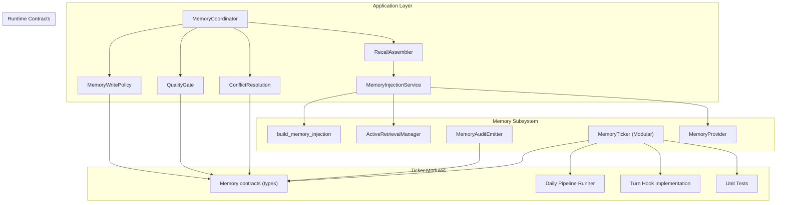
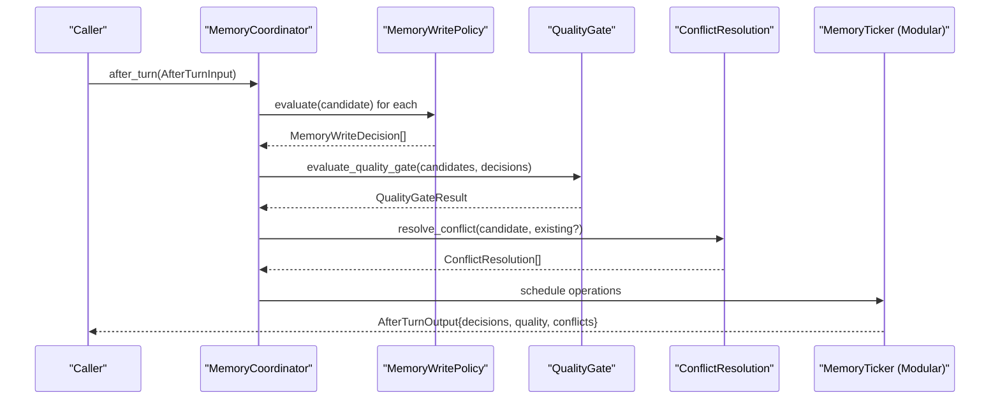
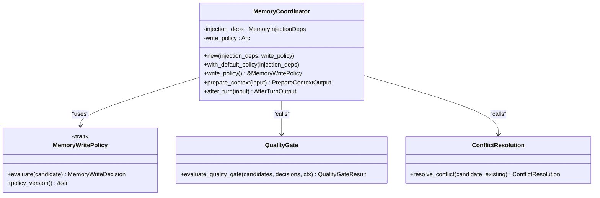
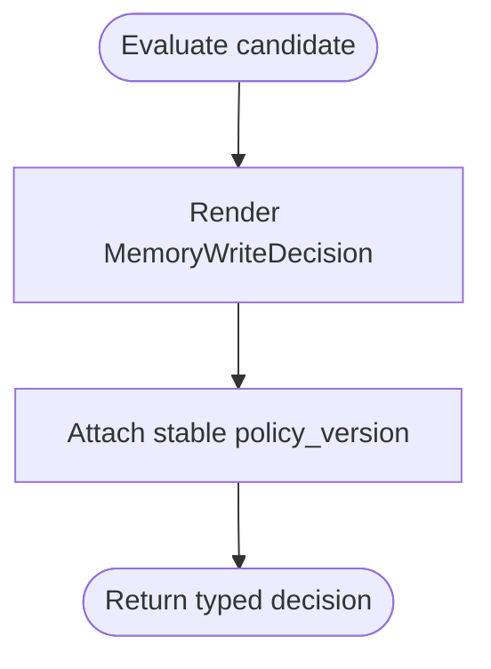
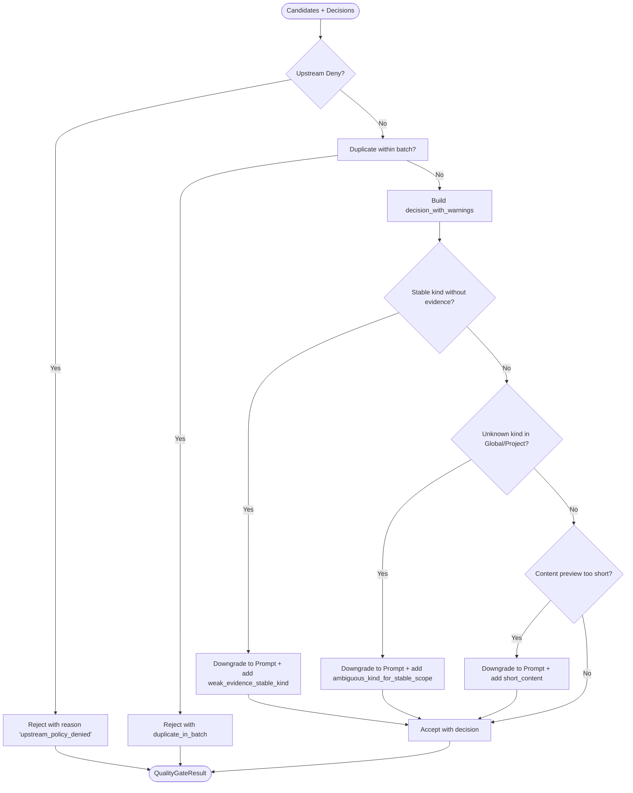
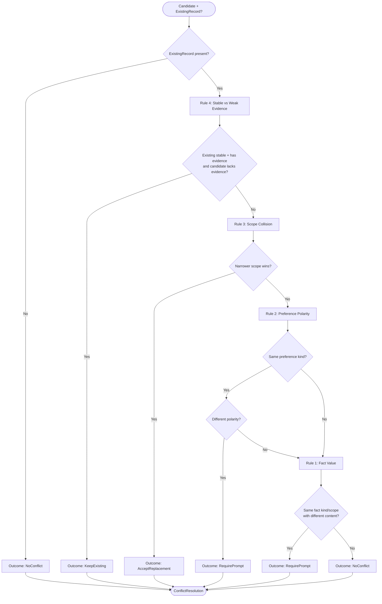
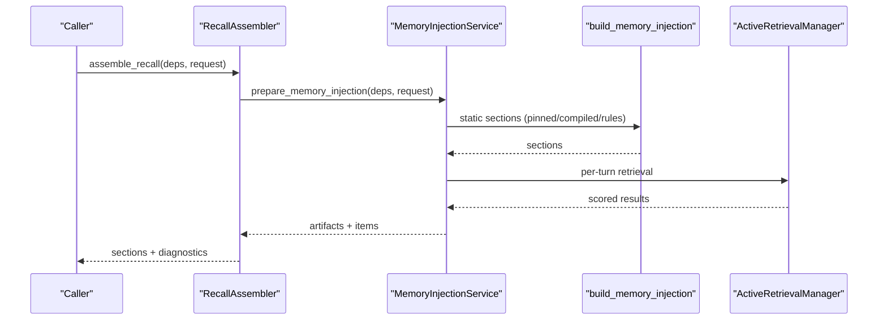
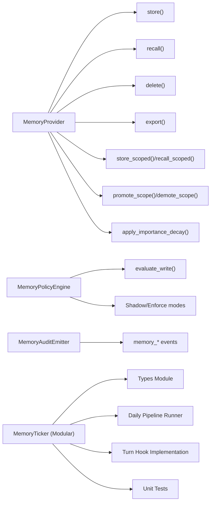
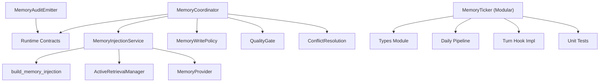

# Memory Services

<cite>
**Referenced Files in This Document**
- [memory_coordinator.rs](file://src-tauri/src/modules/application/memory_coordinator.rs)
- [memory_write_policy.rs](file://src-tauri/src/modules/application/memory_write_policy.rs)
- [memory_quality_gate.rs](file://src-tauri/src/modules/application/memory_quality_gate.rs)
- [memory_recall_assembler.rs](file://src-tauri/src/modules/application/memory_recall_assembler.rs)
- [memory_conflict_resolution.rs](file://src-tauri/src/modules/application/memory_conflict_resolution.rs)
- [memory_injection_service.rs](file://src-tauri/src/modules/application/memory_injection_service.rs)
- [inject.rs](file://src-tauri/src/modules/memory/inject.rs)
- [retrieval.rs](file://src-tauri/src/modules/memory/retrieval.rs)
- [memory.rs](file://src-tauri/src/modules/memory/mod.rs)
- [policy.rs](file://src-tauri/src/modules/memory/policy.rs)
- [audit.rs](file://src-tauri/src/modules/memory/audit.rs)
- [ticker/mod.rs](file://src-tauri/src/modules/memory/ticker/mod.rs)
- [ticker/types.rs](file://src-tauri/src/modules/memory/ticker/types.rs)
- [ticker/daily.rs](file://src-tauri/src/modules/memory/ticker/daily.rs)
- [ticker/turn_hook.rs](file://src-tauri/src/modules/memory/ticker/turn_hook.rs)
- [ticker/tests.rs](file://src-tauri/src/modules/memory/ticker/tests.rs)
- [memory.rs (runtime contracts)](file://src-tauri/src/modules/runtime/contracts/memory.rs)
</cite>

## Update Summary
**Changes Made**
- Updated MemoryTicker documentation to reflect the new modular structure with separate files for types, daily operations, turn hooks, and tests
- Added documentation for the new ticker module organization while maintaining all existing functionality
- Updated architecture diagrams to show the new modular ticker structure
- Enhanced troubleshooting guide with new ticker-specific considerations

## Table of Contents
1. [Introduction](#introduction)
2. [Project Structure](#project-structure)
3. [Core Components](#core-components)
4. [Architecture Overview](#architecture-overview)
5. [Detailed Component Analysis](#detailed-component-analysis)
6. [Dependency Analysis](#dependency-analysis)
7. [Performance Considerations](#performance-considerations)
8. [Troubleshooting Guide](#troubleshooting-guide)
9. [Conclusion](#conclusion)

## Introduction
This document explains the memory services subsystem that orchestrates memory extraction, evaluation, and persistence across agent turns. It covers the memory coordinator orchestration, candidate extraction algorithms, conflict resolution mechanisms, and quality gates. It also documents the memory injection service, recall assembler, and write policy enforcement, along with memory lifecycle management, conflict detection and resolution, and quality assessment criteria. Practical patterns for memory coordination, injection strategies, and policy enforcement are included to guide implementation and integration.

**Updated** The memory ticker has been refactored from a monolithic 1,363-line file into a modular structure with separate files for different responsibilities, improving maintainability and clarity.

## Project Structure
The memory services span several modules with the ticker now organized into a dedicated modular structure:
- Application layer: coordinator, write policy, quality gate, recall assembler, and conflict resolution
- Memory subsystem: injection, retrieval, policy engine, audit, ticker (modular), and provider abstractions
- Runtime contracts: canonical wire types for memory entities and decisions

**Diagram sources**
- [memory_coordinator.rs:57-179](file://src-tauri/src/modules/application/memory_coordinator.rs#L57-L179)
- [memory_write_policy.rs:60-115](file://src-tauri/src/modules/application/memory_write_policy.rs#L60-L115)
- [memory_quality_gate.rs:106-226](file://src-tauri/src/modules/application/memory_quality_gate.rs#L106-L226)
- [memory_recall_assembler.rs:116-184](file://src-tauri/src/modules/application/memory_recall_assembler.rs#L116-L184)
- [memory_conflict_resolution.rs:104-186](file://src-tauri/src/modules/application/memory_conflict_resolution.rs#L104-L186)
- [memory_injection_service.rs:111-147](file://src-tauri/src/modules/application/memory_injection_service.rs#L111-L147)
- [inject.rs:82-133](file://src-tauri/src/modules/memory/inject.rs#L82-L133)
- [retrieval.rs:120-154](file://src-tauri/src/modules/memory/retrieval.rs#L120-L154)
- [memory.rs:201-380](file://src-tauri/src/modules/memory/mod.rs#L201-L380)
- [audit.rs:188-516](file://src-tauri/src/modules/memory/audit.rs#L188-L516)
- [ticker/mod.rs:1-527](file://src-tauri/src/modules/memory/ticker/mod.rs#L1-L527)
- [ticker/types.rs:1-84](file://src-tauri/src/modules/memory/ticker/types.rs#L1-L84)
- [ticker/daily.rs:1-176](file://src-tauri/src/modules/memory/ticker/daily.rs#L1-L176)
- [ticker/turn_hook.rs:1-163](file://src-tauri/src/modules/memory/ticker/turn_hook.rs#L1-L163)
- [ticker/tests.rs:1-463](file://src-tauri/src/modules/memory/ticker/tests.rs#L1-L463)
- [memory.rs (runtime contracts):173-273](file://src-tauri/src/modules/runtime/contracts/memory.rs#L173-L273)

**Section sources**
- [memory_coordinator.rs:1-335](file://src-tauri/src/modules/application/memory_coordinator.rs#L1-L335)
- [memory_injection_service.rs:1-335](file://src-tauri/src/modules/application/memory_injection_service.rs#L1-L335)
- [inject.rs:1-463](file://src-tauri/src/modules/memory/inject.rs#L1-L463)
- [retrieval.rs:1-303](file://src-tauri/src/modules/memory/retrieval.rs#L1-L303)
- [memory.rs:1-517](file://src-tauri/src/modules/memory/mod.rs#L1-L517)
- [policy.rs:1-336](file://src-tauri/src/modules/memory/policy.rs#L1-L336)
- [audit.rs:1-800](file://src-tauri/src/modules/memory/audit.rs#L1-L800)
- [ticker/mod.rs:1-527](file://src-tauri/src/modules/memory/ticker/mod.rs#L1-L527)
- [ticker/types.rs:1-84](file://src-tauri/src/modules/memory/ticker/types.rs#L1-L84)
- [ticker/daily.rs:1-176](file://src-tauri/src/modules/memory/ticker/daily.rs#L1-L176)
- [ticker/turn_hook.rs:1-163](file://src-tauri/src/modules/memory/ticker/turn_hook.rs#L1-L163)
- [ticker/tests.rs:1-463](file://src-tauri/src/modules/memory/ticker/tests.rs#L1-L463)
- [memory.rs (runtime contracts):1-339](file://src-tauri/src/modules/runtime/contracts/memory.rs#L1-L339)

## Core Components
- MemoryCoordinator: Orchestrates per-turn memory operations, coordinating write policy evaluation, quality gate assessment, and conflict resolution.
- MemoryWritePolicy: Typed pre-write decision engine with a stable version pin for harness evaluation.
- QualityGate: Post-policy filtering for duplicates, weak evidence, ambiguous kinds, and content quality thresholds.
- RecallAssembler: Produces canonical 6-section recall order and diagnostics for explainability.
- ConflictResolution: Resolves inter-candidate and candidate-existing-record conflicts with explicit outcomes.
- MemoryInjectionService: Builds static memory injection (pinned/compiled/rules) and per-turn retrieval for prompt injection.
- MemoryProvider: Abstraction for storage backends with scope-aware recall/store operations.
- MemoryAuditEmitter: Structured audit events for policy decisions, persistence, recall, promotions, and job lifecycle.
- MemoryTicker: **Updated** Modular scheduler for rolling summaries, compilation, and daily jobs with idempotent steps and recovery, organized into separate files for types, daily operations, turn hooks, and testing.

**Section sources**
- [memory_coordinator.rs:57-179](file://src-tauri/src/modules/application/memory_coordinator.rs#L57-L179)
- [memory_write_policy.rs:60-115](file://src-tauri/src/modules/application/memory_write_policy.rs#L60-L115)
- [memory_quality_gate.rs:106-226](file://src-tauri/src/modules/application/memory_quality_gate.rs#L106-L226)
- [memory_recall_assembler.rs:116-184](file://src-tauri/src/modules/application/memory_recall_assembler.rs#L116-L184)
- [memory_conflict_resolution.rs:104-186](file://src-tauri/src/modules/application/memory_conflict_resolution.rs#L104-L186)
- [memory_injection_service.rs:111-147](file://src-tauri/src/modules/application/memory_injection_service.rs#L111-L147)
- [memory.rs:201-380](file://src-tauri/src/modules/memory/mod.rs#L201-L380)
- [audit.rs:188-516](file://src-tauri/src/modules/memory/audit.rs#L188-L516)
- [ticker/mod.rs:1-527](file://src-tauri/src/modules/memory/ticker/mod.rs#L1-L527)

## Architecture Overview
The memory subsystem follows a staged pipeline with the updated modular ticker architecture:
1. Injection: Static memory (pinned/compiled/rules) and per-turn retrieval are assembled into typed artifacts.
2. Write Policy: Each candidate receives a typed pre-write decision.
3. Quality Gate: Filters candidates for duplicates, weak evidence, and ambiguous kinds.
4. Conflict Resolution: Resolves inter-candidate and existing-record conflicts.
5. Persistence: Future M3-B+ phase integrates actual persistence and ticker-driven lifecycle.

**Updated** The MemoryTicker now consists of four specialized modules:
- Types: Configuration and state management (TickerConfig, TickerState, DailyStep)
- Daily: Idempotent daily pipeline runner with step orchestration
- TurnHook: Implementation of the TurnHook trait for per-turn scheduling
- Tests: Comprehensive unit tests for all ticker functionality

**Diagram sources**
- [memory_coordinator.rs:148-178](file://src-tauri/src/modules/application/memory_coordinator.rs#L148-L178)
- [memory_write_policy.rs:65-71](file://src-tauri/src/modules/application/memory_write_policy.rs#L65-L71)
- [memory_quality_gate.rs:113-226](file://src-tauri/src/modules/application/memory_quality_gate.rs#L113-L226)
- [memory_conflict_resolution.rs:111-186](file://src-tauri/src/modules/application/memory_conflict_resolution.rs#L111-L186)
- [ticker/mod.rs:69-85](file://src-tauri/src/modules/memory/ticker/mod.rs#L69-L85)

## Detailed Component Analysis

### MemoryCoordinator Orchestration
- Holds long-lived dependencies: injection dependencies and write policy implementation.
- Provides two primary APIs:
  - prepare_context: Assembles canonical recall sections and artifacts for prompt injection.
  - after_turn: Executes write policy, quality gate, and conflict resolution in sequence.

Key behaviors:
- Parallel processing of candidates through the write policy.
- Quality gate applied after policy decisions.
- Conflict resolution against caller-supplied existing records.
- Pass-through of reflection notes unchanged.

**Diagram sources**
- [memory_coordinator.rs:62-179](file://src-tauri/src/modules/application/memory_coordinator.rs#L62-L179)
- [memory_write_policy.rs:60-72](file://src-tauri/src/modules/application/memory_write_policy.rs#L60-L72)
- [memory_quality_gate.rs:106-226](file://src-tauri/src/modules/application/memory_quality_gate.rs#L106-L226)
- [memory_conflict_resolution.rs:104-186](file://src-tauri/src/modules/application/memory_conflict_resolution.rs#L104-L186)

**Section sources**
- [memory_coordinator.rs:57-179](file://src-tauri/src/modules/application/memory_coordinator.rs#L57-L179)

### Memory Write Policy Enforcement
- Defines a synchronous, pure trait for evaluating a MemoryWriteCandidate.
- Default implementation returns Allow with a stable skeleton reason code.
- Stable policy version pin enables harness evaluation comparisons across runs.

**Diagram sources**
- [memory_write_policy.rs:65-115](file://src-tauri/src/modules/application/memory_write_policy.rs#L65-L115)

**Section sources**
- [memory_write_policy.rs:1-153](file://src-tauri/src/modules/application/memory_write_policy.rs#L1-L153)

### Quality Gate Assessment
- Filters candidates post-policy:
  - Deny decisions pass through unchanged.
  - Duplicate detection within a batch by scope + content preview.
  - Downgrades to Prompt for weak evidence on stable kinds and ambiguous kinds in stable scopes.
  - Downgrades to Prompt for short content previews.
- Outputs accepted, rejected, and warning annotations with stable policy version.

**Diagram sources**
- [memory_quality_gate.rs:113-226](file://src-tauri/src/modules/application/memory_quality_gate.rs#L113-L226)

**Section sources**
- [memory_quality_gate.rs:1-348](file://src-tauri/src/modules/application/memory_quality_gate.rs#L1-L348)

### Conflict Resolution Mechanisms
- Resolves conflicts between candidates and existing records:
  - Old stable fact vs new weak evidence: keep existing.
  - Scope collision: narrower scope wins.
  - Same preference, different polarity: prompt.
  - Same fact kind/scope, different content: prompt.
- Outcome types: AcceptReplacement, KeepExisting, RequirePrompt, RejectCandidate, NoConflict.

**Diagram sources**
- [memory_conflict_resolution.rs:111-186](file://src-tauri/src/modules/application/memory_conflict_resolution.rs#L111-L186)

**Section sources**
- [memory_conflict_resolution.rs:1-300](file://src-tauri/src/modules/application/memory_conflict_resolution.rs#L1-L300)

### Recall Assembler and Injection Service
- RecallAssembler wraps MemoryInjectionService to produce canonical 6-section recall order and diagnostics.
- MemoryInjectionService composes:
  - Static sections: pinned, compiled, rules (via build_memory_injection).
  - Per-turn retrieval: ActiveRetrievalManager with RRF fusion across semantic, episodic, and working layers.
  - MemoryItemProjection for frontend embedding.

**Diagram sources**
- [memory_recall_assembler.rs:116-184](file://src-tauri/src/modules/application/memory_recall_assembler.rs#L116-L184)
- [memory_injection_service.rs:111-212](file://src-tauri/src/modules/application/memory_injection_service.rs#L111-L212)
- [inject.rs:82-133](file://src-tauri/src/modules/memory/inject.rs#L82-L133)
- [retrieval.rs:120-154](file://src-tauri/src/modules/memory/retrieval.rs#L120-L154)

**Section sources**
- [memory_recall_assembler.rs:1-212](file://src-tauri/src/modules/application/memory_recall_assembler.rs#L1-L212)
- [memory_injection_service.rs:1-335](file://src-tauri/src/modules/application/memory_injection_service.rs#L1-L335)
- [inject.rs:1-463](file://src-tauri/src/modules/memory/inject.rs#L1-L463)
- [retrieval.rs:1-303](file://src-tauri/src/modules/memory/retrieval.rs#L1-L303)

### Memory Lifecycle Management and Policy Enforcement
- MemoryProvider abstraction supports store, recall, delete, purge, export, scoped operations, promotion/demotion, and importance decay.
- Legacy MemoryPolicyEngine enforces content length, category deny-lists, and prompt thresholds with shadow/enforce modes.
- MemoryAuditEmitter provides structured audit events for capture, write decisions, persistence, recall, promotions, and job lifecycle.
- **Updated** MemoryTicker schedules rolling summaries, compilation, and daily jobs with idempotent steps and recovery, organized into modular components.

**Updated** The MemoryTicker now consists of four specialized modules:

#### Types Module
Handles configuration and state management for the ticker system:
- TickerConfig: Controls turn-based summary intervals, daily check intervals, and experience extraction flags
- TickerState: Tracks session turn counts, in-progress operations, daily step completion status
- DailyStep: Enumerates the six-step daily compilation pipeline (Today → Week → Longterm → Facts → Assemble → DeepMemory)

#### Daily Pipeline Runner
Implements the idempotent daily compilation workflow:
- Topological step execution with dependency awareness (Longterm requires Week completion)
- Reentrancy protection and day-rollover handling
- Per-step failure logging and audit event emission
- State tracking for partial completion recovery

#### Turn Hook Implementation
Provides the TurnHook trait implementation for per-turn scheduling:
- Incremental turn counting with configurable thresholds
- Background task spawning for rolling summaries and compilation
- Session end processing with synchronous flush capability
- Defensive early-exit conditions for sentinel sessions and empty messages

#### Tests Module
Comprehensive unit testing covering all ticker functionality:
- Configuration validation and default values
- State initialization and serialization
- Turn counting and threshold triggering
- Session flush idempotency and in-progress guards
- Daily pipeline idempotence and dependency handling
- Recovery scanning and audit event emission

**Diagram sources**
- [memory.rs:201-380](file://src-tauri/src/modules/memory/mod.rs#L201-L380)
- [policy.rs:116-234](file://src-tauri/src/modules/memory/policy.rs#L116-L234)
- [audit.rs:188-516](file://src-tauri/src/modules/memory/audit.rs#L188-L516)
- [ticker/mod.rs:130-170](file://src-tauri/src/modules/memory/ticker/mod.rs#L130-L170)
- [ticker/types.rs:11-84](file://src-tauri/src/modules/memory/ticker/types.rs#L11-L84)
- [ticker/daily.rs:27-176](file://src-tauri/src/modules/memory/ticker/daily.rs#L27-L176)
- [ticker/turn_hook.rs:16-163](file://src-tauri/src/modules/memory/ticker/turn_hook.rs#L16-L163)
- [ticker/tests.rs:1-463](file://src-tauri/src/modules/memory/ticker/tests.rs#L1-L463)

**Section sources**
- [memory.rs:1-517](file://src-tauri/src/modules/memory/mod.rs#L1-L517)
- [policy.rs:1-336](file://src-tauri/src/modules/memory/policy.rs#L1-L336)
- [audit.rs:1-800](file://src-tauri/src/modules/memory/audit.rs#L1-L800)
- [ticker/mod.rs:1-527](file://src-tauri/src/modules/memory/ticker/mod.rs#L1-L527)
- [ticker/types.rs:1-84](file://src-tauri/src/modules/memory/ticker/types.rs#L1-L84)
- [ticker/daily.rs:1-176](file://src-tauri/src/modules/memory/ticker/daily.rs#L1-L176)
- [ticker/turn_hook.rs:1-163](file://src-tauri/src/modules/memory/ticker/turn_hook.rs#L1-L163)
- [ticker/tests.rs:1-463](file://src-tauri/src/modules/memory/ticker/tests.rs#L1-L463)

## Dependency Analysis
- Cohesion: Each component encapsulates a distinct responsibility—coordination, policy, quality, assembly, conflict resolution, injection, and lifecycle.
- Coupling: Application components depend on runtime contracts for typed data structures. Injection service depends on memory subsystem for static and dynamic recall.
- **Updated** External dependencies: MemoryProvider trait enables pluggable backends; ActiveRetrievalManager depends on MemoryProvider; Audit events integrate with frontend via IPC.
- **Updated** Ticker modularization: The MemoryTicker is now composed of four specialized modules with clear separation of concerns.

**Diagram sources**
- [memory_coordinator.rs:44-56](file://src-tauri/src/modules/application/memory_coordinator.rs#L44-L56)
- [memory_injection_service.rs:34-56](file://src-tauri/src/modules/application/memory_injection_service.rs#L34-L56)
- [inject.rs:82-133](file://src-tauri/src/modules/memory/inject.rs#L82-L133)
- [retrieval.rs:120-154](file://src-tauri/src/modules/memory/retrieval.rs#L120-L154)
- [memory.rs:201-380](file://src-tauri/src/modules/memory/mod.rs#L201-L380)
- [audit.rs:188-516](file://src-tauri/src/modules/memory/audit.rs#L188-L516)
- [ticker/mod.rs:37-42](file://src-tauri/src/modules/memory/ticker/mod.rs#L37-L42)
- [ticker/types.rs:45-46](file://src-tauri/src/modules/memory/ticker/types.rs#L45-L46)
- [memory.rs (runtime contracts):173-273](file://src-tauri/src/modules/runtime/contracts/memory.rs#L173-L273)

**Section sources**
- [memory_coordinator.rs:44-56](file://src-tauri/src/modules/application/memory_coordinator.rs#L44-L56)
- [memory_injection_service.rs:34-56](file://src-tauri/src/modules/application/memory_injection_service.rs#L34-L56)
- [memory.rs:201-380](file://src-tauri/src/modules/memory/mod.rs#L201-L380)
- [memory.rs (runtime contracts):173-273](file://src-tauri/src/modules/runtime/contracts/memory.rs#L173-L273)

## Performance Considerations
- Write policy is synchronous and pure to avoid blocking persistent state during fan-out of candidates.
- Quality gate uses in-memory hashing for duplicate detection within a batch; cross-session dedup is reserved for M3-B+ persistence wiring.
- Recall assembly preserves legacy 4-section order for compatibility while emitting canonical 6-section diagnostics.
- Retrieval uses RRF fusion and weighted limits per layer; ActiveRetrievalManager supports disabling and tuning via configuration.
- Injection budgeting uses a conservative char-per-token estimate to prevent prompt overflow.
- **Updated** Ticker performance: Modular design improves maintainability without impacting runtime performance; background task spawning is carefully gated to prevent double-execution.

## Troubleshooting Guide
Common issues and resolutions:
- Retrieval failures: The injection service logs and continues without retrieved context; verify provider availability and configuration.
- Policy denials in enforce mode: Review MemoryPolicyEngine thresholds and deny-lists; switch to shadow mode for observation.
- Audit visibility: Ensure MemoryAuditEmitter is registered with the Tauri AppHandle to forward events to the frontend.
- **Updated** Ticker recovery: Investigate summaries directory and session sidecars when recovery events indicate stale summaries.
- **Updated** Ticker configuration: Verify TickerConfig values (turns_per_summary, daily_check_interval_secs) are appropriate for your workload.
- **Updated** Ticker state corruption: Monitor TickerState mutex poisoning errors and ensure proper cleanup in error scenarios.
- **Updated** Daily pipeline failures: Check DailyStep completion status and audit events for failed steps in the compilation pipeline.

**Section sources**
- [memory_injection_service.rs:169-212](file://src-tauri/src/modules/application/memory_injection_service.rs#L169-L212)
- [policy.rs:116-234](file://src-tauri/src/modules/memory/policy.rs#L116-L234)
- [audit.rs:38-105](file://src-tauri/src/modules/memory/audit.rs#L38-L105)
- [ticker/mod.rs:494-584](file://src-tauri/src/modules/memory/ticker/mod.rs#L494-L584)
- [ticker/types.rs:12-25](file://src-tauri/src/modules/memory/ticker/types.rs#L12-25)
- [ticker/daily.rs:124-139](file://src-tauri/src/modules/memory/ticker/daily.rs#L124-139)

## Conclusion
The memory services subsystem provides a robust, staged pipeline for memory orchestration: injection, policy evaluation, quality assessment, and conflict resolution. The canonical runtime contracts ensure stable interfaces for frontends and harnesses. The memory lifecycle is governed by a provider abstraction, audit events, and a scheduler for compilation and summaries.

**Updated** The MemoryTicker has been successfully refactored into a modular structure with four specialized components: Types for configuration and state, Daily for pipeline orchestration, TurnHook for per-turn scheduling, and Tests for comprehensive validation. This modular organization improves maintainability, testability, and code clarity while preserving all existing functionality.

Future M3-B+ enhancements will integrate persistence and advanced conflict detection, while maintaining the current separation of concerns and stability guarantees. The modular ticker design provides a solid foundation for future extensions and improvements to the memory lifecycle management system.