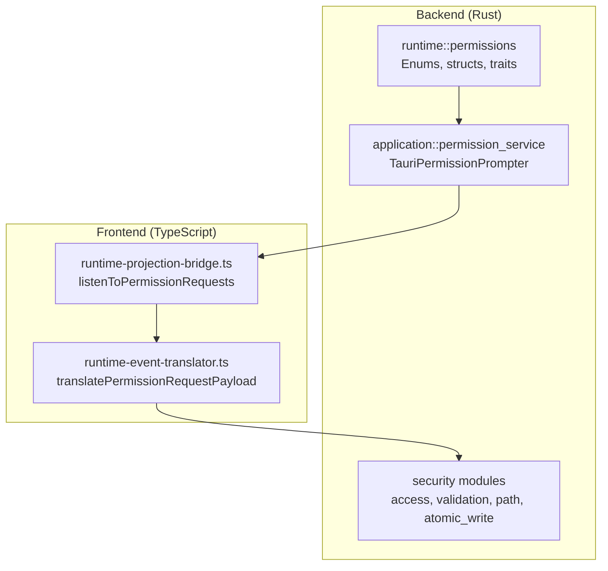
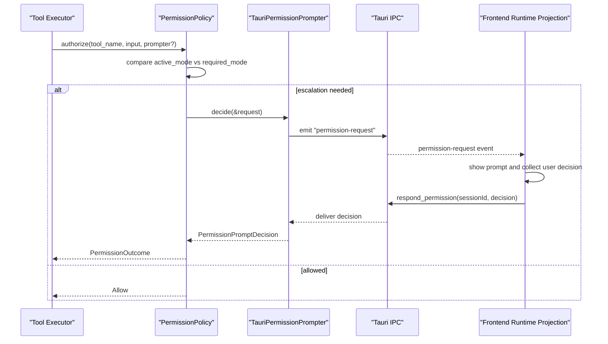
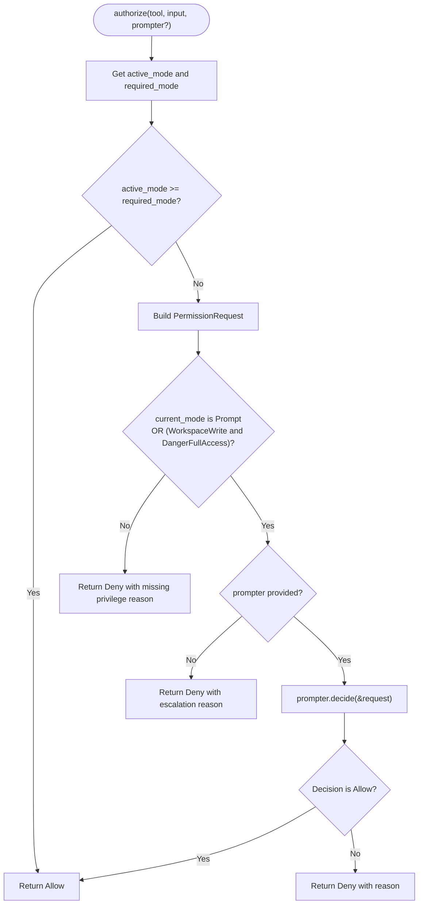
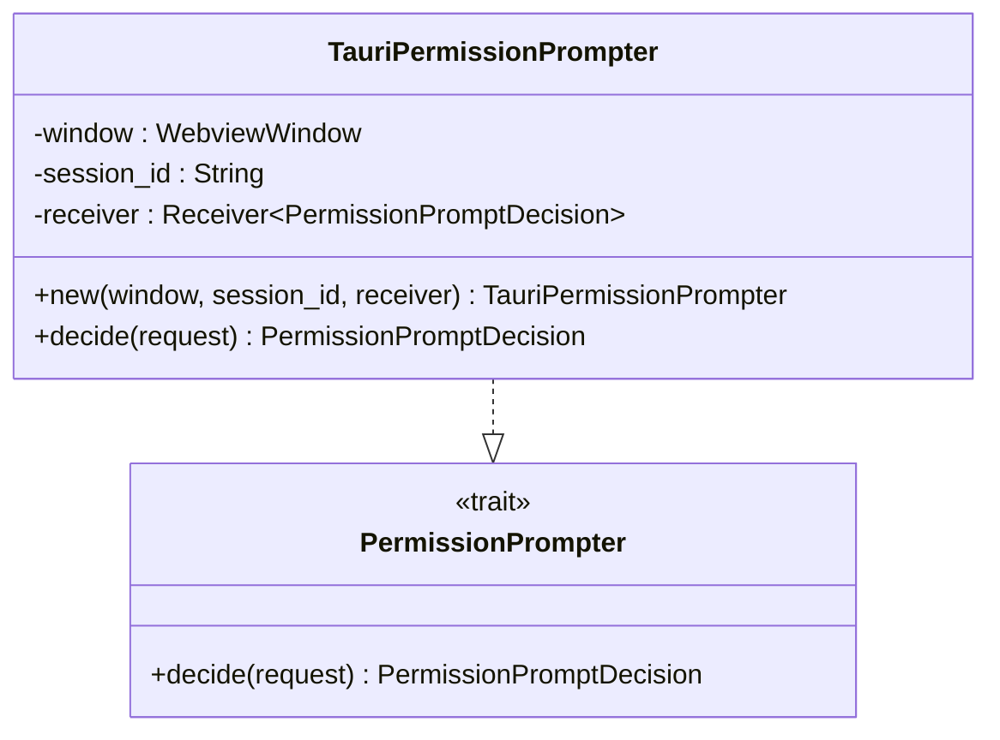
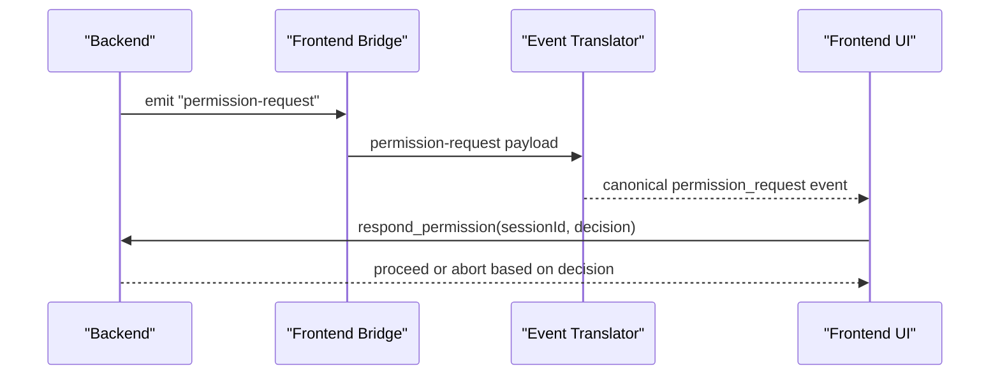
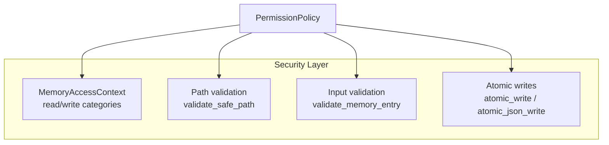
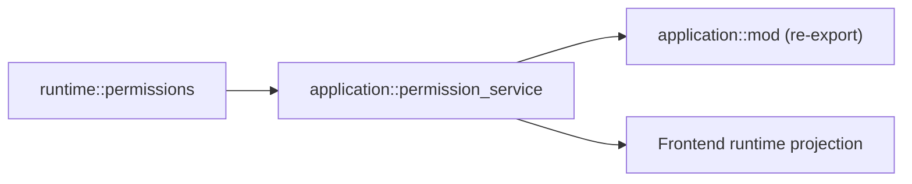

# Permission Service

<cite>
**Referenced Files in This Document**
- [permission_service.rs](file://src-tauri/src/modules/application/permission_service.rs)
- [permissions.rs](file://rust/crates/runtime/src/permissions.rs)
- [permissions.rs](file://src-tauri/src/modules/runtime/permissions.rs)
- [mod.rs](file://src-tauri/src/modules/application/mod.rs)
- [runtime-event-translator.ts](file://src/runtime-projection/runtime-event-translator.ts)
- [runtime-projection-bridge.ts](file://src/runtime-projection/runtime-projection-bridge.ts)
- [access.rs](file://src-tauri/src/modules/security/access.rs)
- [validation.rs](file://src-tauri/src/modules/security/validation.rs)
- [path.rs](file://src-tauri/src/modules/security/path.rs)
- [atomic_write.rs](file://src-tauri/src/modules/security/atomic_write.rs)
- [GFR-003-extract-permission-service.md](file://docs/packs/refactor/GFR-003-extract-permission-service.md)
- [GFR-005d-extract-permission-helpers.md](file://docs/packs/refactor/GFR-005d-extract-permission-helpers.md)
</cite>

## Table of Contents
1. [Introduction](#introduction)
2. [Project Structure](#project-structure)
3. [Core Components](#core-components)
4. [Architecture Overview](#architecture-overview)
5. [Detailed Component Analysis](#detailed-component-analysis)
6. [Dependency Analysis](#dependency-analysis)
7. [Performance Considerations](#performance-considerations)
8. [Troubleshooting Guide](#troubleshooting-guide)
9. [Conclusion](#conclusion)

## Introduction
This document describes the permission service module that enforces security boundaries for tool execution in the If2Ai application. It explains how permission checking works, how Tauri permission prompts integrate with the frontend runtime projection, and how the permission system fits into the broader application security model. The focus is on the TauriPermissionPrompter implementation, permission validation workflows, and the security policies that govern tool access.

## Project Structure
The permission service spans both Rust backend modules and TypeScript frontend runtime projection:

- Backend Rust modules:
  - Runtime permission primitives and policy engine
  - Application-layer permission service bridging to Tauri IPC
  - Security helpers for memory access, path validation, input validation, and atomic writes
- Frontend runtime projection:
  - Event translation and bridge registration for permission prompts

**Diagram sources**
- [permission_service.rs:1-158](file://src-tauri/src/modules/application/permission_service.rs#L1-L158)
- [permissions.rs:1-248](file://src-tauri/src/modules/runtime/permissions.rs#L1-L248)
- [runtime-event-translator.ts:134-150](file://src/runtime-projection/runtime-event-translator.ts#L134-L150)
- [runtime-projection-bridge.ts:127-132](file://src/runtime-projection/runtime-projection-bridge.ts#L127-L132)

**Section sources**
- [permission_service.rs:1-158](file://src-tauri/src/modules/application/permission_service.rs#L1-L158)
- [permissions.rs:1-248](file://src-tauri/src/modules/runtime/permissions.rs#L1-L248)
- [mod.rs:54-96](file://src-tauri/src/modules/application/mod.rs#L54-L96)
- [runtime-event-translator.ts:134-150](file://src/runtime-projection/runtime-event-translator.ts#L134-L150)
- [runtime-projection-bridge.ts:127-132](file://src/runtime-projection/runtime-projection-bridge.ts#L127-L132)

## Core Components
- PermissionMode: Defines the active permission level for tool execution (read-only, workspace-write, danger-full-access, prompt, allow).
- PermissionPolicy: Encapsulates the active mode and per-tool requirement mapping; authorizes tool execution and escalations.
- PermissionPrompter trait: Abstract interface for prompting users for permission escalations.
- TauriPermissionPrompter: Implements PermissionPrompter by emitting a permission-request event to the frontend and waiting for a response.
- Permission request/response pipeline: Bridges synchronous permission decisions with asynchronous Tauri IPC.
- Security helpers: Memory access control, path validation, input validation, and atomic writes provide complementary safeguards.

**Section sources**
- [permissions.rs:3-135](file://rust/crates/runtime/src/permissions.rs#L3-L135)
- [permissions.rs:5-150](file://src-tauri/src/modules/runtime/permissions.rs#L5-L150)
- [permission_service.rs:15-86](file://src-tauri/src/modules/application/permission_service.rs#L15-L86)

## Architecture Overview
The permission system enforces a layered security model:
- Policy evaluation determines whether a tool can run under the current mode.
- Escalation scenarios trigger a user prompt via Tauri IPC.
- The frontend receives a permission-request event, displays a prompt, and responds with a decision.
- The backend applies the decision and proceeds with execution or denies access.

**Diagram sources**
- [permissions.rs:100-149](file://src-tauri/src/modules/runtime/permissions.rs#L100-L149)
- [permission_service.rs:43-86](file://src-tauri/src/modules/application/permission_service.rs#L43-L86)
- [runtime-event-translator.ts:134-150](file://src/runtime-projection/runtime-event-translator.ts#L134-L150)
- [runtime-projection-bridge.ts:127-132](file://src/runtime-projection/runtime-projection-bridge.ts#L127-L132)

## Detailed Component Analysis

### Permission Policy Engine
The policy engine defines permission levels and evaluates tool access:
- PermissionMode: Ordered levels from least to most privileged.
- PermissionPolicy: Stores active mode and per-tool required modes; computes authorization outcomes.
- Authorization logic:
  - If active mode meets or exceeds required mode, allow.
  - If escalation is needed:
    - If current mode is Prompt or WorkspaceWrite to DangerFullAccess escalation, prompt.
    - If no prompter is available, deny with a clear reason.
  - Otherwise, deny with a reason indicating missing privilege.

**Diagram sources**
- [permissions.rs:100-149](file://src-tauri/src/modules/runtime/permissions.rs#L100-L149)

**Section sources**
- [permissions.rs:25-135](file://rust/crates/runtime/src/permissions.rs#L25-L135)
- [permissions.rs:37-150](file://src-tauri/src/modules/runtime/permissions.rs#L37-L150)

### TauriPermissionPrompter Implementation
TauriPermissionPrompter bridges the synchronous PermissionPrompter trait with asynchronous Tauri IPC:
- Fields: associated WebviewWindow, session identifier, and a synchronous receiver for the user decision.
- decide(request): logs the request, emits a permission-request event with tool name, current and required modes, and a formatted message; waits up to a timeout for a decision; returns Deny with a timeout reason if none arrives.
- Construction: new(window, session_id, receiver) creates a prompter bound to a specific session.

**Diagram sources**
- [permission_service.rs:21-86](file://src-tauri/src/modules/application/permission_service.rs#L21-L86)

**Section sources**
- [permission_service.rs:15-86](file://src-tauri/src/modules/application/permission_service.rs#L15-L86)

### Permission Request and Response Pipeline
End-to-end flow from backend to frontend:
- Backend emits "permission-request" event containing session_id, tool_name, required and current modes, and a message.
- Frontend bridge listens for "permission-request" and translates it into a canonical event for the runtime store.
- Frontend UI presents the prompt and sends a response back to the backend via a dedicated IPC command (respond_permission).
- Backend receives the response and continues execution accordingly.

**Diagram sources**
- [permission_service.rs:52-84](file://src-tauri/src/modules/application/permission_service.rs#L52-L84)
- [runtime-projection-bridge.ts:127-132](file://src/runtime-projection/runtime-projection-bridge.ts#L127-L132)
- [runtime-event-translator.ts:134-150](file://src/runtime-projection/runtime-event-translator.ts#L134-L150)

**Section sources**
- [permission_service.rs:43-86](file://src-tauri/src/modules/application/permission_service.rs#L43-L86)
- [runtime-projection-bridge.ts:127-132](file://src/runtime-projection/runtime-projection-bridge.ts#L127-L132)
- [runtime-event-translator.ts:134-150](file://src/runtime-projection/runtime-event-translator.ts#L134-L150)

### Permission Helpers and Tool Policy
The application layer provides helper functions to construct tool-specific permission policies and parse user-provided modes:
- parse_permission_mode: Converts string representations to PermissionMode.
- build_permission_policy: Creates a PermissionPolicy with tool-level requirements:
  - Read-only tools: allowed in all modes.
  - Workspace-write tools: require at least WorkspaceWrite.
  - Dangerous/system tools: require DangerFullAccess (or escalation via prompt).

These helpers centralize permission configuration and keep the policy definition close to the application layer.

**Section sources**
- [permission_service.rs:88-158](file://src-tauri/src/modules/application/permission_service.rs#L88-L158)

### Security Boundary Enforcement
The permission service integrates with broader security measures:
- Memory access control: Category-based read/write permissions scoped to sessions or projects.
- Path validation: Prevents traversal attacks by validating requested paths against a base directory.
- Input validation: Sanitizes and validates memory keys and content to prevent injection.
- Atomic writes: Ensures crash-safe file operations for persistent state.

**Diagram sources**
- [access.rs:8-58](file://src-tauri/src/modules/security/access.rs#L8-L58)
- [path.rs:10-78](file://src-tauri/src/modules/security/path.rs#L10-L78)
- [validation.rs:6-34](file://src-tauri/src/modules/security/validation.rs#L6-L34)
- [atomic_write.rs:16-45](file://src-tauri/src/modules/security/atomic_write.rs#L16-L45)

**Section sources**
- [access.rs:8-58](file://src-tauri/src/modules/security/access.rs#L8-L58)
- [path.rs:10-78](file://src-tauri/src/modules/security/path.rs#L10-L78)
- [validation.rs:6-34](file://src-tauri/src/modules/security/validation.rs#L6-L34)
- [atomic_write.rs:16-45](file://src-tauri/src/modules/security/atomic_write.rs#L16-L45)

## Dependency Analysis
The permission service depends on runtime permission primitives and re-exports them through the application module:

**Diagram sources**
- [permission_service.rs:10-13](file://src-tauri/src/modules/application/permission_service.rs#L10-L13)
- [mod.rs](file://src-tauri/src/modules/application/mod.rs#L96)

**Section sources**
- [permission_service.rs:10-13](file://src-tauri/src/modules/application/permission_service.rs#L10-L13)
- [mod.rs](file://src-tauri/src/modules/application/mod.rs#L96)

## Performance Considerations
- Synchronous wait in TauriPermissionPrompter: The prompter blocks on a synchronous channel during decide. This is acceptable in a controlled sync context and bounded by a timeout to avoid indefinite stalls.
- Event emission overhead: Permission prompts are infrequent escalation events; the IPC overhead is minimal compared to tool execution costs.
- Policy evaluation: O(1) per tool due to BTreeMap lookups; negligible overhead.

## Troubleshooting Guide
Common issues and resolutions:
- Permission request timeout: If the frontend does not respond within the timeout, the prompter denies the request. Ensure the frontend bridge is registered and the respond_permission handler is implemented.
- Missing prompter: When required escalation occurs without a prompter, the policy denies the action with an escalation reason. Provide a prompter implementation or adjust the active mode.
- Incorrect tool requirements: Verify the tool-to-permission mapping in build_permission_policy aligns with intended security posture.
- Frontend event mismatch: Confirm the event name and payload shape match the translator expectations.

**Section sources**
- [permission_service.rs:69-84](file://src-tauri/src/modules/application/permission_service.rs#L69-L84)
- [runtime-event-translator.ts:134-150](file://src/runtime-projection/runtime-event-translator.ts#L134-L150)

## Conclusion
The permission service module provides a robust, layered approach to enforcing security boundaries around tool execution. By combining a clear permission policy with a Tauri-based prompt mechanism and integrating with complementary security helpers, the system ensures that potentially dangerous actions require explicit user consent while maintaining usability and performance. The modular design isolates permission concerns and cleanly separates backend policy from frontend UX, enabling future enhancements and maintenance.