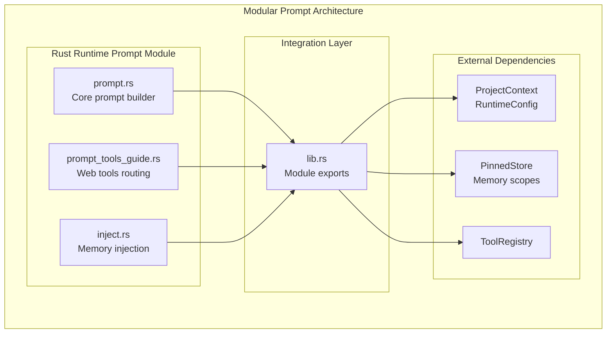
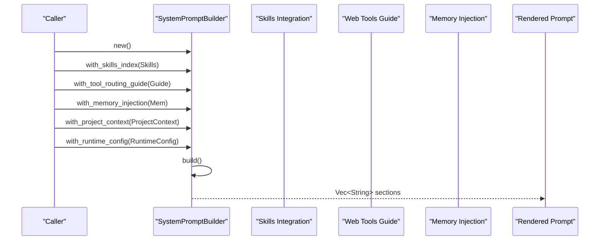
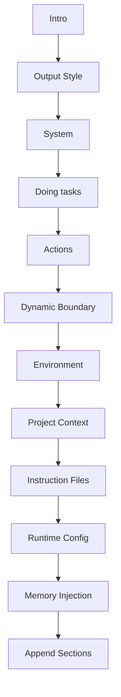
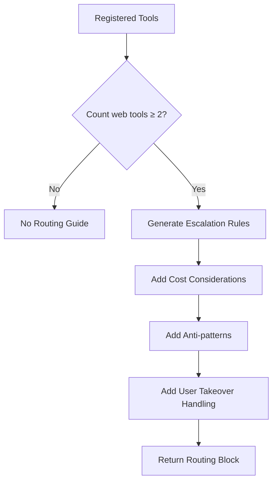
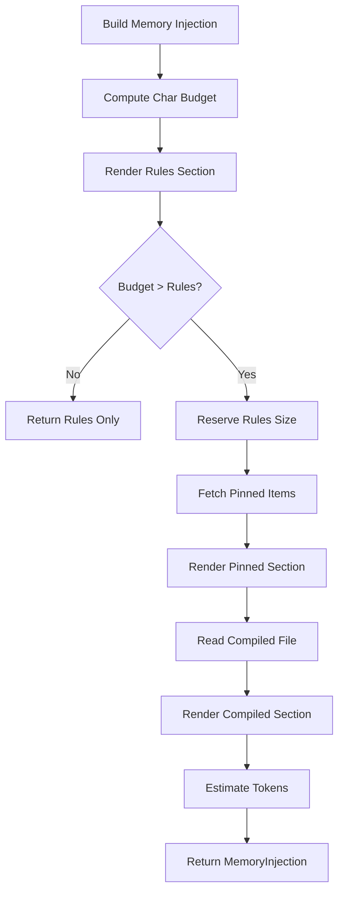
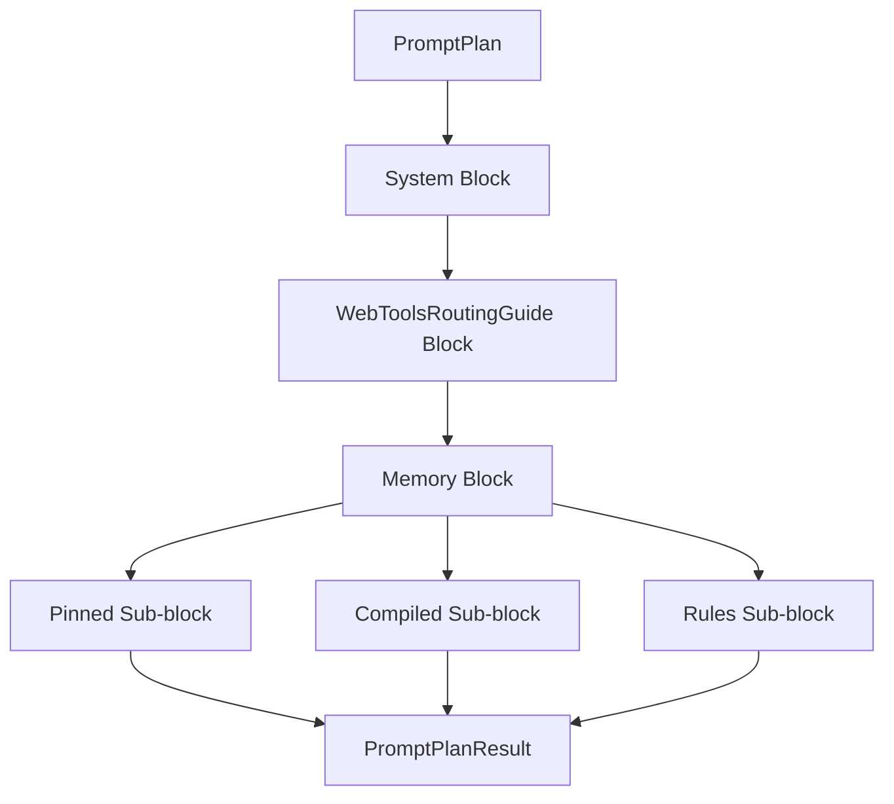
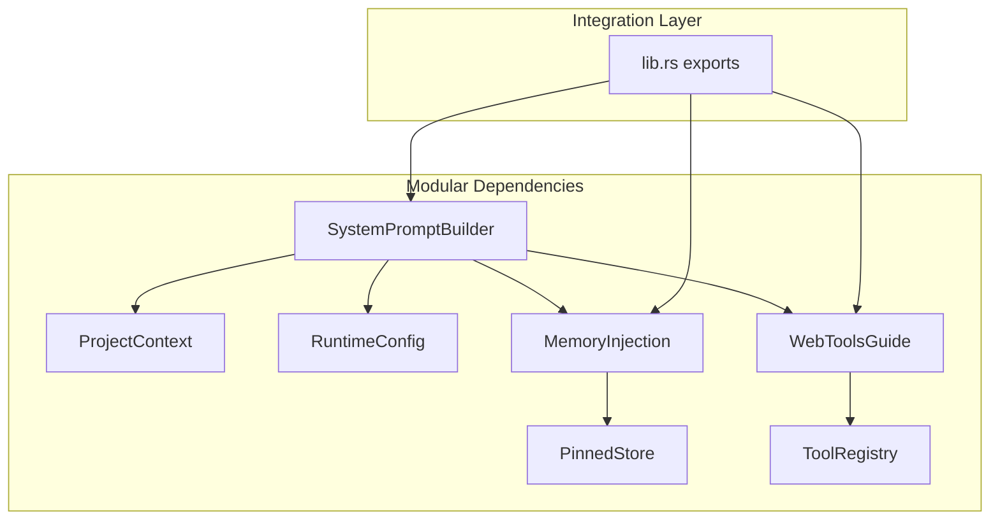

# Prompt Planner

<cite>
**Referenced Files in This Document**
- [prompt.rs](file://rust/crates/runtime/src/prompt.rs)
- [prompt_tools_guide.rs](file://src-tauri/src/modules/runtime/prompt_tools_guide.rs)
- [inject.rs](file://src-tauri/src/modules/memory/inject.rs)
- [lib.rs](file://rust/crates/runtime/src/lib.rs)
- [03-prompt-builder.md](file://docs/final_design/agent/03-prompt-builder.md)
- [memory-enhancement-from-openhanako-v1.md](file://docs/design-docs/postCLI/memory-enhancement-from-openhanako-v1.md)
</cite>

## Update Summary
**Changes Made**
- Updated modular architecture documentation to reflect the refactoring of runtime/prompt.rs into a modular directory structure
- Added documentation for the new prompt module organization with separate files for different prompt components
- Updated file references to reflect the new modular structure while maintaining complete functionality
- Enhanced documentation to cover the new prompt module boundaries and responsibilities

## Table of Contents
1. [Introduction](#introduction)
2. [Project Structure](#project-structure)
3. [Core Components](#core-components)
4. [Architecture Overview](#architecture-overview)
5. [Detailed Component Analysis](#detailed-component-analysis)
6. [Modular Prompt Architecture](#modular-prompt-architecture)
7. [Dependency Analysis](#dependency-analysis)
8. [Performance Considerations](#performance-considerations)
9. [Troubleshooting Guide](#troubleshooting-guide)
10. [Conclusion](#conclusion)

## Introduction
This document explains the prompt planner subsystem that assembles the system prompt for the agent. The subsystem has been refactored into a modular architecture while maintaining complete functionality. It covers:
- Prompt assembly process and the stable section ordering
- System prompt construction with environment, project context, and runtime configuration
- Web-tools guide integration for routing between web-access tools
- Memory injection sections (pinned, compiled, rules) and retrieval integration
- The PromptPlan structure and PromptBlock types conceptually
- The prompt planning workflow and traceability
- Governor, preflight, and sanitize components within the prompt planner architecture

**Updated** The prompt planner now operates through a modular directory structure that separates concerns into distinct components while preserving all existing functionality.

## Project Structure
The prompt planner has been refactored into a modular directory structure within the Rust runtime module:
- **prompt.rs**: Core prompt builder and system prompt construction functions
- **prompt_tools_guide.rs**: Web tools routing guide generation for tool selection
- **inject.rs**: Memory injection service for assembling memory sections
- **Module boundaries**: Clear separation of concerns with dedicated responsibilities

**Diagram sources**
- [prompt.rs:1-796](file://rust/crates/runtime/src/prompt.rs#L1-L796)
- [prompt_tools_guide.rs:1-229](file://src-tauri/src/modules/runtime/prompt_tools_guide.rs#L1-L229)
- [inject.rs:1-463](file://src-tauri/src/modules/memory/inject.rs#L1-L463)
- [lib.rs:74-77](file://rust/crates/runtime/src/lib.rs#L74-L77)

**Section sources**
- [prompt.rs:1-796](file://rust/crates/runtime/src/prompt.rs#L1-L796)
- [prompt_tools_guide.rs:1-229](file://src-tauri/src/modules/runtime/prompt_tools_guide.rs#L1-L229)
- [inject.rs:1-463](file://src-tauri/src/modules/memory/inject.rs#L1-L463)
- [lib.rs:74-77](file://rust/crates/runtime/src/lib.rs#L74-L77)

## Core Components
The modular prompt architecture maintains the same core components with enhanced separation of concerns:

- **SystemPromptBuilder**: Constructs ordered sections of the system prompt with modular support for different prompt components
- **ProjectContext**: Collects environment metadata, instruction files, and optional git snapshots
- **MemoryInjection**: Encapsulates pinned, compiled, and rules sections with token estimation
- **WebToolsRoutingGuide**: Generates routing blocks for web-access tools with escalation logic
- **PromptPlan**: Conceptual structure representing ordered prompt blocks
- **PromptBlock**: Conceptual unit representing named, typed blocks

Key responsibilities remain consistent:
- Assembly: Modular assembly of static and dynamic sections
- Budgeting: Character/token budget enforcement across all components
- Injection: Coordinated injection of skills index, tool routing, and memory sections
- Traceability: Maintained prompt plan for diagnostics and reproducibility

**Section sources**
- [prompt.rs:85-94](file://rust/crates/runtime/src/prompt.rs#L85-L94)
- [inject.rs:46-62](file://src-tauri/src/modules/memory/inject.rs#L46-L62)
- [prompt_tools_guide.rs:34-128](file://src-tauri/src/modules/runtime/prompt_tools_guide.rs#L34-L128)

## Architecture Overview
The modular prompt planner orchestrates multiple data sources through clearly separated components. The flow integrates:
- Static sections (intro, system, doing tasks, actions)
- Skills index integration
- Tool routing guide generation
- Dynamic boundary marker
- Environment, project context, runtime config
- Memory injection with budget enforcement
- Append sections

**Diagram sources**
- [prompt.rs:96-141](file://rust/crates/runtime/src/prompt.rs#L96-L141)
- [prompt_tools_guide.rs:34-128](file://src-tauri/src/modules/runtime/prompt_tools_guide.rs#L34-L128)
- [inject.rs:88-133](file://src-tauri/src/modules/memory/inject.rs#L88-L133)

## Detailed Component Analysis

### SystemPromptBuilder and Prompt Assembly
The builder composes sections in a strict sequence with modular support:
- Intro section (conditional output style)
- Output style (optional)
- System section
- Doing tasks section
- Actions section
- Dynamic boundary marker
- Environment context
- Project context
- Instruction files (budgeted)
- Runtime config
- Memory injection sections
- Append sections

The modular architecture maintains the same assembly order while distributing responsibilities across separate modules.

**Diagram sources**
- [prompt.rs:144-171](file://rust/crates/runtime/src/prompt.rs#L144-L171)

**Section sources**
- [prompt.rs:144-171](file://rust/crates/runtime/src/prompt.rs#L144-L171)
- [prompt.rs:414-428](file://rust/crates/runtime/src/prompt.rs#L414-L428)

### Skills Index Integration
Skills integration remains centralized in the main prompt module with the same discovery and caching mechanisms. The modular architecture preserves all existing functionality while improving code organization.

Key behaviors remain unchanged:
- Collect entries from roots and resolve shadows by precedence
- Optionally filter by available toolsets
- Cache results keyed by mtime hash
- Render a concise index with additional skills note

**Section sources**
- [prompt.rs:143-209](file://rust/crates/runtime/src/prompt.rs#L143-L209)
- [prompt.rs:217-301](file://rust/crates/runtime/src/prompt.rs#L217-L301)

### Web Tools Guide Integration
The web tools guide module provides comprehensive routing guidance with escalation logic. The module is completely self-contained and handles:
- Tool registration validation
- Escalation order generation (web_search → web_fetch → browser)
- Rule enforcement and anti-pattern prevention
- User takeover handling for browser tools

**Diagram sources**
- [prompt_tools_guide.rs:34-128](file://src-tauri/src/modules/runtime/prompt_tools_guide.rs#L34-L128)

**Section sources**
- [prompt_tools_guide.rs:34-128](file://src-tauri/src/modules/runtime/prompt_tools_guide.rs#L34-L128)

### Memory Injection Sections
Memory injection maintains the same comprehensive budget enforcement and section composition:
- Pinned section: user-pinned facts with highest priority
- Compiled section: compiled memory from 8B+ pipeline
- Rules section: locale-aware consumption guidelines
- Token estimation: precise budget tracking

**Diagram sources**
- [inject.rs:88-133](file://src-tauri/src/modules/memory/inject.rs#L88-L133)
- [inject.rs:135-199](file://src-tauri/src/modules/memory/inject.rs#L135-L199)
- [inject.rs:204-222](file://src-tauri/src/modules/memory/inject.rs#L204-L222)

**Section sources**
- [inject.rs:88-133](file://src-tauri/src/modules/memory/inject.rs#L88-L133)
- [inject.rs:135-199](file://src-tauri/src/modules/memory/inject.rs#L135-L199)
- [inject.rs:204-222](file://src-tauri/src/modules/memory/inject.rs#L204-L222)

### Prompt Planning Workflow and Traceability
The modular architecture maintains the same traceable workflow:
- Build a PromptPlan enumerating ordered PromptBlocks
- Each block corresponds to a stable, documented source
- Dynamic boundary ensures predictable trimming
- Tests validate ordering and boundary behavior

**Diagram sources**
- [03-prompt-builder.md:11-25](file://docs/final_design/agent/03-prompt-builder.md#L11-L25)

**Section sources**
- [03-prompt-builder.md:1-51](file://docs/final_design/agent/03-prompt-builder.md#L1-L51)

## Modular Prompt Architecture
The refactored architecture introduces clear module boundaries while preserving functionality:

### Core Prompt Module (prompt.rs)
- **Responsibilities**: System prompt construction, project context management, instruction file processing
- **Key Functions**: `SystemPromptBuilder`, `ProjectContext`, `load_system_prompt`
- **Budget Management**: Character and token budget enforcement
- **Content Processing**: Instruction file discovery, normalization, and rendering

### Web Tools Guide Module (prompt_tools_guide.rs)
- **Responsibilities**: Tool routing decision support
- **Key Functions**: `web_tools_routing_block`, tool validation and escalation logic
- **Configuration**: Web tool name constants and routing rules
- **Testing**: Comprehensive test coverage for routing scenarios

### Memory Injection Module (inject.rs)
- **Responsibilities**: Memory section assembly and budget enforcement
- **Key Structures**: `MemoryInjection`, budget calculation and enforcement
- **Locale Support**: Chinese and English rule variants
- **Async Processing**: Asynchronous memory fetching and rendering

### Integration Layer (lib.rs)
- **Exports**: Public API exposure for all prompt components
- **Module Boundaries**: Clear separation of concerns
- **Dependencies**: Proper dependency management across modules

**Section sources**
- [prompt.rs:1-796](file://rust/crates/runtime/src/prompt.rs#L1-L796)
- [prompt_tools_guide.rs:1-229](file://src-tauri/src/modules/runtime/prompt_tools_guide.rs#L1-L229)
- [inject.rs:1-463](file://src-tauri/src/modules/memory/inject.rs#L1-L463)
- [lib.rs:74-77](file://rust/crates/runtime/src/lib.rs#L74-L77)

## Dependency Analysis
The modular architecture maintains clear boundaries between components:
- **SystemPromptBuilder** depends on ProjectContext, RuntimeConfig, and modular components
- **MemoryInjection** depends on PinnedStore and compiled memory files
- **WebToolsRoutingGuide** depends on ToolRegistry tool names
- **Integration** manages module exports and dependencies

**Diagram sources**
- [prompt.rs:354-570](file://rust/crates/runtime/src/prompt.rs#L354-L570)
- [inject.rs:88-133](file://src-tauri/src/modules/memory/inject.rs#L88-L133)
- [prompt_tools_guide.rs:34-128](file://src-tauri/src/modules/runtime/prompt_tools_guide.rs#L34-L128)
- [lib.rs:74-77](file://rust/crates/runtime/src/lib.rs#L74-L77)

**Section sources**
- [prompt.rs:354-570](file://rust/crates/runtime/src/prompt.rs#L354-L570)
- [inject.rs:88-133](file://src-tauri/src/modules/memory/inject.rs#L88-L133)
- [prompt_tools_guide.rs:34-128](file://src-tauri/src/modules/runtime/prompt_tools_guide.rs#L34-L128)
- [lib.rs:74-77](file://rust/crates/runtime/src/lib.rs#L74-L77)

## Performance Considerations
The modular architecture maintains performance characteristics:
- **Budget enforcement**: Instruction files and memory sections truncated to stay within limits
- **Caching**: Skills index cached by mtime hash to avoid repeated scans
- **Early termination**: Instruction rendering stops when budget exhausted
- **Locale-aware truncation**: Preserves CJK correctness and avoids partial grapheme splits
- **Async processing**: Memory injection performed asynchronously before prompt building

## Troubleshooting Guide
Common issues and resolutions remain consistent:
- **Missing git**: Git status/diff snapshots optional and gracefully handled
- **Empty skills index**: Skills section omitted when no skills installed
- **Insufficient budget**: Memory injection may include only rules section when budget tight
- **Web tools guide not injected**: Occurs when fewer than two web tools registered
- **Instruction truncation**: Content truncated with markers when exceeding limits

Validation references:
- Instruction file discovery and truncation
- Skills index caching and filtering
- Memory budget enforcement and truncation
- Tool routing guide gating

**Section sources**
- [prompt.rs:237-285](file://rust/crates/runtime/src/prompt.rs#L237-L285)
- [prompt.rs:217-301](file://src-tauri/src/modules/runtime/prompt.rs#L217-L301)
- [inject.rs:94-133](file://src-tauri/src/modules/memory/inject.rs#L94-L133)
- [prompt_tools_guide.rs:34-128](file://src-tauri/src/modules/runtime/prompt_tools_guide.rs#L34-L128)

## Conclusion
The refactored prompt planner subsystem provides a robust, traceable, and budget-aware mechanism for assembling the system prompt through a modular architecture. The separation of concerns into distinct modules (core prompt builder, web tools guide, and memory injection) improves maintainability while preserving all existing functionality. By maintaining clear module boundaries, enforcing strict budgets, and ensuring reliable agent behavior across diverse environments, the modular architecture supports both current operations and future enhancements.