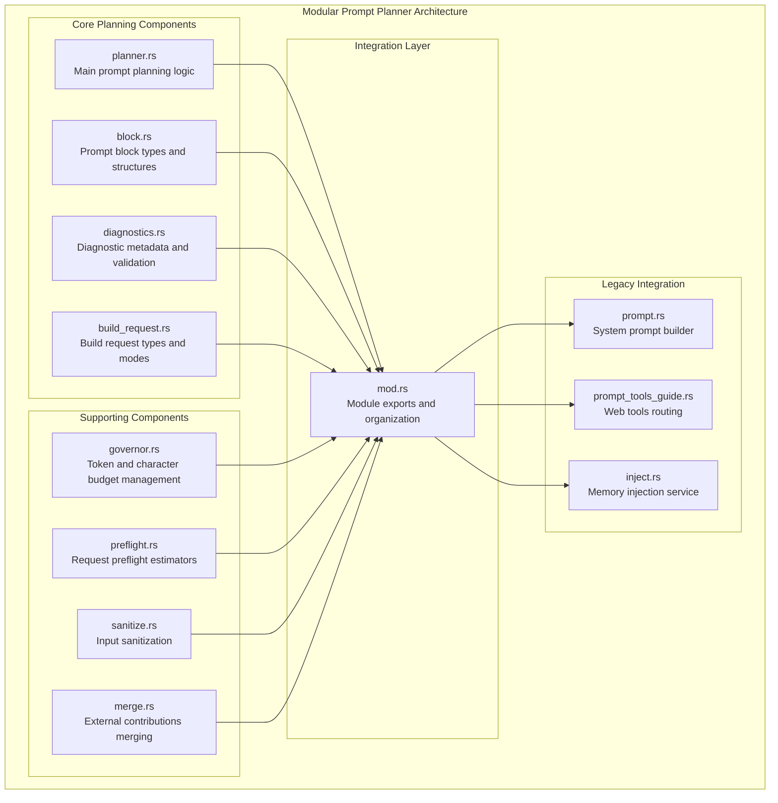
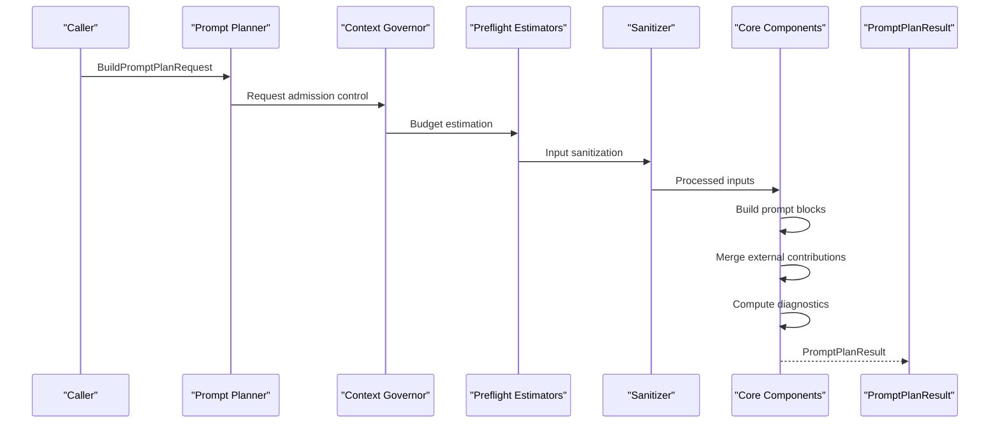
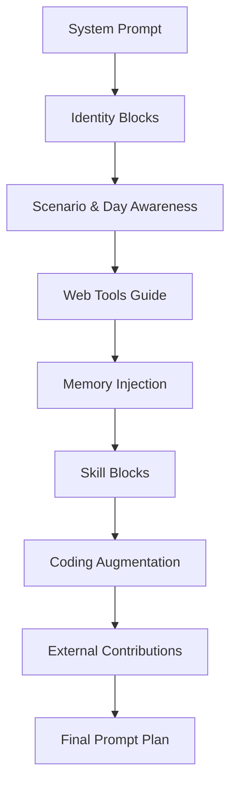
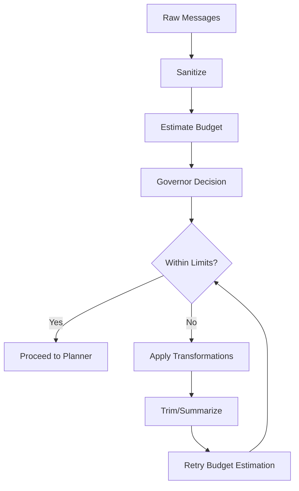
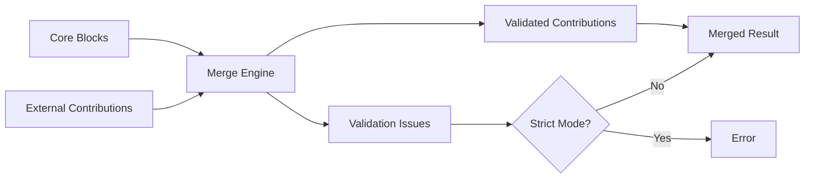
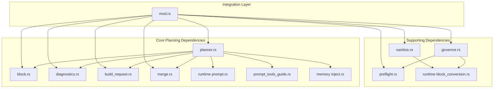

# Prompt Planner

<cite>
**Referenced Files in This Document**
- [planner.rs](file://src-tauri/src/modules/application/prompt_planner/planner.rs)
- [block.rs](file://src-tauri/src/modules/application/prompt_planner/block.rs)
- [diagnostics.rs](file://src-tauri/src/modules/application/prompt_planner/diagnostics.rs)
- [build_request.rs](file://src-tauri/src/modules/application/prompt_planner/build_request.rs)
- [governor.rs](file://src-tauri/src/modules/application/prompt_planner/governor.rs)
- [preflight.rs](file://src-tauri/src/modules/application/prompt_planner/preflight.rs)
- [sanitize.rs](file://src-tauri/src/modules/application/prompt_planner/sanitize.rs)
- [merge.rs](file://src-tauri/src/modules/application/prompt_planner/merge.rs)
- [mod.rs](file://src-tauri/src/modules/application/prompt_planner/mod.rs)
- [prompt.rs](file://rust/crates/runtime/src/prompt.rs)
- [prompt_tools_guide.rs](file://src-tauri/src/modules/runtime/prompt_tools_guide.rs)
- [inject.rs](file://src-tauri/src/modules/memory/inject.rs)
- [lib.rs](file://rust/crates/runtime/src/lib.rs)
- [03-prompt-builder.md](file://docs/final_design/agent/03-prompt-builder.md)
- [memory-enhancement-from-openhanako-v1.md](file://docs/design-docs/postCLI/memory-enhancement-from-openhanako-v1.md)
</cite>

## Update Summary
**Changes Made**
- Updated modular architecture documentation to reflect the complete refactoring of the prompt planner into focused submodules
- Added comprehensive documentation for all new modular components (block.rs, diagnostics.rs, build_request.rs, planner.rs)
- Updated file references to reflect the new modular structure while maintaining complete backward compatibility
- Enhanced documentation to cover the new prompt planner boundaries, governor, preflight, and sanitize components
- Documented the external contributions merging mechanism and traceability improvements

## Table of Contents
1. [Introduction](#introduction)
2. [Project Structure](#project-structure)
3. [Core Components](#core-components)
4. [Architecture Overview](#architecture-overview)
5. [Detailed Component Analysis](#detailed-component-analysis)
6. [Modular Prompt Architecture](#modular-prompt-architecture)
7. [Governor, Preflight, and Sanitize Components](#governor-preflight-and-sanitize-components)
8. [External Contributions and Merging](#external-contributions-and-merging)
9. [Dependency Analysis](#dependency-analysis)
10. [Performance Considerations](#performance-considerations)
11. [Troubleshooting Guide](#troubleshooting-guide)
12. [Conclusion](#conclusion)

## Introduction
This document explains the prompt planner subsystem that assembles the system prompt for the agent. The subsystem has been completely refactored into a highly modular architecture while maintaining complete backward compatibility. The new architecture follows UClaw alignment principles and provides:

- **Structured prompt planning** with explicit block types and traceability
- **Modular components** (planner, block types, diagnostics, build requests) for maintainability
- **Governor, preflight, and sanitize** components for request management
- **External contributions merging** mechanism for subsystem integration
- **Enhanced traceability** with block hashing and diagnostic metadata
- **Coding mode augmentation** and compaction support

**Updated** The prompt planner now operates through a fully modular directory structure with clear separation of concerns across multiple specialized components.

## Project Structure
The prompt planner has been completely refactored into a comprehensive modular architecture within the Rust application module:

**Diagram sources**
- [mod.rs:1-157](file://src-tauri/src/modules/application/prompt_planner/mod.rs#L1-L157)
- [planner.rs:1-823](file://src-tauri/src/modules/application/prompt_planner/planner.rs#L1-L823)
- [block.rs:1-130](file://src-tauri/src/modules/application/prompt_planner/block.rs#L1-L130)
- [diagnostics.rs:1-316](file://src-tauri/src/modules/application/prompt_planner/diagnostics.rs#L1-L316)
- [build_request.rs:1-129](file://src-tauri/src/modules/application/prompt_planner/build_request.rs#L1-L129)

**Section sources**
- [mod.rs:1-157](file://src-tauri/src/modules/application/prompt_planner/mod.rs#L1-L157)
- [planner.rs:1-823](file://src-tauri/src/modules/application/prompt_planner/planner.rs#L1-L823)
- [block.rs:1-130](file://src-tauri/src/modules/application/prompt_planner/block.rs#L1-L130)
- [diagnostics.rs:1-316](file://src-tauri/src/modules/application/prompt_planner/diagnostics.rs#L1-L316)
- [build_request.rs:1-129](file://src-tauri/src/modules/application/prompt_planner/build_request.rs#L1-L129)

## Core Components
The modular prompt architecture maintains the same core components with significantly enhanced separation of concerns:

### Prompt Planning Core
- **PromptPlan**: Structured representation of the complete prompt with traceability metadata
- **PromptBlock**: Individual prompt segments with source attribution and priority
- **PromptBlockKind**: Canonical enumeration of all block types for stable harness traces
- **PromptPlanResult**: Combined plan and rendered text for efficient processing

### Request and Configuration
- **BuildPromptPlanRequest**: Comprehensive input bundle for prompt construction
- **PromptBuildMode**: Execution context modes (Chat, Coding, Research, Planning, Review)
- **PromptBuildOptions**: Configuration for diagnostics and validation behavior

### Diagnostics and Validation
- **PromptPlanDiagnostics**: Complete diagnostic metadata for traceability
- **PromptValidationIssue**: Structured validation problems and warnings
- **Traceability**: Block hashing, trace IDs, and redacted previews

Key responsibilities remain consistent:
- **Structured Assembly**: Modular assembly of static and dynamic sections with explicit ordering
- **Budget Management**: Character/token budget enforcement across all components
- **External Integration**: Controlled contributions from subsystems through merging
- **Traceability**: Enhanced prompt plan for diagnostics, reproducibility, and observability

**Section sources**
- [planner.rs:18-56](file://src-tauri/src/modules/application/prompt_planner/planner.rs#L18-L56)
- [block.rs:7-66](file://src-tauri/src/modules/application/prompt_planner/block.rs#L7-L66)
- [build_request.rs:13-77](file://src-tauri/src/modules/application/prompt_planner/build_request.rs#L13-L77)
- [diagnostics.rs:27-56](file://src-tauri/src/modules/application/prompt_planner/diagnostics.rs#L27-L56)

## Architecture Overview
The modular prompt planner orchestrates multiple data sources through clearly separated components with enhanced request management. The flow integrates:

**Diagram sources**
- [planner.rs:88-401](file://src-tauri/src/modules/application/prompt_planner/planner.rs#L88-L401)
- [governor.rs:33-49](file://src-tauri/src/modules/application/prompt_planner/governor.rs#L33-L49)
- [preflight.rs:10-59](file://src-tauri/src/modules/application/prompt_planner/preflight.rs#L10-L59)
- [sanitize.rs:49-148](file://src-tauri/src/modules/application/prompt_planner/sanitize.rs#L49-L148)

## Detailed Component Analysis

### Prompt Planning Workflow and Block Assembly
The planner constructs a comprehensive prompt plan with explicit block ordering and enhanced traceability:

1. **System Prompt**: Load and validate system prompt with fallback mechanism
2. **Identity Blocks**: Soul, Persona, and Identity Naming blocks with priority management
3. **Scenario and Day Awareness**: Contextual framing with temporal anchoring
4. **Web Tools Routing Guide**: Conditional tool selection guidance
5. **Memory Injection**: Structured memory sections with priority assignment
6. **Skill Blocks**: Optional skill identification
7. **Coding Mode Augmentation**: Specialized context for development tasks
8. **External Contributions**: Controlled integration from subsystems

**Diagram sources**
- [planner.rs:88-401](file://src-tauri/src/modules/application/prompt_planner/planner.rs#L88-L401)

**Section sources**
- [planner.rs:88-401](file://src-tauri/src/modules/application/prompt_planner/planner.rs#L88-L401)
- [planner.rs:466-552](file://src-tauri/src/modules/application/prompt_planner/planner.rs#L466-L552)

### Prompt Block Types and Structure
The modular architecture defines comprehensive block types with explicit semantics and priority assignments:

- **System**: Static system prompt content
- **Identity**: Soul, Persona, and Identity Naming blocks
- **Context**: Scenario and Day Awareness framing
- **Tools**: Web tools routing guidance
- **Memory**: Pinned, Compiled, Rules, and Retrieved memory sections
- **Strategy**: Active strategy overlay blocks
- **Skills**: Current skill identification
- **Coding**: Development-focused context blocks
- **Continuation**: Long session management

Each block includes source attribution, priority for ordering, and sensitivity flags for diagnostics.

**Section sources**
- [block.rs:13-81](file://src-tauri/src/modules/application/prompt_planner/block.rs#L13-L81)
- [block.rs:104-130](file://src-tauri/src/modules/application/prompt_planner/block.rs#L104-L130)

### Build Request and Configuration Management
The build request system provides comprehensive configuration for prompt construction:

- **Session Context**: Session ID, user message, and working directory
- **Environment Data**: Date, OS information, and tool registry
- **Identity Resolution**: Resolved identity with soul/persona
- **Execution Mode**: PromptBuildMode for different contexts
- **Memory Artifacts**: Structured memory injection data
- **Learning Integration**: Active strategy overlays
- **Options Control**: Diagnostics and validation preferences

**Section sources**
- [build_request.rs:84-129](file://src-tauri/src/modules/application/prompt_planner/build_request.rs#L84-L129)

## Modular Prompt Architecture
The refactored architecture introduces comprehensive module boundaries while preserving full functionality:

### Core Planning Module (planner.rs)
- **Responsibilities**: Main prompt planning logic, block assembly, and plan construction
- **Key Functions**: `build_prompt_plan`, `compute_block_hash`, `build_diagnostics`
- **Priority Management**: Explicit block ordering and sensitivity handling
- **Traceability**: Block hashing, trace ID computation, and diagnostic metadata

### Block Type Definitions (block.rs)
- **Responsibilities**: Canonical block type definitions and structures
- **Key Types**: `PromptBlockKind`, `PromptBlock`, `PromptBlockSource`, `PromptContribution`
- **Stability**: Closed enum for harness trace compatibility
- **Attribution**: Source tracking and priority assignment

### Diagnostic Metadata (diagnostics.rs)
- **Responsibilities**: Comprehensive diagnostic information and validation
- **Key Types**: `PromptPlanDiagnostics`, `PromptValidationIssue`
- **Frontend Safety**: Redacted previews and structured summaries
- **Control Plane Integration**: Lane decisions and activation reasons

### Build Request Types (build_request.rs)
- **Responsibilities**: Request configuration and execution modes
- **Key Types**: `BuildPromptPlanRequest`, `PromptBuildMode`, `PromptBuildOptions`
- **Extensibility**: Struct-based design for future enhancements
- **Mode Support**: Multi-context execution modes

### Supporting Components
- **Governor**: Request admission control and budget management
- **Preflight**: Character and token estimation utilities
- **Sanitize**: Input validation and cleanup
- **Merge**: External contributions integration

**Section sources**
- [planner.rs:1-823](file://src-tauri/src/modules/application/prompt_planner/planner.rs#L1-L823)
- [block.rs:1-130](file://src-tauri/src/modules/application/prompt_planner/block.rs#L1-L130)
- [diagnostics.rs:1-316](file://src-tauri/src/modules/application/prompt_planner/diagnostics.rs#L1-L316)
- [build_request.rs:1-129](file://src-tauri/src/modules/application/prompt_planner/build_request.rs#L1-L129)

## Governor, Preflight, and Sanitize Components
The modular architecture includes three critical supporting components for request management:

### Context Governor (governor.rs)
Manages request admission and budget enforcement:
- **Admission Control**: Validates request size against configured limits
- **Token Budget Gate**: Removes oldest messages when token limits exceeded
- **Character Budget Gate**: Trims longest messages when character limits exceeded
- **Artifact Gate**: Summarizes tool results and images for model consumption
- **Statistics Tracking**: Comprehensive metrics for all transformations

### Preflight Estimators (preflight.rs)
Provides budget estimation utilities:
- **Character Counting**: Accurate message length estimation
- **Token Estimation**: Approximate token count from character counts
- **Message Summarization**: Intelligent content truncation for budget constraints
- **Tool Result Processing**: Special handling for tool execution results

### Input Sanitizer (sanitize.rs)
Ensures input validity and provider compatibility:
- **Message Validation**: Removes empty and malformed messages
- **Tool Result Matching**: Validates tool use/result pairing
- **Input Validation**: Ensures tool use inputs are properly formatted JSON
- **Orphan Detection**: Identifies and removes disconnected tool references
- **Statistics Collection**: Detailed metrics for all sanitization actions

**Diagram sources**
- [governor.rs:33-49](file://src-tauri/src/modules/application/prompt_planner/governor.rs#L33-L49)
- [preflight.rs:10-59](file://src-tauri/src/modules/application/prompt_planner/preflight.rs#L10-L59)
- [sanitize.rs:49-148](file://src-tauri/src/modules/application/prompt_planner/sanitize.rs#L49-L148)

**Section sources**
- [governor.rs:1-204](file://src-tauri/src/modules/application/prompt_planner/governor.rs#L1-L204)
- [preflight.rs:1-142](file://src-tauri/src/modules/application/prompt_planner/preflight.rs#L1-L142)
- [sanitize.rs:1-172](file://src-tauri/src/modules/application/prompt_planner/sanitize.rs#L1-L172)

## External Contributions and Merging
The modular architecture supports controlled integration from external subsystems through a sophisticated merging mechanism:

### Contribution Model
- **PromptContribution**: Standardized external contribution structure
- **Kind Restrictions**: Prevents sensitive core block modifications
- **Priority Assignment**: Lower priority for external contributions
- **Source Attribution**: Complete provenance tracking

### Merging Logic (merge.rs)
Implements sophisticated merging rules:
- **Validation First**: Rejects forbidden sensitive contributions
- **Order Preservation**: Maintains original order within each kind
- **Kind-Based Insertion**: Inserts external blocks after corresponding core blocks
- **Fallback Handling**: Adds unmatched contributions at the end
- **Strict Mode Support**: Immediate error reporting in validation failures

### Supported External Contributions
- **Memory**: Additional memory sections beyond core injection
- **MCP**: Model Context Protocol contributions
- **Skills**: Additional skill context
- **Learning**: Strategy and policy overlays
- **Utility**: General-purpose utility contributions

**Diagram sources**
- [merge.rs:22-104](file://src-tauri/src/modules/application/prompt_planner/merge.rs#L22-L104)

**Section sources**
- [merge.rs:1-126](file://src-tauri/src/modules/application/prompt_planner/merge.rs#L1-L126)
- [planner.rs:376-381](file://src-tauri/src/modules/application/prompt_planner/planner.rs#L376-L381)

## Dependency Analysis
The modular architecture maintains clear boundaries between components with strategic dependencies:

**Diagram sources**
- [planner.rs:5-16](file://src-tauri/src/modules/application/prompt_planner/planner.rs#L5-L16)
- [mod.rs:37-69](file://src-tauri/src/modules/application/prompt_planner/mod.rs#L37-L69)

**Section sources**
- [planner.rs:5-16](file://src-tauri/src/modules/application/prompt_planner/planner.rs#L5-L16)
- [mod.rs:37-69](file://src-tauri/src/modules/application/prompt_planner/mod.rs#L37-L69)

## Performance Considerations
The modular architecture maintains and enhances performance characteristics:

- **Lazy Loading**: Components loaded only when needed
- **Efficient Hashing**: Block hash computation optimized for stability
- **Memory Efficiency**: Structured data types minimize memory overhead
- **Early Termination**: Validation and merging short-circuit on errors
- **Batch Processing**: Multiple components designed for concurrent operation
- **Diagnostics Control**: Optional diagnostic inclusion reduces overhead

## Troubleshooting Guide
Common issues and resolutions with enhanced diagnostic capabilities:

### Modular Architecture Issues
- **Missing Dependencies**: Check module imports and re-export statements
- **Block Ordering Problems**: Verify priority assignments and kind mappings
- **External Contribution Failures**: Review validation rules and strict mode settings
- **Memory Injection Issues**: Validate memory artifacts structure and section kinds

### Request Management Problems
- **Budget Exceeded**: Review governor statistics and adjust limits
- **Sanitization Errors**: Check message format and tool result matching
- **Preflight Estimation Issues**: Verify character counting and token estimation
- **Traceability Problems**: Confirm block hashing and trace ID computation

### Legacy Integration Issues
- **System Prompt Loading**: Check fallback mechanisms and error handling
- **Web Tools Guide**: Verify tool registration and escalation logic
- **Memory Injection**: Validate section composition and budget enforcement
- **Backward Compatibility**: Ensure API compatibility with external callers

**Section sources**
- [planner.rs:102-110](file://src-tauri/src/modules/application/prompt_planner/planner.rs#L102-L110)
- [diagnostics.rs:58-162](file://src-tauri/src/modules/application/prompt_planner/diagnostics.rs#L58-L162)
- [merge.rs:30-59](file://src-tauri/src/modules/application/prompt_planner/merge.rs#L30-L59)

## Conclusion
The completely refactored prompt planner subsystem provides a robust, traceable, and highly modular mechanism for assembling the system prompt. The new architecture follows UClaw alignment principles while maintaining complete backward compatibility. Key improvements include:

- **Enhanced Modularity**: Clear separation of concerns across specialized components
- **Improved Traceability**: Comprehensive block hashing, trace IDs, and diagnostic metadata
- **External Integration**: Controlled contributions from subsystems through merging
- **Request Management**: Sophisticated governor, preflight, and sanitization components
- **Future Extensibility**: Structured design supports ongoing enhancements

By maintaining explicit module boundaries, enforcing strict priorities, and ensuring reliable agent behavior across diverse environments, the modular architecture supports both current operations and future enhancements while providing superior observability and maintainability.