# Provider Service

<cite>
**Referenced Files in This Document**
- [provider_service.rs](file://src-tauri/src/modules/application/provider_service.rs)
- [provider.rs](file://src-tauri/src/commands/provider.rs)
- [claw_provider.rs](file://rust/crates/api/src/providers/claw_provider.rs)
- [openai_compat.rs](file://src-tauri/src/modules/api/providers/openai_compat.rs)
- [model_resolver.rs](file://src-tauri/src/modules/config/model_resolver.rs)
- [types.rs](file://src-tauri/src/modules/provider/types.rs)
- [service.rs](file://src-tauri/src/modules/provider/service.rs)
- [registry.rs](file://src-tauri/src/modules/provider/registry.rs)
- [test.rs](file://src-tauri/src/modules/provider/test.rs)
- [known_providers.rs](file://src-tauri/src/modules/provider/known_providers.rs)
- [known_models.rs](file://src-tauri/src/modules/provider/known_models.rs)
- [capabilities.rs](file://src-tauri/src/modules/provider/capabilities.rs)
- [ProvidersSettingsPage.tsx](file://src/modules/settings/pages/ProvidersSettingsPage.tsx)
- [mod.rs](file://src-tauri/src/modules/api/mod.rs)
- [config_mod.rs](file://src-tauri/src/modules/runtime/config/mod.rs)
</cite>

## Update Summary
**Changes Made**
- Added comprehensive documentation for the new ProvidersSettingsPage with three-column layout and real-time validation
- Documented the new KnownProviders and KnownModels modules for enhanced provider system
- Updated provider selection algorithms to include service category grouping and authentication type handling
- Enhanced model management documentation with comprehensive reasoning capability support
- Added documentation for the new service category system (OAuth, Coding Plan, API)

## Table of Contents
1. [Introduction](#introduction)
2. [Project Structure](#project-structure)
3. [Core Components](#core-components)
4. [Architecture Overview](#architecture-overview)
5. [Detailed Component Analysis](#detailed-component-analysis)
6. [Enhanced Provider Management System](#enhanced-provider-management-system)
7. [Dependency Analysis](#dependency-analysis)
8. [Performance Considerations](#performance-considerations)
9. [Troubleshooting Guide](#troubleshooting-guide)
10. [Conclusion](#conclusion)

## Introduction
This document explains the provider service module responsible for provider resolution, runtime client construction, and transport policy loading. The system has been enhanced with a comprehensive provider management interface featuring three-column layout, real-time validation, and advanced model management capabilities. It covers how the system selects providers and models for chat roles, constructs appropriate clients, applies transport policies, integrates with external APIs, and manages provider configurations through the new ProvidersSettingsPage.

## Project Structure
The provider service spans several modules with enhanced functionality:
- Application orchestration and runtime resolution
- Provider client implementations for Anthropic and OpenAI-compatible APIs
- Configuration-driven model resolution and provider registry
- Tauri commands for provider configuration and testing
- Transport policy loading from runtime configuration
- **New**: Comprehensive provider management UI with three-column layout
- **New**: KnownProviders and KnownModels modules for enhanced provider catalog and model capabilities
- **New**: Service category grouping (OAuth, Coding Plan, API) for better organization

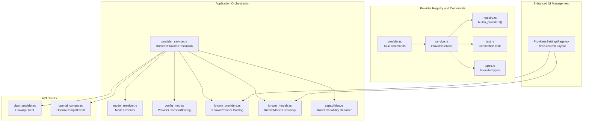

**Diagram sources**
- [provider_service.rs:1-256](file://src-tauri/src/modules/application/provider_service.rs#L1-L256)
- [model_resolver.rs:1-396](file://src-tauri/src/modules/config/model_resolver.rs#L1-L396)
- [config_mod.rs:549-592](file://src-tauri/src/modules/runtime/config/mod.rs#L549-L592)
- [known_providers.rs:1-466](file://src-tauri/src/modules/provider/known_providers.rs#L1-L466)
- [known_models.rs:1-271](file://src-tauri/src/modules/provider/known_models.rs#L1-L271)
- [capabilities.rs:1-226](file://src-tauri/src/modules/provider/capabilities.rs#L1-L226)
- [claw_provider.rs:112-346](file://rust/crates/api/src/providers/claw_provider.rs#L112-L346)
- [openai_compat.rs:68-231](file://src-tauri/src/modules/api/providers/openai_compat.rs#L68-L231)
- [registry.rs:18-415](file://src-tauri/src/modules/provider/registry.rs#L18-L415)
- [service.rs:19-469](file://src-tauri/src/modules/provider/service.rs#L19-L469)
- [provider.rs:14-172](file://src-tauri/src/commands/provider.rs#L14-L172)
- [test.rs:37-92](file://src-tauri/src/modules/provider/test.rs#L37-L92)
- [types.rs:115-144](file://src-tauri/src/modules/provider/types.rs#L115-L144)
- [ProvidersSettingsPage.tsx:1-516](file://src/modules/settings/pages/ProvidersSettingsPage.tsx#L1-L516)

**Section sources**
- [provider_service.rs:1-256](file://src-tauri/src/modules/application/provider_service.rs#L1-L256)
- [provider.rs:14-172](file://src-tauri/src/commands/provider.rs#L14-L172)
- [registry.rs:18-415](file://src-tauri/src/modules/provider/registry.rs#L18-L415)
- [service.rs:19-469](file://src-tauri/src/modules/provider/service.rs#L19-L469)
- [test.rs:37-92](file://src-tauri/src/modules/provider/test.rs#L37-L92)
- [types.rs:115-144](file://src-tauri/src/modules/provider/types.rs#L115-L144)
- [config_mod.rs:549-592](file://src-tauri/src/modules/runtime/config/mod.rs#L549-L592)
- [known_providers.rs:1-466](file://src-tauri/src/modules/provider/known_providers.rs#L1-L466)
- [known_models.rs:1-271](file://src-tauri/src/modules/provider/known_models.rs#L1-L271)
- [capabilities.rs:1-226](file://src-tauri/src/modules/provider/capabilities.rs#L1-L226)
- [ProvidersSettingsPage.tsx:1-516](file://src/modules/settings/pages/ProvidersSettingsPage.tsx#L1-L516)

## Core Components
- **RuntimeProviderResolution**: Typed triple containing the provider client, resolved model id, and per-request timeout derived from transport policy.
- **Provider transport policy**: Loaded from runtime configuration and applied to client construction and retries.
- **ModelResolver**: Resolves role-based model selection to a concrete provider and model with base_url, api_key, and protocol.
- **Provider clients**: Provider-specific implementations for Anthropic (Claw) and OpenAI-compatible APIs.
- **Tauri commands**: UI-driven provider listing, configuration, model listing, selection, and testing.
- **Provider registry and service**: Built-in provider definitions, model discovery, and configuration persistence.
- **KnownProviders**: Static catalog of built-in providers with service categorization and authentication types.
- **KnownModels**: Static dictionary of model capabilities including reasoning support and wire-level quirks.
- **Capabilities Resolver**: Dynamic model capability resolution with global policy overrides and user preferences.
- **ProvidersSettingsPage**: Enhanced three-column UI for comprehensive provider management with real-time validation.

**Section sources**
- [provider_service.rs:37-144](file://src-tauri/src/modules/application/provider_service.rs#L37-L144)
- [config_mod.rs:549-592](file://src-tauri/src/modules/runtime/config/mod.rs#L549-L592)
- [model_resolver.rs:31-277](file://src-tauri/src/modules/config/model_resolver.rs#L31-L277)
- [claw_provider.rs:112-346](file://rust/crates/api/src/providers/claw_provider.rs#L112-L346)
- [openai_compat.rs:68-231](file://src-tauri/src/modules/api/providers/openai_compat.rs#L68-L231)
- [provider.rs:14-172](file://src-tauri/src/commands/provider.rs#L14-L172)
- [registry.rs:18-415](file://src-tauri/src/modules/provider/registry.rs#L18-L415)
- [service.rs:19-469](file://src-tauri/src/modules/provider/service.rs#L19-L469)
- [known_providers.rs:12-72](file://src-tauri/src/modules/provider/known_providers.rs#L12-L72)
- [known_models.rs:8-37](file://src-tauri/src/modules/provider/known_models.rs#L8-L37)
- [capabilities.rs:10-82](file://src-tauri/src/modules/provider/capabilities.rs#L10-L82)
- [ProvidersSettingsPage.tsx:117-208](file://src/modules/settings/pages/ProvidersSettingsPage.tsx#L117-L208)

## Architecture Overview
The provider service orchestrates resolution and client construction with enhanced management capabilities:
- ModelResolver resolves the active model for a role (e.g., chat) to a concrete provider and model.
- Transport policy is loaded from runtime configuration and applied to client retry/backoff and timeouts.
- Provider-specific clients are constructed based on the resolved protocol (e.g., anthropic-messages, openai-completions).
- The resulting RuntimeProviderResolution is consumed by the conversation runtime.
- **New**: ProvidersSettingsPage provides comprehensive three-column management interface with real-time validation.
- **New**: KnownProviders and KnownModels modules provide static catalogs for enhanced provider discovery and capability management.

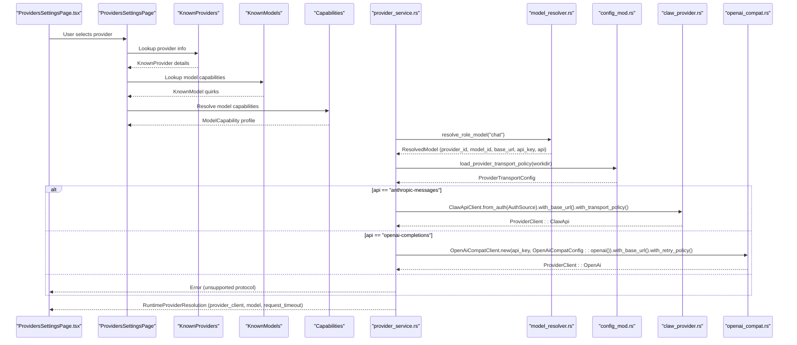

**Diagram sources**
- [ProvidersSettingsPage.tsx:147-208](file://src/modules/settings/pages/ProvidersSettingsPage.tsx#L147-L208)
- [known_providers.rs:407-410](file://src-tauri/src/modules/provider/known_providers.rs#L407-L410)
- [known_models.rs:227-232](file://src-tauri/src/modules/provider/known_models.rs#L227-232)
- [capabilities.rs:94-142](file://src-tauri/src/modules/provider/capabilities.rs#L94-L142)
- [provider_service.rs:91-144](file://src-tauri/src/modules/application/provider_service.rs#L91-L144)
- [model_resolver.rs:190-212](file://src-tauri/src/modules/config/model_resolver.rs#L190-L212)
- [config_mod.rs:549-592](file://src-tauri/src/modules/runtime/config/mod.rs#L549-L592)
- [claw_provider.rs:135-200](file://rust/crates/api/src/providers/claw_provider.rs#L135-L200)
- [openai_compat.rs:78-118](file://src-tauri/src/modules/api/providers/openai_compat.rs#L78-L118)

## Detailed Component Analysis

### RuntimeProviderResolution and Transport Policy Loading
- RuntimeProviderResolution encapsulates the runtime triple: provider_client, model id, and request_timeout.
- load_provider_transport_policy reads runtime configuration and falls back to defaults when loading fails, preserving legacy behavior.

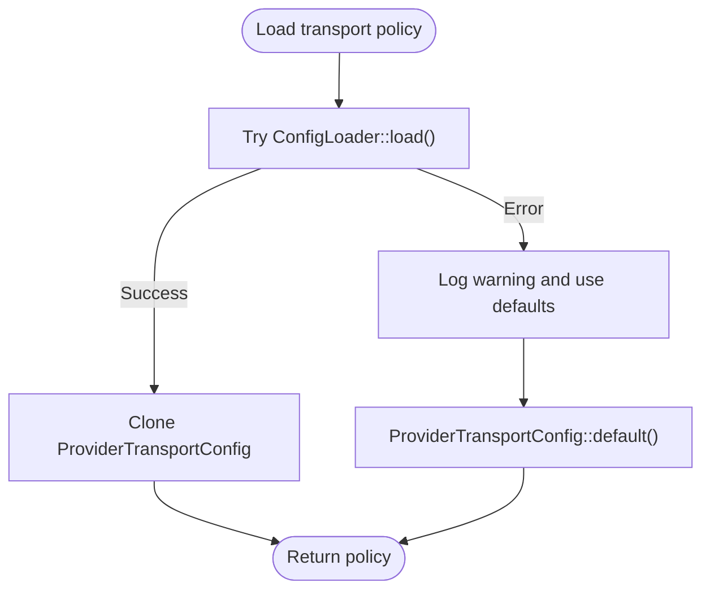

**Diagram sources**
- [provider_service.rs:58-76](file://src-tauri/src/modules/application/provider_service.rs#L58-L76)
- [config_mod.rs:549-592](file://src-tauri/src/modules/runtime/config/mod.rs#L549-L592)

**Section sources**
- [provider_service.rs:37-76](file://src-tauri/src/modules/application/provider_service.rs#L37-L76)
- [config_mod.rs:549-592](file://src-tauri/src/modules/runtime/config/mod.rs#L549-L592)

### Provider Selection and Client Construction
- resolve_chat_runtime_provider performs role-based resolution, loads transport policy, and constructs the appropriate client:
  - For anthropic-messages: requires a non-empty API key; builds a ClawApiClient with base_url and transport policy.
  - For openai-completions: tolerates empty API key (common for local providers); builds an OpenAiCompatClient with base_url and retry policy.
  - Unsupported protocols return a user-facing error.

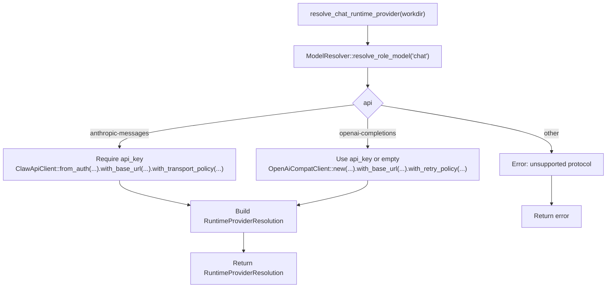

**Diagram sources**
- [provider_service.rs:91-144](file://src-tauri/src/modules/application/provider_service.rs#L91-L144)
- [model_resolver.rs:190-212](file://src-tauri/src/modules/config/model_resolver.rs#L190-L212)
- [claw_provider.rs:135-200](file://rust/crates/api/src/providers/claw_provider.rs#L135-L200)
- [openai_compat.rs:78-118](file://src-tauri/src/modules/api/providers/openai_compat.rs#L78-L118)

**Section sources**
- [provider_service.rs:91-144](file://src-tauri/src/modules/application/provider_service.rs#L91-L144)
- [model_resolver.rs:190-212](file://src-tauri/src/modules/config/model_resolver.rs#L190-L212)

### Provider Client Implementations
- ClawApiClient (Anthropic):
  - Supports API key and bearer token auth, OAuth token exchange/refresh, SSE streaming, and exponential backoff retry.
  - Applies transport policy via with_transport_policy and backoff helpers.
- OpenAiCompatClient (OpenAI-compatible):
  - Supports API key auth, SSE streaming, and exponential backoff retry.
  - Normalizes responses and handles tool calls and usage.

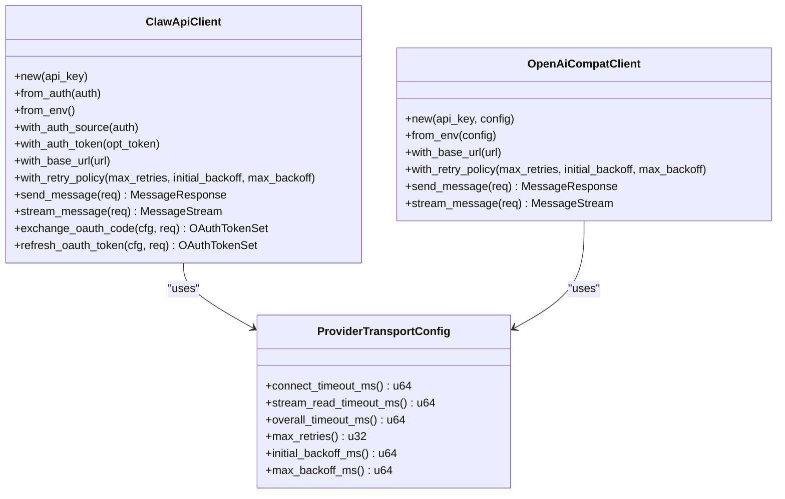

**Diagram sources**
- [claw_provider.rs:112-346](file://rust/crates/api/src/providers/claw_provider.rs#L112-L346)
- [openai_compat.rs:68-231](file://src-tauri/src/modules/api/providers/openai_compat.rs#L68-L231)
- [config_mod.rs:556-592](file://src-tauri/src/modules/runtime/config/mod.rs#L556-L592)

**Section sources**
- [claw_provider.rs:112-346](file://rust/crates/api/src/providers/claw_provider.rs#L112-L346)
- [openai_compat.rs:68-231](file://src-tauri/src/modules/api/providers/openai_compat.rs#L68-L231)
- [config_mod.rs:556-592](file://src-tauri/src/modules/runtime/config/mod.rs#L556-L592)

### Model Resolution and Provider Registry
- ModelResolver:
  - Loads models.json and config.json from ~/.if2ai/.
  - resolve_role_model follows a fallback chain: explicit role assignment, active_model, first selected_model.
  - Provides listing of available models grouped by provider and manages role-based assignments.
- Provider registry:
  - builtin_providers returns 16 built-in providers categorized as Local, International, and Domestic.
  - Includes sub-choices for providers with multiple endpoints or auth variants.

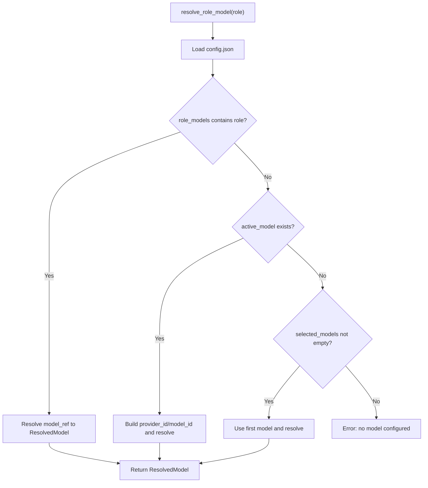

**Diagram sources**
- [model_resolver.rs:190-212](file://src-tauri/src/modules/config/model_resolver.rs#L190-L212)
- [model_resolver.rs:85-100](file://src-tauri/src/modules/config/model_resolver.rs#L85-L100)

**Section sources**
- [model_resolver.rs:31-212](file://src-tauri/src/modules/config/model_resolver.rs#L31-L212)
- [registry.rs:18-415](file://src-tauri/src/modules/provider/registry.rs#L18-L415)

### Tauri Commands and Provider Management
- Commands support:
  - Listing providers and models, configuring providers, selecting models, and testing connectivity.
  - Role-based model configuration and retrieval.
- ProviderService:
  - Implements model listing across providers (Ollama, Anthropic, OpenAI-compatible).
  - Persists provider and model selections via ConfigService.

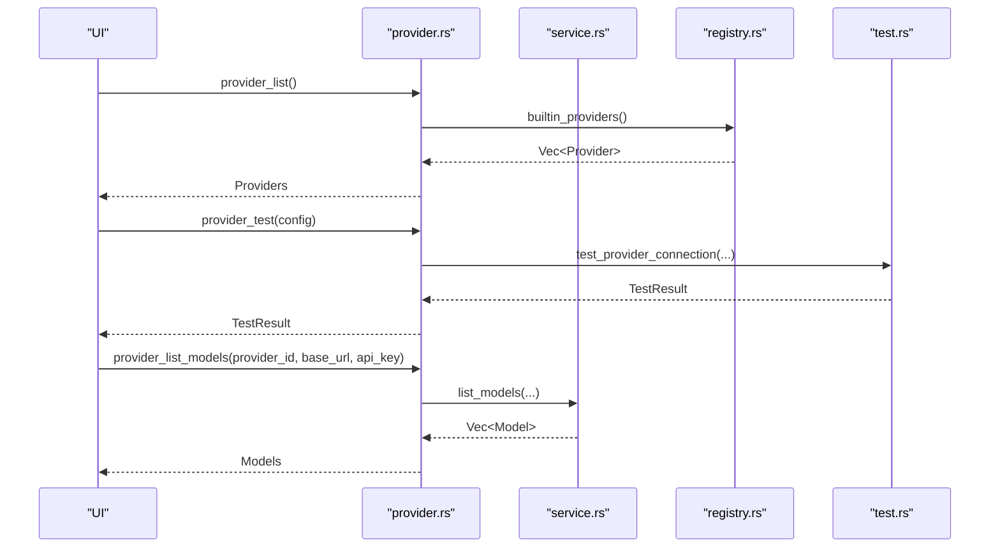

**Diagram sources**
- [provider.rs:14-172](file://src-tauri/src/commands/provider.rs#L14-L172)
- [service.rs:19-172](file://src-tauri/src/modules/provider/service.rs#L19-L172)
- [registry.rs:18-415](file://src-tauri/src/modules/provider/registry.rs#L18-L415)
- [test.rs:37-92](file://src-tauri/src/modules/provider/test.rs#L37-L92)

**Section sources**
- [provider.rs:14-172](file://src-tauri/src/commands/provider.rs#L14-L172)
- [service.rs:19-172](file://src-tauri/src/modules/provider/service.rs#L19-L172)
- [test.rs:37-92](file://src-tauri/src/modules/provider/test.rs#L37-L92)

## Enhanced Provider Management System

### ProvidersSettingsPage Three-Column Layout
The new ProvidersSettingsPage provides a comprehensive three-column interface for provider management:

- **Left Column (Provider Categories)**: Groups providers by service categories (OAuth, Coding Plan, API) with visual indicators for configuration status
- **Middle Column (Provider Details)**: Shows detailed provider information including authentication type, base URL, and API type options
- **Right Column (Model Management)**: Allows selection of available models with real-time validation and capability display

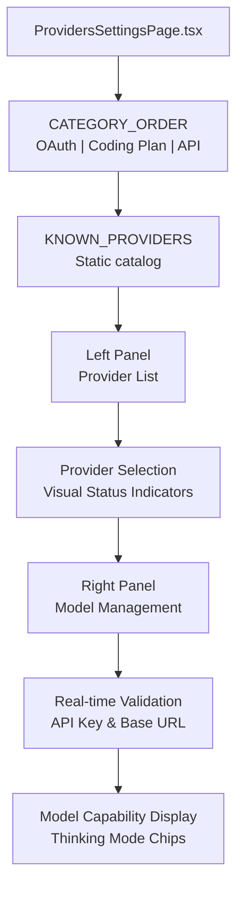

**Diagram sources**
- [ProvidersSettingsPage.tsx:111-115](file://src/modules/settings/pages/ProvidersSettingsPage.tsx#L111-L115)
- [ProvidersSettingsPage.tsx:45-109](file://src/modules/settings/pages/ProvidersSettingsPage.tsx#L45-L109)
- [ProvidersSettingsPage.tsx:147-208](file://src/modules/settings/pages/ProvidersSettingsPage.tsx#L147-L208)

**Section sources**
- [ProvidersSettingsPage.tsx:117-208](file://src/modules/settings/pages/ProvidersSettingsPage.tsx#L117-L208)
- [ProvidersSettingsPage.tsx:227-350](file://src/modules/settings/pages/ProvidersSettingsPage.tsx#L227-L350)

### KnownProviders Module
The KnownProviders module provides a static catalog of built-in providers with comprehensive metadata:

- **Service Categories**: Organized into OAuth, Coding Plan, and API categories for better user experience
- **Authentication Types**: Supports API key, OAuth, and None authentication methods
- **Default Configurations**: Provides sensible defaults for base URLs and API types
- **Geographic Categories**: Maps providers to International, Domestic, or Local categories

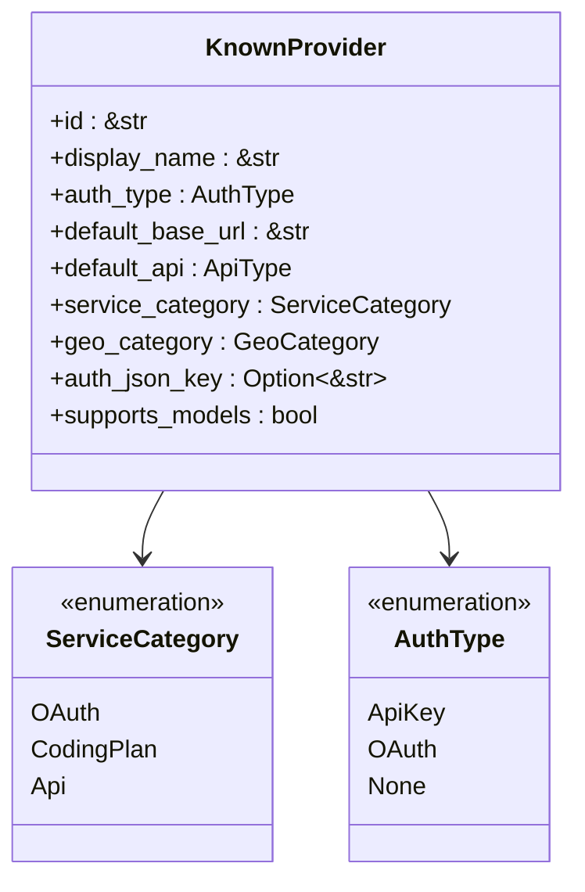

**Diagram sources**
- [known_providers.rs:58-72](file://src-tauri/src/modules/provider/known_providers.rs#L58-L72)
- [known_providers.rs:28-55](file://src-tauri/src/modules/provider/known_providers.rs#L28-L55)
- [known_providers.rs:13-22](file://src-tauri/src/modules/provider/known_providers.rs#L13-L22)

**Section sources**
- [known_providers.rs:12-72](file://src-tauri/src/modules/provider/known_providers.rs#L12-L72)
- [known_providers.rs:80-404](file://src-tauri/src/modules/provider/known_providers.rs#L80-L404)

### KnownModels Module
The KnownModels module provides a comprehensive dictionary of model capabilities:

- **Model Capabilities**: Tracks reasoning support, context windows, and wire-level quirks
- **Quirk Handling**: Manages special requirements like reasoning content in tool calls
- **Provider-Specific Features**: Handles differences between providers (Qwen enable_thinking flag, OpenAI reasoning_effort)
- **Version Support**: Uses substring matching for versioned model names

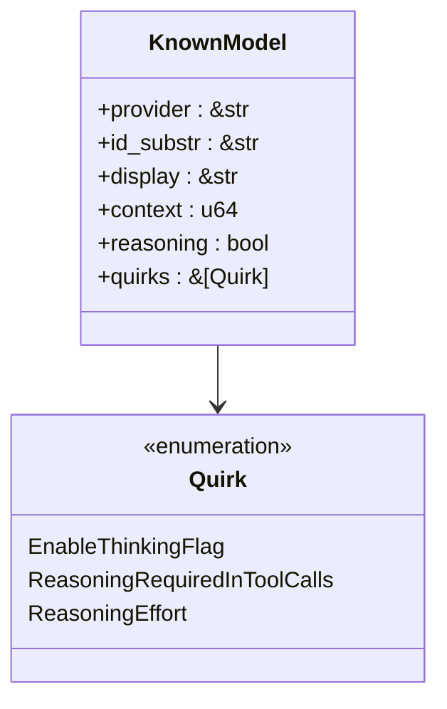

**Diagram sources**
- [known_models.rs:29-37](file://src-tauri/src/modules/provider/known_models.rs#L29-L37)
- [known_models.rs:9-23](file://src-tauri/src/modules/provider/known_models.rs#L9-L23)

**Section sources**
- [known_models.rs:8-37](file://src-tauri/src/modules/provider/known_models.rs#L8-L37)
- [known_models.rs:39-222](file://src-tauri/src/modules/provider/known_models.rs#L39-L222)

### Capabilities Resolver
The capabilities resolver provides dynamic model capability determination:

- **Priority Resolution**: Global policy override → User override → Known dictionary → Default
- **Global Policy**: Environment variable controls for debugging and compatibility
- **User Overrides**: Manual capability adjustments for specific models
- **Wire Protocol Support**: Handles different provider wire formats and requirements

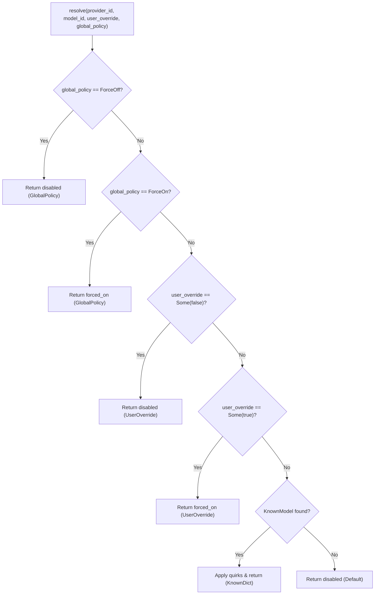

**Diagram sources**
- [capabilities.rs:94-142](file://src-tauri/src/modules/provider/capabilities.rs#L94-L142)

**Section sources**
- [capabilities.rs:10-82](file://src-tauri/src/modules/provider/capabilities.rs#L10-L82)
- [capabilities.rs:94-142](file://src-tauri/src/modules/provider/capabilities.rs#L94-L142)

## Dependency Analysis
- provider_service.rs depends on:
  - ModelResolver for role-based model resolution
  - ConfigLoader for transport policy
  - Provider clients for runtime construction
  - **New**: KnownProviders and KnownModels for enhanced capability resolution
- Provider clients depend on:
  - ProviderTransportConfig for retry/backoff and timeouts
  - External APIs via HTTP/SSE
- Tauri commands depend on:
  - ProviderService for listing and configuration
  - Provider registry for UI metadata
  - Provider test utilities for connectivity checks
- **New**: ProvidersSettingsPage depends on:
  - KnownProviders for static provider catalog
  - KnownModels for model capability information
  - Capabilities resolver for dynamic capability determination

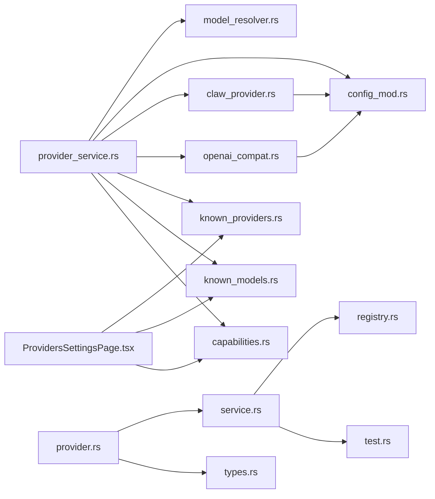

**Diagram sources**
- [provider_service.rs:22-29](file://src-tauri/src/modules/application/provider_service.rs#L22-L29)
- [model_resolver.rs:24-29](file://src-tauri/src/modules/config/model_resolver.rs#L24-L29)
- [config_mod.rs:549-592](file://src-tauri/src/modules/runtime/config/mod.rs#L549-L592)
- [claw_provider.rs:112-346](file://rust/crates/api/src/providers/claw_provider.rs#L112-L346)
- [openai_compat.rs:68-231](file://src-tauri/src/modules/api/providers/openai_compat.rs#L68-L231)
- [provider.rs:8-11](file://src-tauri/src/commands/provider.rs#L8-L11)
- [service.rs:12-17](file://src-tauri/src/modules/provider/service.rs#L12-L17)
- [registry.rs:11](file://src-tauri/src/modules/provider/registry.rs#L11)
- [test.rs:20-21](file://src-tauri/src/modules/provider/test.rs#L20-L21)
- [types.rs:12](file://src-tauri/src/modules/provider/types.rs#L12)
- [known_providers.rs:9-10](file://src-tauri/src/modules/provider/known_providers.rs#L9-L10)
- [known_models.rs:8](file://src-tauri/src/modules/provider/known_models.rs#L8)
- [capabilities.rs:8](file://src-tauri/src/modules/provider/capabilities.rs#L8)
- [ProvidersSettingsPage.tsx:41-44](file://src/modules/settings/pages/ProvidersSettingsPage.tsx#L41-L44)

**Section sources**
- [provider_service.rs:22-29](file://src-tauri/src/modules/application/provider_service.rs#L22-L29)
- [provider.rs:8-11](file://src-tauri/src/commands/provider.rs#L8-L11)
- [service.rs:12-17](file://src-tauri/src/modules/provider/service.rs#L12-L17)
- [registry.rs:11](file://src-tauri/src/modules/provider/registry.rs#L11)
- [test.rs:20-21](file://src-tauri/src/modules/provider/test.rs#L20-L21)
- [types.rs:12](file://src-tauri/src/modules/provider/types.rs#L12)
- [known_providers.rs:9-10](file://src-tauri/src/modules/provider/known_providers.rs#L9-L10)
- [known_models.rs:8](file://src-tauri/src/modules/provider/known_models.rs#L8)
- [capabilities.rs:8](file://src-tauri/src/modules/provider/capabilities.rs#L8)
- [ProvidersSettingsPage.tsx:41-44](file://src/modules/settings/pages/ProvidersSettingsPage.tsx#L41-L44)

## Performance Considerations
- Retry and backoff:
  - Both clients implement exponential backoff with configurable max_retries and bounds.
  - Tune ProviderTransportConfig to balance resilience and latency.
- Streaming:
  - SSE streaming clients parse frames incrementally; ensure adequate buffering and event handling.
- Timeouts:
  - Use overall_timeout_ms from ProviderTransportConfig to bound request lifetimes.
- Model listing:
  - ProviderService delegates to provider-specific endpoints; consider caching and rate limiting for frequent listing operations.
- **New**: Static catalogs (KnownProviders, KnownModels) eliminate runtime lookups and improve performance.
- **New**: Real-time validation in ProvidersSettingsPage reduces user error and improves UX.

## Troubleshooting Guide
Common issues and resolutions:
- Missing API key for Anthropic:
  - Error indicates missing API key; configure provider settings and retest.
- Invalid API key for OpenAI-compatible providers:
  - Authentication errors are surfaced with specific error codes.
- Network/connectivity problems:
  - Timeouts and network errors are differentiated; verify base_url and connectivity.
- Model not available:
  - Ensure the model is configured and available on the selected provider.
- Transport policy loading failures:
  - When runtime config cannot be loaded, defaults are used; verify config file integrity.
- **New**: Provider configuration validation:
  - ProvidersSettingsPage provides real-time validation for API keys and base URLs.
- **New**: Model capability mismatches:
  - Use the capabilities resolver to understand model-specific requirements and quirks.

**Section sources**
- [provider_service.rs:58-76](file://src-tauri/src/modules/application/provider_service.rs#L58-L76)
- [test.rs:94-256](file://src-tauri/src/modules/provider/test.rs#L94-L256)
- [service.rs:174-193](file://src-tauri/src/modules/provider/service.rs#L174-L193)
- [ProvidersSettingsPage.tsx:282-304](file://src/modules/settings/pages/ProvidersSettingsPage.tsx#L282-L304)

## Conclusion
The provider service module provides a robust, configuration-driven mechanism for provider resolution, runtime client construction, and transport policy enforcement. The enhanced system now includes comprehensive provider management through the ProvidersSettingsPage, static catalogs for improved performance, and sophisticated capability resolution for complex model requirements. By separating concerns—model resolution, transport policy, provider clients, and enhanced UI management—the system remains extensible and maintainable while preserving backward compatibility during migration. The new KnownProviders and KnownModels modules significantly improve the developer and user experience through better organization, validation, and capability management.