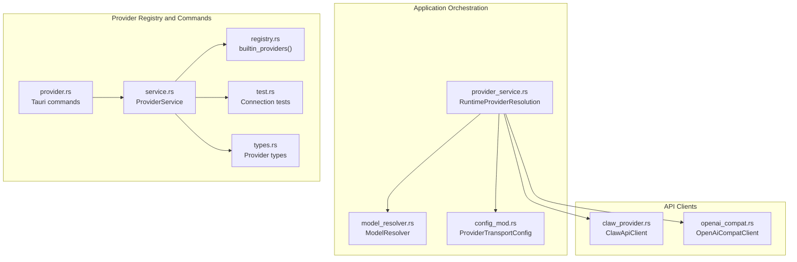
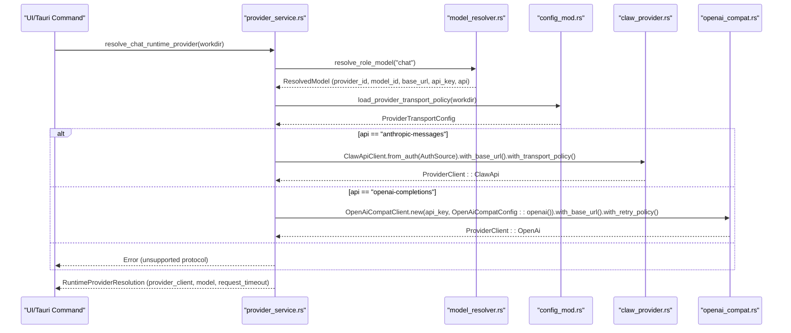
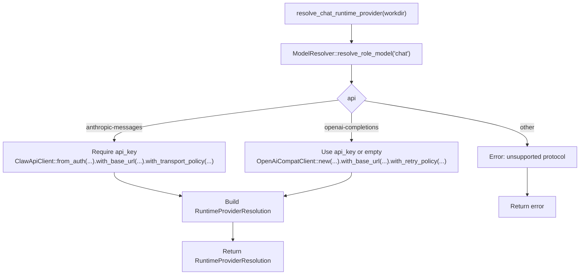
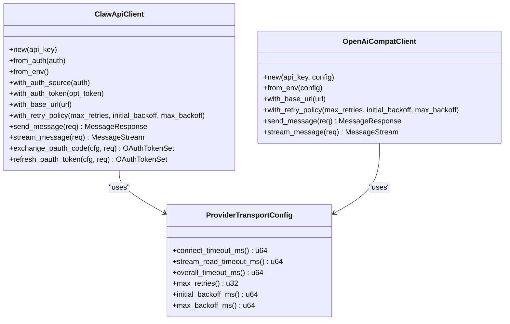
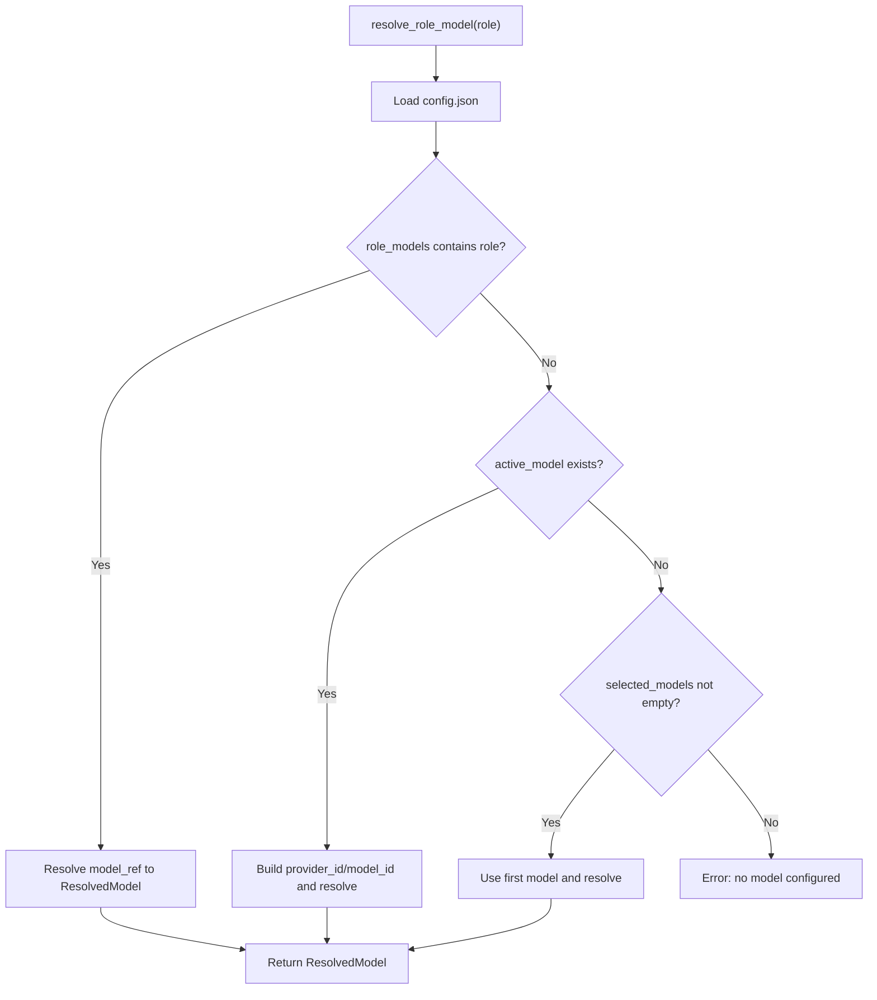
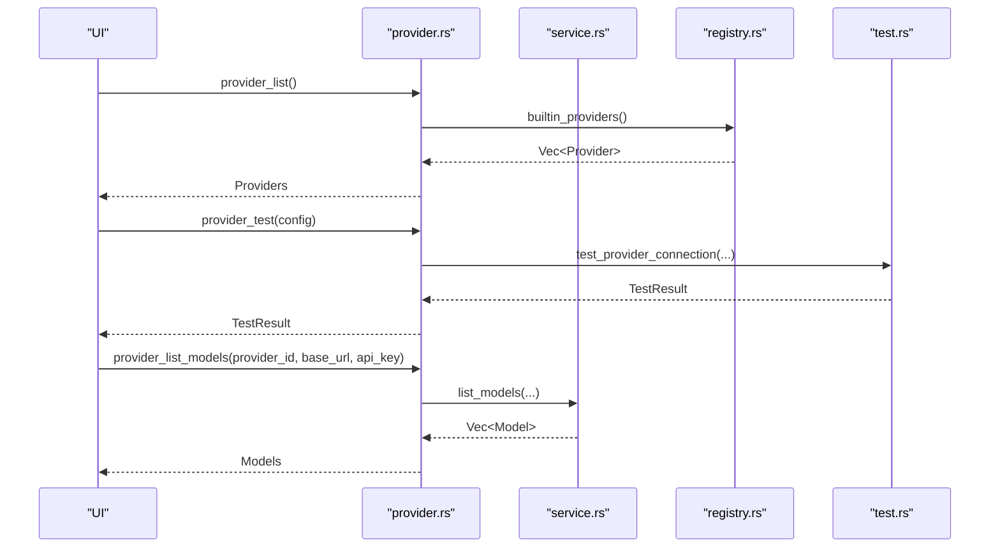
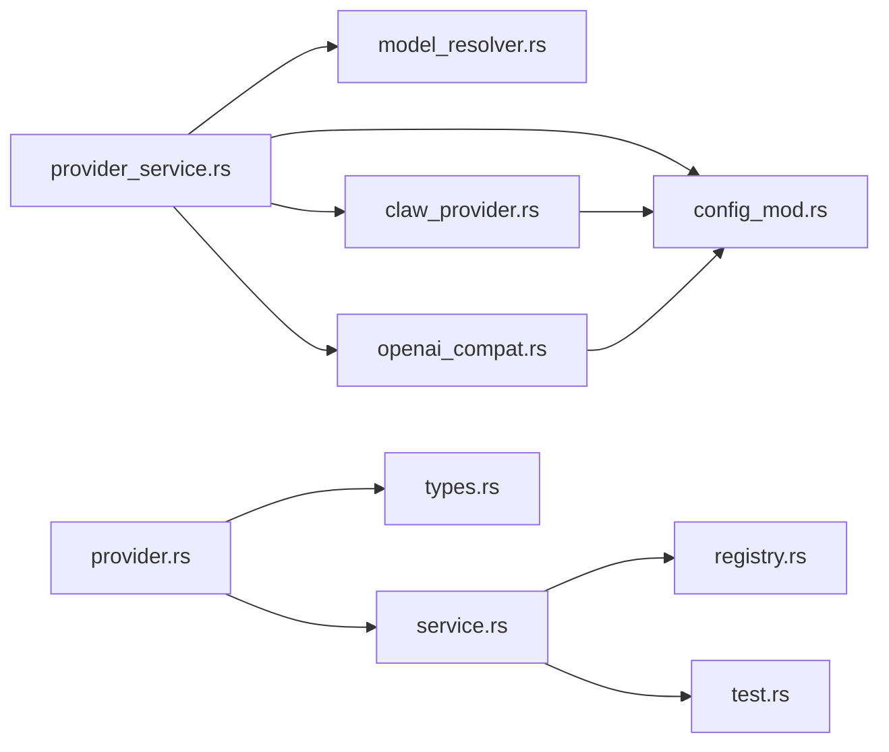

# Provider Service

<cite>
**Referenced Files in This Document**
- [provider_service.rs](file://src-tauri/src/modules/application/provider_service.rs)
- [provider.rs](file://src-tauri/src/commands/provider.rs)
- [claw_provider.rs](file://rust/crates/api/src/providers/claw_provider.rs)
- [openai_compat.rs](file://src-tauri/src/modules/api/providers/openai_compat.rs)
- [model_resolver.rs](file://src-tauri/src/modules/config/model_resolver.rs)
- [types.rs](file://src-tauri/src/modules/provider/types.rs)
- [service.rs](file://src-tauri/src/modules/provider/service.rs)
- [registry.rs](file://src-tauri/src/modules/provider/registry.rs)
- [test.rs](file://src-tauri/src/modules/provider/test.rs)
- [mod.rs](file://src-tauri/src/modules/api/mod.rs)
- [config_mod.rs](file://src-tauri/src/modules/runtime/config/mod.rs)
</cite>

## Table of Contents
1. [Introduction](#introduction)
2. [Project Structure](#project-structure)
3. [Core Components](#core-components)
4. [Architecture Overview](#architecture-overview)
5. [Detailed Component Analysis](#detailed-component-analysis)
6. [Dependency Analysis](#dependency-analysis)
7. [Performance Considerations](#performance-considerations)
8. [Troubleshooting Guide](#troubleshooting-guide)
9. [Conclusion](#conclusion)

## Introduction
This document explains the provider service module responsible for provider resolution, runtime client construction, and transport policy loading. It covers how the system selects a provider and model for chat roles, constructs appropriate clients, applies transport policies, and integrates with external APIs. It also documents configuration patterns, model resolution, and client initialization approaches.

## Project Structure
The provider service spans several modules:
- Application orchestration and runtime resolution
- Provider client implementations for Anthropic and OpenAI-compatible APIs
- Configuration-driven model resolution and provider registry
- Tauri commands for provider configuration and testing
- Transport policy loading from runtime configuration

**Diagram sources**
- [provider_service.rs:1-146](file://src-tauri/src/modules/application/provider_service.rs#L1-L146)
- [model_resolver.rs:1-377](file://src-tauri/src/modules/config/model_resolver.rs#L1-L377)
- [config_mod.rs:549-592](file://src-tauri/src/modules/runtime/config/mod.rs#L549-L592)
- [claw_provider.rs:112-346](file://rust/crates/api/src/providers/claw_provider.rs#L112-L346)
- [openai_compat.rs:68-231](file://src-tauri/src/modules/api/providers/openai_compat.rs#L68-L231)
- [registry.rs:18-342](file://src-tauri/src/modules/provider/registry.rs#L18-L342)
- [service.rs:19-323](file://src-tauri/src/modules/provider/service.rs#L19-L323)
- [provider.rs:14-172](file://src-tauri/src/commands/provider.rs#L14-L172)
- [test.rs:37-92](file://src-tauri/src/modules/provider/test.rs#L37-L92)
- [types.rs:115-144](file://src-tauri/src/modules/provider/types.rs#L115-L144)

**Section sources**
- [provider_service.rs:1-146](file://src-tauri/src/modules/application/provider_service.rs#L1-L146)
- [provider.rs:14-172](file://src-tauri/src/commands/provider.rs#L14-L172)
- [registry.rs:18-342](file://src-tauri/src/modules/provider/registry.rs#L18-L342)
- [service.rs:19-323](file://src-tauri/src/modules/provider/service.rs#L19-L323)
- [test.rs:37-92](file://src-tauri/src/modules/provider/test.rs#L37-L92)
- [types.rs:115-144](file://src-tauri/src/modules/provider/types.rs#L115-L144)
- [config_mod.rs:549-592](file://src-tauri/src/modules/runtime/config/mod.rs#L549-L592)

## Core Components
- RuntimeProviderResolution: Typed triple containing the provider client, resolved model id, and per-request timeout derived from transport policy.
- Provider transport policy: Loaded from runtime configuration and applied to client construction and retries.
- ModelResolver: Resolves role-based model selection to a concrete provider and model with base_url, api_key, and protocol.
- Provider clients: Provider-specific implementations for Anthropic (Claw) and OpenAI-compatible APIs.
- Tauri commands: UI-driven provider listing, configuration, model listing, selection, and testing.
- Provider registry and service: Built-in provider definitions, model discovery, and configuration persistence.

**Section sources**
- [provider_service.rs:37-125](file://src-tauri/src/modules/application/provider_service.rs#L37-L125)
- [config_mod.rs:549-592](file://src-tauri/src/modules/runtime/config/mod.rs#L549-L592)
- [model_resolver.rs:31-202](file://src-tauri/src/modules/config/model_resolver.rs#L31-L202)
- [claw_provider.rs:112-346](file://rust/crates/api/src/providers/claw_provider.rs#L112-L346)
- [openai_compat.rs:68-231](file://src-tauri/src/modules/api/providers/openai_compat.rs#L68-L231)
- [provider.rs:14-172](file://src-tauri/src/commands/provider.rs#L14-L172)
- [registry.rs:18-342](file://src-tauri/src/modules/provider/registry.rs#L18-L342)
- [service.rs:19-323](file://src-tauri/src/modules/provider/service.rs#L19-L323)

## Architecture Overview
The provider service orchestrates resolution and client construction:
- ModelResolver resolves the active model for a role (e.g., chat) to a concrete provider and model.
- Transport policy is loaded from runtime configuration and applied to client retry/backoff and timeouts.
- Provider-specific clients are constructed based on the resolved protocol (e.g., anthropic-messages, openai-completions).
- The resulting RuntimeProviderResolution is consumed by the conversation runtime.

**Diagram sources**
- [provider_service.rs:81-125](file://src-tauri/src/modules/application/provider_service.rs#L81-L125)
- [model_resolver.rs:180-202](file://src-tauri/src/modules/config/model_resolver.rs#L180-L202)
- [config_mod.rs:549-592](file://src-tauri/src/modules/runtime/config/mod.rs#L549-L592)
- [claw_provider.rs:135-200](file://rust/crates/api/src/providers/claw_provider.rs#L135-L200)
- [openai_compat.rs:78-118](file://src-tauri/src/modules/api/providers/openai_compat.rs#L78-L118)

## Detailed Component Analysis

### RuntimeProviderResolution and Transport Policy Loading
- RuntimeProviderResolution encapsulates the runtime triple: provider_client, model id, and request_timeout.
- load_provider_transport_policy reads runtime configuration and falls back to defaults when loading fails, preserving legacy behavior.

**Diagram sources**
- [provider_service.rs:54-66](file://src-tauri/src/modules/application/provider_service.rs#L54-L66)
- [config_mod.rs:549-592](file://src-tauri/src/modules/runtime/config/mod.rs#L549-L592)

**Section sources**
- [provider_service.rs:37-66](file://src-tauri/src/modules/application/provider_service.rs#L37-L66)
- [config_mod.rs:549-592](file://src-tauri/src/modules/runtime/config/mod.rs#L549-L592)

### Provider Selection and Client Construction
- resolve_chat_runtime_provider performs role-based resolution, loads transport policy, and constructs the appropriate client:
  - For anthropic-messages: requires a non-empty API key; builds a ClawApiClient with base_url and transport policy.
  - For openai-completions: tolerates empty API key (common for local providers); builds an OpenAiCompatClient with base_url and retry policy.
  - Unsupported protocols return a user-facing error.

**Diagram sources**
- [provider_service.rs:81-125](file://src-tauri/src/modules/application/provider_service.rs#L81-L125)
- [model_resolver.rs:180-202](file://src-tauri/src/modules/config/model_resolver.rs#L180-L202)
- [claw_provider.rs:135-200](file://rust/crates/api/src/providers/claw_provider.rs#L135-L200)
- [openai_compat.rs:78-118](file://src-tauri/src/modules/api/providers/openai_compat.rs#L78-L118)

**Section sources**
- [provider_service.rs:81-125](file://src-tauri/src/modules/application/provider_service.rs#L81-L125)
- [model_resolver.rs:180-202](file://src-tauri/src/modules/config/model_resolver.rs#L180-L202)

### Provider Client Implementations
- ClawApiClient (Anthropic):
  - Supports API key and bearer token auth, OAuth token exchange/refresh, SSE streaming, and exponential backoff retry.
  - Applies transport policy via with_transport_policy and backoff helpers.
- OpenAiCompatClient (OpenAI-compatible):
  - Supports API key auth, SSE streaming, and exponential backoff retry.
  - Normalizes responses and handles tool calls and usage.

**Diagram sources**
- [claw_provider.rs:112-346](file://rust/crates/api/src/providers/claw_provider.rs#L112-L346)
- [openai_compat.rs:68-231](file://src-tauri/src/modules/api/providers/openai_compat.rs#L68-L231)
- [config_mod.rs:556-592](file://src-tauri/src/modules/runtime/config/mod.rs#L556-L592)

**Section sources**
- [claw_provider.rs:112-346](file://rust/crates/api/src/providers/claw_provider.rs#L112-L346)
- [openai_compat.rs:68-231](file://src-tauri/src/modules/api/providers/openai_compat.rs#L68-L231)
- [config_mod.rs:556-592](file://src-tauri/src/modules/runtime/config/mod.rs#L556-L592)

### Model Resolution and Provider Registry
- ModelResolver:
  - Loads models.json and config.json from ~/.if2ai/.
  - resolve_role_model follows a fallback chain: explicit role assignment, active_model, first selected_model.
  - Provides listing of available models grouped by provider and manages role-based assignments.
- Provider registry:
  - builtin_providers returns 16 built-in providers categorized as Local, International, and Domestic.
  - Includes sub-choices for providers with multiple endpoints or auth variants.

**Diagram sources**
- [model_resolver.rs:180-202](file://src-tauri/src/modules/config/model_resolver.rs#L180-L202)
- [model_resolver.rs:75-171](file://src-tauri/src/modules/config/model_resolver.rs#L75-L171)

**Section sources**
- [model_resolver.rs:31-202](file://src-tauri/src/modules/config/model_resolver.rs#L31-L202)
- [registry.rs:18-342](file://src-tauri/src/modules/provider/registry.rs#L18-L342)

### Tauri Commands and Provider Management
- Commands support:
  - Listing providers and models, configuring providers, selecting models, and testing connectivity.
  - Role-based model configuration and retrieval.
- ProviderService:
  - Implements model listing across providers (Ollama, Anthropic, OpenAI-compatible).
  - Persists provider and model selections via ConfigService.

**Diagram sources**
- [provider.rs:14-172](file://src-tauri/src/commands/provider.rs#L14-L172)
- [service.rs:19-172](file://src-tauri/src/modules/provider/service.rs#L19-L172)
- [registry.rs:18-342](file://src-tauri/src/modules/provider/registry.rs#L18-L342)
- [test.rs:37-92](file://src-tauri/src/modules/provider/test.rs#L37-L92)

**Section sources**
- [provider.rs:14-172](file://src-tauri/src/commands/provider.rs#L14-L172)
- [service.rs:19-172](file://src-tauri/src/modules/provider/service.rs#L19-L172)
- [test.rs:37-92](file://src-tauri/src/modules/provider/test.rs#L37-L92)

## Dependency Analysis
- provider_service.rs depends on:
  - ModelResolver for role-based model resolution
  - ConfigLoader for transport policy
  - Provider clients for runtime construction
- Provider clients depend on:
  - ProviderTransportConfig for retry/backoff and timeouts
  - External APIs via HTTP/SSE
- Tauri commands depend on:
  - ProviderService for listing and configuration
  - Provider registry for UI metadata
  - Provider test utilities for connectivity checks

**Diagram sources**
- [provider_service.rs:22-29](file://src-tauri/src/modules/application/provider_service.rs#L22-L29)
- [model_resolver.rs:24-29](file://src-tauri/src/modules/config/model_resolver.rs#L24-L29)
- [config_mod.rs:549-592](file://src-tauri/src/modules/runtime/config/mod.rs#L549-L592)
- [claw_provider.rs:112-346](file://rust/crates/api/src/providers/claw_provider.rs#L112-L346)
- [openai_compat.rs:68-231](file://src-tauri/src/modules/api/providers/openai_compat.rs#L68-L231)
- [provider.rs:8-11](file://src-tauri/src/commands/provider.rs#L8-L11)
- [service.rs:12-17](file://src-tauri/src/modules/provider/service.rs#L12-L17)
- [registry.rs:11](file://src-tauri/src/modules/provider/registry.rs#L11)
- [test.rs:20-21](file://src-tauri/src/modules/provider/test.rs#L20-L21)
- [types.rs:12](file://src-tauri/src/modules/provider/types.rs#L12)

**Section sources**
- [provider_service.rs:22-29](file://src-tauri/src/modules/application/provider_service.rs#L22-L29)
- [provider.rs:8-11](file://src-tauri/src/commands/provider.rs#L8-L11)
- [service.rs:12-17](file://src-tauri/src/modules/provider/service.rs#L12-L17)
- [registry.rs:11](file://src-tauri/src/modules/provider/registry.rs#L11)
- [test.rs:20-21](file://src-tauri/src/modules/provider/test.rs#L20-L21)
- [types.rs:12](file://src-tauri/src/modules/provider/types.rs#L12)

## Performance Considerations
- Retry and backoff:
  - Both clients implement exponential backoff with configurable max_retries and bounds.
  - Tune ProviderTransportConfig to balance resilience and latency.
- Streaming:
  - SSE streaming clients parse frames incrementally; ensure adequate buffering and event handling.
- Timeouts:
  - Use overall_timeout_ms from ProviderTransportConfig to bound request lifetimes.
- Model listing:
  - ProviderService delegates to provider-specific endpoints; consider caching and rate limiting for frequent listing operations.

[No sources needed since this section provides general guidance]

## Troubleshooting Guide
Common issues and resolutions:
- Missing API key for Anthropic:
  - Error indicates missing API key; configure provider settings and retest.
- Invalid API key for OpenAI-compatible providers:
  - Authentication errors are surfaced with specific error codes.
- Network/connectivity problems:
  - Timeouts and network errors are differentiated; verify base_url and connectivity.
- Model not available:
  - Ensure the model is configured and available on the selected provider.
- Transport policy loading failures:
  - When runtime config cannot be loaded, defaults are used; verify config file integrity.

**Section sources**
- [provider_service.rs:54-66](file://src-tauri/src/modules/application/provider_service.rs#L54-L66)
- [test.rs:94-256](file://src-tauri/src/modules/provider/test.rs#L94-L256)
- [service.rs:174-193](file://src-tauri/src/modules/provider/service.rs#L174-L193)

## Conclusion
The provider service module provides a robust, configuration-driven mechanism for provider resolution, runtime client construction, and transport policy enforcement. By separating concerns—model resolution, transport policy, and provider clients—the system remains extensible and maintainable while preserving backward compatibility during migration.