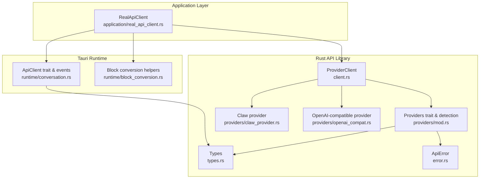
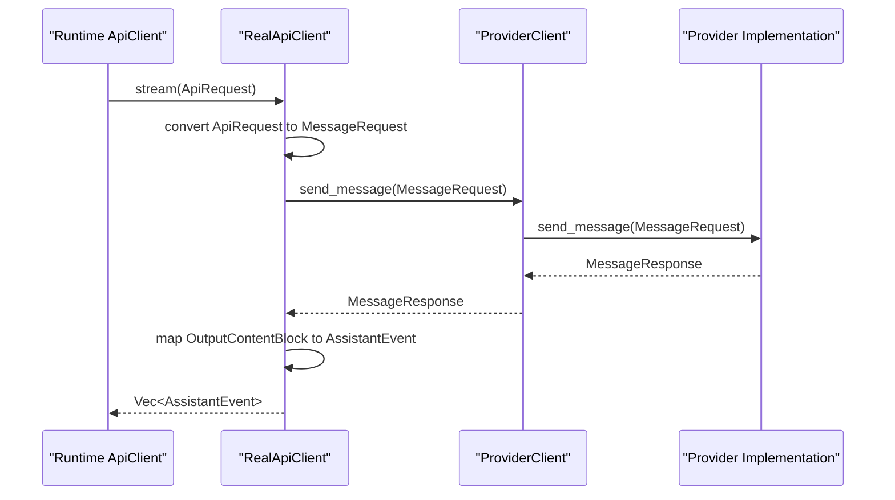
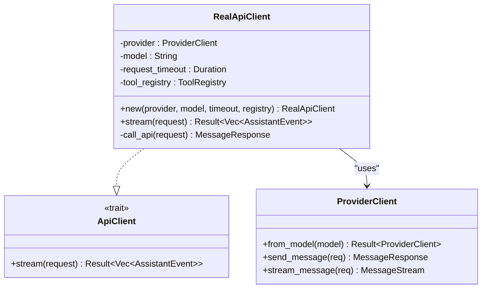
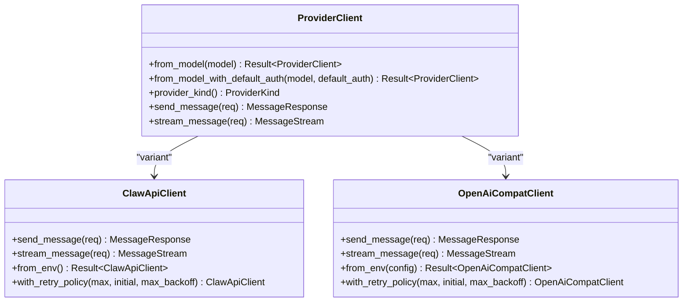
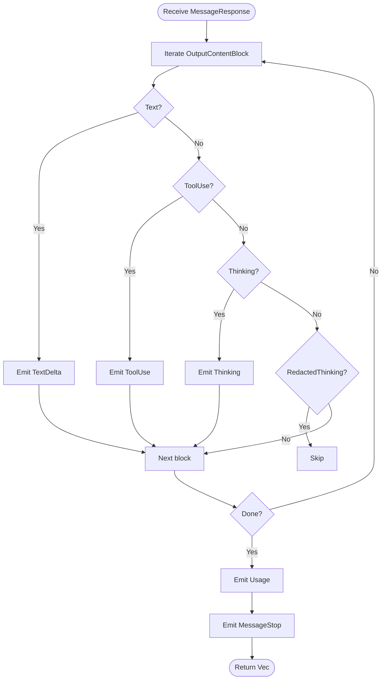
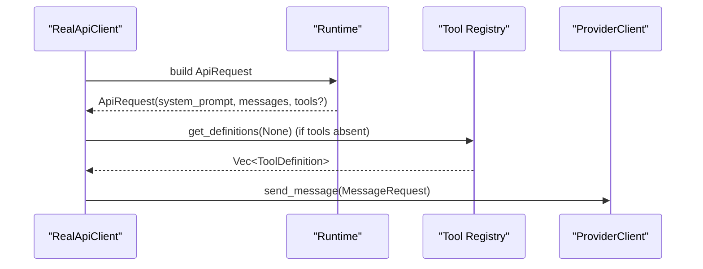
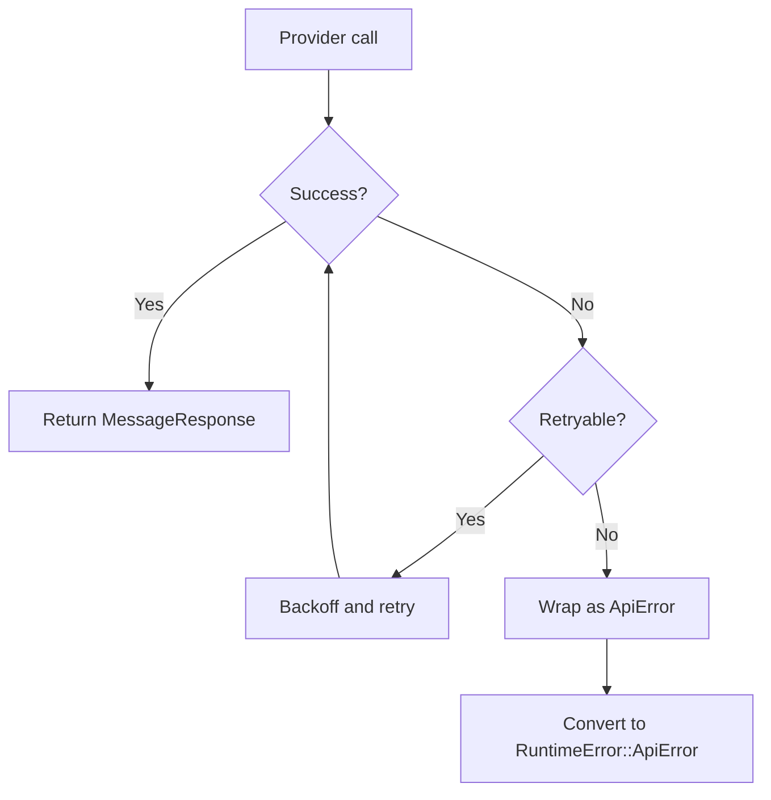
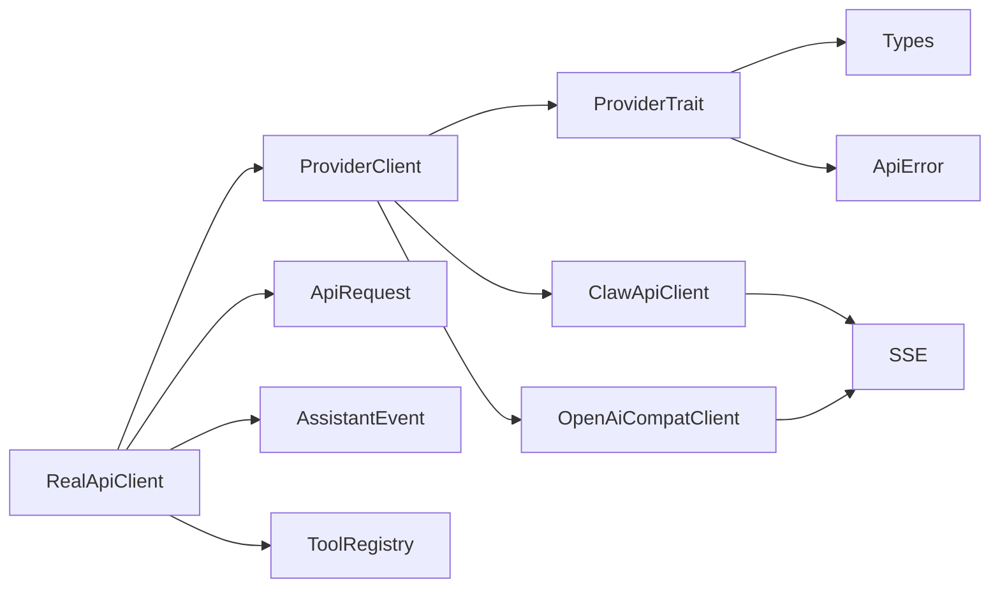

# Real API Client

<cite>
**Referenced Files in This Document**
- [real_api_client.rs](file://src-tauri/src/modules/application/real_api_client.rs)
- [client.rs](file://rust/crates/api/src/client.rs)
- [lib.rs](file://rust/crates/api/src/lib.rs)
- [types.rs](file://rust/crates/api/src/types.rs)
- [error.rs](file://rust/crates/api/src/error.rs)
- [mod.rs](file://rust/crates/api/src/providers/mod.rs)
- [claw_provider.rs](file://rust/crates/api/src/providers/claw_provider.rs)
- [openai_compat.rs](file://rust/crates/api/src/providers/openai_compat.rs)
- [conversation.rs](file://src-tauri/src/modules/runtime/conversation.rs)
- [block_conversion.rs](file://src-tauri/src/modules/runtime/block_conversion.rs)
</cite>

## Table of Contents
1. [Introduction](#introduction)
2. [Project Structure](#project-structure)
3. [Core Components](#core-components)
4. [Architecture Overview](#architecture-overview)
5. [Detailed Component Analysis](#detailed-component-analysis)
6. [Dependency Analysis](#dependency-analysis)
7. [Performance Considerations](#performance-considerations)
8. [Troubleshooting Guide](#troubleshooting-guide)
9. [Conclusion](#conclusion)

## Introduction
This document explains the Real API Client module that integrates the Rust API client library with the Tauri application runtime. It covers how the RealApiClient constructs and executes requests, how it converts runtime data structures to provider-specific formats, and how it processes responses into runtime events. It also documents error handling strategies, provider integration patterns, and practical examples of request formatting and response parsing.

## Project Structure
The Real API Client sits at the intersection of:
- The Rust API client library (providers, types, errors)
- The Tauri runtime (ApiClient trait, conversation loop, block conversion)
- The application layer (RealApiClient implementation)

**Diagram sources**
- [real_api_client.rs:18-42](file://src-tauri/src/modules/application/real_api_client.rs#L18-L42)
- [client.rs:21-84](file://rust/crates/api/src/client.rs#L21-L84)
- [types.rs:4-25](file://rust/crates/api/src/types.rs#L4-L25)
- [error.rs:5-33](file://rust/crates/api/src/error.rs#L5-L33)
- [mod.rs:12-31](file://rust/crates/api/src/providers/mod.rs#L12-L31)
- [claw_provider.rs:112-120](file://rust/crates/api/src/providers/claw_provider.rs#L112-L120)
- [openai_compat.rs:66-74](file://rust/crates/api/src/providers/openai_compat.rs#L66-L74)
- [conversation.rs:60-83](file://src-tauri/src/modules/runtime/conversation.rs#L60-L83)
- [block_conversion.rs:65-89](file://src-tauri/src/modules/runtime/block_conversion.rs#L65-L89)

**Section sources**
- [real_api_client.rs:1-171](file://src-tauri/src/modules/application/real_api_client.rs#L1-L171)
- [client.rs:1-142](file://rust/crates/api/src/client.rs#L1-L142)
- [types.rs:1-224](file://rust/crates/api/src/types.rs#L1-L224)
- [error.rs:1-136](file://rust/crates/api/src/error.rs#L1-L136)
- [mod.rs:1-240](file://rust/crates/api/src/providers/mod.rs#L1-L240)
- [claw_provider.rs:1-800](file://rust/crates/api/src/providers/claw_provider.rs#L1-L800)
- [openai_compat.rs:1-1051](file://rust/crates/api/src/providers/openai_compat.rs#L1-L1051)
- [conversation.rs:1-800](file://src-tauri/src/modules/runtime/conversation.rs#L1-L800)
- [block_conversion.rs:1-90](file://src-tauri/src/modules/runtime/block_conversion.rs#L1-L90)

## Core Components
- RealApiClient: Implements the runtime ApiClient trait and orchestrates a single request to the selected provider. It converts runtime messages and tool definitions into provider MessageRequest, sends it via ProviderClient, and translates the response into AssistantEvent items for the runtime.
- ProviderClient: A discriminated union over supported providers (Claw, OpenAI-compatible) that selects the appropriate client based on model alias and environment configuration.
- Types: Shared data structures for requests, responses, content blocks, tool definitions, and streaming events.
- Providers: Trait abstraction and provider implementations for Claw and OpenAI-compatible APIs, including retry/backoff policies and SSE parsing.
- Runtime integration: ApiClient trait, AssistantEvent enumeration, and runtime conversation loop that consumes events.

**Section sources**
- [real_api_client.rs:18-97](file://src-tauri/src/modules/application/real_api_client.rs#L18-L97)
- [client.rs:21-84](file://rust/crates/api/src/client.rs#L21-L84)
- [types.rs:4-224](file://rust/crates/api/src/types.rs#L4-L224)
- [mod.rs:12-31](file://rust/crates/api/src/providers/mod.rs#L12-L31)
- [conversation.rs:60-83](file://src-tauri/src/modules/runtime/conversation.rs#L60-L83)

## Architecture Overview
The Real API Client follows a layered architecture:
- Application layer constructs a RealApiClient with a ProviderClient, model string, timeout, and tool registry.
- The ApiClient::stream method builds a MessageRequest from ApiRequest, invokes ProviderClient.send_message, and converts the MessageResponse into AssistantEvent items.
- ProviderClient routes to the correct provider implementation (Claw or OpenAI-compatible) based on model detection and environment configuration.
- Providers handle HTTP requests, retries, backoff, and SSE parsing for streaming.

**Diagram sources**
- [real_api_client.rs:44-96](file://src-tauri/src/modules/application/real_api_client.rs#L44-L96)
- [real_api_client.rs:100-169](file://src-tauri/src/modules/application/real_api_client.rs#L100-L169)
- [client.rs:61-83](file://rust/crates/api/src/client.rs#L61-L83)
- [claw_provider.rs:206-224](file://rust/crates/api/src/providers/claw_provider.rs#L206-L224)
- [openai_compat.rs:118-134](file://rust/crates/api/src/providers/openai_compat.rs#L118-L134)

## Detailed Component Analysis

### RealApiClient
RealApiClient implements the runtime ApiClient trait and encapsulates:
- Construction: new(...) takes a ProviderClient, model string, request timeout, and tool registry.
- Streaming: stream(...) converts ApiRequest to MessageRequest, calls ProviderClient.send_message, and translates MessageResponse into AssistantEvent items. It also enforces a timeout using tokio::time::timeout.
- Request building: Converts runtime messages to provider InputMessage/InputContentBlock, normalizes roles, and optionally merges tool definitions from the request or the tool registry.
- Response processing: Iterates over OutputContentBlock variants and emits TextDelta, ToolUse, Thinking, Usage, and MessageStop events. RedactedThinking blocks are ignored.

**Diagram sources**
- [real_api_client.rs:18-97](file://src-tauri/src/modules/application/real_api_client.rs#L18-L97)
- [conversation.rs:81-83](file://src-tauri/src/modules/runtime/conversation.rs#L81-L83)
- [client.rs:21-84](file://rust/crates/api/src/client.rs#L21-L84)

**Section sources**
- [real_api_client.rs:18-171](file://src-tauri/src/modules/application/real_api_client.rs#L18-L171)
- [conversation.rs:60-83](file://src-tauri/src/modules/runtime/conversation.rs#L60-L83)

### ProviderClient and Provider Implementations
ProviderClient selects the appropriate provider based on model alias resolution and environment configuration:
- ProviderClient::from_model_with_default_auth resolves aliases (e.g., "opus" → "claude-opus-4-6") and detects provider kind (Claw, XAI, OpenAI).
- ProviderClient::send_message delegates to the underlying provider’s send_message.
- ProviderClient::stream_message delegates to the underlying provider’s stream_message and wraps the stream in a MessageStream enum.

Provider implementations:
- ClawApiClient: Sends JSON payloads to the Anthropic-compatible endpoint, applies authentication, parses SSE frames, and normalizes events. Includes retry/backoff logic and request ID extraction from headers.
- OpenAiCompatClient: Translates requests/responses to OpenAI-compatible shapes, handles SSE parsing, and normalizes tool calls and text deltas.

**Diagram sources**
- [client.rs:21-84](file://rust/crates/api/src/client.rs#L21-L84)
- [claw_provider.rs:112-200](file://rust/crates/api/src/providers/claw_provider.rs#L112-L200)
- [openai_compat.rs:66-117](file://rust/crates/api/src/providers/openai_compat.rs#L66-L117)

**Section sources**
- [client.rs:28-84](file://rust/crates/api/src/client.rs#L28-L84)
- [mod.rs:143-202](file://rust/crates/api/src/providers/mod.rs#L143-L202)
- [claw_provider.rs:206-346](file://rust/crates/api/src/providers/claw_provider.rs#L206-L346)
- [openai_compat.rs:118-211](file://rust/crates/api/src/providers/openai_compat.rs#L118-L211)

### Types and Event Mapping
MessageRequest and MessageResponse define the wire protocol. OutputContentBlock variants are mapped to AssistantEvent items:
- Text → TextDelta
- ToolUse → ToolUse
- Thinking → Thinking
- Usage → Usage
- Stop → MessageStop

**Diagram sources**
- [real_api_client.rs:63-95](file://src-tauri/src/modules/application/real_api_client.rs#L63-L95)
- [types.rs:127-147](file://rust/crates/api/src/types.rs#L127-L147)
- [conversation.rs:68-79](file://src-tauri/src/modules/runtime/conversation.rs#L68-L79)

**Section sources**
- [types.rs:4-224](file://rust/crates/api/src/types.rs#L4-L224)
- [real_api_client.rs:63-95](file://src-tauri/src/modules/application/real_api_client.rs#L63-L95)
- [conversation.rs:68-79](file://src-tauri/src/modules/runtime/conversation.rs#L68-L79)

### Request Formatting and Tool Definitions
RealApiClient builds MessageRequest from ApiRequest:
- Messages: Each runtime message is converted to InputMessage with role normalization and content blocks translated via runtime_block_to_input_block.
- System prompt: Flattened from ApiRequest.system_prompt when present.
- Tools: Prefers request.tools if provided; otherwise, fetches definitions from the tool registry and filters to non-empty sets.

**Diagram sources**
- [real_api_client.rs:106-166](file://src-tauri/src/modules/application/real_api_client.rs#L106-L166)
- [block_conversion.rs:65-89](file://src-tauri/src/modules/runtime/block_conversion.rs#L65-L89)
- [conversation.rs:60-66](file://src-tauri/src/modules/runtime/conversation.rs#L60-L66)

**Section sources**
- [real_api_client.rs:106-166](file://src-tauri/src/modules/application/real_api_client.rs#L106-L166)
- [block_conversion.rs:65-89](file://src-tauri/src/modules/runtime/block_conversion.rs#L65-L89)
- [conversation.rs:60-66](file://src-tauri/src/modules/runtime/conversation.rs#L60-L66)

### Error Handling Strategies
- ApiError variants cover missing credentials, expired OAuth tokens, HTTP errors, IO errors, JSON parsing errors, API errors with retryable flags, retries exhaustion, invalid SSE frames, and backoff overflow.
- Provider implementations implement retry/backoff for retryable conditions and extract request IDs from response headers.
- RealApiClient surfaces provider errors as RuntimeError::ApiError and adds a timeout wrapper around the provider call.

**Diagram sources**
- [error.rs:5-60](file://rust/crates/api/src/error.rs#L5-L60)
- [claw_provider.rs:282-316](file://rust/crates/api/src/providers/claw_provider.rs#L282-L316)
- [openai_compat.rs:153-182](file://rust/crates/api/src/providers/openai_compat.rs#L153-L182)
- [real_api_client.rs:48-58](file://src-tauri/src/modules/application/real_api_client.rs#L48-L58)

**Section sources**
- [error.rs:5-136](file://rust/crates/api/src/error.rs#L5-L136)
- [claw_provider.rs:282-346](file://rust/crates/api/src/providers/claw_provider.rs#L282-L346)
- [openai_compat.rs:153-211](file://rust/crates/api/src/providers/openai_compat.rs#L153-L211)
- [real_api_client.rs:48-58](file://src-tauri/src/modules/application/real_api_client.rs#L48-L58)

## Dependency Analysis
- RealApiClient depends on:
  - ProviderClient for provider selection and messaging
  - Runtime types (ApiRequest, AssistantEvent) and block conversion helpers
  - Tool registry for dynamic tool definitions
- ProviderClient depends on:
  - Provider trait and provider implementations (Claw, OpenAI-compatible)
  - Type definitions and error types
- Providers depend on:
  - HTTP client (reqwest)
  - SSE parsing utilities
  - Environment variables and saved OAuth tokens

**Diagram sources**
- [real_api_client.rs:12-26](file://src-tauri/src/modules/application/real_api_client.rs#L12-L26)
- [client.rs:21-84](file://rust/crates/api/src/client.rs#L21-L84)
- [mod.rs:12-24](file://rust/crates/api/src/providers/mod.rs#L12-L24)
- [types.rs:4-25](file://rust/crates/api/src/types.rs#L4-L25)
- [error.rs:5-33](file://rust/crates/api/src/error.rs#L5-L33)

**Section sources**
- [real_api_client.rs:12-26](file://src-tauri/src/modules/application/real_api_client.rs#L12-L26)
- [client.rs:21-84](file://rust/crates/api/src/client.rs#L21-L84)
- [mod.rs:12-24](file://rust/crates/api/src/providers/mod.rs#L12-L24)

## Performance Considerations
- Timeout enforcement: RealApiClient uses tokio::time::timeout to bound request duration, preventing long-running calls from blocking the runtime.
- Retry/backoff: Providers implement exponential backoff for retryable failures, reducing load on failing endpoints and improving resilience.
- Streaming vs non-streaming: ProviderClient.send_message forces stream=false for non-streaming calls; streaming is handled separately via stream_message.
- Tool result truncation: The runtime limits tool result sizes to preserve context budget and improve throughput.

[No sources needed since this section provides general guidance]

## Troubleshooting Guide
Common issues and resolutions:
- Missing credentials: Ensure environment variables are set for the selected provider (e.g., ANTHROPIC_API_KEY, ANTHROPIC_AUTH_TOKEN, XAI_API_KEY, OPENAI_API_KEY). ProviderClient.from_model_with_default_auth reports missing credentials.
- Expired OAuth token: Saved tokens may require refresh; the provider raises an error when refresh is unavailable.
- HTTP/IO/JSON errors: Inspect ApiError variants for detailed diagnostics.
- Retries exhausted: Review retryable status codes and backoff behavior; adjust provider retry policy if needed.
- SSE parsing errors: Invalid SSE frames trigger ApiError::InvalidSseFrame; verify provider compatibility and network stability.

**Section sources**
- [error.rs:5-136](file://rust/crates/api/src/error.rs#L5-L136)
- [client.rs:28-50](file://rust/crates/api/src/client.rs#L28-L50)
- [claw_provider.rs:348-441](file://rust/crates/api/src/providers/claw_provider.rs#L348-L441)
- [openai_compat.rs:153-182](file://rust/crates/api/src/providers/openai_compat.rs#L153-L182)

## Conclusion
The Real API Client provides a clean integration between the Tauri runtime and multiple LLM providers. It centralizes request formatting, provider selection, and response event translation, while delegating robust error handling and retry logic to the provider implementations. By leveraging shared types and traits, the system remains extensible and maintainable.