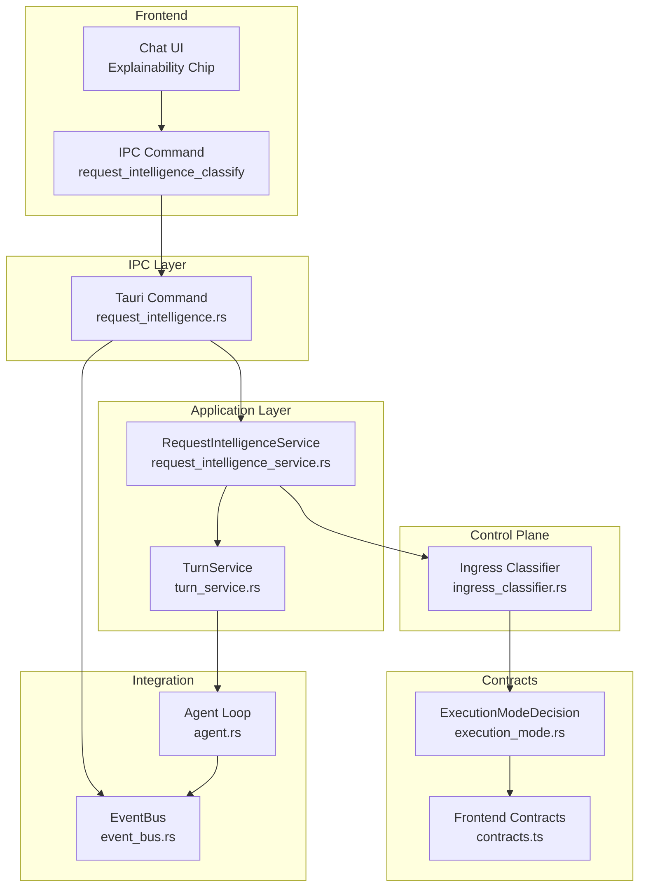
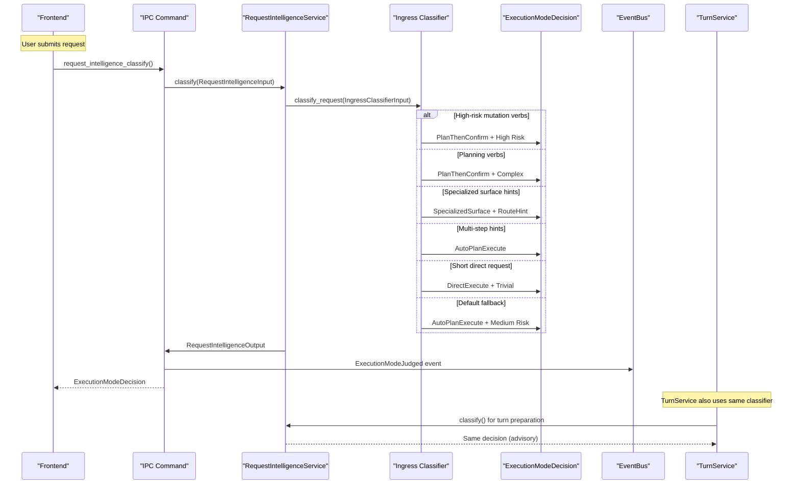
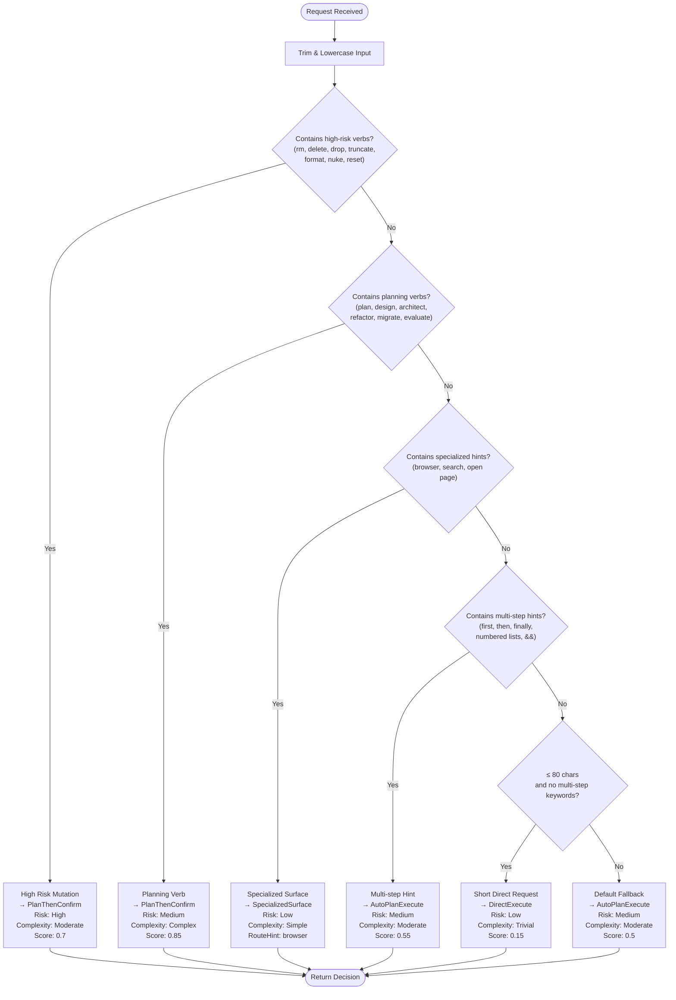
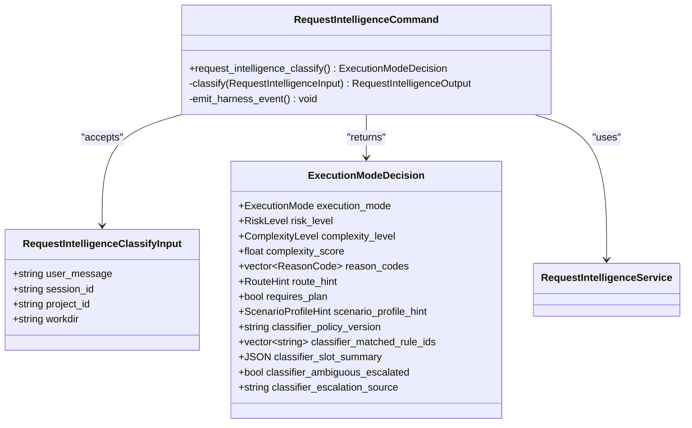
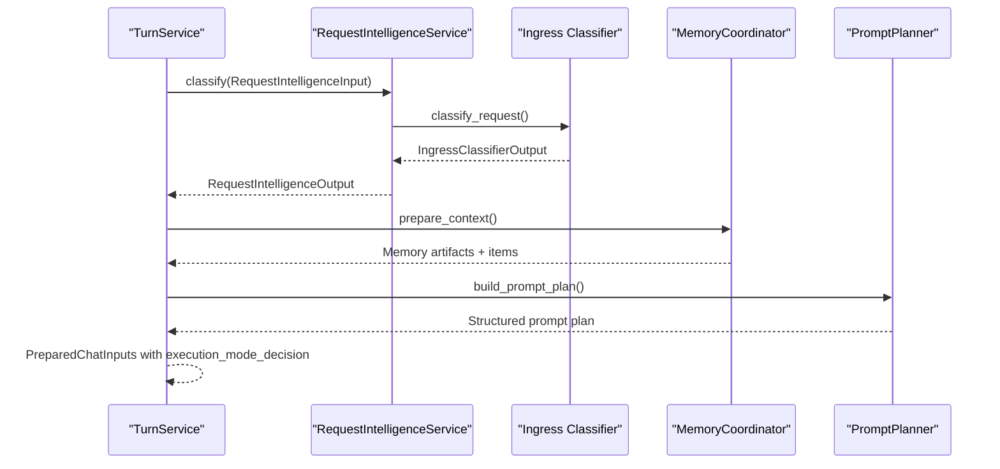
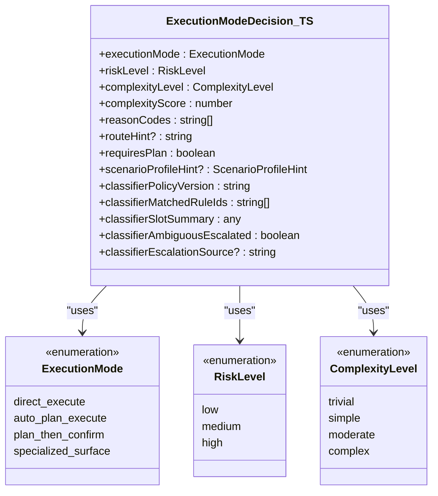
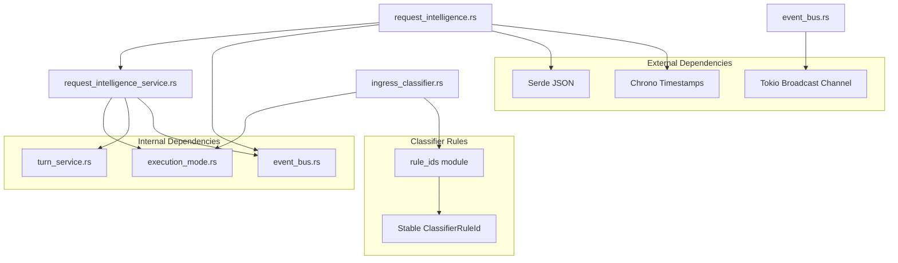
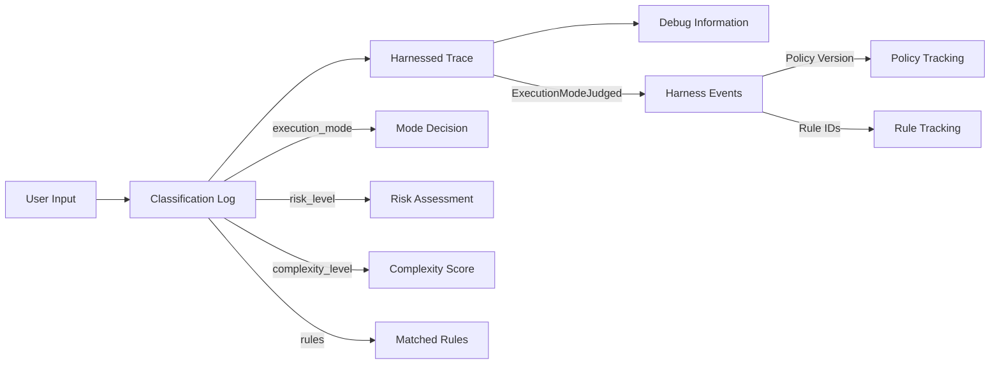

# Request Intelligence Service

<cite>
**Referenced Files in This Document**
- [request_intelligence.rs](file://src-tauri/src/commands/request_intelligence.rs)
- [request_intelligence_service.rs](file://src-tauri/src/modules/application/request_intelligence_service.rs)
- [ingress_classifier.rs](file://src-tauri/src/modules/control_plane/ingress_classifier.rs)
- [execution_mode.rs](file://src-tauri/src/modules/runtime/contracts/execution_mode.rs)
- [contracts.ts](file://src/transport/contracts.ts)
- [turn_service.rs](file://src-tauri/src/modules/application/turn_service.rs)
- [agent.rs](file://src-tauri/src/commands/agent.rs)
- [event_bus.rs](file://src-tauri/src/modules/harness/event_bus.rs)
- [request-intelligence-and-execution-mode-routing-design.md](file://docs/staff-remediation/request-intelligence-and-execution-mode-routing-design.md)
</cite>

## Table of Contents
1. [Introduction](#introduction)
2. [Project Structure](#project-structure)
3. [Core Components](#core-components)
4. [Architecture Overview](#architecture-overview)
5. [Detailed Component Analysis](#detailed-component-analysis)
6. [Dependency Analysis](#dependency-analysis)
7. [Performance Considerations](#performance-considerations)
8. [Troubleshooting Guide](#troubleshooting-guide)
9. [Conclusion](#conclusion)

## Introduction
The Request Intelligence Service module provides deterministic and heuristic classification of incoming requests to decide the appropriate execution mode for chat turns. It establishes a canonical contract for execution modes, risk levels, and complexity classifications, and integrates with the broader application intelligence system to guide routing decisions and enable explainability.

## Project Structure
The module spans several layers:
- IPC command layer exposes classification as a Tauri command for frontend consumption
- Application service layer provides a typed interface for request classification
- Control plane classifier implements deterministic heuristics
- Runtime contracts define the canonical decision structure
- Frontend contracts mirror the backend decision structure
- Integration with TurnService and agent loop enables explainability and governance

**Diagram sources**
- [request_intelligence.rs:1-90](file://src-tauri/src/commands/request_intelligence.rs#L1-L90)
- [request_intelligence_service.rs:1-80](file://src-tauri/src/modules/application/request_intelligence_service.rs#L1-L80)
- [ingress_classifier.rs:1-310](file://src-tauri/src/modules/control_plane/ingress_classifier.rs#L1-L310)
- [execution_mode.rs:1-253](file://src-tauri/src/modules/runtime/contracts/execution_mode.rs#L1-L253)
- [contracts.ts:156-218](file://src/transport/contracts.ts#L156-L218)
- [turn_service.rs:1-228](file://src-tauri/src/modules/application/turn_service.rs#L1-L228)
- [agent.rs:200-399](file://src-tauri/src/commands/agent.rs#L200-L399)
- [event_bus.rs:1-441](file://src-tauri/src/modules/harness/event_bus.rs#L1-L441)

**Section sources**
- [request-intelligence-and-execution-mode-routing-design.md:1-164](file://docs/staff-remediation/request-intelligence-and-execution-mode-routing-design.md#L1-L164)

## Core Components
The module consists of four primary components:

### RequestIntelligenceInput/Output Structures
The service defines typed input and output structures for request classification:

**RequestIntelligenceInput** provides the minimal context needed for classification:
- user_message: The raw user request text
- session_id: Optional session identifier for correlation
- project_id: Optional project context
- workdir: Optional working directory path

**RequestIntelligenceOutput** encapsulates the classification decision:
- decision: Complete ExecutionModeDecision containing mode, risk, complexity, and reasoning

### ExecutionModeDecision Contract
The canonical decision structure includes:
- execution_mode: One of four deterministic execution modes
- risk_level: Coarse risk assessment (Low/Medium/High)
- complexity_level: Task complexity classification
- complexity_score: Numeric score (0.0-1.0) for diagnostics
- reason_codes: Stable identifiers explaining the decision
- route_hint: Optional routing target for specialized surfaces
- requires_plan: Boolean indicating if plan confirmation is needed
- scenario_profile_hint: Advisory user-facing scenario classification
- classifier_metadata: Policy version, matched rules, and slot summaries

**Section sources**
- [request_intelligence_service.rs:29-61](file://src-tauri/src/modules/application/request_intelligence_service.rs#L29-L61)
- [execution_mode.rs:141-205](file://src-tauri/src/modules/runtime/contracts/execution_mode.rs#L141-L205)

## Architecture Overview
The request intelligence system follows a layered architecture with clear separation of concerns:

**Diagram sources**
- [request_intelligence.rs:61-89](file://src-tauri/src/commands/request_intelligence.rs#L61-L89)
- [request_intelligence_service.rs:50-61](file://src-tauri/src/modules/application/request_intelligence_service.rs#L50-L61)
- [ingress_classifier.rs:99-245](file://src-tauri/src/modules/control_plane/ingress_classifier.rs#L99-L245)
- [event_bus.rs:162-175](file://src-tauri/src/modules/harness/event_bus.rs#L162-L175)
- [turn_service.rs:159-164](file://src-tauri/src/modules/application/turn_service.rs#L159-L164)

## Detailed Component Analysis

### Ingress Classifier Implementation
The classifier implements a deterministic heuristic decision tree with stable rule identification:

**Diagram sources**
- [ingress_classifier.rs:99-212](file://src-tauri/src/modules/control_plane/ingress_classifier.rs#L99-L212)

#### Classification Patterns
The classifier uses several pattern detection mechanisms:

**High-risk Mutation Detection**: Identifies destructive operations with explicit risk assessment
**Planning Verb Detection**: Recognizes architectural and design tasks requiring careful planning
**Specialized Surface Hints**: Routes browser-based queries to appropriate specialized surfaces
**Multi-step Pattern Recognition**: Detects sequential operations requiring automated execution
**Short Request Optimization**: Handles simple single-step operations efficiently

**Section sources**
- [ingress_classifier.rs:108-212](file://src-tauri/src/modules/control_plane/ingress_classifier.rs#L108-L212)

### IPC Command Integration
The Tauri command layer provides frontend access to classification:

**Diagram sources**
- [request_intelligence.rs:40-89](file://src-tauri/src/commands/request_intelligence.rs#L40-L89)

**Section sources**
- [request_intelligence.rs:36-89](file://src-tauri/src/commands/request_intelligence.rs#L36-L89)

### Integration with TurnService
The classifier integrates seamlessly with the turn preparation pipeline:

**Diagram sources**
- [turn_service.rs:147-226](file://src-tauri/src/modules/application/turn_service.rs#L147-L226)
- [request_intelligence_service.rs:50-61](file://src-tauri/src/modules/application/request_intelligence_service.rs#L50-L61)

**Section sources**
- [turn_service.rs:155-164](file://src-tauri/src/modules/application/turn_service.rs#L155-L164)

### Frontend Integration
The frontend receives a TypeScript-compatible decision structure:

**Diagram sources**
- [contracts.ts:156-218](file://src/transport/contracts.ts#L156-L218)

**Section sources**
- [contracts.ts:156-218](file://src/transport/contracts.ts#L156-L218)

## Dependency Analysis
The request intelligence service maintains clean dependencies with clear separation between layers:

**Diagram sources**
- [request_intelligence_service.rs:24-28](file://src-tauri/src/modules/application/request_intelligence_service.rs#L24-L28)
- [ingress_classifier.rs:34-56](file://src-tauri/src/modules/control_plane/ingress_classifier.rs#L34-L56)
- [request_intelligence.rs:25-34](file://src-tauri/src/commands/request_intelligence.rs#L25-L34)
- [event_bus.rs:18-33](file://src-tauri/src/modules/harness/event_bus.rs#L18-L33)

**Section sources**
- [request_intelligence_service.rs:24-28](file://src-tauri/src/modules/application/request_intelligence_service.rs#L24-L28)
- [ingress_classifier.rs:34-56](file://src-tauri/src/modules/control_plane/ingress_classifier.rs#L34-L56)

## Performance Considerations
The classifier is designed for optimal performance:

- **Constant-time operations**: All pattern matching uses O(n) string operations with early termination
- **Minimal allocations**: Uses borrowed string references where possible
- **Cached rule identifiers**: Stable rule IDs prevent repeated string comparisons
- **Single-pass evaluation**: Decision tree evaluates conditions in priority order
- **Zero-copy JSON**: Slot summaries use serde_json::Value for efficient serialization

## Troubleshooting Guide

### Common Classification Issues
**Issue**: Requests classified incorrectly
- Verify input trimming and lowercase conversion
- Check for missing pattern variants in rule sets
- Validate session/project context availability

**Issue**: Performance degradation with large inputs
- Monitor character count thresholds (80-character limit)
- Consider input preprocessing for very long messages
- Check for excessive whitespace affecting classification

**Issue**: Frontend deserialization errors
- Ensure camelCase field names match TypeScript interface
- Verify enum values align with backend serialization
- Check for missing optional fields in wire protocol

### Debugging Classification Decisions
The system provides comprehensive logging and tracing:

**Section sources**
- [agent.rs:257-267](file://src-tauri/src/commands/agent.rs#L257-L267)
- [event_bus.rs:162-175](file://src-tauri/src/modules/harness/event_bus.rs#L162-L175)

## Conclusion
The Request Intelligence Service provides a robust, deterministic classification system that establishes canonical execution modes for chat requests. Its clean architecture separates concerns between IPC exposure, application service logic, and control plane classification, while maintaining strong contracts for explainability and governance. The system's stability, performance characteristics, and comprehensive integration with the broader application intelligence framework make it a reliable foundation for intelligent request routing.