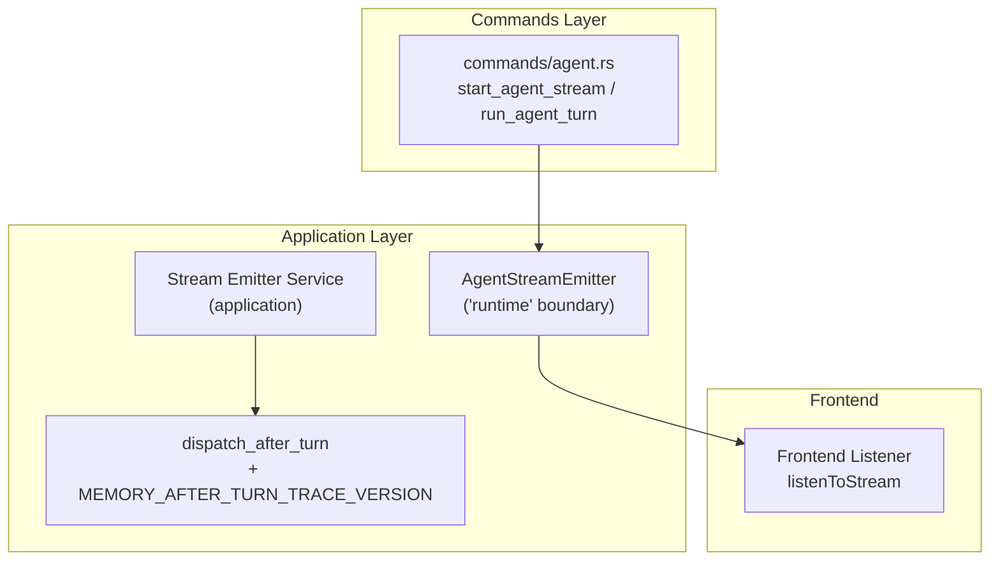
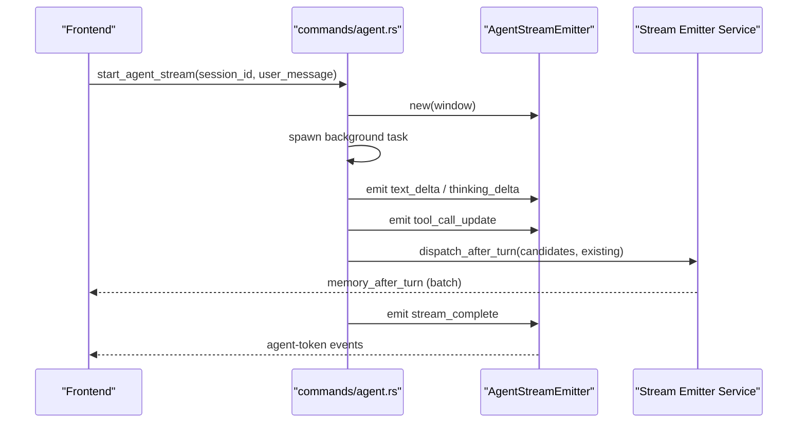
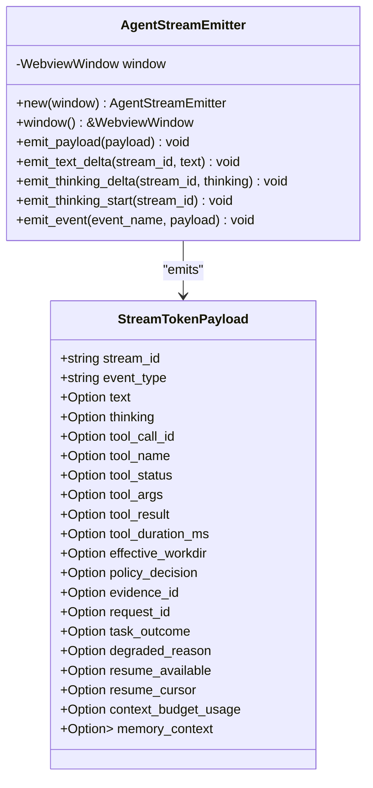
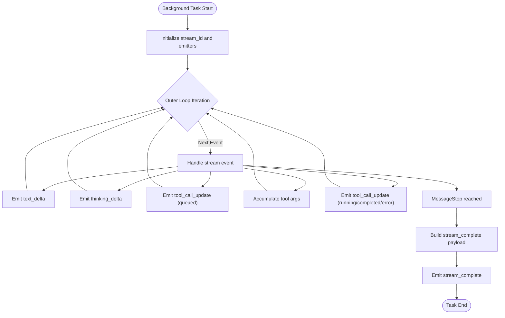
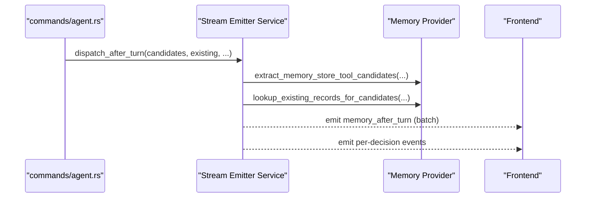
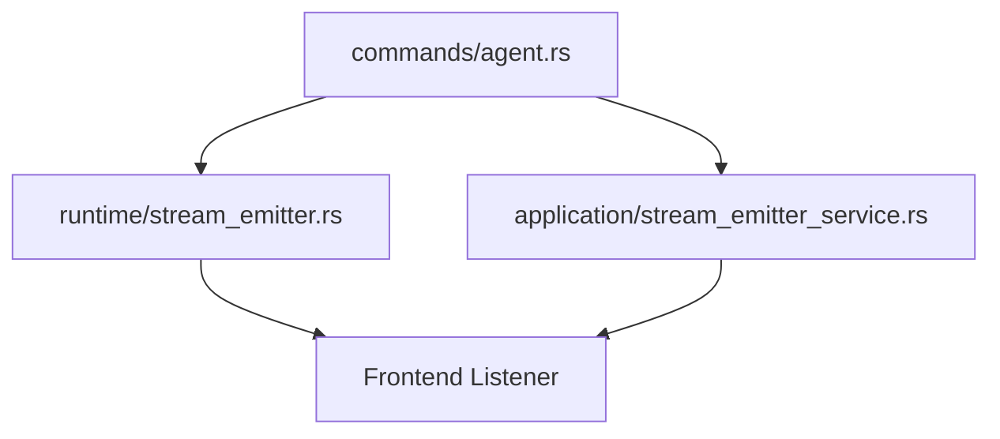

# Stream Emitter Service

<cite>
**Referenced Files in This Document**
- [stream_emitter.rs](file://rust/crates/runtime/src/stream_emitter.rs)
- [agent.rs](file://src-tauri/src/commands/agent.rs)
- [stream_emitter_service.rs](file://src-tauri/src/modules/application/stream_emitter_service.rs)
- [GFR-004-extract-stream-emitter.md](file://docs/packs/refactor/GFR-004-extract-stream-emitter.md)
</cite>

## Table of Contents
1. [Introduction](#introduction)
2. [Project Structure](#project-structure)
3. [Core Components](#core-components)
4. [Architecture Overview](#architecture-overview)
5. [Detailed Component Analysis](#detailed-component-analysis)
6. [Dependency Analysis](#dependency-analysis)
7. [Performance Considerations](#performance-considerations)
8. [Troubleshooting Guide](#troubleshooting-guide)
9. [Conclusion](#conclusion)

## Introduction
This document explains the Stream Emitter Service module responsible for managing streaming response mechanisms, event emission patterns, and real-time data transmission in the agent loop. It covers the centralized event emission boundary, the dispatch_after_turn functionality, the MEMORY_AFTER_TURN_TRACE_VERSION, and how the service integrates with the agent loop to deliver token-by-token updates, tool invocation events, and turn completion signals to the frontend.

## Project Structure
The stream emitter service spans two primary locations:
- Runtime boundary: a dedicated emitter that defines canonical event names and payload shapes for streaming events.
- Application service: a new service that consolidates scattered emit calls and coordinates post-turn memory dispatch.

**Diagram sources**
- [stream_emitter.rs:1-318](file://rust/crates/runtime/src/stream_emitter.rs#L1-L318)
- [agent.rs:724-1599](file://src-tauri/src/commands/agent.rs#L724-L1599)
- [stream_emitter_service.rs:1-120](file://src-tauri/src/modules/application/stream_emitter_service.rs#L1-L120)

**Section sources**
- [stream_emitter.rs:1-318](file://rust/crates/runtime/src/stream_emitter.rs#L1-L318)
- [agent.rs:724-1599](file://src-tauri/src/commands/agent.rs#L724-L1599)
- [stream_emitter_service.rs:1-120](file://src-tauri/src/modules/application/stream_emitter_service.rs#L1-L120)

## Core Components
- AgentStreamEmitter: centralizes emission of agent-loop runtime events over Tauri’s IPC, enforcing a single event channel and a canonical payload shape.
- StreamTokenPayload: the unified wire format for all streaming events, carrying token deltas, tool call updates, and contextual metadata.
- Stream factories: convenience constructors for common event types (text_delta, thinking_delta, thinking_start).
- Stream Emitter Service: consolidates scattered emit calls and coordinates post-turn memory dispatch with a stable trace version.

Key responsibilities:
- Enforce a single event channel for streaming: agent-token.
- Provide typed factories for common event shapes.
- Emit tool call lifecycle updates and terminal completion/error events.
- Support post-turn memory dispatch with a trace version for auditability.

**Section sources**
- [stream_emitter.rs:60-188](file://rust/crates/runtime/src/stream_emitter.rs#L60-L188)
- [stream_emitter_service.rs:20-120](file://src-tauri/src/modules/application/stream_emitter_service.rs#L20-L120)

## Architecture Overview
The stream emitter service sits between the agent loop and the frontend, ensuring all streaming events follow a consistent contract. The application-level service consolidates emit points and coordinates memory write decisions after each turn.

**Diagram sources**
- [agent.rs:967-1599](file://src-tauri/src/commands/agent.rs#L967-L1599)
- [stream_emitter.rs:212-277](file://rust/crates/runtime/src/stream_emitter.rs#L212-L277)
- [stream_emitter_service.rs:40-120](file://src-tauri/src/modules/application/stream_emitter_service.rs#L40-L120)

## Detailed Component Analysis

### AgentStreamEmitter
The AgentStreamEmitter is the single boundary through which agent-loop runtime events exit the backend. It:
- Defines the canonical event name for streaming: agent-token.
- Exposes typed methods for common event shapes: emit_text_delta, emit_thinking_delta, emit_thinking_start.
- Provides emit_payload for arbitrary payloads conforming to StreamTokenPayload.
- Supports generic emit_event for non-standard events during transitional periods.

Implementation highlights:
- Holds a WebviewWindow by value to enable cross-task emission without repeated cloning.
- Logs non-fatal emission failures at TRACE level to preserve agent-loop reliability.
- Maintains strict separation from commands-layer concerns to enforce architectural boundaries.

**Diagram sources**
- [stream_emitter.rs:212-277](file://rust/crates/runtime/src/stream_emitter.rs#L212-L277)
- [stream_emitter.rs:114-188](file://rust/crates/runtime/src/stream_emitter.rs#L114-L188)

**Section sources**
- [stream_emitter.rs:60-277](file://rust/crates/runtime/src/stream_emitter.rs#L60-L277)

### StreamTokenPayload and Event Factories
StreamTokenPayload is the canonical wire format for all streaming events. Factories simplify construction of common event shapes:
- text_delta: progressive text token updates.
- thinking_delta: model reasoning content updates.
- thinking_start: marker event indicating reasoning phase begins.

These factories prefill the payload skeleton with stream_id and event_type, minimizing boilerplate at emit sites.

**Section sources**
- [stream_emitter.rs:114-211](file://rust/crates/runtime/src/stream_emitter.rs#L114-L211)

### Stream Emission in the Agent Loop
The agent loop spawns a background task to process streaming requests. Within this task:
- Text and thinking deltas are emitted as they arrive from the provider stream.
- Tool call lifecycle events are emitted as tool use starts, arguments accumulate, and calls complete.
- Terminal events signal completion, errors, or cancellation.

The emitter is constructed once and reused across the task to maintain correlation and minimize overhead.

**Diagram sources**
- [agent.rs:967-1599](file://src-tauri/src/commands/agent.rs#L967-L1599)
- [stream_emitter.rs:240-277](file://rust/crates/runtime/src/stream_emitter.rs#L240-L277)

**Section sources**
- [agent.rs:967-1599](file://src-tauri/src/commands/agent.rs#L967-L1599)

### Stream Emitter Service and dispatch_after_turn
The Stream Emitter Service consolidates scattered emit calls and coordinates post-turn memory dispatch:
- dispatch_after_turn: extracts memory write candidates from the turn’s assistant tool calls, resolves conflicts against existing records, and emits a canonical memory_after_turn batch event.
- MEMORY_AFTER_TURN_TRACE_VERSION: a stable trace version string included in the dispatch payload to ensure consistent auditing across versions.

Integration points:
- The application service is imported by commands/agent.rs to replace scattered emit calls.
- The service is published via modules/application/mod.rs for downstream consumers.

**Diagram sources**
- [agent.rs:474-489](file://src-tauri/src/commands/agent.rs#L474-L489)
- [stream_emitter_service.rs:40-120](file://src-tauri/src/modules/application/stream_emitter_service.rs#L40-L120)

**Section sources**
- [stream_emitter_service.rs:20-120](file://src-tauri/src/modules/application/stream_emitter_service.rs#L20-L120)
- [agent.rs:77-80](file://src-tauri/src/commands/agent.rs#L77-L80)
- [agent.rs:474-489](file://src-tauri/src/commands/agent.rs#L474-L489)

### Real-Time Communication Patterns
Common streaming patterns observed in the agent loop:
- Progressive text rendering: text_delta events are emitted as tokens arrive, enabling near-instant UI updates.
- Reasoning visibility: thinking_start and thinking_delta provide insight into internal model reasoning.
- Tool orchestration: tool_call_update events communicate tool selection, argument accumulation, and completion states.
- Terminal signaling: stream_complete carries outcome, resume availability, and optional context budget usage.

These patterns are enforced by the AgentStreamEmitter’s canonical event name and payload shape, ensuring the frontend can reliably subscribe to a single channel.

**Section sources**
- [agent.rs:1320-1599](file://src-tauri/src/commands/agent.rs#L1320-L1599)
- [stream_emitter.rs:60-188](file://rust/crates/runtime/src/stream_emitter.rs#L60-L188)

## Dependency Analysis
The stream emitter service introduces clear boundaries and dependencies:
- commands/agent.rs depends on runtime/stream_emitter for canonical event emission.
- The application stream emitter service depends on application-level memory injection and dispatch logic.
- Frontend listeners consume agent-token events and memory_after_turn batches.

**Diagram sources**
- [agent.rs:50-52](file://src-tauri/src/commands/agent.rs#L50-L52)
- [stream_emitter.rs:1-318](file://rust/crates/runtime/src/stream_emitter.rs#L1-L318)
- [stream_emitter_service.rs:1-120](file://src-tauri/src/modules/application/stream_emitter_service.rs#L1-L120)

**Section sources**
- [agent.rs:50-52](file://src-tauri/src/commands/agent.rs#L50-L52)
- [stream_emitter.rs:1-318](file://rust/crates/runtime/src/stream_emitter.rs#L1-L318)
- [stream_emitter_service.rs:1-120](file://src-tauri/src/modules/application/stream_emitter_service.rs#L1-L120)

## Performance Considerations
- Emission reliability: Non-fatal emission failures are logged at TRACE level, preserving agent-loop operation under transient IPC issues.
- Window reuse: AgentStreamEmitter holds a WebviewWindow by value to avoid repeated cloning across async boundaries.
- Payload minimization: Optional fields in StreamTokenPayload are conditionally serialized to reduce overhead for lightweight events.
- Batch memory dispatch: The memory_after_turn batch reduces frontend fan-out overhead by consolidating per-decision events.

[No sources needed since this section provides general guidance]

## Troubleshooting Guide
Common issues and remedies:
- Missing agent-token events: Verify the AgentStreamEmitter is constructed with the main window and that emit_payload is invoked for each event.
- Inconsistent event ordering: Ensure tool_call_update events are emitted in the correct lifecycle order (queued → running → completed/error).
- Post-turn memory gaps: Confirm dispatch_after_turn is called after turn completion and that MEMORY_AFTER_TURN_TRACE_VERSION matches the frontend’s expectations.
- Frontend listener mismatches: Ensure the frontend listens to the canonical agent-token channel and memory_after_turn batch events.

**Section sources**
- [stream_emitter.rs:240-277](file://rust/crates/runtime/src/stream_emitter.rs#L240-L277)
- [agent.rs:474-489](file://src-tauri/src/commands/agent.rs#L474-L489)
- [stream_emitter_service.rs:20-120](file://src-tauri/src/modules/application/stream_emitter_service.rs#L20-L120)

## Conclusion
The Stream Emitter Service establishes a robust, canonical boundary for agent-loop streaming events and post-turn memory dispatch. By centralizing emissions and enforcing a single event channel and payload shape, it enables reliable real-time communication with the frontend while supporting complex tool orchestration and memory auditability. The planned extraction of scattered emit calls into the application-level stream emitter service further improves maintainability and consistency across the system.