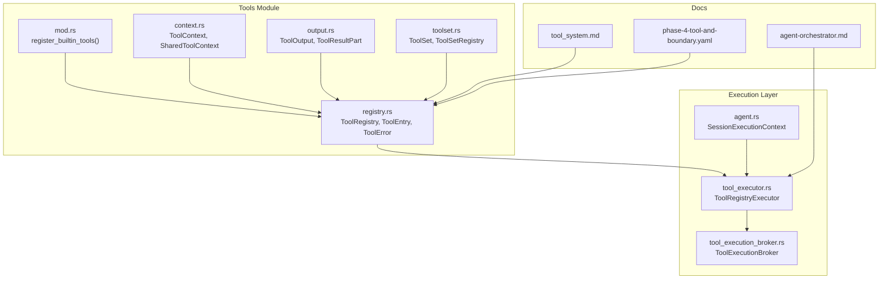
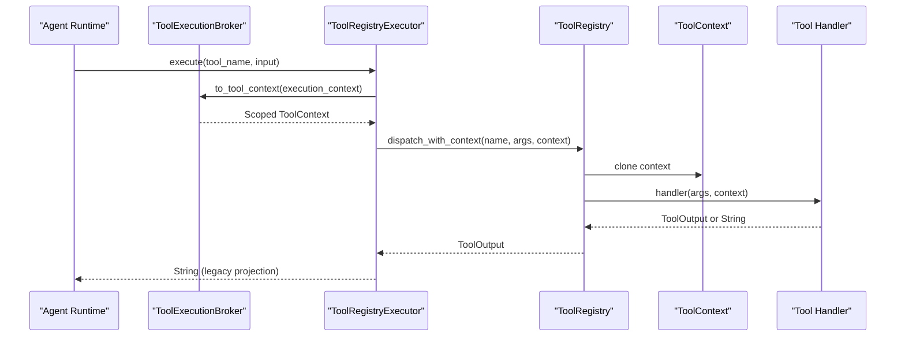
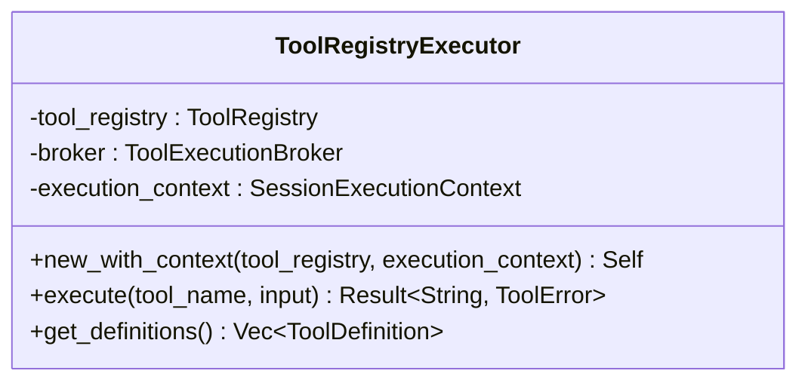
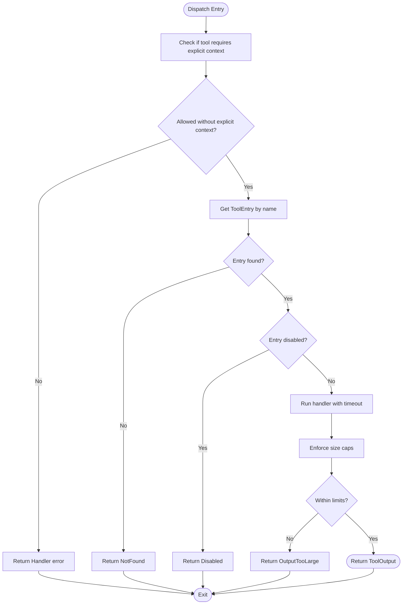
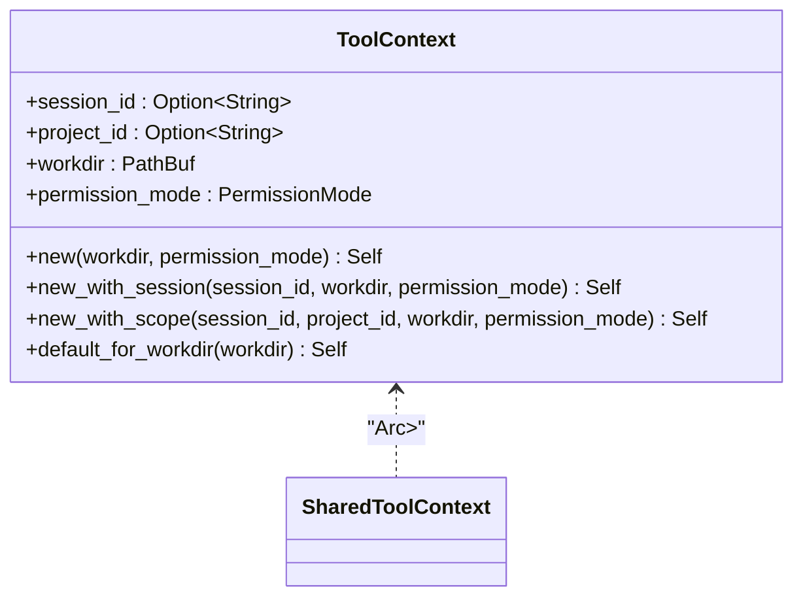
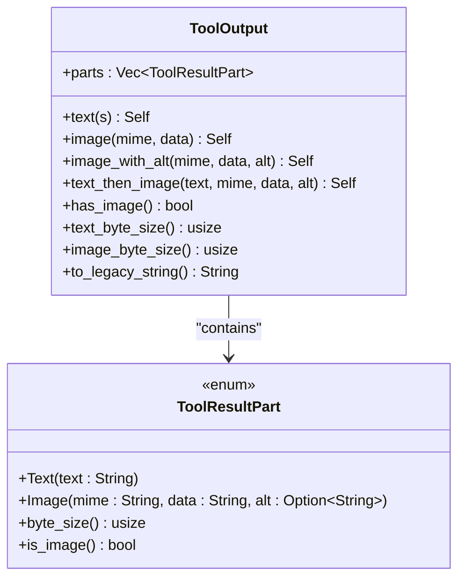
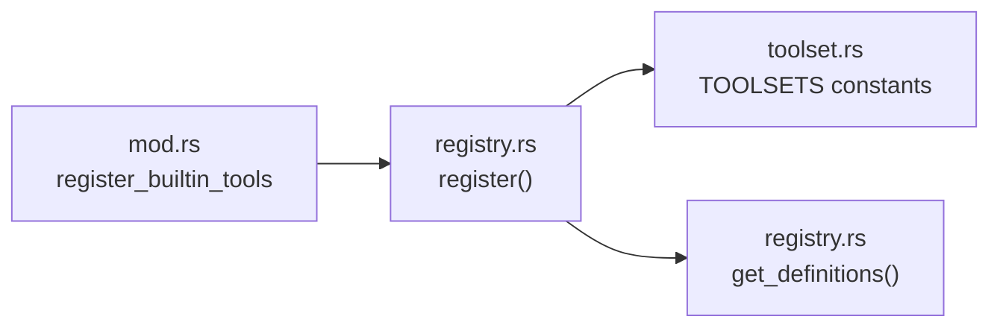
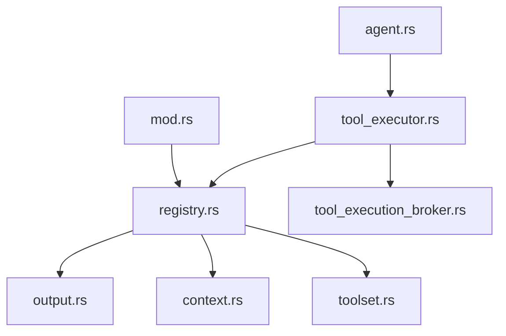

# Tool Services

<cite>
**Referenced Files in This Document**
- [registry.rs](file://src-tauri/src/modules/tools/registry.rs)
- [context.rs](file://src-tauri/src/modules/tools/context.rs)
- [output.rs](file://src-tauri/src/modules/tools/output.rs)
- [toolset.rs](file://src-tauri/src/modules/tools/toolset.rs)
- [mod.rs](file://src-tauri/src/modules/tools/mod.rs)
- [tool_executor.rs](file://src-tauri/src/modules/tools/tool_executor.rs)
- [agent.rs](file://src-tauri/src/commands/agent.rs)
- [tool_execution_broker.rs](file://src-tauri/src/modules/control_plane/tool_execution_broker.rs)
- [tool_system.md](file://docs/design-docs/tool-system.md)
- [agent-orchestrator.md](file://docs/design-docs/agent-orchestrator.md)
- [phase-4-tool-and-boundary.yaml](file://docs/_legacy/exec-plans/active/phase-4-tool-and-boundary.yaml)
</cite>

## Table of Contents
1. [Introduction](#introduction)
2. [Project Structure](#project-structure)
3. [Core Components](#core-components)
4. [Architecture Overview](#architecture-overview)
5. [Detailed Component Analysis](#detailed-component-analysis)
6. [Dependency Analysis](#dependency-analysis)
7. [Performance Considerations](#performance-considerations)
8. [Troubleshooting Guide](#troubleshooting-guide)
9. [Conclusion](#conclusion)
10. [Appendices](#appendices)

## Introduction
This document explains the tool services subsystem, focusing on the ToolRegistryExecutor implementation, tool execution coordination, and heuristic analysis. It covers tool discovery mechanisms, execution patterns, success detection algorithms, and practical examples for registration and execution workflows. Special attention is given to heuristic-based analysis such as unverified file claims and mutating tool detection.

## Project Structure
The tool services live primarily under the Rust backend’s tools module. Key areas:
- Tool registry and dispatch with concurrency and safety controls
- Execution context propagation for workdir and permissions
- Multimodal tool output model for text and images
- Toolset taxonomy for classification and filtering
- Executor bridge integrating the registry into the runtime
- Control plane broker for session-scoped execution
- Agent orchestration and legacy compatibility

**Diagram sources**
- [registry.rs:353-584](file://src-tauri/src/modules/tools/registry.rs#L353-L584)
- [context.rs:9-35](file://src-tauri/src/modules/tools/context.rs#L9-L35)
- [output.rs:22-84](file://src-tauri/src/modules/tools/output.rs#L22-L84)
- [toolset.rs:7-21](file://src-tauri/src/modules/tools/toolset.rs#L7-L21)
- [mod.rs:26-173](file://src-tauri/src/modules/tools/mod.rs#L26-L173)
- [tool_executor.rs:52-142](file://src-tauri/src/modules/tools/tool_executor.rs#L52-L142)
- [tool_execution_broker.rs](file://src-tauri/src/modules/control_plane/tool_execution_broker.rs)
- [agent.rs:1008-1031](file://src-tauri/src/commands/agent.rs#L1008-L1031)
- [tool_system.md:33-368](file://docs/design-docs/tool-system.md#L33-L368)
- [agent-orchestrator.md:183-241](file://docs/design-docs/agent-orchestrator.md#L183-L241)
- [phase-4-tool-and-boundary.yaml:134-171](file://docs/_legacy/exec-plans/active/phase-4-tool-and-boundary.yaml#L134-L171)

**Section sources**
- [mod.rs:26-173](file://src-tauri/src/modules/tools/mod.rs#L26-L173)
- [tool_system.md:33-368](file://docs/design-docs/tool-system.md#L33-L368)

## Core Components
- ToolRegistry: Concurrent registry backed by DashMap, with tool definitions, validation, and dispatch with timeouts and size caps. Supports both legacy string-returning handlers and new multimodal handlers.
- ToolEntry: Encapsulates tool metadata, input schema, optional multimodal handler, timeouts, and size limits.
- ToolContext: Passes workdir and permission mode to tools; supports session/project scoping for isolation.
- ToolOutput: Multimodal result container supporting text and image parts with convenience constructors and legacy string projection.
- ToolSet and ToolSetRegistry: Classify tools into named sets (e.g., files, terminal, memory) for filtering and enablement.
- ToolRegistryExecutor: Bridges the async ToolRegistry to the synchronous executor interface used by the agent runtime.
- ToolExecutionBroker: Translates session execution context into tool context for safe, scoped execution.
- Agent orchestration: Builds session execution context and instantiates ToolRegistryExecutor for tool calls.

**Section sources**
- [registry.rs:147-584](file://src-tauri/src/modules/tools/registry.rs#L147-L584)
- [context.rs:9-109](file://src-tauri/src/modules/tools/context.rs#L9-L109)
- [output.rs:22-224](file://src-tauri/src/modules/tools/output.rs#L22-L224)
- [toolset.rs:7-161](file://src-tauri/src/modules/tools/toolset.rs#L7-L161)
- [tool_executor.rs:52-142](file://src-tauri/src/modules/tools/tool_executor.rs#L52-L142)
- [tool_execution_broker.rs](file://src-tauri/src/modules/control_plane/tool_execution_broker.rs)
- [agent.rs:1008-1031](file://src-tauri/src/commands/agent.rs#L1008-L1031)

## Architecture Overview
The tool system centers on a registry-driven dispatch model with strong safety and isolation guarantees. Built-in tools are registered at startup, and execution is coordinated through a session-scoped execution context. The executor bridges async registry dispatch to the runtime’s synchronous interface.

**Diagram sources**
- [tool_executor.rs:103-115](file://src-tauri/src/modules/tools/tool_executor.rs#L103-L115)
- [registry.rs:506-555](file://src-tauri/src/modules/tools/registry.rs#L506-L555)
- [context.rs:9-35](file://src-tauri/src/modules/tools/context.rs#L9-L35)

**Section sources**
- [tool_executor.rs:52-142](file://src-tauri/src/modules/tools/tool_executor.rs#L52-L142)
- [registry.rs:473-555](file://src-tauri/src/modules/tools/registry.rs#L473-L555)
- [agent-orchestrator.md:183-241](file://docs/design-docs/agent-orchestrator.md#L183-L241)

## Detailed Component Analysis

### ToolRegistryExecutor
- Purpose: Provide a synchronous executor interface wrapping an async ToolRegistry. It converts session execution context into a scoped ToolContext and delegates to the registry.
- Key behaviors:
  - Legacy string projection: Maintains backward compatibility by collapsing ToolOutput to a string.
  - Definition export: Converts registry definitions to the API’s tool definition shape.
  - Audit trace ID generation for observability.
- Integration: Created from a ToolRegistry and a SessionExecutionContext; used by agent orchestration to execute tools.

**Diagram sources**
- [tool_executor.rs:52-142](file://src-tauri/src/modules/tools/tool_executor.rs#L52-L142)

**Section sources**
- [tool_executor.rs:52-142](file://src-tauri/src/modules/tools/tool_executor.rs#L52-L142)
- [agent.rs:1008-1031](file://src-tauri/src/commands/agent.rs#L1008-L1031)

### ToolRegistry and Dispatch
- Concurrent registry: Uses DashMap for high-throughput concurrent access.
- Registration: Prevents duplicate names and tracks toolset membership.
- Dispatch:
  - Validates high-risk tools require explicit session-scoped context.
  - Supports both legacy string handlers and new multimodal handlers.
  - Applies per-tool timeouts and size caps (text and image).
  - Enforces output size caps before returning results.
- Validation: Basic schema checks for required parameters.

**Diagram sources**
- [registry.rs:473-555](file://src-tauri/src/modules/tools/registry.rs#L473-L555)
- [registry.rs:310-351](file://src-tauri/src/modules/tools/registry.rs#L310-L351)

**Section sources**
- [registry.rs:353-584](file://src-tauri/src/modules/tools/registry.rs#L353-L584)

### ToolContext and Safety Scoping
- Purpose: Provide workdir and permission mode to tools, enabling scoped execution and isolation across sessions and projects.
- Features:
  - Session and project scoping for memory and other tools.
  - Deterministic context fingerprinting for tracing.
  - Default context with full access for legacy scenarios.

**Diagram sources**
- [context.rs:9-109](file://src-tauri/src/modules/tools/context.rs#L9-L109)

**Section sources**
- [context.rs:9-109](file://src-tauri/src/modules/tools/context.rs#L9-L109)
- [phase-4-tool-and-boundary.yaml:134-171](file://docs/_legacy/exec-plans/active/phase-4-tool-and-boundary.yaml#L134-L171)

### Multimodal ToolOutput
- Design: Replace monolithic string outputs with structured parts (text/image) to support vision-capable tools.
- Capabilities:
  - Text and image parts with byte-size accounting.
  - Legacy string projection for compatibility.
  - Helpers for common combinations (text-first image).
- Integration: Registry enforces per-modality size caps; executor collapses to string for legacy consumers.

**Diagram sources**
- [output.rs:22-224](file://src-tauri/src/modules/tools/output.rs#L22-L224)

**Section sources**
- [output.rs:22-224](file://src-tauri/src/modules/tools/output.rs#L22-L224)
- [registry.rs:310-351](file://src-tauri/src/modules/tools/registry.rs#L310-L351)

### Tool Discovery and Classification
- Built-in registration: Centralized function registers all built-in tools (file ops, terminal, web, memory, scheduler, skills, etc.) into the registry.
- Toolsets: Predefined groups classify tools for enablement and filtering.
- Definitions export: Registry exposes OpenAI-compatible function definitions, optionally filtered by allowed names or toolsets.

**Diagram sources**
- [mod.rs:26-173](file://src-tauri/src/modules/tools/mod.rs#L26-L173)
- [toolset.rs:21-71](file://src-tauri/src/modules/tools/toolset.rs#L21-L71)
- [registry.rs:426-471](file://src-tauri/src/modules/tools/registry.rs#L426-L471)

**Section sources**
- [mod.rs:26-173](file://src-tauri/src/modules/tools/mod.rs#L26-L173)
- [toolset.rs:7-161](file://src-tauri/src/modules/tools/toolset.rs#L7-L161)
- [registry.rs:426-471](file://src-tauri/src/modules/tools/registry.rs#L426-L471)

### Heuristic Analysis: Unverified File Claims and Mutating Tool Detection
- Unverified file claims: Heuristics can flag tools that claim to modify or read files without explicit verification of intent or evidence. The registry’s validation focuses on schema compliance; heuristic analysis can augment by inspecting tool arguments for suspicious patterns (e.g., broad wildcards, privileged paths).
- Mutating tool detection: High-risk tools (e.g., file write/edit, bash, memory purge, cron manipulation) are identified by name and require explicit session-scoped context. Heuristics can flag unexpected mutations by correlating tool calls with session boundaries and permission scopes.
- Practical guidance:
  - Require explicit context for high-risk tools.
  - Enforce per-tool size caps to mitigate output abuse.
  - Use session/project scoping to constrain filesystem and memory operations.

**Section sources**
- [registry.rs:114-145](file://src-tauri/src/modules/tools/registry.rs#L114-L145)
- [registry.rs:473-555](file://src-tauri/src/modules/tools/registry.rs#L473-L555)

## Dependency Analysis
- Coupling:
  - ToolRegistry depends on ToolEntry, ToolOutput, and ToolContext.
  - ToolRegistryExecutor depends on ToolRegistry and ToolExecutionBroker.
  - Built-in tool registration depends on ToolRegistry and external services (memory, scheduler, browser).
- Cohesion:
  - Registry encapsulates dispatch logic, validation, and size enforcement.
  - Output module encapsulates multimodal serialization and projection.
- External integrations:
  - Agent orchestration constructs execution context and instantiates the executor.
  - Control plane broker translates runtime context into tool context.

**Diagram sources**
- [registry.rs:353-584](file://src-tauri/src/modules/tools/registry.rs#L353-L584)
- [output.rs:22-224](file://src-tauri/src/modules/tools/output.rs#L22-L224)
- [context.rs:9-109](file://src-tauri/src/modules/tools/context.rs#L9-L109)
- [toolset.rs:7-161](file://src-tauri/src/modules/tools/toolset.rs#L7-L161)
- [tool_executor.rs:52-142](file://src-tauri/src/modules/tools/tool_executor.rs#L52-L142)
- [tool_execution_broker.rs](file://src-tauri/src/modules/control_plane/tool_execution_broker.rs)
- [agent.rs:1008-1031](file://src-tauri/src/commands/agent.rs#L1008-L1031)
- [mod.rs:26-173](file://src-tauri/src/modules/tools/mod.rs#L26-L173)

**Section sources**
- [registry.rs:353-584](file://src-tauri/src/modules/tools/registry.rs#L353-L584)
- [tool_executor.rs:52-142](file://src-tauri/src/modules/tools/tool_executor.rs#L52-L142)
- [agent.rs:1008-1031](file://src-tauri/src/commands/agent.rs#L1008-L1031)

## Performance Considerations
- Concurrency: DashMap-backed registry enables high-concurrent access without global locks.
- Timeouts: Per-tool timeouts prevent runaway tool execution.
- Size caps: Early rejection of oversized outputs reduces memory pressure.
- Legacy compatibility: String projection avoids unnecessary allocations for legacy consumers.

[No sources needed since this section provides general guidance]

## Troubleshooting Guide
Common issues and resolutions:
- Tool not found: Verify registration and tool name spelling.
- Tool disabled: Enable the tool or adjust governance settings.
- Timeout errors: Increase tool-specific timeout or optimize tool logic.
- Output too large: Reduce tool output or increase per-tool size caps.
- High-risk tool requires explicit context: Provide session-scoped context via the broker.

**Section sources**
- [registry.rs:147-183](file://src-tauri/src/modules/tools/registry.rs#L147-L183)
- [registry.rs:473-555](file://src-tauri/src/modules/tools/registry.rs#L473-L555)

## Conclusion
The tool services subsystem provides a robust, safe, and extensible framework for tool discovery, execution, and output handling. The ToolRegistryExecutor integrates seamlessly with the runtime, while the registry ensures safety via context scoping, timeouts, and size caps. Heuristic analysis complements these safeguards by detecting risky patterns such as unverified file claims and mutating tool usage.

[No sources needed since this section summarizes without analyzing specific files]

## Appendices

### Example Workflows

- Tool registration
  - Register built-in tools during application startup using the centralized registration function.
  - Reference: [register_builtin_tools:26-173](file://src-tauri/src/modules/tools/mod.rs#L26-L173)

- Tool execution with ToolRegistryExecutor
  - Build SessionExecutionContext and instantiate ToolRegistryExecutor.
  - Execute tools synchronously; legacy consumers receive a string projection.
  - Reference: [ToolRegistryExecutor::execute:118-122](file://src-tauri/src/modules/tools/tool_executor.rs#L118-L122), [agent orchestration:1008-1031](file://src-tauri/src/commands/agent.rs#L1008-L1031)

- Heuristic-based mutation detection
  - Identify high-risk tools by name and enforce explicit context.
  - Apply size caps and monitor output patterns.
  - Reference: [requires_explicit_context:114-145](file://src-tauri/src/modules/tools/registry.rs#L114-L145), [enforce_size_caps:310-351](file://src-tauri/src/modules/tools/registry.rs#L310-L351)

**Section sources**
- [mod.rs:26-173](file://src-tauri/src/modules/tools/mod.rs#L26-L173)
- [tool_executor.rs:118-122](file://src-tauri/src/modules/tools/tool_executor.rs#L118-L122)
- [agent.rs:1008-1031](file://src-tauri/src/commands/agent.rs#L1008-L1031)
- [registry.rs:114-145](file://src-tauri/src/modules/tools/registry.rs#L114-L145)
- [registry.rs:310-351](file://src-tauri/src/modules/tools/registry.rs#L310-L351)