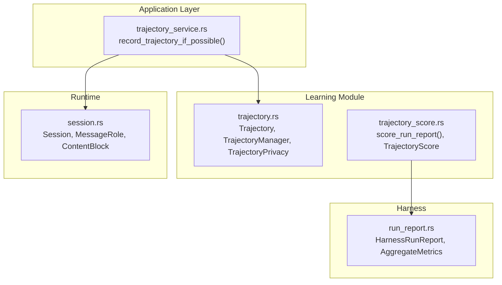
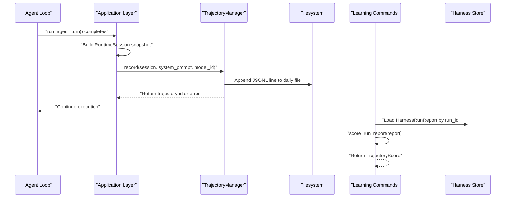
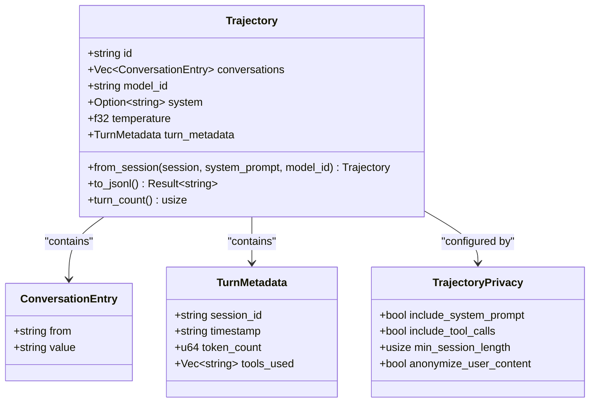
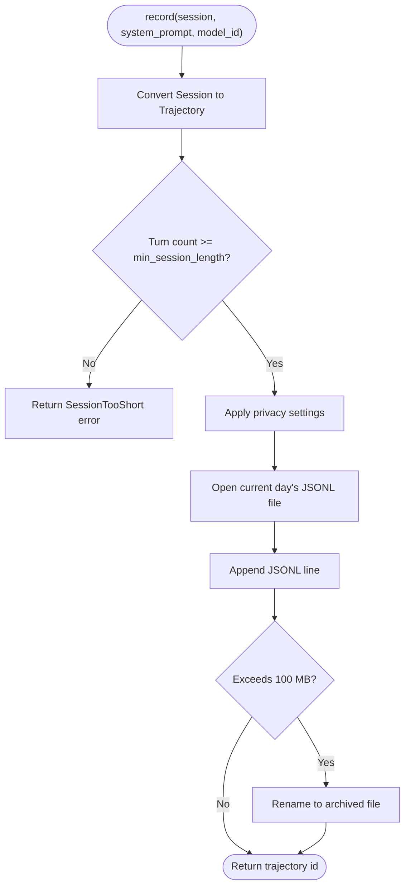
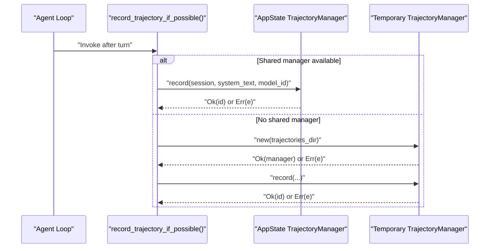
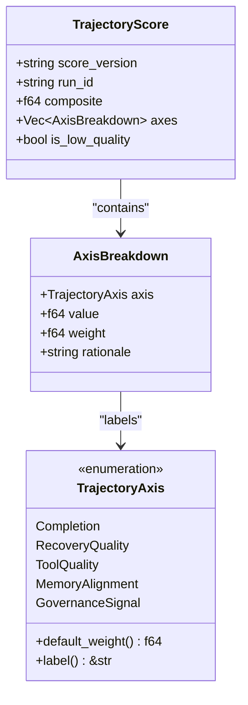
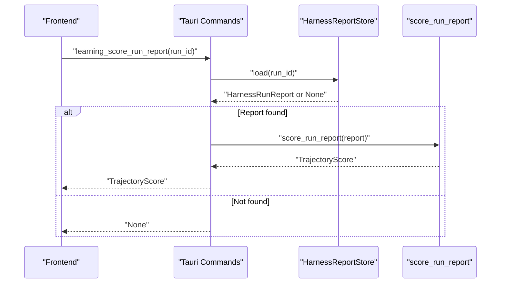
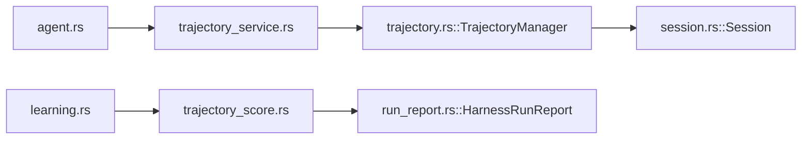

# Trajectory Service

<cite>
**Referenced Files in This Document**
- [trajectory_service.rs](file://src-tauri/src/modules/application/trajectory_service.rs)
- [trajectory.rs](file://src-tauri/src/modules/learning/trajectory.rs)
- [trajectory_score.rs](file://src-tauri/src/modules/learning/trajectory_score.rs)
- [session.rs](file://src-tauri/src/modules/runtime/session.rs)
- [run_report.rs](file://src-tauri/src/modules/harness/run_report.rs)
- [agent.rs](file://src-tauri/src/commands/agent.rs)
- [learning.rs](file://src-tauri/src/commands/learning.rs)
- [mod.rs (learning)](file://src-tauri/src/modules/learning/mod.rs)
- [harness/mod.rs](file://src-tauri/src/modules/harness/mod.rs)
</cite>

## Table of Contents
1. [Introduction](#introduction)
2. [Project Structure](#project-structure)
3. [Core Components](#core-components)
4. [Architecture Overview](#architecture-overview)
5. [Detailed Component Analysis](#detailed-component-analysis)
6. [Dependency Analysis](#dependency-analysis)
7. [Performance Considerations](#performance-considerations)
8. [Troubleshooting Guide](#troubleshooting-guide)
9. [Conclusion](#conclusion)

## Introduction
This document describes the trajectory service module responsible for capturing agent conversations as structured trajectories suitable for reinforcement learning and self-improvement. It covers the recording mechanism, execution tracking integration, privacy controls, performance monitoring, and the scoring pipeline that transforms raw runs into actionable metrics for governance and strategy promotion.

## Project Structure
The trajectory service spans three primary areas:
- Application-level orchestration for trajectory recording
- Learning module for trajectory data structures, persistence, and export
- Scoring module for converting run reports into structured scores

**Diagram sources**
- [trajectory_service.rs:1-58](file://src-tauri/src/modules/application/trajectory_service.rs#L1-L58)
- [trajectory.rs:1-610](file://src-tauri/src/modules/learning/trajectory.rs#L1-L610)
- [trajectory_score.rs:1-398](file://src-tauri/src/modules/learning/trajectory_score.rs#L1-L398)
- [session.rs:1-560](file://src-tauri/src/modules/runtime/session.rs#L1-L560)
- [run_report.rs:1-423](file://src-tauri/src/modules/harness/run_report.rs#L1-L423)

**Section sources**
- [trajectory_service.rs:1-58](file://src-tauri/src/modules/application/trajectory_service.rs#L1-L58)
- [trajectory.rs:1-610](file://src-tauri/src/modules/learning/trajectory.rs#L1-L610)
- [trajectory_score.rs:1-398](file://src-tauri/src/modules/learning/trajectory_score.rs#L1-L398)
- [session.rs:1-560](file://src-tauri/src/modules/runtime/session.rs#L1-L560)
- [run_report.rs:1-423](file://src-tauri/src/modules/harness/run_report.rs#L1-L423)

## Core Components
- Trajectory data model: conversion from runtime sessions to ShareGPT-like JSONL entries with metadata.
- Trajectory manager: persistent recording with privacy controls, file rotation, and export.
- Application recording hook: integration into agent loop lifecycle to capture trajectories.
- Scoring pipeline: axis-based scoring of harness run reports for governance and strategy promotion.

Key responsibilities:
- Data capture: convert runtime messages to trajectory entries, filter system/tool messages, extract tool usage.
- Privacy: configurable inclusion/exclusion of system prompts, tool calls, and anonymization.
- Persistence: append to daily rolling JSONL files, rotate when exceeding size limits.
- Export: combine all trajectory files for external training pipelines.
- Scoring: compute composite score across completion, recovery quality, tool quality, memory alignment, and governance signals.

**Section sources**
- [trajectory.rs:21-123](file://src-tauri/src/modules/learning/trajectory.rs#L21-L123)
- [trajectory.rs:165-357](file://src-tauri/src/modules/learning/trajectory.rs#L165-L357)
- [trajectory_service.rs:23-57](file://src-tauri/src/modules/application/trajectory_service.rs#L23-L57)
- [trajectory_score.rs:127-146](file://src-tauri/src/modules/learning/trajectory_score.rs#L127-L146)

## Architecture Overview
The trajectory service integrates with the agent loop and harness reporting pipeline to capture, persist, and score execution traces.

**Diagram sources**
- [agent.rs:2094-2108](file://src-tauri/src/commands/agent.rs#L2094-L2108)
- [trajectory_service.rs:23-57](file://src-tauri/src/modules/application/trajectory_service.rs#L23-L57)
- [trajectory.rs:205-255](file://src-tauri/src/modules/learning/trajectory.rs#L205-L255)
- [learning.rs:682-687](file://src-tauri/src/commands/learning.rs#L682-L687)
- [run_report.rs:345-368](file://src-tauri/src/modules/harness/run_report.rs#L345-L368)

## Detailed Component Analysis

### Trajectory Data Model and Privacy Controls
- Conversion from runtime session to trajectory:
  - Filters out system and tool messages for ShareGPT compatibility.
  - Extracts tool usage from tool-use blocks.
  - Generates metadata including session id, timestamp, token counts, and tools used.
- Privacy defaults:
  - Excludes system prompt by default.
  - Requires explicit opt-in for including tool calls.
  - Minimum session length threshold to avoid recording very short sessions.
  - Anonymization of user content by default.

**Diagram sources**
- [trajectory.rs:21-123](file://src-tauri/src/modules/learning/trajectory.rs#L21-L123)
- [trajectory.rs:125-147](file://src-tauri/src/modules/learning/trajectory.rs#L125-L147)

**Section sources**
- [trajectory.rs:48-123](file://src-tauri/src/modules/learning/trajectory.rs#L48-L123)
- [trajectory.rs:125-147](file://src-tauri/src/modules/learning/trajectory.rs#L125-L147)

### Trajectory Manager: Recording, Rotation, and Export
- Daily rolling JSONL files with 100 MB size limit.
- Automatic rotation to archived files when size threshold is exceeded.
- Export all trajectory files into a single output for external training pipelines.
- Privacy-aware filtering applied during recording.

**Diagram sources**
- [trajectory.rs:205-255](file://src-tauri/src/modules/learning/trajectory.rs#L205-L255)
- [trajectory.rs:319-351](file://src-tauri/src/modules/learning/trajectory.rs#L319-L351)

**Section sources**
- [trajectory.rs:165-357](file://src-tauri/src/modules/learning/trajectory.rs#L165-L357)

### Application Integration: record_trajectory_if_possible
- Centralized recording hook invoked after each agent turn.
- Uses a shared AppState-level TrajectoryManager when available to avoid repeated directory scans.
- Falls back to a temporary manager if none is provided (e.g., during tests or early startup).
- Errors are logged as warnings and do not block execution.
- Sessions shorter than the configured minimum are skipped for privacy.

**Diagram sources**
- [trajectory_service.rs:23-57](file://src-tauri/src/modules/application/trajectory_service.rs#L23-L57)
- [agent.rs:2102-2108](file://src-tauri/src/commands/agent.rs#L2102-L2108)

**Section sources**
- [trajectory_service.rs:14-57](file://src-tauri/src/modules/application/trajectory_service.rs#L14-L57)
- [agent.rs:2094-2108](file://src-tauri/src/commands/agent.rs#L2094-L2108)

### Scoring Pipeline: TrajectoryScore and Axes
- Computes a composite score from five governance-aligned axes:
  - Completion: task outcome and last-turn success.
  - Recovery quality: turn success rate.
  - Tool quality: tool success density.
  - Memory alignment: acceptance vs rejection and warnings.
  - Governance signal: penalties for blocking and warning failures.
- Provides axis breakdowns and rationale for transparency.
- Stable contract version ensures persisted scores remain comparable across updates.

**Diagram sources**
- [trajectory_score.rs:83-123](file://src-tauri/src/modules/learning/trajectory_score.rs#L83-L123)
- [trajectory_score.rs:39-81](file://src-tauri/src/modules/learning/trajectory_score.rs#L39-L81)

**Section sources**
- [trajectory_score.rs:127-146](file://src-tauri/src/modules/learning/trajectory_score.rs#L127-L146)
- [trajectory_score.rs:187-296](file://src-tauri/src/modules/learning/trajectory_score.rs#L187-L296)

### Integration with Harness Reports and Commands
- Learning commands expose trajectory scoring and reflection generation via Tauri IPC.
- Scoring consumes a canonical HarnessRunReport, aggregating metrics and evidence.
- Integration with the harness report store enables structured evaluation and comparison.

**Diagram sources**
- [learning.rs:682-687](file://src-tauri/src/commands/learning.rs#L682-L687)
- [run_report.rs:345-368](file://src-tauri/src/modules/harness/run_report.rs#L345-L368)
- [trajectory_score.rs:127-146](file://src-tauri/src/modules/learning/trajectory_score.rs#L127-L146)

**Section sources**
- [learning.rs:678-709](file://src-tauri/src/commands/learning.rs#L678-L709)
- [run_report.rs:1-423](file://src-tauri/src/modules/harness/run_report.rs#L1-L423)
- [trajectory_score.rs:1-398](file://src-tauri/src/modules/learning/trajectory_score.rs#L1-L398)

## Dependency Analysis
- Application layer depends on the learning module’s TrajectoryManager for persistence.
- TrajectoryManager depends on runtime Session types for conversion and on filesystem APIs for I/O.
- Scoring pipeline depends on HarnessRunReport for structured run-level data.
- Tauri commands bridge the scoring pipeline to the frontend.

**Diagram sources**
- [agent.rs:2102-2108](file://src-tauri/src/commands/agent.rs#L2102-L2108)
- [trajectory_service.rs:11-12](file://src-tauri/src/modules/application/trajectory_service.rs#L11-L12)
- [trajectory.rs:19-20](file://src-tauri/src/modules/learning/trajectory.rs#L19-L20)
- [session.rs:62-65](file://src-tauri/src/modules/runtime/session.rs#L62-L65)
- [trajectory_score.rs](file://src-tauri/src/modules/learning/trajectory_score.rs#L33)
- [run_report.rs:349-368](file://src-tauri/src/modules/harness/run_report.rs#L349-L368)
- [learning.rs:682-687](file://src-tauri/src/commands/learning.rs#L682-L687)

**Section sources**
- [mod.rs (learning):87-92](file://src-tauri/src/modules/learning/mod.rs#L87-L92)
- [harness/mod.rs:108-139](file://src-tauri/src/modules/harness/mod.rs#L108-L139)

## Performance Considerations
- File I/O:
  - Daily rotation at 100 MB prevents excessive growth of individual files.
  - Append-only writes minimize contention; rotation is performed asynchronously.
- Privacy filtering:
  - Conversion filters out system/tool messages and empty blocks to reduce data volume.
- Scoring:
  - Pure computation with no IO; weights and axis computations are constant-time.
- Memory footprint:
  - Trajectory conversion collects only text content and tool names; tool results are excluded from conversations.
- Export:
  - Aggregates all JSONL entries into a single file; consider batching for very large corpora.

[No sources needed since this section provides general guidance]

## Troubleshooting Guide
Common issues and remedies:
- Recording errors:
  - Directory creation failures or write errors are logged as warnings and do not block execution.
  - Verify local data directory permissions and available disk space.
- Privacy violations:
  - If system prompts appear unexpectedly, confirm privacy settings and minimum session length.
- Short sessions:
  - Sessions below the minimum turn count are skipped; increase session length or adjust privacy settings.
- Export failures:
  - Ensure the output path is valid and writable; check that trajectory files exist in the base directory.
- Scoring discrepancies:
  - Confirm the run report version and that required metrics (turn success rate, tool usage, memory decisions) are populated.

**Section sources**
- [trajectory_service.rs:21-35](file://src-tauri/src/modules/application/trajectory_service.rs#L21-L35)
- [trajectory.rs:149-163](file://src-tauri/src/modules/learning/trajectory.rs#L149-L163)
- [trajectory.rs:217-223](file://src-tauri/src/modules/learning/trajectory.rs#L217-L223)
- [trajectory.rs:257-293](file://src-tauri/src/modules/learning/trajectory.rs#L257-L293)

## Conclusion
The trajectory service provides a robust, privacy-aware mechanism for capturing agent interactions as structured trajectories, enabling downstream learning and governance. Its integration with the agent loop ensures minimal overhead, while the scoring pipeline offers transparent, axis-based evaluation aligned with strategic objectives. Together, these components form the foundation for continuous self-improvement and policy-driven execution control.