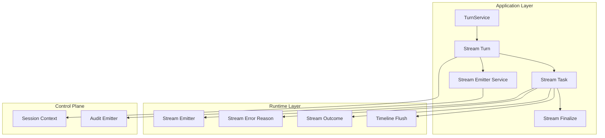
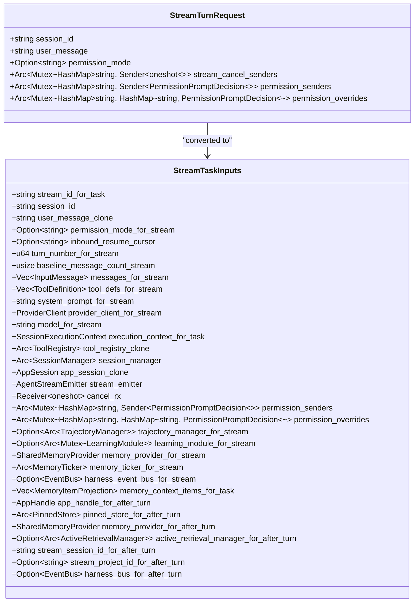
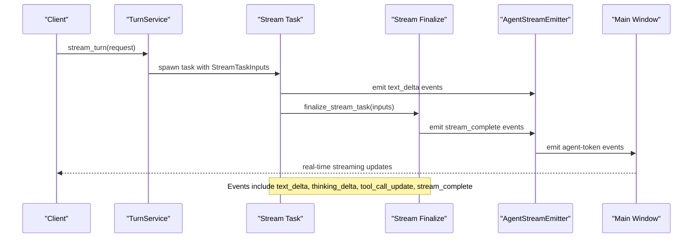
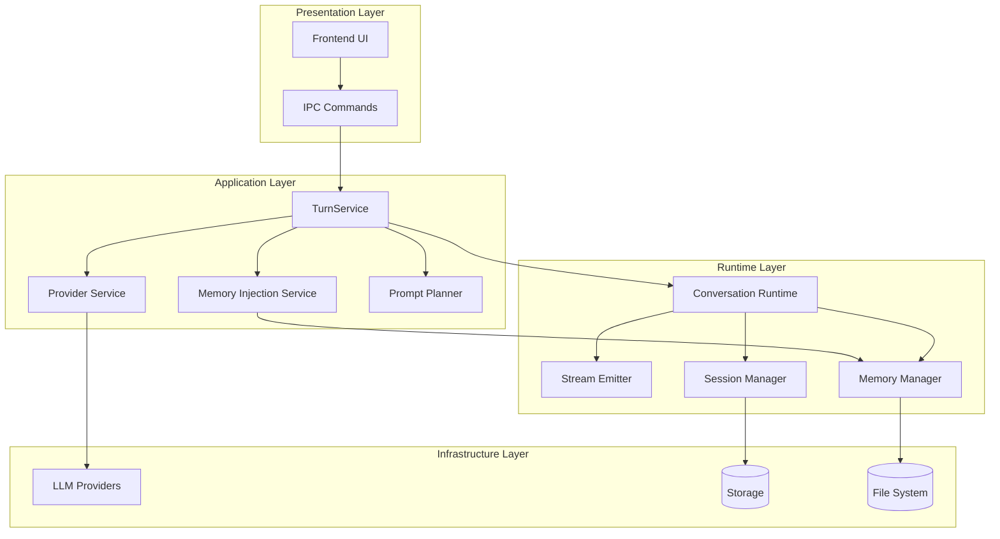
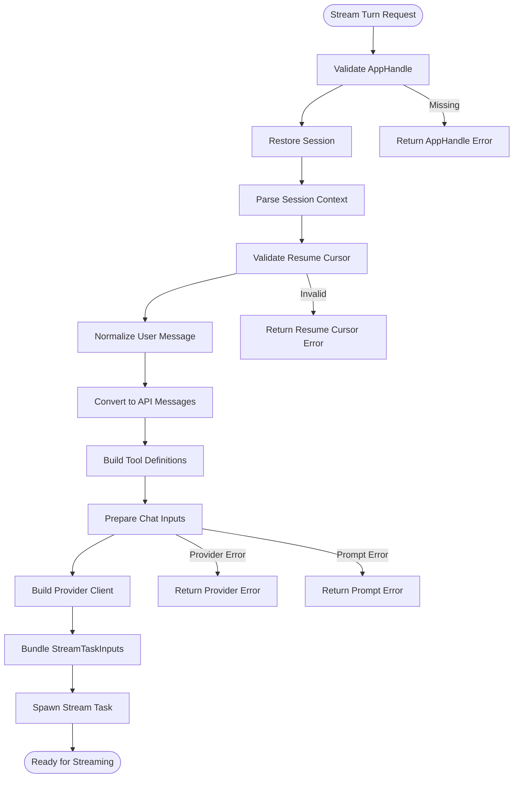
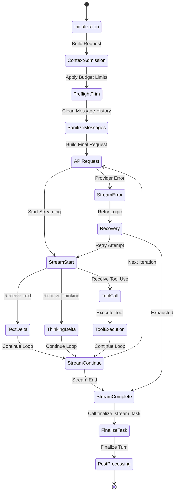
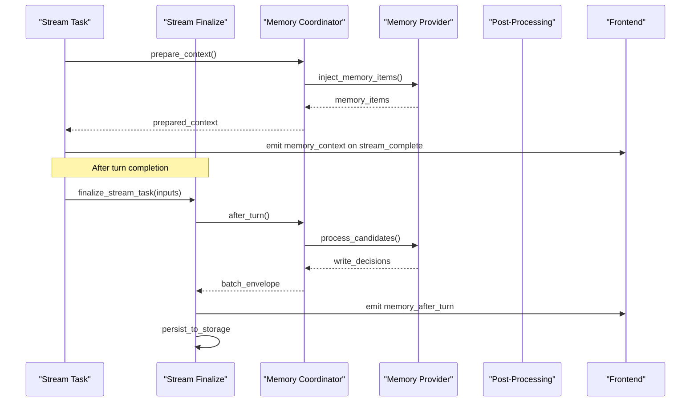
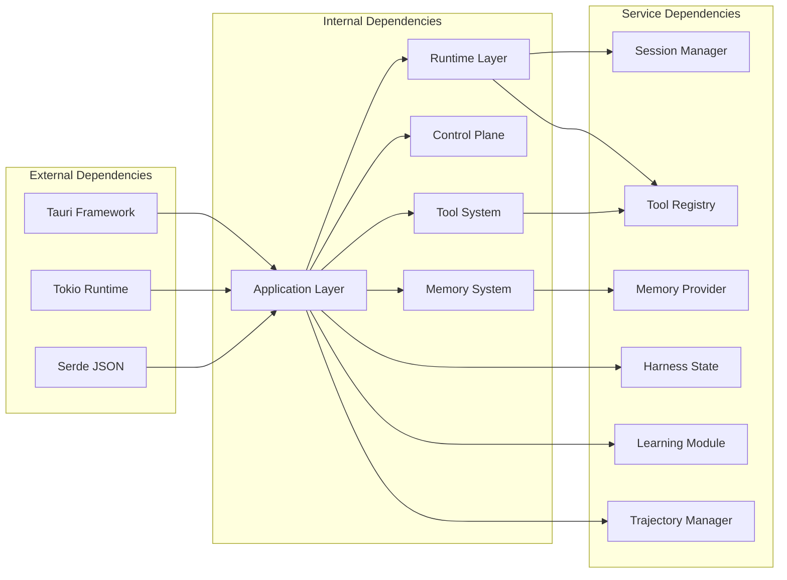

# Streaming Turn Service

<cite>
**Referenced Files in This Document**
- [stream.rs](file://src-tauri/src/modules/application/turn_service/stream.rs)
- [stream_task.rs](file://src-tauri/src/modules/application/turn_service/stream_task.rs)
- [stream_finalize.rs](file://src-tauri/src/modules/application/turn_service/stream_finalize.rs)
- [mod.rs](file://src-tauri/src/modules/application/turn_service/mod.rs)
- [stream_emitter.rs](file://src-tauri/src/modules/runtime/stream_emitter.rs)
- [stream_emitter_service.rs](file://src-tauri/src/modules/application/stream_emitter_service.rs)
- [stream_error_reason.rs](file://src-tauri/src/modules/runtime/stream_error_reason.rs)
- [stream_outcome.rs](file://src-tauri/src/modules/runtime/stream_outcome.rs)
- [timeline_flush.rs](file://src-tauri/src/modules/runtime/timeline_flush.rs)
- [conversation.rs](file://src-tauri/src/modules/runtime/conversation.rs)
- [turn_service_stream_turn_e2e.rs](file://src-tauri/tests/turn_service_stream_turn_e2e.rs)
</cite>

## Update Summary
**Changes Made**
- Updated to reflect major refactoring with extraction of spawned task body into stream_task.rs (1,249 lines)
- Added creation of stream_finalize.rs (646 lines) for post-loop finalize block
- Updated StreamTaskInputs structure and centralized stream task management
- Enhanced documentation of the new modular architecture with separate task execution and finalization phases

## Table of Contents
1. [Introduction](#introduction)
2. [Project Structure](#project-structure)
3. [Core Components](#core-components)
4. [Architecture Overview](#architecture-overview)
5. [Detailed Component Analysis](#detailed-component-analysis)
6. [Dependency Analysis](#dependency-analysis)
7. [Performance Considerations](#performance-considerations)
8. [Troubleshooting Guide](#troubleshooting-guide)
9. [Conclusion](#conclusion)

## Introduction

The Streaming Turn Service is the canonical orchestration layer for handling real-time chat conversations in the if2Ai system. It manages the complete lifecycle of streaming chat turns, from initial user input through tool execution and memory persistence. This service represents the modernized approach to conversational AI interactions, providing real-time streaming responses with sophisticated error handling, memory management, and execution tracking.

The service is designed around the principle of separation of concerns, with distinct modules handling preparation, streaming execution, and post-processing. The recent major refactoring has extracted the spawned task body into a dedicated `stream_task.rs` module (1,249 lines) and created a separate `stream_finalize.rs` module (646 lines) for post-loop finalize operations. This provides better modularity and maintainability while preserving all existing functionality.

The service supports advanced features like permission-based tool execution, memory injection, context budgeting, and comprehensive error recovery mechanisms.

## Project Structure

The Streaming Turn Service is organized into several key modules within the Rust backend, now with improved separation of concerns:

**Diagram sources**
- [stream.rs:1-432](file://src-tauri/src/modules/application/turn_service/stream.rs#L1-L432)
- [stream_task.rs:1-1250](file://src-tauri/src/modules/application/turn_service/stream_task.rs#L1-L1250)
- [stream_finalize.rs:1-647](file://src-tauri/src/modules/application/turn_service/stream_finalize.rs#L1-L647)
- [stream_emitter.rs:1-318](file://src-tauri/src/modules/runtime/stream_emitter.rs#L1-L318)

**Section sources**
- [mod.rs:1-347](file://src-tauri/src/modules/application/turn_service/mod.rs#L1-L347)
- [stream.rs:1-432](file://src-tauri/src/modules/application/turn_service/stream.rs#L1-L432)

## Core Components

### TurnService Structure

The TurnService acts as the central orchestrator for all chat turn operations. It maintains a comprehensive dependency bundle that includes tool registries, memory providers, session managers, and various runtime services.

Key responsibilities include:
- **Provider Resolution**: Managing LLM provider connections and model selection
- **Memory Coordination**: Orchestrating memory injection and retrieval
- **Prompt Planning**: Building contextual prompts with memory and tool information
- **Execution Mode Classification**: Determining appropriate execution strategies

### StreamTurnRequest Architecture

The StreamTurnRequest encapsulates all necessary information for initiating a streaming conversation turn:

**Diagram sources**
- [stream.rs:99-120](file://src-tauri/src/modules/application/turn_service/stream.rs#L99-L120)
- [stream_task.rs:102-138](file://src-tauri/src/modules/application/turn_service/stream_task.rs#L102-L138)

### Streaming Event Emission

The service employs a sophisticated event emission system that provides real-time feedback throughout the conversation lifecycle:

**Diagram sources**
- [stream.rs:361-430](file://src-tauri/src/modules/application/turn_service/stream.rs#L361-L430)
- [stream_task.rs:1168-1221](file://src-tauri/src/modules/application/turn_service/stream_task.rs#L1168-L1221)
- [stream_emitter.rs:212-277](file://src-tauri/src/modules/runtime/stream_emitter.rs#L212-L277)

**Section sources**
- [mod.rs:83-141](file://src-tauri/src/modules/application/turn_service/mod.rs#L83-L141)
- [stream.rs:99-120](file://src-tauri/src/modules/application/turn_service/stream.rs#L99-L120)
- [stream_task.rs:102-138](file://src-tauri/src/modules/application/turn_service/stream_task.rs#L102-L138)

## Architecture Overview

The Streaming Turn Service follows a layered architecture pattern that separates concerns across multiple abstraction levels. The recent refactoring has improved modularity by extracting the task execution and finalization phases:

**Diagram sources**
- [mod.rs:143-171](file://src-tauri/src/modules/application/turn_service/mod.rs#L143-L171)
- [stream.rs:268-310](file://src-tauri/src/modules/application/turn_service/stream.rs#L268-L310)

The architecture emphasizes:
- **Separation of Concerns**: Each layer has distinct responsibilities
- **Dependency Injection**: Services receive dependencies through structured interfaces
- **Asynchronous Processing**: Non-blocking operations for streaming responses
- **Error Resilience**: Comprehensive error handling and recovery mechanisms
- **Modular Design**: Clear separation between task execution and finalization phases

## Detailed Component Analysis

### Stream Preparation and Validation

The stream preparation phase performs critical validation and setup operations:

**Diagram sources**
- [stream.rs:142-430](file://src-tauri/src/modules/application/turn_service/stream.rs#L142-L430)

The preparation phase includes:
- **AppHandle Validation**: Ensures proper Tauri window access
- **Session Restoration**: Recovers conversation state from persistent storage
- **Context Parsing**: Extracts execution context from session metadata
- **Resume Cursor Validation**: Verifies continuation markers for interrupted conversations
- **Message Normalization**: Prepares user input for provider consumption
- **StreamTaskInputs Bundling**: Creates comprehensive input bundle for task execution

### Streaming Loop Execution

The core streaming loop implements sophisticated tool execution and response handling, now split between task execution and finalization:

**Diagram sources**
- [stream_task.rs:245-1250](file://src-tauri/src/modules/application/turn_service/stream_task.rs#L245-L1250)
- [stream_finalize.rs:124-647](file://src-tauri/src/modules/application/turn_service/stream_finalize.rs#L124-L647)

Key execution features include:
- **Context Budget Management**: Enforces message count, character, and token limits
- **Message Sanitization**: Validates and cleans conversation history
- **Tool Call Processing**: Handles parallel tool execution with proper tracking
- **Streaming Response**: Real-time text and thinking delta emission
- **Error Recovery**: Automatic retry for transient network issues
- **Task Outcome Resolution**: Comprehensive outcome determination and resume capability

### Memory Integration and Persistence

The service integrates with the memory system for comprehensive context management, with post-turn processing handled in the finalize module:

**Diagram sources**
- [stream_task.rs:341-421](file://src-tauri/src/modules/application/turn_service/stream_task.rs#L341-L421)
- [stream_finalize.rs:336-375](file://src-tauri/src/modules/application/turn_service/stream_finalize.rs#L336-L375)
- [stream_emitter_service.rs:52-121](file://src-tauri/src/modules/application/stream_emitter_service.rs#L52-L121)

**Section sources**
- [stream.rs:142-430](file://src-tauri/src/modules/application/turn_service/stream.rs#L142-L430)
- [stream_task.rs:145-1250](file://src-tauri/src/modules/application/turn_service/stream_task.rs#L145-L1250)
- [stream_finalize.rs:1-647](file://src-tauri/src/modules/application/turn_service/stream_finalize.rs#L1-L647)

## Dependency Analysis

The Streaming Turn Service maintains carefully managed dependencies to ensure modularity and testability:

**Diagram sources**
- [mod.rs:115-128](file://src-tauri/src/modules/application/turn_service/mod.rs#L115-L128)

Dependency characteristics:
- **Layered Architecture**: Clear separation between application, runtime, and infrastructure layers
- **Interface-Based Design**: Dependencies injected through structured interfaces
- **Async Compatibility**: All dependencies support asynchronous operation
- **Test Isolation**: Dependencies can be easily mocked for unit testing
- **Modular Separation**: Task execution and finalization are cleanly separated for better maintainability

**Section sources**
- [mod.rs:115-141](file://src-tauri/src/modules/application/turn_service/mod.rs#L115-L141)

## Performance Considerations

The Streaming Turn Service implements several performance optimization strategies:

### Streaming Optimization
- **Incremental Session Saving**: Saves assistant responses periodically to prevent data loss
- **Token-Based Triggers**: Saves state every 50 tokens to balance performance and safety
- **Efficient Memory Management**: Uses string interning and minimal copying for streaming text
- **Task Execution Separation**: Improved modularity reduces complexity in the main execution path

### Resource Management
- **Connection Pooling**: Reuses provider connections across multiple turns
- **Memory Budgeting**: Enforces strict limits on context size and token usage
- **Cancellation Support**: Graceful termination of long-running operations
- **Finalization Optimization**: Post-loop finalize operations are isolated for better performance tracking

### Error Recovery
- **Retry Logic**: Automatic retry for transient network timeouts
- **Graceful Degradation**: Continues operation with reduced functionality when possible
- **Progress Tracking**: Maintains state to enable resumption of interrupted operations
- **Outcome Resolution**: Comprehensive task outcome determination with resume capability

## Troubleshooting Guide

### Common Issues and Solutions

**Stream Start Failures**
- **Symptoms**: Immediate failure when starting a stream
- **Causes**: Invalid provider configuration, network connectivity issues, authentication problems
- **Solutions**: Verify provider credentials, check network connectivity, validate configuration files

**Tool Execution Errors**
- **Symptoms**: Tool calls fail during streaming
- **Causes**: Permission denials, tool not found, invalid tool arguments
- **Solutions**: Review permission policies, verify tool registration, validate input parameters

**Memory Integration Problems**
- **Symptoms**: Memory items not appearing in context
- **Causes**: Memory provider configuration issues, insufficient memory quota
- **Solutions**: Check memory provider settings, verify available quota, review memory injection policies

**Performance Issues**
- **Symptoms**: Slow response times, high memory usage
- **Causes**: Large context sizes, excessive tool calls, inefficient memory usage
- **Solutions**: Reduce context size, limit tool execution frequency, optimize memory queries

**Task Execution Problems**
- **Symptoms**: Stream hangs or fails mid-execution
- **Causes**: Task execution complexity, memory issues, finalization failures
- **Solutions**: Check task execution logs, verify finalization process, monitor memory usage

### Diagnostic Tools

The service provides comprehensive logging and monitoring capabilities:

- **Structured Logging**: Detailed traces for each streaming operation
- **Performance Metrics**: Timing information for critical operations
- **Error Classification**: Standardized error reporting with actionable insights
- **Task Outcome Tracking**: Comprehensive outcome determination and resume capability

**Section sources**
- [stream_error_reason.rs:8-35](file://src-tauri/src/modules/runtime/stream_error_reason.rs#L8-L35)
- [stream_outcome.rs:26-86](file://src-tauri/src/modules/runtime/stream_outcome.rs#L26-L86)

## Conclusion

The Streaming Turn Service represents a sophisticated and robust solution for real-time conversational AI interactions. The recent major refactoring has significantly improved its architecture by extracting the spawned task body into a dedicated `stream_task.rs` module (1,249 lines) and creating a separate `stream_finalize.rs` module (646 lines) for post-loop finalize operations.

Key strengths include:
- **Modular Design**: Clear separation of concerns enables maintainability and extensibility
- **Robust Error Handling**: Comprehensive error recovery and user-friendly error reporting
- **Performance Optimization**: Efficient streaming with minimal latency and resource usage
- **Memory Integration**: Seamless integration with the broader memory system for context management
- **Task Execution Separation**: Improved modularity with clean separation between execution and finalization phases
- **Comprehensive Outcome Resolution**: Detailed task outcome determination with resume capability

The service successfully balances functionality with performance, providing a solid foundation for advanced conversational AI capabilities while maintaining reliability and ease of maintenance. The refactoring enhances maintainability without sacrificing the robustness and efficiency that makes this service suitable for production deployment in complex AI applications.