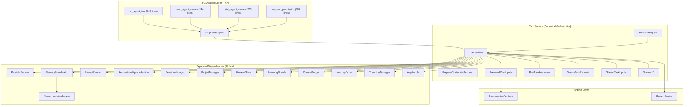
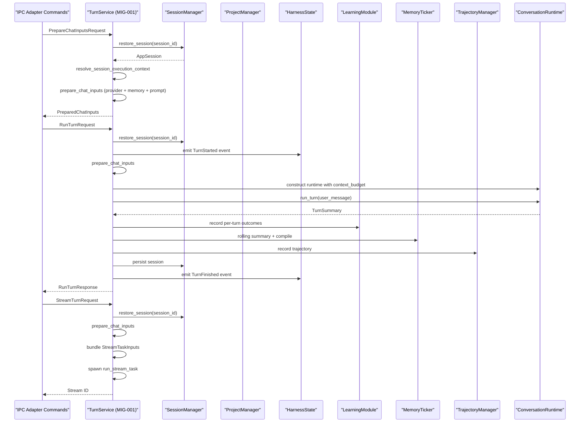
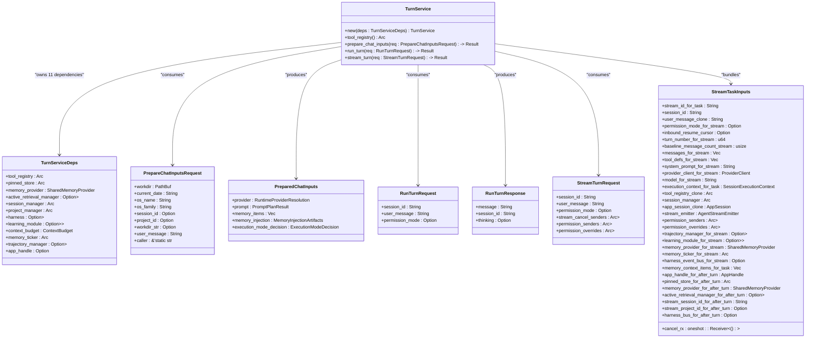
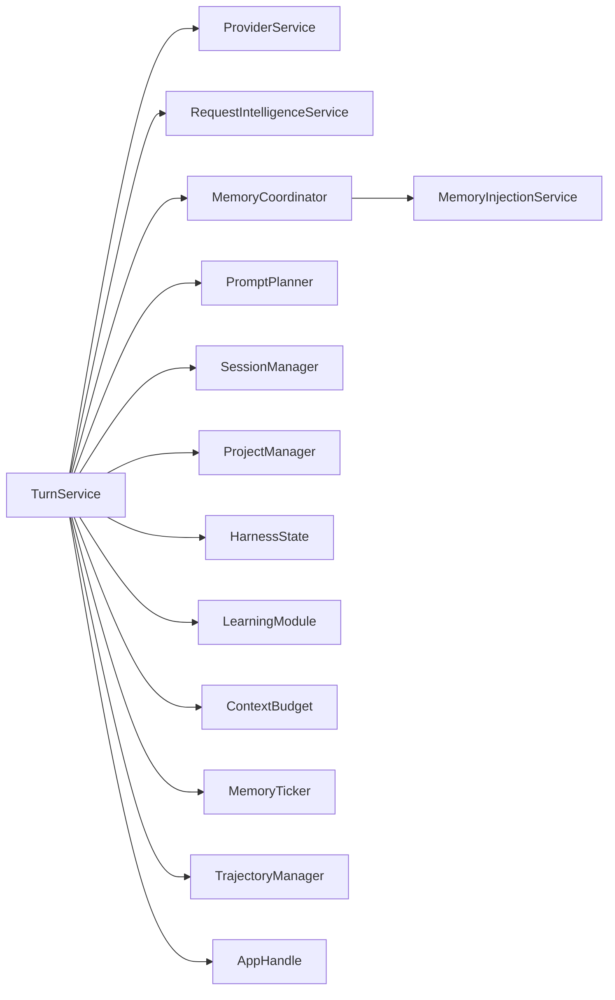

# Turn Service

<cite>
**Referenced Files in This Document**
- [turn_service/mod.rs](file://src-tauri/src/modules/application/turn_service/mod.rs)
- [turn_service/run.rs](file://src-tauri/src/modules/application/turn_service/run.rs)
- [turn_service/stream.rs](file://src-tauri/src/modules/application/turn_service/stream.rs)
- [turn_service/stream_task.rs](file://src-tauri/src/modules/application/turn_service/stream_task.rs)
- [agent/mod.rs](file://src-tauri/src/commands/agent/mod.rs)
- [MIG-001-canonical-chat-execution-spine.md](file://docs/packs/feature/migration-core/MIG-001-canonical-chat-execution-spine.md)
- [MIG-001-EXEC-PROMPT.md](file://docs/packs/feature/migration-core/MIG-001-EXEC-PROMPT.md)
- [conversation.rs](file://src-tauri/src/modules/runtime/conversation.rs)
- [provider_service.rs](file://src-tauri/src/modules/application/provider_service.rs)
- [memory_injection_service.rs](file://src-tauri/src/modules/application/memory_injection_service.rs)
- [prompt_planner/mod.rs](file://src-tauri/src/modules/application/prompt_planner/mod.rs)
- [memory_coordinator.rs](file://src-tauri/src/modules/application/memory_coordinator.rs)
- [request_intelligence_service.rs](file://src-tauri/src/modules/application/request_intelligence_service.rs)
- [turn_service_run_turn_e2e.rs](file://src-tauri/tests/turn_service_run_turn_e2e.rs)
- [turn_service_stream_turn_e2e.rs](file://src-tauri/tests/turn_service_stream_turn_e2e.rs)
</cite>

## Update Summary
**Changes Made**
- Updated to reflect major architectural refactoring: orchestration logic moved from IPC command layer to canonical TurnService::stream_turn method
- Documented the new StreamTurnRequest struct and cross-stream coordination state management
- Added comprehensive coverage of the refactored streaming turn lifecycle ownership (MIG-001-c/d)
- Updated architecture diagrams to show cleaner separation between thin IPC adapter and business logic
- Enhanced documentation of the canonical entry point and thin adapter pattern
- Added new section on MIG-001 progression stages and their implications
- Documented the extraction of streaming task closure body into stream_task.rs module

## Table of Contents
1. [Introduction](#introduction)
2. [Project Structure](#project-structure)
3. [Core Components](#core-components)
4. [Architecture Overview](#architecture-overview)
5. [Detailed Component Analysis](#detailed-component-analysis)
6. [Dependency Analysis](#dependency-analysis)
7. [Ownership Model and MIG-001 Progression](#ownership-model-and-mig-001-progression)
8. [Performance Considerations](#performance-considerations)
9. [Troubleshooting Guide](#troubleshooting-guide)
10. [Conclusion](#conclusion)

## Introduction
This document explains the turn service module that orchestrates a single chat turn across provider resolution, memory preparation, prompt planning, and runtime handoff. The TurnService has evolved from a simple 4-dependency service to a comprehensive 11-dependency orchestrator as part of MIG-001 canonical chat execution spine initiative. The service now owns the complete turn lifecycle including session management, learning integration, trajectory recording, and both non-streaming and streaming turn execution.

**Updated** The orchestration logic has been moved from the IPC command layer to the canonical TurnService::run_turn and TurnService::stream_turn methods, creating a cleaner separation between thin IPC adapters and business logic.

## Project Structure
The turn service is part of the Rust backend application layer and serves as the canonical orchestrator for chat turns. The architecture has been refactored to separate IPC adapters from business logic, with TurnService now owning the complete turn lifecycle.

**Diagram sources**
- [turn_service/mod.rs:91-104](file://src-tauri/src/modules/application/turn_service/mod.rs#L91-L104)
- [turn_service/run.rs:103-585](file://src-tauri/src/modules/application/turn_service/run.rs#L103-L585)
- [turn_service/stream.rs:141-432](file://src-tauri/src/modules/application/turn_service/stream.rs#L141-L432)
- [agent/mod.rs:94-145](file://src-tauri/src/commands/agent/mod.rs#L94-L145)

**Section sources**
- [turn_service/mod.rs:1-35](file://src-tauri/src/modules/application/turn_service/mod.rs#L1-L35)
- [agent/mod.rs:1-285](file://src-tauri/src/commands/agent/mod.rs#L1-L285)

## Core Components
- **TurnService**: The canonical orchestrator for chat turns, now owning 11 dependencies including session management, learning integration, trajectory recording, and both non-streaming and streaming turn execution.
- **TurnServiceDeps**: Expanded dependency bundle containing 11 fields for comprehensive turn lifecycle ownership.
- **PrepareChatInputsRequest**: Per-turn input bundle with environment metadata and execution context.
- **PreparedChatInputs**: Composite output containing resolved provider, structured prompt plan, memory artifacts, and execution mode decision.
- **RunTurnRequest/RunTurnResponse**: Canonical non-streaming turn execution interface.
- **StreamTurnRequest**: Streaming turn execution interface with cross-stream coordination state.
- **StreamTaskInputs**: Bundled state for the extracted streaming task closure body.

Key responsibilities:
- **Provider resolution** via ProviderService
- **Request intelligence classification** via RequestIntelligenceService  
- **Memory orchestration** via MemoryCoordinator (delegating to MemoryInjectionService)
- **Prompt planning** via PromptPlanner
- **Session management** via SessionManager for turn persistence
- **Learning integration** via LearningModule for outcome tracking
- **Trajectory recording** via TrajectoryManager for ShareGPT export
- **Runtime construction** via ConversationRuntime with context budgeting
- **Streaming turn execution** via ConversationRuntime with stream emission
- **Cross-stream coordination** via permission management and cancellation handling
- **Task encapsulation** via StreamTaskInputs for extracted streaming logic

**Updated** The TurnService now owns both non-streaming and streaming turn lifecycles, with the IPC adapters becoming pure parameter parsers and delegators. The streaming logic has been refactored to extract the task closure body into a separate stream_task.rs module.

**Section sources**
- [turn_service/mod.rs:91-104](file://src-tauri/src/modules/application/turn_service/mod.rs#L91-L104)
- [turn_service/mod.rs:149-191](file://src-tauri/src/modules/application/turn_service/mod.rs#L149-L191)
- [turn_service/run.rs:63-89](file://src-tauri/src/modules/application/turn_service/run.rs#L63-L89)
- [turn_service/stream.rs:98-119](file://src-tauri/src/modules/application/turn_service/stream.rs#L98-L119)
- [turn_service/stream_task.rs:93-134](file://src-tauri/src/modules/application/turn_service/stream_task.rs#L93-L134)

## Architecture Overview
The turn service implements a comprehensive ownership model for the canonical chat execution spine. The expanded dependency surface enables full turn lifecycle ownership while maintaining strict layering constraints. The orchestration logic has been moved from IPC commands to the canonical TurnService methods.

**Updated** The sequence now shows the canonical TurnService::run_turn and TurnService::stream_turn methods as the central orchestrators, with IPC adapters becoming thin parameter parsers.

**Diagram sources**
- [turn_service/run.rs:103-585](file://src-tauri/src/modules/application/turn_service/run.rs#L103-L585)
- [turn_service/mod.rs:209-288](file://src-tauri/src/modules/application/turn_service/mod.rs#L209-L288)
- [agent/mod.rs:94-145](file://src-tauri/src/commands/agent/mod.rs#L94-L145)

## Detailed Component Analysis

### TurnService Orchestration
TurnService now serves as the canonical orchestrator for the complete chat turn lifecycle. The service has been expanded to own 11 dependencies that enable comprehensive turn management, including both non-streaming and streaming execution paths.

**Updated** Added StreamTurnRequest and StreamTaskInputs to reflect the expanded ownership model and the refactored streaming implementation.

**Diagram sources**
- [turn_service/mod.rs:120-147](file://src-tauri/src/modules/application/turn_service/mod.rs#L120-L147)
- [turn_service/mod.rs:91-104](file://src-tauri/src/modules/application/turn_service/mod.rs#L91-L104)
- [turn_service/mod.rs:149-191](file://src-tauri/src/modules/application/turn_service/mod.rs#L149-L191)
- [turn_service/run.rs:63-89](file://src-tauri/src/modules/application/turn_service/run.rs#L63-L89)
- [turn_service/stream.rs:98-119](file://src-tauri/src/modules/application/turn_service/stream.rs#L98-L119)
- [turn_service/stream_task.rs:93-134](file://src-tauri/src/modules/application/turn_service/stream_task.rs#L93-L134)

**Section sources**
- [turn_service/mod.rs:120-147](file://src-tauri/src/modules/application/turn_service/mod.rs#L120-L147)
- [turn_service/mod.rs:209-288](file://src-tauri/src/modules/application/turn_service/mod.rs#L209-L288)
- [turn_service/run.rs:91-585](file://src-tauri/src/modules/application/turn_service/run.rs#L91-L585)
- [turn_service/stream.rs:121-432](file://src-tauri/src/modules/application/turn_service/stream.rs#L121-L432)
- [turn_service/stream_task.rs:136-200](file://src-tauri/src/modules/application/turn_service/stream_task.rs#L136-L200)

### Expanded Dependency Surface
The TurnServiceDeps struct has been expanded from 4 to 11 dependencies to support comprehensive turn ownership across both streaming and non-streaming execution paths.

**Core Dependencies (4 original)**:
- `tool_registry`: Tool registry access for tool loop wiring
- `pinned_store`: Static memory storage for pinned items
- `memory_provider`: Memory provider for retrieval operations
- `active_retrieval_manager`: Active memory retrieval management

**New Dependencies (7 expanded)**:
- `session_manager`: Session restoration and persistence
- `project_manager`: Project context resolution for execution
- `harness`: Event emission for turn lifecycle monitoring
- `learning_module`: Outcome tracking and reflection integration
- `context_budget`: Runtime context budget management
- `memory_ticker`: Turn hooks for rolling summaries and compilation
- `trajectory_manager`: ShareGPT JSONL persistence after turns
- `app_handle`: Tauri channel for after-turn dispatch and streaming

**Updated** The dependency surface now supports both non-streaming and streaming turn execution, with the app_handle being essential for streaming operations. The streaming task logic has been extracted into a separate module for better maintainability.

**Section sources**
- [turn_service/mod.rs:70-115](file://src-tauri/src/modules/application/turn_service/mod.rs#L70-L115)
- [agent/mod.rs:43-58](file://src-tauri/src/commands/agent/mod.rs#L43-L58)

### Compile-Time Smoke Test
A new compile-time smoke test validates that all 11 dependencies satisfy `Send + Sync` requirements for safe concurrent execution in streaming contexts.

**Section sources**
- [turn_service/mod.rs:302-325](file://src-tauri/src/modules/application/turn_service/mod.rs#L302-L325)

## Dependency Analysis
TurnService now depends on 11 application services, each serving a specific aspect of turn lifecycle management. The dependencies are carefully organized to maintain separation of concerns while enabling comprehensive ownership across both streaming and non-streaming execution paths.

**Updated** The dependency graph now reflects the canonical ownership model where TurnService owns all aspects of turn execution.

**Diagram sources**
- [turn_service/mod.rs:91-104](file://src-tauri/src/modules/application/turn_service/mod.rs#L91-L104)

**Section sources**
- [turn_service/mod.rs:91-104](file://src-tauri/src/modules/application/turn_service/mod.rs#L91-L104)

## Ownership Model and MIG-001 Progression

### MIG-001 Ownership Status
The TurnService has progressed through four phases of ownership as part of the canonical chat execution spine initiative:

**MIG-001-a**: Expanded dependency surface
- Added 7 new dependencies for comprehensive turn ownership
- Enabled full runtime construction, tool loop, and finalize hooks
- Maintained strict layering constraints preventing application imports from commands

**MIG-001-b**: Non-streaming turn lifecycle ownership
- Owns the complete `prepare -> execute -> finalize` lifecycle
- `run_agent_turn` collapsed into thin adapter delegating to `run_turn`
- IPC command becomes pure parameter parsing and delegation
- The orchestration logic moved from commands::agent::run_agent_turn (558 lines) to application::TurnService::run_turn

**MIG-001-c**: Streaming turn lifecycle ownership
- Owns streaming turn lifecycle via `stream_turn`
- Enables safe concurrent execution with proper dependency validation
- Handles cross-stream coordination state and permission management
- Manages stream cancellation and permission prompts

**MIG-001-d**: Future phase will further refactor streaming implementation
- Internally split the spawned tool-loop body into smaller pieces
- Refactor the large stream.rs module into smaller stream_*.rs files
- Extracted the spawn-task closure body into stream_task.rs module (~1500 LOC)

**Updated** The orchestration logic has been successfully moved from the IPC command layer to the canonical TurnService methods, creating a cleaner separation between thin adapters and business logic. The streaming implementation has been further refactored to improve maintainability.

### Strict Layering Constraints
The MIG-001 ownership model enforces strict layering:
- `application::turn_service` MUST NOT import from `crate::commands::*`
- All dependencies injected through `TurnServiceDeps` only
- Service stays decoupled from `AppState` aggregate held by IPC layer
- IPC adapters become pure parameter parsers and delegators

**Section sources**
- [turn_service/mod.rs:10-32](file://src-tauri/src/modules/application/turn_service/mod.rs#L10-L32)
- [MIG-001-canonical-chat-execution-spine.md:35-53](file://docs/packs/feature/migration-core/MIG-001-canonical-chat-execution-spine.md#L35-L53)

## Performance Considerations
- **Provider resolution** occurs first to fail fast on misconfiguration
- **Memory retrieval and prompt planning** combined into single await for reduced latency
- **Context budgeting** integrated into runtime construction for token usage control
- **Session persistence** handled asynchronously to avoid blocking the turn lifecycle
- **Learning module integration** uses mutex protection for thread-safe outcome recording
- **Memory ticker hooks** provide non-blocking turn completion notifications
- **Trajectory recording** deferred to background processing after turn completion
- **Streaming coordination** managed through cross-stream state maps for efficient permission handling
- **AppHandle usage** centralized for stream emission and after-turn dispatch
- **Task encapsulation** via StreamTaskInputs reduces spawn overhead and improves maintainability
- **File size management** - stream.rs reduced from ~1700 LOC to ~432 LOC after extracting task body

**Updated** Added considerations for streaming performance and cross-stream coordination, plus the benefits of the refactored task encapsulation.

## Troubleshooting Guide
Common issues and diagnostics:

**Provider resolution failures**: Check configuration and API keys for selected protocol
**Prompt planning errors**: Inspect system prompt loading and memory injection artifacts  
**Memory retrieval failures**: Logged but don't fail the turn; proceed without retrieved context
**Session management errors**: Verify session restoration and persistence permissions
**Learning module conflicts**: Mutex contention may indicate concurrent turn execution issues
**Trajectory recording failures**: Background process errors don't affect primary turn execution
**Runtime construction errors**: Context budget violations or tool registry issues
**Streaming failures**: Check AppHandle availability and stream cancellation sender registration
**Permission handling errors**: Verify permission sender maps and override state consistency
**Task encapsulation errors**: StreamTaskInputs construction failures indicate missing dependencies
**File size limits**: Ensure stream.rs stays under 800-LOC hard limit after refactoring

**Operational signals**:
- `TurnServiceError::Provider` indicates provider configuration or connectivity problems
- `TurnServiceError::Prompt` wraps prompt planner errors for structured diagnosis
- Memory retrieval warnings logged but don't abort turn execution
- Session persistence errors handled gracefully with fallback mechanisms
- Streaming errors include main window lookup failures and stream cancellation issues
- Task spawn failures indicate missing AppHandle or invalid StreamTaskInputs configuration

**Updated** Added troubleshooting guidance for streaming-specific issues, permission handling, and the new StreamTaskInputs encapsulation.

**Section sources**
- [turn_service/mod.rs:204-212](file://src-tauri/src/modules/application/turn_service/mod.rs#L204-L212)
- [turn_service/run.rs:588-636](file://src-tauri/src/modules/application/turn_service/run.rs#L588-L636)
- [turn_service/stream.rs:153-432](file://src-tauri/src/modules/application/turn_service/stream.rs#L153-L432)
- [turn_service/stream_task.rs:136-200](file://src-tauri/src/modules/application/turn_service/stream_task.rs#L136-L200)

## Conclusion
The TurnService module has evolved from a simple 4-dependency orchestrator to a comprehensive 11-dependency canonical chat execution spine as part of MIG-001. The orchestration logic has been successfully moved from the IPC command layer to the canonical TurnService::run_turn and TurnService::stream_turn methods, creating a cleaner separation between thin IPC adapters and business logic. The service now owns session management, learning integration, trajectory recording, runtime construction, and both non-streaming and streaming turn execution. The compile-time smoke test ensures thread safety for concurrent execution scenarios, while the comprehensive dependency surface supports the complete chat turn lifecycle from preparation through finalization. 

The recent refactoring has further improved the architecture by extracting the streaming task closure body into a separate stream_task.rs module, reducing the complexity of the main stream.rs file and improving maintainability. The StreamTaskInputs struct provides a clean interface for bundling all captured state, making the task spawning process more reliable and easier to test. This architectural refactoring provides a solid foundation for future streaming capabilities and governance features while maintaining strict layering constraints and clean separation of concerns.

**Updated** The conclusion now emphasizes the successful completion of the major architectural refactoring, including the extraction of streaming task logic into a separate module, and the establishment of the canonical ownership model with improved maintainability.