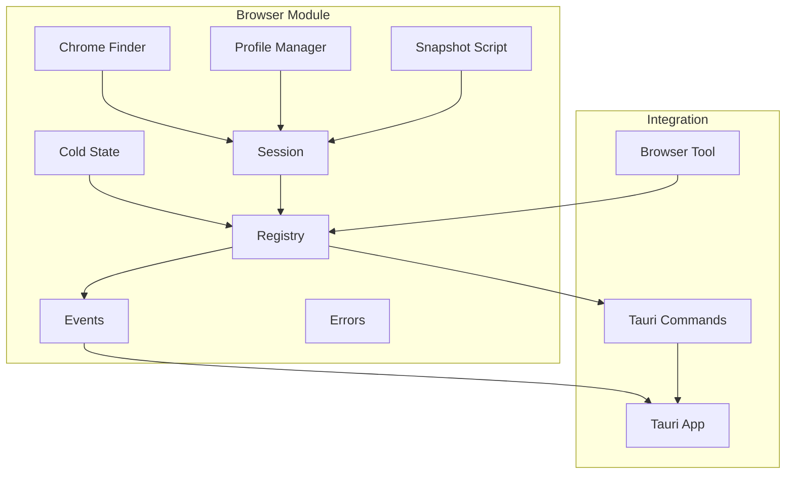
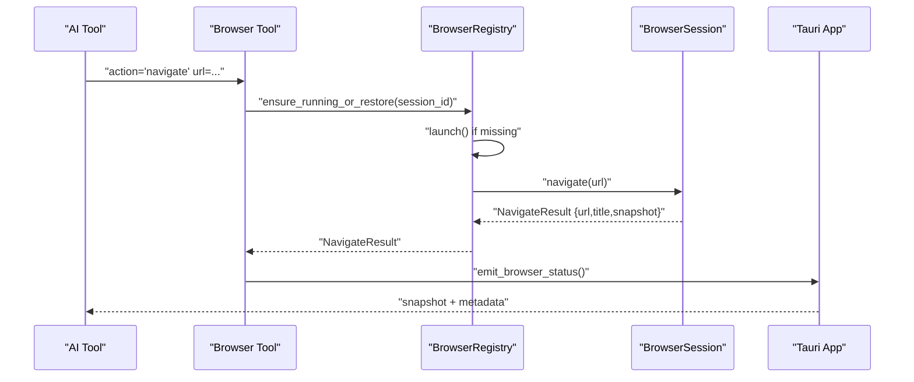
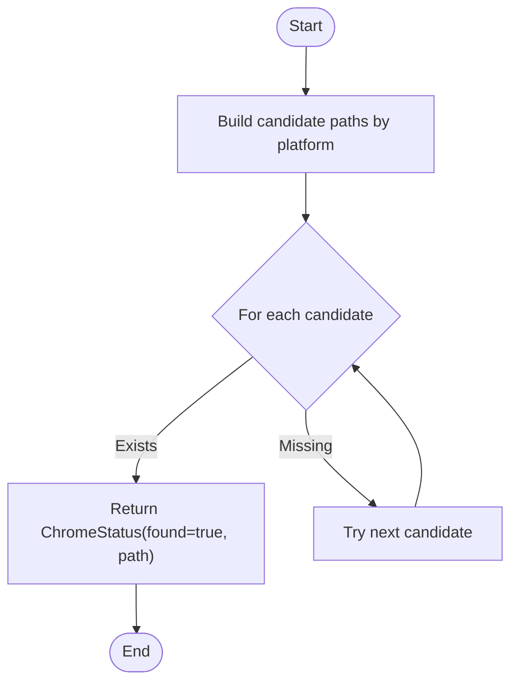
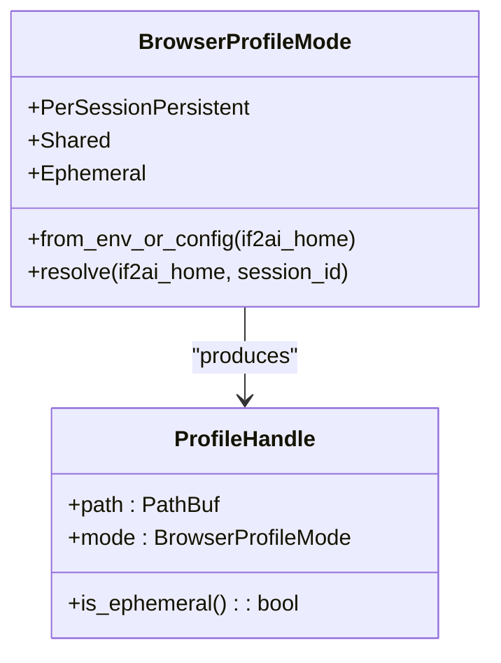
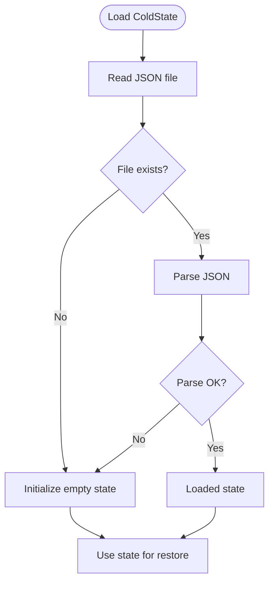
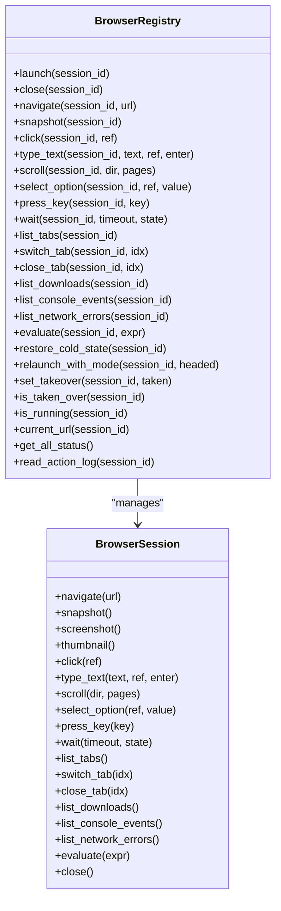
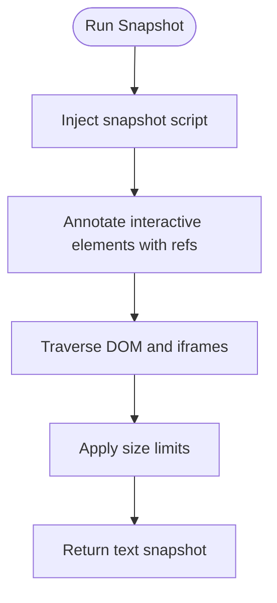
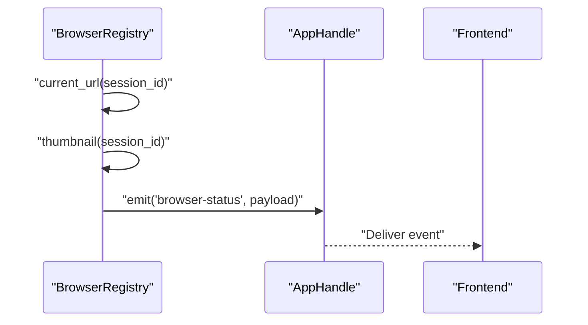
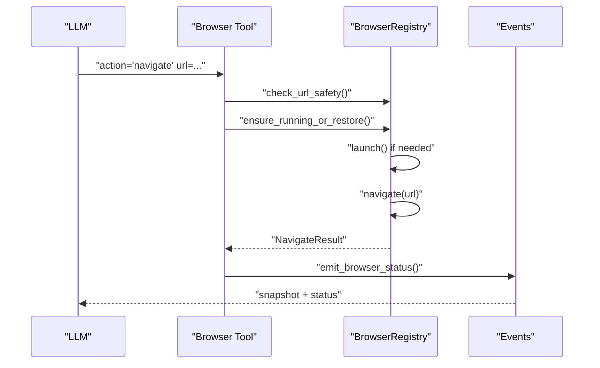
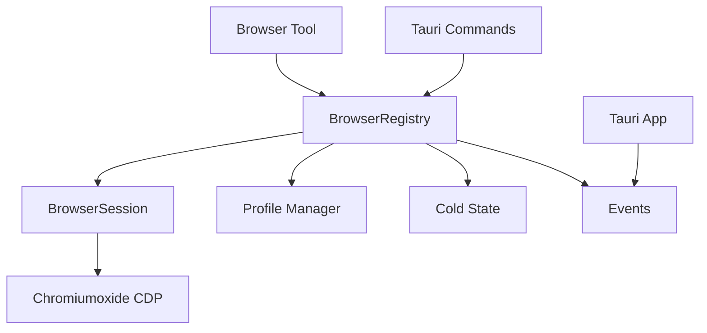

# Browser Automation Modules

<cite>
**Referenced Files in This Document**
- [mod.rs](file://src-tauri/src/modules/browser/mod.rs)
- [chrome_finder.rs](file://src-tauri/src/modules/browser/chrome_finder.rs)
- [cold_state.rs](file://src-tauri/src/modules/browser/cold_state.rs)
- [registry.rs](file://src-tauri/src/modules/browser/registry.rs)
- [session.rs](file://src-tauri/src/modules/browser/session.rs)
- [snapshot.rs](file://src-tauri/src/modules/browser/snapshot.rs)
- [profile.rs](file://src-tauri/src/modules/browser/profile.rs)
- [events.rs](file://src-tauri/src/modules/browser/events.rs)
- [errors.rs](file://src-tauri/src/modules/browser/errors.rs)
- [browser.rs](file://src-tauri/src/commands/browser.rs)
- [browser_tool.rs](file://src-tauri/src/modules/tools/builtin/browser_tool.rs)
- [manager.rs](file://src-tauri/src/modules/session/manager.rs)
</cite>

## Table of Contents
1. [Introduction](#introduction)
2. [Project Structure](#project-structure)
3. [Core Components](#core-components)
4. [Architecture Overview](#architecture-overview)
5. [Detailed Component Analysis](#detailed-component-analysis)
6. [Dependency Analysis](#dependency-analysis)
7. [Performance Considerations](#performance-considerations)
8. [Troubleshooting Guide](#troubleshooting-guide)
9. [Conclusion](#conclusion)

## Introduction
This document describes the browser automation module architecture used by the If2Ai system. It covers the Chrome finder, session management, profile handling, registry systems, cold state management, event handling, snapshot creation, and error handling mechanisms. It also documents browser control patterns, session isolation, automation workflows, integration with the tool system, security considerations, and performance optimizations. Examples are provided for browser initialization, session management, automation scripting, and cleanup procedures.

## Project Structure
The browser automation subsystem resides under `src-tauri/src/modules/browser` and integrates with the broader Tauri application via commands and tools. Key modules include:
- Chrome discovery for locating installed browsers
- Session lifecycle and actions (navigate, click, type, scroll, evaluate, wait)
- Multi-tab support and downloads
- Observability (console/network logs)
- Profile management (persistent/shared/incognito modes)
- Cold state persistence across app restarts
- Event emission for the frontend
- Tool integration for AI-driven automation

**Diagram sources**
- [mod.rs:1-40](file://src-tauri/src/modules/browser/mod.rs#L1-L40)
- [chrome_finder.rs:1-102](file://src-tauri/src/modules/browser/chrome_finder.rs#L1-L102)
- [profile.rs:1-693](file://src-tauri/src/modules/browser/profile.rs#L1-L693)
- [cold_state.rs:1-215](file://src-tauri/src/modules/browser/cold_state.rs#L1-L215)
- [registry.rs:1-634](file://src-tauri/src/modules/browser/registry.rs#L1-L634)
- [session.rs:1-1409](file://src-tauri/src/modules/browser/session.rs#L1-L1409)
- [snapshot.rs:1-253](file://src-tauri/src/modules/browser/snapshot.rs#L1-L253)
- [events.rs:1-83](file://src-tauri/src/modules/browser/events.rs#L1-L83)
- [errors.rs:1-78](file://src-tauri/src/modules/browser/errors.rs#L1-L78)
- [browser.rs:1-224](file://src-tauri/src/commands/browser.rs#L1-L224)
- [browser_tool.rs:1-953](file://src-tauri/src/modules/tools/builtin/browser_tool.rs#L1-L953)

**Section sources**
- [mod.rs:1-40](file://src-tauri/src/modules/browser/mod.rs#L1-L40)

## Core Components
- Chrome Finder: Discovers Chrome/Chromium binaries across platforms and returns the first valid executable.
- Profile Manager: Controls where Chromium stores user data (persistent/shared/incognito) and resolves directories.
- Cold State: Persists last-visited URLs per session across app restarts.
- Registry: Manages per-session BrowserSession instances, coordinates actions, and emits frontend events.
- Session: Wraps a single Chromium process and page, executes actions, and maintains state.
- Snapshot Script: Produces an accessibility tree with element references for AI interaction.
- Events: Emits browser status updates to the frontend.
- Errors: Centralized error types for robust error handling.
- Commands: Tauri IPC endpoints for browser control and profile management.
- Tool: AI-driven browser automation interface integrated with the tool system.

**Section sources**
- [chrome_finder.rs:1-102](file://src-tauri/src/modules/browser/chrome_finder.rs#L1-L102)
- [profile.rs:1-693](file://src-tauri/src/modules/browser/profile.rs#L1-L693)
- [cold_state.rs:1-215](file://src-tauri/src/modules/browser/cold_state.rs#L1-L215)
- [registry.rs:1-634](file://src-tauri/src/modules/browser/registry.rs#L1-L634)
- [session.rs:1-1409](file://src-tauri/src/modules/browser/session.rs#L1-L1409)
- [snapshot.rs:1-253](file://src-tauri/src/modules/browser/snapshot.rs#L1-L253)
- [events.rs:1-83](file://src-tauri/src/modules/browser/events.rs#L1-L83)
- [errors.rs:1-78](file://src-tauri/src/modules/browser/errors.rs#L1-L78)
- [browser.rs:1-224](file://src-tauri/src/commands/browser.rs#L1-L224)
- [browser_tool.rs:1-953](file://src-tauri/src/modules/tools/builtin/browser_tool.rs#L1-L953)

## Architecture Overview
The browser automation architecture centers around a registry that owns per-session BrowserSession instances. The registry coordinates launching, navigating, and controlling Chromium via the Chrome DevTools Protocol. Profiles isolate sessions and persist state when configured. Cold state ensures continuity across restarts. The tool system routes AI requests to the registry, and events keep the frontend synchronized.

**Diagram sources**
- [browser_tool.rs:350-476](file://src-tauri/src/modules/tools/builtin/browser_tool.rs#L350-L476)
- [registry.rs:241-261](file://src-tauri/src/modules/browser/registry.rs#L241-L261)
- [session.rs:618-656](file://src-tauri/src/modules/browser/session.rs#L618-L656)
- [events.rs:51-82](file://src-tauri/src/modules/browser/events.rs#L51-L82)

## Detailed Component Analysis

### Chrome Finder
- Purpose: Locate Chrome/Chromium executables across macOS, Linux, and Windows.
- Behavior: Builds a platform-specific candidate list and returns the first valid file path.
- Output: ChromeStatus indicating presence and path.

**Diagram sources**
- [chrome_finder.rs:8-84](file://src-tauri/src/modules/browser/chrome_finder.rs#L8-L84)

**Section sources**
- [chrome_finder.rs:1-102](file://src-tauri/src/modules/browser/chrome_finder.rs#L1-L102)

### Profile Management
- Modes:
  - PerSessionPersistent: One persistent directory per session under a profiles root.
  - Shared: Single shared directory for all sessions.
  - Ephemeral: Temporary directory per session, deleted on drop.
- Resolution: Resolves mode from environment variable, config file, or default.
- Persistence: Profiles survive app restarts except ephemeral mode; manual cleanup via command.

**Diagram sources**
- [profile.rs:62-168](file://src-tauri/src/modules/browser/profile.rs#L62-L168)

**Section sources**
- [profile.rs:1-693](file://src-tauri/src/modules/browser/profile.rs#L1-L693)

### Cold State Persistence
- Purpose: Persist last-visited URL per session across app restarts.
- Storage: JSON file under user data root; load/save operations are resilient to corruption.
- API: set(session_id, url), remove(session_id), get(session_id).

**Diagram sources**
- [cold_state.rs:44-80](file://src-tauri/src/modules/browser/cold_state.rs#L44-L80)

**Section sources**
- [cold_state.rs:1-215](file://src-tauri/src/modules/browser/cold_state.rs#L1-L215)

### Registry and Session Lifecycle
- Registry:
  - Manages per-session BrowserSession behind an Arc<Mutex<>> map.
  - Supports launching, closing, navigating, snapshotting, clicking, typing, scrolling, evaluating, waiting, multi-tab operations, downloads, and observability.
  - Maintains last-known URLs and takeover flags for human-in-the-loop scenarios.
  - Persists cold state and emits browser status events.
- Session:
  - Wraps a Chromiumoxide Browser and Page.
  - Implements actions with post-action delays and navigation waits.
  - Tracks downloads, console/network events, and action logs.
  - Supports stealth mode and snapshot generation.

**Diagram sources**
- [registry.rs:44-588](file://src-tauri/src/modules/browser/registry.rs#L44-L588)
- [session.rs:263-1220](file://src-tauri/src/modules/browser/session.rs#L263-L1220)

**Section sources**
- [registry.rs:1-634](file://src-tauri/src/modules/browser/registry.rs#L1-L634)
- [session.rs:1-1409](file://src-tauri/src/modules/browser/session.rs#L1-L1409)

### Snapshot Creation
- Purpose: Produce an accessibility tree with element references for AI interaction.
- Implementation: Injects a JavaScript snapshot script that annotates interactive elements with data-if2ai-ref attributes and returns a structured text representation.
- Includes same-origin iframe traversal and size limits.

**Diagram sources**
- [snapshot.rs:25-223](file://src-tauri/src/modules/browser/snapshot.rs#L25-L223)
- [session.rs:544-561](file://src-tauri/src/modules/browser/session.rs#L544-L561)

**Section sources**
- [snapshot.rs:1-253](file://src-tauri/src/modules/browser/snapshot.rs#L1-L253)
- [session.rs:544-561](file://src-tauri/src/modules/browser/session.rs#L544-L561)

### Event Handling
- Purpose: Emit live browser status to the frontend, including running state, URL, and thumbnails.
- Concurrency: Asynchronous emission to avoid blocking tool execution.
- Failure handling: Thumbnail failures degrade gracefully; emit failures are logged.

**Diagram sources**
- [events.rs:51-82](file://src-tauri/src/modules/browser/events.rs#L51-L82)
- [registry.rs:533-572](file://src-tauri/src/modules/browser/registry.rs#L533-L572)

**Section sources**
- [events.rs:1-83](file://src-tauri/src/modules/browser/events.rs#L1-L83)
- [registry.rs:533-572](file://src-tauri/src/modules/browser/registry.rs#L533-L572)

### Error Handling
- Centralized BrowserError enum covers Chrome not found, session not found, CDP errors, timeouts, ref not found, snapshot/screenshot failures, evaluate errors, cold state I/O, profile errors, tab index out of range, and oversized evaluate expressions.
- Propagation: Errors are mapped to user-friendly messages and logged appropriately.

**Section sources**
- [errors.rs:1-78](file://src-tauri/src/modules/browser/errors.rs#L1-L78)

### Integration with the Tool System
- Tool entry: Defines the "browser" tool with actions (start, stop, navigate, snapshot, screenshot, click, type, scroll, select, key, wait, evaluate, tabs, switch_tab, close_tab, downloads, console, network).
- Safety: URL safety checks prevent SSRF and RFC-1918 addresses.
- Human takeover: Registry supports relaunching sessions in headed mode and pausing AI actions during user takeover.
- Multimodal: Screenshot action emits a real image part for vision-capable models.

**Diagram sources**
- [browser_tool.rs:350-476](file://src-tauri/src/modules/tools/builtin/browser_tool.rs#L350-L476)
- [events.rs:51-82](file://src-tauri/src/modules/browser/events.rs#L51-L82)

**Section sources**
- [browser_tool.rs:1-953](file://src-tauri/src/modules/tools/builtin/browser_tool.rs#L1-L953)

### Session Isolation and Automation Workflows
- Isolation: Each chat session owns a BrowserSession with its own profile directory and process.
- Workflows:
  - Initialization: Launch headless or headed session depending on mode.
  - Navigation: Navigate to URL, wait for readiness, capture snapshot.
  - Interaction: Click, type, scroll, select, press keys, wait for state changes.
  - Multi-tab: List, switch, and close tabs; enforce tab limits.
  - Downloads: Track downloads with progress and state.
  - Observability: Capture console and network errors for debugging.
  - Cleanup: Close session and remove cold state records.

**Section sources**
- [registry.rs:163-237](file://src-tauri/src/modules/browser/registry.rs#L163-L237)
- [session.rs:618-1220](file://src-tauri/src/modules/browser/session.rs#L618-L1220)

### Security Considerations
- URL safety: Strict checks for schemes, private ranges, and blocked hostnames.
- Stealth mode: Removes automation indicators and sets realistic user agent.
- Sandbox bypass: Disables sandbox-related flags for child process compatibility.
- Human takeover: Pauses AI actions during user-controlled sessions.

**Section sources**
- [browser_tool.rs:47-141](file://src-tauri/src/modules/tools/builtin/browser_tool.rs#L47-L141)
- [session.rs:471-477](file://src-tauri/src/modules/browser/session.rs#L471-L477)
- [registry.rs:464-497](file://src-tauri/src/modules/browser/registry.rs#L464-L497)

### Performance Optimizations
- Post-action delays: Configured delays after clicks, typing, scrolling, and key presses to allow page settling.
- Network idle waits: Efficient polling with bounded ticks and quiet window to avoid busy loops.
- Snapshot limits: Cap snapshot size and truncate at line boundaries.
- Thumbnail sizing: Lower quality for thumbnails to reduce payload size.
- Async concurrency: DashMap for concurrent access, Arc<Mutex<>> for session locking, and background watchers for downloads and observability.

**Section sources**
- [session.rs:215-231](file://src-tauri/src/modules/browser/session.rs#L215-L231)
- [session.rs:890-966](file://src-tauri/src/modules/browser/session.rs#L890-L966)
- [snapshot.rs:209-216](file://src-tauri/src/modules/browser/snapshot.rs#L209-L216)
- [registry.rs:77-103](file://src-tauri/src/modules/browser/registry.rs#L77-L103)

## Dependency Analysis
The browser module depends on Chromiumoxide for CDP communication, Tokio for async operations, and Tauri for event emission and IPC. The tool system orchestrates requests to the registry, which coordinates with sessions and profiles.

**Diagram sources**
- [browser_tool.rs:149-164](file://src-tauri/src/modules/tools/builtin/browser_tool.rs#L149-L164)
- [registry.rs:1-634](file://src-tauri/src/modules/browser/registry.rs#L1-L634)
- [session.rs:1-1409](file://src-tauri/src/modules/browser/session.rs#L1-L1409)
- [browser.rs:1-224](file://src-tauri/src/commands/browser.rs#L1-L224)

**Section sources**
- [browser_tool.rs:1-953](file://src-tauri/src/modules/tools/builtin/browser_tool.rs#L1-L953)
- [browser.rs:1-224](file://src-tauri/src/commands/browser.rs#L1-L224)

## Performance Considerations
- Use headless mode for production to reduce GPU overhead.
- Prefer persistent profiles for state continuity; use shared mode for cross-session collaboration.
- Monitor tab counts and enforce limits to prevent resource exhaustion.
- Leverage network idle waits for SPA applications to avoid premature action completion.
- Keep snapshot sizes reasonable and avoid excessive evaluate calls.

## Troubleshooting Guide
Common issues and resolutions:
- Chrome not found: Install Google Chrome or Chromium; the finder will locate it automatically.
- Session not running: Call "start" or ensure automatic launch on navigate.
- Element not found: Take a fresh snapshot to refresh references; ensure the element is visible.
- CDP errors: The system attempts to recover by resetting the session; retry the action.
- URL safety violations: Use only http/https schemes and avoid private ranges.
- Human takeover: Wait for user to release control or request takeover release.

**Section sources**
- [errors.rs:1-78](file://src-tauri/src/modules/browser/errors.rs#L1-L78)
- [browser_tool.rs:372-378](file://src-tauri/src/modules/tools/builtin/browser_tool.rs#L372-L378)
- [registry.rs:464-497](file://src-tauri/src/modules/browser/registry.rs#L464-L497)

## Conclusion
The browser automation module provides a robust, secure, and performant system for AI-driven web interaction. It isolates sessions, preserves state across restarts, and integrates seamlessly with the tool system and frontend. By leveraging profiles, cold state, and observability, it supports reliable automation workflows while maintaining safety and performance.