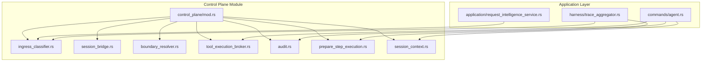
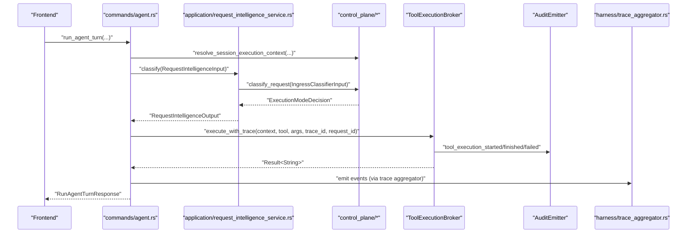
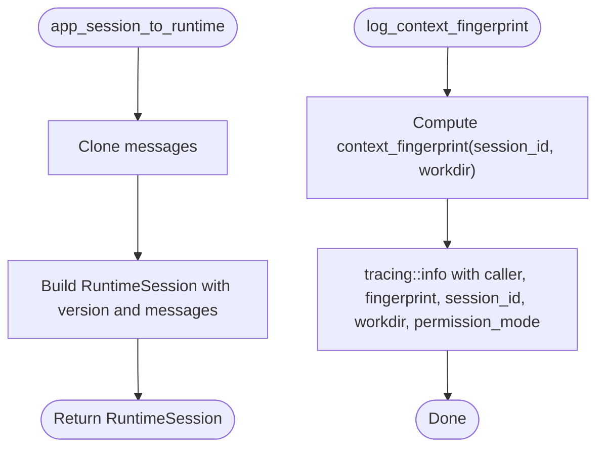
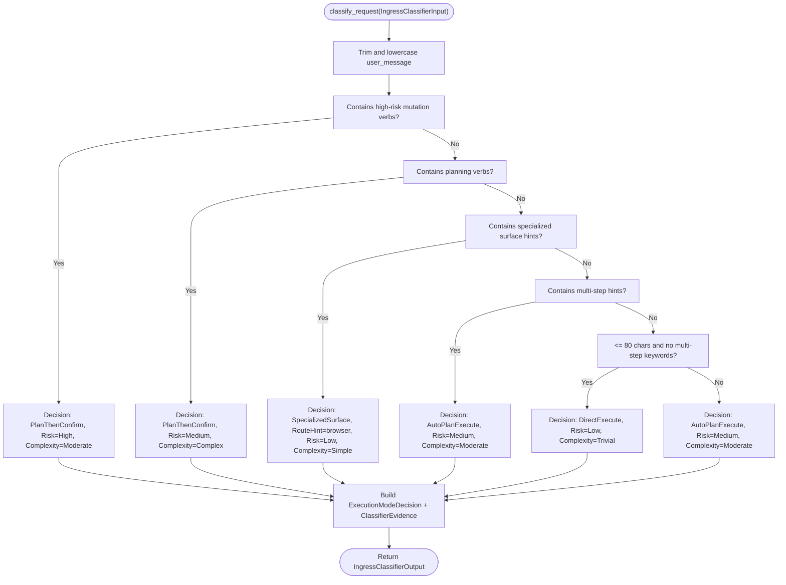
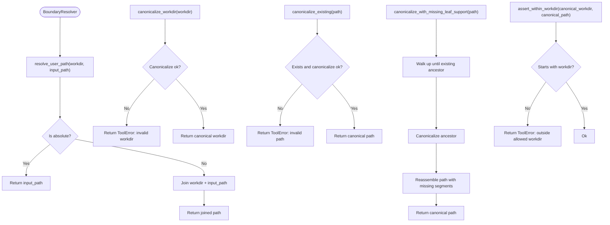
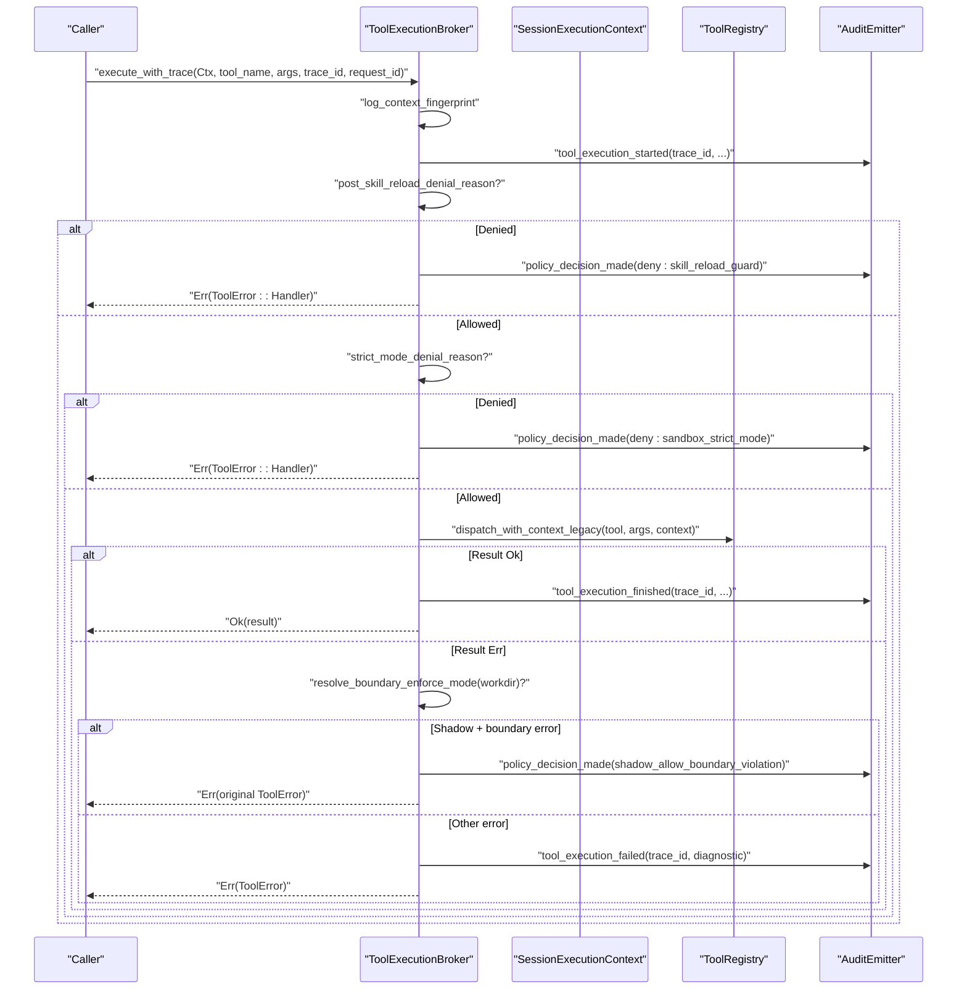
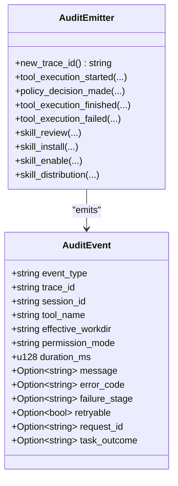
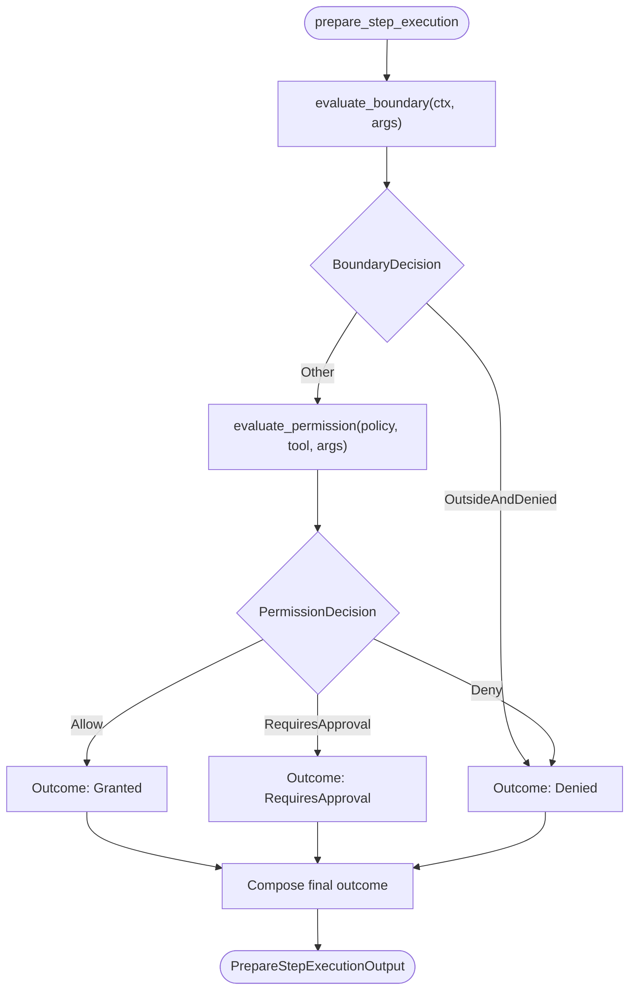
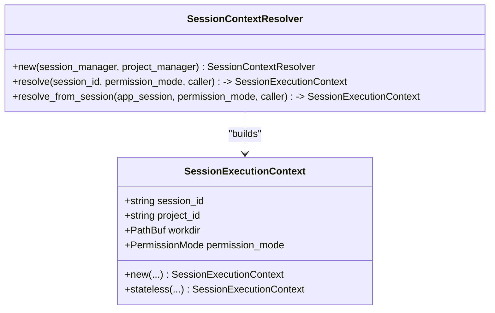
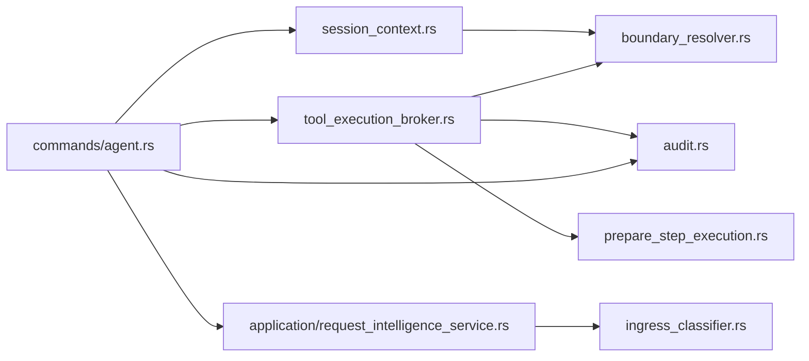

# Control Plane

<cite>
**Referenced Files in This Document**
- [mod.rs](file://src-tauri/src/modules/control_plane/mod.rs)
- [session_bridge.rs](file://src-tauri/src/modules/control_plane/session_bridge.rs)
- [ingress_classifier.rs](file://src-tauri/src/modules/control_plane/ingress_classifier.rs)
- [boundary_resolver.rs](file://src-tauri/src/modules/control_plane/boundary_resolver.rs)
- [tool_execution_broker.rs](file://src-tauri/src/modules/control_plane/tool_execution_broker.rs)
- [audit.rs](file://src-tauri/src/modules/control_plane/audit.rs)
- [prepare_step_execution.rs](file://src-tauri/src/modules/control_plane/prepare_step_execution.rs)
- [session_context.rs](file://src-tauri/src/modules/control_plane/session_context.rs)
- [request_intelligence_service.rs](file://src-tauri/src/modules/application/request_intelligence_service.rs)
- [agent.rs](file://src-tauri/src/commands/agent.rs)
- [trace_aggregator.rs](file://src-tauri/src/modules/harness/trace_aggregator.rs)
</cite>

## Table of Contents
1. [Introduction](#introduction)
2. [Project Structure](#project-structure)
3. [Core Components](#core-components)
4. [Architecture Overview](#architecture-overview)
5. [Detailed Component Analysis](#detailed-component-analysis)
6. [Dependency Analysis](#dependency-analysis)
7. [Performance Considerations](#performance-considerations)
8. [Troubleshooting Guide](#troubleshooting-guide)
9. [Conclusion](#conclusion)
10. [Appendices](#appendices)

## Introduction
This document explains the control plane module architecture that orchestrates session-aware tool execution, enforces execution modes, and governs policy decisions. It focuses on the session bridge, ingress classifier, boundary resolver, tool execution broker, and the audit system. It also documents session context management, step preparation mechanisms, event handling patterns, telemetry and reporting, and integration with the agent loop harness and evaluation systems.

## Project Structure
The control plane resides under the Rust module tree and exposes a clean public API surface for the rest of the application. The module exports typed contracts for classification, execution preparation, session context resolution, and tool execution orchestration.

**Diagram sources**
- [mod.rs:1-32](file://src-tauri/src/modules/control_plane/mod.rs#L1-L32)
- [ingress_classifier.rs:1-310](file://src-tauri/src/modules/control_plane/ingress_classifier.rs#L1-L310)
- [session_bridge.rs:1-34](file://src-tauri/src/modules/control_plane/session_bridge.rs#L1-L34)
- [boundary_resolver.rs:1-99](file://src-tauri/src/modules/control_plane/boundary_resolver.rs#L1-L99)
- [tool_execution_broker.rs:1-358](file://src-tauri/src/modules/control_plane/tool_execution_broker.rs#L1-L358)
- [audit.rs:1-322](file://src-tauri/src/modules/control_plane/audit.rs#L1-L322)
- [prepare_step_execution.rs:1-336](file://src-tauri/src/modules/control_plane/prepare_step_execution.rs#L1-L336)
- [session_context.rs:1-138](file://src-tauri/src/modules/control_plane/session_context.rs#L1-L138)
- [request_intelligence_service.rs:1-81](file://src-tauri/src/modules/application/request_intelligence_service.rs#L1-L81)
- [agent.rs:1-200](file://src-tauri/src/commands/agent.rs#L1-L200)
- [trace_aggregator.rs:680-804](file://src-tauri/src/modules/harness/trace_aggregator.rs#L680-L804)

**Section sources**
- [mod.rs:1-32](file://src-tauri/src/modules/control_plane/mod.rs#L1-L32)

## Core Components
- Session Bridge: Converts application session to runtime session and logs context fingerprints for debugging.
- Ingress Classifier: Heuristic-based routing of requests into canonical execution modes with explainability.
- Boundary Resolver: Canonical path resolution and workdir boundary checks for safe tool execution.
- Tool Execution Broker: Orchestrates session-aware tool dispatch, audits, and policy enforcement.
- Audit System: Structured audit events for tool execution lifecycle and governance.
- Step Preparation: Typed preflight decisions (boundary, permission, sandbox) prior to tool execution.
- Session Context: Immutable execution snapshot binding session, project, workdir, and permission mode.

**Section sources**
- [session_bridge.rs:1-34](file://src-tauri/src/modules/control_plane/session_bridge.rs#L1-L34)
- [ingress_classifier.rs:1-310](file://src-tauri/src/modules/control_plane/ingress_classifier.rs#L1-L310)
- [boundary_resolver.rs:1-99](file://src-tauri/src/modules/control_plane/boundary_resolver.rs#L1-L99)
- [tool_execution_broker.rs:1-358](file://src-tauri/src/modules/control_plane/tool_execution_broker.rs#L1-L358)
- [audit.rs:1-322](file://src-tauri/src/modules/control_plane/audit.rs#L1-L322)
- [prepare_step_execution.rs:1-336](file://src-tauri/src/modules/control_plane/prepare_step_execution.rs#L1-L336)
- [session_context.rs:1-138](file://src-tauri/src/modules/control_plane/session_context.rs#L1-L138)

## Architecture Overview
The control plane centralizes runtime decisions and execution orchestration, keeping command handlers thin. The request intelligence service wraps the ingress classifier for application consumption. The agent command integrates session context resolution, classification, and tool execution via the broker, emitting structured audit events and integrating with the harness trace aggregator for evaluation and reporting.

**Diagram sources**
- [agent.rs:160-200](file://src-tauri/src/commands/agent.rs#L160-L200)
- [request_intelligence_service.rs:43-61](file://src-tauri/src/modules/application/request_intelligence_service.rs#L43-L61)
- [ingress_classifier.rs:76-245](file://src-tauri/src/modules/control_plane/ingress_classifier.rs#L76-L245)
- [tool_execution_broker.rs:146-266](file://src-tauri/src/modules/control_plane/tool_execution_broker.rs#L146-L266)
- [audit.rs:105-214](file://src-tauri/src/modules/control_plane/audit.rs#L105-L214)
- [trace_aggregator.rs:680-804](file://src-tauri/src/modules/harness/trace_aggregator.rs#L680-L804)

## Detailed Component Analysis

### Session Bridge
- Purpose: Convert application session to runtime session and log context fingerprints for debugging.
- Key responsibilities:
  - Transform application session messages into runtime session form.
  - Compute and log a context fingerprint combining session_id and workdir for observability.

**Diagram sources**
- [session_bridge.rs:11-33](file://src-tauri/src/modules/control_plane/session_bridge.rs#L11-L33)

**Section sources**
- [session_bridge.rs:1-34](file://src-tauri/src/modules/control_plane/session_bridge.rs#L1-L34)

### Ingress Classifier
- Purpose: Heuristic gate that determines canonical execution mode for a chat request.
- Behavior:
  - Deterministic rules detect risk, planning, specialized surface hints, multi-step cues, and short direct requests.
  - Produces ExecutionModeDecision with risk/complexity levels, reason codes, optional route hint, and policy version.
- Policy version: "ingress-classifier@m1.6-skeleton".
- Evidence: ClassifierEvidence with matched rule ids and slot summary.

**Diagram sources**
- [ingress_classifier.rs:76-245](file://src-tauri/src/modules/control_plane/ingress_classifier.rs#L76-L245)

**Section sources**
- [ingress_classifier.rs:1-310](file://src-tauri/src/modules/control_plane/ingress_classifier.rs#L1-L310)

### Boundary Resolver
- Purpose: Unified filesystem boundary resolver for tool execution safety.
- Capabilities:
  - Resolve user-provided path against workdir.
  - Canonicalize workdir and paths, including missing leaf support.
  - Assert that canonical paths remain within the canonical workdir.
- Errors: Returns ToolError with descriptive messages for invalid paths or boundary violations.

**Diagram sources**
- [boundary_resolver.rs:11-98](file://src-tauri/src/modules/control_plane/boundary_resolver.rs#L11-L98)

**Section sources**
- [boundary_resolver.rs:1-99](file://src-tauri/src/modules/control_plane/boundary_resolver.rs#L1-L99)

### Tool Execution Broker
- Purpose: Orchestrates session-aware tool execution with auditing and policy enforcement.
- Responsibilities:
  - Build SharedToolContext from SessionExecutionContext.
  - Dispatch tool execution with trace_id and request_id.
  - Enforce policy gates:
    - Post-skill-reload guard denies repeated skill_view/read_file of skill files.
    - Strict mode denial prevents shell tools when sandbox is disabled.
    - Shadow boundary enforcement preserves original error semantics when boundary violations occur under shadow mode.
  - Emit structured audit events for lifecycle and failures.
  - Track skill reload guard state per request_id.

**Diagram sources**
- [tool_execution_broker.rs:146-266](file://src-tauri/src/modules/control_plane/tool_execution_broker.rs#L146-L266)
- [audit.rs:105-214](file://src-tauri/src/modules/control_plane/audit.rs#L105-L214)

**Section sources**
- [tool_execution_broker.rs:1-358](file://src-tauri/src/modules/control_plane/tool_execution_broker.rs#L1-L358)

### Audit System
- Purpose: Structured audit events for tool execution lifecycle and governance actions.
- Event types:
  - tool_execution_started
  - policy_decision_made
  - tool_execution_finished
  - tool_execution_failed
  - skill_review, skill_install, skill_enable, skill_distribution
- Fields: trace_id, session_id, tool_name, effective_workdir, permission_mode, duration_ms, optional message/error_code/failure_stage/retryable/request_id/task_outcome.
- Emission targets structured logs for downstream aggregation and evaluation.

**Diagram sources**
- [audit.rs:7-322](file://src-tauri/src/modules/control_plane/audit.rs#L7-L322)

**Section sources**
- [audit.rs:1-322](file://src-tauri/src/modules/control_plane/audit.rs#L1-L322)

### Step Preparation Mechanism
- Purpose: Typed preflight decisions before tool execution.
- Decision pipeline:
  - Boundary: WithinWorkdir vs OutsideButAllowed vs OutsideAndDenied vs NotApplicable.
  - Permission: Allow vs RequiresApproval vs Deny.
  - Sandbox: Placeholder (None in skeleton).
- Outcome: Granted / RequiresApproval / Denied.
- Policy version: "prepare-step@m1.8-skeleton".

**Diagram sources**
- [prepare_step_execution.rs:139-164](file://src-tauri/src/modules/control_plane/prepare_step_execution.rs#L139-L164)

**Section sources**
- [prepare_step_execution.rs:1-336](file://src-tauri/src/modules/control_plane/prepare_step_execution.rs#L1-L336)

### Session Context Management
- Purpose: Provide immutable execution context for a session-scoped tool flow.
- Inputs: session_id, project_id, workdir, permission_mode.
- Resolution:
  - Resolve workdir from project when available; fallback to current directory on error.
  - Log resolved context for observability.

**Diagram sources**
- [session_context.rs:10-138](file://src-tauri/src/modules/control_plane/session_context.rs#L10-L138)

**Section sources**
- [session_context.rs:1-138](file://src-tauri/src/modules/control_plane/session_context.rs#L1-L138)

### Request Intelligence Service
- Purpose: Thin application wrapper around the ingress classifier.
- Inputs: user_message, session_id, project_id, workdir.
- Output: typed ExecutionModeDecision.
- Guarantees: Always succeeds with deterministic gate; future LLM escalation will be isolated here.

**Section sources**
- [request_intelligence_service.rs:1-81](file://src-tauri/src/modules/application/request_intelligence_service.rs#L1-L81)

### Integration with Agent Loop Harness and Evaluation
- The harness trace aggregator consumes control plane events and evidence:
  - Execution mode judgments (policy version pinned).
  - Prepare-step outcomes (boundary, permission, sandbox, policy version).
- The agent command emits lifecycle events and integrates with the broker and audit emitter.

**Section sources**
- [trace_aggregator.rs:680-804](file://src-tauri/src/modules/harness/trace_aggregator.rs#L680-L804)
- [agent.rs:160-200](file://src-tauri/src/commands/agent.rs#L160-L200)

## Dependency Analysis
- Cohesion: Control plane modules are cohesive around execution orchestration and governance.
- Coupling:
  - ToolExecutionBroker depends on ToolRegistry, AuditEmitter, and runtime config for boundary enforcement.
  - SessionContextResolver depends on SessionManager and ProjectManager.
  - RequestIntelligenceService depends on IngressClassifier.
  - Agent command integrates SessionContextResolver, RequestIntelligenceService, ToolExecutionBroker, and AuditEmitter.
- External integrations:
  - Runtime configuration for boundary enforcement mode and sandbox strict mode.
  - Environment variables for boundary enforcement and sandbox strict mode overrides.

**Diagram sources**
- [agent.rs:120-148](file://src-tauri/src/commands/agent.rs#L120-L148)
- [session_context.rs:52-67](file://src-tauri/src/modules/control_plane/session_context.rs#L52-L67)
- [tool_execution_broker.rs:109-144](file://src-tauri/src/modules/control_plane/tool_execution_broker.rs#L109-L144)
- [audit.rs:31-41](file://src-tauri/src/modules/control_plane/audit.rs#L31-L41)
- [request_intelligence_service.rs:24-27](file://src-tauri/src/modules/application/request_intelligence_service.rs#L24-L27)
- [ingress_classifier.rs:34-37](file://src-tauri/src/modules/control_plane/ingress_classifier.rs#L34-L37)
- [boundary_resolver.rs:8-9](file://src-tauri/src/modules/control_plane/boundary_resolver.rs#L8-L9)
- [prepare_step_execution.rs:39-41](file://src-tauri/src/modules/control_plane/prepare_step_execution.rs#L39-L41)

**Section sources**
- [agent.rs:120-148](file://src-tauri/src/commands/agent.rs#L120-L148)
- [tool_execution_broker.rs:109-144](file://src-tauri/src/modules/control_plane/tool_execution_broker.rs#L109-L144)

## Performance Considerations
- Classification is O(n) over message length with constant-time rule checks; negligible overhead.
- Path canonicalization and boundary checks are linear in path depth; ensure minimal path traversal.
- Audit emission is lightweight structured logging; consider batching in high-throughput scenarios.
- Broker maintains a per-request guard in memory; TTL ensures cleanup of stale entries.

## Troubleshooting Guide
- Boundary errors:
  - Symptom: ToolError mentioning workdir boundary violation.
  - Action: Verify workdir canonicalization and path resolution; check IF2AI_BOUNDARY_ENFORCE_MODE and runtime config.
- Strict mode denials:
  - Symptom: Shell tools blocked when sandbox is disabled.
  - Action: Set IF2AI_SANDBOX_STRICT_MODE=0 or enable sandbox in runtime config.
- Post-skill-reload guard:
  - Symptom: Repeated skill_view/read_file of skill files denied.
  - Action: Use existing skill tool result and continue the task; avoid reloading in the same turn.
- Audit visibility:
  - Use structured logs with target "if2ai.audit" to inspect lifecycle and failure diagnostics.

**Section sources**
- [tool_execution_broker.rs:216-234](file://src-tauri/src/modules/control_plane/tool_execution_broker.rs#L216-L234)
- [tool_execution_broker.rs:325-357](file://src-tauri/src/modules/control_plane/tool_execution_broker.rs#L325-L357)
- [audit.rs:185-214](file://src-tauri/src/modules/control_plane/audit.rs#L185-L214)

## Conclusion
The control plane module provides a robust, auditable, and policy-enforced foundation for session-aware tool execution. It separates classification, boundary enforcement, permission gating, and execution orchestration into cohesive components, integrates tightly with the agent loop harness for evaluation, and offers clear extension points for future governance slices.

## Appendices

### Control Plane Initialization Example
- Initialize SessionContextResolver with session and project managers.
- Resolve SessionExecutionContext from an AppSession and permission mode.
- Use RequestIntelligenceService to classify incoming requests.
- Execute tools via ToolExecutionBroker with trace_id and request_id.

**Section sources**
- [session_context.rs:52-67](file://src-tauri/src/modules/control_plane/session_context.rs#L52-L67)
- [agent.rs:120-132](file://src-tauri/src/commands/agent.rs#L120-L132)
- [request_intelligence_service.rs:43-61](file://src-tauri/src/modules/application/request_intelligence_service.rs#L43-L61)
- [tool_execution_broker.rs:146-158](file://src-tauri/src/modules/control_plane/tool_execution_broker.rs#L146-L158)

### Request Classification Workflow
- Wrap user message and session/project/workdir into RequestIntelligenceInput.
- Call classify to obtain ExecutionModeDecision.
- Use decision to route execution mode enforcement and UI hints.

**Section sources**
- [request_intelligence_service.rs:29-61](file://src-tauri/src/modules/application/request_intelligence_service.rs#L29-L61)
- [ingress_classifier.rs:58-245](file://src-tauri/src/modules/control_plane/ingress_classifier.rs#L58-L245)

### Execution Coordination Pattern
- Resolve session execution context.
- Classify request to determine execution mode.
- Prepare step execution (boundary, permission, sandbox).
- Execute tool via broker with audit emission.
- Report outcomes to harness trace aggregator.

**Section sources**
- [agent.rs:160-200](file://src-tauri/src/commands/agent.rs#L160-L200)
- [prepare_step_execution.rs:139-164](file://src-tauri/src/modules/control_plane/prepare_step_execution.rs#L139-L164)
- [tool_execution_broker.rs:146-266](file://src-tauri/src/modules/control_plane/tool_execution_broker.rs#L146-L266)
- [trace_aggregator.rs:775-802](file://src-tauri/src/modules/harness/trace_aggregator.rs#L775-L802)