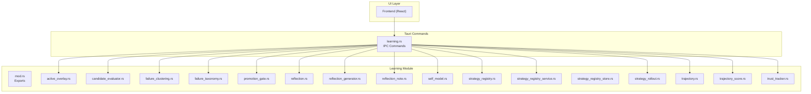
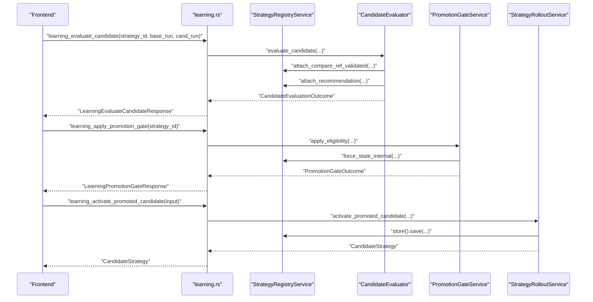
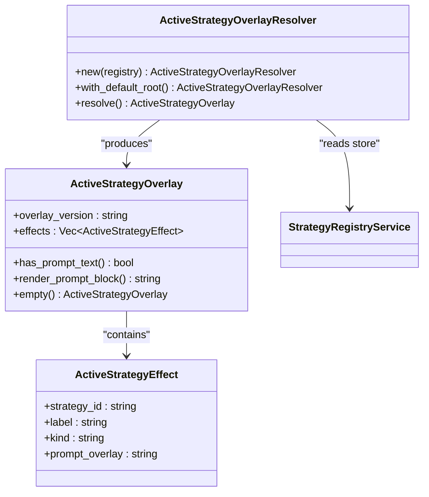
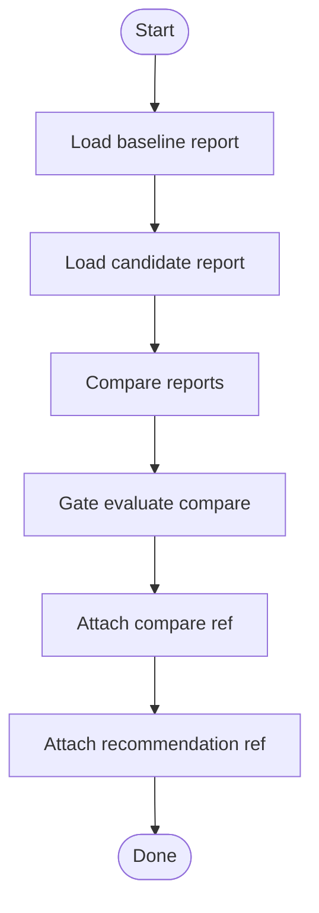
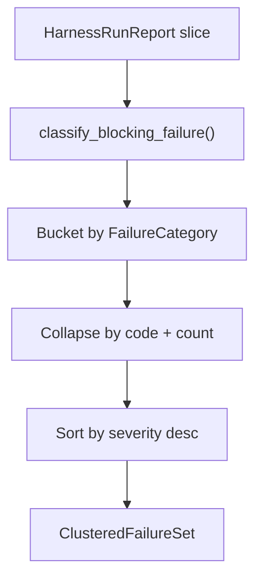
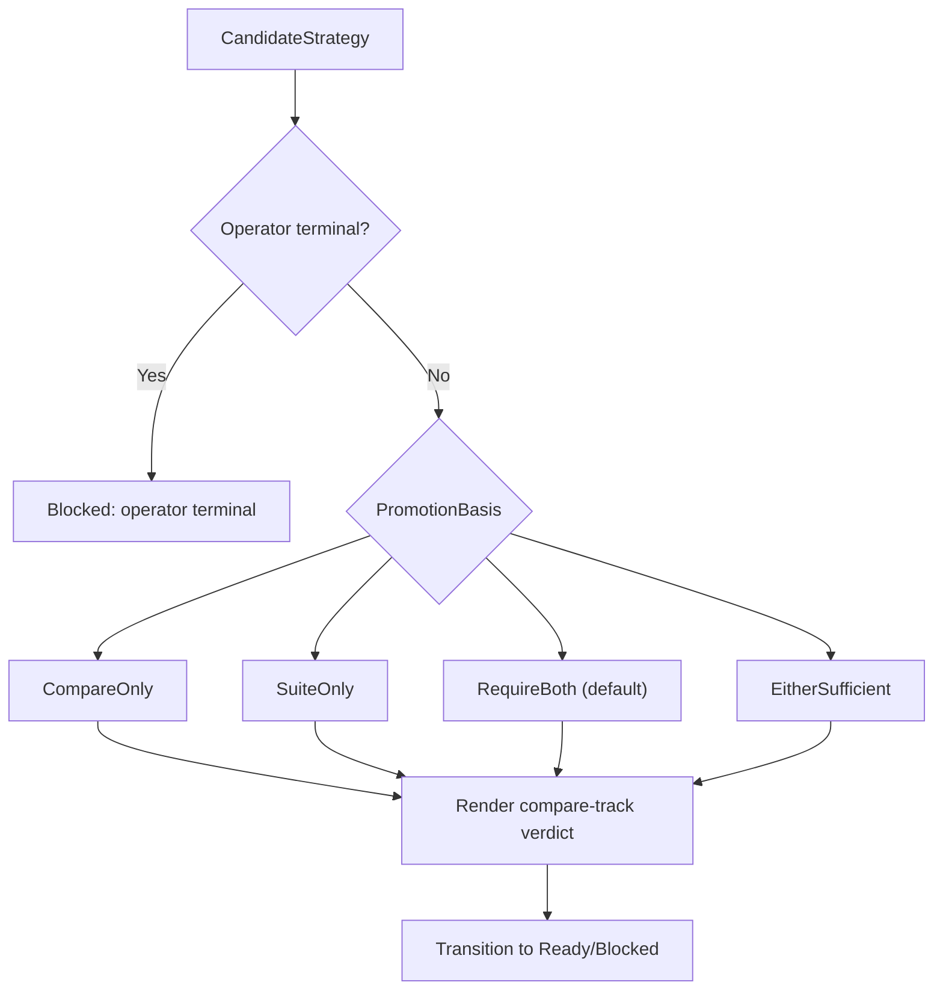
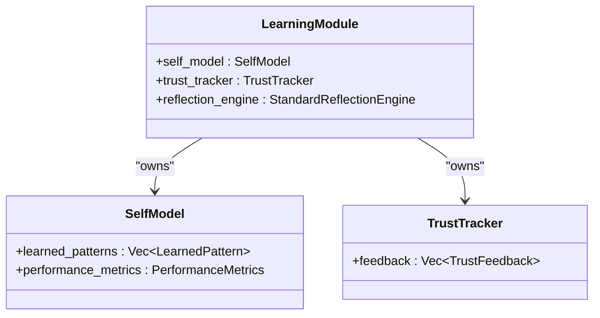
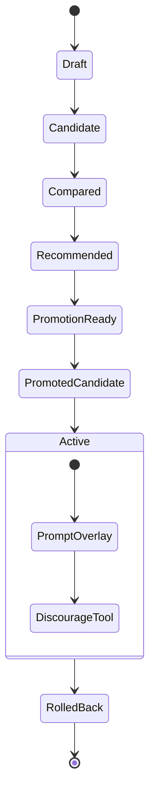
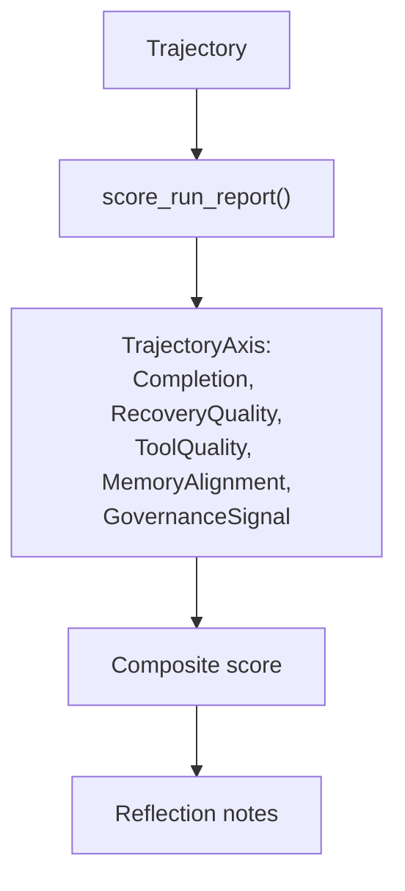
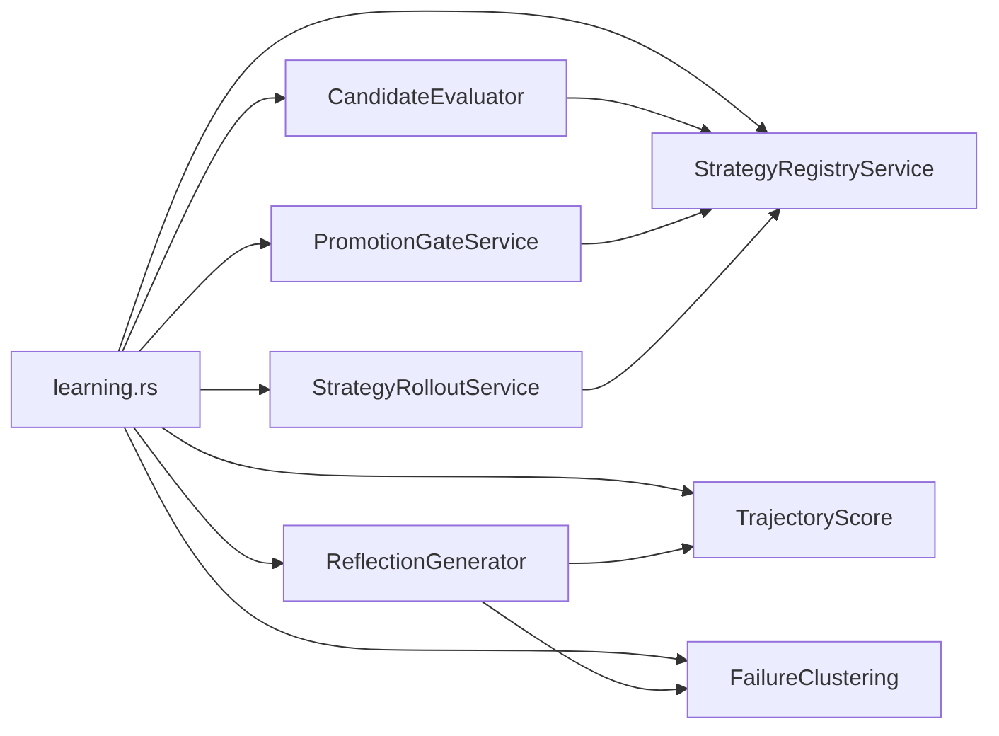

# Learning System Modules

<cite>
**Referenced Files in This Document**
- [learning.rs](file://src-tauri/src/commands/learning.rs)
- [mod.rs](file://src-tauri/src/modules/learning/mod.rs)
- [active_overlay.rs](file://src-tauri/src/modules/learning/active_overlay.rs)
- [candidate_evaluator.rs](file://src-tauri/src/modules/learning/candidate_evaluator.rs)
- [failure_clustering.rs](file://src-tauri/src/modules/learning/failure_clustering.rs)
- [failure_taxonomy.rs](file://src-tauri/src/modules/learning/failure_taxonomy.rs)
- [promotion_gate.rs](file://src-tauri/src/modules/learning/promotion_gate.rs)
- [reflection.rs](file://src-tauri/src/modules/learning/reflection.rs)
- [reflection_generator.rs](file://src-tauri/src/modules/learning/reflection_generator.rs)
- [reflection_note.rs](file://src-tauri/src/modules/learning/reflection_note.rs)
- [self_model.rs](file://src-tauri/src/modules/learning/self_model.rs)
- [strategy_registry.rs](file://src-tauri/src/modules/learning/strategy_registry.rs)
- [strategy_registry_service.rs](file://src-tauri/src/modules/learning/strategy_registry_service.rs)
- [strategy_registry_store.rs](file://src-tauri/src/modules/learning/strategy_registry_store.rs)
- [strategy_rollout.rs](file://src-tauri/src/modules/learning/strategy_rollout.rs)
- [trajectory.rs](file://src-tauri/src/modules/learning/trajectory.rs)
- [trajectory_score.rs](file://src-tauri/src/modules/learning/trajectory_score.rs)
- [trust_tracker.rs](file://src-tauri/src/modules/learning/trust_tracker.rs)
- [tauri.ts](file://src/lib/tauri.ts)
- [phase-m5-trajectory-failure-and-reflection-file-level-plan.md](file://docs/_legacy/exec-plans/active/phase-m5-trajectory-failure-and-reflection-file-level-plan.md)
- [02-implementation.md](file://docs/final_design/learning/02-implementation.md)
</cite>

## Table of Contents
1. [Introduction](#introduction)
2. [Project Structure](#project-structure)
3. [Core Components](#core-components)
4. [Architecture Overview](#architecture-overview)
5. [Detailed Component Analysis](#detailed-component-analysis)
6. [Dependency Analysis](#dependency-analysis)
7. [Performance Considerations](#performance-considerations)
8. [Troubleshooting Guide](#troubleshooting-guide)
9. [Conclusion](#conclusion)
10. [Appendices](#appendices)

## Introduction
This document describes the learning system module architecture that powers autonomous self-improvement in the agent loop. It covers the active overlay, candidate evaluator, failure clustering, and taxonomy systems; the promotion gate and reflection mechanisms; self-model components; strategy registry and rollout systems; trajectory management and trust tracking; reflection generation, note management, and scoring algorithms. It also includes practical examples of learning initialization, failure analysis, strategy promotion, and self-improvement workflows.

## Project Structure
The learning system is implemented as a Rust module with a thin Tauri command surface for UI integration. The module exposes typed contracts for registry, evaluation, promotion, rollout, overlays, reflection, taxonomy, trajectory scoring, and trust tracking. The UI interacts via IPC commands defined in the learning commands module.



**Diagram sources**
- [learning.rs:1-738](file://src-tauri/src/commands/learning.rs#L1-L738)
- [mod.rs:1-153](file://src-tauri/src/modules/learning/mod.rs#L1-L153)
- [active_overlay.rs:1-260](file://src-tauri/src/modules/learning/active_overlay.rs#L1-L260)
- [candidate_evaluator.rs:1-967](file://src-tauri/src/modules/learning/candidate_evaluator.rs#L1-L967)
- [failure_clustering.rs:1-236](file://src-tauri/src/modules/learning/failure_clustering.rs#L1-L236)
- [failure_taxonomy.rs](file://src-tauri/src/modules/learning/failure_taxonomy.rs)
- [promotion_gate.rs:1-825](file://src-tauri/src/modules/learning/promotion_gate.rs#L1-L825)
- [reflection.rs](file://src-tauri/src/modules/learning/reflection.rs)
- [reflection_generator.rs](file://src-tauri/src/modules/learning/reflection_generator.rs)
- [reflection_note.rs](file://src-tauri/src/modules/learning/reflection_note.rs)
- [self_model.rs](file://src-tauri/src/modules/learning/self_model.rs)
- [strategy_registry.rs](file://src-tauri/src/modules/learning/strategy_registry.rs)
- [strategy_registry_service.rs:346-370](file://src-tauri/src/modules/learning/strategy_registry_service.rs#L346-L370)
- [strategy_registry_store.rs](file://src-tauri/src/modules/learning/strategy_registry_store.rs)
- [strategy_rollout.rs:457-483](file://src-tauri/src/modules/learning/strategy_rollout.rs#L457-L483)
- [trajectory.rs](file://src-tauri/src/modules/learning/trajectory.rs)
- [trajectory_score.rs:29-96](file://src-tauri/src/modules/learning/trajectory_score.rs#L29-L96)
- [trust_tracker.rs](file://src-tauri/src/modules/learning/trust_tracker.rs)

**Section sources**
- [learning.rs:1-738](file://src-tauri/src/commands/learning.rs#L1-L738)
- [mod.rs:1-153](file://src-tauri/src/modules/learning/mod.rs#L1-L153)

## Core Components
- Active Overlay: Aggregates currently active strategies into a prompt overlay consumed by the runtime.
- Candidate Evaluator: Orchestrates offline evaluation of a candidate against baseline and suite reports, producing recommendations and persisting refs.
- Failure Clustering and Taxonomy: Clusters blocking failures into categories and computes severity-weighted summaries.
- Promotion Gate: Determines promotion eligibility based on governance rules and registry state.
- Reflection and Reflection Generator: Converts run reports into structured reflection notes using trajectory scores and failure clusters.
- Self Model and Trust Tracker: Maintains learned patterns and trust feedback for self-awareness.
- Strategy Registry and Rollout: Manages lifecycle, state transitions, and activation/rollback of strategies.
- Trajectory Management and Scoring: Provides multi-axis scoring for run outcomes and supports trajectory export and privacy filtering.

**Section sources**
- [active_overlay.rs:1-260](file://src-tauri/src/modules/learning/active_overlay.rs#L1-L260)
- [candidate_evaluator.rs:1-967](file://src-tauri/src/modules/learning/candidate_evaluator.rs#L1-L967)
- [failure_clustering.rs:1-236](file://src-tauri/src/modules/learning/failure_clustering.rs#L1-L236)
- [failure_taxonomy.rs](file://src-tauri/src/modules/learning/failure_taxonomy.rs)
- [promotion_gate.rs:1-825](file://src-tauri/src/modules/learning/promotion_gate.rs#L1-L825)
- [reflection_generator.rs](file://src-tauri/src/modules/learning/reflection_generator.rs)
- [self_model.rs](file://src-tauri/src/modules/learning/self_model.rs)
- [strategy_registry.rs](file://src-tauri/src/modules/learning/strategy_registry.rs)
- [strategy_rollout.rs:457-483](file://src-tauri/src/modules/learning/strategy_rollout.rs#L457-L483)
- [trajectory_score.rs:29-96](file://src-tauri/src/modules/learning/trajectory_score.rs#L29-L96)
- [trust_tracker.rs](file://src-tauri/src/modules/learning/trust_tracker.rs)

## Architecture Overview
The learning system is designed around typed contracts and a strict separation of concerns:
- UI invokes IPC commands in learning.rs.
- Commands construct services (registry, evaluator, rollout) and delegate to the learning module.
- Services read/write from the registry store and harness report store.
- Outputs are returned as typed responses for UI rendering and further processing.



**Diagram sources**
- [learning.rs:363-457](file://src-tauri/src/commands/learning.rs#L363-L457)
- [candidate_evaluator.rs:333-428](file://src-tauri/src/modules/learning/candidate_evaluator.rs#L333-L428)
- [promotion_gate.rs:450-501](file://src-tauri/src/modules/learning/promotion_gate.rs#L450-L501)
- [strategy_rollout.rs:457-483](file://src-tauri/src/modules/learning/strategy_rollout.rs#L457-L483)

## Detailed Component Analysis

### Active Overlay System
The active overlay resolver reads all candidates currently in the Active rollout state and projects their typed definitions into a single overlay consumed by the runtime. It concatenates prompt overlays and ensures singleton-active assumptions.



**Diagram sources**
- [active_overlay.rs:100-153](file://src-tauri/src/modules/learning/active_overlay.rs#L100-L153)
- [active_overlay.rs:42-98](file://src-tauri/src/modules/learning/active_overlay.rs#L42-L98)

**Section sources**
- [active_overlay.rs:1-260](file://src-tauri/src/modules/learning/active_overlay.rs#L1-L260)

### Candidate Evaluator
The evaluator orchestrates offline evaluation of a candidate against baseline and suite reports. It validates cross-store references, persists refs, and supports idempotent retries with step-level diagnostics.



**Diagram sources**
- [candidate_evaluator.rs:333-428](file://src-tauri/src/modules/learning/candidate_evaluator.rs#L333-L428)

**Section sources**
- [candidate_evaluator.rs:1-967](file://src-tauri/src/modules/learning/candidate_evaluator.rs#L1-L967)

### Failure Clustering and Taxonomy
Failure clustering aggregates blocking failures into typed categories and computes severity-weighted signatures. The taxonomy module classifies individual failures into categories.



**Diagram sources**
- [failure_clustering.rs:91-146](file://src-tauri/src/modules/learning/failure_clustering.rs#L91-L146)
- [failure_taxonomy.rs](file://src-tauri/src/modules/learning/failure_taxonomy.rs)

**Section sources**
- [failure_clustering.rs:1-236](file://src-tauri/src/modules/learning/failure_clustering.rs#L1-L236)
- [failure_taxonomy.rs](file://src-tauri/src/modules/learning/failure_taxonomy.rs)

### Promotion Gate
The promotion gate determines whether a candidate is eligible to enter promotion. It evaluates compare-pair and suite tracks under configurable bases and guards operator terminal states.



**Diagram sources**
- [promotion_gate.rs:208-298](file://src-tauri/src/modules/learning/promotion_gate.rs#L208-L298)
- [promotion_gate.rs:436-501](file://src-tauri/src/modules/learning/promotion_gate.rs#L436-L501)

**Section sources**
- [promotion_gate.rs:1-825](file://src-tauri/src/modules/learning/promotion_gate.rs#L1-L825)

### Reflection Mechanisms and Notes
Reflection generation transforms run reports into structured notes using trajectory scoring and failure clustering. The reflection engine and note types define the structure for insights and proposals.

```mermaid
sequenceDiagram
participant Store as "HarnessReportStore"
participant Gen as "generate_reflection_notes()"
participant Score as "score_run_report()"
participant Cluster as "cluster_failures()"
participant Note as "ReflectionNote"
Store-->>Gen : "HarnessRunReport"
Gen->>Score : "TrajectoryScore"
Gen->>Cluster : "ClusteredFailureSet"
Gen-->>Note : "Structured ReflectionNote"
```

**Diagram sources**
- [learning.rs:696-709](file://src-tauri/src/commands/learning.rs#L696-L709)
- [trajectory_score.rs:29-96](file://src-tauri/src/modules/learning/trajectory_score.rs#L29-L96)
- [failure_clustering.rs:91-146](file://src-tauri/src/modules/learning/failure_clustering.rs#L91-L146)
- [reflection_generator.rs](file://src-tauri/src/modules/learning/reflection_generator.rs)
- [reflection_note.rs](file://src-tauri/src/modules/learning/reflection_note.rs)

**Section sources**
- [reflection.rs](file://src-tauri/src/modules/learning/reflection.rs)
- [reflection_generator.rs](file://src-tauri/src/modules/learning/reflection_generator.rs)
- [reflection_note.rs](file://src-tauri/src/modules/learning/reflection_note.rs)
- [learning.rs:696-709](file://src-tauri/src/commands/learning.rs#L696-L709)

### Self-Model and Trust Tracking
The self-model captures learned patterns and performance metrics. The trust tracker aggregates feedback to inform confidence and adaptation.



**Diagram sources**
- [self_model.rs](file://src-tauri/src/modules/learning/self_model.rs)
- [trust_tracker.rs](file://src-tauri/src/modules/learning/trust_tracker.rs)
- [mod.rs:120-152](file://src-tauri/src/modules/learning/mod.rs#L120-L152)

**Section sources**
- [self_model.rs](file://src-tauri/src/modules/learning/self_model.rs)
- [trust_tracker.rs](file://src-tauri/src/modules/learning/trust_tracker.rs)
- [mod.rs:120-152](file://src-tauri/src/modules/learning/mod.rs#L120-L152)

### Strategy Registry and Rollout
The registry manages candidate lifecycle and state transitions. Rollout handles activation and rollback while enforcing constraints.



**Diagram sources**
- [strategy_registry.rs](file://src-tauri/src/modules/learning/strategy_registry.rs)
- [strategy_rollout.rs:457-483](file://src-tauri/src/modules/learning/strategy_rollout.rs#L457-L483)

**Section sources**
- [strategy_registry.rs](file://src-tauri/src/modules/learning/strategy_registry.rs)
- [strategy_registry_service.rs:346-370](file://src-tauri/src/modules/learning/strategy_registry_service.rs#L346-L370)
- [strategy_rollout.rs:457-483](file://src-tauri/src/modules/learning/strategy_rollout.rs#L457-L483)

### Trajectory Management and Scoring
Trajectory scoring provides multi-axis evaluation of run outcomes. Trajectory management supports export and privacy filtering.



**Diagram sources**
- [trajectory_score.rs:29-96](file://src-tauri/src/modules/learning/trajectory_score.rs#L29-L96)
- [trajectory.rs](file://src-tauri/src/modules/learning/trajectory.rs)
- [02-implementation.md:118-156](file://docs/final_design/learning/02-implementation.md#L118-L156)

**Section sources**
- [trajectory_score.rs:29-96](file://src-tauri/src/modules/learning/trajectory_score.rs#L29-L96)
- [trajectory.rs](file://src-tauri/src/modules/learning/trajectory.rs)
- [02-implementation.md:118-156](file://docs/final_design/learning/02-implementation.md#L118-L156)

## Dependency Analysis
The learning module composes services around typed contracts and external stores. The IPC layer delegates to services that coordinate with the harness report store and the strategy registry store.



**Diagram sources**
- [learning.rs:27-40](file://src-tauri/src/commands/learning.rs#L27-L40)
- [candidate_evaluator.rs:282-289](file://src-tauri/src/modules/learning/candidate_evaluator.rs#L282-L289)
- [promotion_gate.rs:436-438](file://src-tauri/src/modules/learning/promotion_gate.rs#L436-L438)
- [strategy_rollout.rs:457-460](file://src-tauri/src/modules/learning/strategy_rollout.rs#L457-L460)

**Section sources**
- [learning.rs:27-40](file://src-tauri/src/commands/learning.rs#L27-L40)
- [candidate_evaluator.rs:282-289](file://src-tauri/src/modules/learning/candidate_evaluator.rs#L282-L289)
- [promotion_gate.rs:436-438](file://src-tauri/src/modules/learning/promotion_gate.rs#L436-L438)
- [strategy_rollout.rs:457-460](file://src-tauri/src/modules/learning/strategy_rollout.rs#L457-L460)

## Performance Considerations
- Idempotency: Evaluation steps are idempotent; re-running with the same inputs is safe due to atomic persistence.
- Cross-store validation: Evaluator validates harness report presence before persisting refs to avoid partial states.
- Read-only composition: Many operations are pure compute or read-only, minimizing IO overhead.
- Versioned contracts: Stable versions for overlays, scoring, clustering, and gates ensure compatibility and reduce churn.

[No sources needed since this section provides general guidance]

## Troubleshooting Guide
Common issues and diagnostics:
- Evaluation step failures: Use inspection APIs to determine the last successful step and resume from there.
- Missing reports: The evaluator returns specific errors when baseline or candidate run IDs are not present.
- Promotion blocked: Review reason codes and upstream decisions to understand gating conditions.
- Registry persistence errors: Wrap errors distinctly to aid diagnosis without leaking internal details.

**Section sources**
- [candidate_evaluator.rs:172-171](file://src-tauri/src/modules/learning/candidate_evaluator.rs#L172-L171)
- [candidate_evaluator.rs:582-606](file://src-tauri/src/modules/learning/candidate_evaluator.rs#L582-L606)
- [promotion_gate.rs:404-413](file://src-tauri/src/modules/learning/promotion_gate.rs#L404-L413)

## Conclusion
The learning system provides a robust, typed, and auditable foundation for autonomous self-improvement. It separates concerns across overlays, evaluation, taxonomy, promotion, rollout, reflection, and trust tracking, while exposing a clean IPC surface for UI integration. The design emphasizes safety, idempotency, and versioning to support reliable evolution of agent behavior.

[No sources needed since this section summarizes without analyzing specific files]

## Appendices

### Examples and Workflows

- Learning Initialization
  - Initialize the learning module with a memory provider and create the reflection engine and trust tracker.
  - UI IPC: Use the overlay resolver to render active strategy effects for the prompt planner.

  **Section sources**
  - [mod.rs:130-152](file://src-tauri/src/modules/learning/mod.rs#L130-L152)
  - [tauri.ts:2384-2386](file://src/lib/tauri.ts#L2384-L2386)

- Failure Analysis
  - Generate trajectory scores and clustered failures from a run report.
  - Use the reflection generator to produce structured notes for review.

  **Section sources**
  - [learning.rs:682-709](file://src-tauri/src/commands/learning.rs#L682-L709)
  - [trajectory_score.rs:29-96](file://src-tauri/src/modules/learning/trajectory_score.rs#L29-L96)
  - [failure_clustering.rs:91-146](file://src-tauri/src/modules/learning/failure_clustering.rs#L91-L146)

- Strategy Promotion
  - Evaluate a candidate against baseline and suite reports.
  - Apply the promotion gate and mark the candidate promoted when eligible.

  **Section sources**
  - [learning.rs:363-457](file://src-tauri/src/commands/learning.rs#L363-L457)
  - [promotion_gate.rs:450-556](file://src-tauri/src/modules/learning/promotion_gate.rs#L450-L556)

- Self-Improvement Workflow
  - Reflect on sessions, generate notes, register candidates, evaluate, and activate the best strategy.

  **Section sources**
  - [learning.rs:277-330](file://src-tauri/src/commands/learning.rs#L277-L330)
  - [strategy_registry_service.rs:346-370](file://src-tauri/src/modules/learning/strategy_registry_service.rs#L346-L370)
  - [strategy_rollout.rs:457-483](file://src-tauri/src/modules/learning/strategy_rollout.rs#L457-L483)