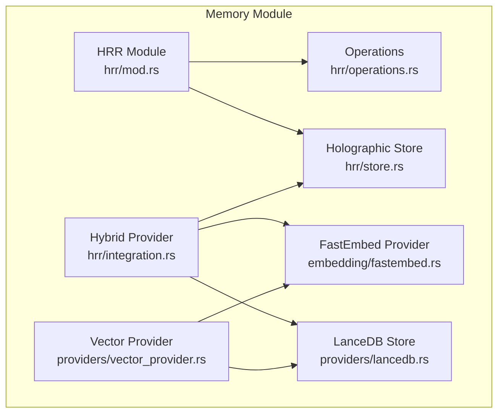
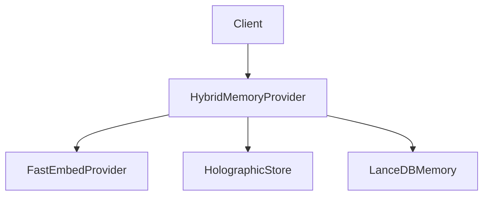
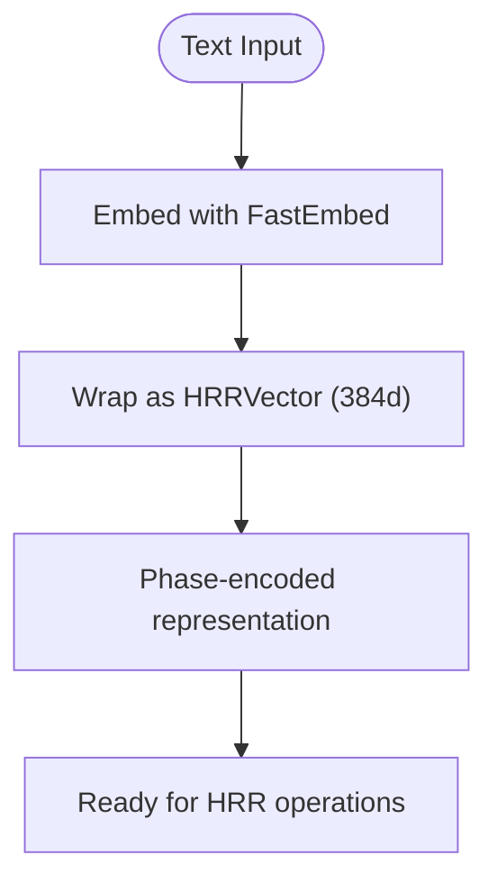
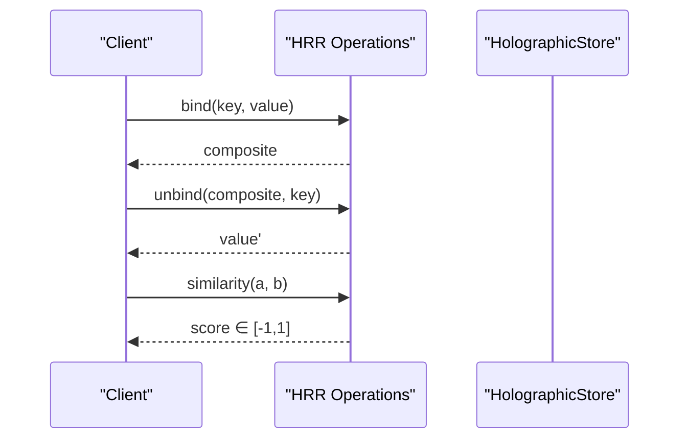
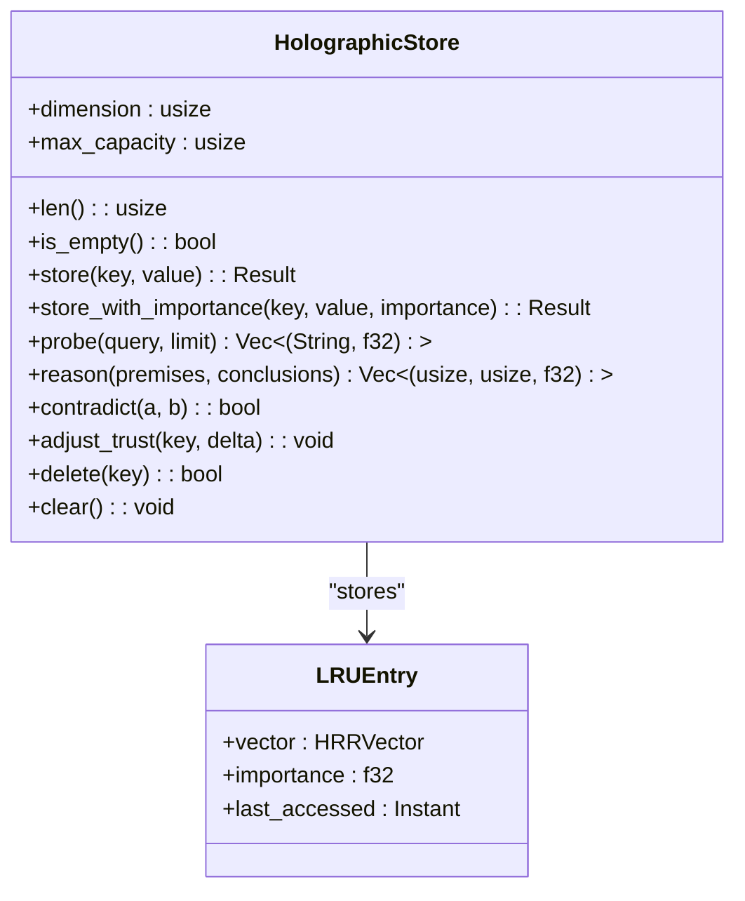
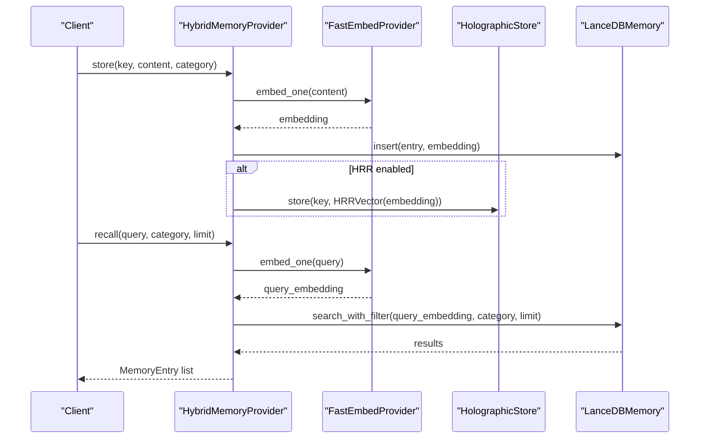
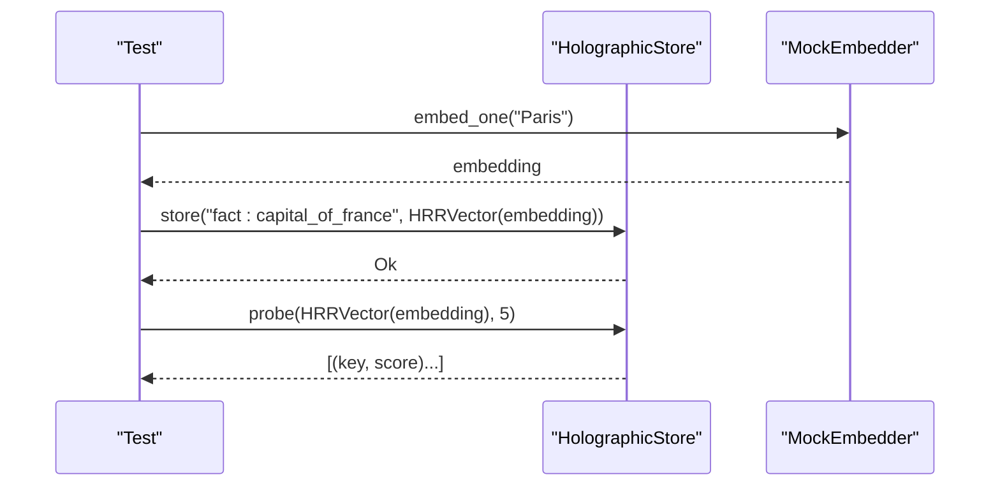
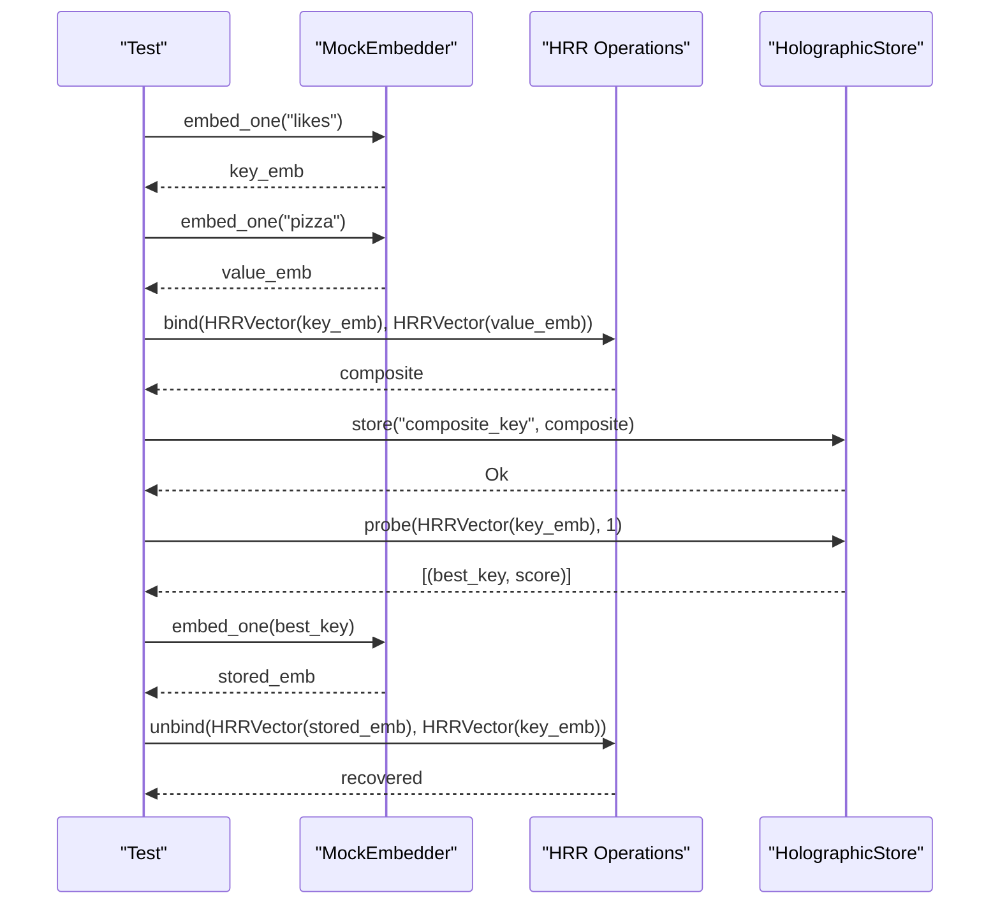
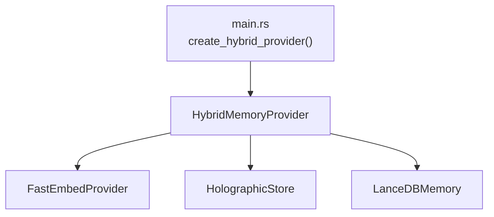

# Holographic Reduced Representation (HRR)

<cite>
**Referenced Files in This Document**
- [mod.rs](file://src-tauri/src/modules/memory/hrr/mod.rs)
- [operations.rs](file://src-tauri/src/modules/memory/hrr/operations.rs)
- [store.rs](file://src-tauri/src/modules/memory/hrr/store.rs)
- [integration.rs](file://src-tauri/src/modules/memory/hrr/integration.rs)
- [fastembed.rs](file://src-tauri/src/modules/memory/embedding/fastembed.rs)
- [lancedb.rs](file://src-tauri/src/modules/memory/providers/lancedb.rs)
- [vector_provider.rs](file://src-tauri/src/modules/memory/providers/vector_provider.rs)
- [main.rs](file://src-tauri/src/main.rs)
- [memory-system.md](file://docs/design-docs/memory-system.md)
- [ADR-007-HRR-Introduction-Timing-P2a.md](file://docs/design-docs/postCLI/ADR/ADR-007-HRR-Introduction-Timing-P2a.md)
- [ADR-012-Phase6B-Wiring-BACKLOG.md](file://docs/design-docs/postCLI/ADR/backlog/ADR-012-Phase6B-Wiring-BACKLOG.md)
</cite>

## Table of Contents
1. [Introduction](#introduction)
2. [Project Structure](#project-structure)
3. [Core Components](#core-components)
4. [Architecture Overview](#architecture-overview)
5. [Detailed Component Analysis](#detailed-component-analysis)
6. [Dependency Analysis](#dependency-analysis)
7. [Performance Considerations](#performance-considerations)
8. [Troubleshooting Guide](#troubleshooting-guide)
9. [Conclusion](#conclusion)

## Introduction
This document explains the Holographic Reduced Representation (HRR) integration within the memory system. It covers the mathematical foundations of HRR, the integration layer that bridges HRR with the vector memory system, HRR operations for memory manipulation, and the HRR store for persistent HRR representations. It also documents the hybrid approach combining HRR with vector embeddings, provides examples of HRR memory encoding and retrieval, and outlines performance characteristics compared to traditional vector approaches.

HRR is a Vector Symbolic Architecture (VSA) enabling algebraic memory operations. In this project, HRR complements vector-based memory by providing:
- Algebraic reasoning (bind/unbind)
- Multi-hop and compositional queries
- Contradiction detection
- Pure phase-space operations without requiring an embedding model for reasoning

## Project Structure
The HRR implementation resides under the memory module and integrates with the vector memory provider and embedding layer.

**Diagram sources**
- [mod.rs:1-24](file://src-tauri/src/modules/memory/hrr/mod.rs#L1-L24)
- [operations.rs:1-244](file://src-tauri/src/modules/memory/hrr/operations.rs#L1-L244)
- [store.rs:1-441](file://src-tauri/src/modules/memory/hrr/store.rs#L1-L441)
- [integration.rs:1-530](file://src-tauri/src/modules/memory/hrr/integration.rs#L1-L530)
- [fastembed.rs:1-158](file://src-tauri/src/modules/memory/embedding/fastembed.rs#L1-L158)
- [lancedb.rs:1-559](file://src-tauri/src/modules/memory/providers/lancedb.rs#L1-L559)
- [vector_provider.rs:1-767](file://src-tauri/src/modules/memory/providers/vector_provider.rs#L1-L767)

**Section sources**
- [mod.rs:1-24](file://src-tauri/src/modules/memory/hrr/mod.rs#L1-L24)
- [memory-system.md:1-800](file://docs/design-docs/memory-system.md#L1-L800)

## Core Components
- HRRVector: A typed wrapper around a float vector used for phase-encoded representations. It preserves the embedding dimension (384) to align with FastEmbed.
- Operations: Core HRR functions including bind (circular convolution), unbind (inverse convolution), bundle (weighted superposition), and similarity (cosine similarity).
- HolographicStore: An in-memory store with capacity management (O(√dim)), LRU eviction, and reasoning/contra-detection utilities.
- HybridMemoryProvider: Bridges HRR and vector memory by dual-writing entries to both HRR store and LanceDB, and exposing HRR-specific APIs alongside vector search.
- FastEmbedProvider: Supplies 384-d embeddings for initializing HRR vectors and powering vector search.
- LanceDBMemory: Persistent vector store with ANN search and FTS support.

**Section sources**
- [operations.rs:8-141](file://src-tauri/src/modules/memory/hrr/operations.rs#L8-L141)
- [store.rs:43-299](file://src-tauri/src/modules/memory/hrr/store.rs#L43-L299)
- [integration.rs:59-263](file://src-tauri/src/modules/memory/hrr/integration.rs#L59-L263)
- [fastembed.rs:31-106](file://src-tauri/src/modules/memory/embedding/fastembed.rs#L31-L106)
- [lancedb.rs:108-353](file://src-tauri/src/modules/memory/providers/lancedb.rs#L108-L353)

## Architecture Overview
HRR is introduced as a complement to vector memory, not a replacement. The hybrid architecture routes:
- Primary storage and recall via LanceDB (vector search)
- Algebraic reasoning via HRR (bind/unbind/reason)
- Optional contradiction detection and LRU eviction in HRR store

**Diagram sources**
- [integration.rs:66-104](file://src-tauri/src/modules/memory/hrr/integration.rs#L66-L104)
- [fastembed.rs:35-106](file://src-tauri/src/modules/memory/embedding/fastembed.rs#L35-L106)
- [store.rs:47-68](file://src-tauri/src/modules/memory/hrr/store.rs#L47-L68)
- [lancedb.rs:112-145](file://src-tauri/src/modules/memory/providers/lancedb.rs#L112-L145)

**Section sources**
- [ADR-007-HRR-Introduction-Timing-P2a.md:35-65](file://docs/design-docs/postCLI/ADR/ADR-007-HRR-Introduction-Timing-P2a.md#L35-L65)
- [integration.rs:59-104](file://src-tauri/src/modules/memory/hrr/integration.rs#L59-L104)

## Detailed Component Analysis

### Mathematical Foundations and Encoding Principles
- Phase encoding: Vectors are represented in phase space, enabling circular convolution for binding and its inverse for unbinding.
- Dimension alignment: HRR vectors use 384 dimensions to match FastEmbed, ensuring seamless conversion between textual content and HRR representations.
- Similarity: Cosine similarity in [-1, 1] captures relationship strength; values near 1 indicate strong similarity, near -1 indicate opposition, near 0 indicates orthogonality.

**Diagram sources**
- [operations.rs:8-40](file://src-tauri/src/modules/memory/hrr/operations.rs#L8-L40)
- [fastembed.rs:40-106](file://src-tauri/src/modules/memory/embedding/fastembed.rs#L40-L106)

**Section sources**
- [operations.rs:86-102](file://src-tauri/src/modules/memory/hrr/operations.rs#L86-L102)
- [fastembed.rs:40-106](file://src-tauri/src/modules/memory/embedding/fastembed.rs#L40-L106)

### HRR Operations
- bind(key, value): Wraps value into key’s binding space using circular convolution; retrieval via unbind yields approximately the original value.
- unbind(composite, key): Retrieves bound value by inverse convolution.
- bundle(vectors, weights): Superposes multiple vectors with optional weights, normalized to unit length.
- similarity(a, b): Computes cosine similarity in [-1, 1].

**Diagram sources**
- [operations.rs:42-141](file://src-tauri/src/modules/memory/hrr/operations.rs#L42-L141)

**Section sources**
- [operations.rs:42-141](file://src-tauri/src/modules/memory/hrr/operations.rs#L42-L141)

### Holographic Store
- Capacity management: Enforced at O(√dim) with a configurable multiplier; for 384d, typical capacity is ~700 entries.
- LRU eviction: Evicts lowest-importance entries when capacity is exceeded; tie-break by last access time.
- Probe: Returns ranked entries by similarity to a query vector.
- Reasoning: Checks premise-conclusion relationships by composing and measuring similarity.
- Contradiction detection: Flags opposing vectors when similarity < -0.8.

**Diagram sources**
- [store.rs:47-299](file://src-tauri/src/modules/memory/hrr/store.rs#L47-L299)

**Section sources**
- [store.rs:47-299](file://src-tauri/src/modules/memory/hrr/store.rs#L47-L299)

### Hybrid Memory Provider Integration
- Dual-write: On store, writes to LanceDB (vector search) and optionally to HRR store (algebraic reasoning).
- Conditional HRR: Controlled by HybridConfig; when disabled, provider behaves as a pure vector store.
- HRR search: Embeds query and probes HRR store for ranked results.
- Algebraic bindings: Supports storing composite relations via bind/unbind and detecting contradictions.

**Diagram sources**
- [integration.rs:294-402](file://src-tauri/src/modules/memory/hrr/integration.rs#L294-L402)
- [vector_provider.rs:314-440](file://src-tauri/src/modules/memory/providers/vector_provider.rs#L314-L440)
- [lancedb.rs:166-202](file://src-tauri/src/modules/memory/providers/lancedb.rs#L166-L202)

**Section sources**
- [integration.rs:66-263](file://src-tauri/src/modules/memory/hrr/integration.rs#L66-L263)
- [vector_provider.rs:314-440](file://src-tauri/src/modules/memory/providers/vector_provider.rs#L314-L440)

### Example Workflows

#### HRR Memory Encoding and Retrieval
- Convert text to embedding via FastEmbed.
- Wrap embedding as HRRVector and store in HRR store.
- Probe with a query vector to retrieve top-k matches by similarity.

**Diagram sources**
- [integration.rs:480-493](file://src-tauri/src/modules/memory/hrr/integration.rs#L480-L493)

**Section sources**
- [integration.rs:480-493](file://src-tauri/src/modules/memory/hrr/integration.rs#L480-L493)

#### Algebraic Binding and Unbinding
- Bind a key-value pair into a composite.
- Probe to find the composite and unbind to recover the value.

**Diagram sources**
- [integration.rs:496-518](file://src-tauri/src/modules/memory/hrr/integration.rs#L496-L518)

**Section sources**
- [integration.rs:496-518](file://src-tauri/src/modules/memory/hrr/integration.rs#L496-L518)

## Dependency Analysis
- HRR depends on FastEmbed for 384-d embeddings and on LanceDB for vector search.
- HybridMemoryProvider composes HRR store and vector provider, sharing the embedder.
- Initialization respects environment flags to enable HRR at runtime.

**Diagram sources**
- [main.rs:263-377](file://src-tauri/src/main.rs#L263-L377)
- [integration.rs:77-104](file://src-tauri/src/modules/memory/hrr/integration.rs#L77-L104)

**Section sources**
- [main.rs:263-377](file://src-tauri/src/main.rs#L263-L377)
- [integration.rs:77-104](file://src-tauri/src/modules/memory/hrr/integration.rs#L77-L104)

## Performance Considerations
- HRR computational cost: Circular convolution is O(n²); for 384-d vectors, this is acceptable for interactive use but not ideal for high-throughput batch processing.
- Capacity constraints: HolographicStore enforces O(√dim) capacity, limiting concurrent algebraic entries to ~700 for 384d.
- Vector search scalability: LanceDB ANN search scales better for large corpora; HRR is best suited for relational reasoning and small-scale algebraic tasks.
- Hybrid strategy: Use vector search for broad recall and HRR for targeted algebraic queries and contradiction detection.

[No sources needed since this section provides general guidance]

## Troubleshooting Guide
- Dimension mismatches: Ensure HRR vectors and LanceDB embeddings share the same dimension (384). Errors are surfaced when dimensions differ.
- Capacity exceeded: When HRR store reaches capacity, eviction occurs; verify importance scoring and consider reducing concurrency.
- HRR disabled: When HybridConfig disables HRR, HRR-specific operations return empty results or None.
- Environment flag: IF2AI_HRR_ENABLED controls runtime initialization of HybridMemoryProvider.

**Section sources**
- [store.rs:102-108](file://src-tauri/src/modules/memory/hrr/store.rs#L102-L108)
- [integration.rs:106-109](file://src-tauri/src/modules/memory/hrr/integration.rs#L106-L109)
- [main.rs:263-267](file://src-tauri/src/main.rs#L263-L267)

## Conclusion
HRR provides a powerful algebraic layer for memory systems, enabling bind/unbind operations, multi-hop reasoning, and contradiction detection. In this project, HRR complements vector memory by offering symbolic manipulation and relational inference, while vector search handles large-scale semantic recall. The HybridMemoryProvider orchestrates dual writes and selective HRR usage, controlled by configuration and environment flags. As HRR has O(√dim) capacity constraints, it is best deployed for focused reasoning tasks rather than as a universal replacement for vector memory.