# Memory Compiler Subsystem

<cite>
**Referenced Files in This Document**
- [compiler/mod.rs](file://src-tauri/src/modules/memory/compiler/mod.rs)
- [compiler/fingerprint.rs](file://src-tauri/src/modules/memory/compiler/fingerprint.rs)
- [compiler/today.rs](file://src-tauri/src/modules/memory/compiler/today.rs)
- [compiler/week.rs](file://src-tauri/src/modules/memory/compiler/week.rs)
- [compiler/longterm.rs](file://src-tauri/src/modules/memory/compiler/longterm.rs)
- [compiler/facts.rs](file://src-tauri/src/modules/memory/compiler/facts.rs)
- [compiler/assemble.rs](file://src-tauri/src/modules/memory/compiler/assemble.rs)
- [commands/memory.rs](file://src-tauri/src/commands/memory.rs)
- [ticker.rs](file://src-tauri/src/modules/memory/ticker.rs)
- [providers/vector_provider.rs](file://src-tauri/src/modules/memory/providers/vector_provider.rs)
- [embedding/fastembed.rs](file://src-tauri/src/modules/memory/embedding/fastembed.rs)
- [providers/lancedb.rs](file://src-tauri/src/modules/memory/providers/lancedb.rs)
- [memory-enhancement-from-openhanako-v1.md](file://docs/design-docs/postCLI/memory-enhancement-from-openhanako-v1.md)
- [phase-8b-memory-compiler-and-ticker.yaml](file://docs/_legacy/exec-plans/active/phase-8b-memory-compiler-and-ticker.yaml)
</cite>

## Table of Contents
1. [Introduction](#introduction)
2. [System Architecture](#system-architecture)
3. [Core Components](#core-components)
4. [Assembly Pipeline](#assembly-pipeline)
5. [Facts Extraction System](#facts-extraction-system)
6. [Fingerprint Generation](#fingerprint-generation)
7. [Temporal Organization](#temporal-organization)
8. [Vector Database Integration](#vector-database-integration)
9. [Compilation Algorithms](#compilation-algorithms)
10. [Data Transformation Processes](#data-transformations)
11. [Memory Compilation Workflows](#memory-compilation-workflows)
12. [Fingerprint Collision Handling](#fingerprint-collision-handling)
13. [Performance Considerations](#performance-considerations)
14. [Troubleshooting Guide](#troubleshooting-guide)
15. [Conclusion](#conclusion)

## Introduction

The Memory Compiler Subsystem is a sophisticated pipeline that transforms raw memory entries from conversational sessions into structured, organized, and deduplicated knowledge artifacts. This system serves as the backbone for long-term memory management, providing temporal organization through daily aggregation, weekly summarization, and long-term context preservation.

The subsystem operates on a four-stage compilation pipeline: daily summaries (today), weekly aggregation (week), long-term synthesis (longterm), and key facts extraction (facts). Each stage employs intelligent caching mechanisms, fingerprint-based deduplication, and strategic LLM utilization to minimize computational costs while maximizing knowledge retention.

## System Architecture

The Memory Compiler Subsystem follows a modular architecture centered around the `MemoryCompiler` orchestrator, which coordinates five specialized compilation stages. The system integrates tightly with the vector database ecosystem for semantic search capabilities and maintains comprehensive audit trails for observability.

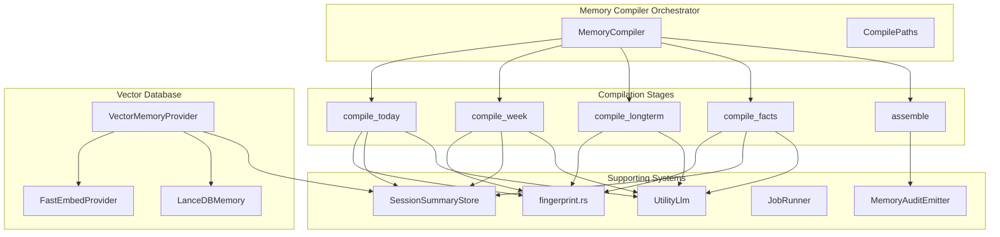

**Diagram sources**
- [compiler/mod.rs:107-267](file://src-tauri/src/modules/memory/compiler/mod.rs#L107-L267)
- [providers/vector_provider.rs:107-177](file://src-tauri/src/modules/memory/providers/vector_provider.rs#L107-L177)

## Core Components

### MemoryCompiler Orchestrator

The `MemoryCompiler` serves as the central coordinator for the entire compilation pipeline. It maintains references to essential collaborators including the session summary store, utility LLM client, job runner, and compiler configuration.

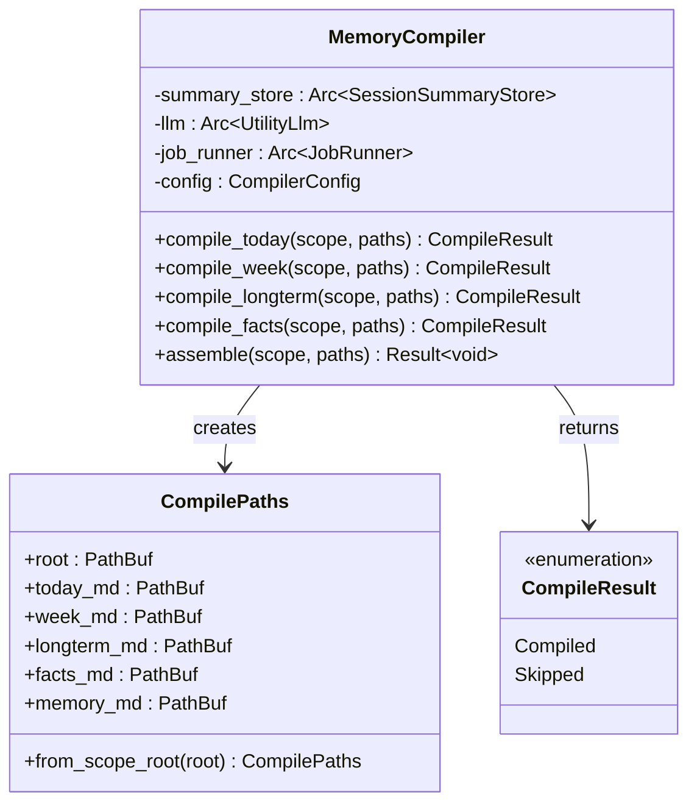

**Diagram sources**
- [compiler/mod.rs:113-267](file://src-tauri/src/modules/memory/compiler/mod.rs#L113-L267)

**Section sources**
- [compiler/mod.rs:107-267](file://src-tauri/src/modules/memory/compiler/mod.rs#L107-L267)

### Fingerprint Management System

The fingerprint system provides efficient cache management through MD5-based content hashing. Each compilation stage generates fingerprints from input keys and compares them against stored sidecar files to determine whether recompilation is necessary.

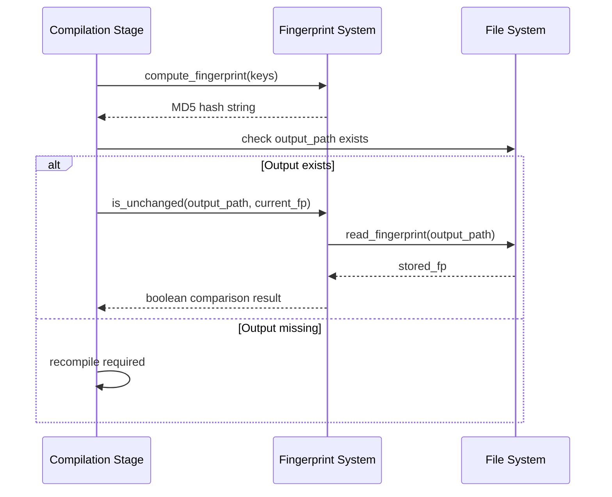

**Diagram sources**
- [compiler/fingerprint.rs:25-89](file://src-tauri/src/modules/memory/compiler/fingerprint.rs#L25-L89)

**Section sources**
- [compiler/fingerprint.rs:1-181](file://src-tauri/src/modules/memory/compiler/fingerprint.rs#L1-L181)

## Assembly Pipeline

The assembly pipeline transforms raw memory entries into structured, human-readable summaries through a four-stage compilation process. Each stage targets different temporal granularities and serves specific knowledge retention purposes.

### Daily Compilation (Today)

The daily compilation stage aggregates session summaries from the current logical day, producing concise overviews suitable for immediate context recall.

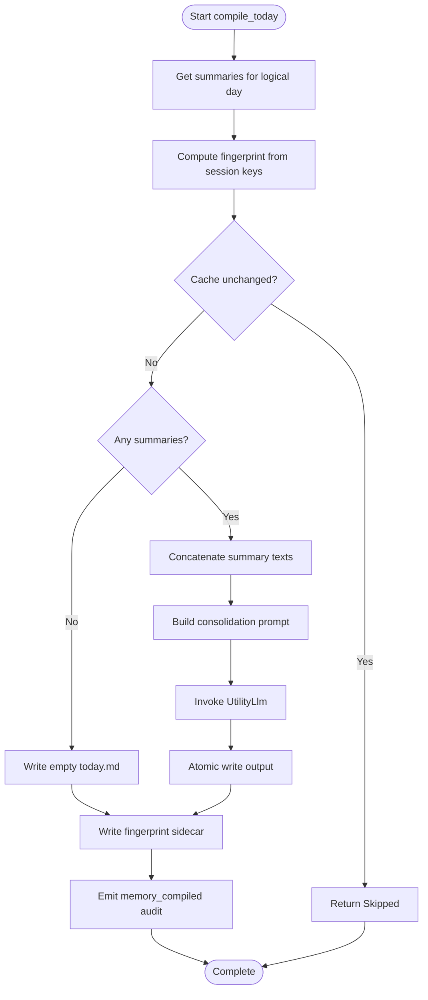

**Diagram sources**
- [compiler/today.rs:64-158](file://src-tauri/src/modules/memory/compiler/today.rs#L64-L158)

### Weekly Compilation (Week)

The weekly stage consolidates daily summaries into comprehensive weekly overviews, emphasizing temporal patterns and progress tracking.

**Section sources**
- [compiler/today.rs:1-429](file://src-tauri/src/modules/memory/compiler/today.rs#L1-L429)
- [compiler/week.rs:1-245](file://src-tauri/src/modules/memory/compiler/week.rs#L1-L245)

### Long-term Compilation (Longterm)

The long-term stage synthesizes weekly insights into enduring knowledge, focusing on facts, preferences, and sustained understanding.

**Section sources**
- [compiler/longterm.rs:1-305](file://src-tauri/src/modules/memory/compiler/longterm.rs#L1-L305)

### Facts Compilation (Facts)

The facts extraction stage identifies and consolidates key information from recent conversations, maintaining a curated collection of important insights.

**Section sources**
- [compiler/facts.rs:1-455](file://src-tauri/src/modules/memory/compiler/facts.rs#L1-L455)

## Facts Extraction System

The facts extraction system implements sophisticated pattern recognition to identify and extract key information from conversation summaries. It employs regular expressions to locate "important facts" sections and merges them intelligently with existing knowledge.

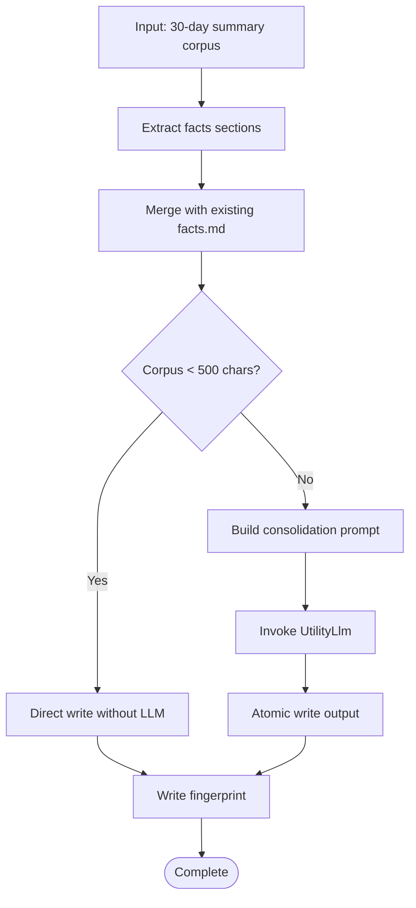

**Diagram sources**
- [compiler/facts.rs:103-206](file://src-tauri/src/modules/memory/compiler/facts.rs#L103-L206)

**Section sources**
- [compiler/facts.rs:64-230](file://src-tauri/src/modules/memory/compiler/facts.rs#L64-L230)

## Fingerprint Generation

The fingerprint generation system ensures efficient cache management through deterministic content hashing. Each compilation stage computes fingerprints from input keys and maintains sidecar files for change detection.

### Fingerprint Algorithm

The system employs MD5 hashing with specific key derivation patterns:

- **Today/Week**: `"session_id:updated_at"` for each summary record
- **Longterm**: Current week content only  
- **Facts**: Extracted facts corpus

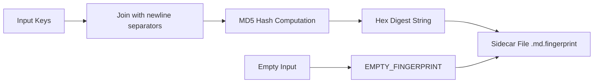

**Diagram sources**
- [compiler/fingerprint.rs:25-34](file://src-tauri/src/modules/memory/compiler/fingerprint.rs#L25-L34)

**Section sources**
- [compiler/fingerprint.rs:25-89](file://src-tauri/src/modules/memory/compiler/fingerprint.rs#L25-L89)

## Temporal Organization

The Memory Compiler Subsystem implements a sophisticated temporal organization system that manages knowledge across multiple time scales, ensuring optimal recall and minimal redundancy.

### Daily Aggregation (Today)

Daily summaries capture immediate context and recent developments, optimized for quick recall and frequent access patterns.

### Weekly Summarization (Week)

Weekly aggregations synthesize daily insights into coherent narratives, highlighting patterns, decisions, and progress indicators.

### Long-term Context (Longterm)

Long-term synthesis creates enduring knowledge bases that preserve valuable information across extended periods while filtering out transient details.

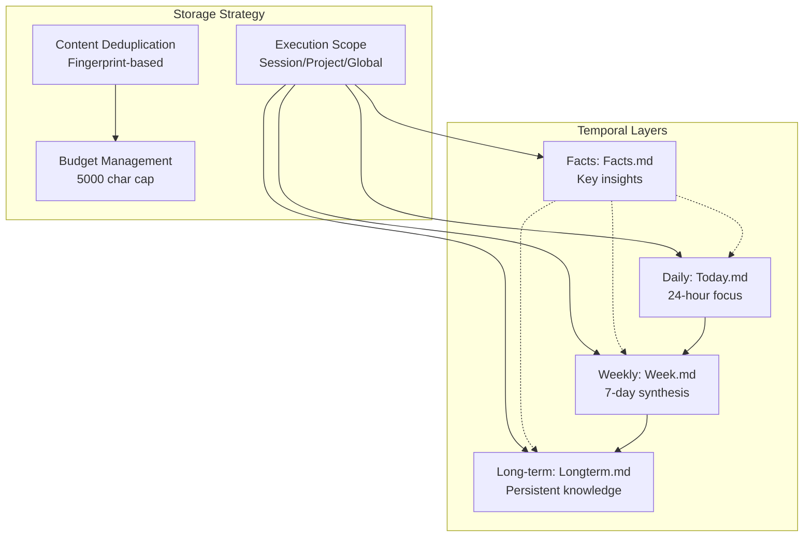

**Diagram sources**
- [compiler/assemble.rs:25-31](file://src-tauri/src/modules/memory/compiler/assemble.rs#L25-L31)

**Section sources**
- [compiler/assemble.rs:25-135](file://src-tauri/src/modules/memory/compiler/assemble.rs#L25-L135)

## Vector Database Integration

The Memory Compiler Subsystem integrates seamlessly with the vector database ecosystem, providing semantic search capabilities and advanced memory management features.

### Dual-Write Architecture

The vector memory provider implements a sophisticated dual-write strategy that ensures data consistency and durability:

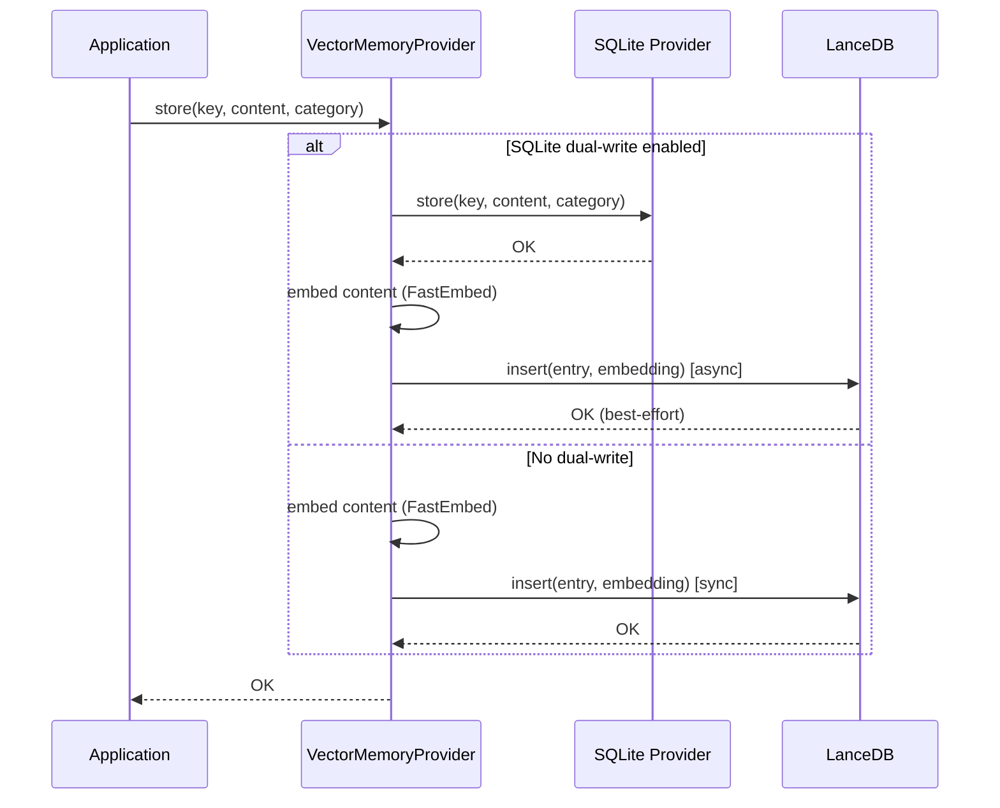

**Diagram sources**
- [providers/vector_provider.rs:314-376](file://src-tauri/src/modules/memory/providers/vector_provider.rs#L314-L376)

### Semantic Search Capabilities

The vector database provides advanced search capabilities through hybrid approaches combining vector similarity and full-text search:

**Section sources**
- [providers/vector_provider.rs:107-177](file://src-tauri/src/modules/memory/providers/vector_provider.rs#L107-L177)
- [embedding/fastembed.rs:35-106](file://src-tauri/src/modules/memory/embedding/fastembed.rs#L35-L106)
- [providers/lancedb.rs:112-145](file://src-tauri/src/modules/memory/providers/lancedb.rs#L112-L145)

## Compilation Algorithms

The Memory Compiler Subsystem employs sophisticated algorithms for content processing, deduplication, and optimization.

### Content Consolidation Algorithm

Each compilation stage implements a content consolidation algorithm that balances quality and efficiency:

1. **Input Collection**: Gather relevant summaries based on temporal windows
2. **Fingerprint Computation**: Generate MD5 hashes for cache validation
3. **LLM Optimization**: Apply targeted prompts for content synthesis
4. **Atomic Persistence**: Write outputs using atomic file operations

### Budget Management Algorithm

The system implements intelligent budget management to control output sizes:

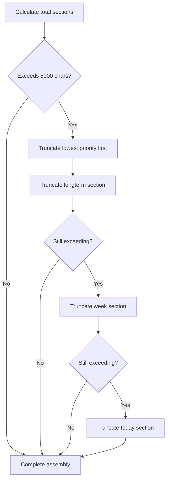

**Diagram sources**
- [compiler/assemble.rs:97-126](file://src-tauri/src/modules/memory/compiler/assemble.rs#L97-L126)

**Section sources**
- [compiler/assemble.rs:97-135](file://src-tauri/src/modules/memory/compiler/assemble.rs#L97-L135)

## Data Transformation Processes

The Memory Compiler Subsystem transforms raw conversation data through several sophisticated transformation processes, ensuring data quality and consistency.

### Summary Processing Pipeline

### Fingerprint-Based Deduplication

The system implements intelligent deduplication through fingerprint comparison:

**Section sources**
- [compiler/today.rs:83-98](file://src-tauri/src/modules/memory/compiler/today.rs#L83-L98)
- [compiler/week.rs:55-67](file://src-tauri/src/modules/memory/compiler/week.rs#L55-L67)
- [compiler/longterm.rs:72-79](file://src-tauri/src/modules/memory/compiler/longterm.rs#L72-L79)
- [compiler/facts.rs:134-146](file://src-tauri/src/modules/memory/compiler/facts.rs#L134-L146)

## Memory Compilation Workflows

The Memory Compiler Subsystem supports multiple compilation workflows designed for different use cases and operational requirements.

### Manual Compilation Workflow

Manual compilation allows users to trigger the full compilation pipeline on demand:

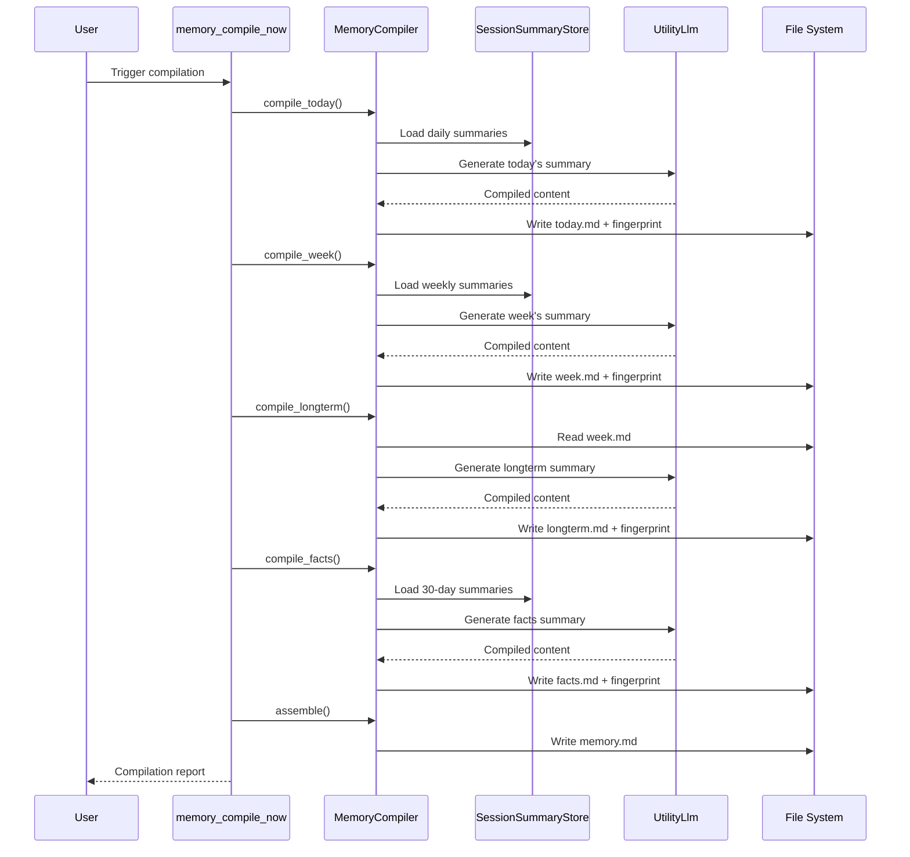

**Diagram sources**
- [commands/memory.rs:571-596](file://src-tauri/src/commands/memory.rs#L571-L596)
- [compiler/mod.rs:158-266](file://src-tauri/src/modules/memory/compiler/mod.rs#L158-L266)

### Automated Compilation Workflow

The automated workflow integrates with the MemoryTicker for scheduled compilation:

**Section sources**
- [commands/memory.rs:559-596](file://src-tauri/src/commands/memory.rs#L559-L596)
- [ticker.rs:366-372](file://src-tauri/src/modules/memory/ticker.rs#L366-L372)

## Fingerprint Collision Handling

The Memory Compiler Subsystem implements robust collision handling mechanisms to ensure reliable cache management and prevent unnecessary reprocessing.

### Collision Detection Mechanism

The system employs a multi-layered approach to detect and handle fingerprint collisions:

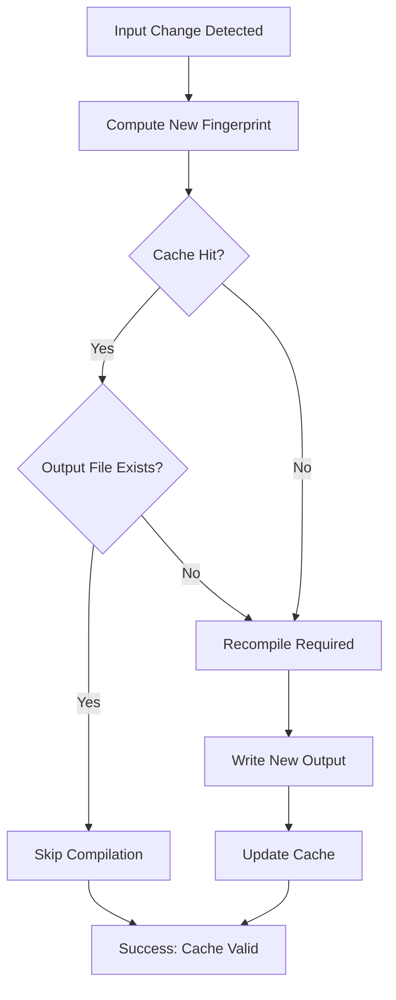

### Fallback Strategies

When fingerprint collisions occur, the system implements several fallback strategies:

1. **Atomic File Operations**: Ensures data integrity during write operations
2. **Graceful Degradation**: Continues operation even with cache misses
3. **Audit Logging**: Maintains comprehensive records of all cache operations

**Section sources**
- [compiler/fingerprint.rs:84-89](file://src-tauri/src/modules/memory/compiler/fingerprint.rs#L84-L89)
- [compiler/today.rs:92-98](file://src-tauri/src/modules/memory/compiler/today.rs#L92-L98)

## Performance Considerations

The Memory Compiler Subsystem is designed with performance optimization as a primary concern, implementing several strategies to minimize computational overhead while maximizing throughput.

### Caching Strategy

The system employs a hierarchical caching strategy that minimizes redundant processing:

- **Fingerprint Cache**: Prevents unnecessary LLM calls for unchanged content
- **Atomic Writes**: Eliminates partial write scenarios and reduces I/O overhead
- **Batch Processing**: Groups similar operations to improve efficiency

### Resource Management

The compiler implements intelligent resource management:

- **Token Budget Control**: Limits LLM usage through configurable character budgets
- **Retry Management**: Uses JobRunner for robust error handling and retry logic
- **Memory Optimization**: Minimizes memory footprint through streaming operations

### Scalability Features

The system is designed for horizontal scalability:

- **Parallel Processing**: Multiple compilation stages can run concurrently
- **Modular Design**: Individual components can be scaled independently
- **Asynchronous Operations**: Non-blocking operations improve responsiveness

## Troubleshooting Guide

This section provides comprehensive troubleshooting guidance for common issues encountered with the Memory Compiler Subsystem.

### Common Issues and Solutions

#### Compilation Not Triggering

**Symptoms**: Compilation stages appear to skip without processing
**Causes**: 
- Fingerprint cache unchanged
- Empty input data
- JobRunner throttling

**Solutions**:
- Verify fingerprint sidecar files exist and are readable
- Check input data availability in SessionSummaryStore
- Review JobRunner configuration and quotas

#### Memory Growth Issues

**Symptoms**: memory.md files growing excessively large
**Causes**:
- Budget exceeded without truncation
- Missing budget enforcement
- Infinite recursion in assembly

**Solutions**:
- Verify MEMORY_MD_MAX_CHARS constant (5000)
- Check truncation logic in truncate_to_budget()
- Monitor section priorities during assembly

#### Vector Database Integration Problems

**Symptoms**: Vector search failing or returning unexpected results
**Causes**:
- Embedding dimension mismatches
- Index construction failures
- Dual-write synchronization issues

**Solutions**:
- Verify embedding dimension (384)
- Check LanceDB index creation status
- Monitor dual-write operation logs

**Section sources**
- [compiler/assemble.rs:97-126](file://src-tauri/src/modules/memory/compiler/assemble.rs#L97-L126)
- [providers/vector_provider.rs:144-148](file://src-tauri/src/modules/memory/providers/vector_provider.rs#L144-L148)

## Conclusion

The Memory Compiler Subsystem represents a sophisticated approach to long-term memory management, combining temporal organization, intelligent deduplication, and semantic search capabilities. Through its modular architecture, the system provides scalable, efficient, and reliable memory compilation services that support both immediate recall and long-term knowledge preservation.

The integration with vector databases enhances the system's capabilities by enabling semantic search and advanced retrieval patterns. The fingerprint-based caching mechanism ensures optimal performance while maintaining data consistency across all compilation stages.

Future enhancements to the system could include expanded temporal granularity, enhanced AI-driven content analysis, and improved integration with external knowledge sources. The modular design provides a solid foundation for these extensions while maintaining backward compatibility and system stability.