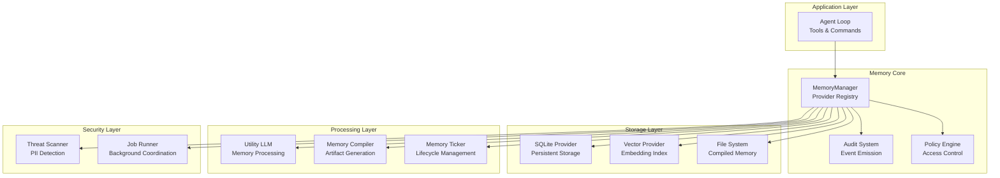
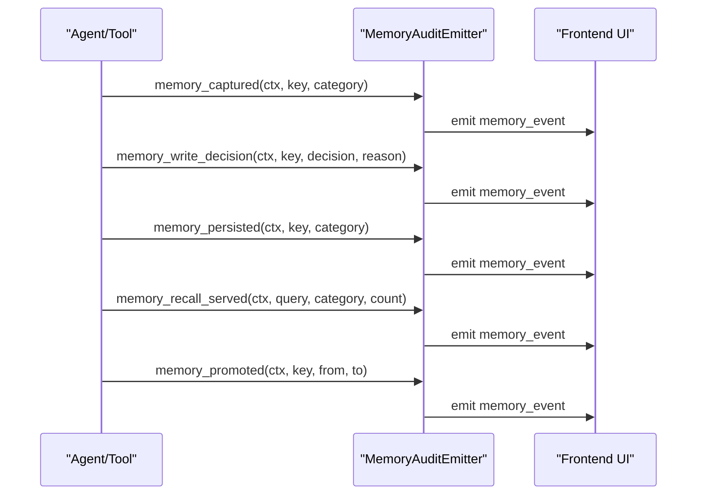
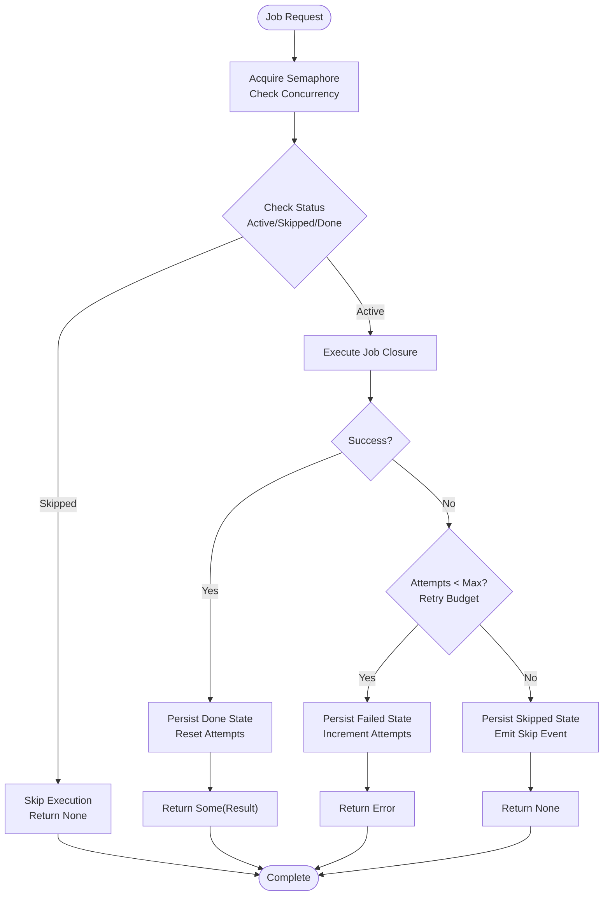
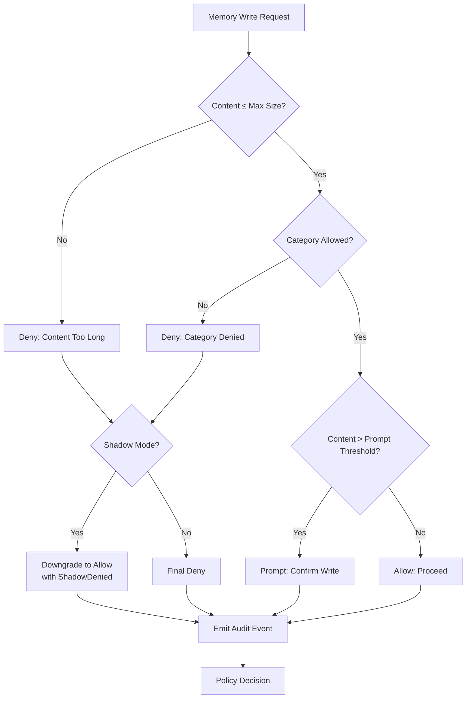
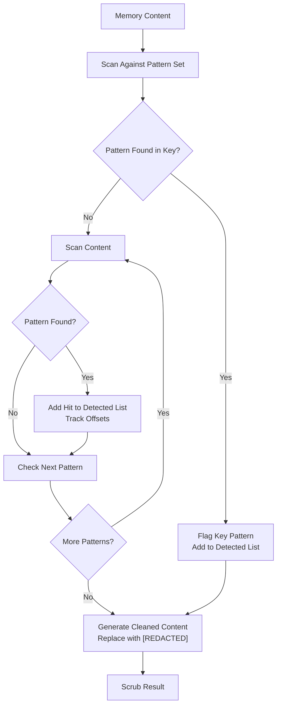
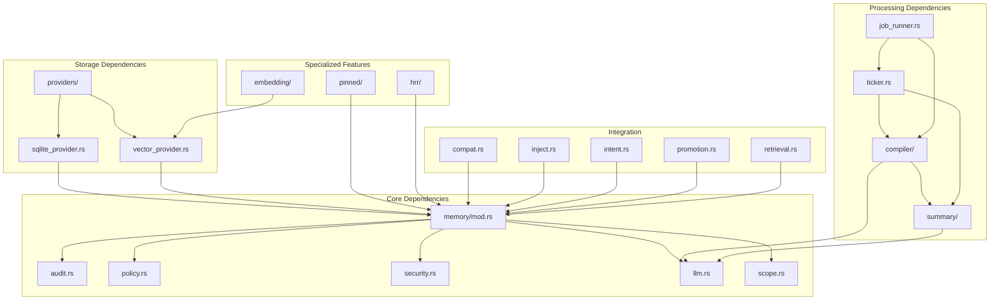

# Memory Management Core

<cite>
**Referenced Files in This Document**
- [memory/mod.rs](file://src-tauri/src/modules/memory/mod.rs)
- [memory/audit.rs](file://src-tauri/src/modules/memory/audit.rs)
- [memory/policy.rs](file://src-tauri/src/modules/memory/policy.rs)
- [memory/job_runner.rs](file://src-tauri/src/modules/memory/job_runner.rs)
- [memory/llm.rs](file://src-tauri/src/modules/memory/llm.rs)
- [memory/security.rs](file://src-tauri/src/modules/memory/security.rs)
- [memory/ticker.rs](file://src-tauri/src/modules/memory/ticker.rs)
- [memory/inject.rs](file://src-tauri/src/modules/memory/inject.rs)
- [memory/intent.rs](file://src-tauri/src/modules/memory/intent.rs)
- [memory/promotion.rs](file://src-tauri/src/modules/memory/promotion.rs)
- [memory/retrieval.rs](file://src-tauri/src/modules/memory/retrieval.rs)
- [memory/scope.rs](file://src-tauri/src/modules/memory/scope.rs)
- [memory/working_memory.rs](file://src-tauri/src/modules/memory/working_memory.rs)
- [memory/providers/sqlite_provider.rs](file://src-tauri/src/modules/memory/providers/sqlite_provider.rs)
- [memory/providers/vector_provider.rs](file://src-tauri/src/modules/memory/providers/vector_provider.rs)
- [memory/embedding/fastembed.rs](file://src-tauri/src/modules/memory/embedding/fastembed.rs)
- [memory/compat.rs](file://src-tauri/src/modules/memory/compat.rs)
- [memory/summary/store.rs](file://src-tauri/src/modules/memory/summary/store.rs)
- [memory/summary/rolling.rs](file://src-tauri/src/modules/memory/summary/rolling.rs)
- [memory/compiler/mod.rs](file://src-tauri/src/modules/memory/compiler/mod.rs)
- [memory/compiler/facts.rs](file://src-tauri/src/modules/memory/compiler/facts.rs)
- [memory/compiler/longterm.rs](file://src-tauri/src/modules/memory/compiler/longterm.rs)
- [memory/compiler/today.rs](file://src-tauri/src/modules/memory/compiler/today.rs)
- [memory/compiler/week.rs](file://src-tauri/src/modules/memory/compiler/week.rs)
- [memory/pinned/store.rs](file://src-tauri/src/modules/memory/pinned/store.rs)
- [memory/pinned/types.rs](file://src-tauri/src/modules/memory/pinned/types.rs)
- [memory/hrr/store.rs](file://src-tauri/src/modules/memory/hrr/store.rs)
- [memory/hrr/operations.rs](file://src-tauri/src/modules/memory/hrr/operations.rs)
- [memory/hrr/integration.rs](file://src-tauri/src/modules/memory/hrr/integration.rs)
- [memory_system.md](file://docs/design-docs/memory-system.md)
</cite>

## Table of Contents
1. [Introduction](#introduction)
2. [Project Structure](#project-structure)
3. [Core Components](#core-components)
4. [Architecture Overview](#architecture-overview)
5. [Detailed Component Analysis](#detailed-component-analysis)
6. [Dependency Analysis](#dependency-analysis)
7. [Performance Considerations](#performance-considerations)
8. [Troubleshooting Guide](#troubleshooting-guide)
9. [Conclusion](#conclusion)

## Introduction
This document provides comprehensive documentation for the core memory management functions in the system. It explains the audit system for memory integrity verification, compatibility layer for legacy data formats, injection system for memory insertion, intent recognition for memory categorization, job runner for background memory operations, LLM-powered memory processing, policy enforcement for memory access control, promotion mechanisms for memory prioritization, retrieval strategies for memory search, scope management for memory boundaries, security scanning for threat detection, ticker system for memory lifecycle management, and working memory for active processing. The document also details the interconnections between these systems and their role in the overall memory architecture.

## Project Structure
The memory management system is organized into a cohesive Rust module with specialized submodules for each functional area. The central module defines the core traits and data structures, while submodules encapsulate specific capabilities such as auditing, policy enforcement, job coordination, LLM integration, security scanning, lifecycle management, and specialized stores.

```mermaid
graph TB
subgraph "Core Module"
MOD["memory/mod.rs<br/>Core traits and types"]
end
subgraph "Auditing & Compliance"
AUDIT["audit.rs<br/>Audit events"]
POLICY["policy.rs<br/>Access control"]
SECURITY["security.rs<br/>Threat scanning"]
end
subgraph "Processing & Storage"
PROVIDERS["providers/<br/>SQLite/Vector"]
WORKMEM["working_memory.rs<br/>Active processing"]
RETRIEVAL["retrieval.rs<br/>Search strategies"]
PROMOTION["promotion.rs<br/>Prioritization"]
INTENT["intent.rs<br/>Categorization"]
INJECT["inject.rs<br/>Context injection"]
end
subgraph "Lifecycle Management"
TICKER["ticker.rs<br/>Scheduler"]
JOB["job_runner.rs<br/>Background jobs"]
SUMMARY["summary/*<br/>Rolling summaries"]
COMPILER["compiler/*<br/>Memory compilation"]
PINNED["pinned/*<br/>Pinned memory"]
HRR["hrr/*<br/>Holographic Reduction"]
end
subgraph "Integration"
LLM["llm.rs<br/>Utility LLM"]
COMPAT["compat.rs<br/>Legacy formats"]
SCOPE["scope.rs<br/>Visibility rules"]
end
MOD --> AUDIT
MOD --> POLICY
MOD --> SECURITY
MOD --> PROVIDERS
MOD --> WORKMEM
MOD --> RETRIEVAL
MOD --> PROMOTION
MOD --> INTENT
MOD --> INJECT
MOD --> TICKER
MOD --> JOB
MOD --> SUMMARY
MOD --> COMPILER
MOD --> PINNED
MOD --> HRR
MOD --> LLM
MOD --> COMPAT
MOD --> SCOPE
```

**Diagram sources**
- [memory/mod.rs:1-517](file://src-tauri/src/modules/memory/mod.rs#L1-L517)
- [memory/audit.rs:1-1095](file://src-tauri/src/modules/memory/audit.rs#L1-L1095)
- [memory/policy.rs:1-336](file://src-tauri/src/modules/memory/policy.rs#L1-L336)
- [memory/security.rs:1-593](file://src-tauri/src/modules/memory/security.rs#L1-L593)
- [memory/providers/sqlite_provider.rs](file://src-tauri/src/modules/memory/providers/sqlite_provider.rs)
- [memory/providers/vector_provider.rs](file://src-tauri/src/modules/memory/providers/vector_provider.rs)
- [memory/working_memory.rs](file://src-tauri/src/modules/memory/working_memory.rs)
- [memory/retrieval.rs](file://src-tauri/src/modules/memory/retrieval.rs)
- [memory/promotion.rs](file://src-tauri/src/modules/memory/promotion.rs)
- [memory/intent.rs](file://src-tauri/src/modules/memory/intent.rs)
- [memory/inject.rs](file://src-tauri/src/modules/memory/inject.rs)
- [memory/ticker.rs:1-1364](file://src-tauri/src/modules/memory/ticker.rs#L1-L1364)
- [memory/job_runner.rs:1-680](file://src-tauri/src/modules/memory/job_runner.rs#L1-L680)
- [memory/summary/store.rs](file://src-tauri/src/modules/memory/summary/store.rs)
- [memory/summary/rolling.rs](file://src-tauri/src/modules/memory/summary/rolling.rs)
- [memory/compiler/mod.rs](file://src-tauri/src/modules/memory/compiler/mod.rs)
- [memory/compiler/facts.rs](file://src-tauri/src/modules/memory/compiler/facts.rs)
- [memory/compiler/longterm.rs](file://src-tauri/src/modules/memory/compiler/longterm.rs)
- [memory/compiler/today.rs](file://src-tauri/src/modules/memory/compiler/today.rs)
- [memory/compiler/week.rs](file://src-tauri/src/modules/memory/compiler/week.rs)
- [memory/pinned/store.rs](file://src-tauri/src/modules/memory/pinned/store.rs)
- [memory/pinned/types.rs](file://src-tauri/src/modules/memory/pinned/types.rs)
- [memory/hrr/store.rs](file://src-tauri/src/modules/memory/hrr/store.rs)
- [memory/hrr/operations.rs](file://src-tauri/src/modules/memory/hrr/operations.rs)
- [memory/hrr/integration.rs](file://src-tauri/src/modules/memory/hrr/integration.rs)
- [memory/llm.rs:1-236](file://src-tauri/src/modules/memory/llm.rs#L1-L236)
- [memory/compat.rs](file://src-tauri/src/modules/memory/compat.rs)
- [memory/scope.rs](file://src-tauri/src/modules/memory/scope.rs)

**Section sources**
- [memory/mod.rs:1-517](file://src-tauri/src/modules/memory/mod.rs#L1-L517)

## Core Components
The core memory management system centers around several fundamental abstractions:

### Memory Provider Trait
The [`MemoryProvider`:201-380](file://src-tauri/src/modules/memory/mod.rs#L201-L380) trait defines the primary interface for memory storage and retrieval operations. It supports scoped storage with session and project boundaries, importance-based decay, and category-based organization.

### Memory Entry Structure
The [`MemoryEntry`:96-119](file://src-tauri/src/modules/memory/mod.rs#L96-L119) represents individual memory items with metadata including creation timestamps, importance scores, access counts, trust metrics, and scope identifiers.

### Execution Scope System
The [`MemoryExecutionScope`:72-72](file://src-tauri/src/modules/memory/mod.rs#L72-L72) manages visibility boundaries through session_id and project_id fields, enabling fine-grained access control across different operational contexts.

**Section sources**
- [memory/mod.rs:96-380](file://src-tauri/src/modules/memory/mod.rs#L96-L380)

## Architecture Overview
The memory management architecture follows a layered design with clear separation of concerns:

**Diagram sources**
- [memory/mod.rs:1-517](file://src-tauri/src/modules/memory/mod.rs#L1-L517)
- [memory/audit.rs:1-1095](file://src-tauri/src/modules/memory/audit.rs#L1-L1095)
- [memory/policy.rs:1-336](file://src-tauri/src/modules/memory/policy.rs#L1-L336)
- [memory/security.rs:1-593](file://src-tauri/src/modules/memory/security.rs#L1-L593)
- [memory/job_runner.rs:1-680](file://src-tauri/src/modules/memory/job_runner.rs#L1-L680)
- [memory/llm.rs:1-236](file://src-tauri/src/modules/memory/llm.rs#L1-L236)
- [memory/ticker.rs:1-1364](file://src-tauri/src/modules/memory/ticker.rs#L1-L1364)

## Detailed Component Analysis

### Audit System for Memory Integrity Verification
The audit system provides comprehensive event tracking for all memory operations through the [`MemoryAuditEmitter`:188-1046](file://src-tauri/src/modules/memory/audit.rs#L188-L1046) singleton. It captures structured events for memory capture, write decisions, persistence, recall serving, rejection, promotion, and various lifecycle events.

**Diagram sources**
- [memory/audit.rs:194-516](file://src-tauri/src/modules/memory/audit.rs#L194-L516)

The audit system maintains structured payloads with trace correlation, scope information, and contextual metadata. Events are designed to support both shadow mode operations and full enforcement scenarios.

**Section sources**
- [memory/audit.rs:1-1095](file://src-tauri/src/modules/memory/audit.rs#L1-L1095)

### Compatibility Layer for Legacy Data Formats
The compatibility layer handles migration and transformation of legacy memory formats through the [`MemoryCompat`](file://src-tauri/src/modules/memory/compat.rs) system. It provides mechanisms for converting between different memory representations while maintaining data integrity and backward compatibility.

**Section sources**
- [memory/compat.rs](file://src-tauri/src/modules/memory/compat.rs)

### Injection System for Memory Insertion
The injection system enables dynamic memory context insertion into prompts and system messages through the [`MemoryInjection`:69-69](file://src-tauri/src/modules/memory/inject.rs#L69-L69) mechanism. It integrates with the broader memory architecture to provide contextual awareness during agent interactions.

**Section sources**
- [memory/inject.rs](file://src-tauri/src/modules/memory/inject.rs)

### Intent Recognition for Memory Categorization
Intent recognition systems categorize memory entries based on content analysis and context understanding. The [`MemoryIntent`](file://src-tauri/src/modules/memory/intent.rs) module analyzes incoming data to automatically assign appropriate categories and metadata.

**Section sources**
- [memory/intent.rs](file://src-tauri/src/modules/memory/intent.rs)

### Job Runner for Background Memory Operations
The [`JobRunner`:140-410](file://src-tauri/src/modules/memory/job_runner.rs#L140-L410) coordinates background memory operations with robust retry logic, concurrency control, and persistence guarantees. It ensures reliable execution of memory processing tasks while preventing resource exhaustion.

**Diagram sources**
- [memory/job_runner.rs:293-348](file://src-tauri/src/modules/memory/job_runner.rs#L293-L348)

**Section sources**
- [memory/job_runner.rs:1-680](file://src-tauri/src/modules/memory/job_runner.rs#L1-L680)

### LLM-Powered Memory Processing
The [`UtilityLlm`:42-54](file://src-tauri/src/modules/memory/llm.rs#L42-L54) trait provides a standardized interface for memory processing tasks requiring language model assistance. It abstracts provider-specific implementations while maintaining consistent behavior across different LLM backends.

**Section sources**
- [memory/llm.rs:1-236](file://src-tauri/src/modules/memory/llm.rs#L1-L236)

### Policy Enforcement for Memory Access Control
The [`MemoryPolicyEngine`:120-234](file://src-tauri/src/modules/memory/policy.rs#L120-L234) enforces access control policies through configurable rulesets. It supports shadow mode for gradual deployment and enforce mode for strict compliance.

**Diagram sources**
- [memory/policy.rs:153-208](file://src-tauri/src/modules/memory/policy.rs#L153-L208)

**Section sources**
- [memory/policy.rs:1-336](file://src-tauri/src/modules/memory/policy.rs#L1-L336)

### Promotion Mechanisms for Memory Prioritization
The promotion system manages memory visibility and priority through scope transitions from session-level to project-level to global-level storage. The [`MemoryPromotionEngine`](file://src-tauri/src/modules/memory/promotion.rs) coordinates these transitions with proper auditing and rollback capabilities.

**Section sources**
- [memory/promotion.rs](file://src-tauri/src/modules/memory/promotion.rs)

### Retrieval Strategies for Memory Search
The retrieval system implements sophisticated search strategies through the [`MemoryRetrieval`](file://src-tauri/src/modules/memory/retrieval.rs) module, supporting both keyword-based and semantic similarity searches with configurable ranking and filtering.

**Section sources**
- [memory/retrieval.rs](file://src-tauri/src/modules/memory/retrieval.rs)

### Scope Management for Memory Boundaries
The scope management system enforces visibility boundaries through the [`MemoryExecutionScope`:72-72](file://src-tauri/src/modules/memory/mod.rs#L72-L72) mechanism, controlling access based on session, project, and global contexts with automatic fallback behavior.

**Section sources**
- [memory/scope.rs](file://src-tauri/src/modules/memory/scope.rs)
- [memory/mod.rs:170-200](file://src-tauri/src/modules/memory/mod.rs#L170-L200)

### Security Scanning for Threat Detection
The threat detection system identifies potential security vulnerabilities through comprehensive pattern matching and redaction capabilities. The [`ThreatScanner`:58-96](file://src-tauri/src/modules/memory/security.rs#L58-L96) performs real-time scanning of memory content and keys to prevent sensitive data leakage.

**Diagram sources**
- [memory/security.rs:229-304](file://src-tauri/src/modules/memory/security.rs#L229-L304)

**Section sources**
- [memory/security.rs:1-593](file://src-tauri/src/modules/memory/security.rs#L1-L593)

### Ticker System for Memory Lifecycle Management
The [`MemoryTicker`:134-152](file://src-tauri/src/modules/memory/ticker.rs#L134-L152) orchestrates memory lifecycle operations through scheduled tasks for rolling summaries, daily compilation cycles, and session cleanup operations.

**Section sources**
- [memory/ticker.rs:1-1364](file://src-tauri/src/modules/memory/ticker.rs#L1-L1364)

### Working Memory for Active Processing
The working memory system provides temporary storage for active processing tasks through the [`WorkingMemory`](file://src-tauri/src/modules/memory/working_memory.rs) module, enabling efficient context management during agent interactions.

**Section sources**
- [memory/working_memory.rs](file://src-tauri/src/modules/memory/working_memory.rs)

## Dependency Analysis
The memory management system exhibits well-defined dependencies with clear separation of concerns:

**Diagram sources**
- [memory/mod.rs:1-517](file://src-tauri/src/modules/memory/mod.rs#L1-L517)
- [memory/providers/sqlite_provider.rs](file://src-tauri/src/modules/memory/providers/sqlite_provider.rs)
- [memory/providers/vector_provider.rs](file://src-tauri/src/modules/memory/providers/vector_provider.rs)
- [memory/compiler/mod.rs](file://src-tauri/src/modules/memory/compiler/mod.rs)
- [memory/summary/store.rs](file://src-tauri/src/modules/memory/summary/store.rs)
- [memory/ticker.rs:1-1364](file://src-tauri/src/modules/memory/ticker.rs#L1-L1364)
- [memory/job_runner.rs:1-680](file://src-tauri/src/modules/memory/job_runner.rs#L1-L680)

**Section sources**
- [memory/mod.rs:1-517](file://src-tauri/src/modules/memory/mod.rs#L1-L517)

## Performance Considerations
The memory management system incorporates several performance optimization strategies:

- **Concurrent Job Execution**: The [`JobRunner`:146-146](file://src-tauri/src/modules/memory/job_runner.rs#L146-L146) uses semaphores to limit concurrent operations and prevent resource exhaustion
- **Efficient Storage**: SQLite provider offers ACID compliance with optimized indexing for frequent queries
- **Memory Efficiency**: Vector embeddings enable semantic similarity search with reduced computational overhead
- **Background Processing**: Asynchronous job execution prevents blocking of critical agent operations
- **Caching Strategies**: Threat scanner and audit systems minimize repeated computation through efficient pattern matching

## Troubleshooting Guide
Common issues and their resolutions:

### Audit Event Issues
- **Missing Audit Events**: Verify [`register_app_handle`:43-45](file://src-tauri/src/modules/memory/audit.rs#L43-L45) is called during application startup
- **Event Payload Missing Fields**: Check [`MemoryEventPayload`:50-92](file://src-tauri/src/modules/memory/audit.rs#L50-L92) serialization for optional fields
- **Trace Correlation Problems**: Ensure [`AuditContext`:120-157](file://src-tauri/src/modules/memory/audit.rs#L120-L157) includes proper scope information

### Policy Enforcement Problems
- **Unexpected Denials**: Review [`MemoryPolicyConfig`:92-114](file://src-tauri/src/modules/memory/policy.rs#L92-L114) settings and adjust thresholds
- **Shadow Mode Confusion**: Understand that [`ShadowDenied`:51-51](file://src-tauri/src/modules/memory/policy.rs#L51-L51) indicates policy would deny in enforce mode
- **Category-Based Restrictions**: Configure [`denied_categories`:102-102](file://src-tauri/src/modules/memory/policy.rs#L102-L102) appropriately

### Job Runner Failures
- **Stuck Jobs**: Use [`reset`:252-275](file://src-tauri/src/modules/memory/job_runner.rs#L252-L275) to clear stuck job states
- **Retry Budget Exhaustion**: Monitor [`JobAttempt`:98-114](file://src-tauri/src/modules/memory/job_runner.rs#L98-L114) status and adjust [`max_retries`:171-171](file://src-tauri/src/modules/memory/job_runner.rs#L171-L171)
- **Concurrency Issues**: Adjust [`max_concurrent`:145-145](file://src-tauri/src/modules/memory/job_runner.rs#L145-L145) based on LLM provider limits

### Security Scanner Problems
- **False Positives**: Review [`Pattern`:24-32](file://src-tauri/src/modules/memory/security.rs#L24-L32) configurations and adjust regex patterns
- **Performance Impact**: Consider [`ThreatScanner::with_builtin_patterns`:72-76](file://src-tauri/src/modules/memory/security.rs#L72-L76) for production deployments
- **Redaction Issues**: Verify [`ScrubResult`:146-153](file://src-tauri/src/modules/memory/security.rs#L146-L153) contains expected detected patterns

**Section sources**
- [memory/audit.rs:1-1095](file://src-tauri/src/modules/memory/audit.rs#L1-L1095)
- [memory/policy.rs:1-336](file://src-tauri/src/modules/memory/policy.rs#L1-L336)
- [memory/job_runner.rs:1-680](file://src-tauri/src/modules/memory/job_runner.rs#L1-L680)
- [memory/security.rs:1-593](file://src-tauri/src/modules/memory/security.rs#L1-L593)

## Conclusion
The memory management system provides a comprehensive, modular architecture for handling long-term memory operations in AI agents. Through careful separation of concerns, robust auditing, intelligent policy enforcement, and efficient processing pipelines, it enables reliable memory operations across diverse use cases. The system's design supports both immediate operational needs and long-term strategic memory management, making it suitable for complex AI applications requiring persistent, context-aware memory capabilities.