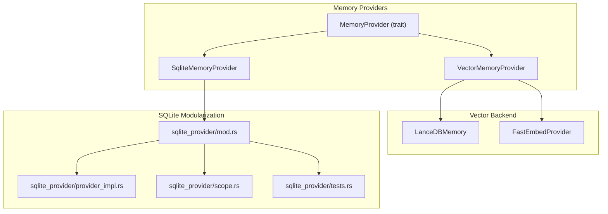
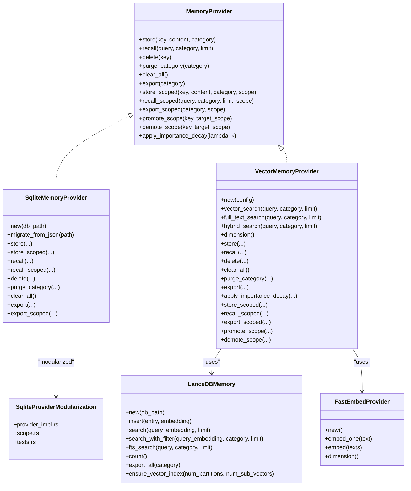
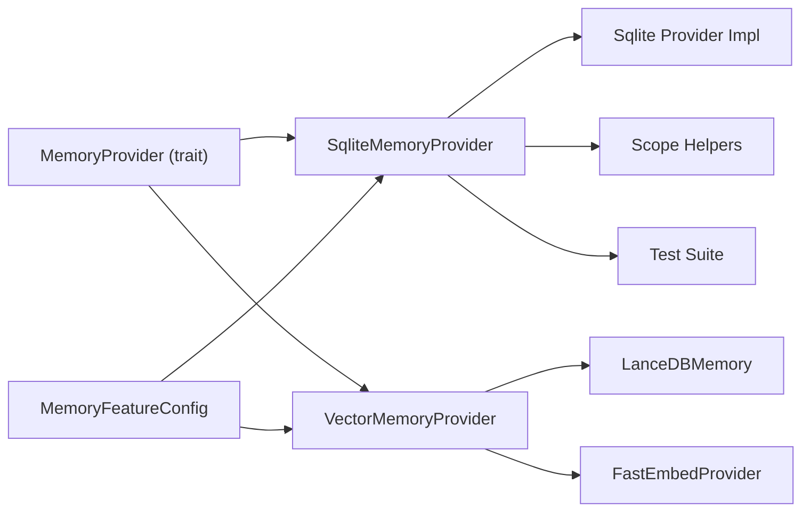

# Memory Storage Providers

<cite>
**Referenced Files in This Document**
- [mod.rs](file://src-tauri/src/modules/memory/providers/mod.rs)
- [sqlite_provider/mod.rs](file://src-tauri/src/modules/memory/providers/sqlite_provider/mod.rs)
- [sqlite_provider/provider_impl.rs](file://src-tauri/src/modules/memory/providers/sqlite_provider/provider_impl.rs)
- [sqlite_provider/scope.rs](file://src-tauri/src/modules/memory/providers/sqlite_provider/scope.rs)
- [sqlite_provider/tests.rs](file://src-tauri/src/modules/memory/providers/sqlite_provider/tests.rs)
- [vector_provider.rs](file://src-tauri/src/modules/memory/providers/vector_provider.rs)
- [lancedb.rs](file://src-tauri/src/modules/memory/providers/lancedb.rs)
- [embedding/mod.rs](file://src-tauri/src/modules/memory/embedding/mod.rs)
- [embedding/fastembed.rs](file://src-tauri/src/modules/memory/embedding/fastembed.rs)
- [memory/mod.rs](file://src-tauri/src/modules/memory/mod.rs)
- [memory/config.rs](file://src-tauri/src/modules/runtime/config/memory.rs)
- [application/provider_service.rs](file://src-tauri/src/modules/application/provider_service.rs)
- [commands/provider.rs](file://src-tauri/src/commands/provider.rs)
</cite>

## Update Summary
**Changes Made**
- Updated project structure to reflect SQLite provider modularization
- Added documentation for the new modularized SQLite provider structure
- Updated file references to show the new directory layout with separate provider implementation, scope helpers, and test suite
- Enhanced architecture diagrams to show the modularized SQLite provider components

## Table of Contents
1. [Introduction](#introduction)
2. [Project Structure](#project-structure)
3. [Core Components](#core-components)
4. [Architecture Overview](#architecture-overview)
5. [Detailed Component Analysis](#detailed-component-analysis)
6. [Dependency Analysis](#dependency-analysis)
7. [Performance Considerations](#performance-considerations)
8. [Troubleshooting Guide](#troubleshooting-guide)
9. [Conclusion](#conclusion)
10. [Appendices](#appendices)

## Introduction
This document explains the memory storage provider architecture in the system. It covers the provider abstraction layer, the LanceDB vector database integration, the SQLite provider for relational storage, and the generic vector provider interface. It documents provider selection logic, data persistence strategies, query optimization, performance characteristics, configuration examples, data migration between providers, and guidance for developing custom providers. Provider-specific features, limitations, and best practices are included for each backend.

## Project Structure
The memory subsystem is organized around a unified provider trait and multiple implementations. The SQLite provider has been modularized into separate components for better maintainability and separation of concerns:
- A generic MemoryProvider trait defines the contract for storage and retrieval.
- Two concrete providers implement the trait:
  - SqliteMemoryProvider: relational persistence with scope-aware visibility and full-text search (modularized into separate files).
  - VectorMemoryProvider: semantic search powered by LanceDB + FastEmbed, with optional SQLite dual-write.
- Supporting components:
  - LanceDBMemory: low-level vector store with ANN and FTS.
  - FastEmbedProvider: offline text embedding generator.
  - Runtime configuration for memory features and recall modes.

**Diagram sources**
- [providers/mod.rs:1-15](file://src-tauri/src/modules/memory/providers/mod.rs#L1-L15)
- [sqlite_provider/mod.rs:1-269](file://src-tauri/src/modules/memory/providers/sqlite_provider/mod.rs#L1-L269)
- [sqlite_provider/provider_impl.rs:1-595](file://src-tauri/src/modules/memory/providers/sqlite_provider/provider_impl.rs#L1-L595)
- [sqlite_provider/scope.rs:1-111](file://src-tauri/src/modules/memory/providers/sqlite_provider/scope.rs#L1-L111)
- [sqlite_provider/tests.rs:1-644](file://src-tauri/src/modules/memory/providers/sqlite_provider/tests.rs#L1-L644)
- [vector_provider.rs:1-200](file://src-tauri/src/modules/memory/providers/vector_provider.rs#L1-L200)
- [lancedb.rs:1-200](file://src-tauri/src/modules/memory/providers/lancedb.rs#L1-L200)
- [embedding/mod.rs:1-11](file://src-tauri/src/modules/memory/embedding/mod.rs#L1-L11)

**Section sources**
- [providers/mod.rs:1-15](file://src-tauri/src/modules/memory/providers/mod.rs#L1-L15)
- [sqlite_provider/mod.rs:1-269](file://src-tauri/src/modules/memory/providers/sqlite_provider/mod.rs#L1-L269)
- [sqlite_provider/provider_impl.rs:1-595](file://src-tauri/src/modules/memory/providers/sqlite_provider/provider_impl.rs#L1-L595)
- [sqlite_provider/scope.rs:1-111](file://src-tauri/src/modules/memory/providers/sqlite_provider/scope.rs#L1-L111)
- [sqlite_provider/tests.rs:1-644](file://src-tauri/src/modules/memory/providers/sqlite_provider/tests.rs#L1-L644)

## Core Components
- MemoryProvider trait: Defines the standard CRUD and recall operations, plus scope-aware variants, export, and lifecycle hooks like importance decay and scope promotion/demotion.
- SqliteMemoryProvider: Relational storage with indexes, category and scope filters, and a migration path from legacy JSON. Now modularized into separate files for better organization.
- VectorMemoryProvider: Semantic search via LanceDB with hybrid recall (vector + FTS), optional SQLite dual-write for durability and metadata.
- LanceDBMemory: Low-level vector store with Arrow schema, IVF-PQ index management, and FTS fallback.
- FastEmbedProvider: Offline embedding generation with a fixed 384-dimension model.

**Section sources**
- [memory/mod.rs:89-200](file://src-tauri/src/modules/memory/mod.rs#L89-L200)
- [sqlite_provider/mod.rs:24-38](file://src-tauri/src/modules/memory/providers/sqlite_provider/mod.rs#L24-L38)
- [sqlite_provider/provider_impl.rs:18-595](file://src-tauri/src/modules/memory/providers/sqlite_provider/provider_impl.rs#L18-L595)
- [vector_provider.rs:98-117](file://src-tauri/src/modules/memory/providers/vector_provider.rs#L98-L117)
- [lancedb.rs:108-145](file://src-tauri/src/modules/memory/providers/lancedb.rs#L108-L145)
- [embedding/fastembed.rs:31-107](file://src-tauri/src/modules/memory/embedding/fastembed.rs#L31-L107)

## Architecture Overview
The provider architecture centers on a single trait implemented by multiple backends. VectorMemoryProvider composes LanceDB and FastEmbed, optionally mirroring writes to SQLite for metadata and scope persistence. SqliteMemoryProvider offers robust relational storage with scope-aware visibility and efficient indexing. The SQLite provider has been modularized into separate components for better maintainability.

**Diagram sources**
- [memory/mod.rs:89-200](file://src-tauri/src/modules/memory/mod.rs#L89-L200)
- [sqlite_provider/mod.rs:24-38](file://src-tauri/src/modules/memory/providers/sqlite_provider/mod.rs#L24-L38)
- [sqlite_provider/provider_impl.rs:18-595](file://src-tauri/src/modules/memory/providers/sqlite_provider/provider_impl.rs#L18-L595)
- [sqlite_provider/scope.rs:1-111](file://src-tauri/src/modules/memory/providers/sqlite_provider/scope.rs#L1-L111)
- [sqlite_provider/tests.rs:1-644](file://src-tauri/src/modules/memory/providers/sqlite_provider/tests.rs#L1-L644)
- [vector_provider.rs:98-117](file://src-tauri/src/modules/memory/providers/vector_provider.rs#L98-L117)
- [lancedb.rs:117-353](file://src-tauri/src/modules/memory/providers/lancedb.rs#L117-L353)
- [embedding/fastembed.rs:40-107](file://src-tauri/src/modules/memory/embedding/fastembed.rs#L40-L107)

## Detailed Component Analysis

### MemoryProvider Trait
Defines the provider contract with asynchronous methods for storage, recall, deletion, purging, exporting, and scope-aware operations. Includes optional hooks for importance decay and scope promotion/demotion.

- Core methods: store, recall, delete, purge_category, clear_all, export.
- Scope-aware methods: store_scoped, recall_scoped, export_scoped.
- Policy hooks: promote_scope, demote_scope, apply_importance_decay.
- Default implementations delegate to non-scope variants for backward compatibility.

**Section sources**
- [memory/mod.rs:89-200](file://src-tauri/src/modules/memory/mod.rs#L89-L200)

### SqliteMemoryProvider (Modularized)
The SQLite provider has been modularized into separate components for better maintainability and separation of concerns:

**Main Provider Module** (`sqlite_provider/mod.rs`):
- Contains the main SqliteMemoryProvider struct definition and basic initialization logic.
- Handles database schema creation, index management, and connection setup.
- Provides the migrate_from_json functionality for legacy data migration.

**Provider Implementation** (`sqlite_provider/provider_impl.rs`):
- Implements the MemoryProvider trait for all core operations.
- Contains all CRUD operations, recall methods, export functions, and scope management.
- Includes the apply_importance_decay implementation for Weibull decay calculations.

**Scope Helpers** (`sqlite_provider/scope.rs`):
- Contains scope-aware visibility logic with three-tier visibility rules.
- Provides SQL clause construction for scope filtering and ordering.
- Includes category parsing utilities.

**Test Suite** (`sqlite_provider/tests.rs`):
- Comprehensive test coverage for all SQLite provider functionality.
- Tests scope visibility rules, data persistence, migration, and edge cases.
- Includes regression tests for three-tier scope isolation.

Key behaviors:
- store/store_scoped: inserts/upserts with ON CONFLICT handling; optional PII scrubbing.
- recall/recall_scoped: SQL WHERE with scope visibility clauses; ORDER BY by tier and metadata.
- export/export_scoped: ordered exports by updated_at; scoped filtering.
- clear_all: optimized single DELETE for bulk wipe.
- migrate_from_json: transactional import from legacy format.

**Section sources**
- [sqlite_provider/mod.rs:24-38](file://src-tauri/src/modules/memory/providers/sqlite_provider/mod.rs#L24-L38)
- [sqlite_provider/mod.rs:184-264](file://src-tauri/src/modules/memory/providers/sqlite_provider/mod.rs#L184-L264)
- [sqlite_provider/provider_impl.rs:18-595](file://src-tauri/src/modules/memory/providers/sqlite_provider/provider_impl.rs#L18-L595)
- [sqlite_provider/scope.rs:8-111](file://src-tauri/src/modules/memory/providers/sqlite_provider/scope.rs#L8-L111)
- [sqlite_provider/tests.rs:1-644](file://src-tauri/src/modules/memory/providers/sqlite_provider/tests.rs#L1-L644)

### VectorMemoryProvider
Semantic search provider with:
- Dual-write strategy: SQLite first (authoritative), LanceDB async (eventually consistent).
- Hybrid recall: vector similarity + full-text search with reciprocal rank fusion.
- Optional SQLite dual-write for importance decay and scope metadata.
- Scope-aware store/recall/export/promote/demote routed to SQLite mirror when enabled.

Dual-write flow:
- store: SQLite synchronous write; optional async LanceDB insert.
- store_scoped: PII scrub once; SQLite scoped write; optional async LanceDB insert mirroring.
- recall/recall_scoped/export/export_scoped: when SQLite mirror is enabled, delegate to SQLite; otherwise fallback to scope-less behavior.

Indexing and search:
- ensure_vector_index builds IVF-PQ index when table grows; soft-fails to brute-force scan otherwise.
- hybrid_search runs vector and FTS in parallel, then fuses results.

**Section sources**
- [vector_provider.rs:98-117](file://src-tauri/src/modules/memory/providers/vector_provider.rs#L98-L117)
- [vector_provider.rs:119-178](file://src-tauri/src/modules/memory/providers/vector_provider.rs#L119-L178)
- [vector_provider.rs:195-275](file://src-tauri/src/modules/memory/providers/vector_provider.rs#L195-L275)
- [vector_provider.rs:314-649](file://src-tauri/src/modules/memory/providers/vector_provider.rs#L314-L649)

### LanceDBMemory
Low-level vector store with:
- Arrow schema for memory entries including embedding arrays.
- Insertion via RecordBatch iterators.
- Vector search with configurable limits and category filters.
- Full-text search fallback (client-side filtering).
- Index management: ensure_vector_index creates IVF-PQ index when conditions are met.
- Export and count operations.

**Section sources**
- [lancedb.rs:59-106](file://src-tauri/src/modules/memory/providers/lancedb.rs#L59-L106)
- [lancedb.rs:117-164](file://src-tauri/src/modules/memory/providers/lancedb.rs#L117-L164)
- [lancedb.rs:166-239](file://src-tauri/src/modules/memory/providers/lancedb.rs#L166-L239)
- [lancedb.rs:267-342](file://src-tauri/src/modules/memory/providers/lancedb.rs#L267-L342)
- [lancedb.rs:355-430](file://src-tauri/src/modules/memory/providers/lancedb.rs#L355-L430)

### FastEmbedProvider
Offline embedding generator:
- Multilingual model with 384-dimension embeddings.
- Single and batch embedding APIs with dimension checks.
- Thread-safe access via a mutex-protected model instance.

**Section sources**
- [embedding/fastembed.rs:31-107](file://src-tauri/src/modules/memory/embedding/fastembed.rs#L31-L107)

### Provider Selection Logic and Configuration
Provider selection is driven by runtime configuration and feature flags:
- Memory recall mode: lexical vs hybrid (semantic) recall.
- Memory control plane: scope-aware operations and policy enforcement.
- Provider transport policy: timeouts and retries for external provider clients.

Provider configuration commands:
- List providers, configure, test connectivity, list and select models.
- Persist provider and model selections.

**Section sources**
- [memory/config.rs:15-60](file://src-tauri/src/modules/runtime/config/memory.rs#L15-L60)
- [memory/config.rs:124-187](file://src-tauri/src/modules/runtime/config/memory.rs#L124-L187)
- [application/provider_service.rs:48-66](file://src-tauri/src/modules/application/provider_service.rs#L48-L66)
- [commands/provider.rs:13-98](file://src-tauri/src/commands/provider.rs#L13-L98)

## Dependency Analysis
- MemoryProvider trait is the central abstraction; implementations depend on storage backends.
- VectorMemoryProvider depends on LanceDBMemory and FastEmbedProvider.
- SqliteMemoryProvider is now modularized with separate components for implementation, scope helpers, and tests.
- Runtime configuration influences recall mode and control plane behavior.

**Diagram sources**
- [memory/mod.rs:89-200](file://src-tauri/src/modules/memory/mod.rs#L89-L200)
- [sqlite_provider/mod.rs:24-38](file://src-tauri/src/modules/memory/providers/sqlite_provider/mod.rs#L24-L38)
- [sqlite_provider/provider_impl.rs:18-595](file://src-tauri/src/modules/memory/providers/sqlite_provider/provider_impl.rs#L18-L595)
- [sqlite_provider/scope.rs:1-111](file://src-tauri/src/modules/memory/providers/sqlite_provider/scope.rs#L1-L111)
- [sqlite_provider/tests.rs:1-644](file://src-tauri/src/modules/memory/providers/sqlite_provider/tests.rs#L1-L644)
- [vector_provider.rs:30-37](file://src-tauri/src/modules/memory/providers/vector_provider.rs#L30-L37)
- [lancedb.rs:13-23](file://src-tauri/src/modules/memory/providers/lancedb.rs#L13-L23)
- [embedding/fastembed.rs:13-16](file://src-tauri/src/modules/memory/embedding/fastembed.rs#L13-L16)
- [memory/config.rs:124-187](file://src-tauri/src/modules/runtime/config/memory.rs#L124-L187)

**Section sources**
- [memory/mod.rs:89-200](file://src-tauri/src/modules/memory/mod.rs#L89-L200)
- [vector_provider.rs:30-37](file://src-tauri/src/modules/memory/providers/vector_provider.rs#L30-L37)
- [sqlite_provider/mod.rs:13-20](file://src-tauri/src/modules/memory/providers/sqlite_provider/mod.rs#L13-L20)
- [memory/config.rs:124-187](file://src-tauri/src/modules/runtime/config/memory.rs#L124-L187)

## Performance Considerations
- SQLite:
  - Indexed columns: category, created_at, and scope-aware partial indexes reduce query cost.
  - Scope-aware ORDER BY prioritizes entries by tier and metadata.
  - clear_all uses a single DELETE for bulk removal.
  - Modularization improves maintainability without impacting performance.
- Vector (LanceDB):
  - IVF-PQ index improves vector search performance on large datasets; index creation is guarded and soft-fails to brute-force.
  - Hybrid search fuses vector and FTS results; parallel execution reduces latency.
  - Embedding dimension is fixed at 384; dimension mismatches are caught early.
- Dual-write:
  - SQLite-first write ensures durability and metadata consistency; LanceDB async insert prevents write-path blocking.
  - When dual-write is disabled, VectorMemoryProvider writes synchronously to LanceDB only.

## Troubleshooting Guide
Common issues and resolutions:
- SQLite initialization failures: provider falls back to in-memory provider; check filesystem permissions and path availability.
- Legacy migration: migrate_from_json is idempotent and uses transactions; verify legacy file presence and format.
- Vector index creation: ensure sufficient rows and appropriate parameters; soft-fails to brute-force scan if training fails.
- Dimension mismatch: embedding dimension must match LanceDB expectation; verify model and embedding pipeline.
- Scope visibility: ensure session_id/project_id are set consistently; recall_scoped filters by three-tier visibility rules.
- Clear all memories: when dual-write is enabled, SQLite is cleared first; otherwise LanceDB counts are authoritative.
- **Updated**: SQLite provider modularization: if encountering import issues, ensure proper module paths are used for the new structure.

**Section sources**
- [sqlite_provider/mod.rs:184-264](file://src-tauri/src/modules/memory/providers/sqlite_provider/mod.rs#L184-L264)
- [sqlite_provider/provider_impl.rs:355-368](file://src-tauri/src/modules/memory/providers/sqlite_provider/provider_impl.rs#L355-L368)
- [lancedb.rs:267-342](file://src-tauri/src/modules/memory/providers/lancedb.rs#L267-L342)
- [vector_provider.rs:141-148](file://src-tauri/src/modules/memory/providers/vector_provider.rs#L141-L148)

## Conclusion
The memory storage architecture provides a flexible, extensible abstraction with robust relational and semantic backends. SQLite offers durable, scope-aware relational storage with efficient indexing, while VectorMemoryProvider delivers semantic search with hybrid recall and optional dual-write for metadata consistency. Runtime configuration governs recall mode and control plane behavior, enabling operators to balance performance, accuracy, and compliance. The SQLite provider's modularization improves maintainability without sacrificing functionality.

## Appendices

### Provider Configuration Examples
- Vector provider configuration with optional SQLite dual-write:
  - Set db_path to a writable directory.
  - Optionally set sqlite_path to enable dual-write and importance decay.
- Memory feature flags:
  - recall_mode: lexical or hybrid.
  - control_plane_v1_enabled: enables scope-aware operations.
  - policy_enforce_mode: shadow or enforce.

**Section sources**
- [vector_provider.rs:55-96](file://src-tauri/src/modules/memory/providers/vector_provider.rs#L55-L96)
- [memory/config.rs:15-60](file://src-tauri/src/modules/runtime/config/memory.rs#L15-L60)
- [memory/config.rs:124-187](file://src-tauri/src/modules/runtime/config/memory.rs#L124-L187)

### Data Migration Between Providers
- From legacy JSON to SQLite:
  - Use migrate_from_json to import entries into SQLite within a transaction.
  - Existing entries with matching keys are preserved (ON CONFLICT key DO NOTHING).
- From SQLite to Vector:
  - Export from SQLite and re-ingest into VectorMemoryProvider; embeddings are computed and inserted into LanceDB.
- From Vector to SQLite:
  - Export from LanceDB and re-ingest into SQLite; metadata and scope are preserved.

**Section sources**
- [sqlite_provider/mod.rs:184-264](file://src-tauri/src/modules/memory/providers/sqlite_provider/mod.rs#L184-L264)
- [vector_provider.rs:458-467](file://src-tauri/src/modules/memory/providers/vector_provider.rs#L458-L467)
- [lancedb.rs:251-265](file://src-tauri/src/modules/memory/providers/lancedb.rs#L251-L265)

### Custom Provider Development
Steps to implement a new provider:
- Implement the MemoryProvider trait with store, recall, delete, purge_category, clear_all, export, and optional scope-aware methods.
- Choose storage backend(s) and define schema/indexes as needed.
- Integrate with runtime configuration and feature flags.
- Add provider selection logic and CLI/commands for configuration and testing.

Best practices:
- Provide clear error types and propagate meaningful errors.
- Support scope-aware operations for compliance and isolation.
- Optimize queries with indexes and appropriate ordering.
- Consider dual-write patterns for durability and metadata consistency.

**Section sources**
- [memory/mod.rs:89-200](file://src-tauri/src/modules/memory/mod.rs#L89-L200)
- [commands/provider.rs:13-98](file://src-tauri/src/commands/provider.rs#L13-L98)

### SQLite Provider Modularization Details
The SQLite provider has been modularized into four distinct components:

**Module Structure**:
- `sqlite_provider/mod.rs`: Main provider struct and initialization logic
- `sqlite_provider/provider_impl.rs`: Complete MemoryProvider trait implementation
- `sqlite_provider/scope.rs`: Scope-aware visibility and SQL helper functions
- `sqlite_provider/tests.rs`: Comprehensive test suite (moved from main module)

**Benefits of Modularization**:
- Improved code organization and maintainability
- Better separation of concerns between implementation, scope logic, and tests
- Reduced complexity in the main module (now only 269 lines vs previous 1579)
- Easier testing and debugging of individual components
- Maintained backward compatibility for external imports

**Migration Impact**:
- External imports remain unchanged due to re-export in the main module
- All functionality preserved with improved structure
- Test coverage maintained through dedicated test module

**Section sources**
- [sqlite_provider/mod.rs:1-269](file://src-tauri/src/modules/memory/providers/sqlite_provider/mod.rs#L1-L269)
- [sqlite_provider/provider_impl.rs:1-595](file://src-tauri/src/modules/memory/providers/sqlite_provider/provider_impl.rs#L1-L595)
- [sqlite_provider/scope.rs:1-111](file://src-tauri/src/modules/memory/providers/sqlite_provider/scope.rs#L1-L111)
- [sqlite_provider/tests.rs:1-644](file://src-tauri/src/modules/memory/providers/sqlite_provider/tests.rs#L1-L644)