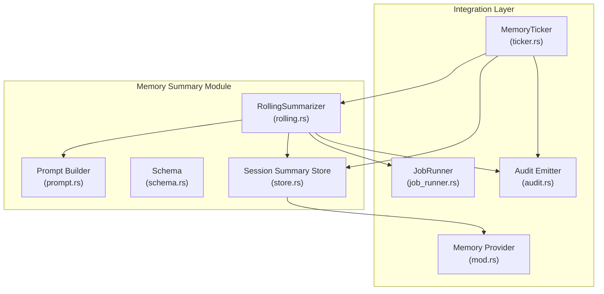
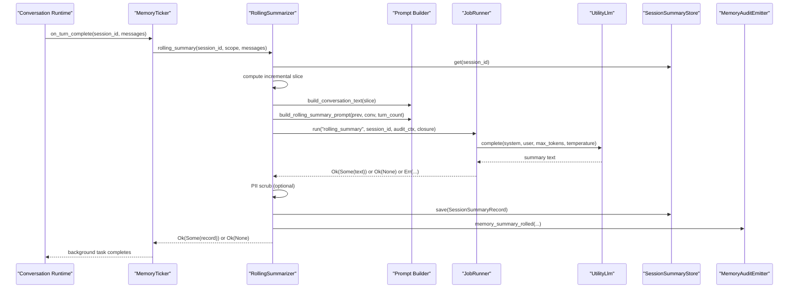
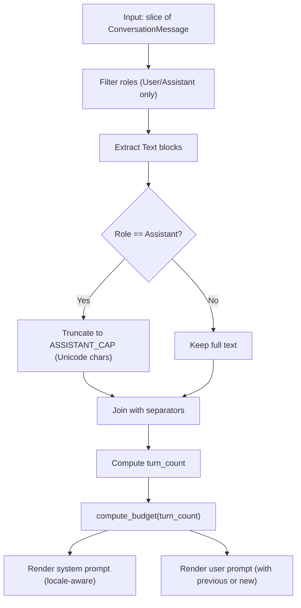
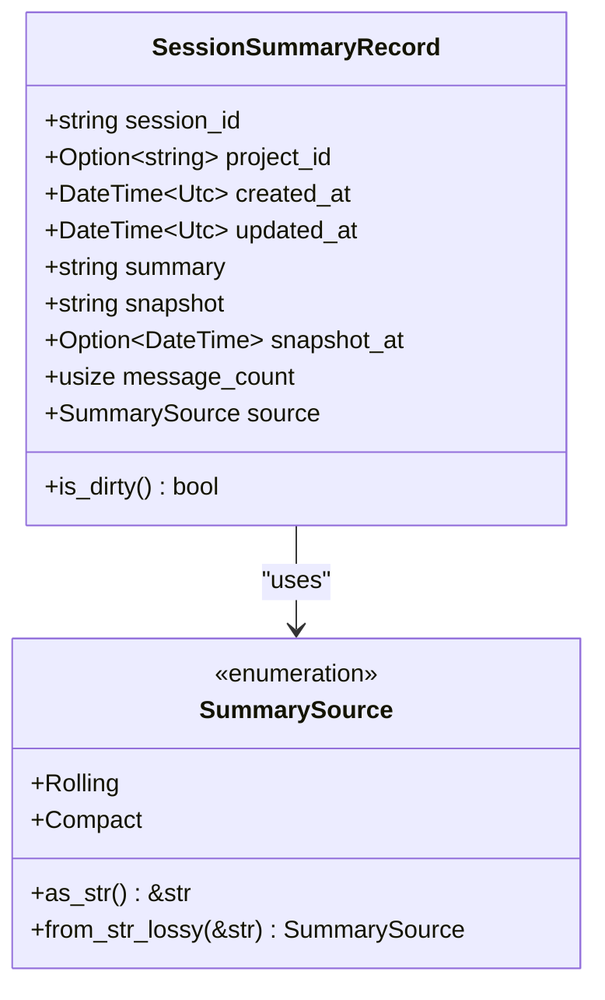
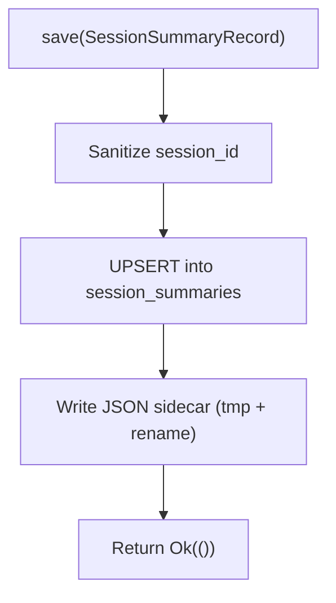
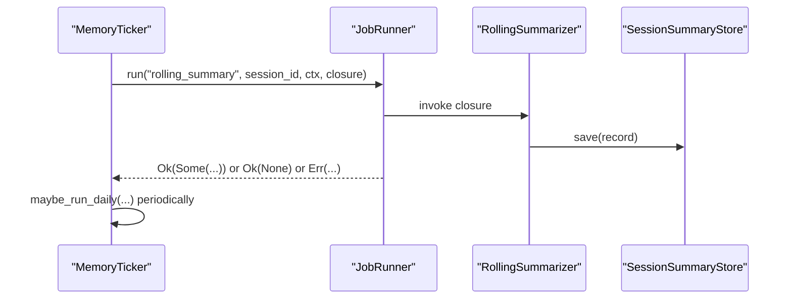
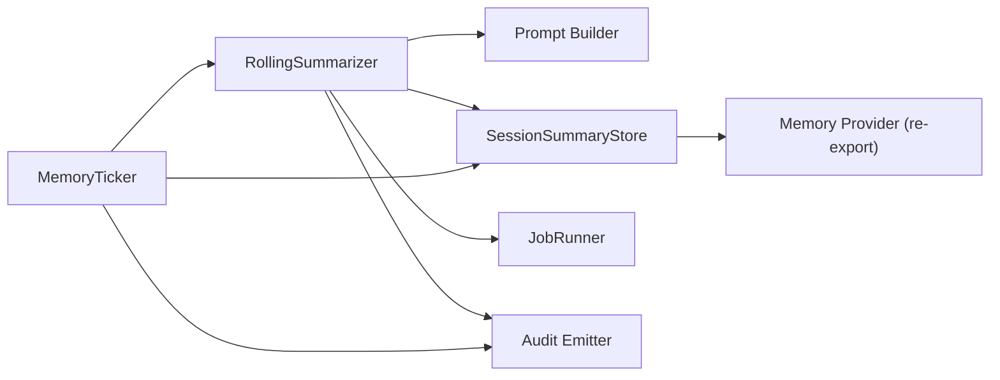

# Memory Summary System

<cite>
**Referenced Files in This Document**
- [mod.rs](file://src-tauri/src/modules/memory/summary/mod.rs)
- [rolling.rs](file://src-tauri/src/modules/memory/summary/rolling.rs)
- [schema.rs](file://src-tauri/src/modules/memory/summary/schema.rs)
- [store.rs](file://src-tauri/src/modules/memory/summary/store.rs)
- [prompt.rs](file://src-tauri/src/modules/memory/summary/prompt.rs)
- [mod.rs](file://src-tauri/src/modules/memory/mod.rs)
- [ticker.rs](file://src-tauri/src/modules/memory/ticker.rs)
- [job_runner.rs](file://src-tauri/src/modules/memory/job_runner.rs)
- [audit.rs](file://src-tauri/src/modules/memory/audit.rs)
</cite>

## Table of Contents
1. [Introduction](#introduction)
2. [Project Structure](#project-structure)
3. [Core Components](#core-components)
4. [Architecture Overview](#architecture-overview)
5. [Detailed Component Analysis](#detailed-component-analysis)
6. [Dependency Analysis](#dependency-analysis)
7. [Performance Considerations](#performance-considerations)
8. [Troubleshooting Guide](#troubleshooting-guide)
9. [Conclusion](#conclusion)

## Introduction
This document describes the memory summary system responsible for continuous, rolling conversation summarization in the memory subsystem. It explains the rolling summary algorithm, prompt engineering, schema definition, and persistent storage. It also covers summarization strategies, quality controls, performance optimizations, integration with the broader memory system, caching and refresh strategies, and conflict resolution mechanisms.

## Project Structure
The memory summary system resides in the Rust memory module under the `summary` subpackage. It is integrated with the broader memory system via the `MemoryTicker`, `JobRunner`, and audit/emission infrastructure.



**Diagram sources**
- [rolling.rs:85-310](file://src-tauri/src/modules/memory/summary/rolling.rs#L85-L310)
- [prompt.rs:109-124](file://src-tauri/src/modules/memory/summary/prompt.rs#L109-L124)
- [schema.rs:36-67](file://src-tauri/src/modules/memory/summary/schema.rs#L36-L67)
- [store.rs:39-69](file://src-tauri/src/modules/memory/summary/store.rs#L39-L69)
- [ticker.rs:134-144](file://src-tauri/src/modules/memory/ticker.rs#L134-L144)
- [job_runner.rs:141-147](file://src-tauri/src/modules/memory/job_runner.rs#L141-L147)
- [audit.rs:192-738](file://src-tauri/src/modules/memory/audit.rs#L192-L738)
- [mod.rs:28-54](file://src-tauri/src/modules/memory/mod.rs#L28-L54)

**Section sources**
- [mod.rs:1-31](file://src-tauri/src/modules/memory/summary/mod.rs#L1-L31)
- [mod.rs:28-54](file://src-tauri/src/modules/memory/mod.rs#L28-L54)

## Core Components
- RollingSummarizer orchestrates the rolling summary pipeline, including incremental slicing, prompt building, LLM invocation, PII scrubbing, and persistence.
- Prompt builder computes budgets and constructs system/user prompts tailored to locale and turn counts.
- Schema defines the SessionSummaryRecord and SummarySource enumeration for provenance tracking.
- SessionSummaryStore provides dual-write persistence (SQLite + JSON sidecar) with dirty tracking and snapshot management.
- MemoryTicker coordinates periodic rolling summaries, compile cycles, and recovery.
- JobRunner provides bounded retries, concurrency caps, and audit persistence for background jobs.
- Audit Emitter records structured events for observability and UI integration.

**Section sources**
- [rolling.rs:85-310](file://src-tauri/src/modules/memory/summary/rolling.rs#L85-L310)
- [prompt.rs:109-124](file://src-tauri/src/modules/memory/summary/prompt.rs#L109-L124)
- [schema.rs:36-111](file://src-tauri/src/modules/memory/summary/schema.rs#L36-L111)
- [store.rs:39-69](file://src-tauri/src/modules/memory/summary/store.rs#L39-L69)
- [ticker.rs:134-144](file://src-tauri/src/modules/memory/ticker.rs#L134-L144)
- [job_runner.rs:141-147](file://src-tauri/src/modules/memory/job_runner.rs#L141-L147)
- [audit.rs:192-738](file://src-tauri/src/modules/memory/audit.rs#L192-L738)

## Architecture Overview
The rolling summary pipeline is turn-driven and idempotent. It reads the existing summary, slices new messages incrementally, builds a prompt with computed budget, runs through JobRunner for retry/backoff, scrubs PII, persists via dual-write, and emits audit events.



**Diagram sources**
- [ticker.rs:750-800](file://src-tauri/src/modules/memory/ticker.rs#L750-L800)
- [rolling.rs:137-310](file://src-tauri/src/modules/memory/summary/rolling.rs#L137-L310)
- [prompt.rs:109-124](file://src-tauri/src/modules/memory/summary/prompt.rs#L109-L124)
- [job_runner.rs:293-348](file://src-tauri/src/modules/memory/job_runner.rs#L293-L348)
- [store.rs:268-331](file://src-tauri/src/modules/memory/summary/store.rs#L268-L331)
- [audit.rs:693-738](file://src-tauri/src/modules/memory/audit.rs#L693-L738)

## Detailed Component Analysis

### RollingSummarizer
- Responsibilities:
  - Read existing SessionSummaryRecord.
  - Skip rolling if a recent Compact summary exists (coordination window).
  - Slice messages incrementally based on message_count.
  - Build conversation text and compute budget.
  - Construct system/user prompts and invoke LLM via JobRunner.
  - PII scrubbing and persistence via SessionSummaryStore.
  - Emit memory_summary_rolled audit.
- Edge cases:
  - Empty messages, whitespace-only conversation text, or quarantined JobRunner entries return Ok(None).
  - Infrastructure failures return Err(MemoryError).

```mermaid
flowchart TD
Start(["rolling_summary(session_id, scope, messages)"]) --> Load["Load existing record"]
Load --> CompactCheck{"Recent Compact summary?"}
CompactCheck --> |Yes| Skip["Skip rolling (return Ok(None))"]
CompactCheck --> |No| Slice["Compute incremental slice"]
Slice --> EmptySlice{"Slice empty?"}
EmptySlice --> |Yes| Skip
EmptySlice --> |No| Format["Format conversation text"]
Format --> EmptyConv{"Empty after formatting?"}
EmptyConv --> |Yes| Skip
EmptyConv --> |No| Budget["Compute budget and build prompt"]
Budget --> Run["JobRunner.run('rolling_summary', ...)"]
Run --> Result{"Result"}
Result --> |Ok(None)| Skip
Result --> |Err(Generic)| Error["Return Err(MemoryError)"]
Result --> |Ok(Some(summary))| Scrub["PII scrub (optional)"]
Scrub --> Save["Upsert SessionSummaryRecord"]
Save --> Audit["Emit memory_summary_rolled"]
Audit --> Done(["Return Ok(Some(record))"])
```

**Diagram sources**
- [rolling.rs:137-310](file://src-tauri/src/modules/memory/summary/rolling.rs#L137-L310)

**Section sources**
- [rolling.rs:85-310](file://src-tauri/src/modules/memory/summary/rolling.rs#L85-L310)

### Prompt Engineering and Budgeting
- Budget computation:
  - total_chars = clamp(turn_count * 40, 40, 400)
  - facts_chars = round(total_chars * 0.3)
  - events_chars = total_chars - facts_chars
  - max_tokens = clamp(round(total_chars * 1.5), 150, 750)
- Locale-aware templates:
  - Chinese template with fixed two-section structure: “重要事实” and “事情经过”.
  - English template with equivalent “Key facts” and “What happened”.
- Conversation text formatting:
  - Filters out System and Tool messages.
  - Concatenates Text blocks; ignores ToolUse/ToolResult blocks.
  - Truncates Assistant replies longer than ASSISTANT_CAP with locale-specific markers.
  - Uses double newline separators between turns.



**Diagram sources**
- [prompt.rs:109-124](file://src-tauri/src/modules/memory/summary/prompt.rs#L109-L124)
- [prompt.rs:216-277](file://src-tauri/src/modules/memory/summary/prompt.rs#L216-L277)

**Section sources**
- [prompt.rs:82-98](file://src-tauri/src/modules/memory/summary/prompt.rs#L82-L98)
- [prompt.rs:126-190](file://src-tauri/src/modules/memory/summary/prompt.rs#L126-L190)
- [prompt.rs:216-277](file://src-tauri/src/modules/memory/summary/prompt.rs#L216-L277)

### Schema Definition
- SessionSummaryRecord fields:
  - session_id (primary key), project_id, timestamps, summary, snapshot, snapshot_at, message_count, source.
- Dirty tracking:
  - is_dirty() compares summary vs snapshot.
- SummarySource:
  - Rolling (default) vs Compact (context-window compaction).



**Diagram sources**
- [schema.rs:36-76](file://src-tauri/src/modules/memory/summary/schema.rs#L36-L76)
- [schema.rs:79-111](file://src-tauri/src/modules/memory/summary/schema.rs#L79-L111)

**Section sources**
- [schema.rs:20-76](file://src-tauri/src/modules/memory/summary/schema.rs#L20-L76)
- [schema.rs:78-111](file://src-tauri/src/modules/memory/summary/schema.rs#L78-L111)

### Summary Store (Dual-Write Persistence)
- Dual-write contract:
  - SQLite UPSERT (authoritative).
  - JSON sidecar written atomically via tmp + rename (best-effort).
- Safety and portability:
  - Filename sanitization rejects unsafe session_id values.
  - Indexes on project_id and updated_at for efficient queries.
  - Snapshot-based dirty tracking computed at query time.
- Operations:
  - get, save, list_in_range, list_dirty, mark_processed.



**Diagram sources**
- [store.rs:268-331](file://src-tauri/src/modules/memory/summary/store.rs#L268-L331)
- [store.rs:220-239](file://src-tauri/src/modules/memory/summary/store.rs#L220-L239)

**Section sources**
- [store.rs:39-69](file://src-tauri/src/modules/memory/summary/store.rs#L39-L69)
- [store.rs:109-170](file://src-tauri/src/modules/memory/summary/store.rs#L109-L170)
- [store.rs:268-331](file://src-tauri/src/modules/memory/summary/store.rs#L268-L331)
- [store.rs:388-453](file://src-tauri/src/modules/memory/summary/store.rs#L388-L453)

### Integration with MemoryTicker and JobRunner
- MemoryTicker:
  - Periodic rolling summaries every N turns.
  - Session-end flush and daily compile assembly.
  - Startup recovery scanning JSON sidecars for dirty sessions.
- JobRunner:
  - Bounded retries, concurrency cap, and persistent state.
  - Emits memory_job_failed/memory_job_skipped audits.



**Diagram sources**
- [ticker.rs:210-261](file://src-tauri/src/modules/memory/ticker.rs#L210-L261)
- [job_runner.rs:293-348](file://src-tauri/src/modules/memory/job_runner.rs#L293-L348)
- [rolling.rs:225-232](file://src-tauri/src/modules/memory/summary/rolling.rs#L225-L232)

**Section sources**
- [ticker.rs:134-144](file://src-tauri/src/modules/memory/ticker.rs#L134-L144)
- [ticker.rs:210-261](file://src-tauri/src/modules/memory/ticker.rs#L210-L261)
- [job_runner.rs:141-147](file://src-tauri/src/modules/memory/job_runner.rs#L141-L147)
- [job_runner.rs:293-348](file://src-tauri/src/modules/memory/job_runner.rs#L293-L348)

### Quality Metrics and Observability
- Audit events:
  - memory_summary_rolled: turn_count, chars_before/after, latency_ms.
  - memory_job_failed/memory_job_skipped: job, attempt, max_retries, error.
  - memory_ticker_recovery: list of recovered sessions.
- Threat scanning:
  - Optional PII scrubbing with memory_pii_redacted audit.

**Section sources**
- [audit.rs:693-738](file://src-tauri/src/modules/memory/audit.rs#L693-L738)
- [audit.rs:578-621](file://src-tauri/src/modules/memory/audit.rs#L578-L621)
- [audit.rs:482-516](file://src-tauri/src/modules/memory/audit.rs#L482-L516)
- [rolling.rs:262-272](file://src-tauri/src/modules/memory/summary/rolling.rs#L262-L272)

## Dependency Analysis
- Cohesion:
  - Summary module encapsulates rolling, prompt, schema, and store concerns.
- Coupling:
  - RollingSummarizer depends on Prompt, Store, JobRunner, and optional ThreatScanner.
  - MemoryTicker composes RollingSummarizer and MemoryCompiler.
  - Audit Emitter is a cross-cutting concern used by multiple components.
- External dependencies:
  - SQLite for durable storage.
  - Threading via tokio tasks and semaphores.
  - chrono for timestamps.



**Diagram sources**
- [rolling.rs:85-90](file://src-tauri/src/modules/memory/summary/rolling.rs#L85-L90)
- [ticker.rs:134-137](file://src-tauri/src/modules/memory/ticker.rs#L134-L137)
- [mod.rs:45-54](file://src-tauri/src/modules/memory/mod.rs#L45-L54)

**Section sources**
- [mod.rs:45-54](file://src-tauri/src/modules/memory/mod.rs#L45-L54)
- [rolling.rs:85-90](file://src-tauri/src/modules/memory/summary/rolling.rs#L85-L90)
- [ticker.rs:134-137](file://src-tauri/src/modules/memory/ticker.rs#L134-L137)

## Performance Considerations
- Incremental slicing:
  - Only processes new messages since last summary, minimizing LLM cost and latency.
- Budget-aware prompting:
  - Char-based budgets with token clamping prevent oversized requests.
- Concurrency control:
  - JobRunner semaphore limits concurrent LLM calls to protect providers.
- Storage efficiency:
  - SQLite with selective indexes; JSON sidecar for human inspection and disaster recovery.
- Deterministic temperature:
  - Low temperature (0.3) improves stability of repeated summarizations.

[No sources needed since this section provides general guidance]

## Troubleshooting Guide
- Rolling summary does nothing:
  - Check for empty/new messages, whitespace-only conversation, or quarantined JobRunner status.
- Frequent skips after failures:
  - JobRunner flips to Skipped after max_retries; use reset to re-enable.
- PII leakage:
  - Enable ThreatScanner; verify memory_pii_redacted audit entries.
- Dirty summaries not processed:
  - Use list_dirty to inspect; call mark_processed after deep memory processing.
- Startup recovery:
  - MemoryTicker scans JSON sidecars for sessions modified more recently than last summary.

**Section sources**
- [rolling.rs:137-137](file://src-tauri/src/modules/memory/summary/rolling.rs#L137-L137)
- [job_runner.rs:312-319](file://src-tauri/src/modules/memory/job_runner.rs#L312-L319)
- [job_runner.rs:252-275](file://src-tauri/src/modules/memory/job_runner.rs#L252-L275)
- [audit.rs:532-565](file://src-tauri/src/modules/memory/audit.rs#L532-L565)
- [store.rs:388-431](file://src-tauri/src/modules/memory/summary/store.rs#L388-L431)
- [ticker.rs:497-584](file://src-tauri/src/modules/memory/ticker.rs#L497-L584)

## Conclusion
The memory summary system provides a robust, incremental, and observable approach to continuous conversation summarization. Its design balances cost control, reliability, and maintainability through budget-aware prompting, bounded retries, dual-write persistence, and comprehensive auditing. Integration with MemoryTicker and JobRunner ensures timely, idempotent processing, while schema and store abstractions support future evolution and cross-session scoping.