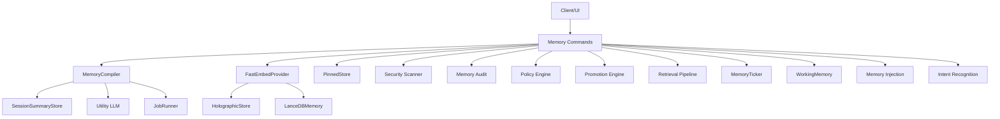
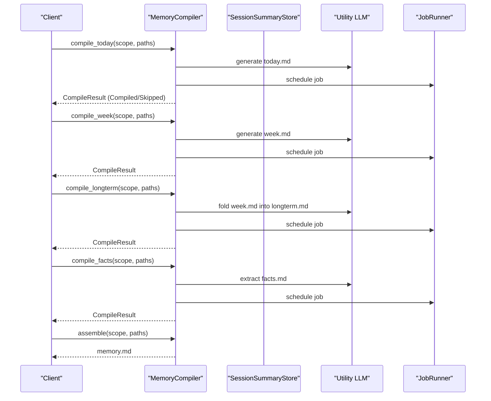
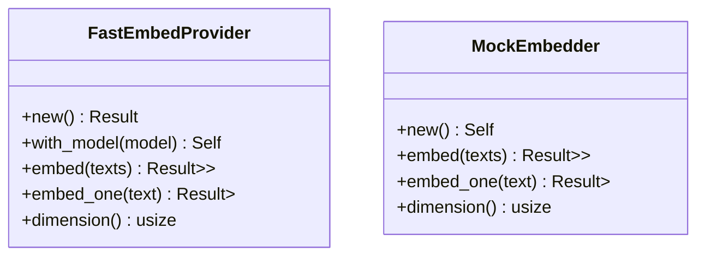
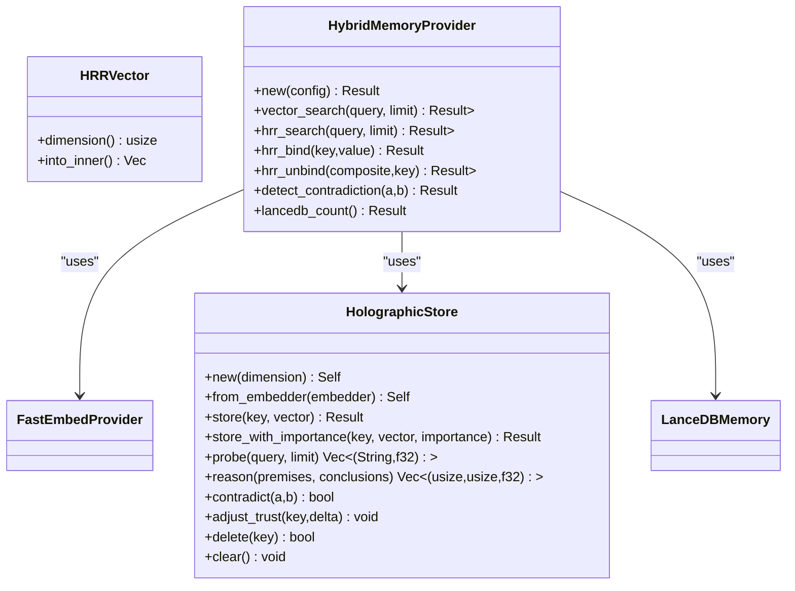
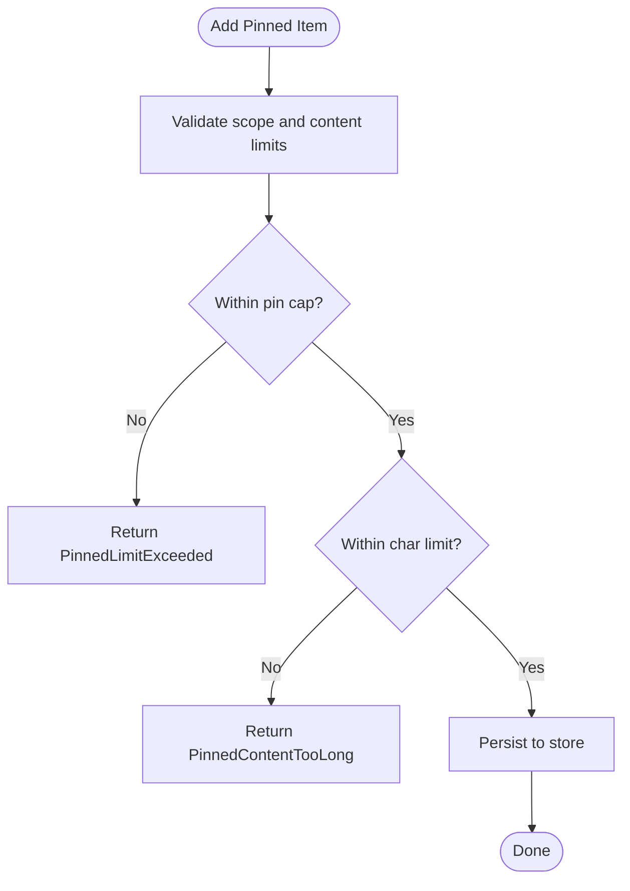
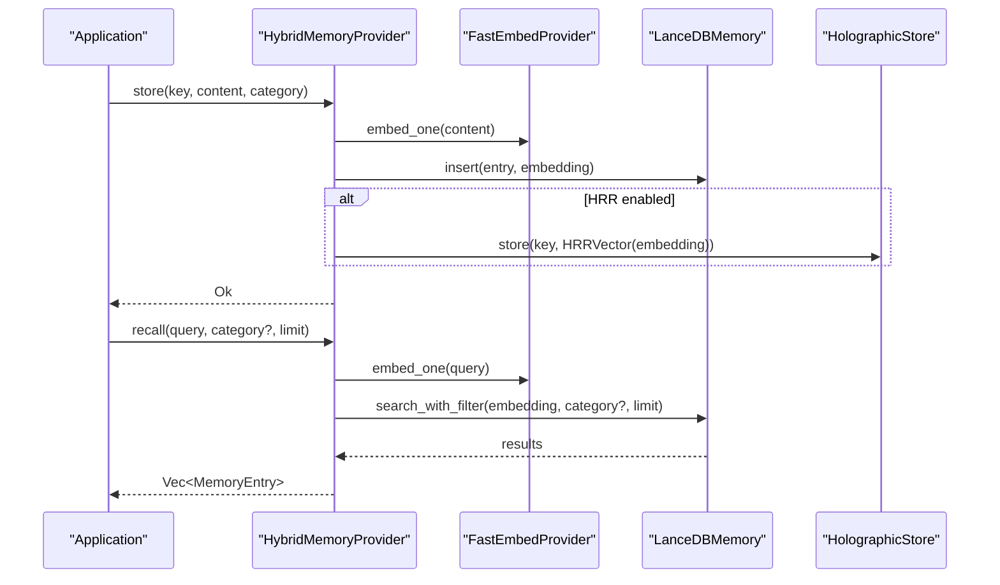
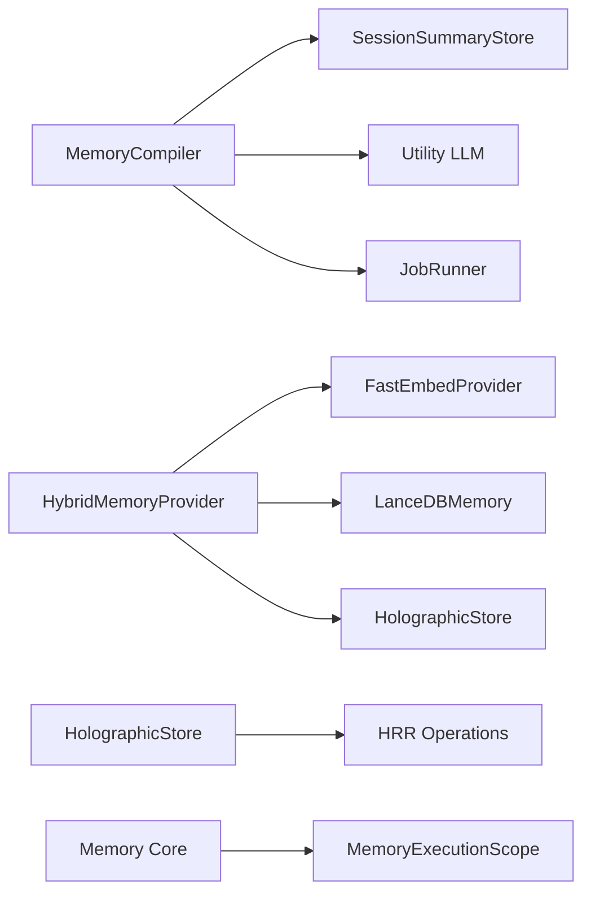

# Memory System Modules

<cite>
**Referenced Files in This Document**
- [memory/mod.rs](file://src-tauri/src/modules/memory/mod.rs)
- [memory/compiler/mod.rs](file://src-tauri/src/modules/memory/compiler/mod.rs)
- [memory/embedding/mod.rs](file://src-tauri/src/modules/memory/embedding/mod.rs)
- [memory/embedding/fastembed.rs](file://src-tauri/src/modules/memory/embedding/fastembed.rs)
- [memory/embedding/mock.rs](file://src-tauri/src/modules/memory/embedding/mock.rs)
- [memory/hrr/mod.rs](file://src-tauri/src/modules/memory/hrr/mod.rs)
- [memory/hrr/integration.rs](file://src-tauri/src/modules/memory/hrr/integration.rs)
- [memory/hrr/operations.rs](file://src-tauri/src/modules/memory/hrr/operations.rs)
- [memory/hrr/store.rs](file://src-tauri/src/modules/memory/hrr/store.rs)
- [memory/pinned/mod.rs](file://src-tauri/src/modules/memory/pinned/mod.rs)
- [memory/job_runner.rs](file://src-tauri/src/modules/memory/job_runner.rs)
- [memory/security.rs](file://src-tauri/src/modules/memory/security.rs)
- [memory/ticker.rs](file://src-tauri/src/modules/memory/ticker.rs)
- [memory/working_memory.rs](file://src-tauri/src/modules/memory/working_memory.rs)
- [memory/policy.rs](file://src-tauri/src/modules/memory/policy.rs)
- [memory/promotion.rs](file://src-tauri/src/modules/memory/promotion.rs)
- [memory/retrieval.rs](file://src-tauri/src/modules/memory/retrieval.rs)
- [memory/audit.rs](file://src-tauri/src/modules/memory/audit.rs)
- [memory/compat.rs](file://src-tauri/src/modules/memory/compat.rs)
- [memory/inject.rs](file://src-tauri/src/modules/memory/inject.rs)
- [memory/intent.rs](file://src-tauri/src/modules/memory/intent.rs)
- [memory/summary/mod.rs](file://src-tauri/src/modules/memory/summary/mod.rs)
- [memory/providers/mod.rs](file://src-tauri/src/modules/memory/providers/mod.rs)
- [memory/scope.rs](file://src-tauri/src/modules/memory/scope.rs)
</cite>

## Table of Contents
1. [Introduction](#introduction)
2. [Project Structure](#project-structure)
3. [Core Components](#core-components)
4. [Architecture Overview](#architecture-overview)
5. [Detailed Component Analysis](#detailed-component-analysis)
6. [Dependency Analysis](#dependency-analysis)
7. [Performance Considerations](#performance-considerations)
8. [Troubleshooting Guide](#troubleshooting-guide)
9. [Conclusion](#conclusion)
10. [Appendices](#appendices)

## Introduction
This document explains the memory system modules that power long-term memory, compilation, embedding, Holographic Reduced Representations (HRR), pinned memory, and supporting subsystems. It covers the compiler subsystem (assemble, facts, fingerprint, longterm, today, week), embedding system (fastembed, mock), HRR integration, pinned memory management, vector providers, summary system, and job runner components. It also documents memory audit, compatibility layer, injection system, intent recognition, security scanning, ticker system, working memory management, policy enforcement, promotion mechanisms, and retrieval strategies. Practical examples illustrate memory lifecycle management, vector operations, and security scanning workflows.

## Project Structure
The memory subsystem is organized under src-tauri/src/modules/memory with modularized concerns:
- Core traits and types: MemoryProvider, MemoryEntry, MemoryCategory, scope helpers
- Compiler orchestration: assemble, facts, fingerprint, longterm, today, week
- Embedding providers: FastEmbed and Mock
- HRR algebraic reasoning: operations, store, integration with vector providers
- Pinned memory: store and types
- Supporting services: audit, compatibility, injection, intent, policy, promotion, retrieval, security, ticker, working memory, summary, providers, scope

```mermaid
graph TB
subgraph "Memory Core"
MOD["memory/mod.rs"]
SCOPE["scope.rs"]
PROVIDERS["providers/mod.rs"]
end
subgraph "Compiler"
COMPILER["compiler/mod.rs"]
TODAY["compiler/today.rs"]
WEEK["compiler/week.rs"]
LONGTERM["compiler/longterm.rs"]
FACTS["compiler/facts.rs"]
ASSEMBLE["compiler/assemble.rs"]
FP["compiler/fingerprint.rs"]
end
subgraph "Embedding"
EMBEDMOD["embedding/mod.rs"]
FASTEMBED["embedding/fastembed.rs"]
MOCKEMB["embedding/mock.rs"]
end
subgraph "HRR"
HRRMOD["hrr/mod.rs"]
OPS["hrr/operations.rs"]
STORE["hrr/store.rs"]
INTEGRATION["hrr/integration.rs"]
end
subgraph "Support"
JOB["job_runner.rs"]
AUDIT["audit.rs"]
COMPAT["compat.rs"]
INJECT["inject.rs"]
INTENT["intent.rs"]
POLICY["policy.rs"]
PROMO["promotion.rs"]
RETRIEVAL["retrieval.rs"]
SECURITY["security.rs"]
TICKER["ticker.rs"]
WORKMEM["working_memory.rs"]
SUMMARY["summary/mod.rs"]
PINNED["pinned/mod.rs"]
end
MOD --> COMPILER
MOD --> EMBEDMOD
MOD --> HRRMOD
MOD --> PINNED
MOD --> SUMMARY
MOD --> PROVIDERS
MOD --> JOB
MOD --> AUDIT
MOD --> COMPAT
MOD --> INJECT
MOD --> INTENT
MOD --> POLICY
MOD --> PROMO
MOD --> RETRIEVAL
MOD --> SECURITY
MOD --> TICKER
MOD --> WORKMEM
COMPILER --> TODAY
COMPILER --> WEEK
COMPILER --> LONGTERM
COMPILER --> FACTS
COMPILER --> ASSEMBLE
COMPILER --> FP
EMBEDMOD --> FASTEMBED
EMBEDMOD --> MOCKEMB
HRRMOD --> OPS
HRRMOD --> STORE
HRRMOD --> INTEGRATION
INTEGRATION --> PROVIDERS
INTEGRATION --> OPS
INTEGRATION --> STORE
```

**Diagram sources**
- [memory/mod.rs:1-517](file://src-tauri/src/modules/memory/mod.rs#L1-L517)
- [memory/compiler/mod.rs:1-412](file://src-tauri/src/modules/memory/compiler/mod.rs#L1-L412)
- [memory/embedding/mod.rs:1-11](file://src-tauri/src/modules/memory/embedding/mod.rs#L1-L11)
- [memory/hrr/mod.rs:1-24](file://src-tauri/src/modules/memory/hrr/mod.rs#L1-L24)
- [memory/pinned/mod.rs:1-24](file://src-tauri/src/modules/memory/pinned/mod.rs#L1-L24)

**Section sources**
- [memory/mod.rs:1-517](file://src-tauri/src/modules/memory/mod.rs#L1-L517)

## Core Components
- MemoryProvider trait: Defines store, recall, delete, purge_category, clear_all, export, scoped variants, promote/demote scope, and importance decay hooks.
- MemoryEntry: Persistent memory record with key, content, category, timestamps, importance, access_count, trust_score, and optional session/project scoping.
- MemoryCategory: Enumerated categories (Core, Daily, Conversation, Custom) with string conversion.
- Scope utilities: entry_matches_scope_default enforces three-tier visibility (session+project, session-only, project-only, global).
- Default providers: SqliteMemoryProvider and VectorMemoryProvider (FastEmbed + LanceDB), with InMemoryMemoryProvider for tests.

Key responsibilities:
- Storage abstraction and scope-aware operations
- Persistence and export for UI and diagnostics
- Backward-compatible provider upgrades via promote/demote scope and apply_importance_decay

**Section sources**
- [memory/mod.rs:96-380](file://src-tauri/src/modules/memory/mod.rs#L96-L380)

## Architecture Overview
The memory system integrates multiple subsystems:
- Compiler orchestrates daily/weekly/long-term compilation and assembly into a unified memory.md
- Embedding providers supply offline-fast 384-d vectors
- HRR enables algebraic reasoning (bind/unbind/bundle/similarity) with capacity-limited in-memory store
- HybridMemoryProvider combines LanceDB (ANN) and HRR (algebraic reasoning)
- Pinned memory stores curated items per scope
- Security, audit, compatibility, injection, intent, policy, promotion, retrieval, ticker, and working memory support lifecycle and safety

**Diagram sources**
- [memory/compiler/mod.rs:107-267](file://src-tauri/src/modules/memory/compiler/mod.rs#L107-L267)
- [memory/embedding/fastembed.rs:31-107](file://src-tauri/src/modules/memory/embedding/fastembed.rs#L31-L107)
- [memory/hrr/integration.rs:59-263](file://src-tauri/src/modules/memory/hrr/integration.rs#L59-L263)
- [memory/pinned/mod.rs:17-24](file://src-tauri/src/modules/memory/pinned/mod.rs#L17-L24)
- [memory/security.rs](file://src-tauri/src/modules/memory/security.rs)
- [memory/audit.rs](file://src-tauri/src/modules/memory/audit.rs)
- [memory/policy.rs](file://src-tauri/src/modules/memory/policy.rs)
- [memory/promotion.rs](file://src-tauri/src/modules/memory/promotion.rs)
- [memory/retrieval.rs](file://src-tauri/src/modules/memory/retrieval.rs)
- [memory/ticker.rs](file://src-tauri/src/modules/memory/ticker.rs)
- [memory/working_memory.rs](file://src-tauri/src/modules/memory/working_memory.rs)
- [memory/inject.rs](file://src-tauri/src/modules/memory/inject.rs)
- [memory/intent.rs](file://src-tauri/src/modules/memory/intent.rs)

## Detailed Component Analysis

### Compiler Subsystem (assemble, facts, fingerprint, longterm, today, week)
- Orchestrator: MemoryCompiler holds SessionSummaryStore, Utility LLM, JobRunner, and CompilerConfig. It exposes compile_today, compile_week, compile_longterm, compile_facts, and assemble.
- Paths: CompilePaths bundles root and individual artifact paths (today.md, week.md, longterm.md, facts.md, memory.md).
- Fingerprint: MD5 caching and .fingerprint sidecars to avoid redundant LLM work.
- Assembly: Concatenates compiled artifacts into memory.md with locale-aware section headers.

**Diagram sources**
- [memory/compiler/mod.rs:158-266](file://src-tauri/src/modules/memory/compiler/mod.rs#L158-L266)

**Section sources**
- [memory/compiler/mod.rs:47-267](file://src-tauri/src/modules/memory/compiler/mod.rs#L47-L267)

### Embedding System (fastembed, mock)
- FastEmbedProvider: Offline, CPU-friendly 384-d embeddings using multilingual-e5-small; supports embed_one and batch embed; validates dimension and rejects empty text.
- MockEmbedder: Deterministic, unit-norm 384-d vectors derived from hashed input; used for tests without external model downloads.

**Diagram sources**
- [memory/embedding/fastembed.rs:31-107](file://src-tauri/src/modules/memory/embedding/fastembed.rs#L31-L107)
- [memory/embedding/mock.rs:27-67](file://src-tauri/src/modules/memory/embedding/mock.rs#L27-L67)

**Section sources**
- [memory/embedding/mod.rs:1-11](file://src-tauri/src/modules/memory/embedding/mod.rs#L1-L11)
- [memory/embedding/fastembed.rs:18-107](file://src-tauri/src/modules/memory/embedding/fastembed.rs#L18-L107)
- [memory/embedding/mock.rs:16-67](file://src-tauri/src/modules/memory/embedding/mock.rs#L16-L67)

### HRR Integration and Algebraic Reasoning
- Operations: HRRVector with bind, unbind, bundle, similarity; circular convolution implementation.
- Store: Capacity-limited in-memory store with LRU eviction and importance scoring; supports probe, contradict detection, and trust adjustment.
- Integration: HybridMemoryProvider composes FastEmbedProvider, LanceDBMemory, and HolographicStore; supports vector_search, HRR search, bind/unbind, contradiction detection, and dual writes.

**Diagram sources**
- [memory/hrr/operations.rs:8-102](file://src-tauri/src/modules/memory/hrr/operations.rs#L8-L102)
- [memory/hrr/store.rs:43-299](file://src-tauri/src/modules/memory/hrr/store.rs#L43-L299)
- [memory/hrr/integration.rs:59-263](file://src-tauri/src/modules/memory/hrr/integration.rs#L59-L263)

**Section sources**
- [memory/hrr/mod.rs:1-24](file://src-tauri/src/modules/memory/hrr/mod.rs#L1-L24)
- [memory/hrr/operations.rs:42-141](file://src-tauri/src/modules/memory/hrr/operations.rs#L42-L141)
- [memory/hrr/store.rs:53-299](file://src-tauri/src/modules/memory/hrr/store.rs#L53-L299)
- [memory/hrr/integration.rs:66-263](file://src-tauri/src/modules/memory/hrr/integration.rs#L66-L263)

### Pinned Memory Management
- PinnedStore interface and SqlitePinnedStore implementation manage curated items per scope with caps and character limits.
- Types: PinnedItem, PinScope, PinSource; constants MAX_PINS_PER_SCOPE and MAX_PIN_CONTENT_CHARS enforce limits.
- Integration: Future wiring will expose list_all_for_prompt and UI editor.

**Diagram sources**
- [memory/pinned/mod.rs:17-24](file://src-tauri/src/modules/memory/pinned/mod.rs#L17-L24)
- [memory/mod.rs:152-162](file://src-tauri/src/modules/memory/mod.rs#L152-L162)

**Section sources**
- [memory/pinned/mod.rs:1-24](file://src-tauri/src/modules/memory/pinned/mod.rs#L1-L24)
- [memory/mod.rs:152-162](file://src-tauri/src/modules/memory/mod.rs#L152-L162)

### Vector Providers and Hybrid Memory
- VectorMemoryProvider: Backed by FastEmbed + LanceDB; supports vector search and hybrid integration.
- HybridMemoryProvider: Dual-path writes (LanceDB + HRR) and optional HRR-only operations; exposes vector_search, hrr_search, hrr_bind, hrr_unbind, detect_contradiction.

**Diagram sources**
- [memory/hrr/integration.rs:294-402](file://src-tauri/src/modules/memory/hrr/integration.rs#L294-L402)
- [memory/embedding/fastembed.rs:69-101](file://src-tauri/src/modules/memory/embedding/fastembed.rs#L69-L101)

**Section sources**
- [memory/hrr/integration.rs:59-263](file://src-tauri/src/modules/memory/hrr/integration.rs#L59-L263)
- [memory/embedding/fastembed.rs:31-107](file://src-tauri/src/modules/memory/embedding/fastembed.rs#L31-L107)

### Summary System
- SessionSummaryStore: Persists per-session summaries; used by compiler stages to drive today/week/longterm/facts generation.
- SummarySource: Tracks origin of summary records.
- NullSessionSummaryStore and SqliteSessionSummaryStore provide test and production implementations.

**Section sources**
- [memory/summary/mod.rs](file://src-tauri/src/modules/memory/summary/mod.rs)

### Job Runner Components
- JobRunner: Schedules and executes memory jobs (e.g., compilation, rolling summaries) with retries and status tracking.
- Re-exports: JobAttempt, JobStatus, JobError for UI and orchestration.

**Section sources**
- [memory/job_runner.rs](file://src-tauri/src/modules/memory/job_runner.rs)
- [memory/mod.rs:32-38](file://src-tauri/src/modules/memory/mod.rs#L32-L38)

### Security Scanning
- Security scanner inspects memory artifacts and ingestion paths for policy compliance and threats.
- Integration points: pre-store hooks, post-assembly scans, and policy enforcement.

**Section sources**
- [memory/security.rs](file://src-tauri/src/modules/memory/security.rs)

### Ticker System
- MemoryTicker coordinates daily compilation triggers (notify_session_end, do_daily) and sequences compile_today, compile_week, compile_longterm, and assemble.

**Section sources**
- [memory/ticker.rs](file://src-tauri/src/modules/memory/ticker.rs)

### Working Memory Management
- WorkingMemory maintains short-term context for agent loops and retrieval; integrates with scope and policy.

**Section sources**
- [memory/working_memory.rs](file://src-tauri/src/modules/memory/working_memory.rs)

### Policy Enforcement and Promotion Mechanisms
- Policy engine governs memory access, scope visibility, and retention policies.
- Promotion/Demotion: Moves entries across session → project → global scope; supports rollback.

**Section sources**
- [memory/policy.rs](file://src-tauri/src/modules/memory/policy.rs)
- [memory/promotion.rs](file://src-tauri/src/modules/memory/promotion.rs)

### Retrieval Strategies
- Hybrid retrieval: Vector similarity (LanceDB) + HRR algebraic reasoning (when enabled).
- Scope-aware recall: Filters by session/project/global visibility.

**Section sources**
- [memory/retrieval.rs](file://src-tauri/src/modules/memory/retrieval.rs)
- [memory/mod.rs:276-314](file://src-tauri/src/modules/memory/mod.rs#L276-L314)

### Memory Audit, Compatibility Layer, Injection System, Intent Recognition
- Audit: Emits structured events for memory lifecycle actions.
- Compatibility: Bridges legacy providers and new APIs.
- Injection: Builds memory injections for system prompts using CHAR estimates.
- Intent: Interprets user intent for memory actions (e.g., pin, recall).

**Section sources**
- [memory/audit.rs](file://src-tauri/src/modules/memory/audit.rs)
- [memory/compat.rs](file://src-tauri/src/modules/memory/compat.rs)
- [memory/inject.rs](file://src-tauri/src/modules/memory/inject.rs)
- [memory/intent.rs](file://src-tauri/src/modules/memory/intent.rs)

## Dependency Analysis
- Coupling: MemoryCompiler depends on SessionSummaryStore, Utility LLM, JobRunner, and CompilerConfig.
- Embedding: HybridMemoryProvider depends on FastEmbedProvider and LanceDBMemory; HRR store depends on HRRVector operations.
- Scope: All provider operations depend on MemoryExecutionScope and entry_matches_scope_default.
- External libraries: fastembed, lancedb, tokio, serde, rusqlite, ulid, chrono, scopeguard, anyhow.

**Diagram sources**
- [memory/compiler/mod.rs:113-156](file://src-tauri/src/modules/memory/compiler/mod.rs#L113-L156)
- [memory/hrr/integration.rs:66-104](file://src-tauri/src/modules/memory/hrr/integration.rs#L66-L104)
- [memory/hrr/store.rs:47-73](file://src-tauri/src/modules/memory/hrr/store.rs#L47-L73)
- [memory/mod.rs:179-199](file://src-tauri/src/modules/memory/mod.rs#L179-L199)

**Section sources**
- [memory/compiler/mod.rs:113-156](file://src-tauri/src/modules/memory/compiler/mod.rs#L113-L156)
- [memory/hrr/integration.rs:66-104](file://src-tauri/src/modules/memory/hrr/integration.rs#L66-L104)
- [memory/hrr/store.rs:47-73](file://src-tauri/src/modules/memory/hrr/store.rs#L47-L73)
- [memory/mod.rs:179-199](file://src-tauri/src/modules/memory/mod.rs#L179-L199)

## Performance Considerations
- Embedding: FastEmbedProvider is CPU-only and offline; batch embed for throughput; dimension validation prevents misalignment.
- HRR: O(n²) circular convolution per bind/unbind; suitable for interactive use; consider disabling for high-volume batch processing.
- Hybrid provider: Dual writes increase latency; enable HRR only when algebraic reasoning is required.
- Compiler: Fingerprint caching avoids redundant LLM calls; assemble is synchronous file I/O.
- Scope filtering: Prefer provider overrides (export_scoped/recall_scoped) to push filters to storage engines.

## Troubleshooting Guide
Common issues and resolutions:
- Embedding dimension mismatch: Ensure provider dimension matches HRR/LanceDB expectations.
- Empty text embedding: Validate inputs before calling embed_one.
- HRR capacity exceeded: Reduce HRR usage or increase capacity via config (if exposed).
- Scope visibility: Verify MemoryExecutionScope and entry_matches_scope_default logic.
- Compiler cache hit: Confirm fingerprint presence and checksums.

**Section sources**
- [memory/embedding/fastembed.rs:18-29](file://src-tauri/src/modules/memory/embedding/fastembed.rs#L18-L29)
- [memory/hrr/store.rs:22-33](file://src-tauri/src/modules/memory/hrr/store.rs#L22-L33)
- [memory/mod.rs:179-199](file://src-tauri/src/modules/memory/mod.rs#L179-L199)

## Conclusion
The memory system integrates a robust compiler, offline embeddings, HRR algebraic reasoning, and hybrid vector storage to deliver scalable, secure, and policy-aware long-term memory. Its modular design enables incremental rollout of features (pinned memory, injection, security scanning) while maintaining backward compatibility and strong scope-based visibility controls.

## Appendices

### Examples

- Memory lifecycle management
  - Store: provider.store(key, content, category)
  - Recall: provider.recall(query, category?, limit)
  - Export scoped: provider.export_scoped(category?, scope)
  - Promote scope: provider.promote_scope(key, target_scope)
  - Clear all: provider.clear_all()

- Vector operations
  - Embedding: embedder.embed_one(text)
  - Hybrid search: hybrid.vector_search(query, limit)
  - HRR search: hybrid.hrr_search(query, limit)
  - Bind/Unbind: hybrid.hrr_bind/compose and hybrid.hrr_unbind

- Security scanning workflow
  - Pre-store scan: security.validate_before_store(entry)
  - Post-assembly scan: security.scan_artifacts(memory.md)
  - Policy enforcement: policy.enforce(entry, scope)

[No sources needed since this section provides general guidance]